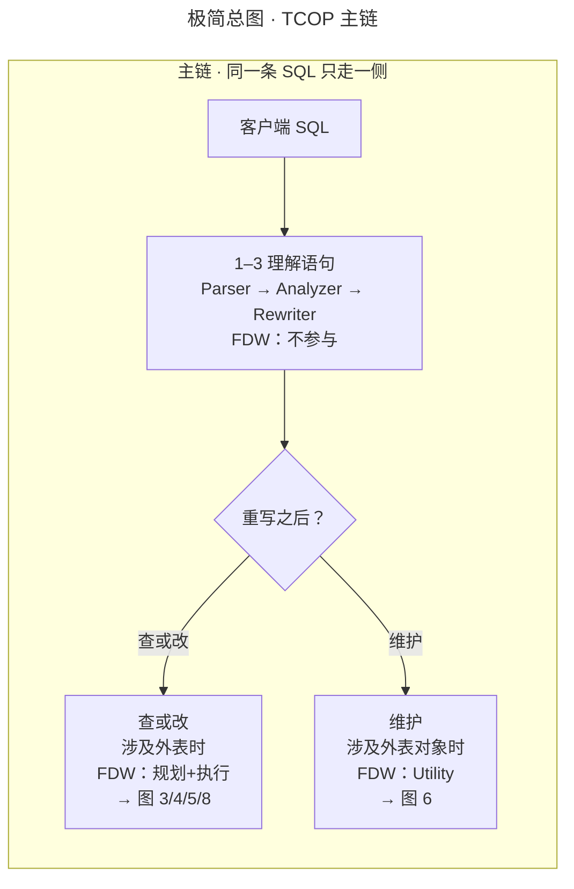
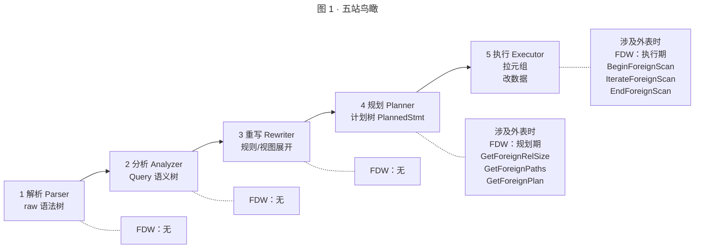
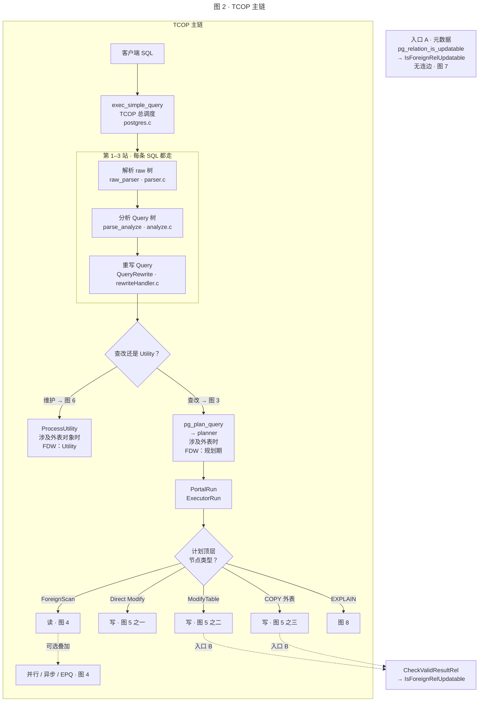
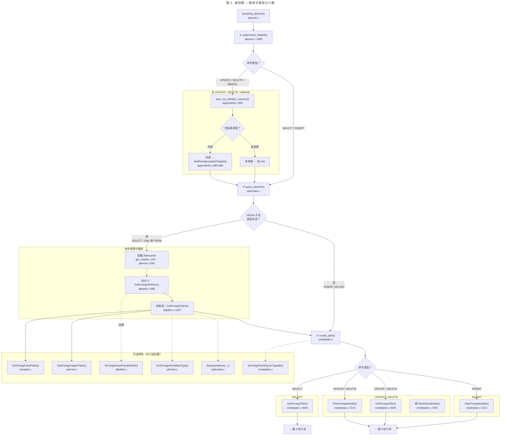
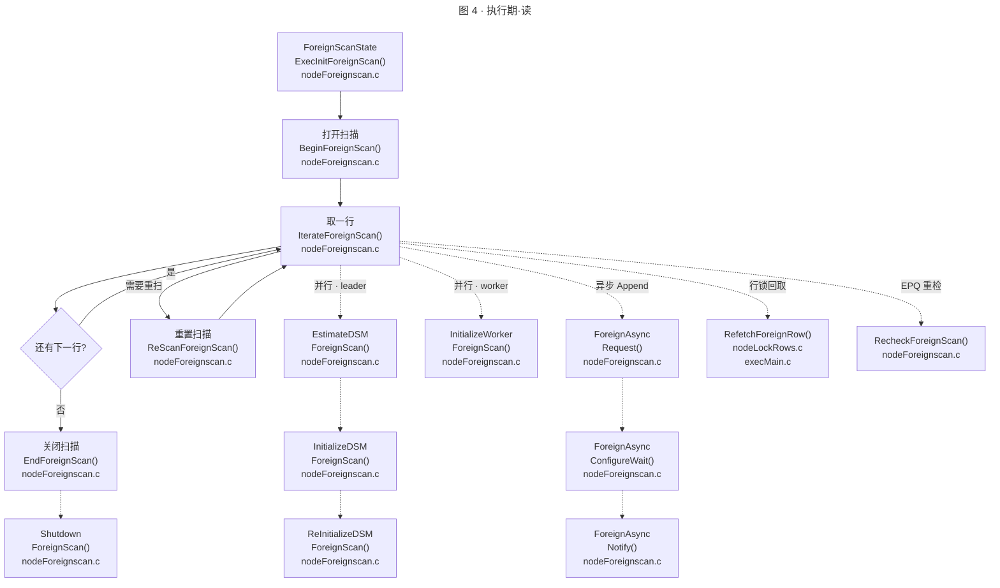
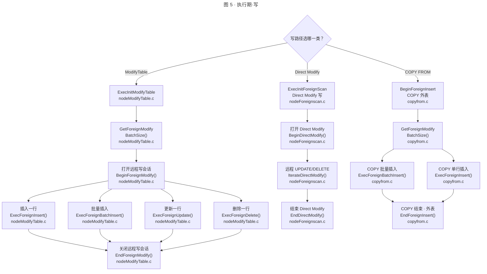
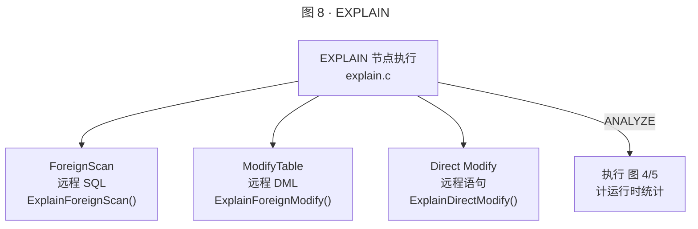
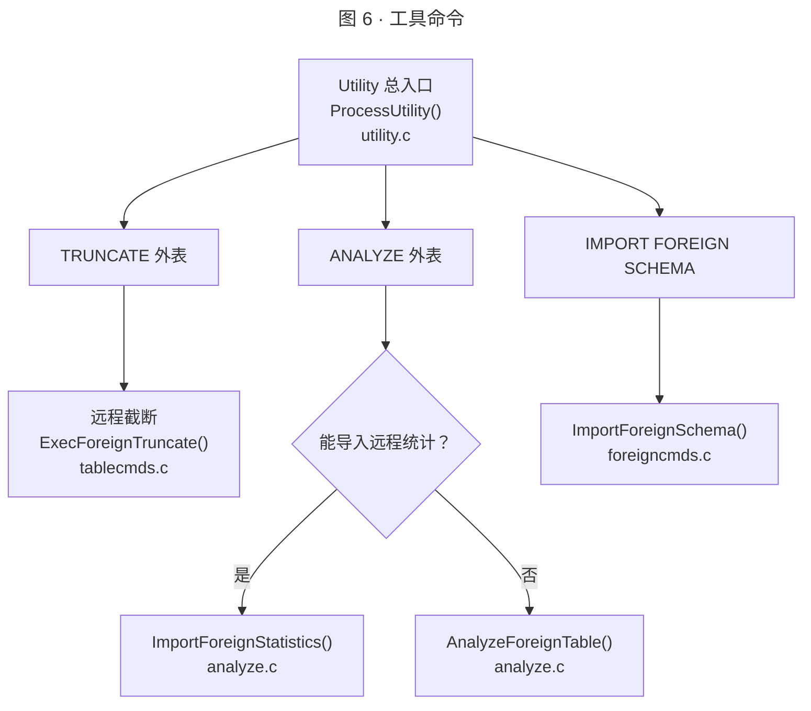
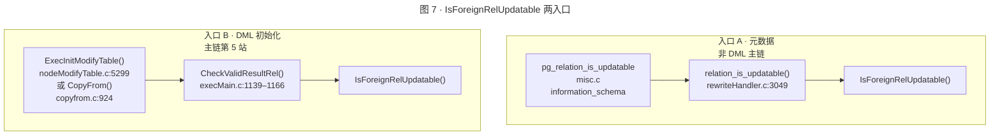

# FDW 回调全链路路线图（FdwRoutine / postgres_fdw）

## 目的

在一条完整 SQL 路径上标注 **Foreign Data Wrapper** 各回调的触发阶段：自 **TCOP**（`exec_simple_query`）经 **Analyzer → Rewriter → Planner → Executor**（参见 [`sql_pipeline_faq.md`](sql_pipeline_faq.md)），至外表扫描、修改与工具命令。以 **postgres_fdw** 为参考实现，对照 `doc/src/sgml/fdwhandler.sgml` 与 `src/include/foreign/fdwapi.h` 中的 `FdwRoutine`。

**相关文档**

| 文档 | 内容 |
|------|------|
| `fdw_planning_walkthrough.md` | 规划期走读 |
| `sql_pipeline_faq.md` | SQL 五站管线（§1.1 TCOP、§5 Planner、§6 Executor） |

**阶段标记**（全文统一）：`plan` = 规划器；`exec` = 执行器（含 `EXPLAIN` 对计划节点的解释回调）；`util` = 独立命令、元数据或规则期，不走典型 SELECT 执行树。

## 3. 主线与分叉（教学路线图）

> **46 回调完整清单、源码行号、postgres_fdw 实现状态见附录**；本节只讲何时、为何调用。规划细节见 `fdw_planning_walkthrough.md`。

### 3.0 三十秒读懂

拿一条最简单的 `SELECT * FROM ft`（ft 是外表）来说：

1. **Parser → Analyzer → Rewriter**：内核把 SQL 文本变成 `Query` 语义树。这三步**不调 FDW**——外表此时只是一个 `RangeTblEntry` 条目。
2. **Planner**（第 4 站）：`Query` 送进优化器，为外表估大小（`GetForeignRelSize`）、选路径（`GetForeignPaths`）、定计划（`GetForeignPlan`）。这是 FDW **第一次**被调用。
3. **Executor**（第 5 站）：`PortalRun` 驱动计划树，对 `ForeignScan` 节点调 `BeginForeignScan` → `IterateForeignScan`（逐行循环）→ `EndForeignScan`，真正从远程拉数据。

以上三步就是 **FDW 的主链**（查或改数据）。同一条 `exec_simple_query` 还可能有另外两条岔路：
- **Utility 岔路**：`TRUNCATE` / `ANALYZE` / `IMPORT FOREIGN SCHEMA` 不走规划+Portal，直接由 `ProcessUtility` 调 FDW。
- **元数据旁路**：`pg_relation_is_updatable('ft')` 不问执行器，由 `rewriteHandler.c` 直接调 `IsForeignRelUpdatable` 返回位图。

下面先展开主线（§3.1），再按 SQL 类型逐一列出分叉路径（§3.2）。

#### 极简总图

> 重写后查改/维护支路仅在**涉及外表**（或外表相关对象）时调 FDW；纯本地 SQL 仍不进 FDW。主链之外的元数据旁路（图 7 入口 A）及 DML 内嵌门禁（入口 B）见 **§3.2 路径 4/5**。

### 3.1 主线：一条 SELECT 从进到出（五站）

下面用 `SELECT * FROM ft` 完整走一遍。`exec_simple_query`（`postgres.c`）依次调用：

| 站 | 内核调用 | FDW 是否参与 | 解释 |
|----|----------|-------------|------|
| **1 解析** | `pg_parse_query` → `raw_parser`（parser.c） | **不参与** | SQL 文本 → 语法树 |
| **2 分析** | `parse_analyze`（analyze.c） | **不参与** | 绑定表名、列名 → `Query` 树（含 `rtable`） |
| **3 重写** | `pg_rewrite_query`（rewriteHandler.c） | **不参与**（主链） | 视图展开、规则应用；外表只是 `RangeTblEntry` |
| **4 规划** | `pg_plan_query` → `planner()` → `create_plan()` | **✓ 参与** | 为外表生成 `ForeignPath` → `ForeignScan` 计划节点 |
| **5 执行** | `PortalRun` → `ExecutorRun` | **✓ 参与** | `ExecInitForeignScan` → `Begin/Iterate/EndForeignScan` |

**"五站" 仅指查或改数据主线**。`TRUNCATE`、`ANALYZE` 等维护命令在第 3 站后走 `ProcessUtility`（不进第 4、5 站）；`pg_relation_is_updatable` 等元数据查询也不经过 Portal。

下面 **图 2** 画出 TCOP 内部的时间线，标出"查改"和"维护"两个岔路口：

**图 2 要点**

- **第 1–3 站** Parser / Analyzer / Rewriter **不调用** FDW。
- **两个菱形** = 两条岔路：Rewriter 之后选查改（→ 图 3）或 Utility（→ 图 6）；Portal 执行后按顶层节点选读（图 4）、写（图 5）或 EXPLAIN（图 8）。
- **规划与执行不同阶段**：图 3 在 `pg_plan_query` 内；图 4/5/8 在 `PortalRun` 后的执行器里。对 `SELECT * FROM ft`，`图 3 + 图 4` 就是主路径。
- **图 7 两入口**（见 **§3.2 路径 5**）：**入口 A** 为与菱形无连边的元数据查询；**入口 B** 用虚线标注在写分支上，属 DML 第 5 站初始化，**在**查改主链内。

**图例**：菱形 ⬦ = 二选一决策点，同一条 SQL 只沿一侧出边。虚线 = 主链外入口或旁路标注。

#### 3.1.1 PortalRun：计划怎么变成执行

`pg_plan_query` 产出 `PlannedStmt` 后，TCOP 创建一个 **Portal**（带名字的查询执行上下文），再由 `PortalRun` → `ExecutorRun` 驱动计划树。`SELECT * FROM ft` 的 FDW 读回调（Begin / Iterate / End）都在这条链上，**不在** `planner()` 内部。

| 步骤 | 内核调用 | 对应图 | FDW 相关 |
|------|----------|--------|----------|
| **1** | `pg_plan_query`：`planner()` → `create_plan()`，生成 `ForeignScan` / `ModifyTable` 等节点 | 图 3 | 规划期回调 |
| **2** | `PortalRun`：按 Portal 策略一次性或分批执行 | — | 进入执行器 |
| **3** | `ExecInitNode`：初始化各计划节点状态 | 图 4/5 | `ExecInitForeignScan` → Begin* |
| **4** | `ExecutorRun`：拉元组或写行 | 图 4/5 | Iterate* / ExecForeign* |

**不走典型 Portal 计划树的 FDW 调用**：图 6（Utility）、图 7 入口 A（`pg_relation_is_updatable`），以及 `COPY FROM` 外表在 `copyfrom.c` 协议内直接调插入回调（不经 `ForeignScan` 节点；入口 B 见 图 5）。

#### 3.1.2 Utility：为什么没有 ForeignScan

`TRUNCATE`、`ANALYZE`、`IMPORT FOREIGN SCHEMA` 等语句走 `ProcessUtility`（`utility.c`），**不**生成 `PlannedStmt`，**不** `PortalRun`，因此不会出现 `ForeignScan` 计划节点。

| 对比 | Portal 路径（SELECT / 增删改 / EXPLAIN） | Utility 路径 |
|------|--------------------------------------|----------------|
| TCOP 入口 | `pg_plan_query` → `PortalRun` | `ProcessUtility` |
| 有无计划树 | 有 | 无 |
| 图号 | 3 + 4 / 5 / 8 | 6 |
| FDW 典型回调 | 规划 + 读/写/EXPLAIN | `ExecForeignTruncate`、`AnalyzeForeignTable`… |

**TRUNCATE 两阶段**：`truncate_check_rel` 只检查 `ExecForeignTruncate != NULL`；真正截断在 `ExecuteTruncateGuts` 调用 `ExecForeignTruncate`（附录二 §2 主表）。

#### `fdwroutine` 何时挂上

| 场景 | 何时 | 挂到哪里 |
|------|------|----------|
| 规划外表 | `get_relation_info` | `RelOptInfo->fdwroutine` |
| 执行 ForeignScan | `ExecInitForeignScan` | `ForeignScanState->fdwroutine` |
| 执行 ModifyTable/COPY 目标 | `InitResultRelInfo` | `ResultRelInfo->ri_FdwRoutine` |
| 查可更新性 | 入口 A：`GetFdwRoutineForRelation`（`relation_is_updatable`）；入口 B：`ResultRelInfo->ri_FdwRoutine`（`CheckValidResultRel`） | 入口 A 不依赖 Portal；入口 B 在 ModifyTable/COPY 初始化时 |

加载 API：`GetFdwRoutineForRelation`（`foreign.c:474`）及 `GetFdwRoutineByRelId`、`GetFdwRoutineByServerId`。

---

### 3.2 第 4 站 · 规划期 — 图 3

> 图 3 回答：不同 SQL 命令在规划期触发哪些 FDW 回调，触发条件是什么。

**代码证据**
| 分支 | 源码 | 说明 |
|------|------|------|
| **INSERT 不调 `AddForeignUpdateTargets`** | `preptlist.c:108-109`: `if (command_type == CMD_INSERT)` → 只调 `expand_insert_targetlist` | INSERT 不补 row identity 列 |
| **SELECT 不调 `AddForeignUpdateTargets`** | `preptlist.c:121-123`: `if (command_type == CMD_UPDATE \|\| ...)` 才调 `add_row_identity_columns` | SELECT 无 result relation，跳过 junk |
| **外表检查在 `add_row_identity_columns` 内部** | `appendinfo.c:985`: `else if (relkind == RELKIND_FOREIGN_TABLE)` → 调 FDW 回调 | 不是 planner 级分支，是 relkind switch |
| **INSERT VALUES 不走扫描回调** | `planmain.c:91-94`: 注释明确说"applies for ... `INSERT ... VALUES()`"；`planmain.c:107-159`: `rtekind == RTE_RESULT` 时直接 `return final_rel` | FROM 为空 → 快速路径，跳过 `add_base_rels_to_query` → 不调 `GetForeignRelSize` |
| **SELECT / DML 带 FROM 走扫描** | `planmain.c:164+`: `add_base_rels_to_query` → `set_rel_size` → `set_foreign_size` → `GetForeignRelSize` | jointree 非空才走完整流程 |
| **`PlanForeignModify` 对所有 DML 调用** | `createplan.c:7175-7214`: `make_modifytable` 中判断 `resultRelInfo->ri_FdwRoutine` 后调用 | INSERT/UPDATE/DELETE 都经此 |
| **`GetForeignPlan` 仅对外表扫描调用** | `createplan.c:779`: `T_ForeignScan` 分支 → `create_foreignscan_plan` → `GetForeignPlan` | SELECT / DML 子查询才走 |

**命令类型对比**

| 回调 | `SELECT * FROM ft` | `INSERT INTO ft VALUES(...)` | `UPDATE ft SET ...` | `DELETE FROM ft ...` |
|------|:-:|:-:|:-:|:-:|
| AddForeignUpdateTargets | — | — | ✓ | ✓ |
| GetForeignRelSize | ✓ | — (FROM 空，快速路径) | ✓ | ✓ |
| GetForeignPaths | ✓ | — | ✓ | ✓ |
| GetForeignPlan | ✓ | — | ✓ | ✓ |
| PlanForeignModify | — | ✓ | ✓ | ✓ |
| PlanDirectModify | — | — | 可选（整句下推时） | 可选（整句下推时） |

- **DML junk 细节**：`grouping_planner` 在 `query_planner` 之前执行 `preprocess_targetlist`（planner.c:1908），对 UPDATE/DELETE/MERGE 的 result rel 调 `add_row_identity_columns()`；外表分支调 `AddForeignUpdateTargets` 补远程 rowid；`UPDATE` 还可能补 `wholerow` Var（appendinfo.c:998–1022）。junk 列随后进入 `ModifyTable` / Direct Modify 计划。
- **可选特性**：虚线 `-.->` 表示"同期考量"或"后置判定"。`GetForeignUpperPaths` 在 `query_planner` 返回**之后**调用；`GetForeignRowMarkType` 经 `preprocess_rowmarks` 可在 junk 之前执行；`IsForeignScanParallelSafe` 与 `GetForeignRelSize` 在同一循环内先后执行。精确时序见 **附录二 §2.1**。
- **postgres_fdw**：12 个 plan 回调中实现 9 个；未实现并行安全、分区重参数化、自定义行锁类型（附录一 §1.6）。

---

### 3.3 第 5 站 · 执行期读 — 图 4

> 图 4 回答：`SELECT` 外表时，执行器如何逐行向 FDW 要数据；可选并行/异步/EPQ 如何叠在同一扫描上。

- 执行器在 `ForeignNext` 里**循环**调用 `IterateForeignScan`，每取一行调一次，不是只调一次。
- **触发条件**：计划含 `ForeignScan` 且 `operation = SELECT`；经 **图 2** `PortalRun`。
- **与主流程关系**：**图 2** **读路径**（「读 · 图 4」分支）；**7 个必填回调**中后 4 个在此（`BeginForeignScan` … `EndForeignScan`）。
- **postgres_fdw**：实现读路径 + 异步 + EPQ；**未**实现 Gather 并行 DSM（附录一 §1.6）。

---

### 3.4 分叉 · 执行期写 — 图 5

> 图 5 回答：写外表时走 ModifyTable、整句 Direct Modify，还是 COPY 协议；各路径回调有何不同。

- **触发条件**：`INSERT`/`UPDATE`/`DELETE`/`COPY FROM` 目标为外表；规划期见 **§3.8 路径 2/3**（`AddForeignUpdateTargets` → `PlanForeignModify` 或 `PlanDirectModify`）。执行期在 `ExecInitModifyTable` / `CopyFrom` 内经**入口 B** `CheckValidResultRel` → `IsForeignRelUpdatable`（早于 `ExecInitNode` 子计划）。
- **junk 在实际执行中的作用**：规划期补入的 junk 列（ctid / 远程 rowid / wholerow）随 `ForeignScan` 或 `ModifyTable` 子计划下发；`ExecForeignUpdate` / `ExecForeignDelete` 据此构造远程 `WHERE` 子句（postgres_fdw 在 `deparse.c` 完成）。Direct Modify 整句下推时 junk 在远程 SQL 内消化，本地不逐行调用 `ExecForeignUpdate`。
- **与主流程关系**：**图 2** **Portal 执行后决策点**的三条写分支（Direct Modify / ModifyTable / COPY）。ModifyTable / COPY 在节点初始化时嵌**入口 B**（`CheckValidResultRel` → `IsForeignRelUpdatable`），与 **图 7** 入口 B 同链。
- **postgres_fdw**：三条写路径均实现；批量插入与 `GetForeignModifyBatchSize` 用于 COPY/批量 INSERT。

---

### 3.5 分叉 · EXPLAIN — 图 8

> 图 8 回答：`EXPLAIN` 如何打印远程 SQL，与真正执行有何区别。

- **触发条件**：`EXPLAIN` 语句；规划仍走 **图 3**。
- **与主流程关系**：**图 2** **EXPLAIN 路径**（「图 8」分支）；默认**不**调用 `IterateForeignScan`（除非 ANALYZE）。
- **postgres_fdw**：三个 Explain 回调均实现。

---

### 3.6 岔路 · 工具命令（Utility）— 图 6

> 图 6 回答：维护类 SQL 不经过计划树时，FDW 在哪里被调用。

- **触发条件**：TCOP 判定为 Utility（§3.1.2）；**无** `ForeignScan`。
- **与主流程关系**：**图 2** **Utility 维护路径**；与读路径、ModifyTable 写路径 **互斥**。
- **postgres_fdw**：四项 util 回调均实现（附录一 §1.3）。

---

### 3.7 旁路 · 可更新性（两入口）— 图 7

> 图 7 回答：内核在哪些场景下、经哪条调用链问 FDW「这张外表支持哪些增删改」。

- **入口 A**：全库仅 `misc.c` 的 `pg_relation_is_updatable` / `pg_column_is_updatable` 及 `information_schema` 会调入 `relation_is_updatable`；分析可更新视图时递归到底层外表（`rewriteHandler.c:3113`）。**直接** `UPDATE ft` 不经过此入口。
- **入口 B**：`ExecInitModifyTable` 在 `ExecInitNode(subplan)` **之前**调 `CheckValidResultRel`（`nodeModifyTable.c:5296–5309`）；`COPY FROM` 外表在 `CopyFrom` 同理（`copyfrom.c:924`）。与规划期 `AddForeignUpdateTargets`（junk）同属一条 DML 的 plan → exec 先后阶段。
- **与主流程关系**：入口 A 对应 **图 2** 与菱形无连边的元数据节点；入口 B 嵌在 **图 5** 写路径初始化，**不**是 TCOP 第三条分叉。
- **postgres_fdw**：实现；返回 INSERT/UPDATE/DELETE 位图（`postgresIsForeignRelUpdatable`）。

---

### 3.8 场景速查：按 SQL 类型看回调顺序

> 读完图 3–7 后再看这张速查表。**先从路径 1** 理解 SELECT 主线上 FDW 怎么走；再按需查 2–6 了解不同 SQL 的分叉路线。各回调名称在附录二中可查源码行号。

#### 路径 1 · SELECT 外表（主线）

**一句话**：规划 `GetForeignRelSize → GetForeignPaths → GetForeignPlan`，执行 `BeginForeignScan → IterateForeignScan`（逐行循环）→ `ReScanForeignScan?`（可选重扫）→ `EndForeignScan`。

| 阶段 | 回调 |
|------|------|
| plan | GetForeignRelSize → GetForeignPaths → GetForeignPlan |
| exec | BeginForeignScan → IterateForeignScan（每行）→ ReScanForeignScan? → EndForeignScan |

见 **§3.2 图 3**（主干）+ **§3.3 图 4**（执行）。可选叠加：JOIN/Upper（`GetForeignJoinPaths` / `GetForeignUpperPaths`）、并行（`IsForeignScanParallelSafe` …）、异步（`IsForeignPathAsyncCapable` …）、EPQ（`RecheckForeignScan`）→ **路径 6**。

#### 路径 2 · UPDATE / DELETE 外表（DML 分叉）

从主线 `grouping_planner` 分叉：先补 junk 列（`AddForeignUpdateTargets`，**先于** `query_planner`）→ 再接主干 `GetForeignRelSize → GetForeignPaths → GetForeignPlan` → 再分叉到 `PlanForeignModify` 或 `PlanDirectModify`。

执行期在第 5 站内分叉：行级走 `BeginForeignModify → ExecForeignUpdate/Delete → EndForeignModify`；整句下推送 `BeginDirectModify → IterateDirectModify → EndDirectModify`。执行前嵌 **入口 B**（`CheckValidResultRel` → `IsForeignRelUpdatable`）。

| 阶段 | 回调 |
|------|------|
| plan | GetForeignRowMarkType? → AddForeignUpdateTargets → GetForeignRelSize → GetForeignPaths → GetForeignPlan → PlanForeignModify **或** PlanDirectModify |
| exec 初始化 | `ExecInitModifyTable` → `CheckValidResultRel` → `IsForeignRelUpdatable`（入口 B，早于子计划） |
| exec 行级 | BeginForeignModify → ExecForeignUpdate / ExecForeignDelete → EndForeignModify |
| exec 整句下推 | BeginDirectModify → IterateDirectModify → EndDirectModify |

见 **图 3**（junk + DML 规划）、**§3.4 图 5**（执行写 + 入口 B）、**§3.7 图 7**（两入口详解）。

\*对 `SELECT … FOR UPDATE` 外表，规划期可能先调 `GetForeignRowMarkType`（可选，早于 junk；见附录二 §2.1）。

#### 路径 3 · INSERT / COPY（写分叉）

| 场景 | plan | exec |
|------|------|------|
| `INSERT`（ModifyTable） | PlanForeignModify | BeginForeignModify → ExecForeignInsert/BatchInsert → GetForeignModifyBatchSize → EndForeignModify |
| `COPY FROM` 外表 | — | BeginForeignInsert → GetForeignModifyBatchSize → ExecForeignInsert/BatchInsert → EndForeignInsert（`CopyFrom`，不经 ForeignScan 节点） |

见 **§3.4 图 5**（三支写路径）；可更新性门禁见 **路径 2**（入口 B）。

#### 路径 4 · TRUNCATE / ANALYZE / IMPORT（Utility 岔路）

不走 `pg_plan_query` / `ForeignScan`。典型回调：`ExecForeignTruncate`；`AnalyzeForeignTable` / `ImportForeignStatistics`；`ImportForeignSchema`。见 **§3.6 图 6**、§3.1.2。

#### 路径 5 · `IsForeignRelUpdatable` 两入口（旁路 / 内嵌）

| 入口 | 调用链 | 何时 |
|------|--------|------|
| **A · 元数据** | `pg_relation_is_updatable`（`misc.c`）→ `relation_is_updatable`（`rewriteHandler.c`）→ `IsForeignRelUpdatable` | 查表能力、`information_schema`；分析可更新视图时递归到底层外表 |
| **B · DML 门禁** | `ExecInitModifyTable` / `CopyFrom` → `CheckValidResultRel`（`execMain.c`）→ `IsForeignRelUpdatable` | 直接 DML 外表（入口 B 嵌在查改主链第 5 站，不走入口 A 线） |

见 **§3.7 图 7**。

#### 路径 6 · 增强回调（主线叠加）

| 能力 | 回调 | 图 |
|------|------|-----|
| EXPLAIN | ExplainForeignScan … ExplainDirectModify | §3.5 图 8 |
| Gather 并行 DSM | IsForeignScanParallelSafe … ShutdownForeignScan | 图 4 虚线 |
| Append 异步 | IsForeignPathAsyncCapable … ForeignAsyncNotify | 图 4 虚线 |
| EPQ / 行锁 | GetForeignRowMarkType … RecheckForeignScan | 图 3–4 |
| JOIN / Upper 下推 | GetForeignJoinPaths / GetForeignUpperPaths | 图 3 可选支线 |

---

### 3.9 实现新 FDW：最少要做什么？

| 目标 | 最少回调 | 说明 |
|------|----------|------|
| **能 `SELECT` 外表** | 7 个必填：`GetForeignRelSize`/`GetForeignPaths`/`GetForeignPlan` + `BeginForeignScan`/`IterateForeignScan`/`ReScanForeignScan`/`EndForeignScan` | 规划 3 + 执行 4；handler 在 `CREATE FOREIGN DATA WRAPPER` 时注册 |
| **能 `INSERT`/`UPDATE`/`DELETE`** | 上表 + `PlanForeignModify` … `EndForeignModify`、`AddForeignUpdateTargets`、`IsForeignRelUpdatable` | `AddForeignUpdateTargets` 规划补 rowid；`IsForeignRelUpdatable` 声明能力（DML 时经**入口 B** `CheckValidResultRel` 校验） |
| **能 `TRUNCATE`** | + `ExecForeignTruncate` | Utility 路径，无 ForeignScan |
| **能 `EXPLAIN`** | + `ExplainForeignScan`/`ExplainForeignModify`/`ExplainDirectModify` | 建议与读/写同步实现 |
| **能 `ANALYZE` / `IMPORT SCHEMA`** | + `AnalyzeForeignTable`/`ImportForeignStatistics`/`ImportForeignSchema` | 运维向；可后补 |

其余（JOIN 下推、Upper、并行、异步、Direct Modify、COPY…）在需要对应 SQL 特性时再实现；NULL 表示「不支持该特性」，内核会走回退路径或报错。

---

## 附录一、回调计数（原 §1）

权威来源：`fdwapi.h` 中 `FdwRoutine` 共 **46** 个函数指针；`fdwhandler.sgml` §「Foreign Data Wrapper Callback Routines」说明其中 **7 个扫描相关为必填**，其余可选（NULL 表示不提供）。

| 分类 | API 字段数 | 文档要求 | postgres_fdw 实现 |
|------|------------|----------|-------------------|
| 扫描（plan 3 + exec 4） | 7 | **7 必填** | 7 |
| plan 扩展 | 12 | 可选 | 9（NULL×3） |
| exec 扩展 | 23 | 可选 | 16（NULL×7） |
| util / 元数据 | 4 | 可选 | 4 |
| **合计** | **46** | 7 必填 + 39 可选 | **37** / **NULL×9** |

### 1.1 plan 扩展（12）

本表 12 项为规划阶段的**分类汇总**；其中 `GetForeignRelSize` / `GetForeignPaths` / `GetForeignPlan` 已计入上文「扫描（plan 3 + exec 4）」的 7 个必填扫描回调，**并非**在 46 个 API 之外再增加 12 个接口。

| 回调 | postgres_fdw |
|------|:------------:|
| GetForeignRelSize | Y |
| GetForeignPaths | Y |
| GetForeignPlan | Y |
| GetForeignJoinPaths | Y |
| GetForeignUpperPaths | Y |
| AddForeignUpdateTargets | Y |
| PlanForeignModify | Y |
| PlanDirectModify | Y |
| GetForeignRowMarkType | **N** |
| IsForeignScanParallelSafe | **N** |
| ReparameterizeForeignPathByChild | **N** |
| IsForeignPathAsyncCapable | Y |

**postgres_fdw：9/12**（未实现项见 **N** 行；原因见 §1.6）。

### 1.2 exec 扩展（30）

#### 扫描执行（4，必填）

| 回调 | postgres_fdw |
|------|:------------:|
| BeginForeignScan | Y |
| IterateForeignScan | Y |
| ReScanForeignScan | Y |
| EndForeignScan | Y |

#### 增删改 / Direct Modify / 行锁 / EXPLAIN / TRUNCATE / 并行 / 异步（26）

| 回调 | postgres_fdw |
|------|:------------:|
| BeginForeignModify | Y |
| ExecForeignInsert | Y |
| ExecForeignBatchInsert | Y |
| GetForeignModifyBatchSize | Y |
| ExecForeignUpdate | Y |
| ExecForeignDelete | Y |
| EndForeignModify | Y |
| BeginForeignInsert | Y |
| EndForeignInsert | Y |
| BeginDirectModify | Y |
| IterateDirectModify | Y |
| EndDirectModify | Y |
| RefetchForeignRow | **N** |
| RecheckForeignScan | Y |
| ExplainForeignScan | Y |
| ExplainForeignModify | Y |
| ExplainDirectModify | Y |
| ExecForeignTruncate | Y |
| EstimateDSMForeignScan | **N** |
| InitializeDSMForeignScan | **N** |
| ReInitializeDSMForeignScan | **N** |
| InitializeWorkerForeignScan | **N** |
| ShutdownForeignScan | **N** |
| ForeignAsyncRequest | Y |
| ForeignAsyncConfigureWait | Y |
| ForeignAsyncNotify | Y |

**postgres_fdw：23/30**（未实现：`RefetchForeignRow`；并行 DSM 五件套；原因见 §1.6）。

### 1.3 util / 元数据（4）

| 回调 | postgres_fdw |
|------|:------------:|
| IsForeignRelUpdatable | Y |
| AnalyzeForeignTable | Y |
| ImportForeignStatistics | Y |
| ImportForeignSchema | Y |

**postgres_fdw：4/4**。

### 1.4 必填 7 项与 postgres_fdw

必填扫描回调（`fdwapi.h` 第 212–219 行，文档与注释一致）：`GetForeignRelSize`、`GetForeignPaths`、`GetForeignPlan`、`BeginForeignScan`、`IterateForeignScan`、`ReScanForeignScan`、`EndForeignScan`。**postgres_fdw 全部实现**（`contrib/postgres_fdw/postgres_fdw.c` `postgres_fdw_handler` 第 775–781 行）。

### 1.5 文档与头文件差异

| 符号 | 在 `fdwapi.h` | 在 `fdwhandler.sgml` | 说明 |
|------|---------------|----------------------|------|
| `FdwRoutine` 46 个回调指针 | ✓ | ✓（`fdw-callbacks` 各子节） | 一一对应 |
| `AcquireSampleRowsFunc` | typedef only（非 `FdwRoutine` 成员） | 在 `AnalyzeForeignTable` 叙述中 | FDW 通过 `AnalyzeForeignTable` 输出采样函数指针，由 `analyze.c` 调用 |
| `IsImportableForeignTable` | `foreign.c` 导出函数 | 未列为 FDW 回调 | 规划 `IMPORT` 时由核心调用，非 handler 字段 |

`doc/src/sgml/` 中其余 FDW 提及多为规划说明（`fdw-planning`）、示例 FDW（`postgres-fdw.sgml`）或行锁/并行叙述中的交叉引用，**无**超出上述 46 项的 `FdwRoutine` 回调。

### 1.6 postgres_fdw 未实现原因（NULL×9）

`contrib/postgres_fdw` 无 `*.md`；下列依据为 `postgres_fdw_handler`（`postgres_fdw.c` 约 770–830，仅此处赋值 `routine->*`）、`doc/src/sgml/fdwhandler.sgml` 与核心注释。未赋值的字段由 `makeNode(FdwRoutine)` 置 NULL。

| 回调 | 原因来源 | 摘要 |
|------|----------|------|
| `GetForeignRowMarkType` | `fdwhandler.sgml`（约 1181–1184 行） | 指针为 NULL 时规划器固定 `ROW_MARK_COPY`（`planner.c` `select_rowmark_type` 2864–2867）。远程 `FOR UPDATE/SHARE` 由 `deparse.c` 生成 SQL，非本回调。 |
| `RefetchForeignRow` | `fdwhandler.sgml`（约 1183–1184、1243–1245 行） | 使用 `ROW_MARK_COPY` 时**不会**调用；与上成对省略。本地 EPQ 用 `RecheckForeignScan`；CTID 写入元组供 EPQ（`postgres_fdw.c` 约 8561–8565，`ROW_MARK_COPY`）。 |
| `IsForeignScanParallelSafe` | `fdwhandler.sgml`（约 1541–1546 行）；`allpaths.c` 695–698 | 未定义则外表扫描**不能**在 parallel worker 中执行（`set_rel_consider_parallel` 在指针为 NULL 时直接 return）。核心注释：多 worker 可能对远端各建独立连接且难以与 leader 协调。postgres_fdw **无**专门说明注释。 |
| `EstimateDSMForeignScan` | `fdwhandler.sgml`（约 1557–1559 行） | 与上并行策略一致；省略 Estimate 则 DSM 四件套亦不应实现。 |
| `InitializeDSMForeignScan` | 同上 | 同上 |
| `ReInitializeDSMForeignScan` | 同上 | 同上 |
| `InitializeWorkerForeignScan` | 同上 | 同上 |
| `ShutdownForeignScan` | 同上 | 同上 |
| `ReparameterizeForeignPathByChild` | `fdwhandler.sgml`（约 1715–1722 行） | 分区子表 `partitionwise` 路径重参数化时调整 `ForeignPath.fdw_private`；postgres_fdw 的 `ForeignPath.fdw_private` 仅含 sort/limit 标志（`postgres_fdw.c` 枚举约 282 行起），handler 未注册。 |

> `contrib/postgres_fdw/postgres-fdw.sgml` 中的 `parallel_commit` / `parallel_abort` 指**事务结束**时多 server 并行提交/回滚，与 `IsForeignScanParallelSafe` / Gather 并行扫描无关。

---
## 附录二、主表：FdwRoutine 全回调（46）（原 §2）

**postgres_fdw**：`Y` = `postgres_fdw_handler` 赋值非 NULL；`N` = 留 NULL。

**内核路径**：仅列 `src/backend/` 内在指针非 NULL 时**实际调用** `fdwroutine->…(...)` 的站点（不含仅做 `== NULL` 探测的代码）。同一回调多站点用 ` ` 分行。

> **想看参数签名？** 每个回调的完整函数签名见 `src/include/foreign/fdwapi.h`（208–286 行）或官方文档 `doc/src/sgml/fdwhandler.sgml` 对应子节。

| # | 回调 | fdwhandler.sgml 小节 | 必填/可选 | 内核调用点（函数, file.c:line） | 内核路径 | postgres_fdw |
|---|------|----------------------|-----------|--------------------------------|----------|--------------|
| 1 | GetForeignRelSize | `fdw-callbacks-scan` | **必填** | `set_foreign_size` (allpaths.c:986) | ✓ | Y |
| 2 | GetForeignPaths | `fdw-callbacks-scan` | **必填** | `set_foreign_pathlist` (allpaths.c:1007) | ✓ | Y |
| 3 | GetForeignPlan | `fdw-callbacks-scan` | **必填** | `create_foreignscan_plan` (createplan.c:4004) | ✓ | Y |
| 4 | BeginForeignScan | `fdw-callbacks-scan` | **必填** | `ExecInitForeignScan` (nodeForeignscan.c:285) | ✓ | Y |
| 5 | IterateForeignScan | `fdw-callbacks-scan` | **必填** | `ForeignNext` (nodeForeignscan.c:61) | ✓ | Y |
| 6 | ReScanForeignScan | `fdw-callbacks-scan` | **必填** | `ExecReScanForeignScan` (nodeForeignscan.c:336) | ✓ | Y |
| 7 | EndForeignScan | `fdw-callbacks-scan` | **必填** | `ExecEndForeignScan` (nodeForeignscan.c:309) | ✓ | Y |
| 8 | GetForeignJoinPaths | `fdw-callbacks-join-scan` | 可选 | `add_paths_to_joinrel` (joinpath.c:364) | ✓ | Y |
| 9 | GetForeignUpperPaths | `fdw-callbacks-upper-planning` | 可选 | `grouping_planner` (planner.c:2501) `create_grouping_paths` (planner.c:4487) `create_window_paths` (planner.c:4927) `create_distinct_paths` (planner.c:5168,5343) `create_ordered_paths` (planner.c:5818) `create_partial_grouping_paths` (planner.c:8013) | ✓ | Y |
| 10 | AddForeignUpdateTargets | `fdw-callbacks-update` | 可选 | `add_row_identity_columns` (appendinfo.c:995) | ✓ | Y |
| 11 | PlanForeignModify | `fdw-callbacks-update` | 可选 | `make_modifytable` (createplan.c:7214) | ✓ | Y |
| 12 | BeginForeignModify | `fdw-callbacks-update` | 可选 | `ExecInitModifyTable` (nodeModifyTable.c:5325) | ✓ | Y |
| 13 | ExecForeignInsert | `fdw-callbacks-update` | 可选 | `ExecInsert` (nodeModifyTable.c:1052) `CopyFrom` (copyfrom.c:1411) | ✓ | Y |
| 14 | ExecForeignBatchInsert | `fdw-callbacks-update` | 可选 | `ExecBatchInsert` (nodeModifyTable.c:1662) `CopyFrom` (copyfrom.c:485) | ✓ | Y |
| 15 | GetForeignModifyBatchSize | `fdw-callbacks-update` | 可选 | `ExecInitModifyTable` (nodeModifyTable.c:5770) `CopyFrom` (copyfrom.c:956) `ExecInitPartitionInfo` (execPartition.c:1222) | ✓ | Y |
| 16 | ExecForeignUpdate | `fdw-callbacks-update` | 可选 | `ExecUpdate` (nodeModifyTable.c:2800) | ✓ | Y |
| 17 | ExecForeignDelete | `fdw-callbacks-update` | 可选 | `ExecDelete` (nodeModifyTable.c:1909) | ✓ | Y |
| 18 | EndForeignModify | `fdw-callbacks-update` | 可选 | `ExecEndModifyTable` (nodeModifyTable.c:5817) | ✓ | Y |
| 19 | BeginForeignInsert | `fdw-callbacks-update` | 可选 | `BeginCopyFrom` (copyfrom.c:942) `ExecInitPartitionInfo` (execPartition.c:1209) | ✓ | Y |
| 20 | EndForeignInsert | `fdw-callbacks-update` | 可选 | `EndCopyFrom` (copyfrom.c:1501) `ExecCleanupTupleRouting` (execPartition.c:1441) | ✓ | Y |
| 21 | IsForeignRelUpdatable | `fdw-callbacks-update` | 可选 | `relation_is_updatable` (rewriteHandler.c:3049) `CheckValidResultRel` (execMain.c:1140,1153,1166) | ✓ | Y |
| 22 | PlanDirectModify | `fdw-callbacks-update` | 可选 | `make_modifytable` (createplan.c:7204) | ✓ | Y |
| 23 | BeginDirectModify | `fdw-callbacks-update` | 可选 | `ExecInitForeignScan` (nodeForeignscan.c:282) | ✓ | Y |
| 24 | IterateDirectModify | `fdw-callbacks-update` | 可选 | `ForeignNext` (nodeForeignscan.c:58) | ✓ | Y |
| 25 | EndDirectModify | `fdw-callbacks-update` | 可选 | `ExecEndForeignScan` (nodeForeignscan.c:306) | ✓ | Y |
| 26 | GetForeignRowMarkType | `fdw-callbacks-row-locking` | 可选 | `select_rowmark_type` (planner.c:2865) | ✓ | N |
| 27 | RefetchForeignRow | `fdw-callbacks-row-locking` | 可选 | `ExecLockRows` (nodeLockRows.c:138) `EvalPlanQualFetchRowMark` (execMain.c:2896) | ✓ | N |
| 28 | RecheckForeignScan | `fdw-callbacks-row-locking` | 可选 | `ForeignRecheck` (nodeForeignscan.c:102) | ✓ | Y |
| 29 | ExplainForeignScan | `fdw-callbacks-explain` | 可选 | `show_foreignscan_info` (explain.c:4213) | ✓ | Y |
| 30 | ExplainForeignModify | `fdw-callbacks-explain` | 可选 | `show_modifytable_info` (explain.c:4826) | ✓ | Y |
| 31 | ExplainDirectModify | `fdw-callbacks-explain` | 可选 | `show_foreignscan_info` (explain.c:4208) | ✓ | Y |
| 32 | AnalyzeForeignTable | `fdw-callbacks-analyze` | 可选 | `analyze_rel`→外表分支 (analyze.c:238) `acquire_inherited_sample_rows` (analyze.c:1545) | ✓ | Y |
| 33 | ImportForeignStatistics | `fdw-callbacks-analyze` | 可选 | `analyze_rel`→外表分支 (analyze.c:231) | ✓ | Y |
| 34 | ImportForeignSchema | `fdw-callbacks-import` | 可选 | `ImportForeignSchema` (foreigncmds.c:1623) | ✓ | Y |
| 35 | ExecForeignTruncate | `fdw-callbacks-truncate` | 可选 | `ExecuteTruncateGuts` (tablecmds.c:2328) | ✓ | Y |
| 36 | IsForeignScanParallelSafe | `fdw-callbacks-parallel` | 可选 | `set_rel_consider_parallel` (allpaths.c:705) | ✓ | N |
| 37 | EstimateDSMForeignScan | `fdw-callbacks-parallel` | 可选 | `ExecForeignScanEstimate` (nodeForeignscan.c:362) | ✓ | N |
| 38 | InitializeDSMForeignScan | `fdw-callbacks-parallel` | 可选 | `ExecForeignScanInitializeDSM` (nodeForeignscan.c:385) | ✓ | N |
| 39 | ReInitializeDSMForeignScan | `fdw-callbacks-parallel` | 可选 | `ExecForeignScanReInitializeDSM` (nodeForeignscan.c:407) | ✓ | N |
| 40 | InitializeWorkerForeignScan | `fdw-callbacks-parallel` | 可选 | `ExecForeignScanInitializeWorker` (nodeForeignscan.c:429) | ✓ | N |
| 41 | ShutdownForeignScan | `fdw-callbacks-parallel` | 可选 | `ExecShutdownForeignScan` (nodeForeignscan.c:446) | ✓ | N |
| 42 | ReparameterizeForeignPathByChild | `fdw-callbacks-reparameterize-paths` | 可选 | `reparameterize_path_by_child` (pathnode.c:4212) | ✓ | N |
| 43 | IsForeignPathAsyncCapable | `fdw-callbacks-async` | 可选 | `mark_async_capable_plan` (createplan.c:1170) | ✓ | Y |
| 44 | ForeignAsyncRequest | `fdw-callbacks-async` | 可选 | `ExecAsyncForeignScanRequest` (nodeForeignscan.c:462) | ✓ | Y |
| 45 | ForeignAsyncConfigureWait | `fdw-callbacks-async` | 可选 | `ExecAsyncForeignScanConfigureWait` (nodeForeignscan.c:478) | ✓ | Y |
| 46 | ForeignAsyncNotify | `fdw-callbacks-async` | 可选 | `ExecAsyncForeignScanNotify` (nodeForeignscan.c:494) | ✓ | Y |

**TRUNCATE 校验**：`truncate_check_rel` (tablecmds.c:2442) 仅检查 `ExecForeignTruncate != NULL`，不调用；实际调用在 `ExecuteTruncateGuts`。

**内核覆盖**：46/46 在 `src/backend/` 均有实际调用路径（上表「内核路径」列均为 ✓）。各回调从 TCOP 到直接调用者的上游入口见 **附录二 §2.1**；最小触发 SQL 见 **附录三**；**何时、为何**调用见 **§3** 教学路线图。

### 2.1 上游触发链（plan / exec）

主表「内核调用点」列给出**直接**调用 `fdwroutine->…` 的函数；下表补充上层调度入口。复杂项用 ` ` 分行。

#### 2.1.1 plan

| # | 回调名 | 直接调用 | 上游入口 |
|---|--------|----------|----------|
| 1 | GetForeignRelSize | `set_foreign_size` (allpaths.c:986) | `set_rel_size` (allpaths.c:439) → 外表 RTE 分支 |
| 2 | GetForeignPaths | `set_foreign_pathlist` (allpaths.c:1007) | `set_rel_pathlist` (allpaths.c:536) → 外表 RTE 分支 |
| 3 | GetForeignPlan | `create_foreignscan_plan` (createplan.c:4004) | `create_plan` (createplan.c:779) → ForeignPath 计划节点 |
| 8 | GetForeignJoinPaths | `add_paths_to_joinrel` (joinpath.c:364) | 连接 rel 路径生成 |
| 9 | GetForeignUpperPaths | `grouping_planner` 等 (planner.c) | `create_grouping_paths` (4487) `create_window_paths` (4927) `create_distinct_paths` (5168, 5343) `create_ordered_paths` (5818) `create_partial_grouping_paths` (8013) |
| 10 | AddForeignUpdateTargets | `add_row_identity_columns` (appendinfo.c:995) | `grouping_planner` → `preprocess_targetlist` (planner.c:1908; preptlist.c:127) |
| 11 | PlanForeignModify | `make_modifytable` (createplan.c:7214) | `create_modifytable_plan` (createplan.c:2653) |
| 22 | PlanDirectModify | `make_modifytable` (createplan.c:7204) | 同上（Direct Modify 分支） |
| 26 | GetForeignRowMarkType | `select_rowmark_type` (planner.c:2865) | `preprocess_rowmarks` (planner.c:2811, 2836) |
| 36 | IsForeignScanParallelSafe | `set_rel_consider_parallel` (allpaths.c:705) | `set_rel_size` (allpaths.c:439) |
| 42 | ReparameterizeForeignPathByChild | `reparameterize_path_by_child` (pathnode.c:4212) | `create_plan` → 分区子路径重参数化 |
| 43 | IsForeignPathAsyncCapable | `mark_async_capable_plan` (createplan.c:1170) | `create_append_plan` (createplan.c:1386) 递归：createplan.c:1152, 1187 |

#### 2.1.2 exec

| # | 回调名 | 直接调用 | 上游入口 |
|---|--------|----------|----------|
| 4 | BeginForeignScan | `ExecInitForeignScan` (nodeForeignscan.c:285) | `ExecInitNode` → ForeignScan 初始化 |
| 5 | IterateForeignScan | `ForeignNext` (nodeForeignscan.c:61) | `ExecForeignScan` → `ExecScan` 取元组 |
| 6 | ReScanForeignScan | `ExecReScanForeignScan` (nodeForeignscan.c:336) | `ExecReScan` (execAmi.c:235) |
| 7 | EndForeignScan | `ExecEndForeignScan` (nodeForeignscan.c:309) | `ExecEndNode` (execProcnode.c:661) |
| 23 | BeginDirectModify | `ExecInitForeignScan` (nodeForeignscan.c:282) | 同上；`operation != SELECT` |
| 24 | IterateDirectModify | `ForeignNext` (nodeForeignscan.c:58) | 同上 |
| 25 | EndDirectModify | `ExecEndForeignScan` (nodeForeignscan.c:306) | 同上 |
| 37 | EstimateDSMForeignScan | `ExecForeignScanEstimate` (nodeForeignscan.c:362) | `ExecParallelEstimate` (execParallel.c:287) |
| 38 | InitializeDSMForeignScan | `ExecForeignScanInitializeDSM` (nodeForeignscan.c:385) | `ExecParallelInitializeDSM` (execParallel.c:535) |
| 39 | ReInitializeDSMForeignScan | `ExecForeignScanReInitializeDSM` (nodeForeignscan.c:407) | `ExecParallelReInitializeDSM` (execParallel.c:1047) |
| 40 | InitializeWorkerForeignScan | `ExecForeignScanInitializeWorker` (nodeForeignscan.c:429) | `ExecParallelInitializeWorker` (execParallel.c:1435) |
| 41 | ShutdownForeignScan | `ExecShutdownForeignScan` (nodeForeignscan.c:446) | `ExecEndNode` 并行收尾 (execProcnode.c:787) |
| 44 | ForeignAsyncRequest | `ExecAsyncForeignScanRequest` (nodeForeignscan.c:462) | `ExecAppendAsyncRequest` (nodeAppend.c:1013) → `ExecAsyncRequest` (execAsync.c:39) |
| 45 | ForeignAsyncConfigureWait | `ExecAsyncForeignScanConfigureWait` (nodeForeignscan.c:478) | `ExecAsyncConfigureWait` (execAsync.c:72) |
| 46 | ForeignAsyncNotify | `ExecAsyncForeignScanNotify` (nodeForeignscan.c:494) | `ExecAsyncNotify` (execAsync.c:98) |

> exec 期增删改、COPY、EXPLAIN、EPQ、行锁等回调的直接调用见 **§2 主表**；在 TCOP 中的落点见 **§3.1** 与 **§3.2–§3.7**。

---
## 附录三、最小触发 SQL 速查（原 §3.4）

**# 与附录二 §2 主表一致**。

| # | 回调 | 阶段 | 最小触发 SQL / 条件 |
|---|------|------|---------------------|
| 1 | GetForeignRelSize | plan | `SELECT 1 FROM ft;` |
| 2 | GetForeignPaths | plan | 同上 |
| 3 | GetForeignPlan | plan | 同上且计划含 ForeignScan |
| 4 | BeginForeignScan | exec | `SELECT … FROM ft` 执行 |
| 5 | IterateForeignScan | exec | 同上（逐行） |
| 6 | ReScanForeignScan | exec | NestLoop Rescan / 游标 rewind |
| 7 | EndForeignScan | exec | 扫描结束 |
| 8 | GetForeignJoinPaths | plan | 同 server 多外表 `JOIN` 且 FDW 下推 |
| 9 | GetForeignUpperPaths | plan | `GROUP BY` / `ORDER BY` / `DISTINCT` / window 等 upper 下推 |
| 10 | AddForeignUpdateTargets | plan | `UPDATE ft …` / `DELETE FROM ft` / `MERGE` 触及外表 |
| 11 | PlanForeignModify | plan | `INSERT`/`UPDATE`/`DELETE` 经 ModifyTable（非 Direct Modify） |
| 12 | BeginForeignModify | exec | ModifyTable 外表增删改开始 |
| 13 | ExecForeignInsert | exec | `INSERT INTO ft VALUES (…)` |
| 14 | ExecForeignBatchInsert | exec | batch_size>1 或 COPY 批量路径 |
| 15 | GetForeignModifyBatchSize | exec | ModifyTable 初始化或 COPY |
| 16 | ExecForeignUpdate | exec | `UPDATE ft SET …` |
| 17 | ExecForeignDelete | exec | `DELETE FROM ft …` |
| 18 | EndForeignModify | exec | 增删改结束 |
| 19 | BeginForeignInsert | exec | `COPY ft FROM …` |
| 20 | EndForeignInsert | exec | COPY 结束 |
| 21 | IsForeignRelUpdatable | util | `pg_relation_is_updatable('ft')` / `CheckValidResultRel` |
| 22 | PlanDirectModify | plan | 可整句下推的 `UPDATE`/`DELETE` |
| 23 | BeginDirectModify | exec | Direct Modify 计划执行 |
| 24 | IterateDirectModify | exec | 同上 |
| 25 | EndDirectModify | exec | 同上 |
| 26 | GetForeignRowMarkType | plan | `SELECT … FROM ft FOR UPDATE`（FDW 实现时） |
| 27 | RefetchForeignRow | exec | `FOR UPDATE` + 非 COPY 行锁（非 ROW_MARK_COPY） |
| 28 | RecheckForeignScan | exec | EPQ 涉及外表 |
| 29 | ExplainForeignScan | exec | `EXPLAIN SELECT … FROM ft` |
| 30 | ExplainForeignModify | exec | `EXPLAIN INSERT/UPDATE/DELETE … ft` |
| 31 | ExplainDirectModify | exec | `EXPLAIN` Direct Modify 计划 |
| 32 | AnalyzeForeignTable | util | `ANALYZE ft`（无 ImportForeignStatistics 成功时） |
| 33 | ImportForeignStatistics | util | `ANALYZE ft`（FDW 导入远程统计成功） |
| 34 | ImportForeignSchema | util | `IMPORT FOREIGN SCHEMA … FROM SERVER …` |
| 35 | ExecForeignTruncate | util | `TRUNCATE ft` |
| 36 | IsForeignScanParallelSafe | plan | 并行 Gather 候选 + FDW 声明 parallel safe |
| 37 | EstimateDSMForeignScan | exec | 并行 `SELECT … FROM ft`（Gather + DSM） |
| 38 | InitializeDSMForeignScan | exec | 同上（leader） |
| 39 | ReInitializeDSMForeignScan | exec | 并行 cursor / rescan |
| 40 | InitializeWorkerForeignScan | exec | 并行扫描（worker） |
| 41 | ShutdownForeignScan | exec | 并行扫描结束 |
| 42 | ReparameterizeForeignPathByChild | plan | 分区外表 partitionwise join/append |
| 43 | IsForeignPathAsyncCapable | plan | Append 含 async-capable 子计划 |
| 44 | ForeignAsyncRequest | exec | 异步 Append 执行 |
| 45 | ForeignAsyncConfigureWait | exec | 同上 |
| 46 | ForeignAsyncNotify | exec | 同上 |

> **`ImportForeignStatistics` / `AnalyzeForeignTable` 互斥**：`analyze_rel` 外表分支优先 `ImportForeignStatistics`，否则 `AnalyzeForeignTable`（analyze.c:230–238）。

---

---

## 4. 源码索引

| 资源 | 位置 |
|------|------|
| `FdwRoutine` 结构 | `src/include/foreign/fdwapi.h` 约 208–286 行 |
| 回调语义（官方文档） | `doc/src/sgml/fdwhandler.sgml`（`fdw-callbacks` 及各子节） |
| postgres_fdw 注册 | `contrib/postgres_fdw/postgres_fdw.c` `postgres_fdw_handler` 约 770–830 行 |
| `GetFdwRoutine*` 基础设施 | `src/backend/foreign/foreign.c` |
| 规划期走读 | `fdw_planning_walkthrough.md` |
| SQL 管线 FAQ | `sql_pipeline_faq.md` |

*行号对应当前 workspace；合并上游后可能偏移。*
