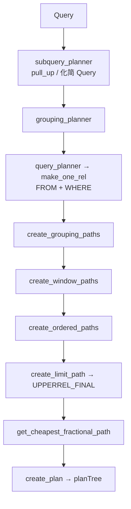

# 一条 SELECT 在 PostgreSQL 里怎么走

**读完本文你能回答**：

1. 一条 SQL 从进 backend 到返回行，**主要经过哪几步**？
2. 每一步**吃进什么、吐出什么**（针对下面这条示例 SQL）？
3. **解析**和**分析**、**Plan**和**Path**、**规划器**和日常说的**优化器** 分别指什么？

---

**示例 SQL（全文同一条）**：

```sql
SELECT u.id, u.name, count(o.id) AS paid_orders
FROM users u
LEFT JOIN orders o
  ON o.user_id = u.id AND o.status = 'paid'
WHERE u.active = true
GROUP BY u.id, u.name
HAVING count(o.id) > 0
ORDER BY paid_orders DESC
LIMIT 10;
```

**人话**：活跃用户里，至少有一笔 paid 订单的，按订单数倒序取前 10。

---

## 1. 全局图景（先读这一章）

### 1.1 三十秒版：主要步骤

客户端发来 **SQL 文本** → backend 的 **TCOP**（总调度，`exec_simple_query`）按顺序调用五站：

| 顺序 | 站 | 一句话 | 产物（变量名） | 产物类型（概念名） |
|------|-----|--------|----------------|-------------------|
| 1 | **Parser** | 语法解析：按文法拼树 | `parsetree_list` | **语法树**（包在 `RawStmt` 里） |
| 2 | **Analyzer** | 语义分析：绑表、绑列 | `Query`（单条） | **语义树 `Query`** |
| 3 | **Rewriter** | 视图 / 规则 / RLS | `querytree_list` | 仍是 **`Query` 列表** |
| 4 | **规划器** | 选物理算子、生成 Plan | `plantree_list` | **`PlannedStmt`**（内含 **Plan**） |
| 5 | **Executor** | 执行计划、返回行 | `TupleTableSlot` | 一行 **tuple** |

**本例**：普通基表 SELECT，Rewriter 通常不改变形状（`querytree_list` 长度仍为 1）。

**exec_simple_query 证据链**（`postgres.c:1029`；完整代码块见 [§7.1](#71-主路径与-1-对应)）：

| 步骤 | 调用 | 约行 | 对应章 |
|------|------|------|--------|
| 0 | `exec_simple_query` | 1029 | §7 |
| 1 | `pg_parse_query` | 1082 | §2 |
| 2 | `pg_analyze_and_rewrite_fixedparams` | 1206 | §3–§4 |
| 2a | └ `parse_analyze_fixedparams` | 699 | §3 |
| 2b | └ `pg_rewrite_query` | 708 | §4 |
| 3 | `pg_plan_queries` → `planner()` | 1209 / 917 | §5 |
| 4 | `PortalDefineQuery` → `PortalStart` → `PortalRun` | 1241 / 1251 / 1290 | §6 |

### 1.2 接力棒：主变量链

与上表同一顺序；箭头表示**数据形态**在站与站之间如何变化（不是两个 struct 之间的「变身」）。

```text
query_string          ← 【文本】客户端发来的 SQL 字符串
  ↓ Parser（语法解析）
parsetree_list        ← 【语法树】List<RawStmt>；树在 RawStmt.stmt 里，本例为 SelectStmt
  ↓ Analyzer（语义分析）
Query                 ← 【语义树】一条 Query（表 OID、列号、jointree 等）
  ↓ Rewriter
querytree_list        ← 【语义树列表】元素仍是 Query；本例 list 长度 = 1
  ↓ 规划器
plantree_list         ← 【执行计划】PlannedStmt；可执行步骤在 planTree（Plan 树）
  ↓ Executor
TupleTableSlot        ← 【一行结果】tuple 落在 slot 的 tts_values[] 里
```

### 1.3 主链概念（与 §1.2 一一对应）

**术语约定（全文统一）**：

| 术语 | 指什么 |
|------|--------|
| **规划器（Planner）** | 源码/模块名：`planner()`、`src/backend/optimizer/`（目录名是历史遗留）；从 **`Query` 到 `Plan`/`PlannedStmt` 的整段工作 |
| **优化器（Optimizer）** | 日常/文献口语，多指 **基于代价选 Path** 的核心（`Path`、`add_path`、代价估算）；**不是**与规划器并列的另一个独立模块 |
| **正文用法** | 主称 **规划器**；强调「选最优执行方式」时用 **规划器（优化）阶段** 或 **代价优化**；避免同一节里 Planner/优化器混用指不同东西 |

| §1.2 上的变量 / 类型 | 概念名 | 人话 | 哪一章细讲 |
|---------------------|--------|------|-----------|
| `query_string` | SQL 文本 | 还没进 Parser 的 C 字符串 | §2 |
| `parsetree_list` / `RawStmt` | **语法树** | 树在 `RawStmt.stmt`；本例指向 `SelectStmt` | §2 |
| `Query` | **语义树** | 表、列、WHERE/JOIN 含义已绑定 | §3 |
| `querytree_list` | 语义树**列表** | Rewriter 可能 1→N 条 `Query`；本例为 1 | §4 |
| `plantree_list` / `planTree` | **Plan** | `EXPLAIN` 所见；在 `PlannedStmt` 里 | §5（[§5.1 总路径](#51-规划器总路径主图) 起） |
| （§5 内） | **代价优化** | Path + cost + `add_path` 选 best；不含 `create_plan` | §5.7–§5.8、[§5.9](#59-path-候选与-add_path) |
| `TupleTableSlot` | **tuple** | 每行各列在 `tts_values[]` | §6 |
| （贯穿） | **TCOP** | 串起五站的调度台 | §7 |

§1.1 / §1.2 / §1.3 是**同一套词的三处对照**；§2–§6 展开每一站。

### 1.4 延伸概念（读到对应章再抠）

| 概念 | 人话 | 哪一章 |
|------|------|--------|
| **catalog** | 元数据系统表（表 OID、列号等） | §3、§5 |
| **RTE** | `Query->rtable` 里的一项（表或 JOIN 结果） | §3 |
| **Path** | 规划器内部候选 + cost，**不执行** | §5 |
| **PlanState** | Plan 的运行时副本 | §6 |
| **Portal** | 服务端「挂着已规划查询、按需拉行」的执行壳；简单 SELECT 也用 | §6、[游标要点](#进阶游标与分批拉行) |
| **游标（CURSOR）** | SQL/PL 层的命名 Portal + 规划选项 | 同上 |

### 1.5 解析 vs 分析（最易混）

| | Parser | Analyzer |
|---|--------|----------|
| 做什么 | **语法解析** | **语义分析** |
| 本例 `users` | `RangeVar` 字符串 | `RangeTblEntry` + `relid` |
| 本例 `count(o.id)` | `FuncCall` 节点 | `Aggref` |
| 本例 `ORDER BY paid_orders` | `ColumnRef` | `sortClause` 绑定 targetList |

官方注释：`RawStmt` 包装 raw parse tree；parse analysis 把它变成 `Query`（`parsenodes.h:2175-2179`）。

绑 catalog 的极简对照见 §3「[RawStmt → Query](#rawstmt--query一句话对照)」。

### 1.6 怎么读下文

| 目标 | 读哪里 |
|------|--------|
| 只要步骤和产物 | §1.1–§1.3，必要时 §7 |
| 规划器 vs 优化器怎么叫 | §1.3 术语约定 |
| 跟示例 SQL 看每站数据 | §2–§6（每节先看 **调用概况**） |
| 大结果集 / 游标 / JDBC 分批 | §6 [游标要点](#进阶游标与分批拉行) |
| 查行号 | [附录 C](#附录-c-源码索引) |

---

## 2. 第一站：Parser —— 文本 → 语法树

**人话**：按文法拼语法树；**不查** catalog。

### 调用概况

| | |
|---|---|
| **在整条链路中的位置** | TCOP `exec_simple_query` 里，事务/abort 检查之后、Analyzer 之前 |
| **谁调用本站入口** | `exec_simple_query`（`postgres.c:1082`） |
| **本站入口** | `pg_parse_query(query_string)`（`postgres.c:616`） |
| **入口再转调** | `raw_parser(...)`（`postgres.c:625` → `parser.c:42`）→ 内部 `scan.l` 分词 + `gram.y` 建 `SelectStmt` 等 |
| **本站产出交给** | `foreach` 里每个 `parsetree` → `pg_analyze_and_rewrite_fixedparams`（§3） |

```text
exec_simple_query [1029]
  └─ pg_parse_query [1082]
       └─ raw_parser [625]     ← 本站实际干活
  └─ pg_analyze_and_rewrite_fixedparams(parsetree, ...)   ← 下一站
```

### 交接

| | 内容 |
|---|------|
| **入参** | `query_string` |
| **出参** | `parsetree_list`（`List<RawStmt>`，本例 `list_length = 1`） |

### 本例产物

`RawStmt` 是**包装**；语法树根在 `stmt` 指针里，本例指向 `SelectStmt`（`parsenodes.h:2187-2195`）。

```text
parsetree_list[0] = RawStmt
  stmt ──指向──► SelectStmt
    targetList, fromClause(LEFT JOIN), whereClause,
    groupClause, havingClause, sortClause, limitCount
```

此时 `users` 无 `relid`；`count(o.id)` 仅为 **`FuncCall` 节点**（`T_FuncCall`），不是 `Aggref`。

### 源码证据

TCOP 调用 Parser（`postgres.c:1082`）：

```1078:1082:src/backend/tcop/postgres.c
	/*
	 * Do basic parsing of the query or queries (this should be safe even if
	 * we are in aborted transaction state!)
	 */
	parsetree_list = pg_parse_query(query_string);
```

`pg_parse_query` 只做 raw parsing，内部调用 `raw_parser`（`postgres.c:625`）：

```602:625:src/backend/tcop/postgres.c
 * Do raw parsing (only).
 *
 * A list of parsetrees (RawStmt nodes) is returned, since there might be
 * multiple commands in the given string.
 * ...
	raw_parsetree_list = raw_parser(query_string, RAW_PARSE_DEFAULT);
```

### 交给下一站

`RawStmt *` → `parse_analyze_fixedparams`（`postgres.c:699`），读 `parsetree->stmt` 做语义分析。

---

## 3. 第二站：Analyzer —— 语法树 → 语义树 `Query`

**人话**：查 catalog，绑 OID/列号；WHERE 并入 `jointree`；`count` → `Aggref`。

### 调用概况

| | |
|---|---|
| **在整条链路中的位置** | 仍在 `pg_analyze_and_rewrite_fixedparams` 内，**第 (1) 步**；Rewriter 是同一函数的第 (2) 步（§4） |
| **谁调用本站入口** | `pg_analyze_and_rewrite_fixedparams`（`postgres.c:1206`） |
| **本站对外入口** | `parse_analyze_fixedparams(parsetree, ...)`（`postgres.c:699`） |
| **入口再转调（本例 SELECT）** | `transformTopLevelStmt`（`analyze.c:144`）→ `transformOptionalSelectInto` → `transformStmt`（`analyze.c:334`）→ **`transformSelectStmt`**（`analyze.c:389-396`）→ 内部 `transformFromClause` / `transformWhereClause` / `makeFromExpr` 等 |
| **本站产出交给** | 返回的 `Query *` 交给同函数内的 `pg_rewrite_query`（§4） |

```text
exec_simple_query [1029]
  └─ pg_analyze_and_rewrite_fixedparams(parsetree, ...) [1206]
       ├─ (1) parse_analyze_fixedparams [699]          ← Analyzer 对外入口
       │    └─ transformTopLevelStmt [144]
       │         └─ transformStmt [326/334]
       │              └─ transformSelectStmt [396]    ← 本例 SELECT 分支
       │                   └─ makeFromExpr → jointree [1871]
       └─ (2) pg_rewrite_query(query) [708]            ← §4，不是 Analyzer 本体
```

`transformSelectStmt` 不是与 `parse_analyze_fixedparams` 并列的另一站，而是 **Analyzer 内部实现 SELECT 的那段函数**。

### 交接

| | 内容 |
|---|------|
| **入参** | `RawStmt *`（`parsetree->stmt` 本例为 `SelectStmt`） |
| **出参** | `Query *`（`parsenodes.h:117`） |

### 本例产物

```text
Query
  rtable[1] users, [2] orders, [3] JOIN 伪表   ← relid 来自 catalog
  jointree: JoinExpr(LEFT)+ON 在 JoinExpr.quals；
            WHERE 在 jointree.quals（无 Query->where）
  targetList: Var, Var, Aggref AS paid_orders
  groupClause / havingQual / sortClause / limitCount
```

`jointree` 注释写明承载 FROM 与 WHERE（`parsenodes.h:185-186`）。Parser/Analyzer 节点对照见 [§1.5](#15-解析-vs-分析最易混)。

### RawStmt → Query：一句话对照

**人话**：Parser 只认**语法槽位 + 名字**；Analyzer **查 catalog**，绑 OID/列号，吐出 **`Query`**。相当于把文法分好的 SQL **关联到本库实际对象**——**不是**决定调用哪些执行函数（那是 **规划器** 产出的 **Plan** 层）。

**极简例子**（比文首示例短，只看绑定）：

```sql
SELECT u.id FROM users u WHERE u.id = 1;
```

| Parser（`SelectStmt` 等） | Analyzer（`Query`） |
|---------------------------|---------------------|
| `RangeVar` `users` / `u` | `RangeTblEntry`，`relid` 来自 catalog |
| `ColumnRef` `u.id` | `Var`（RTE 下标 + 列 attnum） |
| `whereClause` 单独节点 | 并入 `jointree->quals`（与 FROM 同树） |

上表与 [§1.5](#15-解析-vs-分析最易混) 同一套词；本节只强调 **「绑对象」** 这一步。

**源码锚点**：`transformTopLevelStmt` → `transformSelectStmt`（`analyze.c:144`、`analyze.c:396`）；产物 `Query`（`parsenodes.h:117`）。

### 源码证据

`pg_analyze_and_rewrite_fixedparams` 第 (1) 步注释（`postgres.c:693-700`）：

```693:700:src/backend/tcop/postgres.c
	/*
	 * (1) Perform parse analysis.
	 */
	query = parse_analyze_fixedparams(parsetree, query_string, paramTypes, numParams,
									  queryEnv);
```

`parse_analyze_fixedparams` 内转调顶层变换（`analyze.c:144`）：

```144:144:src/backend/parser/analyze.c
	query = transformTopLevelStmt(pstate, parseTree);
```

本例 SELECT 进 `transformSelectStmt`（`analyze.c:389-396`）；WHERE 并入 `jointree`（`analyze.c:1871`）：

```1869:1871:src/backend/parser/analyze.c
	qry->rtable = pstate->p_rtable;
	qry->rteperminfos = pstate->p_rteperminfos;
	qry->jointree = makeFromExpr(pstate->p_joinlist, qual);
```

### 交给下一站

`Query` 在同一函数内进入 `pg_rewrite_query`（`postgres.c:708`）。

---

## 4. 第三站：Rewriter —— 规则与视图

**人话**：改 `Query` 树；**不**再调用 `raw_parser`。

### 调用概况

| | |
|---|---|
| **在整条链路中的位置** | `pg_analyze_and_rewrite_fixedparams` 的 **第 (2) 步**，紧接 Analyzer 之后 |
| **谁调用本站入口** | `pg_analyze_and_rewrite_fixedparams`（`postgres.c:708`） |
| **本站入口** | `pg_rewrite_query(query)`（`postgres.c:815`） |
| **入口再转调** | 本例 `CMD_SELECT` → `QueryRewrite(query)`（`postgres.c:834`，`rewrite/` 模块） |
| **本站产出交给** | 返回的 `querytree_list` → `pg_plan_queries`（§5） |

```text
pg_analyze_and_rewrite_fixedparams [682]
  └─ (1) parse_analyze_fixedparams → Query
  └─ (2) pg_rewrite_query(query) [708]     ← 本站
       └─ QueryRewrite [834]
  └─ return querytree_list → pg_plan_queries [1209]
```

### 交接

| | 内容 |
|---|------|
| **入参** | `Query *` |
| **出参** | `querytree_list`（`List<Query>`） |

### 本例产物

```text
querytree_list[0] ≈ Analyzer 的 Query
list_length = 1
```

### 源码证据

非 UTILITY 时调用 `QueryRewrite`（`postgres.c:826-834`）：

```826:834:src/backend/tcop/postgres.c
	if (query->commandType == CMD_UTILITY)
	{
		querytree_list = list_make1(query);
	}
	else
	{
		querytree_list = QueryRewrite(query);
	}
```

注释：analyzer **或** rewriter 都可能把 1 条扩成多条（`postgres.c:676-677`）。

### 交给下一站

`pg_plan_queries(querytree_list, ...)`（`postgres.c:1209`）。

---

## 5. 第四站：规划器 —— 语义树 → `Plan`

**人话**：吃进 **`Query`** → **规划前**可能改写 `Query`（§5.5）→ **代价优化**生成 **`Path`** 并 `add_path` 剪枝 → **`UPPERREL_FINAL`** 选 **`best_path`** → **`create_plan`** 得 **`planTree`**。Executor **只执行 Plan**。

**Path / Plan**（与 [§1.3](#13-主链概念与-12-一一对应) 一致）：**Path** = 规划期候选 + cost，挂在 `RelOptInfo->pathlist`；**Plan** = `create_plan` 从定稿 Path 译成的执行树。

> **Planner 阅读路线**：**§5.1 总图** → **§5.7 `grouping_planner` 顺序** → **§5.9 `add_path`**；入参形态看 **§5.6 jointree**；预处理 **§5.5** 按需。  
> **外表 / FDW 按 `planner()` 逐级拆解**：见根目录 [`fdw_planning_walkthrough.md`](fdw_planning_walkthrough.md) **§2**（`Query` → `RelOptInfo` → FDW 回调）。

下文用 [文首示例 SQL](#示例-sql全文同一条) 贯穿；行号以本仓库 `src/backend` 为准。

### 5.1 规划器总路径（主图）

**一步一行**：从 TCOP 到 `planTree`；缩进表示调用嵌套。

```text
pg_plan_queries                    postgres.c:987
  pg_plan_query                    postgres.c:899
    planner()                      planner.c:333
      standard_planner             planner.c:351
        subquery_planner           planner.c:775    ← 规划前改 Query；再进 grouping_planner
          grouping_planner         planner.c:1775
            query_planner          planmain.c:54    ← FROM/WHERE：扫描+连接 Path
              add_base_rels_to_query  initsplan.c:178  ← 扫 jointree
                build_simple_rel   relnode.c:212    ← 每表 RelOptInfo；基表 get_relation_info
              make_one_rel         allpaths.c:297
            create_grouping_paths  planner.c:4121   ← 若有 GROUP/AGG/HAVING
            create_window_paths    planner.c:4867   ← 若有窗口函数（本例无）
            create_ordered_paths   planner.c:5642   ← 若有 ORDER BY
            create_limit_path      pathnode.c:3793  ← 挂在 UPPERREL_FINAL（本例 LIMIT）
        get_cheapest_fractional_path planner.c:6919   ← 从 FINAL 选 best_path
        create_plan                createplan.c:339   ← Path → Plan
        PlannedStmt.planTree       planner.c:671
```



| | |
|---|---|
| **在整条链路中的位置** | `exec_simple_query` 内，Rewriter 之后、Portal 之前（`postgres.c:1209`） |
| **本站入口** | `pg_plan_queries` → `pg_plan_query` → **`planner()`** |
| **本站产出** | `List<PlannedStmt>`，`planTree` 为 Plan 根 |

```text
exec_simple_query [1029]
  └─ pg_plan_queries [1209]
       └─ pg_plan_query [899] → planner [333] → standard_planner [351]
            ├─ subquery_planner [775] → grouping_planner [1775] → … Path 森林
            ├─ get_cheapest_fractional_path [542]
            ├─ create_plan [544]
            └─ PlannedStmt [659-671]
  └─ PortalDefineQuery(plantree_list) [1241]   ← §6
```

### 5.2 交接：入参 / 出参

| | 内容 |
|---|------|
| **入参** | `Query *`：`rtable`（users / orders / JOIN 伪表）、`jointree`（LEFT JOIN + `u.active` 等 qual）、`groupClause` / `havingQual` / `sortClause` / `limitCount` |
| **中间（规划期）** | `PlannerInfo *root`；各 **`RelOptInfo`** 的 **`pathlist`**（Path 森林，不交给 Executor） |
| **出参** | `PlannedStmt *`：`planTree` → Plan 根；另含 `rtable`、`paramExecTypes` 等执行期元数据 |

**本例在入口的 Query 形态**（§3 已分析，此处只列规划器关心的字段）：

```text
Query
  rtable: RTE_RELATION users, RTE_RELATION orders, RTE_JOIN(LEFT) …
  jointree: JoinExpr + quals（含 WHERE u.active = true）
  targetList: Var, Var, Aggref(count) AS paid_orders
  groupClause / havingQual(count>0) / sortClause(paid_orders DESC) / limitCount=10
  hasAggs = true
```

### 5.3 入口：`pg_plan_queries` → `planner()`

**人话**：TCOP 把 `querytree_list` 交给 `pg_plan_queries`（`postgres.c:987`）；每条可优化语句经 `pg_plan_query`（899）进 `planner()`（`planner.c:333`），默认 `standard_planner`。UTILITY 无 Plan。

**源码证据**：

```987:1017:src/backend/tcop/postgres.c
pg_plan_queries(List *querytrees, const char *query_string, int cursorOptions,
				ParamListInfo boundParams)
{
	...
		else
		{
			stmt = pg_plan_query(query, query_string, cursorOptions,
								 boundParams, NULL);
		}
		stmt_list = lappend(stmt_list, stmt);
	}
	return stmt_list;
}
```

```899:917:src/backend/tcop/postgres.c
pg_plan_query(Query *querytree, const char *query_string, int cursorOptions,
			  ParamListInfo boundParams, ExplainState *es)
{
	...
	plan = planner(querytree, query_string, cursorOptions, boundParams, es);
```

```333:347:src/backend/optimizer/plan/planner.c
planner(Query *parse, const char *query_string, int cursorOptions,
		ParamListInfo boundParams, ExplainState *es)
{
	...
		result = standard_planner(parse, query_string, cursorOptions,
								  boundParams, es);
```

### 5.4 `standard_planner`：外壳

**人话**：建 `PlannerGlobal`（含 `tuple_fraction`：简单协议常为 **0**；本例 `LIMIT 10` 在 `grouping_planner` 处理）→ **`subquery_planner`**（§5.5–§5.7）→ 从 `UPPERREL_FINAL` 取 **`best_path`** → **`create_plan`** → 填 **`PlannedStmt.planTree`**。

**源码证据**：

```536:544:src/backend/optimizer/plan/planner.c
	root = subquery_planner(glob, parse, NULL, NULL, NULL, false,
							tuple_fraction, NULL);

	final_rel = fetch_upper_rel(root, UPPERREL_FINAL, NULL);
	best_path = get_cheapest_fractional_path(final_rel, tuple_fraction);

	top_plan = create_plan(root, best_path);
```

```659:671:src/backend/optimizer/plan/planner.c
	result = makeNode(PlannedStmt);
	...
	result->planTree = top_plan;
```

**交给下一步**：`subquery_planner` 内部完成 Query 预处理与 **代价优化**（Path 搜索）的主体工作。

---

### 5.5 `subquery_planner`：规划前改 `Query`（预处理）

**人话**：为当前 `Query` 建 `PlannerInfo`，在 **任何 Path/Plan 生成之前** 改写、简化 **`Query` 树本身**（`rtable`、`jointree`、表达式）。改完再调 **`grouping_planner`** 进入 **代价优化**（Path 搜索）。

**常见误解（纠正）**：**不是**「子查询先执行完，再往 `rtable` 里追加一项」。`pull_up_subqueries` / `pull_up_sublinks` 都是在 **规划前** 把子查询/子链接 **合并进当前 `Query` 的 `rtable` + `jointree`**，后续 `query_planner` 看到的已是合并后的树。

#### 5.5.1 `pull_up_sublinks`：WHERE/ON 里的 EXISTS、ANY

| | |
|---|---|
| **何时** | `parse->hasSubLinks` 为真（`planner.c:880-881`） |
| **做什么** | 把顶层的 `ANY (sub-SELECT)`、`EXISTS` / `NOT EXISTS` 变成 **semijoin / anti-semijoin**，改写 **`jointree` + `rtable`** |
| **实现** | `pull_up_sublinks()`，`prepjointree.c:670`；须在 `preprocess_expression()` **之前**（注释 `prepjointree.c:664-667`） |
| **本例** | 无 SubLink，**跳过** |

**概念**：`WHERE EXISTS (SELECT …)` 可能被改成 **semijoin** 写进 `jointree`/`rtable`，不再以 SubLink 留在 qual 里。

**源码**：

```874:881:src/backend/optimizer/plan/planner.c
	/*
	 * Look for ANY and EXISTS SubLinks in WHERE and JOIN/ON clauses, and try
	 * to transform them into joins.  Note that this step does not descend
	 * into subqueries; if we pull up any subqueries below, their SubLinks are
	 * processed just before pulling them up.
	 */
	if (parse->hasSubLinks)
		pull_up_sublinks(root);
```

#### 5.5.2 `pull_up_subqueries`：FROM 子句里的子查询 RTE

| | |
|---|---|
| **何时** | 几乎总是调用（`planner.c:895`），扫描 `jointree` 里可上拉的 `RTE_SUBQUERY` |
| **做什么** | 把 **FROM 里的子查询** 合并进外层：子查询的表进外层 **`rtable`**，谓词并进外层 **`jointree`/`quals`** |
| **实现** | `pull_up_subqueries()`，`prepjointree.c:1220` |
| **本例** | 无 FROM 子查询，**no-op** |

**概念**：`FROM (SELECT …) s` 可把子查询 **合并进外层** `rtable`/`jointree`（仍在同一条 `Query`，非执行期再拼树）。

```891:895:src/backend/optimizer/plan/planner.c
	/*
	 * Check to see if any subqueries in the jointree can be merged into this
	 * query.
	 */
	pull_up_subqueries(root);
```

#### 5.5.3 其它预处理（本例也会走）

| 顺序 | 步骤 | 作用 | 本例 |
|------|------|------|------|
| 1 | `preprocess_relation_rtes` | catalog、继承/分区 | `users`/`orders` 元数据 |
| 2 | `preprocess_expression` / qual 处理 | 常量折叠、规范化 | `o.status = 'paid'` 等 |
| 3 | HAVING | 无 Agg 的 HAVING 可下推到 `jointree` | **`count(o.id)>0` 留 `havingQual`** |
| 4 | `reduce_outer_joins` | LEFT→INNER（若语义允许） | 视 qual 而定 |
| 5 | **`grouping_planner`** | 代价优化（Path 搜索） | §5.7 |
| 6 | `set_cheapest(final_rel)` | 标 FINAL 最便宜 Path | `planner.c:1395` |

```text
subquery_planner [775]
  ├─ preprocess_relation_rtes [866]
  ├─ pull_up_sublinks [881]        prepjointree.c:670
  ├─ pull_up_subqueries [895]      prepjointree.c:1220
  ├─ preprocess_expression … [1022+]
  ├─ reduce_outer_joins [1358]
  └─ grouping_planner [1373]
```

**阶段产物**：仍是 **`Query` + `PlannerInfo`**（`jointree`/`rtable` 可能已变）；**尚无 Path/Plan**。

---

### 5.6 jointree 与 qual 在 `Query` 里的位置

**人话**：**`rtable`** 列出「有哪些表/子查询/JOIN 结果」；**`jointree`** 描述 **FROM 怎么连、谓词挂在哪一层**。Analyzer 已把 **WHERE 并进 `jointree`**（无单独的 `Query->where`）。

| 概念 | 一句话 |
|------|--------|
| **`rtable`** | `List<RangeTblEntry>`：逻辑关系目录（基表、JOIN 伪表、子查询…） |
| **`jointree`** | `FromExpr` 为根；子节点 `RangeTblRef` / `JoinExpr` 描述连接树 |

**qual 落在哪**（结合 [文首示例 SQL](#示例-sql全文同一条)）：

| SQL 子句 | 在 `Query` 里 | 本例 |
|----------|---------------|------|
| `ON o.user_id = … AND o.status = 'paid'` | 对应 **`JoinExpr->quals`** | LEFT JOIN 节点上 |
| `WHERE u.active = true` | 顶层 **`FromExpr->quals`**（与 FROM 并列的 AND） | 与 jointree 根并列 |
| `GROUP BY` / `HAVING` | **`groupClause`** / **`havingQual`** | 不在 jointree |
| `ORDER BY` / `LIMIT` | **`sortClause`** / **`limitCount`** | 不在 jointree |

**本例 `Query` 树示意**（精简，与 §3 一致）：

```text
Query
  rtable[1] RTE_RELATION users
  rtable[2] RTE_RELATION orders
  rtable[3] RTE_JOIN (LEFT) …
  jointree: FromExpr
    fromlist → JoinExpr(LEFT)
                 larg  → RangeTblRef(users)
                 rarg  → RangeTblRef(orders)
                 quals → (o.user_id = u.id) AND (o.status = 'paid')
    quals    → (u.active = true)
  groupClause / havingQual / sortClause / limitCount=10
  targetList: u.id, u.name, Aggref(count(o.id)) AS paid_orders
```

`parsenodes.h` 注释：`jointree` 承载 FROM 与 WHERE（§3 已引 `analyze.c:1871`）。

---

### 5.7 `grouping_planner`：真实顺序（核心）

**人话**：先根据 `Query` 字段判断要不要 Agg/Window/Sort/Limit；再 **`query_planner` 只做 FROM+WHERE**；然后在连接结果上 **自下而上** 叠上层 Path。这与 SQL **书写顺序**不同，但与 **关系代数执行依赖** 一致（先有关系行，才能 GROUP/ORDER/LIMIT）。

#### 5.7.1 先读 `Query` 字段（尚未搜 Path）

| 检查 | 字段 / 变量 | 本例 |
|------|-------------|------|
| LIMIT | `limitCount` / `limitOffset` → `preprocess_limit` | `10` → `limit_tuples` 等 |
| GROUP/AGG | `groupClause` / `hasAggs` / `havingQual` | 有 → 后面 `have_grouping` |
| 窗口 | `windowClause` → `activeWindows` | 无 |
| ORDER | `sortClause` | `paid_orders DESC` |

`have_grouping` 在 **`query_planner` 返回之后** 才算（`planner.c:2053-2054`），用于决定连接层要输出什么列、是否调用 `create_grouping_paths`。

#### 5.7.2 真实调用顺序（与 SQL 对照）

| 顺序 | 规划器步骤 | 源码约行 | 对应 SQL（逻辑） | 本例 |
|------|------------|----------|------------------|------|
| 1 | `preprocess_limit` / `preprocess_groupclause` / `preprocess_targetlist` 等 | `1792-1895` | 为后续 Path 准备 target，**不搜 join** | 有 |
| 2 | **`query_planner`** → `make_one_rel` | `1988-1995` | **FROM + WHERE**（+ ON） | users ⨝ orders |
| 3 | `apply_scanjoin_target_to_paths` | `2114-2117` | 连接层输出列对齐 | 有 |
| 4 | **`create_grouping_paths`** | `2138-2144` | **GROUP BY / 聚合 / HAVING** | `AggPath` 等 |
| 5 | **`create_window_paths`** | `2156-2164` | 窗口函数 | 跳过 |
| 6 | **`create_ordered_paths`** | `2191-2198` | **ORDER BY** | `SortPath` |
| 7 | **`create_limit_path`** on **`UPPERREL_FINAL`** | `2209-2262` | **LIMIT** | `LimitPath` |

```1988:1995:src/backend/optimizer/plan/planner.c
		/*
		 * Generate the best unsorted and presorted paths for the scan/join
		 * portion of this Query, ie the processing represented by the
		 * FROM/WHERE clauses.  (Note there may not be any presorted paths.)
		 */
		current_rel = query_planner(root, standard_qp_callback, &qp_extra);
```

```2053:2055:src/backend/optimizer/plan/planner.c
		have_grouping = (parse->groupClause || parse->groupingSets ||
						 parse->hasAggs || root->hasHavingQual);
```

> **注意**：SQL 文本顺序是 `SELECT … FROM … WHERE … GROUP … HAVING … ORDER … LIMIT`；规划器 **先** 做完 FROM/WHERE 的 join Path，**再** 叠 GROUP → ORDER → LIMIT。HAVING 在 `create_grouping_paths` 里与 Agg 一起考虑，不是单独的 jointree 阶段。

#### 5.7.3 本例 Path 套娃（竖图，Path 层非 Plan）

```text
UPPERREL_FINAL.pathlist
  LimitPath                           ← LIMIT 10
    └─ SortPath                       ← ORDER BY paid_orders DESC
         └─ AggPath / GroupAggPath    ← GROUP BY + count + HAVING
              └─ HashPath/NestLoop…   ← LEFT JOIN + ON/WHERE quals
                   ├─ SeqPath users
                   └─ SeqPath orders
```

`subquery_planner` 返回前对 **`UPPERREL_FINAL`** 调 **`set_cheapest`**（`planner.c:1395`）→ `standard_planner` 再 **`get_cheapest_fractional_path`**。

---

### 5.8 `query_planner`：jointree → join 搜索

**人话**：`deconstruct_jointree`（`initsplan.c:1522`）把 §5.6 的 ON/WHERE 分到 **join qual / restrictlist**，产出 **joinlist**；`make_one_rel`（`allpaths.c:179`）做基表 Path + **`standard_join_search`**。新 Path 经 [§5.9 `add_path`](#59-path-候选与-add_path) 进各 rel 的 `pathlist`。

**此步结束**：得到 FROM+WHERE 的 `current_rel`；GROUP/ORDER/LIMIT 在 §5.7 后续叠。

```194:194:src/backend/optimizer/plan/planmain.c
	joinlist = deconstruct_jointree(root);
```

（随后 `generate_base_implied_equalities`、`make_one_rel` 等同函数内继续，见 `planmain.c` 约 200–297 行。）

---

### 5.9 Path 候选与 `add_path`

**人话**：每个 `RelOptInfo` 维护 **`pathlist`**；新 Path 用 **`add_path`** 与旧 Path 比 cost、**pathkeys**、行数等，**支配**则删旧留新，**互不支配**则多条并存。完整注释见 `pathnode.c:387-412`。

| 机制 | 人话 |
|------|------|
| **`add_path`** | 新 Path 进列表时比较；可能淘汰被支配的旧 Path |
| **比较维度** | `startup_cost` / `total_cost`、**pathkeys**、行数、`parallel_safe` 等 |
| **定稿选取** | `UPPERREL_FINAL` 上 `get_cheapest_fractional_path`（`planner.c:6919`） |

**本例**：带 pathkeys 的 IndexScan 与 SeqScan+Sort 可能并存于 pathlist，最终在 `UPPERREL_FINAL` 用 **fractional cost**（结合 `LIMIT 10`）选一条 `best_path`。

---

### 5.10 定稿：`get_cheapest_fractional_path` → `create_plan` → `PlannedStmt`

**人话**：从 **`UPPERREL_FINAL->pathlist`** 选出一条 **`best_path`**（考虑是否要全表结果还是只要前若干行），再 **`create_plan_recurse`** 把 Path 树翻译成 Plan 树。

| 步骤 | 入参 | 出参 | 本例 |
|------|------|------|------|
| `get_cheapest_fractional_path` | `final_rel`, `tuple_fraction` | `Path *best_path` | 简单查询常取 `cheapest_total_path`；有 LIMIT 时可能偏好 **启动快** 的路径 |
| `create_plan` | `root`, `best_path` | `Plan *top_plan` | `Limit`→`Sort`→`Agg`→`HashJoin`→… |
| 组装 | `top_plan` + `glob` 元数据 | `PlannedStmt` | `planTree` 供 Executor |

**源码证据**：

```6918:6926:src/backend/optimizer/plan/planner.c
Path *
get_cheapest_fractional_path(RelOptInfo *rel, double tuple_fraction)
{
	Path	   *best_path = rel->cheapest_total_path;
	...
	if (tuple_fraction <= 0.0)
		return best_path;
```

```339:351:src/backend/optimizer/plan/createplan.c
create_plan(PlannerInfo *root, Path *best_path)
{
	...
	plan = create_plan_recurse(root, best_path, CP_EXACT_TLIST);
```

---

### 5.11 本例产物：定稿 Plan 树（一种可能）

规划器产出 **`PlannedStmt.planTree`**；形状与 `EXPLAIN` 同类（算子随统计/索引/GUC 变化）。

**怎么读**：**根在上**；Executor 自顶向下调度，**叶子 Scan 先产生行**，向上传递。

```text
Limit (最多 10 行)                         ← LIMIT 10
  └─ Sort (paid_orders DESC)                 ← ORDER BY
       └─ Agg (GROUP BY u.id,u.name + HAVING) ← GROUP / count / HAVING
            └─ Hash Join (LEFT)              ← LEFT JOIN … ON …
                 ├─ Seq Scan users          ← 常含 active=true 过滤
                 └─ Seq Scan orders
```

| Plan 节点 | 在干什么 |
|-----------|----------|
| `Seq Scan` | 读 `users` / `orders` 堆表 |
| `Hash Join` | LEFT JOIN 拼行 |
| `Agg` | 分组、`count(o.id)`、`HAVING count>0` |
| `Sort` | 按 `paid_orders` 排序 |
| `Limit` | 取前 10 行 |

---

### 5.12 行号速查

与 [§5.1](#51-规划器总路径主图) 同序：`pg_plan_queries`（`postgres.c:987`）→ `planner`（`planner.c:333`）→ `standard_planner`（351）→ `subquery_planner`（775）→ `grouping_planner`（1775）→ `query_planner`（`planmain.c:54`）→ `add_path`（`pathnode.c:459`）→ `get_cheapest_fractional_path`（`planner.c:6919`）→ `create_plan`（`createplan.c:339`）→ `planTree`（`planner.c:671`）。更全见 [附录 C](#附录-c-源码索引)。

### 交给下一站

`PortalDefineQuery(..., plantree_list, ...)` → `PortalStart` → `ExecutorStart`（`postgres.c:1241-1251`）。

---

## 6. 第五站：Executor —— `Plan` → 一行行数据

**人话**：`ExecInitNode` 造 **PlanState** 树；`ExecProcNode` 递归拉行。

### 调用概况

| | |
|---|---|
| **在整条链路中的位置** | `exec_simple_query` 末尾：Portal 创建并运行 |
| **谁调用本站入口** | `exec_simple_query` → `PortalRun`（`postgres.c:1290`） |
| **准备阶段** | `PortalDefineQuery`（`1241`）→ `PortalStart`（`1251`）→ `CreateQueryDesc` + **`ExecutorStart`**（`pquery.c:514`）→ `InitPlan` → **`ExecInitNode`**（`execMain.c:1002`） |
| **拉行阶段** | `PortalRun` → `PortalRunSelect` → **`ExecutorRun`**（`pquery.c:917`）→ `ExecutePlan` → **`ExecProcNode`** 递归 |
| **本站产出交给** | `DestReceiver` 发回客户端；`PortalDrop`（`1299`） |

```text
exec_simple_query [1029]
  └─ PortalDefineQuery(plantree_list) [1241]
  └─ PortalStart [1251]
       └─ CreateQueryDesc [492]
       └─ ExecutorStart [514]
            └─ ExecInitNode(planTree) [execMain.c:1002 → execProcnode.c:142]
  └─ PortalRun [1290]
       └─ ExecutorRun → ExecProcNode   ← 逐行拉取 TupleTableSlot
  └─ PortalDrop [1299]
```

### 交接

| | 内容 |
|---|------|
| **入参** | `PlannedStmt`（在 `QueryDesc` 里） |
| **出参** | `TupleTableSlot`（`tts_values[]`） |

### 本例产物

`PlanState` 与 `Plan` 同形：`LimitState` → … → `SeqScanState`。一行示例：`(42, "Alice", 3)`。

### 源码证据

`PortalStart` 对 SELECT 创建 `QueryDesc` 并 `ExecutorStart`（`pquery.c:492-514`）：

```492:514:src/backend/tcop/pquery.c
				queryDesc = CreateQueryDesc(linitial_node(PlannedStmt, portal->stmts),
											portal->sourceText,
											GetActiveSnapshot(),
											...
				ExecutorStart(queryDesc, myeflags);
				portal->queryDesc = queryDesc;
```

`ExecInitNode` 递归初始化 PlanState（`execMain.c:997-1002` 调用 `execProcnode.c:142`）。

执行阶段 `PortalRun` → `ExecutorRun`（`postgres.c:1290`；`pquery.c:917`）。

### 终点

`PortalDrop`（`postgres.c:1299`）。

### 进阶：游标与分批拉行

**人话**：简单协议下每条 `SELECT` **已经是 Portal**（`PortalDefineQuery` → `PortalRun`）。开发者说的「游标」多指 **`DECLARE`/`FETCH`**、**`SCROLL`/`WITH HOLD`**，或 JDBC **`setFetchSize`**（扩展协议匿名 Portal 分批，**不必**写 `DECLARE`）。

| 层 | 是什么 | 与主链 |
|----|--------|--------|
| **Portal** | 挂 `PlannedStmt`，`PortalRun` 拉行 | §6 调用概况 |
| **SQL 游标** | 命名 Portal + `cursorOptions`（影响 `tuple_fraction` 等） | 仍走 §5 规划 → §6 执行 |

| 需求 | 更常做法 |
|------|----------|
| 前 N 条 / 列表翻页 | **`LIMIT` / keyset**（本 FAQ 示例即 `LIMIT 10`） |
| 超大表顺序扫 | 普通 `SELECT` 流式读，或 **`COPY TO STDOUT`** |
| 服务端明确每批 n 行 | `DECLARE c CURSOR FOR …` + `FETCH n`，或 JDBC 扩展协议 |
| 可回退 / 事务外继续读 | `SCROLL` / `WITH HOLD`（用完 `CLOSE`） |

游标只改 **执行期拉行方式**（Portal、`cursorOptions`），**不改变** Parser→Plan 主路径；与 [§7.2](#72-进阶三种多个)「多个 Path」无关。

---

## 7. 调度台：TCOP

TCOP = **Traffic Cop**，在 `postgres.c` 串起五站（文件头 `postgres.c:13-16`）。

### 7.0 调用概况

五站顺序与行号见 [§1.1 证据链](#11-三十秒版主要步骤)；规划器细目见 [§5.1](#51-规划器总路径主图)、[§5.12](#512-行号速查)。

### 7.1 主路径（与 §1 对应）

```1206:1290:src/backend/tcop/postgres.c
		querytree_list = pg_analyze_and_rewrite_fixedparams(parsetree, query_string,
															NULL, 0, NULL);

		plantree_list = pg_plan_queries(querytree_list, query_string,
										CURSOR_OPT_PARALLEL_OK, NULL);
		/* ... PopActiveSnapshot ... */
		PortalDefineQuery(portal, ... plantree_list, ...);
		PortalStart(portal, NULL, 0, InvalidSnapshot);
		...
		(void) PortalRun(portal, FETCH_ALL, true, receiver, receiver, &qc);
```

（`parsetree_list = pg_parse_query` 在同函数 `1082` 行，略。）

### 7.2 进阶：三种「多个」

| | `List<Query>` | 很多 `Path` | `planner()`（**规划器**整函数） |
|---|---------------|-------------|---------------------|
| 含义 | Rewriter 是否拆成多条逻辑 Query？ | 同一 rel 上多种物理候选（**代价优化** 产物） | 预处理 + 代价优化 + `create_plan` + 组装 `PlannedStmt` |
| 本例 | 通常 1 | 每个 `RelOptInfo.pathlist` 里多条，经 `add_path` 剪枝 | 一次调用走完 §5.1–§5.10 |
| 对外可见 | `querytree_list` 长度 | 否（仅规划期） | `plantree_list` 里一棵 `planTree` |

术语对照见 [§1.3](#13-主链概念与-12-一一对应)。

### 7.3 进阶：abort 事务

Parser 可与 analyze 分离且在 abort 下仍可跑（`postgres.c:608-613`）；analyze 前检查 abort（`1151-1156`）。

### 7.4 进阶：规划快照 vs 执行快照

`postgres.c:1212-1220` 说明不宜用规划快照执行；`1222-1223` `PopActiveSnapshot`；`PortalStart` 里 `PushActiveSnapshot`（`pquery.c:477`）。

### 7.5 进阶：FDW

与本地表**同一条 TCOP 链路**；规划器/Executor 节点类型不同（如 `ForeignScan`）——本例不展开。

---

## 附录 C：源码索引

按 [§1.6](#16-怎么读下文)「查行号」用途整理；与 [§1.1](#11-三十秒版主要步骤)、§5.12 互补。

| 主题 | 文件 | 约行 | 说明 |
|------|------|------|------|
| TCOP 调规划器 | `src/backend/tcop/postgres.c` | 1209 | `pg_plan_queries` |
| `pg_plan_query` | `postgres.c` | 899 | 单条 Query |
| `planner` / `standard_planner` | `optimizer/plan/planner.c` | 333 / 351 | 规划入口与外壳 |
| `subquery_planner` | `planner.c` | 775 | Query 预处理 |
| `grouping_planner` | `planner.c` | 1775 | 上层 Path |
| `query_planner` | `optimizer/plan/planmain.c` | 54 | 扫描+连接 |
| `make_one_rel` | `optimizer/path/allpaths.c` | 179 | 基表+join |
| `standard_join_search` | `allpaths.c` | 3919 | JOIN 顺序 |
| `build_simple_rel` | `optimizer/util/relnode.c` | 212 | 基表 RelOptInfo |
| `add_path` | `optimizer/util/pathnode.c` | 387–459 | 注释；实现约 459 |
| `create_plan` | `optimizer/plan/createplan.c` | 339 | Path→Plan |
| `get_cheapest_fractional_path` | `planner.c` | 6919 | 选 best_path |
| JOIN Path 生成 | `optimizer/path/joinpath.c` | — | Hash/Merge/NestLoop |
| Analyzer 产物 `Query` | `src/include/nodes/parsenodes.h` | 117 | 语义树 |
| `PlannedStmt` | `parsenodes.h` | — | 含 `planTree` |

