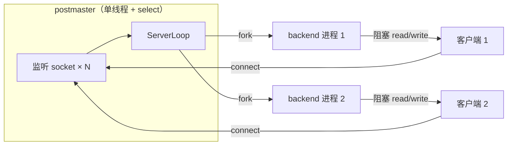
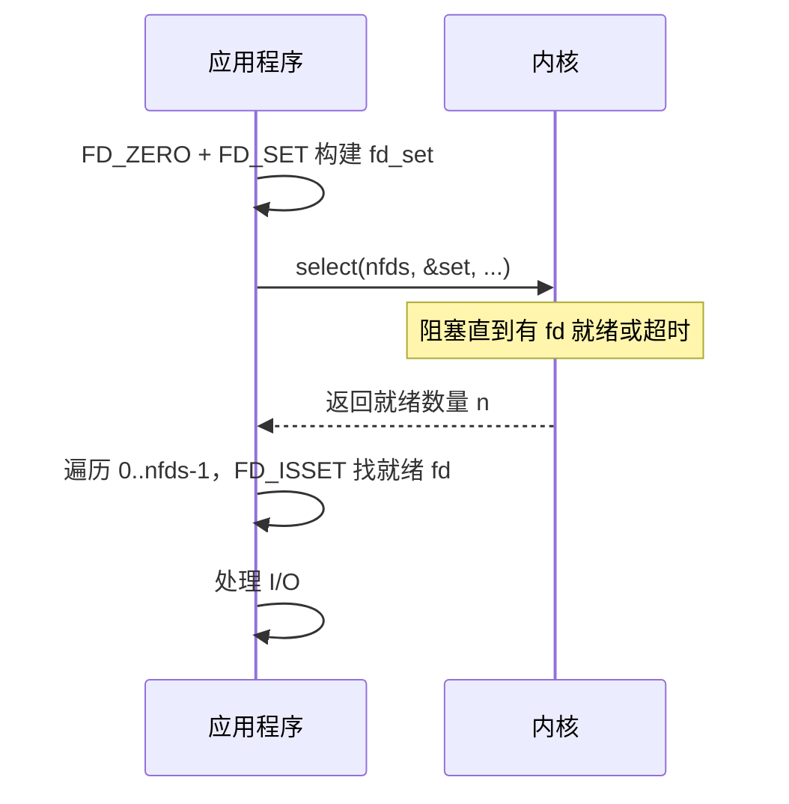
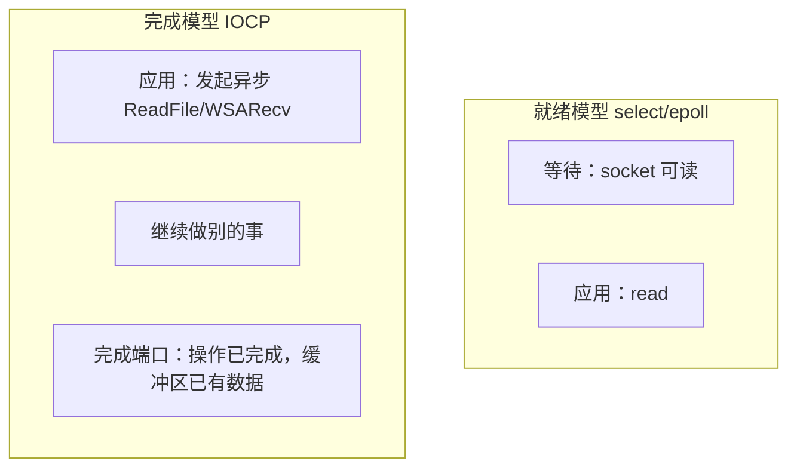

# I/O 多路复用技术指南

> **目标读者**：C 开发者，网络编程经验不多，正在学习 OpenHalo / PostgreSQL postmaster 的 `select` 监听模型。  
> **阅读建议**：先通读第 1–2 节建立直觉，再按需跳读各 API 详解，最后看第 8 节与 PG 的关系。

---

## 目录

1. [为什么需要 I/O 多路复用](#1-为什么需要-io-多路复用)
2. [演进时间线与阶段对比](#2-演进时间线与阶段对比)
3. [select](#3-select)
4. [poll](#4-poll)
5. [epoll（Linux）](#5-epolllinux)
6. [kqueue（BSD / macOS）](#6-kqueuebsd--macos)
7. [/dev/poll（Solaris）](#7devpollsolaris)
8. [Windows IOCP](#8-windows-iocp)
9. [io_uring（Linux 现代方案）](#9-io_uringlinux-现代方案)
10. [与 PostgreSQL postmaster ServerLoop 的关系](#10-与-postgresql-postmaster-serverloop-的关系)
11. [综合对比表](#11-综合对比表)
12. [记忆要点](#12-记忆要点)
13. [进一步阅读](#13-进一步阅读)

---

## 1. 为什么需要 I/O 多路复用

### 1.1 从一个阻塞 `accept` 说起

网络服务器的工作模式可以概括为：

1. 创建监听 socket（`socket` + `bind` + `listen`）
2. 等待客户端连接（`accept`）
3. 与客户端读写数据（`read` / `write`）
4. 关闭连接

**阻塞 I/O**（默认行为）：调用 `accept()` 或 `read()` 时，如果内核里还没有数据/连接，当前线程会**挂起睡眠**，直到事件发生才返回。

对**单个客户端**来说，这完全合理——反正也没别的事要做。

### 1.2 多连接困境

当服务器要同时服务成百上千个客户端时，问题出现了：

```
客户端 A 正在慢慢发数据（read 阻塞）
客户端 B 已经连上但没人 accept
客户端 C 的数据已在内核缓冲区，却没人 read
```

如果只有一个线程、一个连接套在一个 `read` 上，其他连接全部饿死。

### 1.3 三种经典解决思路（可并存）

| 思路 | 做法 | 解决什么 | 不解决什么 |
|------|------|----------|------------|
| **多进程/多线程 per-connection** | 每来一个连接 fork/创建一个 worker | 每个连接有独立执行流，互不阻塞 | 进程/线程数量随连接数线性增长，内存与调度开销大 |
| **I/O 多路复用** | 一个线程用 `select`/`epoll` 等同时监视多个 fd，谁就绪处理谁 | 用少量线程管理大量连接 | 单连接上的业务逻辑仍可能阻塞（除非配合非阻塞 I/O） |
| **异步 I/O** | 提交 I/O 请求后立即返回，完成后回调（`io_uring`、IOCP） | 连「等待就绪」的轮询/阻塞都可省掉 | 编程模型复杂，生态与可移植性各异 |

**关键认知**：多进程模型与 I/O 多路复用**不是互斥的**，它们解决**不同层面**的问题。

- **I/O 多路复用**：「我如何用一个线程知道**哪些 fd 现在可以读/写**？」
- **多进程 per-connection**（PG 的 fork 模型）：「连接进来之后，**谁去跑完整的会话逻辑**？」

PostgreSQL postmaster 正是两者结合：postmaster 用 `select` 监视少量监听 socket；一旦有新连接，**fork 一个 backend 子进程**专门服务该客户端，后续读写由子进程以阻塞方式处理，不再经过 postmaster 的多路复用。



### 1.4 非阻塞 I/O 与多路复用的配合

多路复用 API 通常与**非阻塞 socket**配合使用：

- `fcntl(fd, F_SETFL, O_NONBLOCK)` 让 `read`/`write` 在无数据时立即返回 `EAGAIN`，而不是睡眠
- 多路复用告诉你「可以读了」，你再 `read`；若一次没读完（ET 模式尤其如此），等下次通知

没有非阻塞 I/O，多路复用仍有用（如 PG postmaster 在 `accept` 前就知道有连接），但高并发服务器几乎总是两者一起用。

---

## 2. 演进时间线与阶段对比

| 阶段 | 年代/背景 | 没有新技术前怎么做 | 新技术解决什么 | 遗留问题 |
|------|-----------|-------------------|----------------|----------|
| **阻塞 + 多进程** | 早期 Unix | 主进程 `accept`，每连接 `fork` 子进程 | 简单可靠，隔离性好 | 进程重、C10K 困难 |
| **select** | 1983 BSD | 无法单线程监视多 fd；或只能轮询（busy-wait） | 内核一次返回多个就绪 fd | `FD_SETSIZE` 上限；fd_set 拷贝；O(n) 扫描 |
| **poll** | SVR4 / POSIX | select 的 fd 上限与位图不便 | 用数组代替位图，无硬编码 1024 上限 | 仍 O(n) 扫描全部 pollfd |
| **/dev/poll** | Solaris | 同 poll 的扩展性瓶颈 | Solaris 特有高性能接口 | 仅 Solaris；已较少使用 |
| **kqueue** | FreeBSD 4.1 (2000) | poll 的 O(n) | 内核事件队列 + kevent，高效增删 | 主要 BSD/macOS |
| **epoll** | Linux 2.5.45 (2002) | poll/select 在万级连接下 CPU 飙高 | O(1) 增删关注、仅返回就绪事件 | Linux 专用；ET 模式易踩坑 |
| **IOCP** | Windows NT | select 在 WinSock 上语义与性能都差 | 完成端口模型，与 Windows 线程池深度集成 | Windows 专用；完成事件而非就绪事件 |
| **io_uring** | Linux 5.1 (2019) | epoll 仍有一次次系统调用开销 | 共享环形队列批量提交/收割 I/O | 较新；API 与心智模型仍在演进 |

### 演进逻辑（ASCII）

```
单连接阻塞
    │
    ▼
多进程/fork（C 少时可行，PG 仍用此处理已接受连接）
    │
    ▼
select ──► poll ──► epoll / kqueue / IOCP  （解决「如何高效等待多 fd」）
    │                    │
    │                    ▼
    │              io_uring（进一步减少 syscall 次数）
    │
    └──► 与 fork/线程池并存，各管一层
```

---

## 3. select

### 3.1 原型

```c
int select(int nfds,
           fd_set *readfds,
           fd_set *writefds,
           fd_set *exceptfds,
           struct timeval *timeout);
```

- `nfds`：所有被监视 fd 中**最大值 + 1**（不是 fd 个数）
- `readfds` / `writefds` / `exceptfds`：三个**位图**（`fd_set`），分别表示关心读、写、异常的 fd
- `timeout`：`NULL` 表示一直阻塞；`{0,0}` 表示非阻塞轮询
- 返回：就绪 fd 数量；0 表示超时；`-1` 表示错误

辅助宏：`FD_ZERO`、`FD_SET`、`FD_CLR`、`FD_ISSET`。

### 3.2 工作流程



### 3.3 三个著名缺陷

#### （1）`FD_SETSIZE` 上限

在 Linux glibc 中，`FD_SETSIZE` 默认为 **1024**。`FD_SET` 对 `fd >= FD_SETSIZE` 的 fd 是**未定义行为**。

> **术语**：fd（file descriptor，文件描述符）是内核给打开文件/socket 分配的小整数句柄，0/1/2 通常是 stdin/stdout/stderr。

可通过重新编译 glibc 或 `poll`/`epoll` 绕过，但可移植代码通常遵守 1024 限制。

#### （2）fd_set 在内核与用户态之间拷贝

每次 `select` 调用，内核要拷贝整个 `fd_set`（典型 128 字节，但随 `FD_SETSIZE` 增大），返回时**覆盖** `fd_set`，只保留就绪位。因此常见写法是：

```c
fd_set rmask, readmask;
/* 初始化 readmask 一次 */
for (;;) {
    rmask = readmask;          /* 每次调用前恢复 */
    select(nfds, &rmask, ...);  /* 返回后 rmask 被改写 */
}
```

PG postmaster 的 `ServerLoop` 正是这个模式（见第 10 节）。

#### （3）O(n) 扫描

- 内核：扫描 0 到 `nfds-1` 的所有位
- 用户态：返回后用 `FD_ISSET` 再扫一遍

当监视 fd 少（个位数到几十个）时，这完全可接受；当 fd 上万时，CPU 浪费在「扫描未就绪的 fd」上。

### 3.4 优点（为何至今仍常见）

- **POSIX 标准**，几乎所有平台都有（含 Windows Winsock，语义略有差异）
- API 简单，适合 fd 数量极少的场景
- 跨平台库（如 libevent 的早期后端）普遍支持

---

## 4. poll

### 4.1 原型

```c
struct pollfd {
    int   fd;        /* 要监视的 fd；-1 表示忽略此项 */
    short events;    /* 关心的事件：POLLIN、POLLOUT 等 */
    short revents;   /* 返回时由内核填写实际发生的事件 */
};

int poll(struct pollfd *fds, nfds_t nfds, int timeout);
```

### 4.2 相对 select 的改进

| 点 | select | poll |
|----|--------|------|
| fd 上限 | `FD_SETSIZE`（通常 1024） | 仅受 `RLIMIT_NOFILE` 等系统限制 |
| 数据结构 | 位图 `fd_set` | `struct pollfd` 数组 |
| 添加 fd | 改位图 + 可能调整 nfds | 数组中加一项 |
| 返回结果 | 覆盖传入的 fd_set | 写入每项的 `revents` |

### 4.3 仍存在的问题：O(n) 扫描

`poll` 每次调用，内核仍要遍历整个 `fds` 数组（长度 `nfds`），连接数 N 很大时开销线性增长。  
它没有「注册一次、反复等待」的持久句柄概念——每次都要把**全部**关注列表交给内核。

`ppoll` 是 `poll` 的增强版（可纳秒级超时、信号掩码），本质局限相同。

---

## 5. epoll（Linux）

> **适用**：Linux 2.6+，高并发网络服务的首选之一（Nginx、Redis、Node.js libuv 等在 Linux 上默认用它）。

### 5.1 三个系统调用

```c
int epoll_create1(int flags);           /* 创建 epoll 实例 */
int epoll_ctl(int epfd, int op, int fd, struct epoll_event *event);
                                        /* EPOLL_CTL_ADD/MOD/DEL */
int epoll_wait(int epfd, struct epoll_event *events,
               int maxevents, int timeout);
```

**核心思想**：把「我关心哪些 fd」通过 `epoll_ctl` **注册进内核**，之后 `epoll_wait` 只返回**就绪的** fd，无需每次传递全量列表。

### 5.2 内核数据结构（理解用，非调用必需）

Linux 内核 epoll 实现（经典 2.6 设计）大致包含：

```
epoll 实例
├── 红黑树：存所有被监视的 fd（O(log n) 增删）
├── 就绪链表：当前可读的 fd 挂在这里
└── 回调：当某 socket 收到数据，内核把对应 epitem 链到就绪链表
```

另有 **eventfd** 等可纳入 epoll 监视，用于线程间唤醒（与网络 fd 统一事件源）。

### 5.3 水平触发（LT）与边缘触发（ET）

| 模式 | 行为 | 类比 |
|------|------|------|
| **LT（Level Trigger，默认）** | 只要 fd 上仍有未读数据 / 可写空间，每次 `epoll_wait` 都会报告 | 水龙头没关紧，一直滴水就一直提醒 |
| **ET（Edge Trigger）** | 仅在状态**从未就绪 → 就绪**的边沿通知一次 | 门铃只响一次，你必须一次拿完 |

ET 通常配合**非阻塞 I/O**，在 `read` 循环到 `EAGAIN` 为止，否则容易饿死（数据剩一半，不再通知）。

```c
/* ET 示例片段 */
ev.events = EPOLLIN | EPOLLET;
epoll_ctl(epfd, EPOLL_CTL_ADD, fd, &ev);

/* 读到 EAGAIN 才结束 */
while (1) {
    n = read(fd, buf, sizeof(buf));
    if (n < 0) {
        if (errno == EAGAIN) break;
        /* 错误处理 */
    }
    if (n == 0) { /* EOF */ break; }
    /* 处理数据 */
}
```

高并发服务器爱 epoll 的原因：

1. **O(1)** 地返回就绪事件（与总监听数 N 解耦，与就绪数相关）
2. 无需每次拷贝整个 fd 集合
3. ET 可减少 `epoll_wait` 返回次数（但编程更挑剔）

---

## 6. kqueue（BSD / macOS）

### 6.1 原型

```c
int kqueue(void);
int kevent(int kq,
           const struct kevent *changelist, int nchanges,
           struct kevent *eventlist, int nevents,
           const struct timespec *timeout);
```

`kevent` 一次调用可同时**提交变更**（注册/删除关注）和**收割事件**。  
不仅支持 socket，还支持文件、进程、信号、定时器（`EVFILT_TIMER`）等——比 epoll 覆盖面更广。

### 6.2 与 epoll 的对比直觉

| | epoll | kqueue |
|---|-------|--------|
| 平台 | Linux | FreeBSD、OpenBSD、macOS 等 |
| 注册/等待 | `epoll_ctl` + `epoll_wait` | 常合并到 `kevent` |
| 触发模式 | LT / ET | 类似 LT 的「过滤器」语义 |
| 非 socket 事件 | 主要靠 eventfd 等扩展 | 原生支持多种过滤器 |

在 macOS 上写高性能服务器，kqueue 的地位相当于 Linux 上的 epoll。

---

## 7. /dev/poll（Solaris）

Solaris 提供的 `/dev/poll` 字符设备接口：用户态写入要监视的 poll 结构，通过 `ioctl` 等待事件。  
设计目标与 epoll 类似：避免每次传递完整 poll 数组。  
随着 Solaris 市场份额下降以及 `event ports` 等更新 API 出现，`/dev/poll` 在业界讨论度已很低。  
了解即可：**「又一个想干掉 poll O(n) 的 Solaris 方案」**。

---

## 8. Windows IOCP

**I/O Completion Port（完成端口）** 是 Windows 高性能 I/O 的基石，与 Linux 的「就绪模型」（readable/writable）不同，IOCP 是**完成模型**：

- 你发起异步读/写（Overlapped I/O）
- 操作**完成后**，内核把结果放入完成端口队列
- 线程池从端口取完成包继续处理



PostgreSQL 在 Windows 上仍用 Winsock 的 `select` 做 postmaster 监听（与 Unix 代码路径类似），但 Windows 生态里大规模服务更常选 IOCP（IIS、C# `SocketAsyncEventArgs` 等）。

---

## 9. io_uring（Linux 现代方案）

### 9.1 解决什么问题

即使 epoll 已经很高效，高 IOPS 场景下**系统调用次数**本身仍是瓶颈：

```
read/write/connect/accept  each ──► syscall
epoll_wait                 ──► syscall
```

**io_uring**（Linux 5.1+，持续演进）通过**共享内存环形队列**让用户态与内核批量交换 I/O 请求与完成事件，大幅减少 syscall，并统一文件 I/O、网络、超时等操作。

### 9.2 核心结构（简化）

```
提交队列 SQ ──► 内核消费，执行 read/write/accept/...
完成队列 CQ ◄── 内核填入结果
```

常用库：`liburing`（官方辅助库）。

### 9.3 定位

| | epoll | io_uring |
|---|-------|----------|
| 心智模型 | 「哪些 fd 就绪了」 | 「这批 I/O 做完了没有」 |
| 成熟度 | 极高 | 快速成熟中，DB/存储领域开始采用 |
| 学习成本 | 低 | 中高 |

对 PG postmaster 这类「监视个位数 listen socket」的场景，io_uring **没有明显收益**；对追求极限 IOPS 的存储引擎更有吸引力。

---

## 10. 与 PostgreSQL postmaster ServerLoop 的关系

### 10.1 postmaster 在做什么

postmaster 是 PG 的**守护父进程**，职责包括：

- 监听 TCP/Unix socket，接受新连接
- fork / 管理 backend、background writer、checkpointer 等子进程
- 自身**不执行 SQL**

主循环是 `ServerLoop()`（`src/backend/postmaster/postmaster.c`），注释写明这是 postmaster 的 **idle loop**。

### 10.2 代码路径（PG 14.18）

**初始化监视集合** — `initMasks`：

```c
static int initMasks(fd_set *rmask)
{
    int maxsock = -1;
    FD_ZERO(rmask);
    for (i = 0; i < MAXLISTEN; i++) {
        int fd = ListenSocket[i];
        if (fd == PGINVALID_SOCKET) break;
        FD_SET(fd, rmask);
        if (fd > maxsock) maxsock = fd;
    }
    return maxsock + 1;   /* 即 select 的 nfds 参数 */
}
```

**主循环** — 核心片段：

```c
nSockets = initMasks(&readmask);
for (;;) {
    memcpy(&rmask, &readmask, sizeof(fd_set));
    DetermineSleepTime(&timeout);
    selres = select(nSockets, &rmask, NULL, NULL, &timeout);

    if (selres > 0) {
        for (i = 0; i < MAXLISTEN; i++) {
            if (FD_ISSET(ListenSocket[i], &rmask)) {
                port = ConnCreate(ListenSocket[i]);  /* 内部 accept */
                if (port) {
                    BackendStartup(port);            /* fork backend */
                    StreamClose(port->sock);
                    ConnFree(port);
                }
            }
        }
    }
    /* 另：检查并启动 bgwriter、checkpointer、syslogger 等 */
}
```

### 10.3 为何 PG 仍用 select 且完全合理

| 因素 | PG 实际情况 | 对 API 选择的影响 |
|------|-------------|-------------------|
| 监视的 fd 数量 | 仅 `ListenSocket[]`，通常几个（IPv4/IPv6/Unix） | O(n) 扫描 n≈3，开销可忽略 |
| 连接处理模型 | `accept` 后立即 `fork`，**不在 postmaster 里 multiplex 客户端 socket** | 不需要 epoll 管理万级连接 |
| 可移植性 | 需支持 Linux、BSD、macOS、Windows 等 | `select` 几乎到处可用 |
| 代码年龄与风险 | 核心路径稳定数十年 | 换成 epoll 收益极小、回归风险大 |
| 循环内还有别的工作 | 启动子进程、检查锁文件、touch socket 等 | `select` 带超时正好驱动周期性任务 |

**对比**：Nginx worker 在**单进程内**维持成千上万**已建立**的连接，必须用 epoll/kqueue；PG 把已建立连接扔给独立 backend 进程，postmaster 只当「门卫」。

### 10.4 两层架构再强调

```
层次 1 — postmaster：select 监听少量 listen fd → 新连接到来 → fork
层次 2 — backend 进程：单客户端会话，传统阻塞 read/write，直到断开
```

OpenHalo 继承同一 postmaster 架构；你读 MySQL 协议适配时，backend 里会有 `T_MySQLProtocol` 分支，但 **postmaster 监听层仍走 PG 的 select 模型**。

### 10.5 ServerLoop 在系统中的位置（ASCII）

```
                    ┌─────────────────────────────┐
                    │         postmaster          │
                    │  ┌───────────────────────┐  │
  listen fd(s) ────►│  │ ServerLoop + select() │  │
                    │  └──────────┬────────────┘  │
                    │             │ accept+fork   │
                    └─────────────┼───────────────┘
                                  │
              ┌───────────────────┼───────────────────┐
              ▼                   ▼                   ▼
        backend 进程          bgwriter           checkpointer
        (每连接一个)          (后台写缓冲)        (检查点)
              │
              ▼
        客户端 TCP 会话（阻塞 I/O，可跑 PG 或 MySQL 协议）
```

---

## 11. 综合对比表

| 机制 | fd 数量上限 | 内核扫描方式 | 每次调用传递关注集 | 跨平台 | 触发模式 | 典型场景 |
|------|-------------|--------------|-------------------|--------|----------|----------|
| **select** | `FD_SETSIZE`（常 1024） | O(nfds) | 是（整个 fd_set） | 极好 | 水平 | fd 极少、要可移植（PG postmaster） |
| **poll** | 系统 ulimit | O(nfds) | 是（整个数组） | POSIX | 水平 | 中等连接、需可移植 |
| **epoll** | 很大 | 仅就绪项 | 否（epoll_ctl 注册） | Linux | LT / ET | Linux 高并发服务器 |
| **kqueue** | 很大 | 仅就绪项 | 变更与等待可合并 | BSD/macOS | 过滤器语义 | macOS/BSD 服务器 |
| **/dev/poll** | 很大 | 优于 poll | 注册式 | Solaris | 水平 | 遗留 Solaris |
| **IOCP** | 很大 | 完成队列 | 异步提交 | Windows | 完成事件 | Windows 高并发 |
| **io_uring** | 很大 | 批量 CQ | 环形队列 | Linux 5.1+ | 完成事件 | 极限 IOPS、新项目 |

### 何时选什么（实用决策）

```
需要跨平台 + fd < 10        → select（PG 做法）
需要跨平台 + fd 数百        → poll / 封装库（libevent/libuv）
Linux + 高并发长连接        → epoll（ET + 非阻塞）
macOS/BSD                   → kqueue
Windows 原生高性能            → IOCP
Linux + 批量磁盘/网络 I/O   → 评估 io_uring
```

---

## 12. 记忆要点

1. **多路复用回答的是「等谁」**；**fork/线程回答的是「谁来做」**——PG 两个都要，各管一层。
2. **阻塞 read/accept** 让单线程无法服务多连接；多路复用让单线程**同时等待多个 fd**。
3. **select 三大痛**：1024 上限、fd_set 拷贝、O(n) 扫描——在 PG 里 n≈3，全不构成问题。
4. **poll 干掉上限，没干掉 O(n)**；**epoll/kqueue 干掉「每次全量传递 + 全量扫描」**。
5. **LT vs ET**：LT 省心；ET 省事件次数但必须非阻塞 + 读到尽。
6. **就绪（epoll）vs 完成（IOCP/io_uring）**：前者告诉你「可以读了」，后者告诉你「已经读完了」。
7. **高并发 Web 服务器**在**单进程内**持有海量连接 → 必须 epoll/kqueue；**PG postmaster**只持有监听 socket → select 足够。

---

## 13. 进一步阅读

### man 页（Linux）

```bash
man 2 select
man 2 poll
man 7 epoll
man 2 epoll_create
man 2 epoll_ctl
man 2 epoll_wait
man 2 io_uring_setup    # 需较新 man-pages
```

BSD/macOS：`man 2 kqueue`、`man 2 kevent`  
Windows：MSDN — *I/O Completion Ports*

### 内核与权威文档

- Linux **Epoll** 原理（LWN）：[Epoll is broken](https://lwn.net/Articles/703882/) 及后续讨论
- **io_uring** 官方 wiki：https://kernel.dk/io_uring.pdf（Jens Axboe）
- 《UNIX Network Programming, Volume 1》（Stevens）第 6 章 — I/O 多路复用经典教材

### PostgreSQL 源码

| 文件 | 内容 |
|------|------|
| `src/backend/postmaster/postmaster.c` | `ServerLoop`、`initMasks`、`BackendStartup` |
| `src/backend/libpq/pqcomm.c` | 监听 socket 创建 |
| `src/bin/pg_dump/parallel.c` | 工具侧也用 `select` 等多路复用（worker 管道） |

### 练习建议

1. 用 `strace -e trace=select,accept -p <postmaster_pid>` 观察 postmaster 阻塞在 `select` 上，连接到来时 `accept` + `fork`。
2. 写一个最小 echo server：先单线程阻塞版，再 `select` 版，对比代码结构。
3. （Linux）将 echo server 改为 `epoll` ET + 非阻塞，体会 `EAGAIN` 处理。

---

*文档版本：2025-06，基于 PostgreSQL 14.18 postmaster 实现整理。*
