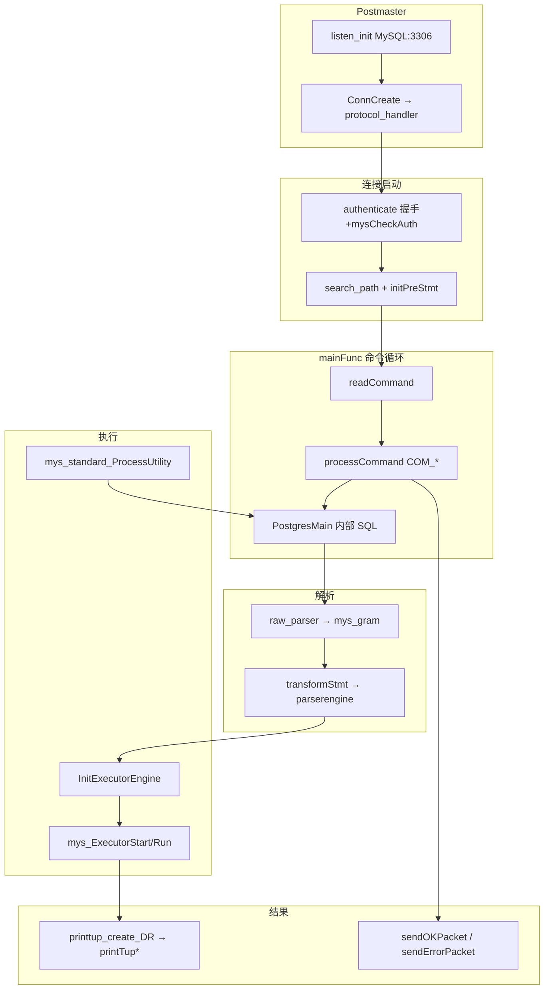
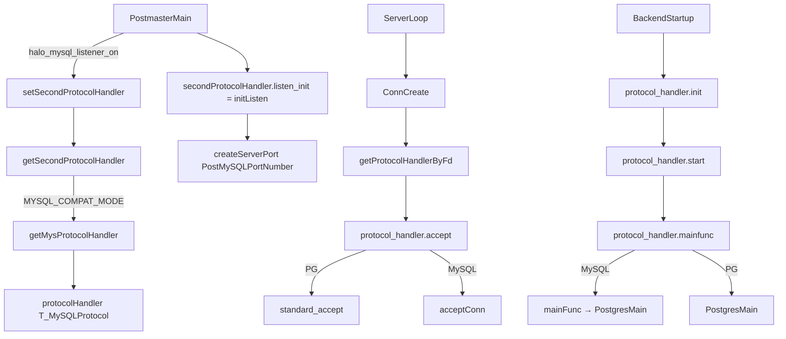
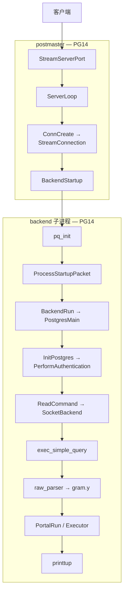
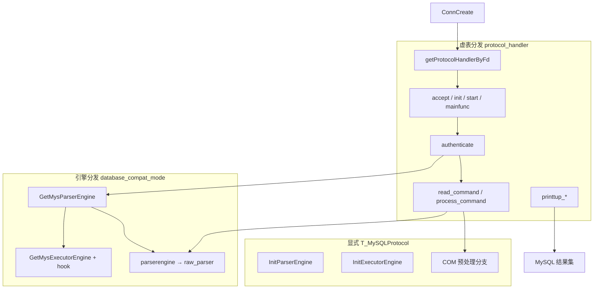
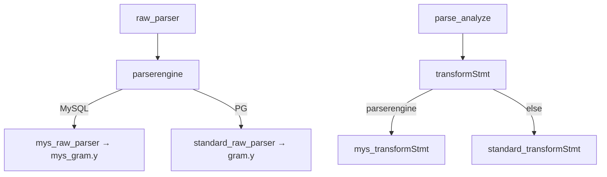
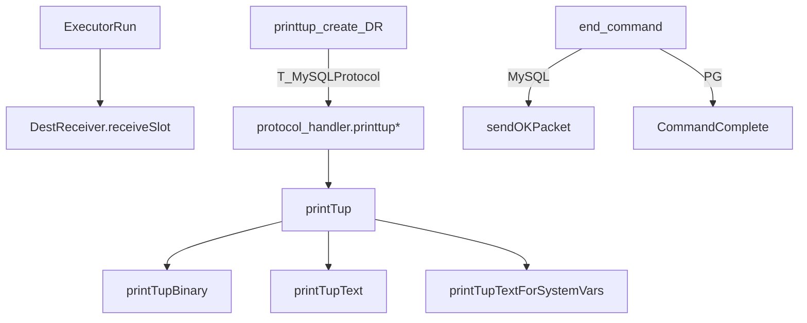

# OpenHalo 如何在 PG 内核上兼容 MySQL

> **重写日期**：2026-06-30，基于 [openhalo-pg14-increment-analysis.md](openhalo-pg14-increment-analysis.md)（618 项 diff，已复核）  
> **对照基线**：PostgreSQL 14.18（`postgresql-14.18`）  
> **OpenHalo 源码**：`openHalo-1.0-beta1`  
> **阅读对象**：有 C/C++ 背景、希望理解「OpenHalo 在 PG 上做了什么、为什么 MySQL 能连」的开发者  
> **本文定位**：结构化导读 + 关键路径 + 模块地图；**详细文件级 diff 见增量分析**，不重复 2094 行全文

## 1. 总述：一条 MySQL 查询怎么走

OpenHalo 在 PostgreSQL 14.18 上实现 **MySQL 线协议 + 语法 + 执行语义** 的兼容。核心手法：

1. **协议虚表** `ProtocolInterface` 贯穿连接生命周期（监听 → accept → 认证 → 读命令 → 回包）
2. **三层引擎**（Parser / Planner / Executor `*Routine`）按 `database_compat_mode` + `T_MySQLProtocol` 分发
3. **大文件分叉 + include 补丁**（`mys_gram.y`、`mys_tablecmds.c`、`utility.c` include `mys_utility.c`）
4. **SQL 扩展 + 内核 C 函数**（`contrib/aux_mysql` + `ddsm/mysm` + `adt/mysql`）

**为什么 MySQL 客户端能连**：PG 内核可拆成「网络协议 → SQL → 语法树 → 优化/执行 → 存储/事务 → 结果返回」。OpenHalo 在前半段（协议、解析）和语义差异处做兼容，后半段复用 PG 的优化器、执行器、存储与事务。

### 1.1 端到端调用链（与增量分析 §0 一致）



### 1.2 结论摘要（5 条）

1. **协议入口**：`halo_mysql_listener_on` → 第二监听 → `ConnCreate` 按 socket 选 `protocol_handler` → **TCP accept 在 postmaster（fork 前）**；MySQL 握手与认证在子进程 `authenticate` → `mainFunc`（内部进 `PostgresMain`）→ 主循环经 `read_command`/`process_command`/`printTup*`。
2. **解析链**：`raw_parser` → `GetMysParserEngine` → `mys_gram.y`；`transformStmt` → `parserengine->transform*`；`mys_utility.c` 处理 MySQL 工具语句。
3. **执行链**：`InitExecutorEngine` → `mys_executor_engine` 挂 `mys_ExecutorStart/Run`、`mys_ExecInitNode`；`ProcessUtility_hook = mys_standard_ProcessUtility`；DDL 主体在 `mys_tablecmds.c`。
4. **类型/函数**：`aux_mysql` 扩展注册 **1828** 条 `CREATE FUNCTION`（`mysql.*` **1823**）；实现落在 `ddsm/mysm/`（13×.c）与 `adt/mysql/`（6×.c）；`utils/adt/*.c` 另有 **15** 文件含协议分支。
5. **catalog/可见性**：`namespace2.c` 将 MySQL 协议下 `search_path` 的「系统 schema」映射为 `mysql`；`typaccess`/`proaccess`/`relaccess` 为 Halo 包模型扩展。

### 1.3 最小可用配置

```ini
database_compat_mode = mysql      # 实例级兼容模式；parser/executor 引擎选择依赖此开关
mysql.listener_on = on            # 在 mysql.port 上注册第二协议监听
mysql.port = 3306                 # MySQL wire protocol 端口（默认 3306）
```

| 要点 | 说明 |
|------|------|
| **双协议并存** | PG 标准端口（`port`，默认 5432）仍走 `standard_protocol_handler` |
| **缺一不可** | 仅设 `mysql.listener_on=on` 而未设 `database_compat_mode=mysql` 时，`getSecondProtocolHandler()` 会 **FATAL** |
| **aux_mysql 扩展** | 不会由 `initdb` 自动安装；需 `CREATE EXTENSION aux_mysql;`，否则 MySQL 类型与 `search_path` 中的 `mysql` schema 不可用 |

完整 GUC 列表见 **§4.2**。

---

## 2. 四层框架与关键符号

### 2.1 四层分类总表

| 层 | 纯新增（代表） | 改 PG 现有（代表） | 入口符号 |
|----|----------------|-------------------|----------|
| **协议** | `adapter/mysql/*`、`postmaster2.c`、`protocol_interface.h` | `postmaster.c`、`libpq-be.h`、`pqcomm.c`、`crypt.c` | `getMysProtocolHandler`、`authenticate`、`processCommand` |
| **解析** | `parser/mysql/`（`mys_gram.y`）、`parsereng.c`、`parser_ep.c`、`analyze2.c` | `parser.c`、`analyze.c`、`gram.y`、`nodes.h` | `InitParserEngine`、`raw_parser`、`transformStmt` |
| **执行** | `mys_executor.c`、`mys_exec*.c`、`commands/mysql/*`、`tcop/mysql/mys_utility.c` | `execMain.c`、`postgres.c`、`prepare.c`、`utility.c` include | `InitExecutorEngine`、`mys_ExecutorStart`、`mys_standard_ProcessUtility` |
| **结果** | `adapter.c` `printTup*`、`sendOKPacket` | `dest.h/c`、`printtup.h/c` | `printtup_create_DR`、`printTup` |

另有 **函数/类型层**（横跨执行与结果）：`contrib/aux_mysql`、`ddsm/mysm/`、`adt/mysql/`、`utils/adt` 协议分支 — 详见增量分析 §7。

### 2.2 关键符号速查表

| 符号 | 文件（beta1） | 角色 |
|------|---------------|------|
| `ProtocolInterface` | `protocol_interface.h` | 协议虚表类型 |
| `T_MySQLProtocol` | `nodes.h` | 协议判别 NodeTag |
| `getMysProtocolHandler` | `adapter.c:489` | MySQL handler 工厂 |
| `getSecondProtocolHandler` | `postmaster2.c:194` | 第二监听 handler |
| `getProtocolHandlerByFd` | `postmaster2.c:152` | socket → handler |
| `ConnCreate` | `postmaster.c:2574` | 连接创建 + handler 绑定 |
| `InitParserEngine` | `parsereng.c:37` | 解析器引擎初始化 |
| `InitExecutorEngine` | `executor_engine.c:40` | 执行器引擎初始化 |
| `InitPlannerEngine` | `planner_engine.c:36` | 规划器引擎（当前仍标准） |
| `database_compat_mode` | `parsereng.c` / `guc.c` | 兼容模式 GUC |
| `raw_parser` | `parser.c:52` | SQL 词法/语法总入口 |
| `transformStmt` | `parser_ep.c:70` | 分析阶段语句分发 |
| `standard_exec_simple_query` | `postgres.c:1017` | Simple Query 执行 |
| `mainFunc` | `adapter.c:805` | MySQL mainfunc → **调用** `PostgresMain` |
| `readCommand` | `adapter.c:852` | MySQL 读包 |
| `processCommand` | `adapter.c:1265` | MySQL COM 预处理 |
| `authenticate` | `adapter.c:690` | MySQL 登录认证 |
| `printtup_create_DR` | `printtup.c:75` | 协议化 DestReceiver 工厂 |
| `printTup` | `adapter.c:1084` | MySQL 行输出分发 |

完整符号索引见增量分析 **附录 B**。

### 2.3 协议层详图



> **时序**：`accept` 在 `ConnCreate` 内完成（postmaster、**fork 之前**）；`init` / `start` / `authenticate` 在 **fork 后的子进程**（`BackendInitialize` / `InitPostgres`）中执行。协议拆包与握手均发生在 TCP 已建立之后。

### 2.5 PG 原版调用链 vs OpenHalo 分叉

本节用 **源码行号**（见 §2.5.3/2.5.4 表）给出端到端证据；**流程图仅标函数名**。PG14 只有一条硬编码 libpq 路径；OpenHalo 在相同骨架上插入 `ProtocolInterface` 虚表分发，并在少数热点再加 `T_MySQLProtocol` / `database_compat_mode` 显式判断与 Parser/Executor 引擎切换。

#### 2.5.1 PG14 原版信息流（对照基线）



**要点**：PG14 无 `protocol_handler` 字段；`ConnCreate` 内直接 `StreamConnection`；`BackendStartup` 硬调 `ProcessStartupPacket`；`PostgresMain` 主循环经 `SocketBackend` 读包、`exec_simple_query` 执行；`raw_parser` 直接进 `gram.y`（`parser.c:42`）。

#### 2.5.2 OpenHalo 分叉总览



**beta1 的 PG 兼容路径**并未删除 PG14 逻辑，而是经 `postmaster2.c` 的 `standard_protocol_handler`（`postmaster2.c:52–75`）把原流程包装为虚表回调：`standard_accept`→`StreamConnection`（`:233`）、`standard_start`→`ProcessStartupPacket`（`:251`）、`standard_mainfunc`→`PostgresMain`（`:257`）、`standard_read_command`→`SocketBackend`（`postgres2.c:53`）、`exec_simple_query`→`standard_exec_simple_query`（`postgres2.c:63`）。

#### 2.5.3 表 A：阶段 × PG 路径（PG14 / beta1 standard_*）

| 阶段 | PG14 原版路径 | beta1 PG 路径（`standard_*`） | 文件:行号（PG14 / beta1） |
|------|---------------|--------------------------------|---------------------------|
| ① 监听 | `StreamServerPort` 填 `ListenSocket[]` | 同上 + `setStandardProtocolSocket` 注册 handler | `postmaster.c:1170` / `pqcomm.c`→`postmaster2.c:107` |
| ② accept + fork | `ServerLoop` → `ConnCreate` → `StreamConnection` | `getProtocolHandlerByFd` → `standard_accept`→`StreamConnection` | `1666/2544` / `1777/2588` + `postmaster2.c:233` |
| ③ 握手/认证 | `ProcessStartupPacket` → `InitPostgres` → `PerformAuthentication` | `standard_start`→`ProcessStartupPacket`；`standard_authenticate`→`PerformAuthentication` | `4473/785` / `4506/799` + `postmaster2.c:251` |
| ④ 后端入口 | `BackendRun` → `PostgresMain` | `standard_mainfunc`→`PostgresMain`（MySQL 亦经 `mainFunc` 调同一函数） | `4527/4541` / `4577` + `postmaster2.c:257`、`adapter.c:805` |
| ⑤ 读命令 | `ReadCommand` → `SocketBackend` | `protocol_handler->read_command`；PG 为 `standard_read_command`→`SocketBackend` | `postgres.c:474` / `postgres.c:513` + `postgres2.c:53` |
| ⑥ 命令分发 | `switch(firstchar)` 处理 Q/P/B… | MySQL 先走 `process_command`（COM_*），再回落 PG `switch` | `postgres.c` 主循环 / `postgres.c:4744–4763` |
| ⑦ 解析 | `pg_parse_query` → `raw_parser` → `gram.y` | 同入口；`parserengine->raw_parser` 在 MySQL 引擎下设为 `mys_gram` | `parser.c:42` / `parser.c:641–66` |
| ⑧ 执行 | `exec_simple_query` → Portal/Executor | `standard_exec_simple_query`；MySQL 引擎挂 `mys_Executor*` | `postgres.c:924` / `postgres.c:1025` + `executor_engine.c:40` |
| ⑨ 结果 | `printtup_create_DR` → `printtup` | 若 handler 提供 `printtup` 则走协议回调 | `printtup.c` / `printtup.c:80–85` |

#### 2.5.4 表 B：分叉类型 × 判据 × 双路径

| 分叉类型 | 判据 / 触发条件 | MySQL 路径 | 文件:行号 | PG / standard 路径 |
|----------|----------------|------------|-----------|-------------------|
| **虚表：监听** | `halo_mysql_listener_on` + `database_compat_mode=mysql` | `getSecondProtocolHandler`→`getMysProtocolHandler`→`initListen` | `postmaster.c:1312–1319`、`postmaster2.c:195–208`、`adapter.c:517` | `StreamServerPort` + `setStandardProtocolSocket` |
| **虚表：socket→handler** | `ListenSocket[i]` 索引 | `getProtocolHandlerByFd` → MySQL handler | `postmaster2.c:153–165`、`postmaster.c:2588` | 同函数 → `standard_protocol_handler`（`postmaster2.c:52`） |
| **虚表：accept** | `protocol_handler->accept` | `acceptConn` | `adapter.c:640`、`postmaster.c:2591` | `standard_accept`→`StreamConnection`（`postmaster2.c:233`） |
| **虚表：init** | `protocol_handler->init` | `initServer` | `postmaster.c:4418`、`adapter.c:469` | `standard_init`→`pq_init`（`postmaster2.c:245`） |
| **虚表：start** | `protocol_handler->start` | `startServer`（仅设 `B_BACKEND`，无握手） | `postmaster.c:4506`、`adapter.c:470` | `standard_start`→`ProcessStartupPacket`（`postmaster2.c:251`） |
| **虚表：认证** | `protocol_handler->authenticate` | `authenticate`（握手+mysCheckAuth） | `postinit.c:799`、`adapter.c:690` | `standard_authenticate`→`PerformAuthentication`（`postinit2.c:51`） |
| **虚表：main** | `protocol_handler->mainfunc` | `mainFunc` → **仍调用** `PostgresMain` | `postmaster.c:4577`、`adapter.c:805–807` | `standard_mainfunc`→`PostgresMain`（`postmaster2.c:257`） |
| **虚表：读命令** | `protocol_handler->read_command` | `readCommand`（MySQL 包） | `postgres.c:513`、`adapter.c:852` | `standard_read_command`→`SocketBackend`（`postgres2.c:53`） |
| **虚表：COM 预处理** | `process_command` 非 NULL | `processCommand`（COM_QUERY 等） | `postgres.c:4744–4750`、`adapter.c:1265` | `process_command == NULL`，直接 `switch(firstchar)` |
| **虚表：就绪/错误/结果** | 各协议回调 | `sendReadyForQuery`、`sendErrorMessage`、`printTup*` | `adapter.c:473–484`、`printtup.c:80` | `ReadyForQuery`、`ereport`、`printtup` |
| **显式：`T_MySQLProtocol`** | `nodeTag(protocol_handler)==T_MySQLProtocol` | COM 包单独处理、多结果集 `moreResultsFlag`、dbname 映射 `halo0root` | `postgres.c:4748`、`1128–1130`、`4306–4314` | 走 PG `switch` / 正常 dbname |
| **显式：认证库名** | 同上 + `database_name` 非空 | MySQL 会话库映射为 `halo0root` | `postinit.c:802–810` | 使用 `port->database_name` |
| **引擎：`InitParserEngine`** | `database_compat_mode` +（MySQL 时）`T_MySQLProtocol` | `GetMysParserEngine` | `parsereng.c:40–50` | `GetStandardParserEngine`（`:43`、`:54`） |
| **引擎：`raw_parser`** | `parserengine->raw_parser` | `mys_gram.y` 入口 | `parser.c:58–66` | `gram.y`（PG14 `parser.c:42` 直调） |
| **引擎：`transformStmt`** | `parserengine->transformStmt` | MySQL 分析例程 | `parser_ep.c:76–77` | `standard_transformStmt`（`:79`） |
| **引擎：`InitExecutorEngine`** | `database_compat_mode` + `T_MySQLProtocol` | `GetMysExecutorEngine` + `ProcessUtility_hook=mys_standard_ProcessUtility` | `executor_engine.c:42–53` | `GetStandardExecutorEngine`（`:45`、`:57`） |
| **引擎：utility 分叉** | `MYSQL_COMPAT_MODE` ∧ `T_MySQLProtocol` | MySQL `CallStmt` 等语义 | `utility.c:2051–2053` | 标准 `ProcessUtility` 路径 |

**关键分叉点计数**（表 B 各行，去重后 **18** 处）：虚表分发 **10**、显式 `T_MySQLProtocol` **3**、引擎分发 **5**。

#### 2.5.5 三类分叉机制说明

1. **虚表分发**（多数连接生命周期步骤）：代码形态为 `port->protocol_handler->accept/init/start/mainfunc/read_command/...`，**不出现** `if mysql` 字面判断；MySQL 与 PG 在 `ConnCreate` 时由 `getProtocolHandlerByFd`（`postmaster2.c:153`）按监听 socket 绑定不同 `ProtocolInterface` 实例（PG：`standard_protocol_handler` `postmaster2.c:52`；MySQL：`protocolHandler` `adapter.c:464`，`.type = T_MySQLProtocol` `:465`）。

2. **显式协议判断**：在须区分「同兼容模式下非 MySQL 连接」（如 5432 口仍走 PG 协议）或细粒度语义处，用 `nodeTag(MyProcPort->protocol_handler) == T_MySQLProtocol`；典型热点见表 B 中 `postgres.c:4748`、`parsereng.c:47`、`executor_engine.c:49`。

3. **引擎分发**：`InitPostgres` 末尾依次 `InitParserEngine` / `InitPlannerEngine` / `InitExecutorEngine`（`postinit.c:1153–1159`）；`database_compat_mode=mysql` 时，仅当当前连接为 MySQL 协议才切换到 `GetMysParserEngine` / `GetMysExecutorEngine`；之后 `raw_parser`（`parser.c:66`）、`transformStmt`（`parser_ep.c:76`）经 `parserengine` 函数指针间接调用，无需在每个调用点重复判断协议。

---

## 3. 八步信息流

正文按**信息流入顺序**展开八步；**PG14 原版链路与 OpenHalo 分叉对照见 §2.5**（表 A/B 含文件:行号证据；流程图仅标函数名）。每步格式：**PG14 原版** → **OpenHalo 增量** → **关键文件** → **增量分析章节**。

| 步骤 | 内容 | 本文 | 增量分析 |
|------|------|------|----------|
| ① | 监听 | §3.1 | §3、§8.1 |
| ② | accept + fork | §3.2 | §3、§8.1 |
| ③ | 握手/认证 | §3.3 | §3.5、§3续.5 |
| ④ | 读命令 | §3.4 | §3续.2、§4续.5 |
| ⑤ | 命令预处理 | §3.5 | §3续.3、§4续.5 |
| ⑥ | 解析 | §3.6 | §4、§4续.6 |
| ⑦ | 执行 | §3.7 | §5、§5续 |
| ⑧ | 结果返回 | §3.8 | §6 |

---

### 3.1 步骤①：监听

**PG14 原版**

- `postmaster.c` 在 `PostPortNumber`（默认 5432）调用 `StreamServerPort`，将 fd 填入 `ListenSocket[]`
- 单一协议：所有连接走 `StreamConnection` → `ProcessStartupPacket` → `PostgresMain`
- 无 `ProtocolInterface` 抽象；协议逻辑硬编码在 postmaster / libpq / tcop

**OpenHalo 增量**

- 引入 `ProtocolInterface` 虚表（`protocol_interface.h`，111 行）与双监听 API（`postmaster2.h` / `postmaster2.c`）
- `ListenSocket[i]` 与 `ListenHandler[i]` 并行数组；PG 监听经 `setStandardProtocolSocket` 注册 `standard_protocol_handler`
- 当 `halo_mysql_listener_on=on` 且 `database_compat_mode=mysql`：
  - `setSecondProtocolHandler(getSecondProtocolHandler())`（`postmaster.c:1311–1320`）
  - `secondProtocolHandler->listen_init()` → `initListen()` 在 `PostMySQLPortNumber`（默认 3306）上 `createServerPort`
- `getSecondProtocolHandler()` 在 `POSTGRESQL_COMPAT_MODE` 下 **FATAL**（`postmaster2.c:194–218`）

**关键文件**

| 路径 | 纯新增/改 PG | 职责 |
|------|-------------|------|
| `protocol_interface.h` | 纯新增 | `ProtocolRoutine` 回调虚表 |
| `postmaster2.c` | 纯新增 | `standard_protocol_handler` + socket↔handler 映射 |
| `postmaster.c` | 改 PG | 双监听启动、`ConnCreate` 分发 |
| `pqcomm.c` | 改 PG | PG 监听改为 `setStandardProtocolSocket` |
| `adapter.c` `initListen` | 纯新增 | MySQL 端口绑定 |

**深入**：增量分析 §3.1–§3.3、§8.1、§8.5

---

### 3.2 步骤②：accept 与 fork

**PG14 原版**

- `ServerLoop` 在 `ListenSocket[]` 上就绪时 `accept`
- `ConnCreate` 直接 `StreamConnection(serverFd, port)` 完成 TCP 接受与 `Port` 初始化
- `fork` 子进程进入 `BackendStartup` → `PostgresMain`

**OpenHalo 增量**

- `ConnCreate`（`postmaster.c:2587–2597`）在 **postmaster 进程、fork 之前**完成 TCP `accept`：
  1. `port->protocol_handler = getProtocolHandlerByFd(serverFd)` — 按监听 socket 选定协议 handler
  2. `port->protocol_handler->accept(serverFd, port)` — PG/MySQL 均经 `StreamConnection` 接受连接（MySQL 的 `acceptConn` 内部亦调用它）
- `BackendStartup` **fork 子进程**后，子进程内 `BackendInitialize` → `BackendRun`：
  - `protocol_handler->init()` — PG：`standard_init`→`pq_init`；MySQL：`initServer`
  - `protocol_handler->start(port)` — PG：`standard_start`→`ProcessStartupPacket`；MySQL：`startServer`（空操作）
  - `protocol_handler->mainfunc` — PG：`standard_mainfunc`→`PostgresMain`；MySQL：`mainFunc`→`PostgresMain`
- `Port` 结构新增 `protocol_handler` 字段（`libpq-be.h`）

**关键文件**

| 路径 | 说明 |
|------|------|
| `libpq-be.h` | `Port.protocol_handler` |
| `pgcomm2.h` | 标准协议各阶段函数声明 |
| `postmaster2.c` | `standard_*` 包装 PG 原有流程 |
| `adapter.c` `acceptConn` | 包装 `StreamConnection`（与 PG `standard_accept` 相同底层） |

**深入**：增量分析 §3.3、§8.4

---

### 3.3 步骤③：握手与认证

**PG14 原版**

- libpq startup packet：版本、用户、数据库、GUC 参数
- `PerformAuthentication(MyProcPort)` 走 PG 认证（md5/scram/peer 等）
- 无 MySQL handshake / `mysql_native_password`

**OpenHalo 增量**

- `InitPostgres` 中认证改为协议化：
  ```c
  MyProcPort->protocol_handler->authenticate(MyProcPort, &username);
  ```
- MySQL 路径 `authenticate`（`adapter.c:690–802`）：
  1. `assembleHandshakePacketPayload` 发握手包（`userLogonAuth.c`）
  2. 读客户端认证响应
  3. `mysCheckAuth` 校验（`userLogonAuth.c:275`）；密码哈希用 `mysNativePwdEncrypt`（`pwdEncryptDecrypt.c`）
  4. 设置 `search_path`、调用 `initPreStmt`、`getCaseInsensitiveId()`
  5. 校验目标库 schema 存在；失败发 MySQL Error 1049
- `password_encryption` GUC 扩展 `mysql_native_password` 枚举（`guc.c`）

**adapter/mysql 目录职责**

| 文件 | 行数约 | 职责 |
|------|--------|------|
| `adapter.c` | 6552 | 协议全流程、命令分发、结果集 |
| `netTransceiver.c` | 569 | MySQL 包读写分包 |
| `userLogonAuth.c` | 570 | 握手/认证包编解码 |
| `pwdEncryptDecrypt.c` | 168 | `mysql_native_password` |
| `errorConvertor.c` | 172 | PG 错误码 → MySQL 错误码 |
| `systemVar.c` | 1667 | MySQL 系统变量模拟 |
| `uuidShort.c` | 214 | `UUID_SHORT()` 共享内存 |

**深入**：增量分析 §3.5–§3.11、§3续.5.1、§4续.7、§8.7.1

---

### 3.4 步骤④：读命令

**PG14 原版**

- `PostgresMain` 主循环调用 `ReadCommand` → `SocketBackend(inBuf)`
- 首字节为消息类型：`'Q'` Simple Query、`'P'` Parse、`'B'` Bind 等（libpq 协议）

**OpenHalo 增量**

- `ReadCommand` 改为协议分发（`postgres.c:509`）：
  ```c
  result = MyProcPort->protocol_handler->read_command(inBuf);
  ```
- MySQL `readCommand`（`adapter.c:852–868`）：
  - 经 `netTransceiver->readPayload` 读 MySQL 包 payload
  - 返回 COM 命令字节：`MYS_REQ_QUERY(3)`、`MYS_REQ_PREPARE(22)`、`MYS_REQ_EXECUTE(23)` 等
- PG 标准路径：`postgres2.c` 提供 `standard_read_command` → `SocketBackend`

**tcop 重构要点**

- PG14 中 `exec_simple_query` 等为 `postgres.c` 内 `static` 函数
- beta1 重命名为 `standard_exec_simple_query` 等，由 `postgres2.c`（80 行）提供非 static 包装
- `postgres.c` 末尾 `#include "postgres2.c"`（L5283）

**深入**：增量分析 §3续.2、§4续.2、§4续.5

---

### 3.5 步骤⑤：命令预处理

**PG14 原版**

- libpq 消息直接进入 `exec_simple_query` / `exec_parse_message` 等
- 无 MySQL `COM_QUERY` / `COM_STMT_*` / `COM_QUIT` 概念

**OpenHalo 增量**

- 主循环在 `read_command` 之后、`exec_simple_query` 之前插入 `process_command` 钩子（`postgres.c:4741–4765`）：
  ```c
  if (MyProcPort->protocol_handler->process_command) {
      if (nodeTag(MyProcPort->protocol_handler) == T_MySQLProtocol) {
          int process_ret = MyProcPort->protocol_handler->process_command(...);
          if (process_ret == 1) { /* 已处理，跳过后续 */ continue; }
      }
  }
  ```
- `processCommand`（`adapter.c:1265–1659`，约 395 行）处理：
  - `COM_QUIT`、`COM_INIT_DB`（`USE`）、`COM_PING`
  - `COM_QUERY`：提取 SQL 文本、多语句分割、`rectifyCommand` 预处理
  - `COM_PREPARE` / `COM_STMT_EXECUTE` / `COM_STMT_CLOSE`：预编译语句状态机
  - `COM_FIELD_LIST`、`COM_PROCESS_INFO` 等元数据命令
- 处理后 SQL 文本进入 `standard_exec_simple_query` → `raw_parser`

**COM 命令常量**（`adapter.c:106–119`）：`MYS_REQ_QUERY(3)`、`MYS_REQ_PREPARE(22)`、`MYS_REQ_EXECUTE(23)` 等。

**深入**：增量分析 §3续.3、§3续.5.2

---

### 3.6 步骤⑥：解析

**PG14 原版**

- `raw_parser` → Flex/Bison `gram.y` → 原始语法树
- `parse_analyze` → `transformStmt` → PG `Query` 树
- 单一文法、单一语义分析路径

**OpenHalo 增量**

**引擎选择**（`parsereng.c:37–63`）：

```c
void InitParserEngine(void)
{
    switch (database_compat_mode) {
    case MYSQL_COMPAT_MODE:
        if (MyProcPort && nodeTag(MyProcPort->protocol_handler) == T_MySQLProtocol)
            parserengine = GetMysParserEngine();
        else
            parserengine = GetStandardParserEngine();
        break;
    default:
        parserengine = GetStandardParserEngine();
    }
}
```

**解析调用链**：



**parser/mysql/ 目录（纯新增）**

| 文件 | 行数约 | 职责 |
|------|--------|------|
| `mys_parser.c` | 556 | `mys_parser_engine` 工厂、`mys_raw_parser` |
| `mys_gram.y` | 24199 | MySQL Bison 语法（**最大文件之一**） |
| `mys_scan.l` | 1582 | MySQL Flex 词法 |
| `mys_analyze.c` | 3493 | `mys_transformStmt` 语义分析主模块 |
| `mys_parse_utilcmd.c` | 5538 | utility 语句 transform |
| `mys_parse_expr.c` | 4020 | 表达式解析 |
| `parser_ep.c` | 808 | `transformStmt` 等全局分发 |
| `analyze2.c` | 300 | `transformInsertStmt` 引擎包装 |

**语法树扩展**：`nodes/mysql/mys_parsenodes.h`；`nodes.h` 增加 `T_MySQLProtocol` 等 NodeTag；`parsenodes.h` 扩展 MySQL 特有节点。

**回退机制**：`standard_parserengine_auxiliary=on`（默认）时，MySQL parser 失败可回退 PG parser。

**深入**：增量分析 §4 全文、§4续.6

---

### 3.7 步骤⑦：执行

**PG14 原版**

- `ExecutorStart` / `ExecutorRun` / `ExecInitNode` 等为固定实现
- `ProcessUtility` 处理 DDL / `COPY` / `VACUUM` 等
- 无 MySQL `REPLACE` / `ON DUPLICATE KEY` / `INSERT IGNORE` 等语义

**OpenHalo 增量**

**执行引擎选择**（`executor_engine.c:40–53`）：

```c
void InitExecutorEngine(void)
{
    switch (database_compat_mode) {
    case MYSQL_COMPAT_MODE:
        if (MyProcPort && nodeTag(MyProcPort->protocol_handler) == T_MySQLProtocol) {
            executorengine = GetMysExecutorEngine();
            ProcessUtility_hook = mys_standard_ProcessUtility;
        } else
            executorengine = GetStandardExecutorEngine();
        break;
    default:
        executorengine = GetStandardExecutorEngine();
    }
    ExecutorStart_hook = executorengine->ExecutorStart;
    ExecutorRun_hook = executorengine->ExecutorRun;
}
```

**MySQL 执行补丁要点**

| 模块 | 文件 | 职责 |
|------|------|------|
| 执行引擎虚表 | `mys_executor.c` | 挂接 `mys_ExecutorStart/Run`、`mys_ExecInitNode` |
| 执行主流程 | `mys_execMain.c` | MySQL 模式 `ExecutorStart`/`ExecutorRun` 包装 |
| 计划节点 | `mys_execProcnode.c` | `ModifyTable` → `mys_ExecInitModifyTable` |
| DML 语义 | `mys_nodeModifyTable.c` | `INSERT`/`REPLACE`/`ON DUPLICATE KEY`（3958 行） |
| 分区 | `mys_execPartition.c` | MySQL 分区表路由 |
| DDL | `commands/mysql/mys_tablecmds.c` | `CREATE TABLE` MySQL 选项、`MODIFY COLUMN` 等（17019 行） |
| Utility | `tcop/mysql/mys_utility.c` | `CREATE DATABASE`、`USE`、部分 `SHOW`（~1706 行） |
| 规划器 | `planner_engine.c` | 当前 MySQL 连接仍用 **标准** planner；`pathnode2.c` 有 MERGE 路径扩展 |

**postgres.c 执行期修补**（非引擎层）：

- MySQL UPDATE 去重 `targetList` 同名列（L701–768）
- 多语句循环 `moreResultsFlag`（L1107–1122）
- 空 parsetree 发 `sendOKPacket()` 而非 `NullCommand`（L1382–1395）
- `stmtLen`、`isIgnoreStmt` 全局（L108–109）供 `INSERT IGNORE` 等

**引擎初始化顺序**（`postinit.c:1152–1165`）：

```
InitParserEngine() → InitPlannerEngine() → InitExecutorEngine() → InitADTExt() → InitFmgrExtension()
```

**深入**：增量分析 §5、§5续、§5续.2、§4续.5

---

### 3.8 步骤⑧：结果返回

**PG14 原版**

- `DestReceiver` → `printtup` 按 libpq 行协议输出
- `EndCommand` 发 `CommandComplete` 消息
- 错误经 `ereport` → libpq ErrorResponse

**OpenHalo 增量**

**结果层调用链**：



**关键改动**

| 文件 | 变更 |
|------|------|
| `dest.h/c` | `DestReceiver` 回调增加 `CommandTag` 参数（区分 INSERT `last_insert_id`） |
| `printtup.h/c` | `PrinttupAttrInfo`/`DR_printtup` 上移头文件；`printtup_create_DR` 挂接协议 handler |
| `adapter.c` | `printTup*` 系列：Field 包、文本/二进制结果集、`information_schema` 特殊路径 |
| `postgres.c` | `EndCommand` → `protocol_handler->end_command`；错误/ReadyForQuery 协议化 |

**adapter.c printTup* 分块**

| 符号 | 行号约 | 职责 |
|------|--------|------|
| `printTup` | 1084 | 分发 Binary / SystemVars / Text |
| `printTupStartup` | 1105 | 列定义包（Field 包） |
| `printTupText` | 3381 | 文本协议结果集行 |
| `printTupBinary` | 2811 | 预处理语句二进制结果 |
| `printTupStartupForInformationSchema` | 2585 | `information_schema` 元数据 |
| `sendOKPacket` / `sendErrorPacket` | 495–514 | OK/Error 包 |

**函数/类型层对结果的影响**

- `contrib/aux_mysql`：domain 类型（`tinyint`、`datetime` 等）决定列类型 OID 与输出格式
- `adt/mysql/` + `ddsm/mysm/`：类型 I/O、cast、内建函数实现
- `utils/adt/*.c` 15 个文件的 `T_MySQLProtocol` 分支：按协议调整输出格式

**深入**：增量分析 §6、§7

---

## 4. 三层引擎与 GUC

### 4.1 引擎切换总览

OpenHalo 用 **虚表 + 全局指针** 模式在 PG 内核插入可切换层，类似多协议抽象的 Babelfish 设计。

| 引擎 | 虚表类型 | 初始化 | MySQL 连接下 | PG 连接 / 默认 |
|------|----------|--------|-------------|----------------|
| **Parser** | `ParserRoutine` | `InitParserEngine` | `GetMysParserEngine` | `GetStandardParserEngine` |
| **Planner** | `PlannerRoutine` | `InitPlannerEngine` | `GetStandardPlannerEngine`（**当前**） | 同左 |
| **Executor** | `ExecutorRoutine` | `InitExecutorEngine` | `GetMysExecutorEngine` + `ProcessUtility_hook` | `GetStandardExecutorEngine` |

**切换判据**（三者共同条件）：

1. `database_compat_mode == MYSQL_COMPAT_MODE`（postmaster 级 GUC）
2. `MyProcPort->protocol_handler` 的 `nodeTag` 为 `T_MySQLProtocol`

仅设 `database_compat_mode=mysql` 但走 PG 端口（5432）连接时，仍用 **标准** parser/executor — 便于 DBA 用 psql 管理。

**初始化时机**：`BackendStartup` → `InitPostgres`（`utils/init/postinit.c`）内依次调用，在认证完成之后、进入 `mainfunc` 之前。

### 4.2 GUC 一览

| GUC 名 | 变量 | 默认 | 级别 | 作用 |
|--------|------|------|------|------|
| `database_compat_mode` | `database_compat_mode` | postgresql | POSTMASTER | 兼容模式总开关 |
| `mysql.listener_on` | `halo_mysql_listener_on` | false | POSTMASTER | 第二协议监听 |
| `mysql.port` | `PostMySQLPortNumber` | 3306 | POSTMASTER | MySQL 端口 |
| `mysql.explicit_defaults_for_timestamp` | `halo_mysql_explicit_defaults_for_timestamp` | false | POSTMASTER | 时间戳默认值语义 |
| `mysql.auto_rollback_tx_on_error` | `halo_mysql_auto_rollback_tx_on_error` | false | POSTMASTER | 错误自动回滚 |
| `mysql.support_multiple_table_update` | `halo_mysql_support_multiple_table_update` | true | POSTMASTER | 多表 UPDATE |
| `mysql.column_name_case_control` | `halo_mysql_column_name_case_control` | 0 | POSTMASTER | 列名大小写 |
| `mysql.max_allowed_packet` | `halo_mysql_max_allowed_packet` | 64MB | USERSET | 最大包长 |
| `mysql.halo_mysql_version` | `halo_mysql_version` | "5.7.32-log" | POSTMASTER | 版本字符串 |
| `standard_parserengine_auxiliary` | `standard_parserengine_auxiliary` | on | USERSET | MySQL parser 失败回退 PG |
| `password_encryption` | — | — | — | 扩展 `mysql_native_password` |

表级 GUC：`halo_heap_default_fillfactor` 等见 `relopts_guc.h` / `relopts_guc.c`（Wave 0 契约，非 MySQL 核心）。

**深入**：增量分析 §8.2

### 4.3 catalog 与可见性（跨层）

| 改动 | 文件 | 作用 |
|------|------|------|
| schema 映射 | `namespace2.c` | `get_specific_namespace_oid_by_env`：MySQL 下 `pg_catalog` 等映射为 `mysql` |
| 类型访问控制 | `pg_type.h` `typaccess` | Halo 包模型 |
| 函数访问控制 | `pg_proc.h` `proaccess` | 过程/包可见性 |
| 表访问控制 | `heap.h` `relaccess` | 表级访问 |

这些与 MySQL 兼容**间接相关**（影响 `search_path`、元数据查询、`SHOW` 结果），移植时见 execution-plan Wave 8。

---

## 5. 改动规模与模块地图

### 5.1 diff 统计（复核 2026-06-30）

| 类别 | 数量 | 说明 |
|------|------|------|
| `diff -rq` 总项 | **618** | 含 Only in / differ |
| 内容 differ | **414** | 两树均有路径但内容不同 |
| 仅 beta1 有 | **~76** | `adapter/`、`parser/mysql/`、`contrib/aux_mysql/` 等 |
| 仅 PG14 有 | **~128** | 多为生成物（`gram.c`、`pg_*_d.h`）或文档构建产物 |

### 5.2 `src/backend` 子目录 differ Top

| 目录 | differ 数 | 层 |
|------|-----------|-----|
| `utils/adt` | 19 | 函数/类型 |
| `parser` | 20 | 解析 |
| `commands` | 18 | 执行 |
| `executor` | 16 | 执行 |
| `catalog` | 15 | 改 PG |
| `libpq` | 6 | 协议 |
| `postmaster` | 3 | 协议 |
| `tcop` | 5 | 协议/结果 |
| `utils/misc` | 4 | Wave 0 GUC |

### 5.3 纯新增核心目录地图

```
openHalo-1.0-beta1/src/
├── backend/
│   ├── adapter/mysql/          # 协议全流程（adapter.c 6552 行）
│   ├── parser/mysql/           # MySQL 词法/语法/语义（mys_gram.y 24199 行）
│   ├── executor/mys_*.c        # MySQL 执行引擎
│   ├── commands/mysql/         # MySQL DDL（mys_tablecmds.c 17019 行）
│   ├── tcop/mysql/mys_utility.c
│   ├── optimizer/plan/planner_engine.c, planner_ep.c, pathnode2.c
│   ├── utils/ddsm/mysm/        # 13×.c 内核函数
│   └── utils/adt/mysql/        # 6×.c 类型/ADT
├── include/
│   ├── postmaster/protocol_interface.h, postmaster2.h
│   ├── parser/parsereng.h, parserapi.h, parser_ep.h
│   ├── executor/executor_api.h
│   └── nodes/mysql/mys_parsenodes.h
└── contrib/aux_mysql/          # 扩展 SQL（1828 CREATE FUNCTION）
```

### 5.4 改 PG 现有文件（高频）

| 文件 | diff 规模约 | 主要意图 |
|------|------------|----------|
| `postmaster/postmaster.c` | 208 行 | 双监听、ConnCreate 分发、include postmaster2.c |
| `tcop/postgres.c` | 597 行 | 主循环协议化、多语句、执行期修补 |
| `parser/analyze.c` | 520 行 | transform 分发、include analyze2.c |
| `utils/misc/guc.c` | 359 行 | MySQL GUC、compat mode |
| `commands/tablecmds.c` | 大 | 与 mys_tablecmds.c 分叉 |
| `utils/init/postinit.c` | 143 行 | 引擎初始化链、认证协议化 |
| `access/common/printtup.c` | 90 行 | 协议化 DestReceiver |
| `namespace.c` | 235 行 | 与 namespace2.c 配合 |

完整 618 项列表见增量分析 **§A.4** 与 **§9.3**。

### 5.5 构建闭包要点

- `postmaster.c` 末尾 `#include "postmaster2.c"`
- `postgres.c` 末尾 `#include "postgres2.c"`
- `analyze.c` 末尾 `#include "analyze2.c"`
- `utility.c` include `mys_utility.c`（非独立 OBJS）
- `adapter/mysql/`、`parser/mysql/` 各有独立 `Makefile` 链入 `postgres`
- beta1-only 支撑：`trigger2.c`、`funcext.c`、`adext.c`、`elog2.c`、`postinit2.c`

**深入**：增量分析 §9

---

## 6. 大文件与边界

### 6.1 已知大文件（未逐行展开）

| 文件 | 行数约 | 已文档化程度 | 本文建议 |
|------|--------|-------------|----------|
| `parser/mysql/mys_gram.y` | 24199 | 目录登记 + 调用链 | 按需查文法规则；diff 见增量分析 §4.9.2 |
| `commands/mysql/mys_tablecmds.c` | 17019 | `ATExec*` 分块摘要 | DDL 深挖从此文件 AT* 函数入手 |
| `adapter/mysql/adapter.c` | 6552 | 大函数分块 | 协议问题先查 `authenticate`/`readCommand`/`processCommand`/`printTup*` |
| `tcop/mysql/mys_utility.c` | ~1706 | hook 挂接 | `USE`/`SHOW`/`CREATE DATABASE` |
| `executor/mys_nodeModifyTable.c` | 3958 | 符号登记 | DML 语义（REPLACE/ODKU） |
| `contrib/aux_mysql/*.sql` | ~35177 | schema 分类索引 | `grep '^create.*function'` 查具体函数 |
| `utils/ddsm/mysm/strfuncs.c` | 3431 | 分类摘要 | 字符串函数实现 |
| `catalog/pg_proc.c` ProcedureCreate | +761 行 | 摘要 | Halo 包模型，非 MySQL 核心 |

### 6.2 明确可忽略项

| 项 | 原因 |
|----|------|
| **`T_TDSProtocol`** | `nodes.h:546` 与 `postgres.c:4757` 留有 Oracle/TDS 分支；MySQL 复刻与 PG16 移植均应 **禁止带入** |
| **`storage/enc/encpage.c`** | Halo 页加密扩展，**非** MySQL 核心 |
| **品牌/文档噪声** | logo、`README`、构建脚本中的 Halo 品牌替换；见增量分析 §9.2 |
| **Only in PG14 的 128 项** | 多为 `gram.c` 等生成物差异，不代表 OpenHalo 删功能 |

### 6.3 aux_mysql 扩展要点

- **10 项**纯新增：`aux_mysql.control`、`--1.0.sql`…`--1.7.sql`、`mysql.conf` 等
- 创建 schema：`mysql`、`mys_sys`、`performance_schema`、`mys_informa_schema` 等
- domain 类型：`tinyint`、`datetime`、`varchar`… 映射到 PG 底层类型 + cast 链
- **1828** 条 `CREATE FUNCTION`；C 实现链接到 `ddsm/mysm` 与 `adt/mysql`
- 安装：手动 `CREATE EXTENSION aux_mysql;`（非 initdb 自动）

**深入**：增量分析 §7、§7续.2

---

## 7. 移植指引

### 7.1 PG 16.11 移植（主路径）

移植工作在用户主项目 PG 16.11 repo 进行；`halo-study/postgresql-16.11` 为只读对照。

**执行计划**：[pg16-mysql-port-execution-plan.md](pg16-mysql-port-execution-plan.md) v2.1

| 验收级别 | 含义 |
|----------|------|
| **编过** | 契约层 + stub 可接受 |
| **链过** | 无 undefined symbol |
| **跑过** | 双端口 + 握手 + 基本 SQL |
| **用过** | mysql 客户端完成声明操作 |

**四层 → Wave 映射**（摘自执行计划 §1.3）：

| 层 | 增量分析章节 | Wave |
|----|-------------|------|
| 协议 | §3 | 0–1 |
| 解析 | §4、§4续 | 2–3 |
| 执行 | §5、§5续 | 4–5 |
| 结果 | §6 | 1→2→7 |
| 函数/类型 | §7 | 6、8 |
| 契约/GUC | §2、§8.2 | 0 |

**PG16 关键陷阱**（不可照抄 beta1）：

- **NodeTag**：用 `nodetags.h` + `gen_node_support.pl`，勿照抄 beta1 `nodes.h`
- **ServerLoop**：不改 WaitEventSet；分发在 `ConnCreate`
- **Port**：只加 `protocol_handler`；勿带回 `authn_id` 等于 Port
- **GUC**：落 `guc_tables.c`（6 字段 `config_generic`）
- **禁止** `T_TDSProtocol`

方法论详见 `.cursor/rules/openhalo-pg16-porting.mdc`：双 diff（PG14↔beta1 提意图，PG14↔PG16 看落点），禁止整文件 cherry-pick beta1。

### 7.2 PG 14.18 复刻（一句带过）

若目标是在 PG 14.18 上复刻 OpenHalo：以 `diff -u postgresql-14.18/<path> openHalo-1.0-beta1/<path>` 为意图来源，按四层顺序落地即可；无 PG16 上游演进冲突。本文与增量分析即可作为蓝图，无需 execution-plan 的 Wave 切分。

---

## 8. 待深入问题（可选）

以下议题在增量分析中已登记入口，本文不展开；按需查阅。

| 主题 | 入口 | 增量分析 |
|------|------|----------|
| MySQL 预编译 vs PG Portal | `processCommand` COM_STMT_*、`mys_prepare.c` | §3续.5.2 |
| `information_schema` 视图来源 | `printTupStartupForInformationSchema` | §6.5 |
| `mys_transformCreateStmt` DDL 字段映射 | `mys_parse_utilcmd.c` | §4.9.11 |
| `planner_engine` 未来 MySQL 规划器 | `planner_engine.c`（当前标准） | §5续.2 |
| `utils/adt` 15 文件协议分支清单 | `rg -l T_MySQLProtocol utils/adt` | §7续 |
| Halo 包模型 `ProcedureCreate` | `pg_proc.c` | §8续、进度表 |

---

## 附录 A：术语速查

| 术语 | 含义 | 在 OpenHalo 中的位置 |
|------|------|---------------------|
| **postmaster** | PG 主进程：监听、fork backend、不执行 SQL | `postmaster.c` + `postmaster2.c` |
| **backend / 子进程** | 每条连接一个子进程，执行 SQL | `BackendStartup` → `PostgresMain` |
| **Port** | 单连接状态容器（用户、库、socket） | `libpq-be.h`；新增 `protocol_handler` |
| **tcop** | Traffic cop：读命令、调解析/执行、发结果 | `postgres.c` |
| **libpq 协议** | PG 自有线协议（`'Q'`/`'P'`/`'B'` 消息） | `standard_protocol_handler` |
| **MySQL wire protocol** | MySQL 客户端二进制包协议 | `adapter.c` + `netTransceiver.c` |
| **COM_QUERY** | MySQL 文本查询命令（字节 3） | `processCommand` |
| **ParserRoutine** | 解析器虚表：`raw_parser`、`transform*` | `parserapi.h` |
| **Query 树** | 语义分析后的 PG 查询结构 | `mys_analyze.c` 产出 |
| **ExecutorRoutine** | 执行器虚表：`ExecutorStart`、`ExecInitNode` | `executor_api.h` |
| **ProcessUtility** | DDL / `COPY` / `SHOW` 等非 SELECT 路径 | `mys_utility.c` hook |
| **DestReceiver** | 执行结果接收器（行协议输出） | `printtup_create_DR` |
| **GUC** | Grand Unified Configuration，运行时配置 | `guc.c` / `postgresql.conf` |
| **aux_mysql** | contrib 扩展：类型域 + 内建函数 SQL 注册 | `contrib/aux_mysql/` |
| **ddsm/mysm** | 内核侧 MySQL 函数 C 实现目录 | `utils/ddsm/mysm/` |

---

## 附录 B：相关文档索引

| 文档 | 路径 | 用途 |
|------|------|------|
| **增量分析（权威）** | [openhalo-pg14-increment-analysis.md](openhalo-pg14-increment-analysis.md) | 618 diff、行号、符号索引、diff 节选 |
| **本文** | [openhalo-mysql-compatibility.md](openhalo-mysql-compatibility.md) | 理解框架、八步链路、模块地图 |
| **PG16 执行计划** | [pg16-mysql-port-execution-plan.md](pg16-mysql-port-execution-plan.md) | Wave 0–8、验收、PG16 陷阱 |
| **研究规则** | `.cursor/rules/openhalo-mysql-analysis.mdc` | 研究模式流程与输出格式 |
| **移植规则** | `.cursor/rules/openhalo-pg16-porting.mdc` | 双 diff、禁止 cherry-pick |
| **代码检索** | `.cursor/rules/codegraph-search.mdc` | Codegraph `projectPath` 约定 |
| **协议 MR 清单（历史）** | `mysql-protocol-port-plan.md` | 早期协议阶段清单，已被 execution-plan 取代 |

---

## 附录 C：复现命令

```bash
# 全量路径清单（618 项）
diff -rq postgresql-14.18 openHalo-1.0-beta1 \
  --exclude='.codegraph' --exclude='.git' --exclude='.specstory'

# 单文件行级 diff
diff -u postgresql-14.18/<path> openHalo-1.0-beta1/<path>

# utils/adt 协议分支文件数（应为 15）
rg -l 'T_MySQLProtocol|database_compat_mode' \
  openHalo-1.0-beta1/src/backend/utils/adt --glob '*.c' | wc -l

# aux_mysql 函数条数
grep -hiE '^create[[:space:]].*function' openHalo-1.0-beta1/contrib/aux_mysql/*.sql | wc -l
```

---

## 附录 D：改动分类速查（Top 模块）

| 层 | 最关键新增 | 最关键改 PG |
|----|-----------|------------|
| 协议 | `adapter.c`、`postmaster2.c` | `postmaster.c`、`pqcomm.c`、`libpq-be.h` |
| 解析 | `mys_gram.y`、`parsereng.c`、`parser_ep.c` | `parser.c`、`analyze.c`、`postgres.c` |
| 执行 | `mys_tablecmds.c`、`mys_nodeModifyTable.c`、`mys_utility.c` | `execMain.c`、`utility.c`、`postgres.c` |
| 结果 | `adapter.c` printTup* | `printtup.c`、`dest.h` |
| 函数/类型 | `contrib/aux_mysql`、`ddsm/mysm/` | `utils/adt/*.c`（15 文件分支） |
| 契约 | `parsereng.h`、`protocol_interface.h` | `guc.c`、`nodes.h` |

---

*文档结束。行级证据与未展开大文件请以 [openhalo-pg14-increment-analysis.md](openhalo-pg14-increment-analysis.md) 为准。*
