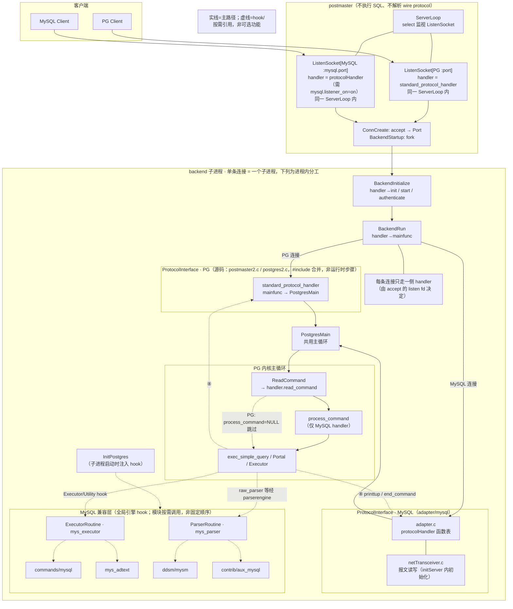
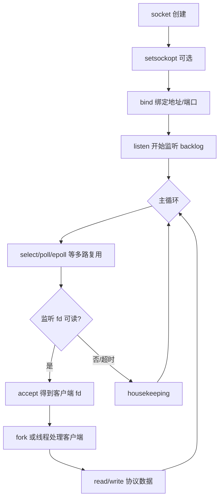
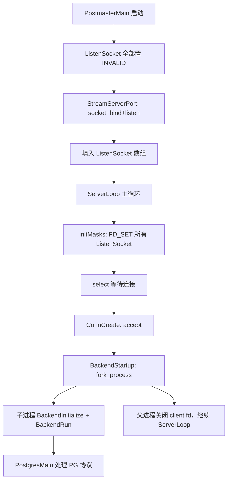
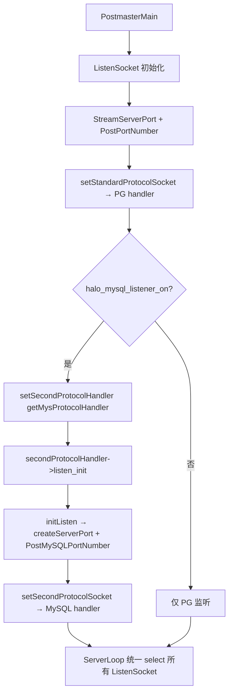
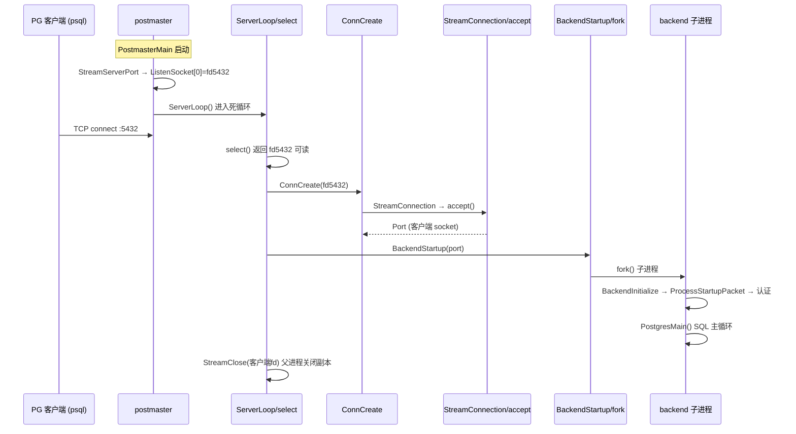
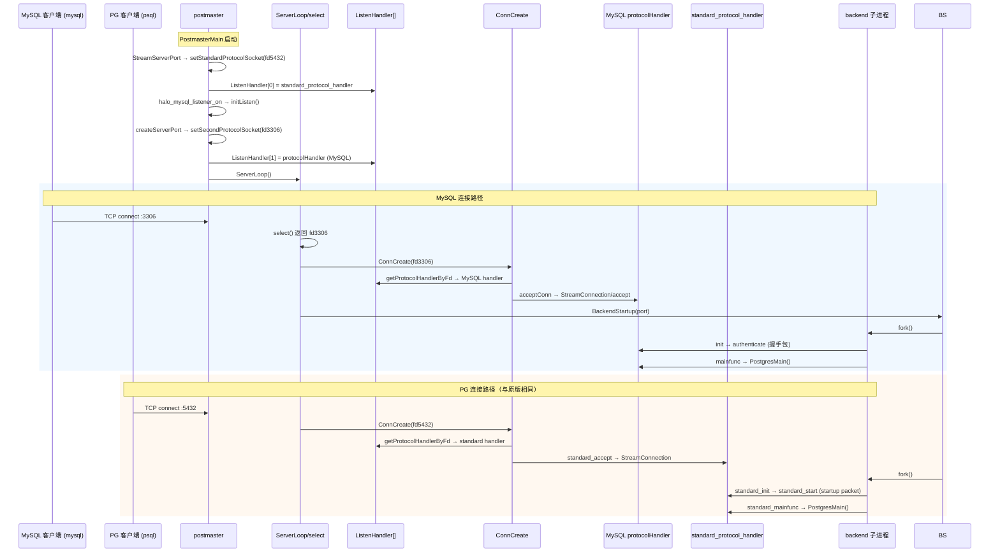
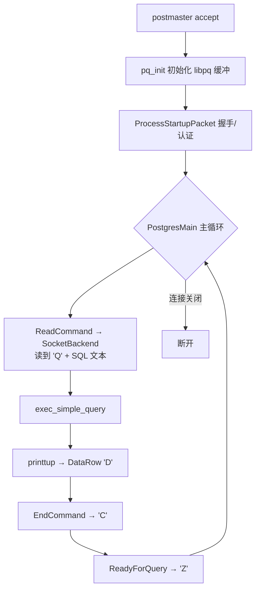

# OpenHalo 如何在 PG 内核上兼容 MySQL

> 工作区：`/home/zxz/work/halo-study`  
> 对照基线：PostgreSQL 14.18（`postgresql-14.18`）  
> OpenHalo 源码：`openHalo`  
> 阅读对象：刚入行的数据库开发人员，有 C/C++ 背景。文中 PG/MySQL 专有名词见**附录 A**。  
> 文档目的：围绕「OpenHalo 做了什么修改，为什么能让 MySQL 客户端连接并使用 PG 内核」这个目标，按**信息流入顺序**建立可继续深入源码的理解框架。

## 1. 总述：OpenHalo 如何在 PG 内核上兼容 MySQL
OpenHalo 在 PostgreSQL 14.18 内核上插入多层 MySQL 兼容能力，使 MySQL 客户端、驱动和部分 MySQL SQL 方言能接到 PG 的优化器、执行器、存储与事务体系上运行。完整链路按信息流入顺序可概括为：

```text
MySQL 客户端
  → 监听 / accept（双协议 postmaster）
  → 握手认证（MySQL wire protocol）
  → 读命令（COM_QUERY 等）
  → SQL 解析（MySQL parser → PG Query 树）
  → PG 执行（Executor + 语义补丁）
  → 结果编码返回（Resultset / OK / ERR 包）
```

**为什么能做到**：PG 内核可拆成「网络协议 → SQL → 语法树 → 优化/执行 → 存储/事务 → 结果返回」。OpenHalo 主要在前半段（协议、解析）和语义差异处做兼容，后半段复用 PG 成熟能力。入口层通过 **`ProtocolInterface`** 在 `T_MySQLProtocol` 连接上切换协议回调；解析、执行、类型输出三层引擎（`ParserRoutine` / `ExecutorRoutine` / `ADTExtMethod`）的切换时机与判据见 **§6.0 / §7.0 / §8.0**。

正文按**信息流入八步**展开，每步均对照「PG 14.18 原版怎么做 / OpenHalo 多加了什么」：

| 步骤 | 内容 | 主要章节 |
|------|------|----------|
| ① 监听 | postmaster、`ListenSocket[]`、`ServerLoop/select` | §4.1 |
| ② accept + fork | `ConnCreate` → `BackendStartup` → 子进程 | §4.1.3 |
| ③ 握手/认证 | startup packet vs MySQL handshake | §4.5 |
| ④ 读命令 | `read_command` / `COM_QUERY` | §5.1 |
| ⑤ 命令预处理 | `process_command` / `rectifyCommand` | §5.2 |
| ⑥ 解析 | `InitParserEngine` / `mys_parser` | §6 |
| ⑦ 执行 | Executor + utility 补丁 | §7 |
| ⑧ 结果返回 | `printtup` / `end_command` / OK·ERR | §8.1 |

### 1.1 做了什么、怎么做到

OpenHalo 在 PG 内核上增加了多层 MySQL 兼容：

```text
协议层：让 MySQL 客户端能连进来
解析层：让 MySQL SQL 能被解析成 PG 内核认识的查询结构
执行层：补 MySQL 特殊执行语义
类型/函数层：补 PG 没有的 MySQL 类型、cast、函数、系统变量
结果层：把 PG 执行结果编码回 MySQL 客户端能看懂的包
```

核心做法不是只做字符串替换，而是在 PG 内核里插入可切换的兼容层。**本文 §1 只强调协议入口**——`ProtocolInterface` 回调表让同一 `PostgresMain` 主循环同时服务 PG 与 MySQL 线协议；其余三层引擎分工如下：

| 引擎 | 作用 | 详见 |
|------|------|------|
| `ProtocolInterface` | 监听/认证/读命令/结果编码 | §4、§5、§8 |
| `ParserRoutine` | MySQL SQL → PG Query 树 | §6 |
| `ExecutorRoutine` | 执行期与 DDL 语义补丁 | §7 |
| `ADTExtMethod` | 类型 I/O 按 MySQL 格式输出 | §8 |

### 1.2 研究目标

我们研究 OpenHalo，不是为了先完整学习 PostgreSQL 或 MySQL，而是为了回答一个更聚焦的问题：

**OpenHalo 到底改了 PG 哪些地方，才能让 MySQL 客户端、MySQL SQL 方言、MySQL 类型/函数习惯，接到 PG 内核上运行？**

你的原始理解是：

> 把 MySQL 的「方言」翻译成 PostgreSQL 能听懂的「普通话」，然后复用 PostgreSQL 成熟的规划、优化和执行能力。

这个理解是对的，但只覆盖了 **SQL 方言层**。完整链路还要再往前、往后各补一层：

1. **往前**：MySQL 客户端先要能连进来。MySQL 客户端说的是 MySQL 网络协议，PG 默认听不懂，所以 OpenHalo 要先做协议入口。
2. **中间**：SQL 文本进来后，MySQL 语法要变成 PG 内核能处理的语法树/查询树。
3. **往后**：执行结果、错误码、列类型、系统变量，还要按 MySQL 客户端期待的格式返回。

### 1.3 结论摘要

1. **双协议并存**：OpenHalo 保留 PG 原生 libpq 协议（标准端口），通过 `ProtocolInterface` + `ListenHandler[]` 在同一 `ServerLoop/select` 上额外挂载 **MySQL 线协议**（`mysql.listener_on` + `mysql.port`），MySQL 客户端可直接连接（详见 §4.1）。
2. **入口在 adapter，不是改 libpq 本身**：`netTransceiver.c` 负责 MySQL 报文的读写分包；`adapter.c` 实现握手、认证、命令分发、结果集/错误包回写；最终仍调用 `PostgresMain()` 进入 PG 执行主循环。
3. **语法兼容靠可插拔 Parser Engine**：MySQL 连接在 `InitParserEngine()` 时切换为 `mys_parser_engine`（flex/bison 独立文法 + transform），产出 PG 的 `Query` 树后走标准优化器/执行器；解析失败时可回退标准 PG parser（`standard_parserengine_auxiliary`）。
4. **PG 没有的能力分三层补齐**：内核补丁（`commands/mysql`、`executor/mys_*`、`utils/adt` 等分支）、内置函数模块 `ddsm/mysm`、扩展 `contrib/aux_mysql`（类型域、cast、转换函数、伪系统库 schema）。
5. **执行层也有 MySQL 分支**：`InitExecutorEngine()` 在 MySQL 协议连接下启用 `GetMysExecutorEngine()` 并设置 `ProcessUtility_hook = mys_standard_ProcessUtility`，用于 DDL/utility 的 MySQL 语义。

### 1.3.1 最小可用配置

启用 MySQL 兼容至少需要以下 **postmaster 级** GUC（写入 `postgresql.conf` 后重启）：

```ini
database_compat_mode = mysql      # 实例级兼容模式；parser/executor 引擎选择依赖此开关
mysql.listener_on = on            # 在 mysql.port 上注册第二协议监听
mysql.port = 3306                 # MySQL wire protocol 端口（默认 3306）
```

| 要点 | 说明 |
|------|------|
| **双协议并存** | PG 标准端口（`port`，默认 5432）仍走 `standard_protocol_handler`，psql/JDBC 等 PG 客户端不受影响 |
| **缺一不可** | 仅设 `mysql.listener_on=on` 而 **未** 设 `database_compat_mode=mysql` 时，`PostmasterMain` 调用 `getSecondProtocolHandler()` 会因 `POSTGRESQL_COMPAT_MODE` 分支 **FATAL**（`"second listener only works for MySQL mode"`） |
| **调用链** | `halo_mysql_listener_on` → `setSecondProtocolHandler(getSecondProtocolHandler())` → `getMysProtocolHandler()`（仅 `MYSQL_COMPAT_MODE`）→ `initListen()` |

```194:208:openHalo/src/backend/postmaster/postmaster2.c
getSecondProtocolHandler(void)
{
    // ...
    switch (database_compat_mode)
    {
        case POSTGRESQL_COMPAT_MODE:
            ereport(FATAL,
                (errmsg("second listener only works for MySQL mode")));
        case MYSQL_COMPAT_MODE:
            handler = getMysProtocolHandler();
```

完整 GUC 列表见 §10。

**`contrib/aux_mysql` 扩展（类型域与伪系统 schema）**：协议监听与 `database_compat_mode=mysql` 启用后，MySQL 客户端即可连上并完成握手；但 **`aux_mysql` 不会由 `initdb` 自动 `CREATE EXTENSION`**，需安装后在目标库手动执行 `CREATE EXTENSION aux_mysql;`（或部署脚本等价步骤）。认证成功后 `authenticate()` 会把 `search_path` 设为 `<db>, mysql, pg_catalog, …`，依赖扩展脚本创建的 `mysql` schema 及其 domain 类型（`tinyint`、`datetime` 等）；未安装时 MySQL 类型解析、`SHOW`/元数据查询及 `getCaseInsensitiveId()`（`case_insensitive` collation，见 `adapter.c`）可能报错（如 *Maybe aux_mysql extension had not been installed*）。样本配置 `contrib/aux_mysql/mysql.conf` 亦将 `search_path` 指向 `mysql`。详见 §8.3、§12。

### 1.4 建议的源码阅读路线

不要一开始就从 PG 主循环或 parser 全量源码读起，容易迷路。建议按下面路线（与本文章节顺序一致）；文中术语见**附录 A**。

1. 先读 §4.1.0（监听）、§4.1.1（对比表）、§4.1.2（双协议序列图）和 §4.1.3（accept+fork），理解 postmaster 双协议 `ListenSocket[]` + `ListenHandler[]`；网络基础薄弱时先读 §4.1.0.1；需对照 PG 原版深读时再看 §4.1.4。
2. 再读 §4.5.0（握手/认证）和 `adapter.c` 的 `authenticate()`，理解 MySQL 登录与 PG startup packet 的差异。
3. 读 §5.0–§5.3（读命令、命令预处理、预编译 `COM_STMT_*`）和 §5.4–§5.5（MySQL 完整调用链与 PG Simple Query 对照），理解 MySQL `COM_QUERY` / `COM_STMT_*` 与 PG `'Q'` 如何汇入 `exec_simple_query`。
4. 读 §6.0（Parser Engine）和 `mys_parser.c`，理解 MySQL SQL 如何产出 PG Query 树。
5. 读 §7.0（Executor）和 `commands/mysql`，理解执行期语义补丁。
6. 读 §8.0（结果返回），理解 `printTup` / `endCommand` / OK·ERR 包如何回写。

如果只记住一句话：**先看协议入口，再看读命令，再看 parser 切换，再看执行和函数补齐。**

---
## 2. OpenHalo 要解决的问题
OpenHalo 的目标不是把 PostgreSQL 变成真正的 MySQL，而是在 PG 内核上做一层 MySQL 兼容，使原来使用 MySQL 客户端、驱动和部分 MySQL SQL 方言的应用能更低成本地迁移或接入。典型缺口有五类：**连接层**（MySQL wire protocol）、**SQL 方言**（`SHOW`/`USE`/`REPLACE` 等）、**类型与函数**（`tinyint`/`datetime`/`uuid_short()` 等）、**结果格式**（Resultset/OK/ERR 包）、**生态接口**（`information_schema`、`@@version` 等）。

客户端能连上只说明协议入口通了；一条 SQL 能跑还需要解析、执行、类型、函数、系统表都兼容。兼容不等于 100% 等价 MySQL。协议与配置细节见第 4、9 节；专有名词见**附录 A**。

---
## 3. 总体架构

OpenHalo 在**一个** PostgreSQL 实例里同时监听 PG 端口与 MySQL 端口；父进程 postmaster 只负责 `accept` 和 `fork`，**每条 TCP 连接对应一个 backend 子进程**。子进程统一进入 `PostgresMain` 主循环；连的是哪类客户端，就通过不同的 `ProtocolInterface` 回调表做握手、读包和回包，MySQL SQL 则在循环内部经 parser/executor hook 翻译成 PG 能执行的形式。



**核心思路**：MySQL 客户端看到的是 MySQL 协议与语义；内核深处仍是 PG 的 catalog、存储、事务、执行框架，中间用 adapter + parser + executor + 类型/函数补丁层做“翻译”和“补齐”。注意：兼容层通过 **引擎 hook** 挂在 PG 执行链上，而不是在 postmaster 或 adapter 里替代 `PostgresMain`。

> **读图提示**：整个实例通常只有**一个** postmaster 进程。Postmaster 框内是 **listen socket fd**（`ListenSocket[]` + `ListenHandler[]`），不是独立进程；`select/accept/fork` 之后，**每条连接在子进程**里才做握手与报文读写。PG 与 MySQL **都通过 `ProtocolInterface` 回调**进入同一个 `PostgresMain`；MySQL 的 `mainFunc` 只是薄包装。`netTransceiver` 是 `adapter.c` 内部的报文层；Parser/Executor 兼容在 `InitPostgres` 时注入，于 `exec_simple_query` 路径生效，而非 `read_command` 直接调用。
>
> `postmaster2` / `postgres2` 是**源码文件名**（通过 `#include` 并进 `postmaster.c` / `postgres.c`），不是图上的运行时方框。`BR` 分出的 PG / MySQL 两条线是**二选一**，不是同连接走两遍。虚线表示 hook 或按需引用的模块，**不表示**可以跳过 SQL 执行，也**不表示** CompatLayer 内模块的固定先后顺序。结果集从 `Executor` 经 `protocol_handler->printtup` 回到 adapter，图中 **`⑧` 回包**详见 §8.1。

### 3.1 八步链路在架构图中的位置

先记 ①→⑧ 故事线，符号名用于搜源码。

| 步骤 | PG 14.18 关键符号 | OpenHalo 新增/改动符号 | 所在层 |
|------|-------------------|------------------------|--------|
| ① 监听 | `StreamServerPort`、`ListenSocket[]`、`ServerLoop` | 第二监听 + ListenHandler 配对（实现于 postmaster2.c）、`initListen`、`setSecondProtocolSocket` | postmaster |
| ② accept+fork | `ConnCreate`、`BackendStartup`、`fork_process` | `getProtocolHandlerByFd`、`acceptConn` | postmaster |
| ③ 握手/认证 | `pq_init`、`ProcessStartupPacket`、`PerformAuthentication` | `initServer`、`authenticate`、`userLogonAuth.c` | adapter |
| ④ 读命令 | `ReadCommand` → `SocketBackend` | `readCommand` → `netTransceiver->readPayload` | adapter / tcop |
| ⑤ 命令预处理 | （无，PG 直接处理 `Q`/`P` 等消息） | `processCommand`、`rectifyCommand`（`PostgresMain` 内、`ReadCommand` 之后） | adapter / tcop |
| ⑥ 解析 | `raw_parser` → `standard_parser` | `InitParserEngine` → `mys_raw_parser` | parser |
| ⑦ 执行 | `standard_ProcessUtility`、标准 executor | `InitExecutorEngine`、`mys_standard_ProcessUtility` | executor / commands |
| ⑧ 结果返回 | `printtup`（DataRow `'D'`）、`EndCommand`（`'C'`） | `printTup`、`endCommand`、`sendOKPacket`/`sendErrPacket` | adapter / access |

---
## 4. 协议层：监听、连接与握手
### 4.1 连接监听与 accept

这一节回答：**客户端 TCP 连进来时，postmaster 在干什么？OpenHalo 如何在不关掉 PG 端口的前提下，再开一个 MySQL 端口？**

> 本节涉及 postmaster、`select`、`fork`、`Port`、`ProtocolInterface` 等概念，见**附录 A**。

#### 4.1.0 步骤①：监听

**这一步在干什么**：postmaster 启动时在指定地址/端口上 `socket → bind → listen`，把监听 fd 放进 `ListenSocket[]`，然后在 `ServerLoop` 里用 `select` 阻塞等待任一监听 fd 可读——有新 TCP 连接到来时才会往下走 accept。

**PG 14.18 原版**：`PostmasterMain()` 遍历 `listen_addresses`，对每个地址调用 `StreamServerPort()` 创建监听套接字，填入 `ListenSocket[]`；之后进入 `ServerLoop()` 死循环，`select` 监视所有监听 fd。

```583:584:postgresql-14.18/src/backend/libpq/pqcomm.c
		ListenSocket[listen_index] = fd;
		added++;
```

**OpenHalo 改动**：保留 PG 监听逻辑不变，但 `StreamServerPort` 末尾改为 `setStandardProtocolSocket(fd)`，把 PG fd 与 `standard_protocol_handler` 配对登记到 `ListenHandler[]`；若 `mysql.listener_on=on`，额外调用 `initListen()` 在 `mysql.port`（默认 3306）上再建一套监听，通过 `setSecondProtocolSocket(fd)` 登记 MySQL handler。**不改 `ServerLoop/select` 结构**，只是 `ListenSocket[]` 里多了 MySQL 端口的 fd。

> 完整逐项对比见 §4.1.1（PG 14.18 vs OpenHalo 对比表）。

> 不熟悉 socket/bind/listen/accept/select 的读者，可先读 §4.1.0.1（网络监听详解）。

---

#### 4.1.0.1 网络监听详解（背景阅读）

> 面向不熟悉网络的 C 开发者。若已熟悉 socket、bind、listen、accept、select，可跳过本节，直接读 §4.1.1（对比表）与 §4.1.2（序列图）。

##### 核心术语

| 术语 | 含义 |
|------|------|
| **socket（套接字）** | 内核里代表「一个网络通信端点」的对象；配置好地址后可等待客户端连接。 |
| **fd（file descriptor，文件描述符）** | 内核给的「资源门票号」，整数编号。打开文件、创建 socket、管道等都用 fd；在 Unix 上**不专指磁盘文件**，角色类似 Windows 的 `HANDLE`。PG/OpenHalo 中 `pgsocket` 在 Linux 上就是 `int`；`Port.sock` 注释亦写明 `File descriptor`。 |
| **bind** | 把 socket 绑到具体地址（IP + 端口，或 Unix 域路径）。 |
| **listen** | 设为被动监听，开始排队等待连接。 |
| **backlog** | `listen()` 第二参数：尚未 `accept` 的连接在内核中的排队长度；队列满时新连接可能被拒绝。 |
| **accept** | 从监听 socket 取出一个已完成的连接，返回**新的 fd**（专用于与该客户端通信）；监听 fd 继续保留。 |
| **select** | 一次等待多个 fd 的「可读/可写/异常」；适合单线程同时监视多个 socket。 |
| **fd_set** | `select()` 用的位图：登记要监视哪些 fd。 |
| **read / write** | 在已连接 fd 上收发字节（亦可用 `recv`/`send`）。 |

##### 典型服务端流程



**常规变量（伪代码）：**

```c
int listen_fd;          /* 监听 socket 的 fd */
int client_fd;          /* accept 返回的、与某一客户端通信的 fd */
struct sockaddr_in addr;
fd_set readmask, rmask;
int max_fd;             /* select 第一个参数：最大 fd + 1 */
int backlog = 128;
```

**典型步骤：**

1. `listen_fd = socket(AF_INET, SOCK_STREAM, 0)`
2. `bind(listen_fd, ...)` — 绑定 `0.0.0.0:5432` 等
3. `listen(listen_fd, backlog)`
4. 循环：`FD_SET(listen_fd, &readmask)` → `select(max_fd+1, &readmask, ...)`
5. 若 `FD_ISSET(listen_fd, ...)`：`client_fd = accept(listen_fd, ...)`
6. 父进程继续监听；子进程在 `client_fd` 上 `read`/`write` 跑应用协议

##### PostgreSQL 14.18：postmaster 怎么做

PG 的 **postmaster** 是守护进程：自己**不执行 SQL**，只负责监听、接受连接、`fork` 出 **backend** 子进程处理客户端。



| 通用步骤 | PG 中的实现 |
|----------|-------------|
| socket + bind + listen | `StreamServerPort()`（`pqcomm.c`） |
| 保存监听 fd | 全局数组 `ListenSocket[MAXLISTEN]` |
| select 多路复用 | `ServerLoop()` → `initMasks()` + `select()` |
| accept | `ConnCreate()` → `StreamConnection()` → `accept()` |
| 每连接一进程 | `BackendStartup()` → `fork_process()` |
| 读写协议 | 子进程 `PostgresMain()`（libpq 线协议） |

**启动阶段**：`PostmasterMain` 遍历 `listen_addresses`，对每个地址调用 `StreamServerPort`，用 `PostPortNumber` 创建监听套接字：

```1169:1178:postgresql-14.18/src/backend/postmaster/postmaster.c
			if (strcmp(curhost, "*") == 0)
				status = StreamServerPort(AF_UNSPEC, NULL,
										  (unsigned short) PostPortNumber,
										  NULL,
										  ListenSocket, MAXLISTEN);
			else
				status = StreamServerPort(AF_UNSPEC, curhost,
										  (unsigned short) PostPortNumber,
										  NULL,
										  ListenSocket, MAXLISTEN);
```

`StreamServerPort` 内部对每个解析出的地址执行标准三部曲：`socket` → `bind` → `listen`（backlog = `MaxBackends * 2`，上限 `PG_SOMAXCONN`），成功后写入 `ListenSocket`：

```458:466:postgresql-14.18/src/backend/libpq/pqcomm.c
			if ((fd = socket(addr->ai_family, SOCK_STREAM, 0)) == PGINVALID_SOCKET)
			{
				ereport(LOG,
						(errcode_for_socket_access(),
				/* translator: first %s is IPv4, IPv6, or Unix */
						 errmsg("could not create %s socket for address \"%s\": %m",
								familyDesc, addrDesc)));
				continue;
			}
```

```522:523:postgresql-14.18/src/backend/libpq/pqcomm.c
			err = bind(fd, addr->ai_addr, addr->ai_addrlen);
			if (err < 0)
```

```559:563:postgresql-14.18/src/backend/libpq/pqcomm.c
			maxconn = MaxBackends * 2;
			if (maxconn > PG_SOMAXCONN)
				maxconn = PG_SOMAXCONN;

			err = listen(fd, maxconn);
```

```583:584:postgresql-14.18/src/backend/libpq/pqcomm.c
		ListenSocket[listen_index] = fd;
		added++;
```

数据库子进程启动后进入永不返回（正常情况下）的 `ServerLoop()`：

```1414:1422:postgresql-14.18/src/backend/postmaster/postmaster.c
	StartupPID = StartupDataBase();
	Assert(StartupPID != 0);
	StartupStatus = STARTUP_RUNNING;
	pmState = PM_STARTUP;

	/* Some workers may be scheduled to start now */
	maybe_start_bgworkers();

	status = ServerLoop();
```

**ServerLoop**：`initMasks` 把所有 `ListenSocket[i]` 放入 `fd_set`，`select` 阻塞等待；某监听 fd 可读时遍历并 `ConnCreate` → `BackendStartup`：

```1907:1927:postgresql-14.18/src/backend/postmaster/postmaster.c
static int
initMasks(fd_set *rmask)
{
	int			maxsock = -1;
	int			i;

	FD_ZERO(rmask);

	for (i = 0; i < MAXLISTEN; i++)
	{
		int			fd = ListenSocket[i];

		if (fd == PGINVALID_SOCKET)
			break;
		FD_SET(fd, rmask);

		if (fd > maxsock)
			maxsock = fd;
	}

	return maxsock + 1;
}
```

```1714:1757:postgresql-14.18/src/backend/postmaster/postmaster.c
				selres = select(nSockets, &rmask, NULL, NULL, &timeout);
	// ...
		if (selres > 0)
		{
			int			i;

			for (i = 0; i < MAXLISTEN; i++)
			{
				if (ListenSocket[i] == PGINVALID_SOCKET)
					break;
				if (FD_ISSET(ListenSocket[i], &rmask))
				{
					Port	   *port;

					port = ConnCreate(ListenSocket[i]);
					if (port)
					{
						BackendStartup(port);
						StreamClose(port->sock);
						ConnFree(port);
					}
				}
			}
		}
```

**accept 在 postmaster 完成，再 fork**：父进程立刻关闭子进程用的 client socket 副本，继续监听。`StreamConnection` 底层即 `accept`：

```711:718:postgresql-14.18/src/backend/libpq/pqcomm.c
int
StreamConnection(pgsocket server_fd, Port *port)
{
	/* accept connection and fill in the client (remote) address */
	port->raddr.salen = sizeof(port->raddr.addr);
	if ((port->sock = accept(server_fd,
							 (struct sockaddr *) &port->raddr.addr,
							 &port->raddr.salen)) == PGINVALID_SOCKET)
```

子进程 `fork` 后关闭 postmaster 的监听 socket，初始化并进入 `PostgresMain`：

```4248:4263:postgresql-14.18/src/backend/postmaster/postmaster.c
		pid = fork_process();
		if (pid == 0)				/* child */
		{
			free(bn);

			/* Detangle from postmaster */
			InitPostmasterChild();

			/* Close the postmaster's sockets */
			ClosePostmasterPorts(false);

			/* Perform additional initialization and collect startup packet */
			BackendInitialize(port);

			/* And run the backend */
			BackendRun(port);
		}
```

accept 之后 fork 与子进程入口的逐步对照见 **§4.1.3**。

##### OpenHalo：双协议扩展

OpenHalo **保留** postmaster 的 `ServerLoop` / `select` / `fork` 骨架，扩展点有三：

1. **两套监听端口**：PG 仍用 `port`（`PostPortNumber`）；MySQL 用 `mysql.port`（`PostMySQLPortNumber`，默认 3306）。
2. **`ListenHandler[]`**：每个 `ListenSocket[i]` 对应一个 **`ProtocolInterface`**（函数表）。
3. **`ConnCreate` / `BackendRun`** 按协议分发，不再写死 PG 的 `StreamConnection` / `PostgresMain`。

**GUC（均为 `PGC_POSTMASTER`，改后需重启）：**

| 参数 | 变量 | 作用 |
|------|------|------|
| `mysql.listener_on` | `halo_mysql_listener_on` | 是否启用 MySQL 第二套监听（默认 `false`） |
| `mysql.port` | `PostMySQLPortNumber` | MySQL 监听端口（默认 **3306**） |

```2170:2175:openHalo/src/backend/utils/misc/guc.c
		{"mysql.listener_on", PGC_POSTMASTER, CUSTOM_OPTIONS,
			gettext_noop("Enable second listener."),
		},
		&halo_mysql_listener_on,
		false,
```

```2451:2457:openHalo/src/backend/utils/misc/guc.c
        {"mysql.port", PGC_POSTMASTER, CONN_AUTH_SETTINGS,
            gettext_noop("Sets the MySQL TCP port the server listens on."),
            NULL
        },
        &PostMySQLPortNumber,
        3306, 1, 65535,
```

**`ProtocolInterface`**（`protocol_interface.h`）把一整条 wire protocol 抽象为回调：`listen_init` 建监听、`accept` 接受连接、`mainfunc` 子进程主循环、`read_command` / `printtup` 等执行期收发。

**`ListenHandler[]`**（`postmaster2.c`）与 `ListenSocket[]` 一一对应：

```51:52:openHalo/src/backend/postmaster/postmaster2.c
static const ProtocolInterface    *ListenHandler[MAXLISTEN];
static const ProtocolInterface    standard_protocol_handler = {
```

- PG 监听：`StreamServerPort` 末尾 `setStandardProtocolSocket(fd)` → `ListenHandler[i] = standard_protocol_handler`
- MySQL 监听：`createServerPort` 末尾 `setSecondProtocolSocket(fd)` → `ListenHandler[i] = secondProtocolHandler`

按 server 监听 fd 查协议：

```152:165:openHalo/src/backend/postmaster/postmaster2.c
const ProtocolInterface *
getProtocolHandlerByFd(int serverFd)
{
    int listen_index = 0;

    for (; listen_index < MAXLISTEN; listen_index ++)
    {
        if (ListenSocket[listen_index] == serverFd)
            break;
    }

    Assert(listen_index < MAXLISTEN);

    return ListenHandler[listen_index];
}
```

**双协议启动顺序：**



MySQL 第二监听（仅 `mysql.listener_on = on` 时）：

```1312:1319:openHalo/src/backend/postmaster/postmaster.c
	if (halo_mysql_listener_on)
	{
        setSecondProtocolHandler(getSecondProtocolHandler());

        Assert(secondProtocolHandler != NULL);
        Assert(secondProtocolHandler->listen_init != NULL);

        secondProtocolHandler->listen_init();
	}
```

`initListen()` 用 `PostMySQLPortNumber` 调 `createServerPort`，逻辑同 `StreamServerPort`，但登记到第二协议槽位：

```543:549:openHalo/src/backend/adapter/mysql/adapter.c
			if (strcmp(curhost, "*") == 0)
            {
                status = createServerPort(AF_UNSPEC, 
                                          NULL,
                                          (unsigned short) PostMySQLPortNumber,
                                          NULL,
                                          &protocolHandler);
```

```3917:3919:openHalo/src/backend/adapter/mysql/adapter.c
					(errmsg("listening on %s address \"%s\", port %d",
							familyDesc, addrDesc, (int) portNumber)));

		setSecondProtocolSocket(fd);
```

MySQL `protocolHandler` 函数表与 `acceptConn`（底层仍调 `StreamConnection`）：

```464:472:openHalo/src/backend/adapter/mysql/adapter.c
static ProtocolInterface protocolHandler = {
    .type = T_MySQLProtocol,
    .listen_init = initListen,
    .accept = acceptConn,
    .close = closeListen,
	.init = initServer,
    .start = startServer,
	.authenticate = authenticate,
	.mainfunc = mainFunc,
```

```639:642:openHalo/src/backend/adapter/mysql/adapter.c
static int
acceptConn(pgsocket serverFd, Port *port)
{
    return StreamConnection(serverFd, port);
}
```

`ServerLoop` / `initMasks` / `select` 与 PG **结构一致**——一个 postmaster、一组 `ListenSocket`，同时监视 PG 5432 与 MySQL 3306（若都启用）。差异在 `ConnCreate`：先 `getProtocolHandlerByFd`，再调 `protocol_handler->accept`：

```2575:2600:openHalo/src/backend/postmaster/postmaster.c
static Port *
ConnCreate(int serverFd)
{
	Port	   *port;
	// ... calloc ...
	
	port->protocol_handler = getProtocolHandlerByFd(serverFd);
	Assert(port->protocol_handler != NULL);

	if (port->protocol_handler->accept(serverFd, port) != STATUS_OK)
	{
		if (port->sock != PGINVALID_SOCKET)
			port->protocol_handler->close(port->sock);
		ConnFree(port);
		return NULL;
	}
	

	return port;
}
```

`BackendRun` 按协议进不同主函数：

```4576:4580:openHalo/src/backend/postmaster/postmaster.c
	if (port->protocol_handler->mainfunc)
		port->protocol_handler->mainfunc(port, ac, av);
	else
		PostgresMain(ac, av, port->database_name, port->user_name);
```

```text
                    ┌─────────────────────────────────────┐
                    │           postmaster                 │
                    │  ListenSocket[0] ── PG:5432          │
                    │  ListenSocket[1] ── MySQL:3306       │
                    │  ListenHandler[0] = standard_*       │
                    │  ListenHandler[1] = mysql protocolHandler│
                    └──────────────┬──────────────────────┘
                                   │ select() 任一可读
                                   ▼
                    ConnCreate(serverFd)
                      → getProtocolHandlerByFd
                      → handler->accept()
                                   │
                                   ▼
                    BackendStartup → fork
                      ├─ PG 子进程: PostgresMain
                      └─ MySQL 子进程: mainFunc → PostgresMain（adapter 为 ProtocolInterface 实现）
```

> 完整逐项对比见 **§4.1.1**；双协议 accept/fork 时序见 **§4.1.2**；`ConnCreate` / `BackendRun` 回调化细节见 **§4.1.3**。

##### 记忆要点

1. **监听 fd** 与 **连接 fd** 是两张「票」：前者在 postmaster 中长期存在；`accept` 得到后者，交给子进程。
2. **`select` + `ListenSocket[]`** 让一个 postmaster 同时盯多个地址/端口（IPv4、IPv6、Unix，以及 OpenHalo 的 MySQL 端口）。
3. **OpenHalo 没有第二个 postmaster**，而是同一 `ServerLoop`、两套 `ListenHandler`，在 `ConnCreate`/`BackendRun` 分叉协议。
4. **`mysql.port` 只影响 MySQL 监听**；PG 客户端仍连 `port`（默认 5432）。MySQL 客户端要能连，还需 **`mysql.listener_on = on`** 且 `database_compat_mode = mysql`（见 §1.3.1）。
5. 子进程里 MySQL wire protocol（握手在 BackendInitialize，OK/ERR/结果集在 PostgresMain 的 readCommand/printTup/endCommand）由 adapter 的 ProtocolInterface 回调实现；`mainFunc` 仍进入 `PostgresMain`——细节见 **§4.5**。

---

#### 4.1.1 PG 14.18 vs OpenHalo 对比表

| 环节 | PG 14.18 | OpenHalo |
|------|----------|----------|
| 监听 fd 数组 | `ListenSocket[MAXLISTEN]` | 相同 |
| 协议分发数组 | 无 | `ListenHandler[MAXLISTEN]`（`postmaster2.c` 新增） |
| 创建 PG 监听 | `StreamServerPort` → 直接写 `ListenSocket[i]` | `StreamServerPort` → `setStandardProtocolSocket(fd)` |
| 创建 MySQL 监听 | 不支持 | `initListen` → `createServerPort` → `setSecondProtocolSocket(fd)` |
| MySQL 端口 GUC | 无 | `mysql.listener_on` + `mysql.port`（`PostMySQLPortNumber`） |
| `ConnCreate` | 固定 `StreamConnection` | `getProtocolHandlerByFd` → `protocol_handler->accept` |
| `Port` 结构 | 无协议字段 | 新增 `protocol_handler` 指针 |
| 关闭监听 socket | `StreamClose` | `getProtocolHandlerByIndex(i)->close`（shutdown 路径） |
| 子进程初始化 | `pq_init` + `ProcessStartupPacket` | `protocol_handler->init/start/authenticate/mainfunc` |
| 主循环 | `ServerLoop` + `select` | **未改结构**，同时监视 PG 与 MySQL fd |

#### 4.1.2 序列图

**PG 14.18：单协议 accept → fork**



**OpenHalo：双协议共享 ServerLoop**



#### 4.1.3 步骤②：accept 与 fork

**这一步在干什么**：`select` 发现某监听 fd 可读后，postmaster 对该 fd 执行 `accept()` 拿到客户端 socket，创建 `Port` 结构，然后 `fork()` 出一个 backend 子进程去服务这条连接；父进程关闭已 accept 的客户端 fd 副本，继续回到 `ServerLoop` 等待下一条连接。

**PG 14.18 原版**

```text
ServerLoop → ConnCreate(serverFd)
  → StreamConnection(serverFd, port)   // accept()
  → BackendStartup(port)
       → fork_process()
            子进程: BackendInitialize(port) → BackendRun(port) → PostgresMain()
            父进程: 继续 ServerLoop
```

`ConnCreate` 固定调用 `StreamConnection`（即 `accept`）：

```2543:2564:postgresql-14.18/src/backend/postmaster/postmaster.c
static Port *
ConnCreate(int serverFd)
{
	Port	   *port;
	// ...
	if (StreamConnection(serverFd, port) != STATUS_OK)
	{
		// ...
		return NULL;
	}
	return port;
}
```

`BackendStartup` 在子进程里依次调用 `BackendInitialize` 和 `BackendRun`；`BackendRun` 直接进 `PostgresMain`：

```4526:4542:postgresql-14.18/src/backend/postmaster/postmaster.c
static void
BackendRun(Port *port)
{
	char	   *av[2];
	const int	ac = 1;
	av[0] = "postgres";
	av[1] = NULL;
	MemoryContextSwitchTo(TopMemoryContext);
	PostgresMain(ac, av, port->database_name, port->user_name);
}
```

**OpenHalo 改动**

1. **`ConnCreate` 协议分发**：先 `getProtocolHandlerByFd(serverFd)` 查出该监听 fd 对应 PG 还是 MySQL handler，再调 `protocol_handler->accept`（PG 走 `standard_accept`→`StreamConnection`，MySQL 走 `acceptConn`→`StreamConnection`，TCP 层相同）。

```2587:2600:openHalo/src/backend/postmaster/postmaster.c
	port->protocol_handler = getProtocolHandlerByFd(serverFd);
	Assert(port->protocol_handler != NULL);
	if (port->protocol_handler->accept(serverFd, port) != STATUS_OK)
	{
		// ...
	}
	return port;
```

2. **`Port` 新增 `protocol_handler` 指针**（`libpq-be.h`），子进程全程通过它选择协议行为。

3. **`BackendInitialize` 回调化**：不再硬编码 `pq_init()` + `ProcessStartupPacket()`，改为：
   - `protocol_handler->init()` — PG 调 `pq_init()`，MySQL 调 `initServer()`（内部 `initNetTransceiver()`）
   - `protocol_handler->start(port)` — PG 读 startup packet，MySQL 的 `startServer()` 直接返回 OK
   - 认证在 `InitPostgres()` 里调 `protocol_handler->authenticate()`

4. **`BackendRun` 回调化**：通过 `protocol_handler->mainfunc` 进入主循环；MySQL 的 `mainFunc` 内部仍调用 `PostgresMain()`：

```4560:4580:openHalo/src/backend/postmaster/postmaster.c
static void
BackendRun(Port *port)
{
	// ...
	if (port->protocol_handler->mainfunc)
		port->protocol_handler->mainfunc(port, ac, av);
	else
		PostgresMain(ac, av, port->database_name, port->user_name);
}
```

**对比小结**

| 环节 | PG 14.18 | OpenHalo |
|------|----------|----------|
| accept | `ConnCreate` → `StreamConnection` | `getProtocolHandlerByFd` → `accept` 回调 |
| 子进程初始化 | `pq_init` + `ProcessStartupPacket` | `protocol_handler->init/start` |
| 认证时机 | `InitPostgres` → `PerformAuthentication` | `InitPostgres` → `protocol_handler->authenticate` |
| 进入主循环 | `BackendRun` → `PostgresMain` 硬编码 | `mainfunc` 回调（MySQL 仍调 `PostgresMain`） |
| fork 本身 | `fork_process()` | **相同**，未改 |

#### 4.1.4 PG 14.18 对照深读（可选）

需要对照 PG 原版或复现 diff 时再读本节；日常理解 §4.1.0–§4.1.3 已足够。

**PG 14.18 监听链路**：`PostmasterMain()` → `StreamServerPort()`（`pqcomm.c`）→ `ListenSocket[i]=fd` → `ServerLoop()` + `select` → `ConnCreate` → `StreamConnection`（`accept`）→ `BackendStartup`（`fork`）。子进程 `BackendInitialize` 走 `pq_init()` + `ProcessStartupPacket()`。

**OpenHalo 双协议**：不改 `ServerLoop/select` 结构；`pqcomm.c` 末尾改为 `setStandardProtocolSocket(fd)`；`halo_mysql_listener_on` 时 `setSecondProtocolHandler(getSecondProtocolHandler())` → `initListen()` → `setSecondProtocolSocket(fd)`。`postmaster2.c` 维护 `ListenHandler[]` 与 `ListenSocket[]` 一一对应；`ConnCreate` 通过 `getProtocolHandlerByFd` 分发 `accept` 回调。

关键代码引用：

```1312:1320:openHalo/src/backend/postmaster/postmaster.c
	if (halo_mysql_listener_on)
	{
        setSecondProtocolHandler(getSecondProtocolHandler());
        Assert(secondProtocolHandler != NULL);
        Assert(secondProtocolHandler->listen_init != NULL);
        secondProtocolHandler->listen_init();
	}
```

```2587:2593:openHalo/src/backend/postmaster/postmaster.c
	port->protocol_handler = getProtocolHandlerByFd(serverFd);
	Assert(port->protocol_handler != NULL);
	if (port->protocol_handler->accept(serverFd, port) != STATUS_OK)
```

**diff 命令**（结构差异复现）：

```bash
diff -u postgresql-14.18/src/backend/postmaster/postmaster.c \
        openHalo/src/backend/postmaster/postmaster.c | head -120

diff -u postgresql-14.18/src/backend/libpq/pqcomm.c \
        openHalo/src/backend/libpq/pqcomm.c | rg "setStandardProtocolSocket" -C 3
```

**建议阅读顺序**：`postgresql-14.18/.../postmaster.c`（`StreamServerPort` → `ServerLoop` → `ConnCreate`）→ `openHalo/.../postmaster2.c`（`ListenHandler[]`）→ `openHalo/.../postmaster.c`（搜 `halo_mysql_listener_on`）→ `adapter.c`（`initListen` / `protocolHandler`）。

---

### 4.2 不是替换 libpq，而是双协议

| 项目 | PG 原生（14.18） | MySQL 兼容（OpenHalo） |
|------|------------------|------------------------|
| 协议定义 | 无独立抽象；逻辑散落在 `postmaster.c` + `pqcomm.c` | 新增 `protocol_interface.h` + `ProtocolInterface` 回调表 |
| 标准实现 | 无 `postmaster2.c`；`ConnCreate` 直接 `StreamConnection` | `postmaster2.c` → `standard_protocol_handler`；`adapter.c` → `protocolHandler`（`T_MySQLProtocol`） |
| 监听 | `listen_addresses` + `port` | `mysql.listener_on` + `mysql.port`（`PostMySQLPortNumber`） |
| 连接结构 | `Port`（`libpq-be.h`） | 同一 `Port`，新增字段 `protocol_handler` |

Postmaster 在 `database_compat_mode = mysql` 且 `halo_mysql_listener_on` 时，通过 `setSecondProtocolHandler(getSecondProtocolHandler())` 注册第二协议处理器（`postmaster.c` / `postmaster2.c`；`getSecondProtocolHandler()` 内部在 `MYSQL_COMPAT_MODE` 下返回 `getMysProtocolHandler()`）。

### 4.3 ProtocolInterface 回调表

先看 `ProtocolInterface`。它本质上是一张「协议回调函数表」：监听、accept、认证、读命令、处理命令、输出结果、输出错误，都通过函数指针抽象出来。

```64:83:openHalo/src/include/postmaster/protocol_interface.h
typedef void    (*fn_listen_init)(void);
typedef int		(*fn_accept)(pgsocket server_fd, struct Port *port);
typedef void	(*fn_close)(pgsocket server_fd);
typedef void	(*fn_init)(void);
typedef int		(*fn_start)(struct Port *port);
typedef void	(*fn_authenticate)(struct Port *port, const char **username);
typedef void	(*fn_mainfunc)(struct Port *port, int argc, char *argv[]) pg_attribute_noreturn();
typedef void	(*fn_send_message)(ErrorData *edata);
typedef void	(*fn_send_cancel_key)(int pid, int32 key);
typedef void	(*fn_comm_reset)(void);
typedef bool	(*fn_is_reading_msg)(void);
typedef void	(*fn_send_ready_for_query)(CommandDest dest);
typedef int		(*fn_read_command)(StringInfo inBuf);
typedef void	(*fn_end_command)(QueryCompletion *qc, CommandDest dest);
typedef bool	(*fn_printtup)(TupleTableSlot *slot, DestReceiver *self, CommandTag  commandTag);
typedef void	(*fn_printtup_startup)(DestReceiver *self, int operation, TupleDesc typeinfo, CommandTag  commandTag);
typedef void	(*fn_printtup_shutdown)(DestReceiver *self);
typedef void	(*fn_printtup_destroy)(DestReceiver *self);
typedef int		(*fn_process_command)(int *first_char, StringInfo inBuf);
typedef void	(*fn_report_param_status)(const char *name, char *val);
```

这说明 OpenHalo 没有只在 parser 里做方言转换，而是先把「协议入口」抽象出来。PG 原生连接有一套回调，MySQL 连接也有一套回调。

`adapter.c` 里注册了 MySQL 版本的回调表：

```464:485:openHalo/src/backend/adapter/mysql/adapter.c
static ProtocolInterface protocolHandler = {
    .type = T_MySQLProtocol,
    .listen_init = initListen,
    .accept = acceptConn,
    .close = closeListen,
	.init = initServer,
    .start = startServer,
	.authenticate = authenticate,
	.mainfunc = mainFunc,
	.send_message = sendErrorMessage,
	.send_cancel_key = mysqlSendCancelKey,
	.comm_reset = NULL,
	.is_reading_msg = NULL,
	.send_ready_for_query = sendReadyForQuery,
	.read_command = readCommand,
	.end_command = endCommand,
	.printtup = printTup,
	.printtup_startup = printTupStartup,
	.printtup_shutdown = printTupShutdown,
	.printtup_destroy = printTupDestroy,
	.process_command = processCommand,
    .report_param_status = reportParamStatus
};
```

这里的 `.type = T_MySQLProtocol` 很关键。后面 parser、executor、adt 很多地方都会判断当前连接是不是 `T_MySQLProtocol`，如果是，就走 MySQL 兼容逻辑。

所以这层解决的是：

```text
MySQL 客户端发来的不是 PG 协议包
  → OpenHalo 用 MySQL protocolHandler 接住
  → 读出 SQL 或命令
  → 再交给 PG 主循环
```

### 4.4 `netTransceiver.c` 的职责

**你的理解基本正确**：它是 MySQL **线协议传输层**，使 MySQL 客户端能连上 OpenHalo。

- `initNetTransceiver()`：绑定 `MyProcPort`，初始化写缓冲、包序号，挂接读/写函数指针。
- 实现 MySQL 报文格式：3 字节长度 + 1 字节 seq + payload（`readPacket` / `writePacketHeader` 等）。
- 被 `adapter.c` 的 `authenticate()`、`readCommand()`、`sendOKPacket()` 等调用。

它**不负责** SQL 解析，只负责字节流层面的 MySQL 协议兼容。

从代码看，`initNetTransceiver()` 做了三件事：

1. 把当前连接 `MyProcPort` 保存到 `netTransceiver->mysPort`。
2. 初始化 MySQL packet 的序号、写缓冲。
3. 把「读 payload / 写 header / 写 payload / flush」等函数挂到 `NetTransceiver` 结构上。

```82:109:openHalo/src/backend/adapter/mysql/netTransceiver.c
void
initNetTransceiver(void)
{
    MemoryContext oldContext;

    oldContext = MemoryContextSwitchTo(TopMemoryContext);

    netTransceiver = palloc0(sizeof(NetTransceiver));
    netTransceiver->mysPort = MyProcPort;
    netTransceiver->mysPort->noblock = false;  /* set to block */
    netTransceiver->netPacketSeqID = 0;
    netTransceiver->writePointer = 0;
    netTransceiver->sendStart = 0;
    netTransceiver->WBuffSize = WBUFF_INITIAL_SIZE;
    netTransceiver->WBuff = palloc0(WBUFF_INITIAL_SIZE);

    netTransceiver->readPayloadForLogon = readPayloadForLogon;
    netTransceiver->readPayload = readPayload;
    netTransceiver->getWriteBufForHeaderPayload = getWriteBufForHeaderPayload;
    netTransceiver->getWriteBufForPayload = getWriteBufForPayload;
    netTransceiver->getBufForPayload = getBufForPayload;
    netTransceiver->finishWriteToBufNoFlush = finishWriteToBufNoFlush;
    netTransceiver->finishWriteToBufFlush = finishWriteToBufFlush;
    netTransceiver->writePacketHeaderNoFlush = writePacketHeaderNoFlush;
    netTransceiver->writePacketPayloadNoFlush = writePacketPayloadNoFlush;
    netTransceiver->writePacketPayloadFlush = writePacketPayloadFlush;
    netTransceiver->writePacketHeaderPayloadNoFlush = writePacketHeaderPayloadNoFlush;
    netTransceiver->writePacketHeaderPayloadFlush = writePacketHeaderPayloadFlush;
```

这段代码说明：`netTransceiver.c` 是「包收发器」，不是「SQL 翻译器」。它解决的是 MySQL 客户端发来的二进制协议包如何被 OpenHalo 正确读写。

### 4.5 `adapter.c` 协议回调（握手与进入主循环）

#### 4.5.0 步骤③：握手与认证

**这一步在干什么**：backend 子进程 fork 出来后、进入 `PostgresMain` 主循环之前，必须和客户端完成「你是谁、连哪个库」的握手，并校验密码。PG 客户端发 **startup packet**（长度前缀 + 协议版本 + key/value 参数）；MySQL 客户端期望 **handshake packet**（服务端先发版本/能力，客户端再回用户名/密码）。

**PG 14.18 原版**

流程：`BackendInitialize` → `pq_init()` 初始化 libpq 收发缓冲 → `ProcessStartupPacket()` 读 startup packet 解析 `user`/`database`/`options` 等 → `InitPostgres()` → `PerformAuthentication()` 按 `pg_hba.conf` 做 SCRAM/MD5 等认证。

```4378:4383:postgresql-14.18/src/backend/postmaster/postmaster.c
	pq_init();					/* initialize libpq to talk to client */
	whereToSendOutput = DestRemote; /* now safe to ereport to client */
```

`ProcessStartupPacket` 读 4 字节长度 + payload，解析 `database`、`user` 等字段：

```2218:2221:postgresql-14.18/src/backend/postmaster/postmaster.c
				if (strcmp(nameptr, "database") == 0)
					port->database_name = pstrdup(valptr);
				else if (strcmp(nameptr, "user") == 0)
					port->user_name = pstrdup(valptr);
```

**OpenHalo 改动**

OpenHalo 把上述流程抽象进 `ProtocolInterface` 回调；MySQL 连接走 `adapter.c` 的实现：

| 阶段 | PG（`standard_protocol_handler`） | MySQL（`protocolHandler`） |
|------|-------------------------------------|----------------------------|
| init | `pq_init()` — 初始化 libpq 缓冲、非阻塞 socket | `initServer()` — `initNetTransceiver()` + 自建 `FeBeWaitSet` |
| start | `ProcessStartupPacket()` — 读 PG startup packet | `startServer()` — 直接 `return STATUS_OK`（MySQL 无 startup packet） |
| authenticate | `standard_authenticate` → PG `PerformAuthentication` | `authenticate()` — MySQL 握手包流程 |

MySQL `authenticate()` 核心步骤：

1. **服务端发 Handshake**：`assembleHandshakePacketPayload` + `writePacketHeaderPayloadFlush`
2. **读客户端 Handshake Response**：`readPayloadForLogon` → `parseHandshakeRespPacketPayload` 提取用户名、密码响应、数据库名
3. **HBA + 密码校验**：仍读 `pg_hba.conf`（`hba_getauthmethod`），密码用 `mysCheckAuth`（`mysql_native_password` 的 SHA1 双重摘要，`pwdEncryptDecrypt.c`）
4. **Session 初始化**：设置 `search_path`（`<db>, mysql, pg_catalog, ...`）、`client_min_messages=error`、`bytea_output=hex` 等

```714:718:openHalo/src/backend/adapter/mysql/adapter.c
    netTransceiver->getBufForPayload(&payloadBuf, payloadBufSize);
    payloadLen = assembleHandshakePacketPayload(halo_mysql_version, 
                                                payloadBuf, 
                                                payloadBufSize);
    netTransceiver->writePacketHeaderPayloadFlush(payloadBuf, payloadLen);
```

```763:769:openHalo/src/backend/adapter/mysql/adapter.c
    case uaMD5:
        if(!mysCheckAuth(MyProcPort->user_name, auth_resp_buf))
        {
            sendErrorPacket(1105, "\nauth failed: error password");
            elog(WARNING, "%s logon auth failed.", MyProcPort->user_name);
            exit(1);
        }
```

认证入口统一在 `InitPostgres()`（`postinit.c`），不再区分协议硬编码：

```799:799:openHalo/src/backend/utils/init/postinit.c
		MyProcPort->protocol_handler->authenticate(MyProcPort, &username);
```

认证完成后，`InitPostgres` 还会调用 `InitParserEngine()` / `InitExecutorEngine()` / `InitADTExt()`，为后续 SQL 处理选好引擎（见 §6、§7、§8）。

**对比小结**

| 维度 | PG 14.18 | OpenHalo MySQL |
|------|----------|----------------|
| 首包方向 | 客户端先发 startup packet | **服务端先发** handshake packet |
| 报文格式 | 4 字节长度 + PG 协议版本 + KV 对 | 3 字节长度 + 1 字节 seq + MySQL payload |
| 密码算法 | SCRAM-SHA-256 / MD5（PG 格式） | `mysql_native_password`（SHA1 双重摘要） |
| HBA | `pg_hba.conf` | **复用** `pg_hba.conf`，认证实现换 MySQL 算法 |
| 错误回写 | libpq `ErrorResponse`（`'E'` 消息） | MySQL ERR packet（`sendErrorPacket`） |

---

| 回调 | 作用 |
|------|------|
| `listen_init` / `accept` / `close` | MySQL 端口监听 |
| `init` | `initNetTransceiver()` + 事件集 |
| `authenticate` | MySQL 握手包、密码校验（`mysCheckAuth`）、设置 `search_path` |
| `mainfunc` | **`PostgresMain()`** — 进入 PG 主循环 |

读命令（`read_command`）、命令分发（`process_command`）、结果回写（`printtup*` 等）见 §5.1 和 §8.1。

#### 4.5.1 `adapter/mysql` 目录每个文件做了什么

| 文件 | 做了什么 | 怎么做到 | 为什么需要 |
|------|----------|----------|------------|
| `adapter.c` | MySQL 协议主控层 | 注册 `ProtocolInterface`，实现监听、认证、读命令、处理命令、结果输出 | 它是 MySQL 客户端进入 PG 内核前后的总入口/总出口 |
| `netTransceiver.c` | MySQL packet 收发 | 维护包序号、读 payload、写 packet header/payload、flush 缓冲 | MySQL 客户端先发网络包，不是直接发 C 字符串 |
| `userLogonAuth.c` | MySQL 登录握手包和认证响应解析 | 组装 handshake packet，解析 handshake response，读取用户名、密码响应、数据库名 | MySQL 登录流程和 PG startup packet 不同 |
| `pwdEncryptDecrypt.c` | MySQL 密码算法 | 实现 `mysql_native_password` 的 SHA1 双重摘要和校验 | MySQL 客户端按 MySQL 密码插件发送认证数据 |
| `errorConvertor.c` | 错误码转换 | 用 hash 表把 PG/Halo 内部错误码映射成 MySQL errno | MySQL 客户端不认识 PG ErrorResponse 语义 |
| `systemVar.c` | MySQL 系统变量 | 维护 global/session 变量表，处理 `@@xxx`、`SHOW VARIABLES` 这类查询结果 | MySQL 应用和工具大量依赖系统变量 |
| `uuidShort.c` | `UUID_SHORT()` 支撑 | 使用共享内存和锁维护递增值 | MySQL 有该函数，PG 原生没有完全同名同语义能力 |
| `adapter.h` | 对外声明 | 暴露 `getMysProtocolHandler()`、`sendOKPacket()`、GUC/状态变量 | 让 postmaster、executor、其他模块调用 MySQL 协议能力 |

#### 4.5.2 `adapter.c` 为什么是「真正的入口」

`adapter.c` 的 `mainFunc()` 最终还是调用 PG 的 `PostgresMain()`：

```805:808:openHalo/src/backend/adapter/mysql/adapter.c
mainFunc(Port *port, int argc, char *argv[])
{
    PostgresMain(argc, argv, port->database_name, port->user_name);
}
```

这就是「复用 PG 成熟规划、优化和执行能力」的关键。MySQL 客户端通过 MySQL 协议进入，但 OpenHalo 在认证和命令处理之后，仍然进入 PG backend 主循环。

认证阶段：`authenticate` 完成 MySQL 握手包、密码校验（`mysCheckAuth`）、设置 `search_path` 等 session 初始化；`init` 调用 `initNetTransceiver()` 绑定报文收发能力。

### 4.6 附：PG 后端 libpq 通信流（帮助理解协议回调在替换什么）

理解 OpenHalo 的协议回调之前，先要知道 PG 原版的后端通信是怎么工作的。PG 源码中 `src/backend/libpq/` 是**后端** libpq（区别于客户端库 `libpq.so`），它直接操作 socket，提供了 backend 进程与客户端通信的基础设施。

**核心模式：初始化 → 读消息 → 处理 SQL → 写结果**

```
Postmaster fork 出 backend 子进程
  → pq_init()              // 初始化读写缓冲区（PqSendBuffer / PqRecvBuffer），
                             把 Port->sock 设为非阻塞
  → 进入 PostgresMain 主循环：
      → SocketBackend()    // 从 socket 读一条 PG 协议消息到 PqRecvBuffer
      → [解析 / 规划 / 执行]
      → pq_putmessage()    // 将响应写入 PqSendBuffer
      → pq_flush()         // 把 PqSendBuffer 刷到 socket
```

PG 线协议消息格式：**1 字节类型 + 4 字节长度 + 消息体**。常见消息类型：

| 方向 | 类型字节 | 含义 |
|------|----------|------|
| 客户端→服务端 | `'Q'` | Simple Query（SQL 文本） |
| 客户端→服务端 | `'P'` | Parse（预编译） |
| 服务端→客户端 | `'D'` | DataRow（一行查询结果） |
| 服务端→客户端 | `'C'` | CommandComplete（"SELECT 3"） |
| 服务端→客户端 | `'E'` | ErrorResponse（SQLSTATE + 消息） |
| 服务端→客户端 | `'Z'` | ReadyForQuery（空闲，等下一个命令） |

**关键函数与 OpenHalo 回调映射**：

| PG 后端 libpq 函数 | 作用 | OpenHalo 对应回调 | MySQL 实现 |
|---------------------|------|-------------------|------------|
| `pq_init()` | 初始化 socket 缓冲 | `protocol_handler->init` | `initNetTransceiver()` |
| `SocketBackend()` | 从 socket 读一条 PG 消息 | `protocol_handler->read_command` | `readCommand()` → `readPayload()` |
| `pq_putmessage('D', ...)` | 写一行查询结果（DataRow） | `protocol_handler->printtup` | `printTup()` → MySQL Resultset 行 |
| `pq_putmessage('C', ...)` | 写命令完成 | `protocol_handler->end_command` | `endCommand()` → OK/EOF packet |
| `pq_putmessage('E', ...)` | 写错误（ErrorResponse） | `protocol_handler->send_message` | `sendErrorMessage()` → ERR packet |

**一句话总结**：PG 后端 libpq 的所有 socket 读写点，都被 OpenHalo 抽象成了 `ProtocolInterface` 回调。MySQL 连接把这些回调全部替换为 `adapter/mysql` 的实现；PG 连接的回调为 NULL 时走原版代码路径。这就是"不改主循环，只换协议"的技术基础。

**PG 连接生命周期简图**（一轮 Simple Query；扩展查询 Parse/Bind/Execute 见 §13.4）：



---
## 5. 读命令与命令分发
本章覆盖信息流入的 **步骤④⑤**：MySQL 客户端在认证完成后，通过 MySQL 线协议不断发送 `COM_*` 命令；OpenHalo 在 `PostgresMain` 主循环里读出命令、预处理后，转成 PG 主循环能执行的 `HALO_REQ_QUERY`（等价于 PG 的 `'Q'` Simple Query）。

### 5.0 PostgresMain 主循环：协议回调的挂载点

**这一步在干什么**：`PostgresMain` 是 backend 的「事件循环」——反复「读一条客户端消息 → 处理 → 回写结果」，直到连接断开。OpenHalo 把「读」和「预处理」挂到 `protocol_handler` 回调上，而不是改循环结构本身。

**PG 14.18 原版**：`ReadCommand()` 在远程连接时调 `SocketBackend()`，从 libpq 缓冲读 PG 协议消息（首字节为消息类型，如 `'Q'`=Simple Query、`'P'`=Parse 等）。

```473:482:postgresql-14.18/src/backend/tcop/postgres.c
static int
ReadCommand(StringInfo inBuf)
{
	int			result;
	if (whereToSendOutput == DestRemote)
		result = SocketBackend(inBuf);
	else
		result = InteractiveBackend(inBuf);
	return result;
}
```

**OpenHalo 改动**：`ReadCommand` 改为调 `MyProcPort->protocol_handler->read_command`。PG 连接走 `standard_protocol_handler.read_command` → `standard_read_command()` → `SocketBackend()`（行为与 PG 14.18 相同）；MySQL 连接走 `adapter.readCommand()`。MySQL 连接在 `process_command` 回调里做命令预处理，PG 连接该回调为 `NULL`、走原有逻辑。

```506:517:openHalo/src/backend/tcop/postgres.c
static int
ReadCommand(StringInfo inBuf)
{
	int			result;
	if (whereToSendOutput == DestRemote)
		result = MyProcPort->protocol_handler->read_command(inBuf);
	else
		result = InteractiveBackend(inBuf);
	return result;
}
```

主循环中，MySQL 协议在 `exec_simple_query` 之前插入 `process_command` 预处理：

```4744:4755:openHalo/src/backend/tcop/postgres.c
		if (firstchar != EOF && 
            MyProcPort && MyProcPort->protocol_handler->process_command)
        {
            if (nodeTag(MyProcPort->protocol_handler) == T_MySQLProtocol)
            {
                int process_ret = MyProcPort->protocol_handler->process_command(&firstchar, &input_message);
                if (process_ret == 1)
                {
                    send_ready_for_query = true;
                    continue;
                }
            }
```

`process_ret == 1` 表示该命令已在 adapter 层处理完毕（如纯协议命令、空查询），无需进入 PG 解析执行，直接 `continue` 下一轮读命令。

---

### 5.1 步骤④：读命令（`readCommand` / `COM_QUERY`）

**这一步在干什么**：从 TCP 连接读入下一个 MySQL packet，取出第一个 payload 字节作为命令类型（如 `COM_QUERY = 0x03`），后续 SQL 文本留在 `inBuf` 里供下一步使用。

**PG 14.18 原版**：`SocketBackend()` 读 PG 协议消息——先读 1 字节消息类型，再按消息格式读 body。Simple Query 消息类型为 `'Q'`，body 为 SQL 字符串 + `\0`。

**OpenHalo 改动**：`adapter.c` 的 `readCommand()` 通过 `netTransceiver->readPayload()` 读 MySQL packet（3 字节长度 + 1 字节 seq + payload），取 payload 首字节为命令类型：

```851:867:openHalo/src/backend/adapter/mysql/adapter.c
static int
readCommand(StringInfo inBuf)
{
    int sqlType;
    inBuf->offset = 128;
    if (netTransceiver->readPayload(inBuf))
    {
        sqlType = inBuf->data[inBuf->offset];
        inBuf->offset++;
    }
    else
    {
        elog(ERROR, "Client has disconnect when read.");
        proc_exit(1);
    }
    return sqlType;
}
```

常见命令字节（MySQL 协议）：

| 字节 | 宏名 | 含义 |
|------|------|------|
| `0x03` | `MYS_REQ_QUERY` | 文本 SQL（`COM_QUERY`） |
| `0x17` | `MYS_REQ_EXECUTE` | 预编译执行（`COM_STMT_EXECUTE`） |
| `0x16` | `MYS_REQ_PREPARE` | 预编译（`COM_STMT_PREPARE`） |
| `0x19` | `MYS_REQ_RESET_CONN` | 重置连接（`COM_RESET_CONNECTION`） |
| `0x0e` | `MYS_REQ_PING` | 心跳（`COM_PING`） |

**对比小结**

| 维度 | PG 14.18 | OpenHalo MySQL |
|------|----------|----------------|
| 分包格式 | PG 消息（类型字节 + 4 字节长度） | MySQL packet（3+1 字节头 + payload） |
| 读函数 | `SocketBackend` / `pq_getmessage` | `netTransceiver->readPayload` |
| SQL 命令标识 | 消息类型 `'Q'` | payload 首字节 `0x03` |

---

### 5.2 步骤⑤：命令预处理（`processCommand`）

**这一步在干什么**：MySQL 协议不仅有 SQL，还有预编译、心跳、`USE`/`SHOW` 等特殊命令，且部分 SQL 需在进 parser 前改写。`processCommand()` 识别 `COM_*` 类型，做协议级处理或 SQL 预处理，最终把可执行的 SQL 标记为 `HALO_REQ_QUERY`（内部等价 PG 的 `'Q'`）交给 `exec_simple_query()`。

**PG 14.18 原版**：**无对应层**。PG 协议消息类型已表达语义（`'Q'`=执行、`'P'`=Parse、`'B'`=Bind…），`PostgresMain` 直接按 `firstchar` 分发到 `exec_simple_query` / `exec_parse_message` 等，不做 SQL 文本级预处理。

**OpenHalo 改动**：`processCommand()` 是 MySQL 兼容的「协议适配中枢」，主要分支：

| 输入命令 | 处理 | 结果 |
|----------|------|------|
| `MYS_REQ_QUERY` | `rectifyCommand()` 改写 SHOW/USE/SET 等 → 判断是否 DML/事务 | `*firstChar = HALO_REQ_QUERY` 或直接在 adapter 回 OK/ERR |
| `MYS_REQ_EXECUTE` | `rewriteExtendExeStmt()` 展开预编译参数 → `addAdditionalSQL()` | `HALO_REQ_QUERY` |
| `MYS_REQ_PREPARE` | 缓存预编译信息，可能注入辅助 SQL | `HALO_REQ_QUERY` 或 adapter 直接响应 |
| `MYS_REQ_PING` | 直接 `sendOKPacket()` | `return 1`（不进 PG 执行） |
| `MYS_REQ_RESET_CONN` | `resetConnection()` 改写为 `rollback; deallocate prepare all` | `HALO_REQ_QUERY` |

`COM_QUERY` 入口示例：

```1300:1356:openHalo/src/backend/adapter/mysql/adapter.c
    else if (*firstChar == MYS_REQ_QUERY)
    {
        int origLen = inBuf->len - 1;
        rectifyRet = rectifyCommand(inBuf);
        if (!rectifyRet) {
            stmt = inBuf->data + inBuf->offset;
            sendSyntaxError(stmt);
            return 1;
        }
        // ... 跳过空白 ...
        if ((0 == strncasecmp(stmt, "select", 6)) || 
            (0 == strncasecmp(stmt, "insert", 6)) || 
            // ...
        {
            addAdditionalSQL(inBuf);
            *firstChar = HALO_REQ_QUERY;
            return 0;
        }
```

`return 0` = 需要 PG 执行；`return 1` = adapter 已处理完毕。

**对比小结**

| 维度 | PG 14.18 | OpenHalo MySQL |
|------|----------|----------------|
| 命令语义来源 | PG 消息类型字节 | MySQL `COM_*` 字节 + SQL 文本 |
| SQL 预处理 | 无 | `rectifyCommand`、`addAdditionalSQL`、事务状态修补 |
| 预编译 | PG 扩展查询协议（Parse/Bind/Execute） | `COM_STMT_*` → 改写为 PG 可执行 SQL |
| 非 SQL 命令 | 无（或 PG 自有消息） | PING/RESET/FIELD_LIST 等在 adapter 直接响应 |

**adapter 层额外处理**（进 parser 前）：`COM_QUERY` → `rectifyCommand()` 改写 SHOW/USE/SET；`COM_STMT_EXECUTE` → `rewriteExtendExeStmt()` 展开预编译；`COM_FIELD_LIST` 等特殊命令；多语句、事务状态修补、`addAdditionalSQL()` 注入辅助 SQL。

#### 5.2.1 `rectifyCommand` / `processCommand` 速查表

`rectifyCommand()` 只做 **SQL 文本级**改写（注释、字面量），不识别命令类型；`processCommand()` 按 `COM_*` 分发并在需要时调用 `rectifyCommand()`。

**`rectifyCommand`（文本改写）**

| 场景 | 处理方式 | 代码位置 |
|------|----------|----------|
| `/*!50000 … */` / `/*!80000 … */` 版本注释 | 按 MySQL 版本号剥离或保留内部 SQL | `rectifyCommand` |
| 普通 `/* … */` / `--` 注释 | 在引号外将注释替换为空格 | `rectifyCommand` |
| `_binary` 前缀 | 设 `skipUtf8Verify=true`，原样通过 | `rectifyCommand` |
| `\b'0'` / `\x01'1'` 等二进制字面量 | 改写为 PG `b'…'` 形式 | `rectifyCommand` |
| 缓冲区不足 | 返回 `false` → `processCommand` 发语法错误 | `rectifyCommand` |

**`processCommand`（命令分发，`COM_QUERY` 子分支）**

| 命令/场景 | 处理方式 | 支持度 | 代码位置 |
|-----------|----------|--------|----------|
| `COM_QUERY` + DML（`SELECT`/`INSERT`/`REPLACE`/`UPDATE`/`DELETE`） | `rectifyCommand` → `addAdditionalSQL` → `HALO_REQ_QUERY` | 已支持 | `processCommand` |
| `COM_QUERY` + `BEGIN`/`COMMIT`/`ROLLBACK`/`SET` | 事务状态修补后 → `HALO_REQ_QUERY` | 已支持 | `processCommand` |
| `COM_QUERY` + `USE db` | 写 session 变量 + 改写 SQL → `HALO_REQ_QUERY` | 已支持 | `processCommand` |
| `COM_QUERY` + `SHOW`（除 grants/warnings/errors） | `addAdditionalSQL` → `HALO_REQ_QUERY`（改写为 PG 可执行 SQL） | 部分支持 | `processCommand` |
| `COM_QUERY` + `SHOW GRANTS` / `SHOW WARNINGS` / `SHOW ERRORS` | adapter 模拟结果，`return 1` | 已支持（模拟） | `processCommand` |
| `COM_QUERY` + `ALTER DATABASE` | 直接 ERR（禁止） | 不支持 | `processCommand` |
| `COM_QUERY` + 其他 `ALTER` | `addAdditionalSQL` → `HALO_REQ_QUERY` | 部分支持 | `processCommand` |
| `COM_QUERY` + `CHECKSUM`/`ANALYZE`/`CHECK`/`OPTIMIZE`/`REPAIR TABLE` | adapter 模拟，`return 1` | 部分支持（模拟） | `processCommand` |
| `COM_QUERY` + `FLUSH`/`RESET` | 直接 OK，`return 1` | 已支持（空操作） | `processCommand` |
| `COM_QUERY` 空语句 | OK 或 *Query was empty* | 已支持 | `processCommand` |
| `COM_QUERY` 其他 SQL | `addAdditionalSQL` → `HALO_REQ_QUERY` | 视 parser 能力 | `processCommand` |
| `COM_STMT_PREPARE` | `rewriteExtendPreStmt` → `prepare … from "…"` 或 `endExtendPreStmt` | 部分支持 | `processCommand` / `rewriteExtendPreStmt` |
| `COM_STMT_EXECUTE` | `rewriteExtendExeStmt` → `execute … using …` → `HALO_REQ_QUERY` | 已支持 | `processCommand` / `rewriteExtendExeStmt` |
| `COM_STMT_CLOSE` | `rewriteExtendCloseStmt` → `deallocate prepare …` | 已支持 | `processCommand` |
| `COM_RESET_CONNECTION` | `resetConnection` → `rollback;deallocate prepare all` | 已支持 | `processCommand` / `resetConnection` |
| `COM_PING` / `COM_SLEEP` / `COM_RESET` | 直接 OK，`return 1` | 已支持 | `processCommand` |
| `COM_FIELD_LIST` | `simulateShowFieldsReturn`，`return 1` | 部分支持（模拟） | `processCommand` |
| `COM_INIT_DB` | 改写为 ``use `db` `` → `HALO_REQ_QUERY` | 已支持 | `processCommand` |
| `COM_QUIT` | `HALO_REQ_QUIT` | 已支持 | `processCommand` |
| 未识别 `COM_*` | `sendUnsupportError`，`return 1` | 不支持 | `processCommand` |

---

### 5.3 预编译命令（`COM_STMT_*`）概要

MySQL 二进制预编译协议在 OpenHalo **不走 PG 扩展查询**（Parse `'P'` / Bind `'B'` / Execute `'E'`），而是在 adapter 层改写为 PG **`PREPARE` / `EXECUTE` / `DEALLOCATE` 文本**，再标记为 `HALO_REQ_QUERY` 进入 `exec_simple_query()`——与 `COM_QUERY` 共用同一套 parser/planner/executor，而非 PG Portal 的扩展查询状态机。

**数据流**：

```text
COM_STMT_PREPARE (0x16)
  → processCommand → rectifyCommand（可选）
  → rewriteExtendPreStmt
       返回 1: 改写为 prepare unuTsfQ#### from "…"  → HALO_REQ_QUERY → exec_simple_query
       返回 2: commit/rollback 预编译 → endExtendPreStmt() 直接回 OK（不进 PG）
       返回 3: begin 等 → ERR 1295（预编译协议暂不支持）
  → end_command: isExtendPreStmt 时 endExtendPreStmt() 回 MySQL OK（含 stmt_id）

COM_STMT_EXECUTE (0x17)
  → rewriteExtendExeStmt → execute unuTsfQ#### using 参数…
  → addAdditionalSQL → HALO_REQ_QUERY → exec_simple_query

COM_STMT_CLOSE (0x19)
  → rewriteExtendCloseStmt → deallocate prepare unuTsfQ####
  → HALO_REQ_QUERY；end_command 识别 isExtendCloseStmt 抑制多余 OK

COM_RESET_CONNECTION (0x1f)
  → resetConnection: "rollback;" + "deallocate prepare all" + 清空 preStmtInfoes / 用户变量
  → HALO_REQ_QUERY
```

预编译语句元数据缓存在 backend 进程内存 `preStmtInfoes[]`（`cacheExtendPreStmt` 分配名 `unuTsfQ%04d`），**非** PG catalog 中的 prepared statement；连接断开或 `COM_RESET_CONNECTION` 时清空。

关键改写代码：

```4830:4844:openHalo/src/backend/adapter/mysql/adapter.c
        snprintf(newStmt, 27, "prepare %s from \"", pSI->name);
        newStmtIndex += 26;
        remainSpace -= 26;

        if (!convertExtendPreStmt(stmt, (inBuf->len - 1), remainSpace, 
                                  newStmt, &newStmtIndex, &paramNum))
        {
            return 0;
        }

        memcpy((newStmt + newStmtIndex), "\"", 1);
        newStmtIndex += 1;
        newStmt[newStmtIndex] = '\0';
        newStmtIndex += 1;
        inBuf->len = newStmtIndex;
```

```4971:4972:openHalo/src/backend/adapter/mysql/adapter.c
        snprintf(newStmt, 27, "execute %s using ", pSI->name);
        newStmtOffset = 26;
```

```5345:5355:openHalo/src/backend/adapter/mysql/adapter.c
    memcpy(stmt, "rollback;", 9);
    inBuf->len = 9;
    // ...
    memcpy((stmt + inBuf->len), "deallocate prepare all", 22);
    inBuf->len += 22;
```

> PG 原生扩展查询（`'P'`/`'B'`/`'E'`/`'S'`）与 MySQL `COM_STMT_*` 的语义对照见 §13.3、§13.4。

---

### 5.4 一条 SQL 的完整调用链（MySQL 路径，步骤④→⑧）

```
MySQL Client
  → [③] authenticate（握手完成，进入 PostgresMain）
  → [④] netTransceiver.readPayload()
  → [④] adapter.readCommand()          // 读出 COM_QUERY (0x03) 或 COM_STMT_* 等
  → [⑤] adapter.processCommand()       // 预处理/改写 SQL，*firstChar → HALO_REQ_QUERY
  → PostgresMain → exec_simple_query()
  → [⑥] raw_parser()                   // → mys_raw_parser (MySQL 连接)
  → parse_analyze / planner
  → [⑦] executor（MySQL 分支处理 MODIFY/utility）
  → [⑧] adapter.printtup()             // 行数据 → MySQL 列值编码
  → [⑧] adapter.end_command()          // OK/EOF 包
  → netTransceiver 写出
```

**出口**同样在 adapter：`printtup` / `sendErrorMessage` / `sendOKPacket` 将 PG 内部结果转回 MySQL 客户端可识别的包格式（详见 §8.1）。

### 5.5 PG 协议一轮 Simple Query（对照）

PG 客户端（psql 等）走标准线协议，**无** §5.2 的 `processCommand` 预处理层。一轮 Simple Query 的调用链（生命周期简图见 §4.6）：

```text
PostgresMain 主循环
  → ReadCommand()
       PG 14.18: SocketBackend()          // 读 1 字节消息类型
       OpenHalo:  protocol_handler->read_command
                 → standard_read_command() → SocketBackend()   // PG 连接，行为相同
  → firstchar == 'Q'
  → exec_simple_query(query_string)
       → raw_parser() → parse_analyze() → planner()
       → PortalDefineQuery + PortalStart + PortalRun   // 创建 Portal 驱动 executor
       → executor 产出元组 → printtup()（DataRow 'D'）
       → EndCommand()（CommandComplete 'C'）
  → ReadyForQuery（'Z'）
```

| 环节 | PG 14.18 | OpenHalo PG 连接 |
|------|----------|------------------|
| 读命令 | `ReadCommand` → `SocketBackend` | `read_command` → `standard_read_command` → `SocketBackend` |
| SQL 预处理 | 无 | 无（`process_command` 为 NULL） |
| 执行 | `exec_simple_query` → Portal → executor | 相同 |
| 行输出 | `printtup` → DataRow `'D'` | `printtup` 回调为 NULL 时回落 PG 原生 `printtup` |
| 完成/就绪 | `EndCommand` `'C'` + ReadyForQuery `'Z'` | 相同 |

MySQL 路径在 §5.4 已述；两条路径在 `exec_simple_query` 之后共享 parser/planner/executor，仅在读命令与结果编码处分叉。

> **扩展查询**（Parse `'P'` / Bind `'B'` / Execute `'E'` / Sync `'S'`）在 §13.4 展开 PG 路径；MySQL 侧 `COM_STMT_*` 改写为 Simple Query，对照见 §13.3。

---
## 6. 语法解析与语义转换
### 6.0 步骤⑥：解析（Parser Engine / mys_parser）

协议层（§4–§5）把 SQL 文本送进 `PostgresMain` 后，下一步由 **Parser Engine** 决定用哪套词法/语法。`InitParserEngine()` 在 `InitPostgres()` 认证完成后调用（`postinit.c`），判据与协议层一致：`database_compat_mode == MYSQL_COMPAT_MODE` **且** `nodeTag(MyProcPort->protocol_handler) == T_MySQLProtocol` 才切换 `mys_parser_engine`；否则（含经 PG 端口连入的会话）仍用标准 PG parser。

**这一步在干什么**：SQL 文本（已在 §5.2 预处理完毕）需要变成 PG 内核能操作的 **Query 树**（`SelectStmt`、`InsertStmt` 等内部结构）。OpenHalo 为 MySQL 连接挂载独立的 MySQL 词法/语法分析器，在 transform 阶段把 MySQL 语法映射为 PG 的 `parsenodes`，之后走 PG 统一的 `parse_analyze` → planner → executor。

**PG 14.18 原版**：`raw_parser()` 固定调用 flex/bison 标准 PG 文法（`scan.l` + `gram.y`），产出 `RawStmt` 列表。

```52:57:openHalo/src/backend/parser/parser.c
List *
raw_parser(const char *str, RawParseMode mode)
{
	// ...
	raw_parsetree = parserengine->raw_parser(str, mode);
```

（PG 14.18 中 `parserengine` 不存在，直接调标准 parser。）

**OpenHalo 改动**

1. **引擎选择器** `InitParserEngine()`（`postinit.c` 在认证后调用）：当 `database_compat_mode == MYSQL_COMPAT_MODE` 且连接为 `T_MySQLProtocol` 时，切换为 `GetMysParserEngine()`。

```38:55:openHalo/src/backend/parser/parsereng.c
InitParserEngine(void)
{
	switch (database_compat_mode)
	{
		case MYSQL_COMPAT_MODE:
            if ((MyProcPort != NULL) && 
                (nodeTag(MyProcPort->protocol_handler) == T_MySQLProtocol))
            {
                parserengine = GetMysParserEngine();
            }
            else
            {
                parserengine = GetStandardParserEngine();
            }
```

2. **MySQL 独立文法**：`parser/mysql/mys_scan.l` + `mys_gram.y` → `mys_raw_parser()`，识别 MySQL 方言（`REPLACE`、`SHOW`、`LIMIT` 位置、反引号标识符等）。

3. **Transform 映射**：`mys_transformStmt` / `mys_transformSelectStmt` / … 把 MySQL AST 转为 PG `Query` 树——**不是字符串替换**，而是结构级翻译。

4. **Fallback**：MySQL parser 失败且 `standard_parserengine_auxiliary=on` 时，`raw_parser()` 可回退标准 PG parser（MySQL 登录后通常设为 `off`）。

**对比小结**

| 维度 | PG 14.18 | OpenHalo MySQL 连接 |
|------|----------|---------------------|
| 词法/语法 | `scan.l` + `gram.y` | `mys_scan.l` + `mys_gram.y` |
| 入口 | `raw_parser()` 直接调标准 parser | `raw_parser()` → `parserengine->raw_parser` |
| 函数解析 | `ParseFuncOrColumn`（PG 规则） | `mys_ParseFuncOrColumn`（MySQL 函数名/规则） |
| 产出 | PG `RawStmt` / `Query` | 相同 PG 结构（之后走统一管线） |
| 切换条件 | 无 | `T_MySQLProtocol` + `database_compat_mode` |

### 6.1 Parser Engine 机制（细节）

- 入口：`InitParserEngine()`（`postinit.c`，backend 启动时）
- 条件：`database_compat_mode == MYSQL_COMPAT_MODE` 且 `MyProcPort->protocol_handler == T_MySQLProtocol`
- 选用：`GetMysParserEngine()`（`parser/mysql/mys_parser.c`）

`ParserRoutine`（`parserapi.h`）把 lex/parse/transform 全部抽象化，MySQL 引擎实现：

- `mys_raw_parser` — `mys_scan.l` + `mys_gram.y`
- `mys_transformStmt` / `mys_transformSelectStmt` / … — 语义分析，产出 PG `Query`
- `mys_ParseFuncOrColumn` / `mys_func_get_detail` — MySQL 函数/列解析规则

实际代码里，`InitParserEngine()` 根据两个条件决定用哪个 parser：

1. 当前实例是不是 `MYSQL_COMPAT_MODE`。
2. 当前连接是不是 `T_MySQLProtocol`。

引擎选择代码见 §6.0（`parsereng.c` 38-55 行），核心判据：`database_compat_mode == MYSQL_COMPAT_MODE` 且 `MyProcPort->protocol_handler` 为 `T_MySQLProtocol` 时选 MySQL parser，否则用标准 PG parser。这解释了为什么协议层的 `T_MySQLProtocol` 是关键判据：**只有从 MySQL 协议端口进来的连接，才会切到 MySQL parser。**

MySQL parser 本身是一套 `ParserRoutine`：

```282:309:openHalo/src/backend/parser/mysql/mys_parser.c
static const ParserRoutine mys_parser_engine = {
    .type = T_ParserRoutine,
	.is_standard_parser = false,
	.need_standard_parser = true,

	.keywordlist = &MysScanKeywords,
	.keyword_tokens = MysScanKeywordTokens,
	.keyword_categories = MysScanKeywordCategories,
    .transformStmt = mys_transformStmt,
    .transformSelectStmt = mys_transformSelectStmt,
    .transformInsertStmt = mys_transformInsertStmt,
    .transformUpdateStmt = mys_transformUpdateStmt,
    .transformDeleteStmt = mys_transformDeleteStmt,
    .transformCallStmt = mys_transformCallStmt,
    .transformOptionalSelectInto = mys_transformOptionalSelectInto,
    .transformSetOperationStmt = mys_transformSetOperationStmt,
    .transformSetOperationTree = mys_transformSetOperationTree,
    .analyze_requires_snapshot = mys_analyze_requires_snapshot,
    .transformOnConflictArbiter = mys_transformOnConflictArbiter,
    .raw_parser = mys_raw_parser,
    .transformExpr = mys_transformExpr,
	.transformGroupClause = mys_transformGroupClause,
    .transformDistinctClause = mys_transformDistinctClause,
    .transformCreateStmt = mys_transformCreateStmt,
    .transformAlterTableStmt = mys_transformAlterTableStmt,
    .ParseFuncOrColumn = mys_ParseFuncOrColumn,
    .func_get_detail = mys_func_get_detail,
    .make_fn_arguments = mys_make_fn_arguments
```

这就是“把 MySQL 方言翻译成 PG 能听懂的普通话”的核心实现：不是简单字符串替换，而是 MySQL lexer/parser 先识别 MySQL 语法，再通过 `mys_transform*` 产出 PG 内核认识的 `Query`、`SelectStmt`、`InsertStmt` 等结构。

### 6.2 与标准 PG Parser 的关系

`raw_parser()`（`parser.c`）统一入口：

- 默认走当前 `parserengine`
- MySQL parser 失败且 `need_standard_parser == true` 时，可 **fallback** 到 `GetStandardParserEngine()`（需 `standard_parserengine_auxiliary` 开启；MySQL 登录后通常设为 `off`）

**重要**：MySQL 语法不是简单「字符串替换成 PG SQL」，而是独立文法解析后，在 transform 阶段映射到 PG 的 `parsenodes`（`SelectStmt`、`InsertStmt` 等），再进入统一优化/执行管线。

统一入口代码如下：

```52:79:openHalo/src/backend/parser/parser.c
List *
raw_parser(const char *str, RawParseMode mode)
{
	List *raw_parsetree = NIL;
	MemoryContext	oldctx = CurrentMemoryContext;

	if (parserengine == NULL)
		parserengine = GetStandardParserEngine();

	Assert(parserengine != NULL);
	Assert(parserengine->raw_parser != NULL);

	PG_TRY();
	{
		raw_parsetree = parserengine->raw_parser(str, mode);
	}
	PG_CATCH();
	{
		if (raw_parsetree == NIL && parserengine->is_standard_parser == false
			&& (standard_parserengine_auxiliary == STANDARDARD_PARSERENGINE_AUXILIARY_ON 
				&& parserengine->need_standard_parser == true))
		{
			MemoryContextSwitchTo(oldctx);
			FlushErrorState();
			MemoryContextSwitchTo(oldctx);

			raw_parsetree = GetStandardParserEngine()->raw_parser(str, mode);
```

这里能看出：PG 查询入口还是调用 `raw_parser()`，只是 `raw_parser()` 内部不再固定调用 PG 标准 parser，而是调用当前连接选中的 `parserengine->raw_parser`。

---
## 7. 执行与 DDL（内核补丁）
### 7.0 步骤⑦：执行（Executor + utility 补丁）

Query 树经 planner 生成计划后进入执行阶段。`InitExecutorEngine()` 与 `InitParserEngine()` 同处 `InitPostgres()`、共用同一判据（`MYSQL_COMPAT_MODE` + `T_MySQLProtocol`），在 MySQL 协议连接上挂 `GetMysExecutorEngine()` 并设置 `ProcessUtility_hook = mys_standard_ProcessUtility`。

**这一步在干什么**：Query 树经 planner 生成计划后，由 executor 执行并产出元组；DDL/utility 命令（`CREATE TABLE`、`SHOW` 等）走 `ProcessUtility` 路径。MySQL 有不少 PG 没有的执行语义（`REPLACE`、多表 UPDATE、`AUTO_INCREMENT`、用户变量 `@var`），OpenHalo 在执行层挂了 MySQL 分支补丁。

**PG 14.18 原版**：所有 backend 走标准 `ExecutorRun` + `standard_ProcessUtility`；无引擎切换概念。

**OpenHalo 改动**

1. **Executor 引擎选择** `InitExecutorEngine()`（与 `InitParserEngine` 同条件触发）：

```40:56:openHalo/src/backend/executor/executor_engine.c
InitExecutorEngine(void)
{
    switch (database_compat_mode)
    {
        case MYSQL_COMPAT_MODE:
            if ((MyProcPort != NULL) && 
                (nodeTag(MyProcPort->protocol_handler) == T_MySQLProtocol))
            {
                executorengine = GetMysExecutorEngine();
                ProcessUtility_hook = mys_standard_ProcessUtility;
            }
```

2. **`ProcessUtility_hook`**：DDL/utility 命令在标准 `ProcessUtility` 之前/之中插入 MySQL 语义处理（`commands/mysql/mys_tablecmds.c` 等）。

3. **ModifyTable 补丁** `mys_nodeModifyTable.c`：`REPLACE INTO`、多表 `UPDATE`、MySQL 风格 `INSERT ... ON DUPLICATE KEY` 等。

4. **专用命令模块** `commands/mysql/`：

| 文件 | MySQL 语义 | PG 14.18 有无 |
|------|-----------|---------------|
| `mys_prepare.c` | `COM_STMT_*` 预编译对接 | PG 自有扩展查询协议 |
| `mys_tablecmds.c` | `CREATE TABLE` ENGINE/CHARSET/AUTO_INCREMENT | 标准 PG DDL |
| `mys_uservar.c` | 用户变量 `@var` | 无 |
| `mys_sequence.c` | `AUTO_INCREMENT` 行为 | PG 用 `SERIAL`/sequence |

5. **`tcop/utility.c`**：`database_compat_mode == MYSQL_COMPAT_MODE` 分支，路由到 MySQL utility 路径。

**对比小结**

| 维度 | PG 14.18 | OpenHalo MySQL 连接 |
|------|----------|---------------------|
| Executor | 标准 `ExecutorRun` | `GetMysExecutorEngine()` 包装/补丁 |
| DDL | `standard_ProcessUtility` | `mys_standard_ProcessUtility`（hook） |
| DML 特殊语义 | 无 REPLACE/多表 UPDATE | `mys_nodeModifyTable.c` |
| 预编译 | Portal + PG 协议 | `mys_prepare.c` + adapter `COM_STMT_*` |

### 7.1 Executor Engine（细节）

`InitExecutorEngine()`（`executor_engine.c`）在 MySQL 协议连接下：

- `executorengine = GetMysExecutorEngine()`
- `ProcessUtility_hook = mys_standard_ProcessUtility`

引擎选择代码见 §7.0（`executor_engine.c` 40-56 行），判据与 parser 相同。这说明 OpenHalo 不只是”解析阶段翻译一下”——执行期语义、utility/DDL 行为也需要 MySQL 分支处理。例如 DDL、`REPLACE`、多表 UPDATE、预编译、用户变量、AUTO_INCREMENT 这类能力，不能只靠 parser 解决。

相关文件：

- `executor/mys_executor.c`、`mys_execMain.c`
- `executor/mys_nodeModifyTable.c` — INSERT/UPDATE/DELETE MySQL 语义（如 `REPLACE`、多表 UPDATE）
- `executor/mys_execPartition.c`

### 7.2 commands/mysql

| 文件 | 作用 |
|------|------|
| `mys_prepare.c` | 预编译语句（对接 COM_STMT_*） |
| `mys_tablecmds.c` | CREATE/ALTER TABLE 等 MySQL DDL 差异 |
| `mys_uservar.c` | 用户变量 `@var` |
| `mys_sequence.c` | AUTO_INCREMENT / 序列行为 |

### 7.3 tcop / utility 补丁

- `tcop/utility.c` — `database_compat_mode == MYSQL_COMPAT_MODE` 分支
- 各类 utility 命令的 MySQL 路径

**Planner 是否切换？** OpenHalo 也定义了 `InitPlannerEngine()`（`planner_engine.c`），但当前实现无论 MySQL 还是 PG 连接均选用 `GetStandardPlannerEngine()`——即 **MySQL 连接仍走标准 PG 优化器/planner**，语义差异主要在 parser transform 与 executor/utility 补丁层消化。`PlannerRoutine` 框架已预留，行为差异详见 §13.6。

---
## 8. 结果编码、类型与函数（PG 没有的部分）
### 8.0 步骤⑧：结果返回（printtup / endCommand / OK·ERR）

结果返回分两层：**协议回调**（行包/OK/ERR）与 **ADT 类型格式化**（列值编码）。`InitADTExt()` 与 parser/executor 同处 `InitPostgres()`、判据相同（`MYSQL_COMPAT_MODE` + `T_MySQLProtocol`），切换 `GetMysADTExt()` 影响 numeric/timestamp 等类型的 I/O 钩子；遍布 `utils/adt/*.c` 的 `T_MySQLProtocol` 分支则控制各类型按 MySQL 习惯输出。

executor 产出的元组与命令完成信息，最终由 **协议回调** 编码发回客户端。MySQL 连接在 `protocolHandler` 上挂 `printtup` / `end_command` / `send_message`；PG 连接这些回调为 **NULL**，`printtup_create_DR()` 检测到 `printtup == NULL` 时 **回落 PG 原生** `printtup` → DataRow `'D'`，`end_command` 为 NULL 时走 `EndCommand()`。

**这一步在干什么**：executor 产出的元组（行）和命令完成信息，必须按客户端能理解的协议格式发回。PG 客户端收 DataRow（`'D'`）+ CommandComplete（`'C'`）+ ErrorResponse（`'E'`）；MySQL 客户端收 Resultset 列定义/行值 + OK packet + ERR packet + EOF packet。

**PG 14.18 原版**

- **行数据**：`printtup()` 把 `TupleTableSlot` 格式化为 PG DataRow 消息（`'D'` + 列数 + 每列长度前缀 + 文本/二进制值）：

```323:325:postgresql-14.18/src/backend/access/common/printtup.c
	pq_beginmessage_reuse(buf, 'D');
	pq_sendint16(buf, natts);
```

- **命令完成**：`EndCommand()` 发 CommandComplete（`'C'` + 标签如 `SELECT 3`）：

```192:199:postgresql-14.18/src/backend/tcop/dest.c
			if (command_tag_display_rowcount(tag) && !force_undecorated_output)
				snprintf(completionTag, COMPLETION_TAG_BUFSIZE,
						 tag == CMDTAG_INSERT ?
						 "%s 0 " UINT64_FORMAT : "%s " UINT64_FORMAT,
						 tagname, qc->nprocessed);
			else
				snprintf(completionTag, COMPLETION_TAG_BUFSIZE, "%s", tagname);
			pq_putmessage('C', completionTag, strlen(completionTag) + 1);
```

- **错误**：`elog.c` → `send_message_to_frontend()` 发 PG ErrorResponse（`'E'` 消息，含 SQLSTATE、消息文本等）。

**OpenHalo 改动**

1. **DestReceiver 路由**：`printtup_create_DR()` 检查 `protocol_handler->printtup`；非 NULL 时挂 adapter 回调，**为 NULL 时走标准 PG `printtup`**（DataRow `'D'`）：

```80:86:openHalo/src/backend/access/common/printtup.c
	if (MyProcPort && MyProcPort->protocol_handler->printtup)
	{
		self->pub.receiveSlot = MyProcPort->protocol_handler->printtup;
		self->pub.rStartup = MyProcPort->protocol_handler->printtup_startup;
		self->pub.rShutdown = MyProcPort->protocol_handler->printtup_shutdown;
		self->pub.rDestroy = MyProcPort->protocol_handler->printtup_destroy;
```

2. **MySQL 行编码** `printTup()` → `printTupText()` / `printTupBinary()`：把每列值按 MySQL Resultset 格式编码（列长度前缀 + 值字节），而非 PG DataRow。

3. **命令完成** `endCommand()`：按 `CommandTag` 映射为 MySQL OK 或 EOF packet：

```871:890:openHalo/src/backend/adapter/mysql/adapter.c
endCommand(QueryCompletion *qc, CommandDest dest)
{
    if (qc->commandTag == CMDTAG_SELECT)
    {
        foundRows = qc->nprocessed;
        affectedRows = -1;
        sendEOFPacketFlush();
    }
    else if ((qc->commandTag == CMDTAG_INSERT) || 
             (qc->commandTag == CMDTAG_UPDATE) || 
             (qc->commandTag == CMDTAG_DELETE))
    {
        foundRows = 1;
        affectedRows = qc->nprocessed;
        sendOKPacket();
    }
```

`standard_exec_simple_query` 末尾统一调 `protocol_handler->end_command`：

```1364:1367:openHalo/src/backend/tcop/postgres.c
			if (MyProcPort)
				MyProcPort->protocol_handler->end_command(&qc, dest);
			else
				EndCommand(&qc, dest, false);
```

4. **OK packet** `sendOKPacket()`：含 `affected_rows`、`last_insert_id`、`server_status`（事务状态、more results 等标志）：

```495:507:openHalo/src/backend/adapter/mysql/adapter.c
sendOKPacket(void)
{
    // ...
    serverStatus = sessionStateChanged | moreResultsFlag | autoCommit | inTransactionFlag;
    payloadLen = assembleOKPacketPayload(serverStatus, warnings, payloadBuf);
    netTransceiver->writePacketHeaderNoFlush(payloadLen);
    netTransceiver->finishWriteToBufFlush(payloadLen);
}
```

5. **ERR packet** `sendErrorMessage()` → `sendErrPacket()`：`elog.c` 不再直接发 PG ErrorResponse，而是走 `protocol_handler->send_message`：

```1552:1555:openHalo/src/backend/utils/error/elog.c
		if (MyProcPort)
			MyProcPort->protocol_handler->send_message(edata);
		else
			send_message_to_frontend(edata);
```

`errorConvertor.c` 把 PG `SQLSTATE` 映射为 MySQL `errno`。

**对比小结**

| 响应类型 | PG 14.18 | OpenHalo MySQL |
|----------|----------|----------------|
| 查询行数据 | DataRow `'D'`（文本/二进制列） | Resultset 行（长度编码列值） |
| SELECT 结束 | CommandComplete `'C'` | EOF packet（或 OK，取决于客户端能力位） |
| DML 完成 | CommandComplete `'C'`（含行数） | OK packet（`affected_rows` + `last_insert_id`） |
| 错误 | ErrorResponse `'E'` | ERR packet（`errno` + `#` + message） |
| 列类型显示 | PG 类型 OID → PG 格式 | MySQL ColumnDefinition（`adapter` 组装） |

### 8.1 结果出口：回调一览

`protocolHandler` 中负责结果与错误回写的回调：

| 回调 | 作用 |
|------|------|
| `printtup*` | 查询结果编码为 MySQL Resultset 包 |
| `send_message` | PG 错误 → MySQL ERR 包（`errorConvertor`） |
| `end_command` | OK / EOF 包、affected rows、last insert id |

**出口**在 adapter：`printtup` / `sendErrorMessage` / `sendOKPacket` 将 PG 内部结果转回 MySQL 客户端可识别的包格式，最终由 `netTransceiver` 写出。

### 8.2 三层补齐策略

| 层级 | 路径 | 典型能力 |
|------|------|----------|
| **内核 ADT 分支** | `utils/adt/*.c` 中 `T_MySQLProtocol` 判断 | 字符串、数值、日期、LIKE、bytea 等 **输出格式** 按 MySQL 习惯 |
| **ADT 扩展点** | `utils/adt/adtext.c` → `GetMysADTExt()` | numeric/timestamp 等输入输出钩子 |
| **内置补充模块** | `utils/ddsm/mysm/` | MySQL 内置函数（字符串、日期、聚合、运算符等） |
| **SQL 扩展** | `contrib/aux_mysql` | MySQL 类型域、cast、转换函数、伪系统 schema |

**类型输出对照（PG 连接 vs MySQL `T_MySQLProtocol`）**——结果经 `printTup` 调各列 `typoutput`，下列为 ADT 层差异：

| 类型 | PG 14.18 输出 | OpenHalo MySQL 连接 | 代码位置 |
|------|---------------|---------------------|----------|
| `CHAR`/`bpchar` | `bpcharout` 保留右侧空格填充 | `bpcharout` 剥除尾部空格后输出 | `varchar.c` `bpcharout` |
| `VARCHAR` | `varcharout` → 原文本 | 同 PG（无 `T_MySQLProtocol` 分支） | `varchar.c` `varcharout` |
| `numeric` | `numeric_out` → `get_str_from_var` 按 `dscale` 格式化 | 同上，并预留 `adtext->post_numeric_out` 钩子（当前 `mys_adtext` 为 NULL）；**输入**侧空串在非 strict 模式下解析为 `0` | `numeric.c` `numeric_out` / `numeric_in` |
| `timestamp` | `timestamp_out` → `EncodeDateTime` | 先查 `adtext->post_timestamp_out`（当前为 NULL），回落 `EncodeDateTime`；**输入**走 `mys_timestamp_in` | `timestamp.c` `timestamp_out`；`mys_adtext.c` |

列定义包（charset、MySQL 类型码）在 adapter `printTupStartup` 组装，与 ADT 文本输出是两层逻辑。

```228:244:openHalo/src/backend/utils/adt/varchar.c
    if ((MyProcPort != NULL) && (nodeTag(MyProcPort->protocol_handler) == T_MySQLProtocol))
    {
        char* tmp = TextDatumGetCString(txt);
        int len = strlen(tmp);
        int i;
        for (i = (len - 1); 0 <= i; i--)
        {
            if (tmp[i] != ' ')
            {
                if (i < (len - 1))
                {
                    tmp[i + 1] = '\0';
                }
                break;
            }
        }
        PG_RETURN_CSTRING(tmp);
    }
```

```791:793:openHalo/src/backend/utils/adt/numeric.c
	if (adtext->post_numeric_out != NULL)
		str = adtext->post_numeric_out(str);
```

```244:248:openHalo/src/backend/utils/adt/timestamp.c
	    Assert(adtext != NULL);
	    if (adtext->post_timestamp_out != NULL)
	        adtext->post_timestamp_out(&timestamp, DateStyle, buf);
	    else
	        EncodeDateTime(tm, fsec, false, 0, NULL, DateStyle, buf);
```

### 8.3 contrib/aux_mysql（扩展，非传统「插件」但扮演补齐角色）

**部署**：编译安装后需在目标库执行 `CREATE EXTENSION aux_mysql;`（`default_version = '1.5'`，见 `aux_mysql.control`）。**`initdb` 不会自动加载**；未安装时 `mysql` schema / domain 类型不存在，`search_path` 中的 `mysql` 无效，类型解析与 `case_insensitive` collation 等会失败（§1.3.1）。安装脚本 `aux_mysql--1.1.sql` 起创建：

- Schema：`mysql`、`mys_informa_schema`、`performance_schema`、`sys`、`mys_sys`
- **Domain 类型**：`mysql.tinyint`、`mediumint`、`datetime`、`year_`、`blob` 等（映射到 PG 基础类型 + check）
- **Cast / 转换函数**：bool→tinyint、bit↔bytea、varbit↔整数、文本转数值等
- 支撑 `information_schema` 等 MySQL 元数据查询（`mys_informa_schema` 与 `information_schema` 名称映射）

### 8.4 ddsm/mysm（内核内置函数库）

`utils/ddsm/README`：*Database Dependence Supplementary Modules — mysm: MySQL Supplementary Module*

主要源文件：

- `strfuncs.c`、`date_func.c`、`time_func.c`、`timestamp_func.c`
- `operators.c`、`aggregates.c`
- `user_var.c`、`systemVar.c`、`uuid_short.c`
- `bpchar.c`、`partListColumns.c`

### 8.5 adapter 辅助模块

| 模块 | 作用 |
|------|------|
| `errorConvertor.c` | PG SQLSTATE / 错误 → MySQL errno |
| `pwdEncryptDecrypt.c` | MySQL 密码认证 |
| `systemVar.c` | `@@session` / `@@global` 系统变量 |
| `uuidShort.c` | UUID_SHORT |
| `userLogonAuth.c` | 登录鉴权 |

---
## 9. 全局开关与配置
最小可用配置见 **§1.3.1**（`database_compat_mode` + `mysql.listener_on` + `mysql.port`）。以下为完整 GUC 列表：

| GUC | C 变量 | 默认 | 作用 |
|-----|--------|------|------|
| `database_compat_mode` | `database_compat_mode` | `postgresql` | 设为 `mysql` 时启用实例级 MySQL 兼容模式；影响 parser/executor 引擎选择 |
| `mysql.listener_on` | `halo_mysql_listener_on` | `off` | 是否在 postmaster 启动时注册第二协议监听（`initListen`） |
| `mysql.port` | `PostMySQLPortNumber` | `3306` | MySQL wire protocol TCP 端口 |
| `mysql.halo_mysql_version` | — | — | 握手包中报告的 MySQL 版本字符串 |
| `mysql.max_allowed_packet` | — | — | 单包最大字节数上限 |
| `mysql.column_name_case_control` | — | — | 结果集列名大小写行为 |
| `mysql.explicit_defaults_for_timestamp` | — | — | `timestamp` 列默认值语义（对齐 MySQL） |
| `mysql.auto_rollback_tx_on_error` | — | — | 语句出错时是否自动回滚当前事务 |
| `mysql.support_multiple_table_update` | — | — | 是否允许多表 `UPDATE` 语法 |
| `standard_parserengine_auxiliary` | `standard_parserengine_auxiliary` | — | MySQL parser 失败时是否回退标准 PG parser |

MySQL 连接认证成功后，`adapter.c` 会设置以下 session 级参数（非 postmaster 级 GUC）：

| 参数 | 典型值 | 作用 |
|------|--------|------|
| `search_path` | `<db>, mysql, pg_catalog, "$user", public` | 解析 MySQL 类型域与伪系统 schema |
| `client_min_messages` | `error` | 减少 PG 风格 NOTICE 干扰 MySQL 客户端 |
| `bytea_output` | `hex` | 二进制列按 MySQL 习惯输出 |
| `standard_parserengine_auxiliary` | `off` | 登录后关闭 PG parser 回退 |

---
## 10. 改动分类速览（Top 20）
> 基于 `diff -rq` + Codegraph 验证；完整明细见 **附录 B**。以下排除品牌/构建/存储加密（`storage/enc`、HFS）等非 MySQL 兼容项。

按层列出最值得先读的 **20 个路径**（相对 `openHalo/src/`）：

| # | 路径 | 层级 | 一句话 |
|---|------|------|--------|
| 1 | `backend/adapter/mysql/adapter.c` | 协议 | MySQL `protocolHandler`：握手、读命令、结果/错误回写 |
| 2 | `backend/adapter/mysql/netTransceiver.c` | 协议 | MySQL packet 读写分包 |
| 3 | `backend/postmaster/postmaster2.c` | 协议 | `ListenHandler[]`、`getSecondProtocolHandler()`、`setSecondProtocolSocket` |
| 4 | `backend/postmaster/postmaster.c` | 协议 | 双端口注册、`ConnCreate` 协议分发 |
| 5 | `include/postmaster/protocol_interface.h` | 协议 | `ProtocolInterface` 回调表定义 |
| 6 | `backend/tcop/postgres.c` | tcop | `PostgresMain` 主循环、`read_command` / `process_command` 回调化 |
| 7 | `backend/tcop/postgres2.c` | tcop | `standard_read_command` → `SocketBackend`（PG 连接读命令） |
| 8 | `backend/parser/parsereng.c` | 解析 | `InitParserEngine()` 引擎选择 |
| 9 | `backend/parser/mysql/mys_parser.c` | 解析 | `mys_parser_engine` 注册 |
| 10 | `backend/parser/mysql/`（`mys_gram.y` + `mys_scan.l`） | 解析 | MySQL 独立词法/语法 |
| 11 | `backend/executor/executor_engine.c` | 执行 | `InitExecutorEngine()` + `ProcessUtility_hook` |
| 12 | `backend/executor/mys_nodeModifyTable.c` | 执行 | REPLACE / 多表 UPDATE 等 DML 语义 |
| 13 | `backend/commands/mysql/` | 执行 | DDL、预编译、用户变量、AUTO_INCREMENT |
| 14 | `backend/utils/init/postinit.c` | 基础设施 | `InitPostgres` 中调用各 `Init*Engine` |
| 15 | `backend/access/common/printtup.c` | 结果 | `printtup_create_DR` 按 `protocol_handler->printtup` 路由 |
| 16 | `backend/utils/adt/adtext.c` | 类型 | `GetMysADTExt()` ADT 扩展入口 |
| 17 | `backend/utils/adt/*.c`（条件分支） | 类型 | `T_MySQLProtocol` 下按 MySQL 格式输出（改动量最大） |
| 18 | `backend/utils/ddsm/mysm/` | 函数 | MySQL 内置函数补齐 |
| 19 | `contrib/aux_mysql/` | 扩展 | 类型域、cast、伪系统 schema |
| 20 | `include/libpq/libpq-be.h` | 协议 | `Port.protocol_handler` 字段 |

**规模概览**：纯新增目录 ~15 个、新增文件 ~150+、修改现有 PG 文件 ~120+。核心结论不变——通过 `ProtocolInterface` / `ParserRoutine` / `ExecutorRoutine` / `ADTExtMethod` 四套虚函数表插入 MySQL 分支，并直接修改 parser、executor、commands、catalog、nodes、optimizer、utils/adt、access 等模块。逐文件 diff 见附录 B。

---
## 11. 重要文件清单
### 11.1 引擎选择器（Engine Selectors）— 最关键的几个文件

- `src/include/postmaster/protocol_interface.h` — ProtocolInterface 虚函数表定义
- `src/backend/postmaster/postmaster2.c` — 第二协议注册与分发
- `src/backend/parser/parsereng.c` — Parser Engine 选择（`InitParserEngine`）
- `src/backend/executor/executor_engine.c` — Executor Engine 选择（`InitExecutorEngine`）
- `src/backend/optimizer/plan/planner_engine.c` — Planner Engine 选择
- `src/include/parser/parserapi.h` — ParserRoutine 虚函数表
- `src/include/executor/executor_api.h` — ExecutorRoutine 虚函数表
- `src/include/utils/adtextapi.h` — ADTExtMethod 虚函数表

### 11.2 协议 / 连接

- `src/backend/adapter/mysql/adapter.c` — MySQL 协议主逻辑（`protocolHandler` 注册）
- `src/backend/adapter/mysql/netTransceiver.c` — MySQL 报文收发
- `src/backend/postmaster/postmaster.c` — 双端口监听（`halo_mysql_listener_on`）
- `src/include/libpq/libpq-be.h` — `Port.protocol_handler` 字段
- `src/backend/tcop/postgres.c` — PG 主循环（`read_command` / `exec_simple_query` 路由）
- `src/backend/tcop/postgres2.c` — 扩展 tcop（转发到标准实现）

### 11.3 解析

- `src/backend/parser/mysql/mys_parser.c` — MySQL Parser Engine 注册（`mys_parser_engine`）
- `src/backend/parser/mysql/mys_gram.y` / `mys_scan.l` — MySQL 文法/词法
- `src/backend/parser/mysql/mys_analyze.c` — MySQL transform（产出 PG Query）
- `src/backend/parser/parser.c` — `raw_parser()` 统一入口 + fallback

### 11.4 执行 / 命令

- `src/backend/executor/mys_executor.c` — MySQL Executor Engine
- `src/backend/executor/mys_nodeModifyTable.c` — INSERT/UPDATE/DELETE MySQL 语义
- `src/backend/commands/mysql/mys_prepare.c` — 预编译（COM_STMT_*）
- `src/backend/commands/mysql/mys_tablecmds.c` — MySQL DDL 差异
- `src/backend/commands/mysql/mys_uservar.c` — 用户变量 `@var`
- `src/backend/commands/mysql/mys_sequence.c` — AUTO_INCREMENT
- `src/backend/tcop/utility.c` — Utility 命令分发（`ProcessUtility_hook`）

### 11.5 类型 / 函数

- `src/backend/utils/adt/adtext.c` — ADT 扩展入口
- `src/backend/utils/ddsm/mysm/` — MySQL 内置函数库（~12 个源文件）
- `contrib/aux_mysql/aux_mysql--1.1.sql` — MySQL 类型域、cast、伪 schema

---
## 12. 与「PG 插件」说法的澄清
OpenHalo 的 MySQL 兼容**不主要依赖**传统 PG extension 钩子链，而是：

1. **内核级 Protocol / Parser / Executor 引擎替换**（最大头）
2. **内核源码条件编译式补丁**（`T_MySQLProtocol` 遍布 adt 等）
3. **`contrib/aux_mysql` 扩展** 补齐 PG 类型系统没有的 MySQL 类型与 cast——**须手动 `CREATE EXTENSION aux_mysql`**，非 `initdb` 自动步骤；协议与引擎切换不依赖此扩展，但 MySQL 类型域、`information_schema` 伪视图及 `case_insensitive` collation 依赖它（§1.3.1、§8.3）

因此更准确的说法是：**在 PG 内核上插了多层兼容引擎 + 大量内核补丁，辅以 aux_mysql 扩展补齐类型/元数据**。

---
## 13. 待深入问题

> **审阅日期**：2026-06-23（本节结合 OpenHalo / PG 14.18 源码逐项分析）

下列条目原为 checklist；现改为结构化小节。**已在 §5.2 / §5.3 / §8.2 / §10 / 附录 B 写清者仅保留结论指针**。

**已完成（见正文）**：

- [x] 与 PG 14.18 逐文件 diff 统计 → §10、**附录 B**
- [x] `rectifyCommand()` / `processCommand` 速查 → §5.2.1
- [x] `COM_STMT_*` → Simple Query 数据流概要 → §5.3
- [x] `utils/adt` 三类输出样例（varchar/bpchar、numeric、timestamp）→ §8.2

### 13.1 `mys_transformCreateStmt` 与 PG DDL 字段映射

**问题**：MySQL `CREATE TABLE` 的列/表级选项如何在 transform 阶段映射为 PG 语句？

**PG 原版**：`standard_transformCreateStmt()`（`parse_utilcmd.c`）处理 `ColumnDef`、约束、继承；不识别 MySQL 表选项。

**OpenHalo 实现**：`mys_transformCreateStmt()` 在标准流程前调用 `rectifyColumnsCollate()`，在列遍历前调用 `MysProcessTableOption()`；列级由 `transformColumnDefinition()` 处理 `AUTO_INCREMENT`、`ON UPDATE CURRENT_TIMESTAMP` 等。

```1217:1230:openHalo/src/backend/parser/mysql/mys_parse_utilcmd.c
mys_transformCreateStmt(CreateStmt *stmt, const char *queryString)
{
    // ...
    rectifyColumnsCollate(stmt);
```

```1328:1341:openHalo/src/backend/parser/mysql/mys_parse_utilcmd.c
    stmt->options = MysProcessTableOption(&cxt, stmt->options);
    foreach(elements, stmt->tableElts)
    {
        case T_ColumnDef:
            transformColumnDefinition(&cxt, (ColumnDef *) element);
```

| MySQL 语义 | OpenHalo 处理 | 关键符号 |
|------------|---------------|----------|
| 表级 `AUTO_INCREMENT` / `COMMENT` | `MysProcessTableOption()` → `CommentStmt` 等 | ~1883 |
| 列 `AUTO_INCREMENT` | `MysProcessAutoIncrement()` → sequence + trigger | ~1763 |
| `ON UPDATE CURRENT_TIMESTAMP` | `MysProcessOnUpdateNow()` | ~1945 |
| collation `_ci` | `rectifyColumnsCollate()` | ~1537 |

**当前结论/限制**：DDL 差异在 transform 拆成多条 PG 语句。仍缺：`MysProcessTableOption` 全量关键字表、分区与 `LIKE` 边界对照。

### 13.2 `information_schema` / `performance_schema` 视图来源

**问题**：MySQL 元数据查询的对象定义从哪里来？

**PG 原版**：`initdb` 创建 SQL 标准 `information_schema`；无 `performance_schema`。

**OpenHalo 实现**：**`contrib/aux_mysql` 扩展脚本**（须 `CREATE EXTENSION aux_mysql`）：

```2:8:openHalo/contrib/aux_mysql/aux_mysql--1.1.sql
CREATE SCHEMA IF NOT EXISTS mysql;
CREATE SCHEMA IF NOT EXISTS mys_informa_schema;
CREATE SCHEMA IF NOT EXISTS performance_schema;
```

- **`mys_informa_schema`**：`aux_mysql--1.3--1.4.sql` 中 `CREATE VIEW mys_informa_schema.tables AS SELECT … FROM pg_catalog.pg_class` 等。
- **`performance_schema`**：同脚本 `CREATE TABLE performance_schema.*` 空表占位。
- **访问**：`SHOW` 由 `mys_gram.y` 改写为查 `mys_informa_schema`；`adapter.c` 结果集 schema 标为 `information_schema`（~2621）。

**当前结论/限制**：伪系统库 = 扩展 SQL + parser 改写 + adapter 伪装。仍缺：各视图逐列数据来源表。

### 13.3 MySQL 预编译 vs PG 扩展查询 Portal

**问题**：`COM_STMT_*` 与 PG Portal 是否等价？`convertExtendPreStmt` 覆盖范围？

**PG 原版**：`'P'`/`'B'`/`'E'`/`'S'` 维护 named prepared statement + Portal。

**OpenHalo 实现**：MySQL 连接改写为 `HALO_REQ_QUERY` 文本 `PREPARE`/`EXECUTE`（见 §5.3）。`readCommand()` 只返回 MySQL 命令字节；元数据在 `preStmtInfoes[]`（非 PG catalog）。

```852:867:openHalo/src/backend/adapter/mysql/adapter.c
readCommand(StringInfo inBuf)
{
    sqlType = inBuf->data[inBuf->offset];
    return sqlType;
}
```

```5280:5332:openHalo/src/backend/adapter/mysql/adapter.c
        else if (oldStmt[i] == '?')
        {
            if (leftQuotationMark == ' ')
                *paramNum += 1;
```

**当前结论/限制**：语义接近文本 `PREPARE`，**不是** PG 扩展查询 Portal。`?` 仅跟踪双引号；`COM_STMT_SEND_LONG_DATA` 等待验证。

### 13.4 PG 扩展查询 Parse / Bind / Execute / Sync 链路

**问题**：OpenHalo 上 PG 客户端扩展查询怎么走？MySQL 是否支持？

**PG 原版**（`postgresql-14.18/src/backend/tcop/postgres.c`）：

```4802:4827:postgresql-14.18/src/backend/tcop/postgres.c
			case 'P':			/* parse */
				exec_parse_message(query_string, stmt_name, paramTypes, numParams);
```

**OpenHalo 实现**：

| 连接 | 读命令 | `'P'`/`'B'`/`'E'`/`'S'` |
|------|--------|-------------------------|
| PG 端口 | `SocketBackend` | **支持**（`postgres2.c` → `standard_exec_*`） |
| MySQL 端口 | `readCommand` → `COM_*` | **不支持**（仅产出 `'Q'`） |

**当前结论/限制**：扩展查询仅 PG 协议端口；MySQL 预编译见 §13.3。

### 13.5 `utils/adt` 中 `T_MySQLProtocol` 分支概览

**问题**：除 §8.2 三例外还有哪些 adt 分支？

**PG 原版**：类型 I/O 不区分客户端协议。

**OpenHalo 实现**：15 个 `utils/adt/*.c` 含 `T_MySQLProtocol` 判断；`timestamp` 另经 `adtext` 钩子（§8.2）。

| 文件 | 主要行为 |
|------|----------|
| `varchar.c` / `varlena.c` | 剥尾空格、collation 比较 |
| `numeric.c` / `numutils.c` / `float.c` / `int8.c` | 空串→0（非 strict） |
| `bool.c` | 输出 `1`/`0` |
| `like.c` | MySQL LIKE 转义 |
| `datetime.c` / `date.c` / `enum.c` / `domains.c` | 输入/输出语义 |
| `adtext.c` | `GetMysADTExt()` 入口 |
| `ri_triggers.c` / `ruleutils.c` | 错误/规则文本引号 |

**当前结论/限制**：上表覆盖扫描结果；逐函数输出样例表仍可选跟进。

### 13.6 `planner_engine.c` 与标准 planner

**问题**：MySQL 是否切换专用 planner？

**PG 原版**：`planner()` → `standard_planner()`。

**OpenHalo 实现**：各分支均 `GetStandardPlannerEngine()`：

```35:49:openHalo/src/backend/optimizer/plan/planner_engine.c
InitPlannerEngine(void)
{
    switch (database_compat_mode)
    {
        case MYSQL_COMPAT_MODE:
            plannerengine = GetStandardPlannerEngine();
```

`PlannerRoutine` 仅含 `NodeTag`，无 MySQL 回调。

**当前结论/限制**：**无 planner 差异**；语义靠 parser/executor/utility（§7.3）。

### 13.7 Catalog 修改（`pg_proc.dat` / `pg_type.h`）

**问题**：内核 catalog 新增多少 MySQL 类型/函数？

**PG 原版**：`pg_type.dat` / `pg_proc.dat` 为 initdb 内置。

**OpenHalo 实现**：

| 文件 | diff 结论 |
|------|-----------|
| `pg_type.dat` | **无差异** |
| `pg_proc.dat` | 11624 vs 11623 行，**无批量 MySQL 条目** |
| `pg_type.h` | 新增 `typaccess`、包类型 category（非 MySQL domain） |

MySQL 类型在 **`contrib/aux_mysql`**；内置函数在 **`utils/ddsm/mysm/`**。

**当前结论/限制**：Catalog 层几乎不变；MySQL 靠扩展 + C 模块。精确 `pg_proc.dat` 单行 diff 见 §14 `diff -u`。

**仍待实验的边界项**：

- [ ] `MysProcessTableOption` 全量关键字映射表
- [ ] `mys_informa_schema` 视图逐列来源
- [ ] `convertExtendPreStmt` 边界用例

---
## 14. 分析命令备忘
```bash
# 结构 diff
diff -rq postgresql-14.18 openHalo \
  --exclude='.codegraph' --exclude='.git' --exclude='.specstory'

# 单文件行级 diff
diff -u postgresql-14.18/<path> openHalo/<path>
```

---
## 15. 收束
OpenHalo 的 MySQL 兼容是一条完整的**信息流入八步链路**：

```text
① 监听（双端口 ListenSocket + ListenHandler）
  → ② accept+fork（协议分发 ConnCreate）
  → ③ 握手/认证（MySQL handshake vs PG startup packet）
  → ④ 读命令（readCommand / COM_QUERY）
  → ⑤ 命令预处理（processCommand / rectifyCommand）
  → ⑥ 解析（mys_parser → PG Query 树）
  → ⑦ 执行（mys_executor + utility 补丁）
  → ⑧ 结果返回（printTup + endCommand + OK/ERR）
```

MySQL 客户端在 ①–⑤ 和 ⑧ 看到 MySQL 协议与语义；⑥–⑦ 深处复用 PG 的优化器、执行器、存储与事务。理解这条链路后，按 §1.4 阅读路线逐层深入；每步的 PG 对照见 §4.1.0/§4.1.3/§4.5.0/§5/§6.0/§7.0/§8.0；改动速览见 §10、完整明细见**附录 B**，文件索引见 §11；专有名词见**附录 A**。

---
## 附录 A：术语与概念速查

每条 1–3 句，说明「是什么」及在 OpenHalo 链路中的位置（按信息流入顺序排列）。

| 术语 | 说明 | 在 OpenHalo 链路中的位置 |
|------|------|--------------------------|
| **wire protocol** | MySQL 客户端与服务器在 TCP 上传输的二进制报文格式（长度头 + seq + payload）。 | 第 4 节：`netTransceiver.c` 读写；MySQL 客户端连入的第一层。 |
| **postmaster** | PG 守护进程，负责监听端口、`accept` 连接、`fork` backend 子进程。 | 第 4.1 节：`PostmasterMain` → `ServerLoop`；OpenHalo 在同一 postmaster 上挂双协议。 |
| **select** | Unix `select()` 系统调用，阻塞等待多个 socket fd 可读。 | 第 4.1 节：`ServerLoop` 同时监视 PG 与 MySQL 监听 fd。 |
| **fork** | Unix `fork()`，postmaster 为每个新连接创建子进程。 | 第 4.1 节：`BackendStartup` → backend 子进程执行 `PostgresMain`。 |
| **backend** | 处理单个客户端连接的 PG 子进程（也称 postgres 进程）。 | 认证后进入 `PostgresMain` 主循环，执行 SQL 并回写结果。 |
| **libpq（后端）** | PG 源码中后端通信层（`src/backend/libpq/`、`libpq-be.h`），非客户端库。 | `Port` 结构定义于此；OpenHalo 在 `Port` 上挂 `protocol_handler`。 |
| **Port** | 每个连接的状态结构（socket、地址、用户名等）。 | 第 4.1 节：`ConnCreate` 创建；新增 `protocol_handler` 字段区分协议。 |
| **ProtocolInterface** | 协议回调函数表（listen/accept/认证/读命令/输出结果等）。 | 第 4.3 节：PG 用 `standard_protocol_handler`，MySQL 用 `adapter.c` 的 `protocolHandler`。 |
| **HBA** | Host-Based Authentication，按客户端地址决定认证方式的配置（`pg_hba.conf`）。 | MySQL 连接仍走 PG HBA 规则；认证实现由 `protocol_handler->authenticate` 执行。 |
| **GUC** | PG 配置参数系统（`postgresql.conf`、session/role 级 `SET`）。 | 第 9 节：`database_compat_mode`、`mysql.*` 等控制兼容行为。 |
| **COM_QUERY** | MySQL 协议命令字节 `0x03`，表示客户端发送一条 SQL 文本。 | 第 5.1 节：`readCommand` 读出 → `processCommand` 预处理 → 交给 PG 主循环。 |
| **OK / ERR / EOF 包** | MySQL 协议的三类响应：成功（影响行数等）、错误（errno）、结果集结束标记。 | 第 8.1 节：`end_command` 发 OK/EOF，`send_message` 发 ERR。 |
| **PostgresMain** | backend 主循环：读命令 → 解析 → 执行 → 回写。 | 第 4.5 节：MySQL 的 `mainfunc` 仍调用 `PostgresMain`；读/写走 `protocol_handler` 回调。 |
| **exec_simple_query** | PG 处理一条 SQL 文本的完整入口函数，串联解析→分析→规划→执行→返回结果五大阶段。 | §5.4 / §5.5：MySQL 和 PG 连接在 `exec_simple_query` 内部共享同一套优化/执行管线。 |
| **parser / Query 树** | SQL 文本经词法/语法/语义分析后产出的内部结构（`Query`、`SelectStmt` 等）。 | 第 6 节：MySQL parser（`mys_raw_parser` + `mys_transform*`）产出 PG `Query` 树。 |
| **catalog** | PG 系统表（`pg_class`、`pg_type` 等），存储库/表/列/函数元数据。 | 执行与 DDL 均查 catalog；`contrib/aux_mysql` 注入 MySQL 类型域与伪 schema。 |
| **Portal** | 一次查询在 backend 内的执行上下文（计划、游标、结果缓冲）。 | §5.4 / §5.5：`exec_simple_query` 创建 Portal 并驱动 executor。 |
| **Executor** | 按查询计划执行并产出元组（行）的子系统。 | 第 7 节：MySQL 连接下 `GetMysExecutorEngine()` + `ProcessUtility_hook`。 |
| **DestReceiver** | 执行器输出元组的目标接收器抽象。 | MySQL 连接下 `printtup` 回调将元组编码为 Resultset 列值。 |
| **printtup** | 把 `TupleTableSlot` 格式化为协议行并发送的函数。 | 第 8.1 节：`protocolHandler.printtup*` → MySQL Resultset 编码。 |
| **ParserRoutine** | Parser 引擎虚函数表（lex/parse/transform）。 | 第 6 节：`InitParserEngine` 在 MySQL 连接上选 `mys_parser_engine`。 |
| **ExecutorRoutine** | Executor 引擎虚函数表。 | 第 7 节：`InitExecutorEngine` 在 MySQL 连接上选 `GetMysExecutorEngine()`。 |
| **ADTExtMethod** | 类型输入输出扩展虚函数表。 | 第 8.2 节：`GetMysADTExt()` 按 MySQL 习惯格式化 numeric/timestamp 等。 |
| **T_MySQLProtocol** | 标识当前连接为 MySQL 协议的 `NodeTag`。 | 遍布 parser、executor、`utils/adt`：作为「走 MySQL 分支」的判断条件。 |
| **ListenSocket[]** | postmaster 维护的监听套接字数组（最多 64 个）。 | 第 4.1 节：PG 端口与 MySQL 端口 fd 并存于此，供 `select` 监视。 |
| **ListenHandler[]** | 与 `ListenSocket[]` 一一对应的协议回调表指针数组。 | 第 4.1 节：`postmaster2.c` 新增；`getProtocolHandlerByFd` 按 fd 查协议。 |
| **startup packet** | PG 线协议：客户端连接后发送的首个消息（4 字节长度 + 协议版本 + user/database 等 KV）。 | 第 4.5 节：PG 路径 `ProcessStartupPacket`；MySQL 路径无此包。 |
| **handshake packet** | MySQL 线协议：服务端先发版本/能力/盐值，客户端回用户名/密码。 | 第 4.5 节：`authenticate()` → `assembleHandshakePacketPayload`。 |
| **SocketBackend** | PG `ReadCommand` 在远程连接时调用的函数，从 libpq 缓冲读 PG 协议消息。 | §5.0 / §5.5：OpenHalo PG 连接经 `standard_read_command` → `SocketBackend`。 |
| **PqSendBuffer / PqRecvBuffer** | PG 后端 libpq 的内部读写缓冲区，`SocketBackend` 从 socket 读到 `PqRecvBuffer`，`pq_putmessage` 写入 `PqSendBuffer` 后 `pq_flush` 刷到 socket。 | §4.6：OpenHalo 将这些 libpq 内部函数抽象为 `ProtocolInterface` 回调，MySQL 连接替换为 `netTransceiver` 实现。 |
| **COM_STMT_*** | MySQL 二进制预编译协议命令族（PREPARE/EXECUTE/CLOSE 等）。 | §5.2 / §5.3：`processCommand` 改写为 PG `PREPARE`/`EXECUTE`/`DEALLOCATE` 文本 → `HALO_REQ_QUERY`。 |
| **HALO_REQ_QUERY** | OpenHalo 内部标记，等价于 PG 的 `'Q'`（Simple Query），表示 adapter 预处理完毕、可进 `exec_simple_query`。 | §5.2：`processCommand` 设置 `*firstChar`。 |
| **DataRow** | PG 协议消息类型 `'D'`，承载一行查询结果。 | 第 8.0 节：PG `printtup`；MySQL 对应 Resultset 行包。 |
| **CommandComplete** | PG 协议消息类型 `'C'`，承载命令完成标签（如 `SELECT 3`）。 | 第 8.0 节：PG `EndCommand`；MySQL 对应 OK/EOF packet。 |
| **ErrorResponse** | PG 协议消息类型 `'E'`，承载错误详情（SQLSTATE + 消息）。 | 第 8.0 节：PG `send_message_to_frontend`；MySQL 对应 ERR packet。 |
| **mys_transform\*** | MySQL parser 的语义分析函数族，把 MySQL AST 映射为 PG `parsenodes`。 | 第 6 节：`mys_parser_engine` 回调表。 |
| **ProcessUtility_hook** | PG 提供的钩子，允许扩展在 utility（DDL）命令执行前插入自定义逻辑。 | 第 7 节：MySQL 连接设为 `mys_standard_ProcessUtility`。 |

---
## 附录 B：完整改动分类（查阅用）

> §10 完整明细，供逐文件 diff 查阅。非 MySQL 兼容项（`storage/enc`、HFS 等）单独标注。

### B.1 纯新增目录与文件（Only in openHalo）

| 路径 | 作用 | 层级 |
|------|------|------|
| `src/backend/adapter/mysql/` | MySQL 协议完整实现（入口/出口/认证/结果集） | 协议 |
| `src/include/adapter/` | 协议层对外头文件 | 协议 |
| `src/include/postmaster/protocol_interface.h` | **ProtocolInterface 抽象**：协议回调函数表 | 协议 |
| `src/include/postmaster/postmaster2.h` | 第二协议 handler 声明、`halo_mysql_listener_on` GUC | 协议 |
| `src/backend/postmaster/postmaster2.c` | `setSecondProtocolHandler()`、`getSecondProtocolHandler()`、`standard_accept()` | 协议 |
| `src/backend/tcop/postgres2.c` | `standard_read_command` / `exec_simple_query` 转发 | tcop |
| `src/backend/tcop/mysql/` | MySQL 协议 tcop 辅助 | tcop |
| `src/backend/parser/mysql/` | MySQL 词法/语法/transform | 解析 |
| `src/backend/parser/parsereng.c` | `InitParserEngine()` 引擎选择器 | 解析 |
| `src/include/parser/parserapi.h` | `ParserRoutine` 虚函数表 | 解析 |
| `src/backend/executor/mys_*.c` | MySQL Executor Engine 实现 | 执行 |
| `src/backend/executor/executor_engine.c` | `InitExecutorEngine()` 引擎选择器 | 执行 |
| `src/backend/commands/mysql/` | 预编译、DDL、用户变量、序列 | 命令 |
| `src/backend/optimizer/plan/planner_engine.c` | `InitPlannerEngine()`（当前均选标准 planner） | 优化 |
| `src/backend/utils/ddsm/mysm/` | MySQL 内置函数库 | 函数 |
| `src/backend/utils/adt/adtext.c` | `GetMysADTExt()` ADT 扩展点 | 类型 |
| `contrib/aux_mysql/` | 类型域、cast、伪系统 schema | 扩展 |
| `src/backend/storage/enc/` | **【非 MySQL 兼容】** 存储加密，品牌定制 | 存储 |
| `src/include/storage/hfs_*.h` | **【非 MySQL 兼容】** HFS 文件系统扩展 | 存储 |

（其余纯新增路径见 `diff -rq` 完整输出；§10 Top 20 已覆盖最高优先级项。）

### B.2 修改的现有 PG 文件（Files differ）

#### B.2.1 postmaster — 双协议监听

| 文件 | 关键改动 |
|------|----------|
| `src/backend/postmaster/postmaster.c` | `halo_mysql_listener_on` 时 `setSecondProtocolHandler(getSecondProtocolHandler())` → `listen_init`；`ConnCreate` 协议分发 |
| `src/backend/postmaster/interrupt.c` | 中断处理适配 |

#### B.2.2 tcop — 查询入口与分发

| 文件 | 关键改动 |
|------|----------|
| `src/backend/tcop/postgres.c` | `PostgresMain`：`protocol_handler->read_command` / `process_command` 回调化 |
| `src/backend/tcop/utility.c` | `MYSQL_COMPAT_MODE` 分支 + `ProcessUtility_hook` |
| `src/backend/tcop/dest.c` | DestReceiver / `printtup` 回调路由 |
| `src/backend/tcop/pquery.c` | Portal 查询执行适配 |

#### B.2.3 libpq — PG 通信层

| 文件 | 关键改动 |
|------|----------|
| `src/include/libpq/libpq-be.h` | `Port.protocol_handler` 字段 |
| `src/backend/libpq/pqcomm.c` | `setStandardProtocolSocket(fd)` |
| `src/backend/libpq/auth.c` | `protocol_handler->authenticate` |

#### B.2.4 parser — PG 原生解析器

| 文件 | 关键改动 |
|------|----------|
| `src/backend/parser/parser.c` | `raw_parser()` → `parserengine->raw_parser()` + fallback |
| `src/backend/parser/parse_*.c` | 全部 13 个 `parse_*.c` 均有 MySQL 语义适配 |
| `src/backend/parser/gram.y`、`scan.l` | PG 原生词法/语法扩展 |

#### B.2.5 executor — PG 原生执行器

| 文件 | 关键改动 |
|------|----------|
| `src/backend/executor/execMain.c` 等 | `ExecutorStart_hook` / `ExecutorRun_hook` 适配 |
| （共 ~15 个 executor 源文件） | MySQL 类型/函数调用、分区、SPI 等 |

#### B.2.6 commands — DDL / 命令

| 文件 | 关键改动 |
|------|----------|
| `src/backend/commands/tablecmds.c` | CREATE/ALTER TABLE：ENGINE、AUTO_INCREMENT 等 |
| `src/backend/commands/sequence.c` | AUTO_INCREMENT 语义 |
| `src/backend/commands/prepare.c` | 对接 COM_STMT_* |

#### B.2.7 catalog / nodes / optimizer

- **catalog**：`heap.c`、`namespace.c`、`pg_proc.c`、`pg_type.c` 等 ~13 文件
- **nodes**：`nodes.h` 新增 `T_MySQLProtocol`；`copyfuncs.c` 等 ~18 文件
- **optimizer**：`planner.c`、`createplan.c`、`pathnode.c` 等 ~10 文件

#### B.2.8 utils/adt — 类型 I/O（最大量条件分支）

`varchar.c`、`numeric.c`、`timestamp.c`、`bool.c`、`like.c` 等 ~19 个文件，几乎均有 `T_MySQLProtocol` 输出格式分支。

#### B.2.9 其余修改

| 模块 | 代表文件 | 关键改动 |
|------|----------|----------|
| utils/init | `postinit.c` | `InitParserEngine()` + `InitExecutorEngine()` + `InitPlannerEngine()` |
| utils/misc | `guc.c` | `database_compat_mode`、`mysql.*` GUC |
| utils/error | `elog.c` | `protocol_handler->send_message` |
| access | `printtup.c` | `printtup_create_DR` 协议路由 |
| storage | `ipci.c` 等 | **部分为非 MySQL 品牌定制** |

### B.3 改动规模概览

| 指标 | 数量 |
|------|------|
| 纯新增目录 | ~15 个 |
| 纯新增文件（估计） | ~150+ |
| 修改现有 PG 文件（估计） | ~120+ |

复现命令见 §14。

---

*文档基于 openHalo 源码静态分析生成，随代码演进需同步更新。*