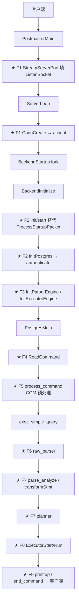
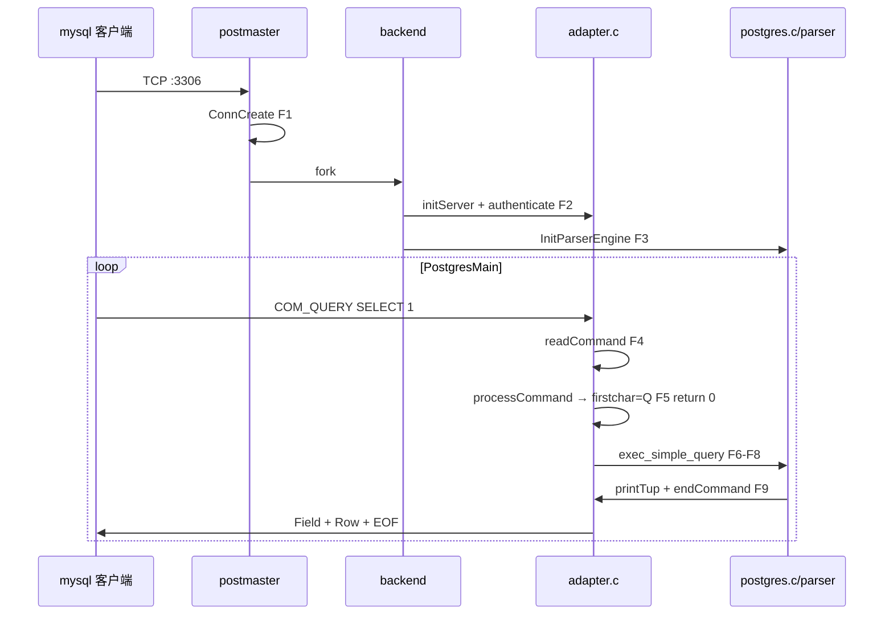
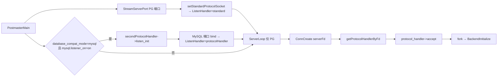
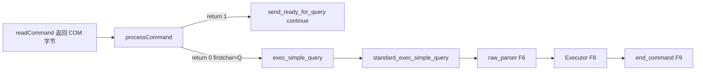
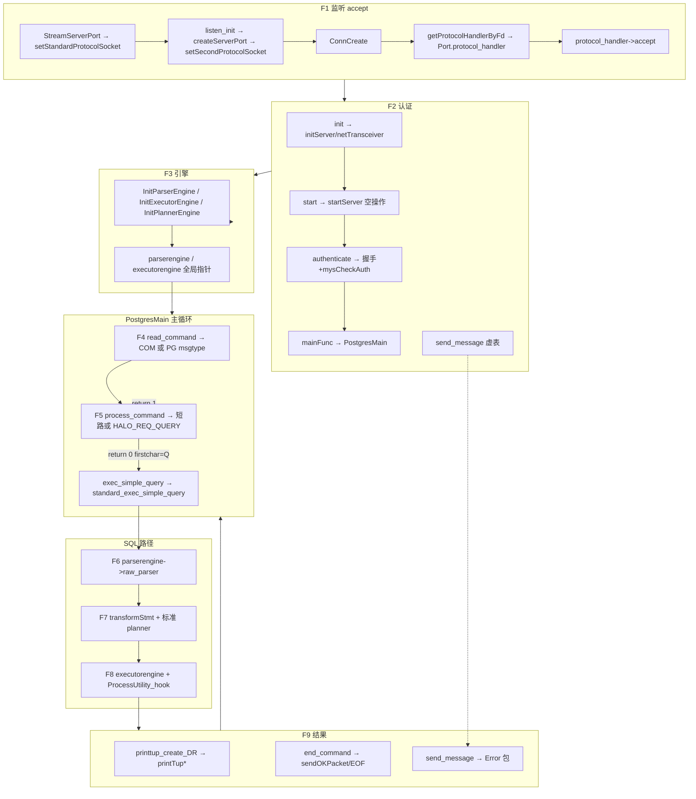
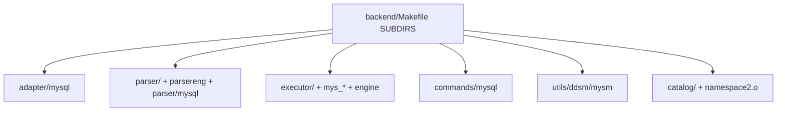

# OpenHalo 如何在 PG 内核上兼容 MySQL

> **30 秒答案**：OpenHalo 在 PG14 上通过 **F1–F9 九处分叉**兼容 MySQL——postmaster **双端口双协议**（5432 PG + 3306 MySQL），`ConnCreate` 按 listen fd 绑定 **`ProtocolInterface` 虚表**；MySQL 连接仍进入 **`PostgresMain` 主循环**，F4/F5 读 COM 包、F6–F8 走 MySQL parser/executor、F9 回 MySQL 行协议；引擎层用 **`database_compat_mode` + `T_MySQLProtocol` 双判据** 选 Parser/Planner/Executor `*Routine` 虚表。

> **文档版本**：2026-07-08（OpenHalo 研究终稿）  
> **对照基线**：PostgreSQL 14.18（`postgresql-14.18`）  
> **OpenHalo 源码**：`openHalo/`（研究主参考）  
> **验证方法**：`diff -rq`（619 项）+ Codegraph MCP + `diff -u` 行级核对  
> **阅读对象**：理解 OpenHalo 在 PG 14.18 上如何做 MySQL 兼容的开发者

---

## 1. 元信息与阅读指引

OpenHalo 相对 PG14.18 共 **619** 个 diff 项（`diff -rq` 输出）：**414** 项两边都有但内容不同（differ）、**77** 项仅 openHalo 有（纯新增目录/文件）、**128** 项仅 PG14 有（多为 gram 生成物，不代表功能删减）。主链改动集中在 **F1–F9** 九个分叉（监听 → 认证 → 引擎 → 读命令 → COM → 解析 → 规划 → 执行 → 回包），增量目录为 `adapter/`、`parser/mysql/`、`commands/mysql/`、`tcop/mysql/`、`contrib/aux_mysql/`、`utils/ddsm/mysm/`。协议层用 **19 槽位 `ProtocolInterface` 虚表**贯穿连接生命周期；引擎层用 **`database_compat_mode` + `T_MySQLProtocol` 双判据** 选 `*Routine` 虚表。

**最小可用配置**（缺一不可：`database_compat_mode=postgresql` 时第二监听 **FATAL**，`postmaster2.c:201–203`）：

```ini
database_compat_mode = mysql
mysql.listener_on = on
mysql.port = 3306
```

PG 5432 端口仍走 `standard_protocol_handler`（`postmaster2.c:52`）；`contrib/aux_mysql` 须会话内 `CREATE EXTENSION`，非 initdb 自动。

### 1.1 怎么读本文

本文档只描述 **OpenHalo 相对 PG14.18 的增量**；源码路径均相对于 `openHalo/` 仓库根。

**阅读路径**（按目标选，不必通读全文）：

- **快速（~20 分钟）**：§1 → **§3.1** `SELECT 1` 全路径 → §17 改动地图导读 → §19.3 总图——建立「改了什么、在哪分叉」的全景。
- **主链（~2 小时）**：§2 PG 基准 → §3 worked example → §4 分叉速查 → **§5–§13** 逐分叉内联叙事——跟着代码走通 MySQL 连接与查询。
- **全量检索（按需）**：主链 + **§20**（619 项索引）+ §21 六大模块架构——查任意 diff 文件的一句话用途。
- **协议逐文件（按需）**：§22 协议模块详解（postmaster 九处改动、netTransceiver 报文格式、printtup 分层）。
- **研究深挖（按需）**：§23 研究补充索引（adt 协议分支、aux_mysql 对象索引、include 链、符号表）。

**建议顺序**：先读 **§3.1** 建立全局时间线（每步含动作、原因、文件:行），再按 F1→F9 读 §5–§13。§4 用短叙事归纳九个分叉与虚表槽位，逐步细节以 §5–§13 为准；§21–§22 补协议目录与 postmaster 改动块；§23 按需检索 adt/aux_mysql 等补充材料。

**§20 检索策略**（索引很大，不要从头扫）：① 已知分叉点 → 查 **§20.2** 按 F 分组导读；② 已知文件路径 → `Ctrl+F` 搜路径（如 `postmaster.c`），组标题 `#### \`src/backend/...\`` 按目录聚合；③ 只关心 MySQL 功能 → 跳过 **§20.5 类别 D**（207 项噪声），A+B 共 404 项已覆盖全部功能增量；④ 需要行级 diff → `diff -u postgresql-14.18/<path> openHalo/<path>`。

**§21→§22→§23 衔接**：§21 按目录给入口符号；§22 在同一协议层内展开 postmaster 九处改动与报文格式；§23 收纳 adt/aux_mysql/catalog 等研究补充索引。

### 1.2 核心术语（首次阅读 inline 定义）

- **协议虚表**（`ProtocolInterface` / `ProtocolRoutine`）：19 个函数指针 + `type` 字段，从 listen 到回包贯穿连接生命周期；详见 §4.2。
- **`ListenHandler[]`**：与 `ListenSocket[]` 平行的 handler 数组；**F1 判据** = accept 时 `serverFd` 所在槽位（§5）。
- **`T_MySQLProtocol`**：`nodeTag(protocol_handler)` 枚举值，用于 F3/F5 等**二次判据**（§7、§9）。
- **双判据**：MySQL 引擎路径需 `database_compat_mode=mysql` **且** `T_MySQLProtocol`；仅设 GUC 但走 5432 仍用 PG 引擎（§7）。
- **COM**（Command）：MySQL 包 payload 首字节（1–31）；F4 `readCommand` 返回，F5 `processCommand` 消费（§8–§9）。
- **`MYS_REQ_QUERY` / `HALO_REQ_QUERY`**：COM 值 3 → F5 桥接为 PG 字符 `'Q'` 进入 `exec_simple_query`（§9）。
- **`*Routine` 引擎**：`ParserRoutine` / `ExecutorRoutine` / `PlannerRoutine`；F3 写入全局 `parserengine` 等（§7）。
- **`netTransceiver`**：MySQL 3 字节头 + payload 读写；F2 初始化，F4/F9 I/O（§6）。
- **`process_command` 返回值**：`1` = adapter 已回包、主循环 `continue`（**不进 F6**）；`0` = 继续 `exec_simple_query`（§9、§3.2）。
- **`aux_mysql`**：`contrib/aux_mysql` 扩展，1891 个 SQL 函数；须 `CREATE EXTENSION`（§14）。
- **A/B/C/D 分类**：§20 索引分类——A=MySQL 核心 37 / B=改 PG 367 / C=平台 8 / D=噪声 207。

---


## 2. PG14 原版信息流（对照基准）

PostgreSQL 14 处理一条客户端 SQL 的**时间顺序**如下。OpenHalo 在标有 **★（F1–F9）** 的环节插入分叉，其余大量复用 PG 存储、事务、锁、WAL。



上图按**时间顺序**从左到右、从上到下。

- **F1–F2（监听→认证）**：`PostmasterMain` 绑定 PG 端口；`ConnCreate` accept 并 fork backend；`BackendInitialize` 里 MySQL 用 `init/start` 替代 `ProcessStartupPacket`；`InitPostgres` 里 `authenticate` 替代 `PerformAuthentication`。
- **F3（引擎）**：`InitParserEngine` / `InitExecutorEngine` 选定 `*Routine` 虚表。
- **F4–F9（主循环）**：`PostgresMain` 内 `ReadCommand` → `process_command`（PG 无 F5）→ `exec_simple_query`（F6 解析 → F7 规划 → F8 执行 → F9 回包）。

OpenHalo 仅在标 **★** 的节点注入 MySQL 路径；存储、事务、锁、WAL 等大量复用 PG。MySQL 连接**不替代** `PostgresMain`——`mainFunc` 仍调用同一主循环（`adapter.c:805–807`），差异经协议虚表与 `*Routine` 注入。**§3.1** 用 `SELECT 1` 串起全流程；§5–§13 逐点展开；§4 为分叉总述与虚表速查。

---

## 3. 一条 SQL 的完整旅程

本章用两个 worked example 串起主链：**§3.1** `SELECT 1` 走 F1–F9 全路径；**§3.2** `COM_PING` 演示 F5 短路（回 OK 包后直接 `continue`，**永不进入 F6 解析**）。

### 3.1 `SELECT 1` 全路径（F1–F9）

以下假设：`database_compat_mode=mysql`、`mysql.listener_on=on`、客户端 `mysql -P 3306 …`，执行 `SELECT 1`。每行同时给出**动作**、**为何在此发生**、**证据位置**；各步细节展开见对应 §5–§13。

| 步 | 分叉 | 动作与原因 | 文件:行 / 符号 |
|----|------|-----------|----------------|
| 1 | F1 | **监听**：postmaster 在 3306 bind，因 GUC 开启第二协议 | `initListen` `adapter.c:517` → `createServerPort` → `setSecondProtocolSocket` |
| 2 | F1 | **accept**：按 `serverFd` 查 `ListenHandler[i]`，绑定 MySQL handler | `ConnCreate` `postmaster.c:2575` → `getProtocolHandlerByFd` `postmaster2.c:153` → `acceptConn` `adapter.c:640` |
| 3 | F2 | **传输初始化**：fork 后建 MySQL 线协议读写（非 libpq 消息帧） | `initServer` `adapter.c:652`（`netTransceiver`） |
| 4 | F2 | **握手认证**：发 Handshake → 收登录包 → 校验密码 | `authenticate` `adapter.c:690` → `mysCheckAuth` `userLogonAuth.c` |
| 5 | F2 | **进主循环**：MySQL 仍复用 PG `PostgresMain`，差异靠虚表注入 | `mainFunc` `adapter.c:805` → `PostgresMain` `postgres.c` |
| 6 | F3 | **引擎选择**：双判据选中 MySQL Parser/Executor | `InitParserEngine` `parsereng.c:38` → `GetMysParserEngine`；`InitExecutorEngine` `executor_engine.c:40`（`postinit.c:1153–1159`） |
| 7 | F4 | **读 COM**：读 MySQL 包 payload 首字节，得到 COM_QUERY(3) | `ReadCommand` `postgres.c:507` → `readCommand` `adapter.c:852` → 返回 `MYS_REQ_QUERY`（`:111`） |
| 8 | F5 | **COM 桥接**：规范化 SQL，把 COM 3 改写为 PG `'Q'` 以进入 `exec_simple_query` | `processCommand` `adapter.c:1267` → `MYS_REQ_QUERY` 分支 `:1300` → `*firstChar = HALO_REQ_QUERY`（`:119`）→ **`return 0`** |
| 9 | F6 | **解析**：MySQL 语法 → raw parse tree | `exec_simple_query` → `standard_exec_simple_query` `postgres.c:1025` → `raw_parser` `parser.c:52` → `mys_raw_parser` `mys_parser.c:319` |
| 10 | F7 | **语义+规划**：transform 走 MySQL，planner 仍标准 PG | `transformStmt` `parser_ep.c:69` → `mys_transformStmt`；`planner()` 标准路径 |
| 11 | F8 | **执行**：跑计划树，产出一行 | `mys_ExecutorRun` `mys_execMain.c:168` → `ExecutePlan` |
| 12 | F9 | **列定义**：发 MySQL Field 包 | `printtup_create_DR` `access/common/printtup.c:80` → `printTupStartup` `adapter.c:1107` |
| 13 | F9 | **行数据**：发 Resultset 行（值为 `1`） | `printTup` `adapter.c:1086` → `printTupText` |
| 14 | F9 | **结束**：SELECT 发 EOF 包，主循环回到 F4 | `endCommand` `adapter.c:871` → `sendEOFPacketFlush` |



F1 输出 `Port.protocol_handler` → F2 完成握手 → F3 在 `InitPostgres` 选引擎 → F4–F9 在同一 `PostgresMain` 循环内靠 handler 与引擎指针串联。

### 3.2 `COM_PING` 短路旅程（F5 `return 1`，不进 F6）

MySQL 客户端周期性发 **COM_PING**（COM 值 **14**，`MYS_REQ_PING`，`adapter.c:111`）检测连接存活。这是理解 F5「预处理 vs 全 SQL 路径」的最小反例：adapter 直接回 OK 包，主循环 `continue`，**解析/规划/执行/结果回包（F6–F9）全部跳过**。

前提与 §3.1 相同（已认证、已在 `PostgresMain` 循环）。客户端发空 payload 的 COM 14 包。

| 步 | 分叉 | 动作与原因 | 文件:行 / 符号 |
|----|------|-----------|----------------|
| 1 | F4 | **读 COM**：`readCommand` 读 payload 首字节得 14 | `readCommand` `adapter.c:852–867` → 返回 `MYS_REQ_PING` |
| 2 | F5 | **分发**：`PostgresMain` 见 `T_MySQLProtocol` 调 `process_command` | `postgres.c` 主循环 → `processCommand` `adapter.c:1267` |
| 3 | F5 | **短路处理**：识别 PING，发 OK 包，**return 1** | `MYS_REQ_PING` 分支 `adapter.c:1643–1647`：`sendOKPacket()` → `return 1` |
| 4 | — | **主循环 continue**：`return 1` 使 PG 侧跳过 `exec_simple_query` | 主循环 `continue`；**不进入 F6** |
| 5 | F4 | **等待下一条 COM**：回到 `ReadCommand` | 下一轮 `readCommand` |

对比 §3.1 步骤 8：`MYS_REQ_QUERY` 分支 **`return 0`**，主循环继续走 `case 'Q': exec_simple_query`，才进入 F6–F9。F5 的返回值是 COM 类命令与 SQL 类命令的分水岭。

```1643:1647:openHalo/src/backend/adapter/mysql/adapter.c
    else if (*firstChar == MYS_REQ_PING)
    {
        sendOKPacket();
        warnErrCode = 0;
        return 1;
    }
```

同类 **`return 1` 短路**（仍不进 F6）还包括：`COM_INIT_DB`（切库后直接 OK）、`COM_FIELD_LIST`、`COM_STMT_*` 部分路径等——均在 `processCommand`（`:1267–1661`）内完成协议层响应。仅 `return 0` 且 `*firstChar == 'Q'` 时才进入 §3.1 的 F6–F9 全链。

### 3.3 `SELECT 1` vs `COM_PING` 一句话对比

| 维度 | §3.1 `SELECT 1` | §3.2 `COM_PING` |
|------|----------------|-----------------|
| F5 返回值 | **`return 0`** → 改写 `firstChar='Q'` | **`return 1`** → adapter 已回 OK 包 |
| 是否进 F6–F9 | **是**（解析→执行→Field/Row/EOF） | **否**（主循环 `continue` 回 F4） |
| 典型用途 | 业务 SQL | 连接保活探测 |
| 判据记忆 | COM 需桥接为 PG `'Q'` 才进 `exec_simple_query` | COM 在 adapter 内闭环，无需 parser |

## 4. 九个分叉点一览 + 双协议虚表速查

### 4.1 九个分叉点（F1–F9）

OpenHalo 在 PG14 信息流上插入 **9 个分叉点**；下列每条同时给出判据、PG/MySQL 路径差异与展开章节（本章为**唯一 canonical 分叉总述**，§5–§13 逐点展开证据）。

- **F1 监听与 accept**（§5）：判据是 accept 时 `serverFd` 在 `ListenSocket[]` 的槽位 → `ListenHandler[i]`。PG 5432 绑 `standard_protocol_handler`；3306 绑 `protocolHandler`（`T_MySQLProtocol`）。
- **F2 Backend 启动与认证**（§6）：`protocol_handler->authenticate` 取代 PG 的 `PerformAuthentication`（startup 包）；MySQL 走握手 + `mysCheckAuth`。
- **F3 引擎初始化**（§7）：须 **双判据**——`database_compat_mode=mysql` 且 `nodeTag==T_MySQLProtocol` 才选 `GetMysParserEngine` / `GetMysExecutorEngine`；否则 `GetStandard*Engine`。
- **F4 命令循环读入**（§8）：`read_command` 虚表；PG 用 libpq 消息帧，MySQL 用 `readCommand` 读 COM 首字节。
- **F5 COM 预处理**（§9）：仅 MySQL 虚表有 `process_command`；返回 **1** 表示 adapter 已回包、主循环 `continue`（**不进 F6**），返回 **0** 才继续 SQL 链。
- **F6 SQL 解析**（§10）：`parserengine->raw_parser` 分发；MySQL 走 `mys_raw_parser` → `mys_gram.y`。
- **F7 语义分析与规划**（§11）：`transformStmt` 走 MySQL 版，**planner 仍用 PG 标准**（§18 已知限制）。
- **F8 执行**（§12）：`executorengine` + `ProcessUtility_hook` → `mys_Executor*` / `mys_standard_ProcessUtility`。
- **F9 结果返回**（§13）：`printtup*` / `end_command`；MySQL 发 Field/Row/OK 包，PG 发 libpq DataRow。

### 4.2 双协议虚表全生命周期（速查表）

`ProtocolInterface` 定义于 `src/include/postmaster/protocol_interface.h`（typedef 名 `ProtocolRoutine`，下文统称 **协议虚表**；含 `type` + **19** 个函数指针）。OpenHalo 用两套静态实例：**PG 标准** `standard_protocol_handler`（`postmaster2.c:52`）与 **MySQL** `protocolHandler`（`adapter.c:464`）。下表为速查——每槽位附 5–10 字用途；**时间顺序与逐步 diff 以 §5–§13 为准**，此处不重复展开。

| 生命周期阶段 | 调用位置（进程） | PG 标准符号 | MySQL 符号 | 用途（5–10 字） | 分叉 |
|-------------|-----------------|------------|-----------|----------------|------|
| `listen_init` | `PostmasterMain`（postmaster） | NULL | `initListen`（`:517`） | 3306 第二监听 | F1 |
| `accept` | `ConnCreate`（postmaster） | `standard_accept`（`:233`） | `acceptConn`（`:640`） | accept 并绑 handler | F1 |
| `close` | 失败清理 / 关闭 | `standard_close`（`:238`） | `closeListen`（`:646`） | 释放 listen fd | F1 |
| `init` | `BackendInitialize` | `standard_init` → `pq_init`（`:245`） | `initServer`（`:652`） | 建 netTransceiver | F2 |
| `start` | `BackendInitialize` | `standard_start` → `ProcessStartupPacket`（`:251`） | `startServer`（`:682`） | MySQL 无 startup 包 | F2 |
| `authenticate` | `InitPostgres` | `standard_authenticate`（`postinit2.c:51`） | `authenticate`（`:690`） | 握手+密码校验 | F2 |
| `mainfunc` | `BackendRun` | `standard_mainfunc` → `PostgresMain`（`:257`） | `mainFunc` → `PostgresMain`（`:805`） | 进主循环 | F2 |
| `send_message` | `ErrSendMessage`（`elog.c:1552`） | `standard_send_message`（`elog2.c:51`） | `sendErrorMessage`（`:811`） | ERROR 包 | — |
| `send_cancel_key` | `PostgresMain`（`:4384`） | `standard_send_cancel_key`（`:263`） | `mysqlSendCancelKey`（`:840`） | 空实现占位 | — |
| `comm_reset` / `is_reading_msg` | 错误恢复 | `standard_comm_reset` / `standard_is_reading_msg` | NULL | MySQL 不用 | — |
| `send_ready_for_query` | `PostgresMain`（`:4679`） | `standard_send_ready_for_query`（`:299`） | `sendReadyForQuery`（`:846`） | 空实现占位 | — |
| `read_command` | `ReadCommand`（`:513`） | `standard_read_command`（`postgres2.c:53`） | `readCommand`（`:852`） | 读 COM 首字节 | F4 |
| `process_command` | 主循环（`:4744`） | **NULL** | `processCommand`（`:1267`） | COM 预处理/短路 | F5 |
| `end_command` | `standard_exec_simple_query` 末尾 | `standard_end_command`（`:305`） | `endCommand`（`:871`） | OK/EOF 收尾 | F9 |
| `printtup*` | `printtup_create_DR`（`access/common/printtup.c:80`） | NULL → 默认 `printtup` | `printTup*`（`:1086`） | Field/Row 包 | F9 |
| `report_param_status` | GUC 变更通知 | `standard_report_param_status`（`:276`） | `reportParamStatus` | 会话变量通知 | — |

**MySQL 虚表完整绑定**：

```464:486:openHalo/src/backend/adapter/mysql/adapter.c
static ProtocolInterface protocolHandler = {
    .type = T_MySQLProtocol,
    .listen_init = initListen,
    .accept = acceptConn,
    .close = closeListen,
	.init = initServer,
    .start = startServer,
	.authenticate = authenticate,
	.mainfunc = mainFunc,
	.send_message = sendErrorMessage,
	.send_cancel_key = mysqlSendCancelKey,
	.comm_reset = NULL,
	.is_reading_msg = NULL,
	.send_ready_for_query = sendReadyForQuery,
	.read_command = readCommand,
	.end_command = endCommand,
	.printtup = printTup,
	.printtup_startup = printTupStartup,
	.printtup_shutdown = printTupShutdown,
	.printtup_destroy = printTupDestroy,
	.process_command = processCommand,
    .report_param_status = reportParamStatus
};
```

**PG 标准虚表**（节选，注意 `process_command = NULL`）：

```52:75:openHalo/src/backend/postmaster/postmaster2.c
static const ProtocolInterface    standard_protocol_handler = {
    .type = T_StandardProtocol,
    .listen_init = NULL,
    .accept = standard_accept,
    .close = standard_close,
    .init = standard_init,
    .start = standard_start,
    .authenticate = standard_authenticate,
    .mainfunc = standard_mainfunc,
    .send_message =standard_send_message,
    // ...
    .process_command = NULL,
    .report_param_status = standard_report_param_status
};
```

---

## 5. 监听与 accept（分叉点 F1）

> **全量索引**：双监听相关 diff 见 §20 `postmaster.c`、`pqcomm.c`、`postmaster2.c`、`adapter/`。

### 5.1 本阶段在信息流中的位置

F1 对应 §3.1 步骤 1–2：postmaster 在 5432（PG）或 3306（MySQL）bind 并 accept，`ConnCreate` 把 `Port.protocol_handler` 绑定到具体协议。**输入**为 postmaster 启动时的 GUC（`database_compat_mode=mysql`、`mysql.listener_on=on`）；**输出**为已 accept 的连接且 handler 已写入 `Port`，待 fork 进入 F2。**F1 判据**（§1.2）= accept 时 `serverFd` 在 `ListenSocket[]` 中的槽位 → `ListenHandler[i]`；PG 端口绑 `standard_protocol_handler`，3306 绑 `protocolHandler`（`T_MySQLProtocol`）。

### 5.2 PG14 怎么做

PG14 只有一条硬编码监听链：`PostmasterMain` 调 `StreamServerPort`，每 bind 成功一个地址就把 fd 写入全局 `ListenSocket[]`（PG14 `:583` 直接赋值），**fd 与协议类型无关联**。`ServerLoop` accept 后调 `ConnCreate(serverFd)`，内部 `calloc(Port)` 后直接 `StreamConnection(serverFd, port)` 完成 libpq accept——不存在 handler 概念，后续 F2–F9 也无法按协议分发。

### 5.3 OpenHalo 如何分叉

OpenHalo 在 PG14 监听/accept 链上插入 **fd 槽位 ↔ handler** 并行映射；纯新增 `postmaster2.c`（经 `postmaster.c` 末尾 `#include` 编入）定义 `ListenHandler[MAXLISTEN]`（`:51`）与 PG 标准包装 `standard_protocol_handler`（`:52–75`），把原 `StreamConnection` / `pq_init` / `ProcessStartupPacket` / `PostgresMain` 映射为 `standard_*` 回调。

**PG 端口登记**：PG14 `StreamServerPort` 末尾直接写 `ListenSocket[listen_index] = fd`；OpenHalo 同 hunk 改为 `setStandardProtocolSocket(fd)`（`pqcomm.c:587`），该 helper（`postmaster2.c:107–122`）原子完成「占空槽 + `ListenHandler[i] = &standard_protocol_handler`」，从此槽位索引即 F1 判据。

**MySQL 第二监听**：PG14 在 Unix/TCP 监听段结束后直接进入 socket 检查（`:1295`）；OpenHalo 在其前插入（`postmaster.c:1312–1320`）——`halo_mysql_listener_on` 为真时 `setSecondProtocolHandler(getSecondProtocolHandler())` 再 `secondProtocolHandler->listen_init()`。要看 GUC 双条件门控，读 `getSecondProtocolHandler`：非 `MYSQL_COMPAT_MODE` 直接 FATAL，避免 postgresql 模式下误开 3306。

```194:217:openHalo/src/backend/postmaster/postmaster2.c
const ProtocolInterface *
getSecondProtocolHandler(void)
{
    ProtocolInterface *handler = NULL;
    
    switch (database_compat_mode)
    {
        case POSTGRESQL_COMPAT_MODE:
            ereport(FATAL,
					    (errmsg("second listener only works for MySQL mode")));
			break;
		case MYSQL_COMPAT_MODE:
            {
                handler = getMysProtocolHandler();
                break;
            }
		
		default:
            ereport(FATAL,
                    (errmsg("second listener only works for MySQL mode")));
			break;
    }

    return handler;
}
```

**MySQL fd 注册**：`initListen`（`adapter.c:517–637`）复用 PG 的 `listen_addresses` GUC，对每个地址调 `createServerPort(..., &protocolHandler)`（`:3700`），成功 bind 后 `setSecondProtocolSocket(fd)`（`:3919`）——等价 `ListenHandler[i] = protocolHandler`（`T_MySQLProtocol`，`:464–486`），端口取自 GUC `mysql.port`。

**accept 分发**：PG14 `ConnCreate` 直接 `StreamConnection`；OpenHalo 在 `Port` 增 `protocol_handler`（`libpq-be.h:226`）后，accept 前按 fd 查 `ListenHandler[]` 并调虚表 `accept`：

```2575:2594:openHalo/src/backend/postmaster/postmaster.c
ConnCreate(int serverFd)
{
	Port	   *port;
	// ...
	port->protocol_handler = getProtocolHandlerByFd(serverFd);
	Assert(port->protocol_handler != NULL);

	if (port->protocol_handler->accept(serverFd, port) != STATUS_OK)
	{
		// ...
	}
	return port;
}
```

`getProtocolHandlerByFd`（`postmaster2.c:153–166`）线性扫描 `ListenSocket[]` 找 `serverFd` 槽位；MySQL 的 `acceptConn`（`:640–642`）内部仍调 `StreamConnection`，失败清理走 `protocol_handler->close`。Postmaster 内 `ListenSocket[i] ↔ ListenHandler[i]` → fork 后 F2–F9 **透传** `Port.protocol_handler`，不再重判 fd；`accept` 在 postmaster、fork **之前**完成。



连接已 accept、`Port.protocol_handler` 已绑定；子进程进入 `BackendInitialize` → F2。

---

## 6. Backend 启动与认证（分叉点 F2）

> **全量索引**：§20 `postinit.c`、`postinit2.c`、`elog2.c`、`adapter/`、`userLogonAuth.c`、`crypt.c`。

### 6.1 本阶段在信息流中的位置

F2 对应 §3.1 步骤 3–5：fork 后 `BackendInitialize` 完成传输初始化与握手认证，再经 `mainfunc` 进入 `PostgresMain`。**输入**为 F1 已写入的 `Port.protocol_handler`；**输出**为 MySQL 握手完成、用户已认证、会话可进入命令循环。F2 按 **协议虚表** 的 `init`/`start`/`authenticate`/`mainfunc`/`send_message` 回调分发（§4.2 速查）；MySQL 路径用 `netTransceiver` 替代 libpq 消息帧（§1.2）。

### 6.2 PG14 怎么做

PG14 fork 后 `BackendInitialize` 直接 `pq_init()`（`:4382`），因为 PG startup 包读写依赖 libpq 缓冲；随后 `ProcessStartupPacket` 读取 startup 消息或 cancel 请求（`:4469` 附近）。`InitPostgres` 在 multiuser 分支直接 `PerformAuthentication(port)` 完成 md5/scram 等 PG 认证；`BackendRun` 末尾直接 `PostgresMain(...)`；错误路径统一 `send_message_to_frontend` 发 libpq `'E'` 消息——整条链硬编码为 PG 协议，无 handler 分发。

### 6.3 OpenHalo 如何分叉

F1 绑定的 `Port.protocol_handler` 从 postmaster fork 后一路传递；OpenHalo 把 PG14 各硬编码调用点改为虚表回调，MySQL 与 PG 共享同一 `BackendInitialize`/`InitPostgres` 骨架。

**连接初始化**：PG14 直接 `pq_init()`；OpenHalo 改为 `port->protocol_handler->init()`（`postmaster.c:4418`）——PG 路径 `standard_init` → `pq_init`（`postmaster2.c:245–247`）；MySQL 路径 `initServer`（`adapter.c:652–678`）调 `initNetTransceiver()`、建 `FeBeWaitSet`、设 nonblocking socket，**不走 libpq 消息帧**。

**启动包**：PG14 调 `ProcessStartupPacket`；OpenHalo 改为 `port->protocol_handler->start(port)`（`:4506`）。MySQL 的 `startServer`（`:682–686`）仅设 `MyBackendType = B_BACKEND` 并返回 `STATUS_OK`——**无 PG startup 包**；真实 Handshake 推迟到 `authenticate`。

**认证**：PG14 `InitPostgres` 直接 `PerformAuthentication`；OpenHalo（`postinit.c:799`）改为 `MyProcPort->protocol_handler->authenticate(MyProcPort, &username)`。要看 MySQL 握手完整顺序，读 `authenticate`（`:690–802`）：发 Handshake → 收登录包 → `mysCheckAuth`（`userLogonAuth.c`）→ 设 `search_path` 含 `mysql` schema（`:777–783`）→ `standard_parserengine_auxiliary=off`（`:794`）→ 初始化预编译/类型哈希表。PG 路径经 `postinit2.c:51` 包装仍调 `PerformAuthentication`；MySQL 协议下 `in_dbname` 映射为 `"halo0root"`（`postinit.c:802–810`），catalog 就绪后按 schema 存在性发 OK/Error 包（`:1077–1106`）。

**主入口与错误回包**：PG14 `BackendRun` 末尾直接 `PostgresMain`；OpenHalo（`:4577–4580`）优先 `protocol_handler->mainfunc`——MySQL `mainFunc`（`:805–807`）内部仍调 `PostgresMain`，主循环不变。错误路径须同样走 MySQL Error 包，故 `elog.c` 改为虚表分发：

```1548:1557:openHalo/src/backend/utils/error/elog.c
	/* Send to client, if enabled */
	if (edata->output_to_client)
	{
		
		if (MyProcPort)
			MyProcPort->protocol_handler->send_message(edata);
		else
			send_message_to_frontend(edata);
		
	}
```

MySQL 实现 `sendErrorMessage`（`adapter.c:811`）发 Error 包；IGNORE 语义下可转 `sendOKPacket`。`init`→`start`→`authenticate` 完成「传输层 + 身份」→ `mainfunc` 进入共享 `PostgresMain` → `send_message` 保证 ERROR/FATAL 也走 MySQL 线协议。

认证完成、`InitPostgres` 继续初始化三引擎（F3），最终进入 `PostgresMain` 命令循环（F4）。

---

## 7. 引擎初始化（分叉点 F3）

> **全量索引**：§20 `parsereng.c`、`parser_engine.c`、`executor_engine.c`、`planner_engine.c`、`parser/mysql/`。

### 7.1 本阶段在信息流中的位置

F3 对应 §3.1 步骤 6：`InitPostgres` 后半段在 `InitializeSession()` 之后写入全局 `parserengine` / `executorengine` / `plannerengine` 指针。**输入**为 F2 认证完成后的会话上下文（含 `MyProcPort->protocol_handler`）；**输出**为三引擎指针就绪，供 F6–F8 只读分发。**双判据**（§1.2、§16）= `database_compat_mode=mysql` **且** `nodeTag(protocol_handler)==T_MySQLProtocol`；仅设 mysql 模式但走 5432 PG 端口时仍用标准 Parser/Executor（便于 psql 管理）。

### 7.2 PG14 怎么做

PG14 无「引擎」概念：`InitializeSession()` 之后直接进入 `pgstat_bestart` / `CommitTransactionCommand`。`raw_parser` 直接调 Bison `base_yyparse`（`gram.y`）；Executor / Planner 为全局标准实现，无 hook 分发——SQL 处理链全部硬编码。

### 7.3 OpenHalo 如何分叉

OpenHalo 在 `InitPostgres` 插入五个初始化调用（`postinit.c:1152–1165`），把 SQL 处理链从硬编码改为全局 `*engine` 指针 + 虚表；F6–F8 只读这些指针，不再重复判 fd。

**三引擎插入点**：PG14 `InitializeSession()` 之后无引擎调用；OpenHalo 依次 `InitParserEngine` / `InitPlannerEngine` / `InitExecutorEngine` / `InitADTExt` / `InitFmgrExtension`（`postinit.c:1152–1165`）。

**Parser 双判据**：PG14 `raw_parser` 直接调 `base_yyparse`；OpenHalo 新增 `InitParserEngine`（`parsereng.c:38–63`）——双判据成立时 `parserengine = GetMysParserEngine()`，否则（含 5432 + mysql 模式）仍 `GetStandardParserEngine()`：

```37:63:openHalo/src/backend/parser/parsereng.c
void
InitParserEngine(void)
{
	switch (database_compat_mode)
	{
		case POSTGRESQL_COMPAT_MODE:
			parserengine = GetStandardParserEngine();
			break;
		case MYSQL_COMPAT_MODE:
            if ((MyProcPort != NULL) && 
                (nodeTag(MyProcPort->protocol_handler) == T_MySQLProtocol))
            {
                parserengine = GetMysParserEngine();
            }
            else
            {
                parserengine = GetStandardParserEngine();
            }
			break;
		default:
			parserengine = GetStandardParserEngine();
			break;
	}
}
```

**Executor + utility hook**：PG14 Executor 无 hook；OpenHalo `InitExecutorEngine`（`executor_engine.c:40–76`）在双判据成立时 `executorengine = GetMysExecutorEngine()` 且 `ProcessUtility_hook = mys_standard_ProcessUtility`，并设置 `ExecutorStart_hook` / `ExecutorRun_hook` 指向虚表成员——DDL/utility 与 DML 在此处分叉。

**Planner 仍标准**：`InitPlannerEngine`（`planner_engine.c:36–49`）无论协议类型均 `GetStandardPlannerEngine()`——F7 规划层 **intentionally 未分叉**，MySQL 语义在 transform 与 executor 层消化。GUC 变量定义于 `parsereng.c:24–25`（`database_compat_mode`、`standard_parserengine_auxiliary`）。

`parserengine` / `executorengine` / `plannerengine` 全局指针就绪；`PostgresMain` 主循环开始（F4）。

---

## 8. 命令循环入口（分叉点 F4）

> **全量索引**：§20 `postgres.c`、`postgres2.c`、`stringinfo.c`、`pqformat.c`、`netTransceiver.c`。

### 8.1 本阶段在信息流中的位置

F4 对应 §3.1 步骤 7 与 §3.2 步骤 1：`PostgresMain` 主循环每轮先 `ReadCommand` 读入一条客户端消息。**输入**为 F3 就绪的引擎指针与 F2 初始化的 `netTransceiver`；**输出**为 `firstchar`（MySQL 为 COM 字节 1–31；PG 为 `'Q'`/`'P'` 等 ASCII message type）+ `input_message`（含 SQL 正文）。**COM** = MySQL payload 首字节，供 F5 `processCommand` 消费；`StringInfo.offset=128` 预留包头空间（§1.2）。

### 8.2 PG14 怎么做

PG14 `PostgresMain` 主循环调 `ReadCommand`，远程连接在 `whereToSendOutput == DestRemote` 时直接 `SocketBackend(inBuf)` 读取 PG 协议消息帧——首字节即 message type，随后 `switch(firstchar)` 进入 `exec_simple_query` 等路径。无 COM 预处理阶段，无 `StringInfo.offset` 字段。

### 8.3 OpenHalo 如何分叉

OpenHalo 把 `ReadCommand` 改为虚表分发，并扩展 `StringInfo` 布局以复用 PG 侧消息解析代码于 MySQL 缓冲区。

**ReadCommand 虚表分发**：PG14 直接 `SocketBackend`；OpenHalo 改为 `MyProcPort->protocol_handler->read_command(inBuf)`（`postgres.c:507–518`），PG 包装在 `postgres2.c:52–56` 仍调 `SocketBackend`。要看 MySQL 如何读 COM 包，读 `readCommand`：

```851:867:openHalo/src/backend/adapter/mysql/adapter.c
static int
readCommand(StringInfo inBuf)
{
    int sqlType;

    inBuf->offset = 128;
    if (netTransceiver->readPayload(inBuf))
    {
        sqlType = inBuf->data[inBuf->offset];
        inBuf->offset++;
    }
    else
    {
        elog(ERROR, "Client has disconnect when read.");
        proc_exit(1);
    }
    return sqlType;
}
```

先将 `inBuf->offset = 128` 预留包头空间，再 `netTransceiver->readPayload` 读完整 MySQL 包；返回值即 COM 首字节（如 `MYS_REQ_QUERY`=3）。同一 `firstchar` 变量、不同语义，靠 F1 绑定的 handler 区分。

**StringInfo.offset 支撑**：OpenHalo 在 `StringInfoData` 增 `offset` 字段（`stringinfo.h:43`），供 MySQL 在缓冲区前部保留包头、后部读写 COM/SQL 正文。`resetStringInfo` 只清零 `len`/`cursor`、**保留** `offset`（`stringinfo.c:85–89`）；`processCommand` 等用 `inBuf->data + inBuf->offset`（`adapter.c:1305`）取 SQL 正文；`pq_getmsgstring` 索引叠加 `msg->offset`（`pqformat.c:589`），MySQL 分支另算 `slen`（`:598–606`）。大包场景 `initStringInfoForMySQL` 默认 `offset = 2048`（`stringinfo.c:74`）。

**tcop include 链与其它虚表钩子**：`postgres.c` 末尾 `#include "postgres2.c"`；原 `exec_simple_query` 等改名为 `standard_exec_*`。同 diff 区段还将 `send_cancel_key`（`:4384–4386`）、`comm_reset`（`:4492–4493`）、`is_reading_msg`（`:4557–4558`）、`send_ready_for_query`（`:4679–4680`）改为可选虚表调用；MySQL handler 中 `mysqlSendCancelKey` / `sendReadyForQuery` 为空实现（`adapter.c:840–848`），因 MySQL 无 PG 的 ReadyForQuery / CancelKey 消息。

`PostgresMain` 循环 → `ReadCommand` → handler 读入 → `firstchar` + `input_message` → F5 `process_command` 或 PG `switch(firstchar)`。`netTransceiver` 在 F2 `initServer` 初始化，F4 起承担 MySQL 线协议 I/O。

主循环得到 `firstchar`，进入 F5 `process_command` 预处理。

---

## 9. COM 预处理（分叉点 F5）

> **全量索引**：§20 `adapter.c`（主体）、`postgres.c`（主循环门）、`systemVar.c`（SHOW/变量模拟）。

### 9.1 本阶段在信息流中的位置

F5 对应 §3.1 步骤 8 与 §3.2 步骤 2–4：MySQL 专有阶段，PG14 不存在。**输入**为 F4 的 COM 字节 + `StringInfo` 缓冲区；**输出**为 `return 1` 则已在 adapter 内回包、主循环 `continue` 回到 F4（见 §3.2 `COM_PING`）；`return 0` 且 `firstchar='Q'`（`HALO_REQ_QUERY`）则进入 F6–F9 全链（见 §3.1）。`return 1` / `return 0` 是 COM 类命令与 SQL 类命令的分水岭。

### 9.2 PG14 怎么做

PG14 **无此阶段**。`ReadCommand` 返回后直接 `switch(firstchar)` 进入 `exec_simple_query` / extended query 等路径；`standard_protocol_handler.process_command = NULL`（`postmaster2.c:73`），PG 路径永不进入 F5。

### 9.3 OpenHalo 如何分叉

OpenHalo 在 `PostgresMain` 主循环 `switch(firstchar)` **之前**插入 COM 预处理门——要看门控逻辑，读主循环 hunk（`postgres.c:4744–4763`）：

```4744:4763:openHalo/src/backend/tcop/postgres.c
		if (firstchar != EOF && 
            MyProcPort && MyProcPort->protocol_handler->process_command)
        {

            if (nodeTag(MyProcPort->protocol_handler) == T_MySQLProtocol)
            {
                int process_ret = MyProcPort->protocol_handler->process_command(&firstchar, &input_message);
                if (process_ret == 1)
                {
                    send_ready_for_query = true;
                    continue;
                }
            }
            else if (nodeTag(MyProcPort->protocol_handler) == T_TDSProtocol)
            {
                MyProcPort->protocol_handler->process_command(&firstchar, &input_message);
                send_ready_for_query = true;
                continue;
            }
        }
```

`process_command` 非 NULL 且 `T_MySQLProtocol` 时调 `processCommand`；返回 `1` 则 `continue`（已在 adapter 内回包），返回 `0` 则 fall through 到原有 `switch`。

**processCommand 分发**：入口（`adapter.c:1267+`）重置 `moreResultsFlag`、`warnings`、`lastInsertIDForPacket` 等会话级状态，再按 COM 值分支——`MYS_REQ_QUIT`(1) 断开；`MYS_REQ_QUERY`(3) 经 `rectifyCommand`、多语句分割、部分 SHOW 模拟后设 `*firstChar = HALO_REQ_QUERY`（`'Q'`，`:119`）并 `return 0`；`MYS_REQ_PREPARE`(22) 预编译改写；`MYS_REQ_EXECUTE`(23) 经 `rewriteExtendExeStmt` 成功则同样转 `'Q'` 并 `return 0`，失败则 `sendSyntaxError` + `return 1`。COM=3 分支（`:1300+`）正文地址为 `inBuf->data + inBuf->offset`（`:1305`）；空语句、纯注释等短包可直接 `sendOKPacket()` + `return 1`，无需进入 F6。

**桥接 PG case 'Q'**：`HALO_REQ_QUERY='Q'` 是刻意设计的桥接常量，使 MySQL COM_QUERY **复用** PG 主循环 `case 'Q': exec_simple_query(...)`（`postgres.c:4793–4796`）。MySQL 分支额外记录 `stmtLen = input_message.len`（`:4783–4787`）供 F8 IGNORE 语义使用。



COM 预处理完成后，若未 `continue`，进入 `exec_simple_query` → F6；若已 `continue`，主循环回到 F4 等待下一条 COM。

---

## 10. SQL 解析（分叉点 F6）

> **全量索引**：§20 `parser.c`、`parser/mysql/`（整目录）、`parser_ep.c`。

### 10.1 本阶段在信息流中的位置

F6 对应 §3.1 步骤 9：`exec_simple_query` 内 `raw_parser` 将 F5 桥接后的 SQL 字符串（如 `SELECT 1`）解析为 raw parse tree 列表。**输入**为 SQL 正文；**输出**为 raw tree 列表，交给 F7 `transformStmt`。F6 经 F3 写入的 `parserengine->raw_parser` 分发；MySQL 路径调 `mys_raw_parser`（`mys_gram.y`），失败时可回退 PG `standard_raw_parser`（GUC `standard_parserengine_auxiliary`）。

### 10.2 PG14 怎么做

PG14 `exec_simple_query` → `raw_parser` 函数体即 Bison 词法/语法分析（`base_yyparse` / `gram.y`）→ 原始 parse tree 列表——无引擎指针、无回退机制。

### 10.3 OpenHalo 如何分叉

OpenHalo 将 PG14 `raw_parser` 重命名为 `standard_raw_parser`（static），新增薄包装经 `parserengine` 虚表分发，并纯新增 `parser/mysql/` 目录承载 MySQL 语法。

**raw_parser 引擎分发与回退**：要看 F3 指针如何被消费以及解析失败时的 PG 回退，读薄包装（`parser.c:52–85`）：

```52:85:openHalo/src/backend/parser/parser.c
List *
raw_parser(const char *str, RawParseMode mode)
{
	List *raw_parsetree = NIL;
	MemoryContext	oldctx = CurrentMemoryContext;

	if (parserengine == NULL)
		parserengine = GetStandardParserEngine();

	Assert(parserengine != NULL);
	Assert(parserengine->raw_parser != NULL);

	PG_TRY();
	{
		raw_parsetree = parserengine->raw_parser(str, mode);
	}
	PG_CATCH();
	{
		if (raw_parsetree == NIL && parserengine->is_standard_parser == false
			&& (standard_parserengine_auxiliary == STANDARDARD_PARSERENGINE_AUXILIARY_ON 
				&& parserengine->need_standard_parser == true))
		{
			MemoryContextSwitchTo(oldctx);
			FlushErrorState();
			MemoryContextSwitchTo(oldctx);

			raw_parsetree = GetStandardParserEngine()->raw_parser(str, mode);
		}
		else
			PG_RE_THROW();
	}
	PG_END_TRY();
	return raw_parsetree;
}
```

MySQL 连接下 F3 已将 `parserengine` 设为 `GetMysParserEngine()`；`mys_raw_parser` 调 Flex/Bison `mys_yyparse`（`mys_gram.y`，24199 行），产出 raw tree 列表，NodeTag 可含 `T_UserVarRef` 等 MySQL 扩展（§16）。`PG_CATCH` 块实现解析回退：MySQL parser 抛错且 `standard_parserengine_auxiliary=on`（默认）时回退 PG `gram.y`；认证成功后 adapter 将其设为 `off`（`adapter.c:794`），强制 MySQL 语法路径。同文件 diff 还新增 `standard_parser_engine` 静态实例（`:353+`）与 `GetStandardParserEngine()`，把原 PG 逻辑封装为 `ParserRoutine` 虚表成员。纯新增 `parser/mysql/` 核心文件：`mys_parser.c`（引擎工厂）、`mys_gram.y` / `mys_scan.l`（语法/词法）、`mys_analyze.c` / `mys_parse_utilcmd.c`（F7 transform）、`parser_ep.c`（全局 `transform*` 分发）。

raw parse tree 列表进入 `parse_analyze` / `transformStmt`（F7）。

---

## 11. 语义分析与规划（分叉点 F7）

> **全量索引**：§20 `mys_analyze.c`、`mys_parse_utilcmd.c`、`parser_ep.c`、`namespace2.c`、`planner_engine.c`。

### 11.1 本阶段在信息流中的位置

F7 对应 §3.1 步骤 10–11：F6 raw parse tree 经 `transformStmt` 转为 `Query`，再经 `planner()` 生成 `PlannedStmt`。**输入**为 raw tree；**输出**为 `PlannedStmt`（planner 仍走 PG 标准路径，已知限制见 §18）。Transform 经 `parserengine->transformStmt` 分发；MySQL 专用 NodeTag 见 §16。

### 11.2 PG14 怎么做

PG14 `parse_analyze` → `transformStmt`（`analyze.c` 内直接实现）将 raw tree 转为 `Query`；`planner()` 生成 `PlannedStmt`——无引擎虚表、无 MySQL 命名空间映射。

### 11.3 OpenHalo 如何分叉

OpenHalo 新增 `parser_ep.c` 统一 transform 入口，MySQL 语义在 transform 与 catalog 可见性层消化，**planner  intentionally 未分叉**。

**transformStmt 虚表入口**：PG14 `transformStmt` 分散于 `analyze.c` 等文件；OpenHalo 新增统一入口（`parser_ep.c:69–82`）——MySQL 连接下 F3 选定的 `GetMysParserEngine()` 提供 `mys_transformStmt`（`mys_analyze.c`），utility 语句走 `mys_parse_utilcmd.c` / `mys_utility.c` 处理 `T_MysVariableSetStmt` 等：

```69:82:openHalo/src/backend/parser/parser_ep.c
Query *
transformStmt(ParseState *pstate, Node *parseTree)
{
	Query	   *query;

	Assert(parserengine != NULL);

	if (parserengine->transformStmt)
		query = parserengine->transformStmt(pstate, parseTree);
	else
		query = standard_transformStmt(pstate, parseTree);

	return query;
}
```

产出仍是 PG `Query` 树，但可含扩展 NodeTag。`InitPlannerEngine` 在 MySQL 协议下仍 `GetStandardPlannerEngine()`（`planner_engine.c:45–48`）——`planner()` 调用链与 PG14 相同，MySQL 特有优化（如 hint）未在此层实现。

**catalog 命名空间映射**：与 transform 交织，决定元数据可见性——MySQL 协议下环境 catalog OID 映射为 `mysql` schema 而非 `pg_catalog`（`namespace2.c:87–95`），影响 `search_path` 与 `information_schema` 类查询：

```87:95:openHalo/src/backend/catalog/namespace2.c
            if ((MyProcPort != NULL) && 
                (nodeTag(MyProcPort->protocol_handler) == T_MySQLProtocol))
            {
                oid = get_namespace_oid("mysql", true);
            }
            else
            {
                oid = PG_CATALOG_NAMESPACE;
            }
```

F6 raw tree → `transformStmt` → 标准 `planner()` → `PlannedStmt` → F8。

---

## 12. 执行（分叉点 F8）

> **全量索引**：§20 `mys_executor.c`、`mys_execMain.c`、`mys_nodeModifyTable.c`、`commands/mysql/`、`tcop/mysql/`。

### 12.1 本阶段在信息流中的位置

F8 对应 §3.1 步骤 11：F7 的 `PlannedStmt` 经 Executor 执行，结果 tuples 写入 `DestReceiver`（待 F9 编码）。**输入**为 `PlannedStmt` 或 utility 语句；**输出**为结果行或 utility 完成信号。F8 经 F3 写入的 `executorengine` 虚表与 `ProcessUtility_hook` 分发；DDL/utility 走 `mys_standard_ProcessUtility`（`utility.c` `#include` `tcop/mysql/mys_utility.c`）。

### 12.2 PG14 怎么做

PG14 `ExecutorStart` / `ExecutorRun` 为固定实现，无 hook 分发；DDL/utility 直接走 `ProcessUtility`——DML 与 utility 路径均硬编码。

### 12.3 OpenHalo 如何分叉

OpenHalo F3 将 `ExecutorStart_hook` / `ExecutorRun_hook` 指向 `executorengine` 虚表（`executor_engine.c:71–75`），MySQL 双判据成立时另设 `ProcessUtility_hook = mys_standard_ProcessUtility`。

**Executor 虚表**：PG14 `ExecutorStart`/`ExecutorRun` 无 hook；MySQL 虚表 `mys_executor_engine`（`mys_executor.c:30–40`）提供 `mys_ExecutorStart`、`mys_ExecutorRun`、`mys_ExecInitNode` 等，内部包装标准 Executor 并注入 MySQL DML 语义——`INSERT IGNORE`、`ON DUPLICATE KEY` 等于 `mys_nodeModifyTable.c`（3958 行）；MySQL 分区路由于 `mys_execPartition.c`。

```30:40:openHalo/src/backend/executor/mys_executor.c
static const ExecutorRoutine mys_executor_engine = {
    .type = T_ExecutorRoutine,

    .ExecutorStart = mys_ExecutorStart,
    .ExecutorRun = mys_ExecutorRun,
    .ExecInitNode = mys_ExecInitNode,
    .ExecEndNode = mys_ExecEndNode,
    .ExecReScan = mys_ExecReScan,

    .partition = &mys_partition_engine
};
```

**ProcessUtility_hook**：DDL/`USE`/`SHOW` 等 utility 不经过 Planner，改走 `tcop/mysql/mys_utility.c` 与 `commands/mysql/mys_tablecmds.c`（17000+ 行 MySQL DDL 语义）。

**exec_simple_query 内 MySQL 修补**（非虚表但关键）：`end_command` 虚表替换 `EndCommand`（`postgres.c:1364–1367`）；空 parsetree 列表时 MySQL 发 `sendOKPacket()` 而非 `NullCommand`（`:1388–1398`），保证 utility-only 或空语句也符合 MySQL 客户端期望。MySQL 路径还维护 `stmtLen`、`isIgnoreStmt` 全局（`:108–109`）供 IGNORE 语义使用。

```1388:1398:openHalo/src/backend/tcop/postgres.c
	if (!parsetree_list)
    {
        if ((MyProcPort != NULL) && 
            (nodeTag(MyProcPort->protocol_handler) == T_MySQLProtocol))
        {
            sendOKPacket();
        }
        else 
        {
            NullCommand(dest);
        }
    }
```

`PlannedStmt` → `ExecutorStart_hook`/`ExecutorRun_hook`（读 F3 `executorengine`）→ 结果 tuples 写入 `DestReceiver`；utility 路径走 `ProcessUtility_hook` → F9 回包。

---

## 13. 结果返回（分叉点 F9）

> **全量索引**：§20 `access/common/printtup.c`、`dest.c`、`adapter.c`（`printTup*`/`endCommand`）、`errorConvertor.c`。

### 13.1 本阶段在信息流中的位置

F9 对应 §3.1 步骤 12–14：F8 产出的 tuples 或 utility 完成信号经协议虚表编码为 MySQL Field/Row/EOF/OK 包发回客户端，主循环回到 F4。**输入**为 `DestReceiver` 上的 tuple 流或命令完成信号；**输出**为 MySQL 线协议包。F9 经 `printtup*`/`end_command` 回调；ERROR 也经 F2 已述的 `send_message` 虚表。

### 13.2 PG14 怎么做

PG14 `printtup_create_DR` 硬编码 `printtup` / `printtup_startup` 等函数指针，`receiveSlot` 编码 libpq 行协议；命令结束 `EndCommand` 发 `CommandComplete`——与协议 handler 无关。

### 13.3 OpenHalo 如何分叉

OpenHalo 在 `printtup_create_DR` 与 `standard_exec_simple_query` 末尾挂接协议虚表，使 Executor 产出与命令结束均走 MySQL Resultset/OK/EOF 协议。

**printtup_create_DR 虚表挂接**：PG14 硬编码 libpq 回调；OpenHalo 在 `MyProcPort->protocol_handler->printtup` 非 NULL 时将 `DestReceiver` 四个回调全部替换为 handler 成员（PG 路径 `printtup` 字段为 NULL，`postmaster2.c:69–72`，走 else 默认 libpq）：

```75:95:openHalo/src/backend/access/common/printtup.c
DestReceiver *
printtup_create_DR(CommandDest dest)
{
	DR_printtup *self = (DR_printtup *) palloc0(sizeof(DR_printtup));

	
	if (MyProcPort && MyProcPort->protocol_handler->printtup)
	{
		self->pub.receiveSlot = MyProcPort->protocol_handler->printtup;
		self->pub.rStartup = MyProcPort->protocol_handler->printtup_startup;
		self->pub.rShutdown = MyProcPort->protocol_handler->printtup_shutdown;
		self->pub.rDestroy = MyProcPort->protocol_handler->printtup_destroy;
		self->pub.mydest = dest;
	}
	else
	{
		self->pub.receiveSlot = printtup;
		// ...
	}
```

**行级与命令结束回包**：`printTup`（`adapter.c:1086`）按 `isExtendExeStmt` 分发 `printTupBinary` / `printTupText`；`printTupStartup`（`:1107`）发 Field 列定义包——底层均经 `netTransceiver` 写 MySQL Resultset 协议。`standard_exec_simple_query` 末尾（`postgres.c:1364–1367`）调 `protocol_handler->end_command`；MySQL `endCommand`（`:871–1083`）按 `commandTag` 分支：`CMDTAG_SELECT` 发 EOF 包；DML 调 `sendOKPacket()`（`:496`）并设置 `affectedRows`；`BEGIN/COMMIT` 维护 `inTransactionFlag` 等会话状态位。`sendErrorPacket`（`:511`）与 F2 `send_message` 形成完整双工回包。`dest.h/c` 改动：`DestReceiver` 回调增加 `CommandTag` 参数（区分 INSERT `last_insert_id`）。

一轮命令完成；主循环回到 F4 `ReadCommand` 等待下一条 COM/SQL。F1–F9 主链至此走通；以下 §14–§18 为并行支撑层（函数/GUC/AST/地图/限制），不占用主时间线但约束 §3 worked example 的边界。

---

## 14. 函数/类型层（并行支撑，非主路径分叉）

本节是 **F10 并行支撑层**：不占用 F1–F9 时间线上的单独分叉，但在 F3 选定 MySQL 引擎之后、F6–F8 落到具体函数调用时生效。三层门控串联生效：**F2** 认证后 `search_path` 含 `mysql` schema（`adapter.c:777–783`）→ **F3** `InitFmgrExtension`（`postinit.c:1161–1165`）→ 用户执行 `CREATE EXTENSION aux_mysql` 后 catalog 才有完整函数。

**Worked example**：§3.1 的 `SELECT 1` 不触发本层；若改为 `SELECT CONCAT('a','b')`，F6 `mys_raw_parser` 解析函数调用 → F7 transform 查 catalog 得 `mysql.concat` → F8 `fmgr` 调 `utils/ddsm/mysm/strfuncs.c` 的 C 实现（须已装扩展）。

**`contrib/aux_mysql/`**（纯新增）：control + SQL 迁移 + `mysql.conf`，安装后创建 `mysql`、`mys_sys` 等 schema，注册 `tinyint`、`datetime` 等 domain。共 **1891** 条 `CREATE FUNCTION`（`mysql.*` **1881** 条），例如 `mysql.concat(text,text)` 在 SQL 层注册、C 实现在 `strfuncs.c`。**非 initdb 自动**，须 `CREATE EXTENSION aux_mysql;`。

**内核 C 实现**：`utils/ddsm/mysm/`（13×.c，字符串/数学/日期热路径）、`utils/adt/mysql/`（6×.c，MySQL 类型 I/O 与 cast）；另有 **15** 个标准 `utils/adt/*.c` 在 `T_MySQLProtocol` 或 `database_compat_mode` 分支下调整输出格式——例如 `datetime` 在 MySQL 协议下按 `YYYY-MM-DD HH:MM:SS` 回显。缺任一门控，`SELECT CONCAT(...)` 会在 F7/F8 报「函数不存在」。

---

## 15. GUC 与配置（贯穿各分叉的门控表）

**GUC**（Grand Unified Configuration）是 PG 统一配置子系统：变量在 postmaster 启动或会话初始化时写入，F1–F9 运行时只读——是各分叉的**门控开关**，不是运行时动态切换协议的路径。缺 `database_compat_mode=mysql` 则 F1 第二监听 **FATAL**（`postmaster2.c:194–217`）；缺 `mysql.listener_on=on` 则 3306 无监听——§3.1 旅程无法开始。

OpenHalo 在 `guc.c` / `adapter.c` / `netTransceiver.c` / `postmaster.c` / `parsereng.c` 注册 **10 项** MySQL 相关 GUC。逐项说明 **为何存在** 与 **在哪处分叉消费**：

1. **`database_compat_mode`**（enum，默认 `postgresql`，POSTMASTER，`parsereng.c`）——F1 允许第二监听；F3 与 `T_MySQLProtocol` 组成双判据，选 MySQL `*Routine` 引擎。
2. **`mysql.listener_on`**（bool，默认 `false`，POSTMASTER，`guc.c`）——F1 `postmaster.c:1312` 决定是否调用 `listen_init` 开 3306。
3. **`mysql.port`**（int，默认 `3306`，POSTMASTER，`postmaster.c` → `PostMySQLPortNumber`）——F1 `createServerPort` bind 端口。
4. **`mysql.max_allowed_packet`**（int，默认 64MB，USERSET，`netTransceiver.c`）——F4/F5 读包上限；超长 SQL 在读包阶段断开，不进 F6。
5. **`mysql.halo_mysql_version`**（string，默认 `5.7.32-log`，POSTMASTER，`adapter.c`）——F2 握手包版本字符串。
6. **`mysql.auto_rollback_tx_on_error`**（bool，默认 `false`，POSTMASTER，`adapter.c:825`）——F5 错误 COM 是否自动回滚事务。
7. **`mysql.support_multiple_table_update`**（bool，默认 `true`，POSTMASTER，`mys_analyze.c`）——F7 多表 UPDATE 语义开关。
8. **`mysql.column_name_case_control`**（int，默认 `0`，POSTMASTER，`adapter.c`）——F9 结果集列名大小写。
9. **`mysql.explicit_defaults_for_timestamp`**（bool，默认 `false`，POSTMASTER）——`aux_mysql` 信息模式 TIMESTAMP 默认行为（§14 并行层）。
10. **`standard_parserengine_auxiliary`**（enum，默认 `on`，USERSET，`parsereng.c`）——F6 `parser.c:71` 解析失败时是否回退 PG `standard_raw_parser`。

**附加项**（非独立 GUC 名）：`password_encryption` 枚举扩展 `mysql_native_password`（F2 `crypt.c` 存储 + `mysCheckAuth` 校验）；两张选项表 `database_compat_mode_options[]`、`standard_parserengine_auxiliary_options[]` 供 enum 注册。

---

## 16. Nodes / AST（解析层产物差异）

NodeTag 扩展是 **F3/F5 二次判据** 与 **F6/F7 AST 形态** 的类型基础。openHalo 在 `nodes.h` 末段追加枚举（证据：`diff -u postgresql-14.18/src/include/nodes/nodes.h openHalo/src/include/nodes/nodes.h`）。

**Worked example**：§3.1 `SELECT 1` 产出标准 `SelectStmt`；若 SQL 含 `@var` 或 `SET @@session.x`，F6 `mys_yyparse` 产出 `T_UserVarRef` / `T_MysVariableSetStmt` 等 MySQL 专用 NodeTag，F7 `mys_transformStmt` 消费，F8 `mys_standard_ProcessUtility` 处理变量语句——不走 PG `analyze.c`。

**关键 NodeTag**：

- **`T_StandardProtocol` / `T_MySQLProtocol` / `T_TDSProtocol`**（`:544–546`）→ F1–F9 协议判据；MySQL 路径只用 `T_MySQLProtocol`。
- **`T_ParserRoutine` / `T_PlannerRoutine` / `T_ExecutorRoutine`**（`:534–536`）→ F3 `*Routine` 多态。
- **`T_UserVarRef` 等 6 个**（`:548–553`）→ MySQL AST；专用头 `include/nodes/mysql/mys_parsenodes.h`、`mys_execnodes.h`。
- **`T_MergeStmt` 等 4 个**（`:538–541`）→ openHalo 自较新 PG 合入的 MERGE，非 MySQL 专有。

```544:553:openHalo/src/include/nodes/nodes.h
	T_StandardProtocol,
	T_MySQLProtocol,
	T_TDSProtocol,
    /* MySQL */
	T_UserVarRef,
	T_SysVarRef,
	T_ByteaString,
    T_MysVariableSetStmt,
    T_MysSelectIntoStmt,
	T_UserVarAssign
```

枚举扩展还包括 `CMD_MERGE`、`ONCONFLICT_REPLACE`（MySQL `REPLACE` / `ON DUPLICATE KEY`）。`T_TDSProtocol` 为 Halo 平台遗留，MySQL 兼容路径不使用。

---

## 17. 改动地图（精简导读）

本节是 §5–§13 主链的**路径级导读**：读 §3 时若见某 `文件:行`，可在此反查它还在哪些 F 阶段被触及。完整 619 项逐行摘要见 **§20**；此处只保留高频目录与统计，避免大表堆数字后再解释。

**按分叉读目录**（与 §5–§13 一一对应）：

- **F1**：`postmaster2.c`（纯新增，`ListenHandler[]`）+ 改 `postmaster.c`/`pqcomm.c`/`libpq-be.h`（双监听、`Port.protocol_handler`）。
- **F2–F3**：`postinit.c`/`postinit2.c`（认证分发、三引擎）+ `adapter/mysql/`（握手、`netTransceiver`）。
- **F4–F5**：`postgres.c`/`postgres2.c`（`read_command`、`process_command` 门）+ `adapter.c`（COM 桥接）。
- **F6–F7**：`parser/mysql/*`（纯新增语法/transform）+ 改 `parser.c`/`parser_ep.c`（引擎分发）。
- **F8**：`executor/mys_*.c` + `commands/mysql/*` + `tcop/mysql/mys_utility.c`（utility hook）。
- **F9**：`access/common/printtup.c` + `dest.c` + `adapter.c`（`printTup*`/`endCommand`）。
- **F10/§14**：`contrib/aux_mysql` + `utils/ddsm/mysm/` + 改 `utils/adt/*.c`。

**diff 统计**：619 总项 = 414 differ + 77 仅 openHalo + 128 仅 PG14；分类 A=37 / B=367 / C=8 / D=207（详见 §20.0）。

**`src/backend` differ Top 目录**（按文件数，便于 §20 检索定位）：

| 目录 | differ 数 | 主要分叉 |
|------|-----------|----------|
| `utils/adt` | 19 | §14 |
| `parser` | 20 | F6,F7 |
| `commands` | 18 | F8 |
| `executor` | 16 | F8 |
| `catalog` | 15 | F7 |
| `libpq` | 6 | F1 |
| `postmaster` | 3 | F1,F2 |
| `tcop` | 5 | F4–F9 |

**纯新增核心目录树**（Only in openHalo，与 §21 模块走读对应）：

```
openHalo/src/
├── backend/
│   ├── adapter/mysql/          # adapter.c 6554 行
│   ├── parser/mysql/           # mys_gram.y 24199 行
│   ├── executor/mys_*.c
│   ├── commands/mysql/         # mys_tablecmds.c 17019 行
│   ├── tcop/mysql/mys_utility.c
│   ├── optimizer/plan/planner_engine.c
│   ├── utils/ddsm/mysm/        # 13×.c
│   └── utils/adt/mysql/        # 6×.c
├── include/postmaster/protocol_interface.h
└── contrib/aux_mysql/
```

**include 链（非独立 OBJS，宿主文件末尾 `#include`）**——改一处宿主即牵动下游符号：

| 宿主文件 | include 目标 | 作用 / 分叉 |
|----------|-------------|------------|
| `postmaster.c` 末尾 | `postmaster2.c` | F1 第二协议基础设施 |
| `postgres.c` 末尾 | `postgres2.c` | F4/F5 协议化主循环辅助 |
| `utility.c` | `mysql/mys_utility.c` | F8 `mys_standard_ProcessUtility` |
| `prepare.c` | `mysql/mys_prepare.c` | F5 MySQL PREPARE |
| `analyze.c` | `analyze2.c` | F7 分析引擎包装 |
| `postinit.c` | `postinit2.c` | F2 `standard_authenticate` |
| `elog.c` | `elog2.c` | F9 `standard_send_message` |
| `trigger.c` | `trigger2.c` | F8 MySQL DML 触发器扩展 |

---

## 18. 已知限制

以下限制直接约束 §3 worked example 的边界，读主链时应心中有数。

**规划器未分叉（F7）**：仍用 PG 标准 `planner()`；带 `STRAIGHT_JOIN` hint 的 SQL 在 F6 可解析，但 F7 仍按 PG 代价模型选连接顺序——复杂 MySQL 优化/hint 未覆盖。

**双判据设计**：仅设 `database_compat_mode=mysql` 但走 5432 仍为标准 parser——便于 psql 管理，MySQL 语法须在 3306 + `T_MySQLProtocol` 下才生效。

**aux_mysql 非自动**：`CONCAT()` 等须先 `CREATE EXTENSION`；§3.1 `SELECT 1` 可跑但函数层示例不行。

**大文件维护成本**：`mys_gram.y`、`mys_tablecmds.c` 逐规则覆盖，按需检索而非通读。

**F5 桥接边界**：§3.1 步骤 8 的 `return 0` 仅覆盖 adapter 已实现的 COM；未实现的 COM 在 F5 `sendUnsupportError` 后 `return 1`，同样不进 F6（对比 §3.2）。

**核心 vs 噪声**：MySQL 核心 = `adapter/`、`parser/mysql/`、`mys_*`、`contrib/aux_mysql`、`parsereng.c`、`executor_engine.c`、`protocol_interface.h`、`postmaster2.c`（F1–F9 必需）；Halo 平台扩展（`namespace2.c`、`pg_proc.c` 包模型等）与 MySQL 间接相关；品牌/构建噪声（README、logo、COPYRIGHT、contrib 测试小改）不代表功能删减——检索时跳过 §20.5 类别 D。以下 §19 给出验证命令与端到端总图；§20–§21 补全 619 项 diff 索引与模块架构。

---

## 19. 验证与端到端总图

§5–§13 主链走读完成后，可用本节命令核对 diff 清单与运行时行为。§19.1 说明覆盖范围；§19.2 给出可复制命令（每条前有使用场景）；§19.3 为含分叉的总图，与 §2 mermaid 互补——§2 对照 PG14 基准，§19.3 展开 OpenHalo 子图细节。

### 19.1 核对说明与覆盖范围

**主链深度走读**（§3.1 + §5–§13）：F1–F9 九个分叉；§3.1 为 `SELECT 1` 端到端索引，§5–§13 为 PG14→OpenHalo 内联叙事（§X.1 位置 / §X.2 PG14 / §X.3 分叉）。

**并行支撑**（§14–§18）：函数/类型层、GUC、Nodes/AST、改动地图、已知限制——不替代主链，补充 F10 与边界。

**全量路径索引**（§20）：**619/619** 项，`diff -rq` 每一项一行摘要；B 类 367 项有 §20.2 导读，深度仍见 §5–§13 或按需 `diff -u`。

**纯新增模块架构**（§21）：六大目录结构走读，与 §20 类别 A 的 `new dir` 条目对应。

符号检索可用 Codegraph MCP（`projectPath` 设为 `/home/zxz/work/halo-study/openHalo` 或 `postgresql-14.18`）。行级核对：`diff -u postgresql-14.18/<path> openHalo/<path>`。

### 19.2 验证命令

**① 全量路径清单（619 项）**——首次核对 diff 覆盖面，或确认某路径是否在 619 项内时使用：

```bash
diff -rq postgresql-14.18 openHalo \
  --exclude='.codegraph' --exclude='.git' --exclude='.specstory'
```

**② 行级核对（F1 双监听示例）**——已定位到具体文件、需看改了哪些行时使用：

```bash
diff -u postgresql-14.18/src/backend/postmaster/postmaster.c \
        openHalo/src/backend/postmaster/postmaster.c
diff -u postgresql-14.18/src/backend/libpq/pqcomm.c \
        openHalo/src/backend/libpq/pqcomm.c
```

**③ aux_mysql 函数条数**——验证 §14 所述 1891/1881 统计时使用：

```bash
grep -hiE '^create[[:space:]].*function' openHalo/contrib/aux_mysql/*.sql | wc -l
grep -hiE '^create[[:space:]].*function' openHalo/contrib/aux_mysql/*.sql \
  | grep -i 'mysql\.' | wc -l
```

**④ 运行时最小验收**——主链走读后确认双端口监听与 MySQL 握手（需 `database_compat_mode=mysql`、`mysql.listener_on=on`，且 `CREATE EXTENSION aux_mysql` 若测函数层）：

```bash
ss -lntp | grep -E ':5432|:3306'
psql -c 'SELECT 1'                    # PG 端口
mysql -h 127.0.0.1 -P 3306 -u <user> -p --protocol=TCP   # MySQL 握手 + 认证
```

MySQL 客户端认证通常需 `password_encryption = 'mysql_native_password'`（见 §6 F2）。

### 19.3 端到端信息流总图（含分叉）



---

## 20. 全量 diff 对照索引

> 基线 `postgresql-14.18` ↔ `openHalo/`；`diff -rq` **619** 项全收录（differ 414 + 仅 openHalo 77 + 仅 PG14 128）。

### 20.0 分类统计

**如何读 §20 全索引（619 项）**：§20.1–§20.5 合计 619 行，每行对应 `diff -rq` 的一项——「路径 + 变更类型 + 一句话摘要」；**不要从头通读**，用 §1.1 检索策略或 §20.2 按 F 分组缩小范围。主链约 40 个核心文件已在 §5–§13 展开；§20 补全其余项「是否存在、一句话用途」。只关心 MySQL 功能时跳过 **§20.5 类别 D**（207 项噪声）。

| 类别 | 数量 | 说明 |
|------|------|------|
| **A MySQL 核心** | 37 | adapter/parser/mysql/commands/mysql/mys_*/protocol/postmaster2/ddsm/mysm 等 |
| **B 改 PG 现有** | 367 | postmaster/postgres/libpq/parser/executor/commands 等 MySQL 牵连 |
| **C Halo 平台** | 8 | namespace2/pg_proc/enc/trigger2 等 |
| **D 噪声** | 207 | README/构建/doc/test/tools/config |
| **合计** | 619 | — |

### 20.0.1 如何使用本索引

读完 §3.1 后，按以下顺序检索效率最高：

1. **按分叉点查主链文件**（最常用）——已知 F 编号、要找对应 diff 路径：

| 分叉 | 优先搜 §20 路径 | 深度走读 |
|------|----------------|----------|
| F1 | `postmaster.c`、`postmaster2.c`、`pqcomm.c`、`adapter/` | §5 |
| F2 | `postinit.c`、`adapter/`、`userLogonAuth.c`、`crypt.c`、`elog2.c` | §6 |
| F3 | `parsereng.c`、`executor_engine.c`、`planner_engine.c` | §7 |
| F4–F5 | `postgres.c`、`adapter.c`、`netTransceiver.c`、`stringinfo.c` | §8–§9 |
| F6–F7 | `parser.c`、`parser/mysql/`、`parser_ep.c`、`mys_analyze.c` | §10–§11 |
| F8 | `mys_executor.c`、`mys_execMain.c`、`commands/mysql/`、`tcop/mysql/` | §12 |
| F9 | `access/common/printtup.c`、`adapter.c`、`dest.c`、`errorConvertor.c` | §13 |
| 函数/类型 | `contrib/aux_mysql`、`utils/ddsm/mysm/` | §14、§21 |

2. **按路径搜**：编辑器 `Ctrl+F` 搜 `postmaster.c` 或 `mys_tablecmds.c`；组标题 `#### \`src/backend/tcop/\`` 按目录聚合。
3. **按变更类型**：`new dir` = 纯新增模块（见 §21）；`+N/-M` = 改 PG 现有文件（行级用 `diff -u postgresql-14.18/<path> openHalo/<path>`）。
4. **噪声过滤**：只关心 MySQL 兼容时，**跳过 §20.5 类别 D**（207 项）；A+B 共 404 项覆盖全部功能增量。
5. **与 §5–§13 关系**：主链 9 节约 40 个核心文件；§20 补全其余 579 项摘要，避免遗漏。

### 20.1 类别 A — MySQL 核心（37）

#### `contrib/`

| 路径 | 变更 | 一句话摘要 |
|------|------|-----------|
| `contrib/aux_mysql` | new dir 10files | OpenHalo 纯新增目录 contrib/aux_mysql |

#### `src/backend/`

| 路径 | 变更 | 一句话摘要 |
|------|------|-----------|
| `src/backend/adapter` | new dir 9files | OpenHalo 纯新增目录 src/backend/adapter |

#### `src/backend/commands/`

| 路径 | 变更 | 一句话摘要 |
|------|------|-----------|
| `src/backend/commands/mysql` | new dir 5files | OpenHalo 纯新增目录 src/backend/commands/mysql |

#### `src/backend/executor/`

| 路径 | 变更 | 一句话摘要 |
|------|------|-----------|
| `src/backend/executor/executor_engine.c` | new 76L | GetMysExecutorEngine 工厂与 ExecutorRoutine 虚表 |
| `src/backend/executor/executor_ep.c` | new 271L | Executor 入口点 MySQL 扩展 |
| `src/backend/executor/mys_execMain.c` | new 238L | OpenHalo 纯新增 mys_execMain.c |
| `src/backend/executor/mys_execPartition.c` | new 1133L | OpenHalo 纯新增 mys_execPartition.c |
| `src/backend/executor/mys_execProcnode.c` | new 800L | OpenHalo 纯新增 mys_execProcnode.c |
| `src/backend/executor/mys_executor.c` | new 50L | OpenHalo 纯新增 mys_executor.c |
| `src/backend/executor/mys_nodeModifyTable.c` | new 3958L | OpenHalo 纯新增 mys_nodeModifyTable.c |

#### `src/backend/libpq/`

| 路径 | 变更 | 一句话摘要 |
|------|------|-----------|
| `src/backend/libpq/crypt.c` | +23/-2 | MySQL native_password/scram 认证 |
| `src/backend/libpq/pqformat.c` | +15/-2 | MySQL 协议二进制包格式化 |

#### `src/backend/optimizer/plan/`

| 路径 | 变更 | 一句话摘要 |
|------|------|-----------|
| `src/backend/optimizer/plan/planner_engine.c` | new 64L | GetMysPlannerEngine（当前仍标准 planner） |

#### `src/backend/parser/`

| 路径 | 变更 | 一句话摘要 |
|------|------|-----------|
| `src/backend/parser/mysql` | new dir 15files | OpenHalo 纯新增目录 src/backend/parser/mysql |
| `src/backend/parser/parsereng.c` | new 64L | GetMysParserEngine 双判据工厂 |

#### `src/backend/postmaster/`

| 路径 | 变更 | 一句话摘要 |
|------|------|-----------|
| `src/backend/postmaster/postmaster2.c` | new 327L | ListenHandler[]、getProtocolHandlerByFd、getSecondProtocolHandler |

#### `src/backend/tcop/`

| 路径 | 变更 | 一句话摘要 |
|------|------|-----------|
| `src/backend/tcop/mysql` | new dir 1files | OpenHalo 纯新增目录 src/backend/tcop/mysql |
| `src/backend/tcop/postgres2.c` | new 81L | standard_read_command 包装；standard_exec_simple_query 薄转发 |

#### `src/backend/utils/`

| 路径 | 变更 | 一句话摘要 |
|------|------|-----------|
| `src/backend/utils/ddsm` | new dir 16files | OpenHalo 纯新增目录 src/backend/utils/ddsm |

#### `src/backend/utils/adt/`

| 路径 | 变更 | 一句话摘要 |
|------|------|-----------|
| `src/backend/utils/adt/mysql` | new dir 7files | OpenHalo 纯新增目录 src/backend/utils/adt/mysql |

#### `src/backend/utils/error/`

| 路径 | 变更 | 一句话摘要 |
|------|------|-----------|
| `src/backend/utils/error/elog2.c` | new 54L | MySQL Error 包 send_message 实现 |

#### `src/backend/utils/init/`

| 路径 | 变更 | 一句话摘要 |
|------|------|-----------|
| `src/backend/utils/init/postinit2.c` | new 54L | MySQL authenticate 握手+mysCheckAuth、引擎初始化实现 |

#### `src/backend/utils/misc/`

| 路径 | 变更 | 一句话摘要 |
|------|------|-----------|
| `src/backend/utils/misc/guc.c` | +180/-25 | database_compat_mode、halo_mysql_listener_on/port GUC |

#### `src/include/`

| 路径 | 变更 | 一句话摘要 |
|------|------|-----------|
| `src/include/adapter` | new dir 8files | OpenHalo 纯新增目录 src/include/adapter |

#### `src/include/commands/`

| 路径 | 变更 | 一句话摘要 |
|------|------|-----------|
| `src/include/commands/mysql` | new dir 2files | OpenHalo 纯新增目录 src/include/commands/mysql |

#### `src/include/executor/`

| 路径 | 变更 | 一句话摘要 |
|------|------|-----------|
| `src/include/executor/executor_engine.h` | new 26L | OpenHalo 纯新增 executor_engine.h |
| `src/include/executor/mys_execPartition.h` | new 60L | OpenHalo 纯新增 mys_execPartition.h |
| `src/include/executor/mys_executor.h` | new 36L | OpenHalo 纯新增 mys_executor.h |
| `src/include/executor/mys_nodeModifyTable.h` | new 58L | OpenHalo 纯新增 mys_nodeModifyTable.h |

#### `src/include/libpq/`

| 路径 | 变更 | 一句话摘要 |
|------|------|-----------|
| `src/include/libpq/libpq-be.h` | +6/-0 | Port 增 protocol_handler 指针 |

#### `src/include/nodes/`

| 路径 | 变更 | 一句话摘要 |
|------|------|-----------|
| `src/include/nodes/mysql` | new dir 2files | OpenHalo 纯新增目录 src/include/nodes/mysql |

#### `src/include/optimizer/`

| 路径 | 变更 | 一句话摘要 |
|------|------|-----------|
| `src/include/optimizer/planner_engine.h` | new 26L | OpenHalo 纯新增 planner_engine.h |

#### `src/include/parser/`

| 路径 | 变更 | 一句话摘要 |
|------|------|-----------|
| `src/include/parser/mysql` | new dir 13files | OpenHalo 纯新增目录 src/include/parser/mysql |
| `src/include/parser/parsereng.h` | new 51L | OpenHalo 纯新增 parsereng.h |

#### `src/include/postmaster/`

| 路径 | 变更 | 一句话摘要 |
|------|------|-----------|
| `src/include/postmaster/postmaster2.h` | new 72L | OpenHalo 纯新增 postmaster2.h |
| `src/include/postmaster/protocol_interface.h` | new 111L | ProtocolInterface 19 函数指针虚表 |

#### `src/include/utils/`

| 路径 | 变更 | 一句话摘要 |
|------|------|-----------|
| `src/include/utils/mysql` | new dir 6files | OpenHalo 纯新增目录 src/include/utils/mysql |


### 20.2 B 类导读（按 F 分叉分组）

**367 项**改 PG 现有文件的 MySQL 牵连——数量大，不宜逐行读。本节先按 **F1–F9** 给出目录模式与约数（首表）；再对 **Top 25** 高影响文件逐条 inline 说明（次表，每行 2–3 句：改什么、关联哪条分叉、与 §5–§13 关系）。需要完整路径清单时查 **§20.3**（367 行逐路径摘要）或 `diff -u`；主链核心文件已在 §5–§13 展开。

| 分叉 | 目录模式 | B 类文件数（约） | 导读 |
|------|----------|-----------------|------|
| **F1** | `postmaster/`、`libpq/pqcomm.c`、`libpq-be.h` | ~10 | 双监听、`ListenHandler[]`、`Port.protocol_handler`；核心已在 §5 展开 |
| **F2** | `postinit.c`、`crypt.c`、`elog.c` | ~8 | 认证分发、native_password、`send_message` 虚表 |
| **F3** | `parsereng.c`、`parser_engine.c`、`executor_engine.c`、`postinit.c` | ~6 | 三引擎工厂与双判据；§7 已展开 |
| **F4–F5** | `postgres.c`、`postgres2.c`、`stringinfo.c`、`pqformat.c` | ~12 | 读 COM、`process_command` 门、COM 桥接 |
| **F6–F7** | `parser/*.c`（非 mysql/）、`catalog/namespace.c`、`parse_*.c` | ~80 | 标准 parser 改名 `standard_*`、MySQL transform 钩子、schema 解析 |
| **F8** | `executor/*.c`、`tcop/utility.c`、`commands/*.c`（非 mysql/） | ~70 | Executor 改名、`ProcessUtility_hook`、DDL 分发 |
| **F9** | `access/common/printtup.c`、`dest.c` | ~8 | 结果集 DestReceiver、`printtup_create_DR` 虚表挂接 |
| **F10/支撑** | `utils/adt/*.c`、`utils/misc/guc.c`、`catalog/*.c` | ~180 | 类型 I/O、GUC、catalog 语义差异；见 §14–§16 |

#### Top 25 高影响 B 文件（inline 展开）

| 路径 | 关联分叉 | 说明 |
|------|----------|------|
| `postmaster/postmaster.c` | F1,F2 | GUC 门控第二监听（`:1312–1320`）；`ConnCreate`/`BackendInitialize`/`BackendRun` 全改为 `protocol_handler->*` 虚表分发；末尾 `#include postmaster2.c"`。 |
| `postmaster/postmaster2.c` | F1 | **A 类新增**（327 行），但与 B 类 postmaster.c 紧耦合：`ListenHandler[]`、`getProtocolHandlerByFd`、`standard_protocol_handler`。 |
| `libpq/pqcomm.c` | F1 | `StreamServerPort` 末尾改调 `setStandardProtocolSocket(fd)`，PG 端口与 handler 槽位绑定。 |
| `libpq/crypt.c` | F2 | 新增 `PASSWORD_TYPE_MYS_NATIVE_PASSWORD` 分支；`mysNativePwdEncrypt` 生成存储密文；F2 `mysCheckAuth` 校验依赖此格式（`+23/-2`）。 |
| `libpq/pqformat.c` | F4,F9 | MySQL 二进制协议字段打包辅助；与 `netTransceiver` 配合读写 payload。 |
| `utils/init/postinit.c` | F2,F3 | `authenticate` 虚表分发（`:799`）；三引擎 `InitParserEngine` 等（`:1152–1165`）；MySQL catalog 就绪后发 OK/Error 包（`:1077–1106`）。 |
| `utils/misc/guc.c` | F1,F3 | `database_compat_mode`、`mysql.listener_on`、`mysql.port` 等 POSTMASTER 级 GUC（`+180/-25`）；F1/F3 门控总入口。 |
| `tcop/postgres.c` | F4–F9 | `ReadCommand`→`read_command` 虚表；主循环 `process_command` 门（`:4744`）；`exec_simple_query` 改名 `standard_exec_simple_query` 并 `#include postgres2.c"`。 |
| `tcop/postgres2.c` | F4,F9 | **A 类新增**（81 行）：`standard_read_command`、`standard_end_command` 薄包装。 |
| `tcop/utility.c` | F8 | `#include` MySQL 头；`ProcessUtility_hook` 挂接点；含 `mys_parse_utilcmd.h`；大量 utility 语句 MySQL 分支（`+` 数百行）。 |
| `tcop/dest.c` | F9 | `DestReceiver` 回调签名增 `CommandTag` 参数，配合 MySQL 结果集语义（`donothingReceive/Startup` 签名变更）。 |
| `access/common/printtup.c` | F9 | `printtup_create_DR` 检查 `protocol_handler->printtup`，MySQL 路径挂 `adapter.c` 的 `printTup*`（`:80`）；Field/Row 协议入口（`+49/-32`）。 |
| `parser/parser.c` | F6 | `raw_parser` 分发至 `parserengine->raw_parser`；`standard_parserengine_auxiliary` 控制回退（`:52–71`）。 |
| `parser/parse_clause.c` | F7 | 核心函数改名 `standard_transformFromClause` 等，供 MySQL `mys_transformStmt` 复用或包装 PG 逻辑；增 foreign/catalog 头用于 MySQL 语法（`+` 含 include 块）。 |
| `parser/parse_expr.c` | F7 | 表达式 transform MySQL 扩展点；与 `mys_parse_expr.c` 平行。 |
| `catalog/namespace.c` | F7 | 增 `parsereng.h`/`libpq-be.h`；schema 查找与 MySQL `search_path`（含 `mysql` schema）交互；函数/关系解析路径调整。 |
| `executor/execMain.c` | F8 | 原 `InitPlan`/`ExecutePlan` 等改名 `standard_*`，供 `mys_execMain.c` 的 `mys_ExecutorRun` 调用标准执行骨架（`:102–112` 新增 standard 声明）。 |
| `executor/execUtils.c` | F8 | Executor 工具函数 MySQL 分支；与 `mys_executor.c` 引擎虚表配合。 |
| `commands/tablecmds.c` | F8 | 部分 DDL 路径 MySQL 语义钩子；大体积 MySQL DDL 主体在 A 类 `commands/mysql/mys_tablecmds.c`。 |
| `utils/error/elog.c` | F2,F9 | `send_message_to_frontend` 改为 `protocol_handler->send_message`（`:1552–1555`）；ERROR 也走 MySQL Error 包。 |
| `common/stringinfo.c` | F4 | `StringInfo` 预留 offset 支持 MySQL 包头（`+10`）；F4 `readCommand` 设 `inBuf->offset=128`（`adapter.c:856`）。 |
| `utils/adt/datetime.c` 等 15 文件 | F10 | `T_MySQLProtocol` / `database_compat_mode` 条件编译输出格式；MySQL 客户端可见的日期/数值/text 格式差异。 |
| `catalog/pg_proc.c` | F7,F10 | Halo 平台函数注册扩展；与 MySQL 内建函数 catalog 解析相关。 |
| `catalog/namespace2.c` | F7 | **C 类平台**但常被检索：多模式/package 映射；MySQL schema 名解析间接相关。 |

### 20.3 类别 B — 改 PG 现有（367）

**367 行逐路径摘要**——每项一行「路径 + 变更类型 + 一句话用途」，对应 `diff -rq` 的 B 类输出。主链约 40 个核心文件已在 §5–§13 与 §20.2 Top 25 展开；此处补全其余 B 类路径是否存在、一句话干什么；行级 diff 按需 `diff -u postgresql-14.18/<path> openHalo/<path>`。

#### `src/backend/`

| 路径 | 变更 | 一句话摘要 |
|------|------|-----------|
| `src/backend/Makefile` | +8/-3 | OpenHalo 改动 Makefile |

#### `src/backend/access/`

| 路径 | 变更 | 一句话摘要 |
|------|------|-----------|
| `src/backend/access/Makefile` | +4/-0 | OpenHalo 改动 Makefile |

#### `src/backend/access/common/`

| 路径 | 变更 | 一句话摘要 |
|------|------|-----------|
| `src/backend/access/common/attmap.c` | +13/-8 | OpenHalo 改动 attmap.c |
| `src/backend/access/common/heaptuple.c` | +1/-1 | OpenHalo 改动 heaptuple.c |
| `src/backend/access/common/printsimple.c` | +2/-2 | OpenHalo 改动 printsimple.c |
| `src/backend/access/common/printtup.c` | +49/-32 | printtup_create_DR 虚表挂接 MySQL 行协议 |
| `src/backend/access/common/tupconvert.c` | +1/-0 | OpenHalo 改动 tupconvert.c |
| `src/backend/access/common/tupdesc.c` | +4/-0 | OpenHalo 改动 tupdesc.c |

#### `src/backend/access/transam/`

| 路径 | 变更 | 一句话摘要 |
|------|------|-----------|
| `src/backend/access/transam/xact.c` | +4/-0 | OpenHalo 改动 xact.c |
| `src/backend/access/transam/xlog.c` | +4/-4 | OpenHalo 改动 xlog.c |

#### `src/backend/bootstrap/`

| 路径 | 变更 | 一句话摘要 |
|------|------|-----------|
| `src/backend/bootstrap/bootparse.c` | pg-only | PG14 独有 bootparse.c（openHalo 已重构或移除） |
| `src/backend/bootstrap/bootparse.y` | +3/-1 | OpenHalo 改动 bootparse.y |
| `src/backend/bootstrap/bootscanner.c` | pg-only | PG14 独有 bootscanner.c（openHalo 已重构或移除） |

#### `src/backend/catalog/`

| 路径 | 变更 | 一句话摘要 |
|------|------|-----------|
| `src/backend/catalog/Makefile` | +3/-1 | 系统 catalog MySQL 兼容 Makefile |
| `src/backend/catalog/aclchk.c` | +1/-0 | 系统 catalog MySQL 兼容 aclchk.c |
| `src/backend/catalog/bki-stamp` | pg-only | PG14 独有 bki-stamp（openHalo 已重构或移除） |
| `src/backend/catalog/dependency.c` | +6/-5 | 系统 catalog MySQL 兼容 dependency.c |
| `src/backend/catalog/genbki.pl` | +2/-1 | 系统 catalog MySQL 兼容 genbki.pl |
| `src/backend/catalog/heap.c` | +14/-7 | 系统 catalog MySQL 兼容 heap.c |
| `src/backend/catalog/index.c` | +3/-2 | 系统 catalog MySQL 兼容 index.c |
| `src/backend/catalog/namespace.c` | +130/-6 | Halo 多 schema/namespace 映射 |
| `src/backend/catalog/objectaddress.c` | +4/-5 | 系统 catalog MySQL 兼容 objectaddress.c |
| `src/backend/catalog/pg_aggregate.c` | +1/-0 | 系统 catalog MySQL 兼容 pg_aggregate.c |
| `src/backend/catalog/pg_aggregate_d.h` | pg-only | PG14 独有 pg_aggregate_d.h（openHalo 已重构或移除） |
| `src/backend/catalog/pg_am_d.h` | pg-only | PG14 独有 pg_am_d.h（openHalo 已重构或移除） |
| `src/backend/catalog/pg_amop_d.h` | pg-only | PG14 独有 pg_amop_d.h（openHalo 已重构或移除） |
| `src/backend/catalog/pg_amproc_d.h` | pg-only | PG14 独有 pg_amproc_d.h（openHalo 已重构或移除） |
| `src/backend/catalog/pg_attrdef_d.h` | pg-only | PG14 独有 pg_attrdef_d.h（openHalo 已重构或移除） |
| `src/backend/catalog/pg_attribute_d.h` | pg-only | PG14 独有 pg_attribute_d.h（openHalo 已重构或移除） |
| `src/backend/catalog/pg_auth_members_d.h` | pg-only | PG14 独有 pg_auth_members_d.h（openHalo 已重构或移除） |
| `src/backend/catalog/pg_authid_d.h` | pg-only | PG14 独有 pg_authid_d.h（openHalo 已重构或移除） |
| `src/backend/catalog/pg_cast_d.h` | pg-only | PG14 独有 pg_cast_d.h（openHalo 已重构或移除） |
| `src/backend/catalog/pg_class_d.h` | pg-only | PG14 独有 pg_class_d.h（openHalo 已重构或移除） |
| `src/backend/catalog/pg_collation_d.h` | pg-only | PG14 独有 pg_collation_d.h（openHalo 已重构或移除） |
| `src/backend/catalog/pg_constraint.c` | +3/-1 | 系统 catalog MySQL 兼容 pg_constraint.c |
| `src/backend/catalog/pg_constraint_d.h` | pg-only | PG14 独有 pg_constraint_d.h（openHalo 已重构或移除） |
| `src/backend/catalog/pg_conversion_d.h` | pg-only | PG14 独有 pg_conversion_d.h（openHalo 已重构或移除） |
| `src/backend/catalog/pg_database_d.h` | pg-only | PG14 独有 pg_database_d.h（openHalo 已重构或移除） |
| `src/backend/catalog/pg_db_role_setting_d.h` | pg-only | PG14 独有 pg_db_role_setting_d.h（openHalo 已重构或移除） |
| `src/backend/catalog/pg_default_acl_d.h` | pg-only | PG14 独有 pg_default_acl_d.h（openHalo 已重构或移除） |
| `src/backend/catalog/pg_depend.c` | +2/-1 | 系统 catalog MySQL 兼容 pg_depend.c |
| `src/backend/catalog/pg_depend_d.h` | pg-only | PG14 独有 pg_depend_d.h（openHalo 已重构或移除） |
| `src/backend/catalog/pg_description_d.h` | pg-only | PG14 独有 pg_description_d.h（openHalo 已重构或移除） |
| `src/backend/catalog/pg_enum_d.h` | pg-only | PG14 独有 pg_enum_d.h（openHalo 已重构或移除） |
| `src/backend/catalog/pg_event_trigger_d.h` | pg-only | PG14 独有 pg_event_trigger_d.h（openHalo 已重构或移除） |
| `src/backend/catalog/pg_extension_d.h` | pg-only | PG14 独有 pg_extension_d.h（openHalo 已重构或移除） |
| `src/backend/catalog/pg_foreign_data_wrapper_d.h` | pg-only | PG14 独有 pg_foreign_data_wrapper_d.h（openHalo 已重构或移除） |
| `src/backend/catalog/pg_foreign_server_d.h` | pg-only | PG14 独有 pg_foreign_server_d.h（openHalo 已重构或移除） |
| `src/backend/catalog/pg_foreign_table_d.h` | pg-only | PG14 独有 pg_foreign_table_d.h（openHalo 已重构或移除） |
| `src/backend/catalog/pg_index_d.h` | pg-only | PG14 独有 pg_index_d.h（openHalo 已重构或移除） |
| `src/backend/catalog/pg_inherits_d.h` | pg-only | PG14 独有 pg_inherits_d.h（openHalo 已重构或移除） |
| `src/backend/catalog/pg_init_privs_d.h` | pg-only | PG14 独有 pg_init_privs_d.h（openHalo 已重构或移除） |
| `src/backend/catalog/pg_language_d.h` | pg-only | PG14 独有 pg_language_d.h（openHalo 已重构或移除） |
| `src/backend/catalog/pg_largeobject_d.h` | pg-only | PG14 独有 pg_largeobject_d.h（openHalo 已重构或移除） |
| `src/backend/catalog/pg_largeobject_metadata_d.h` | pg-only | PG14 独有 pg_largeobject_metadata_d.h（openHalo 已重构或移除） |
| `src/backend/catalog/pg_namespace_d.h` | pg-only | PG14 独有 pg_namespace_d.h（openHalo 已重构或移除） |
| `src/backend/catalog/pg_opclass_d.h` | pg-only | PG14 独有 pg_opclass_d.h（openHalo 已重构或移除） |
| `src/backend/catalog/pg_operator_d.h` | pg-only | PG14 独有 pg_operator_d.h（openHalo 已重构或移除） |
| `src/backend/catalog/pg_opfamily_d.h` | pg-only | PG14 独有 pg_opfamily_d.h（openHalo 已重构或移除） |
| `src/backend/catalog/pg_partitioned_table_d.h` | pg-only | PG14 独有 pg_partitioned_table_d.h（openHalo 已重构或移除） |
| `src/backend/catalog/pg_policy_d.h` | pg-only | PG14 独有 pg_policy_d.h（openHalo 已重构或移除） |
| `src/backend/catalog/pg_proc_d.h` | pg-only | PG14 独有 pg_proc_d.h（openHalo 已重构或移除） |
| `src/backend/catalog/pg_publication_d.h` | pg-only | PG14 独有 pg_publication_d.h（openHalo 已重构或移除） |
| `src/backend/catalog/pg_publication_rel_d.h` | pg-only | PG14 独有 pg_publication_rel_d.h（openHalo 已重构或移除） |
| `src/backend/catalog/pg_range_d.h` | pg-only | PG14 独有 pg_range_d.h（openHalo 已重构或移除） |
| `src/backend/catalog/pg_replication_origin_d.h` | pg-only | PG14 独有 pg_replication_origin_d.h（openHalo 已重构或移除） |
| `src/backend/catalog/pg_rewrite_d.h` | pg-only | PG14 独有 pg_rewrite_d.h（openHalo 已重构或移除） |
| `src/backend/catalog/pg_seclabel_d.h` | pg-only | PG14 独有 pg_seclabel_d.h（openHalo 已重构或移除） |
| `src/backend/catalog/pg_sequence_d.h` | pg-only | PG14 独有 pg_sequence_d.h（openHalo 已重构或移除） |
| `src/backend/catalog/pg_shdepend.c` | +2/-0 | 系统 catalog MySQL 兼容 pg_shdepend.c |
| `src/backend/catalog/pg_shdepend_d.h` | pg-only | PG14 独有 pg_shdepend_d.h（openHalo 已重构或移除） |
| `src/backend/catalog/pg_shdescription_d.h` | pg-only | PG14 独有 pg_shdescription_d.h（openHalo 已重构或移除） |
| `src/backend/catalog/pg_shseclabel_d.h` | pg-only | PG14 独有 pg_shseclabel_d.h（openHalo 已重构或移除） |
| `src/backend/catalog/pg_statistic_d.h` | pg-only | PG14 独有 pg_statistic_d.h（openHalo 已重构或移除） |
| `src/backend/catalog/pg_statistic_ext_d.h` | pg-only | PG14 独有 pg_statistic_ext_d.h（openHalo 已重构或移除） |
| `src/backend/catalog/pg_statistic_ext_data_d.h` | pg-only | PG14 独有 pg_statistic_ext_data_d.h（openHalo 已重构或移除） |
| `src/backend/catalog/pg_subscription_d.h` | pg-only | PG14 独有 pg_subscription_d.h（openHalo 已重构或移除） |
| `src/backend/catalog/pg_subscription_rel_d.h` | pg-only | PG14 独有 pg_subscription_rel_d.h（openHalo 已重构或移除） |
| `src/backend/catalog/pg_tablespace_d.h` | pg-only | PG14 独有 pg_tablespace_d.h（openHalo 已重构或移除） |
| `src/backend/catalog/pg_transform_d.h` | pg-only | PG14 独有 pg_transform_d.h（openHalo 已重构或移除） |
| `src/backend/catalog/pg_trigger_d.h` | pg-only | PG14 独有 pg_trigger_d.h（openHalo 已重构或移除） |
| `src/backend/catalog/pg_ts_config_d.h` | pg-only | PG14 独有 pg_ts_config_d.h（openHalo 已重构或移除） |
| `src/backend/catalog/pg_ts_config_map_d.h` | pg-only | PG14 独有 pg_ts_config_map_d.h（openHalo 已重构或移除） |
| `src/backend/catalog/pg_ts_dict_d.h` | pg-only | PG14 独有 pg_ts_dict_d.h（openHalo 已重构或移除） |
| `src/backend/catalog/pg_ts_parser_d.h` | pg-only | PG14 独有 pg_ts_parser_d.h（openHalo 已重构或移除） |
| `src/backend/catalog/pg_ts_template_d.h` | pg-only | PG14 独有 pg_ts_template_d.h（openHalo 已重构或移除） |
| `src/backend/catalog/pg_type.c` | +4/-1 | 系统 catalog MySQL 兼容 pg_type.c |
| `src/backend/catalog/pg_type_d.h` | pg-only | PG14 独有 pg_type_d.h（openHalo 已重构或移除） |
| `src/backend/catalog/pg_user_mapping_d.h` | pg-only | PG14 独有 pg_user_mapping_d.h（openHalo 已重构或移除） |
| `src/backend/catalog/postgres.bki` | pg-only | PG14 独有 postgres.bki（openHalo 已重构或移除） |
| `src/backend/catalog/schemapg.h` | pg-only | PG14 独有 schemapg.h（openHalo 已重构或移除） |
| `src/backend/catalog/system_constraints.sql` | pg-only | PG14 独有 system_constraints.sql（openHalo 已重构或移除） |
| `src/backend/catalog/system_fk_info.h` | pg-only | PG14 独有 system_fk_info.h（openHalo 已重构或移除） |
| `src/backend/catalog/toasting.c` | +2/-1 | 系统 catalog MySQL 兼容 toasting.c |

#### `src/backend/commands/`

| 路径 | 变更 | 一句话摘要 |
|------|------|-----------|
| `src/backend/commands/Makefile` | +2/-0 | 命令层 Makefile MySQL 牵连 |
| `src/backend/commands/alter.c` | +38/-6 | 命令层 alter.c MySQL 牵连 |
| `src/backend/commands/cluster.c` | +2/-1 | 命令层 cluster.c MySQL 牵连 |
| `src/backend/commands/copy.c` | +27/-1 | 命令层 copy.c MySQL 牵连 |
| `src/backend/commands/copyto.c` | +2/-2 | 命令层 copyto.c MySQL 牵连 |
| `src/backend/commands/createas.c` | +1402/-460 | 命令层 createas.c MySQL 牵连 |
| `src/backend/commands/dbcommands.c` | +8/-1 | 命令层 dbcommands.c MySQL 牵连 |
| `src/backend/commands/discard.c` | +2/-0 | 命令层 discard.c MySQL 牵连 |
| `src/backend/commands/dropcmds.c` | +1/-1 | 命令层 dropcmds.c MySQL 牵连 |
| `src/backend/commands/explain.c` | +60/-1 | 命令层 explain.c MySQL 牵连 |
| `src/backend/commands/functioncmds.c` | +48/-41 | 命令层 functioncmds.c MySQL 牵连 |
| `src/backend/commands/indexcmds.c` | +44/-7 | 命令层 indexcmds.c MySQL 牵连 |
| `src/backend/commands/matview.c` | +4/-4 | 命令层 matview.c MySQL 牵连 |
| `src/backend/commands/prepare.c` | +13/-5 | 命令层 prepare.c MySQL 牵连 |
| `src/backend/commands/sequence.c` | +4/-0 | 命令层 sequence.c MySQL 牵连 |
| `src/backend/commands/tablecmds.c` | +66/-8 | 命令层 tablecmds.c MySQL 牵连 |
| `src/backend/commands/trigger.c` | +101/-68 | 命令层 trigger.c MySQL 牵连 |
| `src/backend/commands/typecmds.c` | +34/-12 | 命令层 typecmds.c MySQL 牵连 |

#### `src/backend/executor/`

| 路径 | 变更 | 一句话摘要 |
|------|------|-----------|
| `src/backend/executor/Makefile` | +8/-1 | 执行层 Makefile MySQL 牵连 |
| `src/backend/executor/execAmi.c` | +2/-2 | 执行层 execAmi.c MySQL 牵连 |
| `src/backend/executor/execExpr.c` | +5/-2 | 执行层 execExpr.c MySQL 牵连 |
| `src/backend/executor/execExprInterp.c` | +11/-6 | 执行层 execExprInterp.c MySQL 牵连 |
| `src/backend/executor/execMain.c` | +84/-18 | 执行层 execMain.c MySQL 牵连 |
| `src/backend/executor/execPartition.c` | +12/-12 | 执行层 execPartition.c MySQL 牵连 |
| `src/backend/executor/execProcnode.c` | +8/-8 | 执行层 execProcnode.c MySQL 牵连 |
| `src/backend/executor/execReplication.c` | +7/-7 | 执行层 execReplication.c MySQL 牵连 |
| `src/backend/executor/execSRF.c` | +3/-0 | 执行层 execSRF.c MySQL 牵连 |
| `src/backend/executor/execTuples.c` | +7/-2 | 执行层 execTuples.c MySQL 牵连 |
| `src/backend/executor/functions.c` | +4/-4 | 执行层 functions.c MySQL 牵连 |
| `src/backend/executor/nodeCountStop.c` | new 15L | OpenHalo 纯新增 nodeCountStop.c |
| `src/backend/executor/nodeFunctionscan.c` | +12/-10 | 执行层 nodeFunctionscan.c MySQL 牵连 |
| `src/backend/executor/nodeRecursiveunion.c` | +1/-4 | 执行层 nodeRecursiveunion.c MySQL 牵连 |
| `src/backend/executor/spi.c` | +49/-27 | 执行层 spi.c MySQL 牵连 |
| `src/backend/executor/tqueue.c` | +2/-2 | 执行层 tqueue.c MySQL 牵连 |
| `src/backend/executor/tstoreReceiver.c` | +7/-7 | 执行层 tstoreReceiver.c MySQL 牵连 |

#### `src/backend/foreign/`

| 路径 | 变更 | 一句话摘要 |
|------|------|-----------|
| `src/backend/foreign/foreign.c` | +7/-1 | OpenHalo 改动 foreign.c |

#### `src/backend/libpq/`

| 路径 | 变更 | 一句话摘要 |
|------|------|-----------|
| `src/backend/libpq/auth.c` | +0/-1 | OpenHalo 改动 auth.c |
| `src/backend/libpq/hba.c` | +1/-1 | OpenHalo 改动 hba.c |
| `src/backend/libpq/pqcomm.c` | +7/-2 | StreamServerPort 末尾 setStandardProtocolSocket 登记 PG fd |
| `src/backend/libpq/pqmq.c` | +1/-1 | OpenHalo 改动 pqmq.c |

#### `src/backend/main/`

| 路径 | 变更 | 一句话摘要 |
|------|------|-----------|
| `src/backend/main/main.c` | +1/-1 | OpenHalo 改动 main.c |

#### `src/backend/nodes/`

| 路径 | 变更 | 一句话摘要 |
|------|------|-----------|
| `src/backend/nodes/copyfuncs.c` | +188/-13 | AST/NodeTag MySQL 扩展 copyfuncs.c |
| `src/backend/nodes/equalfuncs.c` | +172/-7 | AST/NodeTag MySQL 扩展 equalfuncs.c |
| `src/backend/nodes/list.c` | +19/-0 | AST/NodeTag MySQL 扩展 list.c |
| `src/backend/nodes/makefuncs.c` | +25/-1 | AST/NodeTag MySQL 扩展 makefuncs.c |
| `src/backend/nodes/nodeFuncs.c` | +161/-1 | AST/NodeTag MySQL 扩展 nodeFuncs.c |
| `src/backend/nodes/outfuncs.c` | +65/-3 | AST/NodeTag MySQL 扩展 outfuncs.c |
| `src/backend/nodes/params.c` | +1/-0 | AST/NodeTag MySQL 扩展 params.c |
| `src/backend/nodes/print.c` | +1/-1 | AST/NodeTag MySQL 扩展 print.c |
| `src/backend/nodes/read.c` | +83/-0 | AST/NodeTag MySQL 扩展 read.c |
| `src/backend/nodes/readfuncs.c` | +97/-0 | AST/NodeTag MySQL 扩展 readfuncs.c |

#### `src/backend/optimizer/path/`

| 路径 | 变更 | 一句话摘要 |
|------|------|-----------|
| `src/backend/optimizer/path/costsize.c` | +2/-2 | OpenHalo 改动 costsize.c |

#### `src/backend/optimizer/plan/`

| 路径 | 变更 | 一句话摘要 |
|------|------|-----------|
| `src/backend/optimizer/plan/Makefile` | +3/-1 | OpenHalo 改动 Makefile |
| `src/backend/optimizer/plan/createplan.c` | +2/-2 | OpenHalo 改动 createplan.c |
| `src/backend/optimizer/plan/planner.c` | +35/-7 | OpenHalo 改动 planner.c |
| `src/backend/optimizer/plan/planner_ep.c` | new 58L | OpenHalo 纯新增 planner_ep.c |
| `src/backend/optimizer/plan/setrefs.c` | +9/-3 | OpenHalo 改动 setrefs.c |
| `src/backend/optimizer/plan/setrefs2.c` | new 57L | OpenHalo 纯新增 setrefs2.c |
| `src/backend/optimizer/plan/subselect.c` | +3/-2 | OpenHalo 改动 subselect.c |

#### `src/backend/optimizer/prep/`

| 路径 | 变更 | 一句话摘要 |
|------|------|-----------|
| `src/backend/optimizer/prep/prepagg.c` | +1/-2 | OpenHalo 改动 prepagg.c |
| `src/backend/optimizer/prep/prepjointree.c` | +1/-2 | OpenHalo 改动 prepjointree.c |
| `src/backend/optimizer/prep/preptlist.c` | +1/-1 | OpenHalo 改动 preptlist.c |

#### `src/backend/optimizer/util/`

| 路径 | 变更 | 一句话摘要 |
|------|------|-----------|
| `src/backend/optimizer/util/appendinfo.c` | +5/-5 | OpenHalo 改动 appendinfo.c |
| `src/backend/optimizer/util/pathnode.c` | +6/-0 | OpenHalo 改动 pathnode.c |
| `src/backend/optimizer/util/pathnode2.c` | new 137L | OpenHalo 纯新增 pathnode2.c |
| `src/backend/optimizer/util/var.c` | +1/-3 | OpenHalo 改动 var.c |

#### `src/backend/parser/`

| 路径 | 变更 | 一句话摘要 |
|------|------|-----------|
| `src/backend/parser/Makefile` | +4/-0 | 解析层 Makefile MySQL 牵连 |
| `src/backend/parser/analyze.c` | +117/-89 | 解析层 analyze.c MySQL 牵连 |
| `src/backend/parser/analyze2.c` | new 301L | OpenHalo 纯新增 analyze2.c |
| `src/backend/parser/check_keywords.pl` | +11/-11 | 解析层 check_keywords.pl MySQL 牵连 |
| `src/backend/parser/gram.c` | pg-only | PG14 Bison/Flex 生成物，openHalo 在 mysql 子目录独立生成 |
| `src/backend/parser/gram.h` | pg-only | PG14 独有 gram.h（openHalo 已重构或移除） |
| `src/backend/parser/gram.y` | +15/-3 | 解析层 gram.y MySQL 牵连 |
| `src/backend/parser/parse_agg.c` | +127/-100 | 解析层 parse_agg.c MySQL 牵连 |
| `src/backend/parser/parse_clause.c` | +548/-542 | 解析层 parse_clause.c MySQL 牵连 |
| `src/backend/parser/parse_coerce.c` | +72/-17 | 解析层 parse_coerce.c MySQL 牵连 |
| `src/backend/parser/parse_collate.c` | +9/-9 | 解析层 parse_collate.c MySQL 牵连 |
| `src/backend/parser/parse_cte.c` | +4/-4 | 解析层 parse_cte.c MySQL 牵连 |
| `src/backend/parser/parse_expr.c` | +82/-36 | 解析层 parse_expr.c MySQL 牵连 |
| `src/backend/parser/parse_func.c` | +46/-67 | 解析层 parse_func.c MySQL 牵连 |
| `src/backend/parser/parse_node.c` | +10/-4 | 解析层 parse_node.c MySQL 牵连 |
| `src/backend/parser/parse_param.c` | +20/-1 | 解析层 parse_param.c MySQL 牵连 |
| `src/backend/parser/parse_relation.c` | +9/-3 | 解析层 parse_relation.c MySQL 牵连 |
| `src/backend/parser/parse_target.c` | +218/-9 | 解析层 parse_target.c MySQL 牵连 |
| `src/backend/parser/parse_type.c` | +40/-2 | 解析层 parse_type.c MySQL 牵连 |
| `src/backend/parser/parse_utilcmd.c` | +46/-12 | 解析层 parse_utilcmd.c MySQL 牵连 |
| `src/backend/parser/parser.c` | +96/-2 | raw_parser 经 parserengine 分发 |
| `src/backend/parser/parser_ep.c` | new 809L | OpenHalo 纯新增 parser_ep.c |
| `src/backend/parser/scan.c` | pg-only | PG14 Bison/Flex 生成物，openHalo 在 mysql 子目录独立生成 |
| `src/backend/parser/scan.l` | +1/-0 | 解析层 scan.l MySQL 牵连 |
| `src/backend/parser/scansup.c` | +9/-6 | 解析层 scansup.c MySQL 牵连 |

#### `src/backend/port/`

| 路径 | 变更 | 一句话摘要 |
|------|------|-----------|
| `src/backend/port/sysv_sema.c` | +1/-1 | OpenHalo 改动 sysv_sema.c |
| `src/backend/port/sysv_shmem.c` | +4/-4 | OpenHalo 改动 sysv_shmem.c |

#### `src/backend/postmaster/`

| 路径 | 变更 | 一句话摘要 |
|------|------|-----------|
| `src/backend/postmaster/Makefile` | +1/-0 | OpenHalo 改动 Makefile |
| `src/backend/postmaster/interrupt.c` | +3/-2 | OpenHalo 改动 interrupt.c |
| `src/backend/postmaster/postmaster.c` | +62/-17 | GUC 双监听、ConnCreate/Backend* 虚表分发、#include postmaster2.c |

#### `src/backend/regex/`

| 路径 | 变更 | 一句话摘要 |
|------|------|-----------|
| `src/backend/regex/regc_pg_locale.c` | +13/-0 | regc_pg_locale.c：protocol_handler 虚表, T_MySQLProtocol 判据 |
| `src/backend/regex/regcomp.c` | +13/-0 | regcomp.c：protocol_handler 虚表, T_MySQLProtocol 判据 |

#### `src/backend/replication/`

| 路径 | 变更 | 一句话摘要 |
|------|------|-----------|
| `src/backend/replication/repl_gram.c` | pg-only | PG14 独有 repl_gram.c（openHalo 已重构或移除） |
| `src/backend/replication/repl_scanner.c` | pg-only | PG14 独有 repl_scanner.c（openHalo 已重构或移除） |
| `src/backend/replication/syncrep_gram.c` | pg-only | PG14 独有 syncrep_gram.c（openHalo 已重构或移除） |
| `src/backend/replication/syncrep_scanner.c` | pg-only | PG14 独有 syncrep_scanner.c（openHalo 已重构或移除） |

#### `src/backend/replication/libpqwalreceiver/`

| 路径 | 变更 | 一句话摘要 |
|------|------|-----------|
| `src/backend/replication/libpqwalreceiver/libpqwalreceiver.c` | +2/-5 | OpenHalo 改动 libpqwalreceiver.c |

#### `src/backend/replication/logical/`

| 路径 | 变更 | 一句话摘要 |
|------|------|-----------|
| `src/backend/replication/logical/logical.c` | +2/-5 | OpenHalo 改动 logical.c |
| `src/backend/replication/logical/snapbuild.c` | +10/-21 | OpenHalo 改动 snapbuild.c |
| `src/backend/replication/logical/tablesync.c` | +5/-15 | OpenHalo 改动 tablesync.c |

#### `src/backend/rewrite/`

| 路径 | 变更 | 一句话摘要 |
|------|------|-----------|
| `src/backend/rewrite/Makefile` | +1/-1 | OpenHalo 改动 Makefile |
| `src/backend/rewrite/rewriteDefine.c` | +8/-8 | OpenHalo 改动 rewriteDefine.c |
| `src/backend/rewrite/rewriteHandler.c` | +8/-5 | OpenHalo 改动 rewriteHandler.c |
| `src/backend/rewrite/rowsecurity.c` | +1/-1 | OpenHalo 改动 rowsecurity.c |

#### `src/backend/storage/ipc/`

| 路径 | 变更 | 一句话摘要 |
|------|------|-----------|
| `src/backend/storage/ipc/ipci.c` | +13/-1 | ipci.c：MySQL 兼容 |

#### `src/backend/storage/lmgr/`

| 路径 | 变更 | 一句话摘要 |
|------|------|-----------|
| `src/backend/storage/lmgr/lwlocknames.c` | pg-only | PG14 独有 lwlocknames.c（openHalo 已重构或移除） |
| `src/backend/storage/lmgr/lwlocknames.h` | pg-only | PG14 独有 lwlocknames.h（openHalo 已重构或移除） |
| `src/backend/storage/lmgr/proc.c` | +1/-0 | OpenHalo 改动 proc.c |
| `src/backend/storage/lmgr/s_lock.c` | +2/-1 | OpenHalo 改动 s_lock.c |

#### `src/backend/storage/smgr/`

| 路径 | 变更 | 一句话摘要 |
|------|------|-----------|
| `src/backend/storage/smgr/smgr.c` | +2/-3 | OpenHalo 改动 smgr.c |

#### `src/backend/storage/sync/`

| 路径 | 变更 | 一句话摘要 |
|------|------|-----------|
| `src/backend/storage/sync/sync.c` | +2/-3 | OpenHalo 改动 sync.c |

#### `src/backend/tcop/`

| 路径 | 变更 | 一句话摘要 |
|------|------|-----------|
| `src/backend/tcop/Makefile` | +2/-1 | OpenHalo 改动 Makefile |
| `src/backend/tcop/dest.c` | +2/-2 | dest 接收器 MySQL 扩展 |
| `src/backend/tcop/postgres.c` | +286/-40 | read_command/process_command/end_command 虚表、#include postgres2.c |
| `src/backend/tcop/pquery.c` | +23/-3 | OpenHalo 改动 pquery.c |
| `src/backend/tcop/utility.c` | +117/-7 | utility.c：protocol_handler 虚表, database_compat_mode 分发 |

#### `src/backend/utils/`

| 路径 | 变更 | 一句话摘要 |
|------|------|-----------|
| `src/backend/utils/Makefile` | +1/-1 | OpenHalo 改动 Makefile |
| `src/backend/utils/errcodes.h` | pg-only | PG14 独有 errcodes.h（openHalo 已重构或移除） |
| `src/backend/utils/fmgr-stamp` | pg-only | PG14 独有 fmgr-stamp（openHalo 已重构或移除） |
| `src/backend/utils/fmgroids.h` | pg-only | PG14 独有 fmgroids.h（openHalo 已重构或移除） |
| `src/backend/utils/fmgrprotos.h` | pg-only | PG14 独有 fmgrprotos.h（openHalo 已重构或移除） |
| `src/backend/utils/fmgrtab.c` | pg-only | PG14 独有 fmgrtab.c（openHalo 已重构或移除） |

#### `src/backend/utils/adt/`

| 路径 | 变更 | 一句话摘要 |
|------|------|-----------|
| `src/backend/utils/adt/Makefile` | +3/-0 | ADT Makefile MySQL/兼容改动 |
| `src/backend/utils/adt/adtext.c` | new 75L | OpenHalo 纯新增 adtext.c |
| `src/backend/utils/adt/arrayfuncs.c` | +1/-2 | ADT arrayfuncs.c MySQL/兼容改动 |
| `src/backend/utils/adt/bool.c` | +30/-6 | ADT bool.c MySQL/兼容改动 |
| `src/backend/utils/adt/date.c` | +133/-11 | ADT date.c MySQL/兼容改动 |
| `src/backend/utils/adt/datetime.c` | +19/-1 | ADT datetime.c MySQL/兼容改动 |
| `src/backend/utils/adt/domains.c` | +30/-8 | ADT domains.c MySQL/兼容改动 |
| `src/backend/utils/adt/enum.c` | +124/-35 | ADT enum.c MySQL/兼容改动 |
| `src/backend/utils/adt/float.c` | +30/-0 | ADT float.c MySQL/兼容改动 |
| `src/backend/utils/adt/format_type.c` | +1/-2 | ADT format_type.c MySQL/兼容改动 |
| `src/backend/utils/adt/formatting.c` | +1/-1 | ADT formatting.c MySQL/兼容改动 |
| `src/backend/utils/adt/int8.c` | +17/-0 | ADT int8.c MySQL/兼容改动 |
| `src/backend/utils/adt/jsonpath_gram.c` | pg-only | PG14 独有 jsonpath_gram.c（openHalo 已重构或移除） |
| `src/backend/utils/adt/jsonpath_scan.c` | pg-only | PG14 独有 jsonpath_scan.c（openHalo 已重构或移除） |
| `src/backend/utils/adt/like.c` | +111/-32 | ADT like.c MySQL/兼容改动 |
| `src/backend/utils/adt/numeric.c` | +73/-1 | ADT numeric.c MySQL/兼容改动 |
| `src/backend/utils/adt/numutils.c` | +30/-0 | ADT numutils.c MySQL/兼容改动 |
| `src/backend/utils/adt/ri_triggers.c` | +17/-0 | ADT ri_triggers.c MySQL/兼容改动 |
| `src/backend/utils/adt/ruleutils.c` | +140/-17 | ADT ruleutils.c MySQL/兼容改动 |
| `src/backend/utils/adt/timestamp.c` | +48/-13 | ADT timestamp.c MySQL/兼容改动 |
| `src/backend/utils/adt/varchar.c` | +272/-73 | ADT varchar.c MySQL/兼容改动 |
| `src/backend/utils/adt/varlena.c` | +487/-91 | ADT varlena.c MySQL/兼容改动 |

#### `src/backend/utils/cache/`

| 路径 | 变更 | 一句话摘要 |
|------|------|-----------|
| `src/backend/utils/cache/plancache.c` | +15/-2 | OpenHalo 改动 plancache.c |
| `src/backend/utils/cache/syscache.c` | +0/-1 | OpenHalo 改动 syscache.c |

#### `src/backend/utils/error/`

| 路径 | 变更 | 一句话摘要 |
|------|------|-----------|
| `src/backend/utils/error/elog.c` | +17/-5 | errfinish/send_message 虚表分发入口 |

#### `src/backend/utils/fmgr/`

| 路径 | 变更 | 一句话摘要 |
|------|------|-----------|
| `src/backend/utils/fmgr/Makefile` | +2/-1 | OpenHalo 改动 Makefile |
| `src/backend/utils/fmgr/fmgr.c` | +4/-1 | OpenHalo 改动 fmgr.c |
| `src/backend/utils/fmgr/funcapi.c` | +4/-0 | OpenHalo 改动 funcapi.c |
| `src/backend/utils/fmgr/funcext.c` | new 82L | OpenHalo 纯新增 funcext.c |

#### `src/backend/utils/init/`

| 路径 | 变更 | 一句话摘要 |
|------|------|-----------|
| `src/backend/utils/init/miscinit.c` | +1/-1 | OpenHalo 改动 miscinit.c |
| `src/backend/utils/init/postinit.c` | +88/-3 | InitPostgres authenticate 虚表、三引擎 Init*Engine |

#### `src/backend/utils/mb/`

| 路径 | 变更 | 一句话摘要 |
|------|------|-----------|
| `src/backend/utils/mb/mbutils.c` | +33/-1 | mbutils.c：protocol_handler 虚表, T_MySQLProtocol 判据 |

#### `src/backend/utils/misc/`

| 路径 | 变更 | 一句话摘要 |
|------|------|-----------|
| `src/backend/utils/misc/Makefile` | +1/-0 | OpenHalo 改动 Makefile |
| `src/backend/utils/misc/guc-file.c` | pg-only | PG14 独有 guc-file.c（openHalo 已重构或移除） |
| `src/backend/utils/misc/guc-file.l` | +3/-0 | OpenHalo 改动 guc-file.l |
| `src/backend/utils/misc/postgresql.conf.sample` | +254/-231 | postgresql.conf.sample：MySQL 兼容, halo_mysql GUC |
| `src/backend/utils/misc/relopts_guc.c` | new 16L | OpenHalo 纯新增 relopts_guc.c |

#### `src/backend/utils/mmgr/`

| 路径 | 变更 | 一句话摘要 |
|------|------|-----------|
| `src/backend/utils/mmgr/mcxt.c` | +45/-0 | OpenHalo 改动 mcxt.c |
| `src/backend/utils/mmgr/portalmem.c` | +1/-0 | OpenHalo 改动 portalmem.c |

#### `src/include/`

| 路径 | 变更 | 一句话摘要 |
|------|------|-----------|
| `src/include/Makefile` | +5/-3 | 头文件 Makefile MySQL 扩展 |
| `src/include/fmgr.h` | +1/-1 | 头文件 fmgr.h MySQL 扩展 |
| `src/include/funcapi.h` | +0/-1 | 头文件 funcapi.h MySQL 扩展 |
| `src/include/miscadmin.h` | +1/-2 | 头文件 miscadmin.h MySQL 扩展 |
| `src/include/pg_config.h.in` | +18/-6 | 头文件 pg_config.h.in MySQL 扩展 |
| `src/include/port.h` | +1/-1 | 头文件 port.h MySQL 扩展 |
| `src/include/postgres.h` | +5/-0 | 头文件 postgres.h MySQL 扩展 |

#### `src/include/access/`

| 路径 | 变更 | 一句话摘要 |
|------|------|-----------|
| `src/include/access/attmap.h` | +0/-1 | 头文件 attmap.h MySQL 扩展 |
| `src/include/access/htup_details.h` | +0/-1 | 头文件 htup_details.h MySQL 扩展 |
| `src/include/access/printsimple.h` | +2/-2 | 头文件 printsimple.h MySQL 扩展 |
| `src/include/access/printtup.h` | +31/-5 | 头文件 printtup.h MySQL 扩展 |
| `src/include/access/tupconvert.h` | +0/-1 | 头文件 tupconvert.h MySQL 扩展 |
| `src/include/access/tupdesc.h` | +0/-1 | 头文件 tupdesc.h MySQL 扩展 |

#### `src/include/catalog/`

| 路径 | 变更 | 一句话摘要 |
|------|------|-----------|
| `src/include/catalog/dependency.h` | +1/-2 | 系统 catalog MySQL 兼容 dependency.h |
| `src/include/catalog/heap.h` | +5/-1 | 系统 catalog MySQL 兼容 heap.h |
| `src/include/catalog/namespace.h` | +8/-1 | 系统 catalog MySQL 兼容 namespace.h |
| `src/include/catalog/pg_class.h` | +1/-0 | 系统 catalog MySQL 兼容 pg_class.h |
| `src/include/catalog/pg_constraint.h` | +0/-1 | 系统 catalog MySQL 兼容 pg_constraint.h |
| `src/include/catalog/pg_proc.dat` | +0/-1 | 系统 catalog MySQL 兼容 pg_proc.dat |
| `src/include/catalog/pg_type.h` | +9/-2 | 系统 catalog MySQL 兼容 pg_type.h |

#### `src/include/commands/`

| 路径 | 变更 | 一句话摘要 |
|------|------|-----------|
| `src/include/commands/prepare.h` | +5/-0 | 命令层 prepare.h MySQL 牵连 |
| `src/include/commands/sequence.h` | +4/-0 | 命令层 sequence.h MySQL 牵连 |
| `src/include/commands/tablecmds.h` | +1/-1 | 命令层 tablecmds.h MySQL 牵连 |
| `src/include/commands/typecmds.h` | +0/-1 | 命令层 typecmds.h MySQL 牵连 |
| `src/include/commands/variable.h` | +0/-2 | 命令层 variable.h MySQL 牵连 |

#### `src/include/executor/`

| 路径 | 变更 | 一句话摘要 |
|------|------|-----------|
| `src/include/executor/execExpr.h` | +3/-0 | 执行层 execExpr.h MySQL 牵连 |
| `src/include/executor/execPartition.h` | +17/-0 | 执行层 execPartition.h MySQL 牵连 |
| `src/include/executor/executor.h` | +40/-1 | 执行层 executor.h MySQL 牵连 |
| `src/include/executor/executor_api.h` | new 66L | OpenHalo 纯新增 executor_api.h |
| `src/include/executor/nodeRecursiveunion.h` | +0/-1 | 执行层 nodeRecursiveunion.h MySQL 牵连 |
| `src/include/executor/spi.h` | +3/-1 | 执行层 spi.h MySQL 牵连 |

#### `src/include/fe_utils/`

| 路径 | 变更 | 一句话摘要 |
|------|------|-----------|
| `src/include/fe_utils/print.h` | +0/-1 | 头文件 print.h MySQL 扩展 |
| `src/include/fe_utils/string_utils.h` | +2/-0 | 头文件 string_utils.h MySQL 扩展 |

#### `src/include/foreign/`

| 路径 | 变更 | 一句话摘要 |
|------|------|-----------|
| `src/include/foreign/fdwapi.h` | +3/-0 | 头文件 fdwapi.h MySQL 扩展 |
| `src/include/foreign/foreign.h` | +0/-1 | 头文件 foreign.h MySQL 扩展 |

#### `src/include/lib/`

| 路径 | 变更 | 一句话摘要 |
|------|------|-----------|
| `src/include/lib/stringinfo.h` | +7/-0 | 头文件 stringinfo.h MySQL 扩展 |

#### `src/include/libpq/`

| 路径 | 变更 | 一句话摘要 |
|------|------|-----------|
| `src/include/libpq/crypt.h` | +4/-2 | 头文件 crypt.h MySQL 扩展 |
| `src/include/libpq/pgcomm2.h` | new 66L | OpenHalo 纯新增 pgcomm2.h |
| `src/include/libpq/pqmq.h` | +0/-1 | 头文件 pqmq.h MySQL 扩展 |

#### `src/include/mb/`

| 路径 | 变更 | 一句话摘要 |
|------|------|-----------|
| `src/include/mb/pg_wchar.h` | +9/-3 | 头文件 pg_wchar.h MySQL 扩展 |

#### `src/include/nodes/`

| 路径 | 变更 | 一句话摘要 |
|------|------|-----------|
| `src/include/nodes/execnodes.h` | +18/-1 | AST/NodeTag MySQL 扩展 execnodes.h |
| `src/include/nodes/makefuncs.h` | +2/-0 | AST/NodeTag MySQL 扩展 makefuncs.h |
| `src/include/nodes/nodes.h` | +32/-2 | AST/NodeTag MySQL 扩展 nodes.h |
| `src/include/nodes/params.h` | +3/-0 | AST/NodeTag MySQL 扩展 params.h |
| `src/include/nodes/parsenodes.h` | +69/-13 | AST/NodeTag MySQL 扩展 parsenodes.h |
| `src/include/nodes/parsenodes2.h` | new 76L | OpenHalo 纯新增 parsenodes2.h |
| `src/include/nodes/pathnodes.h` | +4/-0 | AST/NodeTag MySQL 扩展 pathnodes.h |
| `src/include/nodes/pg_list.h` | +16/-0 | AST/NodeTag MySQL 扩展 pg_list.h |
| `src/include/nodes/plannodes.h` | +4/-0 | AST/NodeTag MySQL 扩展 plannodes.h |
| `src/include/nodes/primnodes.h` | +7/-0 | AST/NodeTag MySQL 扩展 primnodes.h |
| `src/include/nodes/readfuncs.h` | +4/-0 | AST/NodeTag MySQL 扩展 readfuncs.h |

#### `src/include/optimizer/`

| 路径 | 变更 | 一句话摘要 |
|------|------|-----------|
| `src/include/optimizer/appendinfo.h` | +7/-0 | 头文件 appendinfo.h MySQL 扩展 |
| `src/include/optimizer/pathnode2.h` | new 65L | OpenHalo 纯新增 pathnode2.h |
| `src/include/optimizer/planmain.h` | +4/-0 | 头文件 planmain.h MySQL 扩展 |
| `src/include/optimizer/planner.h` | +13/-0 | 头文件 planner.h MySQL 扩展 |
| `src/include/optimizer/planner_api.h` | new 28L | OpenHalo 纯新增 planner_api.h |
| `src/include/optimizer/prep.h` | +0/-1 | 头文件 prep.h MySQL 扩展 |
| `src/include/optimizer/preptlist.h` | new 52L | OpenHalo 纯新增 preptlist.h |

#### `src/include/parser/`

| 路径 | 变更 | 一句话摘要 |
|------|------|-----------|
| `src/include/parser/analyze.h` | +35/-0 | 解析层 analyze.h MySQL 牵连 |
| `src/include/parser/parse_agg.h` | +8/-0 | 解析层 parse_agg.h MySQL 牵连 |
| `src/include/parser/parse_clause.h` | +26/-0 | 解析层 parse_clause.h MySQL 牵连 |
| `src/include/parser/parse_collate.h` | +7/-0 | 解析层 parse_collate.h MySQL 牵连 |
| `src/include/parser/parse_cte.h` | +3/-0 | 解析层 parse_cte.h MySQL 牵连 |
| `src/include/parser/parse_expr.h` | +4/-0 | 解析层 parse_expr.h MySQL 牵连 |
| `src/include/parser/parse_func.h` | +5/-0 | 解析层 parse_func.h MySQL 牵连 |
| `src/include/parser/parse_node.h` | +27/-1 | 解析层 parse_node.h MySQL 牵连 |
| `src/include/parser/parse_oper.h` | +4/-0 | 解析层 parse_oper.h MySQL 牵连 |
| `src/include/parser/parse_relation.h` | +2/-0 | 解析层 parse_relation.h MySQL 牵连 |
| `src/include/parser/parse_target.h` | +28/-0 | 解析层 parse_target.h MySQL 牵连 |
| `src/include/parser/parse_type.h` | +1/-1 | 解析层 parse_type.h MySQL 牵连 |
| `src/include/parser/parse_utilcmd.h` | +16/-0 | 解析层 parse_utilcmd.h MySQL 牵连 |
| `src/include/parser/parser.h` | +21/-11 | 解析层 parser.h MySQL 牵连 |
| `src/include/parser/parser_helper.h` | new 23L | OpenHalo 纯新增 parser_helper.h |
| `src/include/parser/parserapi.h` | new 151L | OpenHalo 纯新增 parserapi.h |
| `src/include/parser/scanner.h` | +3/-0 | 解析层 scanner.h MySQL 牵连 |
| `src/include/parser/scansup.h` | +1/-0 | 解析层 scansup.h MySQL 牵连 |

#### `src/include/postmaster/`

| 路径 | 变更 | 一句话摘要 |
|------|------|-----------|
| `src/include/postmaster/interrupt.h` | +0/-1 | 头文件 interrupt.h MySQL 扩展 |
| `src/include/postmaster/postmaster.h` | +3/-0 | 头文件 postmaster.h MySQL 扩展 |

#### `src/include/replication/`

| 路径 | 变更 | 一句话摘要 |
|------|------|-----------|
| `src/include/replication/logical.h` | +0/-6 | 头文件 logical.h MySQL 扩展 |

#### `src/include/rewrite/`

| 路径 | 变更 | 一句话摘要 |
|------|------|-----------|
| `src/include/rewrite/rewriteDefine.h` | +16/-0 | 头文件 rewriteDefine.h MySQL 扩展 |
| `src/include/rewrite/rewriteHandler.h` | +4/-0 | 头文件 rewriteHandler.h MySQL 扩展 |
| `src/include/rewrite/rewriteapi.h` | new 91L | OpenHalo 纯新增 rewriteapi.h |
| `src/include/rewrite/rowsecurity.h` | +7/-0 | 头文件 rowsecurity.h MySQL 扩展 |

#### `src/include/storage/`

| 路径 | 变更 | 一句话摘要 |
|------|------|-----------|
| `src/include/storage/hfs_common.h` | new 57L | OpenHalo 纯新增 hfs_common.h |
| `src/include/storage/hfsd.h` | new 53L | OpenHalo 纯新增 hfsd.h |
| `src/include/storage/io_fencing.h` | new 55L | OpenHalo 纯新增 io_fencing.h |
| `src/include/storage/proc.h` | +1/-0 | 头文件 proc.h MySQL 扩展 |
| `src/include/storage/s_lock.h` | +33/-2 | 头文件 s_lock.h MySQL 扩展 |
| `src/include/storage/smgr.h` | +0/-1 | 头文件 smgr.h MySQL 扩展 |

#### `src/include/tcop/`

| 路径 | 变更 | 一句话摘要 |
|------|------|-----------|
| `src/include/tcop/cmdtaglist.h` | +4/-1 | 头文件 cmdtaglist.h MySQL 扩展 |
| `src/include/tcop/dest.h` | +4/-2 | 头文件 dest.h MySQL 扩展 |
| `src/include/tcop/utility.h` | +8/-0 | 头文件 utility.h MySQL 扩展 |

#### `src/include/utils/`

| 路径 | 变更 | 一句话摘要 |
|------|------|-----------|
| `src/include/utils/acl.h` | +1/-0 | 头文件 acl.h MySQL 扩展 |
| `src/include/utils/adtext.h` | new 27L | OpenHalo 纯新增 adtext.h |
| `src/include/utils/adtextapi.h` | new 49L | OpenHalo 纯新增 adtextapi.h |
| `src/include/utils/array.h` | +0/-1 | 头文件 array.h MySQL 扩展 |
| `src/include/utils/builtins.h` | +4/-0 | 头文件 builtins.h MySQL 扩展 |
| `src/include/utils/date.h` | +3/-0 | 头文件 date.h MySQL 扩展 |
| `src/include/utils/datetime.h` | +3/-0 | 头文件 datetime.h MySQL 扩展 |
| `src/include/utils/funcapi.h` | new 62L | OpenHalo 纯新增 funcapi.h |
| `src/include/utils/funcext.h` | new 62L | OpenHalo 纯新增 funcext.h |
| `src/include/utils/numeric.h` | +4/-0 | 头文件 numeric.h MySQL 扩展 |
| `src/include/utils/palloc.h` | +1/-0 | 头文件 palloc.h MySQL 扩展 |
| `src/include/utils/portal.h` | +0/-1 | 头文件 portal.h MySQL 扩展 |
| `src/include/utils/relopts_guc.h` | new 22L | OpenHalo 纯新增 relopts_guc.h |
| `src/include/utils/ruleutils.h` | +0/-1 | 头文件 ruleutils.h MySQL 扩展 |


### 20.4 类别 C — Halo 平台（8）

#### `src/backend/catalog/`

| 路径 | 变更 | 一句话摘要 |
|------|------|-----------|
| `src/backend/catalog/namespace2.c` | new 107L | Halo namespace 辅助 |
| `src/backend/catalog/pg_proc.c` | +768/-1 | Halo 包/存储过程模型 |

#### `src/backend/commands/`

| 路径 | 变更 | 一句话摘要 |
|------|------|-----------|
| `src/backend/commands/trigger2.c` | new 402L | Halo trigger 扩展 |

#### `src/backend/storage/`

| 路径 | 变更 | 一句话摘要 |
|------|------|-----------|
| `src/backend/storage/enc` | new dir 1files | OpenHalo 纯新增目录 src/backend/storage/enc |

#### `src/backend/tcop/`

| 路径 | 变更 | 一句话摘要 |
|------|------|-----------|
| `src/backend/tcop/miscpost.c` | new 90L | Halo 杂项 post 处理 |

#### `src/include/`

| 路径 | 变更 | 一句话摘要 |
|------|------|-----------|
| `src/include/miscpost.h` | new 56L | OpenHalo 纯新增 miscpost.h |

#### `src/include/catalog/`

| 路径 | 变更 | 一句话摘要 |
|------|------|-----------|
| `src/include/catalog/pg_proc.h` | +38/-2 | 系统 catalog MySQL 兼容 pg_proc.h |

#### `src/include/commands/`

| 路径 | 变更 | 一句话摘要 |
|------|------|-----------|
| `src/include/commands/trigger2.h` | new 67L | OpenHalo 纯新增 trigger2.h |


### 20.5 类别 D — 噪声（207）

#### `(root)/`

| 路径 | 变更 | 一句话摘要 |
|------|------|-----------|
| `.cursorindexingignore` | new 3L | OpenHalo 纯新增 .cursorindexingignore |
| `.dir-locals.el` | pg-only | PG14 独有 .dir-locals.el（openHalo 已重构或移除） |
| `.editorconfig` | pg-only | PG14 独有 .editorconfig（openHalo 已重构或移除） |
| `.git-blame-ignore-revs` | pg-only | PG14 独有 .git-blame-ignore-revs（openHalo 已重构或移除） |
| `.gitattributes` | pg-only | PG14 独有 .gitattributes（openHalo 已重构或移除） |
| `.gitignore` | +22/-0 | .gitignore：MySQL 兼容 |
| `.gitrevision` | pg-only | PG14 独有 .gitrevision（openHalo 已重构或移除） |
| `.vscode` | new dir 1files | OpenHalo 纯新增目录 .vscode |
| `3party-legal-notices` | new 32L | OpenHalo 纯新增 3party-legal-notices |
| `CONTRIBUTING.md` | new 99L | OpenHalo 纯新增 CONTRIBUTING.md |
| `COPYRIGHT` | +24/-20 | OpenHalo 改动 COPYRIGHT |
| `GNUmakefile.in` | +1/-1 | OpenHalo 改动 GNUmakefile.in |
| `HISTORY` | +20/-4 | HISTORY：MySQL 兼容 |
| `INSTALL` | pg-only | PG14 独有 INSTALL（openHalo 已重构或移除） |
| `LICENSE` | new 674L | OpenHalo 纯新增 LICENSE |
| `README` | pg-only | PG14 独有 README（openHalo 已重构或移除） |
| `README.md` | new 133L | OpenHalo 纯新增 README.md |
| `configure` | +61/-53 | OpenHalo 改动 configure |
| `configure.ac` | +20/-16 | OpenHalo 改动 configure.ac |
| `how it works.png` | new 182L | OpenHalo 纯新增 how it works.png |
| `logo.png` | new 15L | OpenHalo 纯新增 logo.png |
| `openhalo_q1.png` | new 444L | OpenHalo 纯新增 openhalo_q1.png |
| `tools` | new dir 2files | OpenHalo 纯新增目录 tools |

#### `config/`

| 路径 | 变更 | 一句话摘要 |
|------|------|-----------|
| `config/perl.m4` | +3/-3 | OpenHalo 改动 perl.m4 |
| `config/programs.m4` | +7/-7 | OpenHalo 改动 programs.m4 |

#### `contrib/`

| 路径 | 变更 | 一句话摘要 |
|------|------|-----------|
| `contrib/Makefile` | +3/-1 | Makefile：MySQL 兼容 |

#### `contrib/amcheck/t/`

| 路径 | 变更 | 一句话摘要 |
|------|------|-----------|
| `contrib/amcheck/t/003_cic_2pc.pl` | +47/-23 | OpenHalo 改动 003_cic_2pc.pl |

#### `contrib/cube/`

| 路径 | 变更 | 一句话摘要 |
|------|------|-----------|
| `contrib/cube/cubeparse.c` | pg-only | PG14 独有 cubeparse.c（openHalo 已重构或移除） |
| `contrib/cube/cubescan.c` | pg-only | PG14 独有 cubescan.c（openHalo 已重构或移除） |

#### `contrib/oid2name/`

| 路径 | 变更 | 一句话摘要 |
|------|------|-----------|
| `contrib/oid2name/oid2name.c` | +1/-1 | OpenHalo 改动 oid2name.c |

#### `contrib/pageinspect/`

| 路径 | 变更 | 一句话摘要 |
|------|------|-----------|
| `contrib/pageinspect/heapfuncs.c` | +1/-1 | OpenHalo 改动 heapfuncs.c |

#### `contrib/pg_freespacemap/`

| 路径 | 变更 | 一句话摘要 |
|------|------|-----------|
| `contrib/pg_freespacemap/pg_freespacemap.c` | +1/-1 | OpenHalo 改动 pg_freespacemap.c |

#### `contrib/pg_stat_statements/`

| 路径 | 变更 | 一句话摘要 |
|------|------|-----------|
| `contrib/pg_stat_statements/pg_stat_statements.c` | +159/-14 | pg_stat_statements.c：ProcessUtility hook |
| `contrib/pg_stat_statements/pg_stat_statements.conf` | +1/-0 | OpenHalo 改动 pg_stat_statements.conf |

#### `contrib/pg_stat_statements/expected/`

| 路径 | 变更 | 一句话摘要 |
|------|------|-----------|
| `contrib/pg_stat_statements/expected/pg_stat_statements.out` | +68/-0 | OpenHalo 改动 pg_stat_statements.out |

#### `contrib/pg_stat_statements/sql/`

| 路径 | 变更 | 一句话摘要 |
|------|------|-----------|
| `contrib/pg_stat_statements/sql/pg_stat_statements.sql` | +22/-0 | OpenHalo 改动 pg_stat_statements.sql |

#### `contrib/pg_visibility/`

| 路径 | 变更 | 一句话摘要 |
|------|------|-----------|
| `contrib/pg_visibility/pg_visibility.c` | +6/-6 | OpenHalo 改动 pg_visibility.c |

#### `contrib/pgstattuple/`

| 路径 | 变更 | 一句话摘要 |
|------|------|-----------|
| `contrib/pgstattuple/pgstattuple.c` | +1/-1 | OpenHalo 改动 pgstattuple.c |

#### `contrib/postgres_fdw/`

| 路径 | 变更 | 一句话摘要 |
|------|------|-----------|
| `contrib/postgres_fdw/connection.c` | +3/-5 | OpenHalo 改动 connection.c |
| `contrib/postgres_fdw/postgres_fdw.c` | +0/-14 | OpenHalo 改动 postgres_fdw.c |

#### `contrib/postgres_fdw/expected/`

| 路径 | 变更 | 一句话摘要 |
|------|------|-----------|
| `contrib/postgres_fdw/expected/postgres_fdw.out` | +6/-33 | OpenHalo 改动 postgres_fdw.out |

#### `contrib/postgres_fdw/sql/`

| 路径 | 变更 | 一句话摘要 |
|------|------|-----------|
| `contrib/postgres_fdw/sql/postgres_fdw.sql` | +0/-11 | OpenHalo 改动 postgres_fdw.sql |

#### `contrib/seg/`

| 路径 | 变更 | 一句话摘要 |
|------|------|-----------|
| `contrib/seg/segparse.c` | pg-only | PG14 独有 segparse.c（openHalo 已重构或移除） |
| `contrib/seg/segscan.c` | pg-only | PG14 独有 segscan.c（openHalo 已重构或移除） |

#### `contrib/tablefunc/`

| 路径 | 变更 | 一句话摘要 |
|------|------|-----------|
| `contrib/tablefunc/tablefunc.c` | +761/-3 | OpenHalo 改动 tablefunc.c |

#### `contrib/test_decoding/`

| 路径 | 变更 | 一句话摘要 |
|------|------|-----------|
| `contrib/test_decoding/Makefile` | +2/-2 | OpenHalo 改动 Makefile |

#### `contrib/test_decoding/expected/`

| 路径 | 变更 | 一句话摘要 |
|------|------|-----------|
| `contrib/test_decoding/expected/skip_snapshot_restore.out` | pg-only | PG14 独有 skip_snapshot_restore.out（openHalo 已重构或移除） |
| `contrib/test_decoding/expected/twophase.out` | +2/-2 | OpenHalo 改动 twophase.out |

#### `contrib/test_decoding/specs/`

| 路径 | 变更 | 一句话摘要 |
|------|------|-----------|
| `contrib/test_decoding/specs/skip_snapshot_restore.spec` | pg-only | PG14 独有 skip_snapshot_restore.spec（openHalo 已重构或移除） |

#### `contrib/xml2/`

| 路径 | 变更 | 一句话摘要 |
|------|------|-----------|
| `contrib/xml2/xpath.c` | +8/-10 | OpenHalo 改动 xpath.c |
| `contrib/xml2/xslt_proc.c` | +4/-6 | OpenHalo 改动 xslt_proc.c |

#### `doc/src/sgml/`

| 路径 | 变更 | 一句话摘要 |
|------|------|-----------|
| `doc/src/sgml/acronyms.sgml` | +1/-1 | OpenHalo 改动 acronyms.sgml |
| `doc/src/sgml/biblio.sgml` | +1/-1 | OpenHalo 改动 biblio.sgml |
| `doc/src/sgml/catalogs.sgml` | +8/-10 | OpenHalo 改动 catalogs.sgml |
| `doc/src/sgml/charset.sgml` | +2/-2 | OpenHalo 改动 charset.sgml |
| `doc/src/sgml/client-auth.sgml` | +9/-9 | OpenHalo 改动 client-auth.sgml |
| `doc/src/sgml/config.sgml` | +11/-36 | OpenHalo 改动 config.sgml |
| `doc/src/sgml/datatype.sgml` | +36/-60 | OpenHalo 改动 datatype.sgml |
| `doc/src/sgml/ddl.sgml` | +10/-15 | OpenHalo 改动 ddl.sgml |
| `doc/src/sgml/ecpg.sgml` | +3/-11 | OpenHalo 改动 ecpg.sgml |
| `doc/src/sgml/func.sgml` | +59/-60 | OpenHalo 改动 func.sgml |
| `doc/src/sgml/gist.sgml` | +12/-6 | OpenHalo 改动 gist.sgml |
| `doc/src/sgml/glossary.sgml` | +2/-2 | OpenHalo 改动 glossary.sgml |
| `doc/src/sgml/high-availability.sgml` | +1/-1 | OpenHalo 改动 high-availability.sgml |
| `doc/src/sgml/html` | pg-only | PG14 独有 html（openHalo 已重构或移除） |
| `doc/src/sgml/html-stamp` | pg-only | PG14 独有 html-stamp（openHalo 已重构或移除） |
| `doc/src/sgml/information_schema.sgml` | +2/-2 | OpenHalo 改动 information_schema.sgml |
| `doc/src/sgml/json.sgml` | +9/-8 | OpenHalo 改动 json.sgml |
| `doc/src/sgml/libpq.sgml` | +3/-3 | OpenHalo 改动 libpq.sgml |
| `doc/src/sgml/limits.sgml` | +1/-1 | OpenHalo 改动 limits.sgml |
| `doc/src/sgml/man-stamp` | pg-only | PG14 独有 man-stamp（openHalo 已重构或移除） |
| `doc/src/sgml/man1` | pg-only | PG14 独有 man1（openHalo 已重构或移除） |
| `doc/src/sgml/man3` | pg-only | PG14 独有 man3（openHalo 已重构或移除） |
| `doc/src/sgml/man7` | pg-only | PG14 独有 man7（openHalo 已重构或移除） |
| `doc/src/sgml/parallel.sgml` | +1/-1 | OpenHalo 改动 parallel.sgml |
| `doc/src/sgml/pgcrypto.sgml` | +67/-1 | OpenHalo 改动 pgcrypto.sgml |
| `doc/src/sgml/pgstatstatements.sgml` | +9/-15 | OpenHalo 改动 pgstatstatements.sgml |
| `doc/src/sgml/plperl.sgml` | +1/-1 | OpenHalo 改动 plperl.sgml |
| `doc/src/sgml/plpgsql.sgml` | +6/-23 | OpenHalo 改动 plpgsql.sgml |
| `doc/src/sgml/protocol.sgml` | +4/-4 | protocol.sgml：authenticate 虚表 |
| `doc/src/sgml/regress.sgml` | +1/-1 | OpenHalo 改动 regress.sgml |
| `doc/src/sgml/release.sgml` | +1/-1 | OpenHalo 改动 release.sgml |
| `doc/src/sgml/runtime.sgml` | +5/-7 | OpenHalo 改动 runtime.sgml |
| `doc/src/sgml/spi.sgml` | +2/-6 | OpenHalo 改动 spi.sgml |
| `doc/src/sgml/textsearch.sgml` | +3/-3 | OpenHalo 改动 textsearch.sgml |
| `doc/src/sgml/uuid-ossp.sgml` | +1/-1 | OpenHalo 改动 uuid-ossp.sgml |

#### `doc/src/sgml/ref/`

| 路径 | 变更 | 一句话摘要 |
|------|------|-----------|
| `doc/src/sgml/ref/alter_default_privileges.sgml` | +2/-4 | OpenHalo 改动 alter_default_privileges.sgml |
| `doc/src/sgml/ref/alter_event_trigger.sgml` | +1/-1 | OpenHalo 改动 alter_event_trigger.sgml |
| `doc/src/sgml/ref/alter_index.sgml` | +1/-1 | OpenHalo 改动 alter_index.sgml |
| `doc/src/sgml/ref/alter_materialized_view.sgml` | +1/-1 | OpenHalo 改动 alter_materialized_view.sgml |
| `doc/src/sgml/ref/alter_table.sgml` | +2/-2 | OpenHalo 改动 alter_table.sgml |
| `doc/src/sgml/ref/create_collation.sgml` | +1/-1 | OpenHalo 改动 create_collation.sgml |
| `doc/src/sgml/ref/create_table.sgml` | +9/-20 | OpenHalo 改动 create_table.sgml |
| `doc/src/sgml/ref/delete.sgml` | +1/-1 | OpenHalo 改动 delete.sgml |
| `doc/src/sgml/ref/drop_database.sgml` | +5/-7 | OpenHalo 改动 drop_database.sgml |
| `doc/src/sgml/ref/drop_extension.sgml` | +1/-1 | OpenHalo 改动 drop_extension.sgml |
| `doc/src/sgml/ref/ecpg-ref.sgml` | +2/-4 | OpenHalo 改动 ecpg-ref.sgml |
| `doc/src/sgml/ref/initdb.sgml` | +6/-0 | OpenHalo 改动 initdb.sgml |
| `doc/src/sgml/ref/insert.sgml` | +1/-1 | OpenHalo 改动 insert.sgml |
| `doc/src/sgml/ref/pg_ctl-ref.sgml` | +7/-0 | OpenHalo 改动 pg_ctl-ref.sgml |
| `doc/src/sgml/ref/pg_dump.sgml` | +1/-9 | OpenHalo 改动 pg_dump.sgml |
| `doc/src/sgml/ref/pg_dumpall.sgml` | +1/-1 | OpenHalo 改动 pg_dumpall.sgml |
| `doc/src/sgml/ref/pgupgrade.sgml` | +1/-1 | OpenHalo 改动 pgupgrade.sgml |
| `doc/src/sgml/ref/psql-ref.sgml` | +2/-2 | OpenHalo 改动 psql-ref.sgml |
| `doc/src/sgml/ref/security_label.sgml` | +1/-1 | OpenHalo 改动 security_label.sgml |
| `doc/src/sgml/ref/select.sgml` | +1/-1 | OpenHalo 改动 select.sgml |
| `doc/src/sgml/ref/select_into.sgml` | +1/-1 | OpenHalo 改动 select_into.sgml |
| `doc/src/sgml/ref/update.sgml` | +1/-1 | OpenHalo 改动 update.sgml |

#### `src/`

| 路径 | 变更 | 一句话摘要 |
|------|------|-----------|
| `src/Makefile` | +2/-0 | OpenHalo 改动 Makefile |

#### `src/bin/initdb/`

| 路径 | 变更 | 一句话摘要 |
|------|------|-----------|
| `src/bin/initdb/initdb.c` | +16/-15 | OpenHalo 改动 initdb.c |

#### `src/bin/pg_amcheck/`

| 路径 | 变更 | 一句话摘要 |
|------|------|-----------|
| `src/bin/pg_amcheck/pg_amcheck.c` | +1/-1 | OpenHalo 改动 pg_amcheck.c |

#### `src/bin/pg_archivecleanup/`

| 路径 | 变更 | 一句话摘要 |
|------|------|-----------|
| `src/bin/pg_archivecleanup/pg_archivecleanup.c` | +2/-2 | OpenHalo 改动 pg_archivecleanup.c |

#### `src/bin/pg_basebackup/`

| 路径 | 变更 | 一句话摘要 |
|------|------|-----------|
| `src/bin/pg_basebackup/pg_basebackup.c` | +2/-2 | OpenHalo 改动 pg_basebackup.c |
| `src/bin/pg_basebackup/pg_receivewal.c` | +2/-2 | OpenHalo 改动 pg_receivewal.c |
| `src/bin/pg_basebackup/pg_recvlogical.c` | +2/-2 | OpenHalo 改动 pg_recvlogical.c |

#### `src/bin/pg_checksums/`

| 路径 | 变更 | 一句话摘要 |
|------|------|-----------|
| `src/bin/pg_checksums/pg_checksums.c` | +1/-1 | OpenHalo 改动 pg_checksums.c |

#### `src/bin/pg_config/`

| 路径 | 变更 | 一句话摘要 |
|------|------|-----------|
| `src/bin/pg_config/pg_config.c` | +11/-11 | OpenHalo 改动 pg_config.c |

#### `src/bin/pg_controldata/`

| 路径 | 变更 | 一句话摘要 |
|------|------|-----------|
| `src/bin/pg_controldata/pg_controldata.c` | +2/-2 | OpenHalo 改动 pg_controldata.c |

#### `src/bin/pg_ctl/`

| 路径 | 变更 | 一句话摘要 |
|------|------|-----------|
| `src/bin/pg_ctl/pg_ctl.c` | +13/-12 | OpenHalo 改动 pg_ctl.c |

#### `src/bin/pg_dump/`

| 路径 | 变更 | 一句话摘要 |
|------|------|-----------|
| `src/bin/pg_dump/pg_backup.h` | +1/-0 | OpenHalo 改动 pg_backup.h |
| `src/bin/pg_dump/pg_backup_archiver.c` | +8/-8 | OpenHalo 改动 pg_backup_archiver.c |
| `src/bin/pg_dump/pg_backup_archiver.h` | +1/-0 | OpenHalo 改动 pg_backup_archiver.h |
| `src/bin/pg_dump/pg_dump.c` | +14/-87 | OpenHalo 改动 pg_dump.c |
| `src/bin/pg_dump/pg_dump.h` | +12/-0 | OpenHalo 改动 pg_dump.h |
| `src/bin/pg_dump/pg_dumpall.c` | +16/-10 | OpenHalo 改动 pg_dumpall.c |
| `src/bin/pg_dump/pg_restore.c` | +2/-2 | OpenHalo 改动 pg_restore.c |

#### `src/bin/pg_dump/t/`

| 路径 | 变更 | 一句话摘要 |
|------|------|-----------|
| `src/bin/pg_dump/t/002_pg_dump.pl` | +2/-0 | OpenHalo 改动 002_pg_dump.pl |

#### `src/bin/pg_resetwal/`

| 路径 | 变更 | 一句话摘要 |
|------|------|-----------|
| `src/bin/pg_resetwal/pg_resetwal.c` | +3/-3 | OpenHalo 改动 pg_resetwal.c |

#### `src/bin/pg_rewind/`

| 路径 | 变更 | 一句话摘要 |
|------|------|-----------|
| `src/bin/pg_rewind/pg_rewind.c` | +3/-3 | OpenHalo 改动 pg_rewind.c |

#### `src/bin/pg_test_fsync/`

| 路径 | 变更 | 一句话摘要 |
|------|------|-----------|
| `src/bin/pg_test_fsync/pg_test_fsync.c` | +1/-1 | OpenHalo 改动 pg_test_fsync.c |

#### `src/bin/pg_test_timing/`

| 路径 | 变更 | 一句话摘要 |
|------|------|-----------|
| `src/bin/pg_test_timing/pg_test_timing.c` | +1/-1 | OpenHalo 改动 pg_test_timing.c |

#### `src/bin/pg_upgrade/`

| 路径 | 变更 | 一句话摘要 |
|------|------|-----------|
| `src/bin/pg_upgrade/exec.c` | +1/-1 | OpenHalo 改动 exec.c |
| `src/bin/pg_upgrade/option.c` | +2/-2 | OpenHalo 改动 option.c |
| `src/bin/pg_upgrade/pg_upgrade.c` | +2/-2 | OpenHalo 改动 pg_upgrade.c |

#### `src/bin/pg_verifybackup/`

| 路径 | 变更 | 一句话摘要 |
|------|------|-----------|
| `src/bin/pg_verifybackup/pg_verifybackup.c` | +2/-2 | OpenHalo 改动 pg_verifybackup.c |

#### `src/bin/pg_waldump/`

| 路径 | 变更 | 一句话摘要 |
|------|------|-----------|
| `src/bin/pg_waldump/pg_waldump.c` | +2/-2 | OpenHalo 改动 pg_waldump.c |

#### `src/bin/pgbench/`

| 路径 | 变更 | 一句话摘要 |
|------|------|-----------|
| `src/bin/pgbench/exprparse.c` | pg-only | PG14 独有 exprparse.c（openHalo 已重构或移除） |
| `src/bin/pgbench/exprscan.c` | pg-only | PG14 独有 exprscan.c（openHalo 已重构或移除） |
| `src/bin/pgbench/pgbench.c` | +3/-3 | OpenHalo 改动 pgbench.c |

#### `src/bin/pgevent/`

| 路径 | 变更 | 一句话摘要 |
|------|------|-----------|
| `src/bin/pgevent/pgevent.c` | +5/-5 | OpenHalo 改动 pgevent.c |

#### `src/bin/psql/`

| 路径 | 变更 | 一句话摘要 |
|------|------|-----------|
| `src/bin/psql/Makefile` | +1/-0 | OpenHalo 改动 Makefile |
| `src/bin/psql/command.c` | +1/-1 | OpenHalo 改动 command.c |
| `src/bin/psql/help.c` | +14/-22 | OpenHalo 改动 help.c |
| `src/bin/psql/hsql` | new 3L | OpenHalo 纯新增 hsql |
| `src/bin/psql/mainloop.c` | +1/-1 | OpenHalo 改动 mainloop.c |
| `src/bin/psql/psqlscanslash.c` | pg-only | PG14 独有 psqlscanslash.c（openHalo 已重构或移除） |
| `src/bin/psql/sql_help.c` | pg-only | PG14 独有 sql_help.c（openHalo 已重构或移除） |
| `src/bin/psql/sql_help.h` | pg-only | PG14 独有 sql_help.h（openHalo 已重构或移除） |
| `src/bin/psql/startup.c` | +5/-2 | OpenHalo 改动 startup.c |

#### `src/bin/scripts/`

| 路径 | 变更 | 一句话摘要 |
|------|------|-----------|
| `src/bin/scripts/createdb.c` | +2/-2 | OpenHalo 改动 createdb.c |
| `src/bin/scripts/createuser.c` | +1/-1 | OpenHalo 改动 createuser.c |
| `src/bin/scripts/dropdb.c` | +2/-2 | OpenHalo 改动 dropdb.c |
| `src/bin/scripts/dropuser.c` | +1/-1 | OpenHalo 改动 dropuser.c |
| `src/bin/scripts/pg_isready.c` | +1/-1 | OpenHalo 改动 pg_isready.c |
| `src/bin/scripts/reindexdb.c` | +3/-3 | OpenHalo 改动 reindexdb.c |
| `src/bin/scripts/vacuumdb.c` | +10/-10 | OpenHalo 改动 vacuumdb.c |

#### `src/common/`

| 路径 | 变更 | 一句话摘要 |
|------|------|-----------|
| `src/common/config_info.c` | +1/-1 | OpenHalo 改动 config_info.c |
| `src/common/encnames.c` | +12/-2 | OpenHalo 改动 encnames.c |
| `src/common/kwlist_d.h` | pg-only | PG14 独有 kwlist_d.h（openHalo 已重构或移除） |
| `src/common/stqh4diP` | new 13680L | OpenHalo 纯新增 stqh4diP |
| `src/common/stringinfo.c` | +10/-0 | stringinfo.c：MySQL 兼容 |
| `src/common/wchar.c` | +113/-3 | OpenHalo 改动 wchar.c |

#### `src/fe_utils/`

| 路径 | 变更 | 一句话摘要 |
|------|------|-----------|
| `src/fe_utils/Makefile` | +1/-1 | OpenHalo 改动 Makefile |
| `src/fe_utils/option_utils.c` | +1/-1 | OpenHalo 改动 option_utils.c |
| `src/fe_utils/print.c` | +1/-1 | OpenHalo 改动 print.c |
| `src/fe_utils/psqlscan.c` | pg-only | PG14 独有 psqlscan.c（openHalo 已重构或移除） |
| `src/fe_utils/string_utils.c` | +37/-0 | OpenHalo 改动 string_utils.c |

#### `src/interfaces/ecpg/ecpglib/`

| 路径 | 变更 | 一句话摘要 |
|------|------|-----------|
| `src/interfaces/ecpg/ecpglib/misc.c` | +7/-1 | OpenHalo 改动 misc.c |

#### `src/interfaces/ecpg/preproc/`

| 路径 | 变更 | 一句话摘要 |
|------|------|-----------|
| `src/interfaces/ecpg/preproc/c_kwlist_d.h` | pg-only | PG14 独有 c_kwlist_d.h（openHalo 已重构或移除） |
| `src/interfaces/ecpg/preproc/ecpg.c` | +2/-2 | OpenHalo 改动 ecpg.c |
| `src/interfaces/ecpg/preproc/ecpg_kwlist_d.h` | pg-only | PG14 独有 ecpg_kwlist_d.h（openHalo 已重构或移除） |
| `src/interfaces/ecpg/preproc/parse.pl` | +2/-1 | OpenHalo 改动 parse.pl |
| `src/interfaces/ecpg/preproc/pgc.c` | pg-only | PG14 独有 pgc.c（openHalo 已重构或移除） |
| `src/interfaces/ecpg/preproc/preproc.c` | pg-only | PG14 独有 preproc.c（openHalo 已重构或移除） |
| `src/interfaces/ecpg/preproc/preproc.h` | pg-only | PG14 独有 preproc.h（openHalo 已重构或移除） |
| `src/interfaces/ecpg/preproc/preproc.y` | pg-only | PG14 独有 preproc.y（openHalo 已重构或移除） |

#### `src/pl/`

| 路径 | 变更 | 一句话摘要 |
|------|------|-----------|
| `src/pl/Makefile` | +1/-1 | OpenHalo 改动 Makefile |

#### `src/pl/plpgsql/src/`

| 路径 | 变更 | 一句话摘要 |
|------|------|-----------|
| `src/pl/plpgsql/src/pl_gram.c` | pg-only | PG14 独有 pl_gram.c（openHalo 已重构或移除） |
| `src/pl/plpgsql/src/pl_gram.h` | pg-only | PG14 独有 pl_gram.h（openHalo 已重构或移除） |
| `src/pl/plpgsql/src/pl_reserved_kwlist_d.h` | pg-only | PG14 独有 pl_reserved_kwlist_d.h（openHalo 已重构或移除） |
| `src/pl/plpgsql/src/pl_unreserved_kwlist_d.h` | pg-only | PG14 独有 pl_unreserved_kwlist_d.h（openHalo 已重构或移除） |
| `src/pl/plpgsql/src/plerrcodes.h` | pg-only | PG14 独有 plerrcodes.h（openHalo 已重构或移除） |

#### `src/pl/plpython/`

| 路径 | 变更 | 一句话摘要 |
|------|------|-----------|
| `src/pl/plpython/spiexceptions.h` | pg-only | PG14 独有 spiexceptions.h（openHalo 已重构或移除） |

#### `src/pl/tcl/`

| 路径 | 变更 | 一句话摘要 |
|------|------|-----------|
| `src/pl/tcl/pltclerrcodes.h` | pg-only | PG14 独有 pltclerrcodes.h（openHalo 已重构或移除） |

#### `src/port/`

| 路径 | 变更 | 一句话摘要 |
|------|------|-----------|
| `src/port/win32ver.rc` | pg-only | PG14 独有 win32ver.rc（openHalo 已重构或移除） |

#### `src/test/isolation/`

| 路径 | 变更 | 一句话摘要 |
|------|------|-----------|
| `src/test/isolation/isolation_main.c` | +1/-1 | OpenHalo 改动 isolation_main.c |
| `src/test/isolation/isolationtester.c` | +1/-1 | OpenHalo 改动 isolationtester.c |
| `src/test/isolation/specparse.c` | pg-only | PG14 独有 specparse.c（openHalo 已重构或移除） |
| `src/test/isolation/specscanner.c` | pg-only | PG14 独有 specscanner.c（openHalo 已重构或移除） |

#### `src/test/regress/`

| 路径 | 变更 | 一句话摘要 |
|------|------|-----------|
| `src/test/regress/pg_regress.c` | +14/-12 | OpenHalo 改动 pg_regress.c |

#### `src/test/regress/expected/`

| 路径 | 变更 | 一句话摘要 |
|------|------|-----------|
| `src/test/regress/expected/.gitignore` | +0/-1 | OpenHalo 改动 .gitignore |
| `src/test/regress/expected/create_view.out` | +1/-16 | OpenHalo 改动 create_view.out |
| `src/test/regress/expected/memoize.out` | +10/-16 | OpenHalo 改动 memoize.out |
| `src/test/regress/expected/password.out` | +2/-2 | password.out：MySQL 兼容 |
| `src/test/regress/expected/plpgsql.out` | +5/-0 | OpenHalo 改动 plpgsql.out |
| `src/test/regress/expected/prepare.out` | +4/-3 | OpenHalo 改动 prepare.out |
| `src/test/regress/expected/sysviews.out` | +0/-5 | OpenHalo 改动 sysviews.out |

#### `src/test/regress/sql/`

| 路径 | 变更 | 一句话摘要 |
|------|------|-----------|
| `src/test/regress/sql/.gitignore` | +0/-1 | OpenHalo 改动 .gitignore |
| `src/test/regress/sql/create_view.sql` | +0/-7 | OpenHalo 改动 create_view.sql |
| `src/test/regress/sql/plpgsql.sql` | +5/-0 | OpenHalo 改动 plpgsql.sql |
| `src/test/regress/sql/prepare.sql` | +1/-1 | OpenHalo 改动 prepare.sql |
| `src/test/regress/sql/sysviews.sql` | +0/-2 | OpenHalo 改动 sysviews.sql |

#### `src/timezone/`

| 路径 | 变更 | 一句话摘要 |
|------|------|-----------|
| `src/timezone/known_abbrevs.txt` | +2/-0 | OpenHalo 改动 known_abbrevs.txt |
| `src/timezone/zic.c` | +1/-1 | OpenHalo 改动 zic.c |

#### `src/tools/`

| 路径 | 变更 | 一句话摘要 |
|------|------|-----------|
| `src/tools/gen_keywordlist.pl` | +1/-0 | OpenHalo 改动 gen_keywordlist.pl |

#### `src/tools/pginclude/`

| 路径 | 变更 | 一句话摘要 |
|------|------|-----------|
| `src/tools/pginclude/cpluspluscheck` | +1/-1 | 头文件 cpluspluscheck MySQL 扩展 |
| `src/tools/pginclude/headerscheck` | +1/-1 | 头文件 headerscheck MySQL 扩展 |

## 21. 模块级走读（全量 diff 补充）

> **何时读本节**：§3.1 / §5–§13 走通主链后，需要理解某个**纯新增目录**内部结构时来查；不必通读。与 §20 类别 A 的 `new dir` 条目一一对应。

### 21.1 `adapter/mysql/` — 协议适配层

#### 21.1.1 职责

协议适配层实现 **MySQL 线协议**与 PG 主循环的桥接：`protocolHandler` 虚表覆盖 F1–F5、F9；`netTransceiver` 负责 3 字节头 + payload 读写；`userLogonAuth.c` / `pwdEncryptDecrypt.c` 负责 F2 认证；`errorConvertor.c` 将 PG SQLSTATE 映射为 MySQL 错误码。

#### 21.1.2 入口符号与文件

整个 `src/backend/adapter/` 为 **Only in openHalo**（7×`.c` + Makefile），`adapter.c` 约 6554 行。核心符号：**`protocolHandler`**（`adapter.c:464`，19 槽位虚表，`T_MySQLProtocol`）；F1 **`initListen` / `acceptConn`**（`:517` / `:640`）；F2 **`authenticate`**（`:690`）；F4/F5 **`readCommand` / `processCommand`**（`:852` / `:1267`）；F9 **`printTup*` / `endCommand`**（`:1086` / `:871`）；**`mainFunc`**（`:805`，包装 `PostgresMain` 共享主循环）。

#### 21.1.3 与 §3 / §5–§13 的链接

- §3.1 步骤 1–2、7–9、12–14 → §5 F1、§6 F2、§8–§9 F4/F5、§13 F9
- §3.2 `COM_PING` 短路 → §9 F5 `return 1`（`:1643–1647`）
- §4.2 虚表速查 → 本目录为 MySQL 侧全部槽位实现

---

### 21.2 `parser/mysql/` — MySQL 语法与语义

#### 21.2.1 职责

独立 Bison/Flex 语法栈（`mys_gram.y` / `mys_scan.l`），产出与 PG `raw_parser` 接口一致的 parse tree；`mys_analyze.c` 等承担 F7 transform，覆盖 MySQL DML/DDL/DCL 全集。

#### 21.2.2 入口符号与文件

整个目录 **Only in openHalo**（15 源文件）；`mys_gram.c`/`mys_scan.c` 在子目录独立生成，不污染主 `parser/`。入口：**`GetMysParserEngine`**（`mys_parser.c:312`）返回 `mys_parser_engine` 虚表；F6 **`mys_raw_parser`**（`:319`）调 `mys_yyparse`；F7 **`mys_transformStmt`**（`mys_analyze.c`）；语法栈 **`mys_gram.y` / `mys_scan.l`**（~24200 / ~47KB）。

#### 21.2.3 与 §3 / §5–§13 的链接

- §3.1 步骤 9–10 → §10 F6 `mys_raw_parser`、§11 F7 `mys_transformStmt`
- §7.3 双判据与 `need_standard_parser` 回退 → `.need_standard_parser = true`（`mys_parser.c:285`）
- §16 NodeTag → `@var` 等 AST 在本目录产出

---

### 21.3 `commands/mysql/` — DDL/DML utility

#### 21.3.1 职责

MySQL 特有 DDL/DML 语义主体：`mys_tablecmds.c` 处理 `ALTER`/`CREATE TABLE`/分区/字符集等；`mys_sequence.c`、`mys_prepare.c`、`mys_uservar.c` 分别覆盖 AUTO_INCREMENT、Prepared statement、用户变量 `@var`。

#### 21.3.2 入口符号与文件

**Only in openHalo**（4×`.c` + Makefile）。F8 utility 入口 **`mys_standard_ProcessUtility`** 在 `tcop/mysql/mys_utility.c`（由 `utility.c` `#include`）；DDL 主体 **`mys_tablecmds.c`**（~17019 行，`ATController` / `ATExecCmd` 子命令分发），与 PG `tablecmds.c` 平行而非简单 wrapper。

#### 21.3.3 与 §3 / §5–§13 的链接

- §3.1 步骤 11（utility 类 SQL）→ §12 F8 `ProcessUtility_hook`
- §16 `T_MysVariableSetStmt` → `mys_uservar.c`
- §18 大文件维护 → 按 DDL 类型按需定位，勿通读

---

### 21.4 `contrib/aux_mysql/` — SQL 层函数与类型

#### 21.4.1 职责

扩展安装脚本：注册 **1891** 条 `CREATE FUNCTION`（`mysql.*` **1881** 条）及 `tinyint`、`datetime` 等 domain；SQL 层声明，多数 `LANGUAGE C` 指向 §21.5 的 C 实现。

#### 21.4.2 入口符号与文件

扩展 control 为 **`contrib/aux_mysql/aux_mysql.control`**；最大迁移脚本 **`aux_mysql--1.3--1.4.sql`**（~5.9 MB）。启用须会话内 **`CREATE EXTENSION aux_mysql;`**（非 initdb 自动，§14）。

#### 21.4.3 与 §3 / §5–§13 的链接

- §14 F10 并行支撑 → `SELECT CONCAT(...)` worked example
- §3.1 `SELECT 1` **不依赖**本扩展；函数层示例须先装扩展
- §15 GUC / §18 限制 → 缺扩展则 F7/F8 报「函数不存在」

---

### 21.5 `utils/ddsm/mysm/` + `utils/adt/mysql/` — 内建 C 实现

#### 21.5.1 职责

`mysm/`（13×.c）承载 `CONCAT`、`DATE_FORMAT`、`GROUP_CONCAT` 等热路径 C 实现；`adt/mysql/`（6×.c）处理 MySQL 类型 I/O、cast、规则去解析。另 **19** 个 PG 既有 `utils/adt/*.c` 在 diff 中有 MySQL 输出格式分支（§20 B 类）。

#### 21.5.2 入口符号与文件

**`mysm/`** 典型域：**`strfuncs.c`**（`CONCAT`、`SUBSTRING`、`LOCATE`）、**`date_func.c` / `time_func.c` / `timestamp_func.c`**（日期时间）、**`aggregates.c`**（`GROUP_CONCAT`）；**`adt/mysql/mys_date.c` / `mys_timestamp.c`** 处理 MySQL 类型 I/O。`src/backend/utils/ddsm/` 与 `utils/adt/mysql/` 均为 **Only in openHalo**。

#### 21.5.3 与 §3 / §5–§13 的链接

- 不经过 F1–F9 分叉；F8 执行 `fmgr` 调 C 时生效
- §14 worked example：`mysql.concat` → `strfuncs.c`
- §17 Top 目录 `utils/adt`（19 differ）→ 输出格式分支，见 §20 B 类

---

*§20 索引 + §21 走读 = 全量 619 项 diff 的完整覆盖；§5–§13 仍为主链深度阅读入口。读完 §21.1 的入口符号后，若需 postmaster 内 **逐改动块** 与报文格式，继续 §22；§23 按需检索 adt/aux_mysql 等补充材料。*

---

## 22. 协议模块详解

§21.1 已列出 `protocolHandler`、`initListen`、`readCommand` 等入口；本节在同一协议层内回答 **「postmaster 改了哪几处、adapter 如何拆包组包、F9 printtup 如何分流」**。主链时间线仍以 §5–§13 为准；行级 diff 锚点见 §20 B 类 `postmaster.c` 与 `adapter/`。

### 22.1 两层分工（postmaster ↔ adapter）

PG14 原版只有 `StreamConnection → ProcessStartupPacket → PostgresMain` 一条硬编码路径。OpenHalo **不替换** 这条路径，而是在 postmaster 侧增加第二监听与按 fd 选 handler，在 adapter 侧实现 MySQL 线协议；两层通过 **19 槽位 `ProtocolInterface` 虚表**（§4.2）接通。

```
┌─────────────────────────────────────────────────────┐
│  postmaster                                          │
│  职责：双端口监听、按 fd 选协议、fork 后调虚表        │
│  关键：postmaster.c, postmaster2.c, protocol_interface.h │
├─────────────────────────────────────────────────────┤
│  adapter/mysql/                                     │
│  职责：MySQL 报文拆包/组包、握手、认证、COM、结果集   │
│  关键：adapter.c, netTransceiver.c, userLogonAuth.c   │
└─────────────────────────────────────────────────────┘
```

**postmaster** 负责「何时、哪条连接走哪套协议」：5432 accept 后 `Port.protocol_handler = standard_protocol_handler`；3306 accept 后为 `protocolHandler`（`T_MySQLProtocol`）。**adapter** 负责「MySQL 字节流 ↔ PG 主循环可消费的语义」：F2 握手与认证、F4/F5 COM 读写、F9 Field/Row/OK 包。fork 之后 postmaster 只通过虚表函数指针调用 adapter，不直接解析 MySQL payload。

### 22.2 `postmaster.c` — 九处改动（按启动顺序）

`postmaster.c` 是 F1/F2 的宿主；下列改动块与 §5.3 一一对应，锚点 `postmaster.c:2588`（`ConnCreate`）。

1. **头文件与工厂**（F1）：新增 `#include postmaster2.h`、`adapter/*.h`、`parsereng.h`，以便调用 `getMysProtocolHandler()` 与第二协议 API。
2. **`PostMySQLPortNumber`**（F1）：PG 仅有 `PostPortNumber`（5432）；MySQL 端口须独立 GUC 变量，供 `createServerPort` bind。
3. **`CloseServerPorts2` 注册**（F1）：当 `mysql.listener_on=on` 时，MySQL listen fd 关闭走虚表 `close`，与 PG fd 统一清理路径。
4. **`listen_init()`**（F1）：`PostmasterMain` 在 PG 监听成功后调用 MySQL handler 的 `listen_init` → `initListen`（`adapter.c:517`），启动 3306。
5. **`CloseServerPorts` 虚表化**（F1）：关闭任意 listen socket 时调 `ListenHandler[i]->close`，不再硬编码 PG 路径。
6. **`ConnCreate` 分发**（F1，**最关键**）：`getProtocolHandlerByFd(serverFd)` 线性匹配 `ListenSocket[]` 槽位，再调 `handler->accept`；此处决定 `Port.protocol_handler` 是 PG 还是 MySQL。
7. **`BackendInitialize` 的 `init`/`start`**（F2）：fork 后不再一律 `pq_init` + `ProcessStartupPacket`；MySQL 走 `initServer`/`startServer` 建 `netTransceiver`。
8. **`BackendRun` 的 `mainfunc`**（F2/F4）：MySQL 仍进入 `PostgresMain`——`mainFunc`（`adapter.c:805`）只是包装，主循环结构与 PG 相同。
9. **末尾 `#include "postmaster2.c"`**（F1）：把 `postmaster2.c` 编入同一编译单元，避免链接期循环依赖。

### 22.3 `postmaster2.c` — 协议基础设施

`postmaster2.c` 纯新增，提供 **ListenHandler[] 与 PG 标准虚表实例**，是 F1 判据的数据结构来源。

- **`ListenHandler[MAXLISTEN]`** 与 **`ListenSocket[]`** 平行：accept 时用 fd 在数组中的索引取 handler（§1.2）。
- **`standard_protocol_handler`** 包装 PG 的 `StreamConnection`、`PerformAuthentication`、`PostgresMain` 等（§4.2 左列）。
- **`setStandardProtocolSocket(fd)`** / **`setSecondProtocolSocket(fd)`**：5432 或 3306 bind 成功后登记对应 handler；后者登记 `protocolHandler`。
- **`getProtocolHandlerByFd(serverFd)`**：ConnCreate 入口；扫描 `ListenSocket[]` 返回 `ListenHandler[i]`。
- **`getSecondProtocolHandler()`**：仅当 `database_compat_mode=mysql` 时返回 `getMysProtocolHandler()`，否则 **FATAL**（第二监听门控，§15 第 1 项 GUC）。
- **`standard_*` 系列（14 个）**：PG 路径各槽位实现；声明于 `pgcomm2.h`，供 postmaster 与 libpq 共用。

### 22.4 `netTransceiver.c` — MySQL 报文格式

MySQL 线协议与 libpq **帧格式完全不同**，无法复用 `pqcomm.c`，须独立 **`NetTransceiver`**（F2 初始化，F4/F9 I/O）。

每个报文 = **3 字节小端 payload 长度 + 1 字节 sequence ID + payload**；登录后 sequence 递增。payload 超过 16MB−1 时拆成多个报文，sequence 连续递增。结构体持有 `Port *mysPort`、`netPacketSeqID`、缓冲与 12 个函数指针（`readPayload`、`readPayloadForLogon`、`writePacketHeaderPayloadFlush` 等）。`initNetTransceiver()`（`:83`）在 F2 `initServer` 创建全局实例；F4 `readCommand` 底层调 `readPayload`；**`mysql.max_allowed_packet`**（§15 第 4 项）在读包时校验，超长则断开、不进 F6。

### 22.5 `userLogonAuth.c` — mysql_native_password

F2 认证路径：`authenticate`（`adapter.c:690`）→ **`mysCheckAuth`**。从 `pg_authid` 读 shadow，若前缀为 `mysql_native_password` 则走 **`checkMysNativeAuth`**：（1）提取 20 字节 hex salt；（2）`SHA1(password)` → stage1_hash；（3）`SHA1(salt + SHA1(stage1_hash)) XOR stage1_hash` 得期望 auth_response；（4）与客户端握手包比对。`parseHandshakeRespPacketPayload()` 解析 capability、用户名、库名、auth response。`pwdEncryptDecrypt.c` 的 **`mysNativePwdEncrypt`** 供 F2 `crypt.c` 在 `CREATE USER` 时写入 MySQL 格式密码（与 §15 附加项 `password_encryption` 联动）。

### 22.6 adapter 辅助文件（协议闭环）

主路径外的三个文件仍属协议层闭环：**`systemVar.c`**（~1667 行，F5 `SHOW VARIABLES` / `SET @@` 会话变量）、**`errorConvertor.c`**（~172 行，F9 错误路径：PG SQLSTATE → MySQL ERR 包，如 1049 Unknown database）、**`uuidShort.c`**（~214 行，MySQL 特有 `UUID_SHORT()` 等，经 COM 进入 F5/F6）。

### 22.7 printtup 专题（F9 结果层）

执行器每产出一行 `TupleTableSlot`，**`DestReceiver.receiveSlot`** 把它转成线上报文：PG 路径发 libpq DataRow；MySQL 路径发 Field/Resultset/EOF。

OpenHalo 三处改动，原因分别是 **adapter 需要访问 DR 内部状态**、**同一 factory 按协议分流**、**区分 SELECT 与 INSERT 等命令标签**：

1. **`PrinttupAttrInfo`、`DR_printtup` 上移到 `printtup.h`**，使 adapter 的 `printTupStartup/Shutdown` 能操作 `myinfo`、`buf`、`attrinfo`。
2. **`printtup_create_DR`**（`printtup.c:75`）检查 `MyProcPort->protocol_handler->printtup`：非 NULL 则挂 MySQL 四回调 `printTup*`，否则走 PG 默认 `printtup`。
3. **`DestReceiver` 签名扩展 `CommandTag`**：`printTupStartup` 据此区分 SELECT（发列头）与 INSERT（准备 last_insert_id）等。

adapter 侧四种变体：`printTupText`（普通 SELECT）、`printTupBinary`（Prepared Statement）、`printTupTextForSystemVars`（SHOW VARIABLES）、`printTupStartupForInformationSchema`（信息模式列头）。OpenHalo 须导出 `DR_printtup` 结构体供 adapter 链接，并在 `dest.h` 与相关调用点扩展 `CommandTag` 参数，最后在 `printtup_create_DR` 挂 MySQL 四回调。

### 22.8 协议层文件规模（25 新增 + 12 修改）

**纯新增 25 项**：`adapter/mysql/*.c`（7）+ `include/adapter/mysql/*.h`（8）+ `postmaster2.c/h` + `protocol_interface.h` + `pgcomm2.h` + `postinit2.c` + `mys_uservar.*` + Makefile×3——整目录一次性引入，避免片段拷贝导致链接符号缺失。

**修改 PG 现有 12 项**：`postmaster.c`、`postmaster.h`、`libpq-be.h`（`Port.protocol_handler`）、`pqcomm.c`、`crypt.h/c`、`postinit.c`、`printtup.h/c`、`guc.c`、`pqformat.c`、`backend/Makefile`——每项在 §5–§13 或 §20 B 类有对应分叉说明。

*读完 §22 即已覆盖 OpenHalo 协议层意图。*

---

## 23. 研究补充索引

本节收纳主链 §5–§21 未逐文件展开的 adt 协议分支、`aux_mysql` 规模、catalog 可见性与符号表。深度研究时按需检索；不必通读。

### 23.1 `utils/adt` 协议分支扫尾（15 文件）

OpenHalo 在 PG **既有** 内建类型 `.c` 中插入 `T_MySQLProtocol` / `database_compat_mode` 守卫，改变**输出格式、转换规则、比较语义**——不是新增独立目录，而是 F9/F8 结果形态与 MySQL 客户端期望对齐。分支最多的 **`varlena.c`**（8 处，L1184+，字符串拼接/截取/比较）、**`varchar.c`**（3 处，CHAR/VARCHAR 填充）、**`ruleutils.c`**（2 处，`SHOW CREATE` 反解析）、**`like.c`**（2 处，LIKE 转义）。其余各 1–2 处：**`float.c`** / **`numutils.c`**（数值文本宽松度）、**`bool.c`**（输出 0/1 而非 t/f）、**`int8.c`** / **`numeric.c`** / **`date.c`** / **`datetime.c`**（`:4020` 非 MySQL 时仍走 PG 路径）、**`enum.c`** / **`domains.c`** / **`ri_triggers.c`** / **`adtext.c`**（域、外键、文本例程分发）。

diff -rq 另计 **19** 个 `utils/adt/*.c` 为 differ（§17 Top 目录）；上表为含**显式协议守卫**的核心子集。行级核对：`diff -u postgresql-14.18/<path> openHalo/<path>`。

### 23.2 `contrib/aux_mysql` SQL 对象规模

**`aux_mysql`** 是纯新增扩展（control + 迁移 SQL + `mysql.conf`），版本链 **1.1 → 1.5**，迁移脚本合计约 **35k 行**。对象规模：**~1868** 条 `CREATE FUNCTION`（含 cast 用函数）、**~107** 个 `CREATE DOMAIN`、**~71** 个 TYPE/ENUM。

**Schema 分工**：**`mysql`** 承载域类型、cast、内建函数与权限模拟（F10 层，§14）；**`mys_informa_schema`** 对应 information_schema；**`performance_schema`** 大段在 `1.3--1.4.sql`；**`sys` / `mys_sys`** 为系统视图。代表函数与 C 落点：**类型 cast** `mysql.cast_*_to_*` → `mysm/strfuncs.c`、`adt/mysql`；**日期** `mysql.DATE_FORMAT` → `mysm/date_func.c`；**系统变量** `mysql.set_system_variable` → `adapter/systemVar.c`（F5）；**序列** `mysql.setval` → `commands/mysql/mys_sequence.c`（F8）。

完整函数名枚举：`grep -hE '^create (or replace )?function mysql\\.' openHalo/contrib/aux_mysql/*.sql | sort -u`

### 23.3 catalog 可见性（`namespace2.c`）

MySQL 客户端期望「系统对象在 `mysql` schema 下可见」，而非 PG 的 `pg_catalog`。**`get_specific_namespace_oid_by_env()`**（`namespace2.c:72`）在 MySQL 协议下把「系统 schema」映射为 **`mysql`**；**`namespace.c`** 在 `search_path` 校验时把第一个 schema 写入 **`MyProcPort->database_name`**，模拟 `USE db`。另 **`pg_type.typaccess` / `pg_proc.proaccess` / `heap.relaccess`** 为 Halo 包模型扩展，与 MySQL 间接相关；**`heap.c`**、**`pg_proc.c`** differ 体积大，宜块级 `diff -u` 核对而非整文件通读。

### 23.4 符号索引（研究用）

主链已覆盖 F1–F9 核心符号；下列为 **检索速查**（文件均相对于 `openHalo/`）：

- **`ProtocolInterface`**（`protocol_interface.h`）— 协议虚表类型，§4.2
- **`getMysProtocolHandler`**（`adapter.c:489`）— MySQL handler 工厂，F1
- **`getProtocolHandlerByFd`**（`postmaster2.c:152`）— socket → handler，F1 ConnCreate
- **`InitParserEngine`**（`parsereng.c:37`）— F3 解析引擎
- **`mys_raw_parser`**（`mys_parser.c:318`）— F6 入口
- **`mys_transformStmt`**（`mys_analyze.c:157`）— F7 transform
- **`InitExecutorEngine`**（`executor_engine.c:40`）— F8 执行引擎
- **`mys_standard_ProcessUtility`**（`mys_utility.c:75`）— F8 utility hook
- **`printtup_create_DR`**（`printtup.c:75`）— F9 DestReceiver 工厂
- **`get_specific_namespace_oid_by_env`**（`namespace2.c:72`）— catalog 可见性
- **`postInitHooks`**（`miscpost.c:58`）— 后端初始化钩子

完整列表可用 Codegraph MCP（`projectPath=/home/zxz/work/halo-study/openHalo`）或 `diff -u postgresql-14.18/<path> openHalo/<path>` 行级核对。

### 23.5 构建闭包（SUBDIRS 链）

MySQL 增量须进入 backend 编译图，否则链接期缺符号。**`src/backend/Makefile`** 在 `commands` 后插入 **`adapter`**；**`parser/Makefile`** 增 `parsereng.o`、`parser_ep.o`、`SUBDIRS=mysql`；**`executor/Makefile`** 增 `mys_*`、`executor_engine.o`；**`utils/Makefile`** 增 `ddsm` → **`mysm`**（13×.c）。依赖关系：backend → adapter/mysql；parser → parser/mysql + parsereng；executor → mys_* + engine；commands → mysql；utils → ddsm/mysm；catalog → namespace2.o（与 §17 include 链、§21 模块树一致）。


