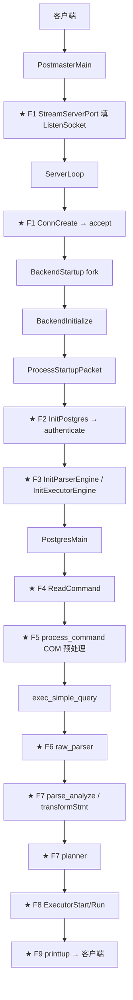
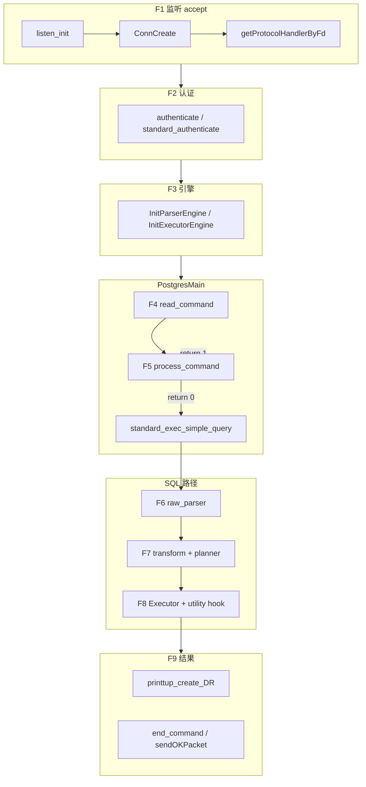

# OpenHalo 如何在 PG 内核上兼容 MySQL

> **文档版本**：2026-07-02（信息流主线重写）  
> **对照基线**：PostgreSQL 14.18（`postgresql-14.18`）  
> **OpenHalo 源码**：`openHalo-1.0-beta1`  
> **验证方法**：`diff -rq`（618 项）+ Codegraph MCP + `diff -u` 行级核对  
> **关联权威 diff**：[openhalo-pg14-increment-analysis.md](openhalo-pg14-increment-analysis.md)  
> **阅读对象**：有 C/C++ 背景、希望沿「一条 SQL 的生命周期」理解 OpenHalo 改动的开发者

---

## 元信息

| 项 | 值 |
|----|-----|
| diff 总项 | **618**（differ 414 / 仅 beta1 76 / 仅 PG14 128） |
| 核心增量目录 | `adapter/`、`parser/mysql/`、`commands/mysql/`、`tcop/mysql/`、`contrib/aux_mysql/`、`utils/ddsm/mysm/` |
| 信息流分叉点 | **F1–F9**（监听 → 认证 → 引擎 → 读命令 → COM → 解析 → 规划 → 执行 → 回包） |
| 三层引擎 | Parser / Planner / Executor `*Routine`，按 `database_compat_mode` + `T_MySQLProtocol` 双判据分发 |
| 协议抽象 | `ProtocolInterface` 虚表贯穿连接生命周期 |
| 移植对照 | PG16 见 [pg16-mysql-port-execution-plan.md](pg16-mysql-port-execution-plan.md)；UDB-TX 见 [pg16-mysql-baseline-plan.md](pg16-mysql-baseline-plan.md) |

**最小可用配置**

```ini
database_compat_mode = mysql
mysql.listener_on = on
mysql.port = 3306
```

| 要点 | 证据 |
|------|------|
| 双协议并存 | PG 端口仍走 `standard_protocol_handler`（`postmaster2.c:52`） |
| 缺一不可 | `database_compat_mode=postgresql` 时 `getSecondProtocolHandler` **FATAL**（`postmaster2.c:201–203`） |
| aux_mysql | 需 `CREATE EXTENSION aux_mysql;`，非 initdb 自动 |

### 九个分叉点一览

| 分叉 | 阶段 | 判据（何时走 MySQL 路径） | PG 路径 | MySQL 路径 |
|------|------|---------------------------|---------|-----------|
| **F1** | 监听与 accept | `serverFd` → `ListenHandler[i]` | `standard_protocol_handler` | `protocolHandler`（`T_MySQLProtocol`） |
| **F2** | Backend 启动与认证 | `protocol_handler->authenticate` | `PerformAuthentication`（startup 包） | `authenticate`（握手 + `mysCheckAuth`） |
| **F3** | 引擎初始化 | `database_compat_mode=mysql` **且** `nodeTag==T_MySQLProtocol` | `GetStandard*Engine` | `GetMysParserEngine` + `GetMysExecutorEngine` |
| **F4** | 命令循环读入 | `protocol_handler->read_command` | `SocketBackend`（PG 消息帧） | `readCommand`（COM 首字节） |
| **F5** | COM 预处理 | `T_MySQLProtocol` 且 `process_command` 返回 1 | 无（回调为 NULL） | `processCommand` 直接回包并 `continue` |
| **F6** | SQL 解析 | `parserengine->raw_parser` | `standard_raw_parser` → `gram.y` | `mys_raw_parser` → `mys_gram.y` |
| **F7** | 语义分析与规划 | `parserengine->transformStmt` / `plannerengine` | `standard_transformStmt` / 标准 planner | `mys_transformStmt` / **仍标准** planner |
| **F8** | 执行 | `executorengine` + `ProcessUtility_hook` | 标准 Executor | `mys_Executor*` + `mys_standard_ProcessUtility` |
| **F9** | 结果返回 | `printtup` / `CommandComplete` | libpq 行协议 | `printTup*` / `sendOKPacket` |

---

## 0. PG 原版信息流（对照基准）

PostgreSQL 14 处理一条客户端 SQL 的**时间顺序**如下。OpenHalo 在标有 **★（F1–F9）** 的环节插入分叉（含义见上文「九个分叉点一览」），其余大量复用 PG 存储、事务、锁、WAL。



| 阶段 | PG14 关键符号 | 文件 |
|------|--------------|------|
| 监听 | `StreamServerPort` | `postmaster.c` / `pqcomm.c` |
| accept | `ConnCreate` → `StreamConnection` | `postmaster.c` |
| 启动包 | `ProcessStartupPacket` | `postmaster.c` `BackendInitialize` |
| 认证 | `PerformAuthentication` | `postinit.c` |
| 主循环 | `PostgresMain` | `postgres.c` |
| 读命令 | `ReadCommand` → `SocketBackend` | `postgres.c` |
| 执行 SQL | `exec_simple_query` | `postgres.c` |
| 解析 | `raw_parser` → `base_yyparse` | `parser.c` / `gram.y` |
| 回包 | `printtup` / `EndCommand` | `printtup.c` / `postgres.c` |

**OpenHalo 设计原则**：MySQL 路径**不替代** `PostgresMain` 主循环；`mainFunc` 内部仍调用 `PostgresMain`（`adapter.c:805–807`）。差异通过 `ProtocolInterface` 虚表与引擎 `*Routine` 在 **★ F1–F9** 注入（上图各节点标注；§1–§9 逐点展开）。

---

## 1. 监听与 accept（分叉点 F1）

### 1.1 PG14 在此做什么

`PostmasterMain` 调用 `StreamServerPort`，将监听 fd 写入全局 `ListenSocket[]`。`ServerLoop` 在 accept 后调用 `ConnCreate(serverFd)`，内部直接 `StreamConnection(serverFd, port)` 完成 PG 线协议 accept。

### 1.2 分叉判据

**`serverFd` 在 `ListenSocket[]` 中的槽位 → `ListenHandler[listen_index]`**。PG 端口登记时绑定 `standard_protocol_handler`；MySQL 端口登记时绑定 `getMysProtocolHandler()` 返回的 `protocolHandler`。

### 1.3 OpenHalo 侵入（嵌入本阶段）

| 手法 | 在哪里 | 做了什么 |
|------|--------|----------|
| 并行数组 | `postmaster2.c:51` | `ListenHandler[MAXLISTEN]` 与 `ListenSocket[]` 一一对应 |
| PG 端口登记 | `pqcomm.c:587` | `StreamServerPort` 末尾 `setStandardProtocolSocket(fd)` 替代直接写 `ListenSocket` |
| MySQL 第二监听 | `postmaster.c:1312–1319` | GUC `halo_mysql_listener_on` → `secondProtocolHandler->listen_init()` |
| accept 分发 | `postmaster.c:2588–2591` | `protocol_handler->accept` 替代硬编码 `StreamConnection` |
| include 编入 | `postmaster.c` 末尾 | `#include "postmaster2.c"` |
| Port 扩展 | `libpq-be.h:226` | `Port.protocol_handler` 指针 |

**GUC 门控**：仅当 `mysql.listener_on=on` **且** `database_compat_mode=mysql` 时注册第二协议 handler；否则 `getSecondProtocolHandler` FATAL。

```194:208:openHalo-1.0-beta1/src/backend/postmaster/postmaster2.c
const ProtocolInterface *
getSecondProtocolHandler(void)
{
    ProtocolInterface *handler = NULL;
    
    switch (database_compat_mode)
    {
        case POSTGRESQL_COMPAT_MODE:
            ereport(FATAL,
					    (errmsg("second listener only works for MySQL mode")));
			break;
		case MYSQL_COMPAT_MODE:
            {
                handler = getMysProtocolHandler();
                break;
            }
```

```152:166:openHalo-1.0-beta1/src/backend/postmaster/postmaster2.c
const ProtocolInterface *
getProtocolHandlerByFd(int serverFd)
{
    int listen_index = 0;

    for (; listen_index < MAXLISTEN; listen_index ++)
    {
        if (ListenSocket[listen_index] == serverFd)
            break;
    }

    Assert(listen_index < MAXLISTEN);

    return ListenHandler[listen_index];
}
```

```2575:2600:openHalo-1.0-beta1/src/backend/postmaster/postmaster.c
ConnCreate(int serverFd)
{
	Port	   *port;
	// ...
	port->protocol_handler = getProtocolHandlerByFd(serverFd);
	Assert(port->protocol_handler != NULL);

	if (port->protocol_handler->accept(serverFd, port) != STATUS_OK)
	{
		// ...
	}
	return port;
}
```

**MySQL handler 实例**（`adapter.c:464–484`）：`.listen_init = initListen`、`.accept = acceptConn`、`.type = T_MySQLProtocol`。

**PG 标准 handler 包装**（`postmaster2.c:52–75`）：把原 `StreamConnection` / `pq_init` / `ProcessStartupPacket` / `PostgresMain` 映射为 `standard_*` 回调；`.process_command = NULL`（F5 仅 MySQL 有）。

> **时序**：`accept` 在 postmaster、**fork 之前**完成；`init`/`start`/`authenticate` 在子进程（F2）。

证据：`diff -u postgresql-14.18/src/backend/postmaster/postmaster.c openHalo-1.0-beta1/src/backend/postmaster/postmaster.c`；`diff -u postgresql-14.18/src/backend/libpq/pqcomm.c openHalo-1.0-beta1/src/backend/libpq/pqcomm.c`。

---

## 2. Backend 启动与认证（分叉点 F2）

### 2.1 PG14 在此做什么

fork 后 `BackendInitialize` 调用 `pq_init()`、`ProcessStartupPacket` 读取 startup 消息；`InitPostgres` 调用 `PerformAuthentication` 完成 md5/scram 等 PG 认证。

### 2.2 分叉判据

**`port->protocol_handler` 虚表各阶段回调**。判据在 F1 已绑定：`standard_protocol_handler` vs `protocolHandler`（`nodeTag == T_MySQLProtocol`）。

### 2.3 OpenHalo 侵入（嵌入本阶段）

| 阶段 | PG14 | beta1 分发点 | MySQL 实现 |
|------|------|-------------|-----------|
| 连接初始化 | `pq_init()` | `postmaster.c:4418` `protocol_handler->init()` | `initServer` |
| 启动包 | `ProcessStartupPacket` | `postmaster.c:4506` `protocol_handler->start()` | `startServer`（MySQL 无 PG startup 包） |
| 主入口 | `PostgresMain(...)` | `postmaster.c:4577–4580` `protocol_handler->mainfunc` | `mainFunc` → 仍调 `PostgresMain` |
| 认证 | `PerformAuthentication` | `postinit.c:799` | `authenticate` |

```4418:4418:openHalo-1.0-beta1/src/backend/postmaster/postmaster.c
		port->protocol_handler->init();
```

```4506:4506:openHalo-1.0-beta1/src/backend/postmaster/postmaster.c
		status = port->protocol_handler->start(port);
```

```4577:4580:openHalo-1.0-beta1/src/backend/postmaster/postmaster.c
		if (port->protocol_handler->mainfunc)
			port->protocol_handler->mainfunc(port, ac, av);
		else
			PostgresMain(ac, av, port->database_name, port->user_name);
```

```799:799:openHalo-1.0-beta1/src/backend/utils/init/postinit.c
		MyProcPort->protocol_handler->authenticate(MyProcPort, &username);
```

**MySQL 认证流程**（`adapter.c:690–802`）：

1. `assembleHandshakePacketPayload` + `netTransceiver->writePacketHeaderPayloadFlush` 发握手
2. `readPayloadForLogon` / `parseHandshakeRespPacketPayload` 解析用户、库、认证数据
3. `mysCheckAuth`（`userLogonAuth.c:275`）校验 `mysql_native_password`
4. 设置 `search_path` 为 `dbname, mysql, pg_catalog, ...`（`:777–783`）
5. `SetConfigOption("standard_parserengine_auxiliary", "off", ...)`（`:794`）
6. 初始化预编译/类型哈希表（`:796–799`）

```689:807:openHalo-1.0-beta1/src/backend/adapter/mysql/adapter.c
static void
authenticate(Port *port, const char **username)
{
    // ... 握手、解析、mysCheckAuth ...
    SetConfigOption("standard_parserengine_auxiliary", "off", PGC_USERSET, PGC_S_SESSION);
    initHaloMySqlDataTypesHashTable();
    initPreStmtInfoes();
    // ...
    ClientAuthInProgress = false;
}

static void
mainFunc(Port *port, int argc, char *argv[])
{
    PostgresMain(argc, argv, port->database_name, port->user_name);
}
```

**postinit 额外侵入**：`postinit.c` 末尾 `#include "postinit2.c"` 提供 `standard_authenticate` 包装 `PerformAuthentication`；MySQL 协议下 `in_dbname` 映射为 `"halo0root"`（`:802–810`），认证后按 schema 存在性发 OK/Error 包（`:1074–1106`）。

证据：`diff -u postgresql-14.18/src/backend/utils/init/postinit.c openHalo-1.0-beta1/src/backend/utils/init/postinit.c`。

---

## 3. 引擎初始化（分叉点 F3）

### 3.1 PG14 在此做什么

PG14 无「引擎」概念：`raw_parser` 直接调 `gram.y`；Executor / Planner 为全局标准实现。

### 3.2 分叉判据

**`database_compat_mode == MYSQL_COMPAT_MODE` 且 `nodeTag(MyProcPort->protocol_handler) == T_MySQLProtocol`**。  
仅设 `database_compat_mode=mysql` 但走 5432 PG 端口时，仍用标准 Parser/Executor（便于 psql 管理）。

### 3.3 OpenHalo 侵入（嵌入本阶段）

`InitPostgres` 在 `InitializeSession()` 之后依次调用（`postinit.c:1152–1165`）：

```1152:1165:openHalo-1.0-beta1/src/backend/utils/init/postinit.c
	/* Initialize Parser Engine */
	InitParserEngine();

	/* Initialize Planner Engine */
	InitPlannerEngine();

	/* Initialize Exector Engine */
	InitExecutorEngine();

	/* Initialize ADT Extension */
	InitADTExt();

	/* Initialize fmgr extension */
	InitFmgrExtension();
```

**Parser**（`parsereng.c:37–63`）：

```37:63:openHalo-1.0-beta1/src/backend/parser/parsereng.c
void
InitParserEngine(void)
{
	switch (database_compat_mode)
	{
		case POSTGRESQL_COMPAT_MODE:
			parserengine = GetStandardParserEngine();
			break;
		case MYSQL_COMPAT_MODE:
            if ((MyProcPort != NULL) && 
                (nodeTag(MyProcPort->protocol_handler) == T_MySQLProtocol))
            {
                parserengine = GetMysParserEngine();
            }
            else
            {
                parserengine = GetStandardParserEngine();
            }
			break;
		default:
			parserengine = GetStandardParserEngine();
			break;
	}
}
```

**Executor**（`executor_engine.c:39–76`）：MySQL 连接额外设置 `ProcessUtility_hook = mys_standard_ProcessUtility`。

```47:58:openHalo-1.0-beta1/src/backend/executor/executor_engine.c
		case MYSQL_COMPAT_MODE:
            
            if ((MyProcPort != NULL) && 
                (nodeTag(MyProcPort->protocol_handler) == T_MySQLProtocol))
            {
                executorengine = GetMysExecutorEngine();
                ProcessUtility_hook = mys_standard_ProcessUtility;
            }
            else
            {
                executorengine = GetStandardExecutorEngine();
            }
```

**Planner**（`planner_engine.c:36–49`）：MySQL 协议连接**当前仍用** `GetStandardPlannerEngine()`——规划未分叉。

| 引擎 | 虚表 | MySQL 连接 | PG 端口 / 默认 |
|------|------|-----------|---------------|
| Parser | `ParserRoutine` | `GetMysParserEngine` | `GetStandardParserEngine` |
| Planner | `PlannerRoutine` | `GetStandardPlannerEngine` | 同左 |
| Executor | `ExecutorRoutine` | `GetMysExecutorEngine` + utility hook | `GetStandardExecutorEngine` |

GUC 变量定义：`parsereng.c:24–25`（`database_compat_mode`、`standard_parserengine_auxiliary`）。

---

## 4. 命令循环入口（分叉点 F4）

### 4.1 PG14 在此做什么

`PostgresMain` 主循环调用 `ReadCommand`，远程连接走 `SocketBackend` 读取 PG 协议消息（`Q`/`P`/`B`/`E` 等），首字节为 message type。

### 4.2 分叉判据

**`MyProcPort->protocol_handler->read_command(inBuf)`**。PG 路径：`standard_read_command` → `SocketBackend`（`postgres2.c:52–56`）；MySQL 路径：`readCommand` 读 COM 包首字节。

### 4.3 OpenHalo 侵入（嵌入本阶段）

```506:518:openHalo-1.0-beta1/src/backend/tcop/postgres.c
static int
ReadCommand(StringInfo inBuf)
{
	int			result;

	if (whereToSendOutput == DestRemote)
		
		result = MyProcPort->protocol_handler->read_command(inBuf);
		
	else
		result = InteractiveBackend(inBuf);
	return result;
}
```

```52:56:openHalo-1.0-beta1/src/backend/tcop/postgres2.c
int
standard_read_command(StringInfo inBuf)
{
	return SocketBackend(inBuf);
}
```

**MySQL `readCommand`**（`adapter.c:851–867`）：`netTransceiver->readPayload` 读整包，返回 COM 类型字节（如 `MYS_REQ_QUERY`=3）。

```851:867:openHalo-1.0-beta1/src/backend/adapter/mysql/adapter.c
static int
readCommand(StringInfo inBuf)
{
    int sqlType;

    inBuf->offset = 128;
    if (netTransceiver->readPayload(inBuf))
    {
        sqlType = inBuf->data[inBuf->offset];
        inBuf->offset++;
    }
    else
    {
        elog(ERROR, "Client has disconnect when read.");
        proc_exit(1);
    }
    return sqlType;
}
```

**tcop include 链**：`postgres.c` 末尾 `#include "postgres2.c"`；原 `exec_simple_query` 等改名为 `standard_exec_*`，供薄包装保留 PG 语义。

**主循环其它虚表钩子**（同属协议层，紧随 F4）：

| 钩子 | 位置 | 作用 |
|------|------|------|
| `send_cancel_key` | `postgres.c:4383+` | 取消键下发 |
| `send_ready_for_query` | `postgres.c:4679+` | 就绪状态 |
| `comm_reset` / `is_reading_msg` | `postgres.c:4492+` / `:4556+` | 错误恢复与失步检测 |

证据：`diff -u postgresql-14.18/src/backend/tcop/postgres.c openHalo-1.0-beta1/src/backend/tcop/postgres.c`。

---

## 5. COM 预处理（分叉点 F5）

### 5.1 PG14 在此做什么

**无此阶段**。`ReadCommand` 返回后直接根据 message type 进入 `exec_simple_query` / extended query 等路径。

### 5.2 分叉判据

**`nodeTag(protocol_handler) == T_MySQLProtocol` 且 `process_command` 非 NULL**；若返回 `1`，主循环 `continue`，**跳过后续 SQL 解析/执行路径**。

### 5.3 OpenHalo 侵入（嵌入本阶段）

```4744:4756:openHalo-1.0-beta1/src/backend/tcop/postgres.c
		if (firstchar != EOF && 
            MyProcPort && MyProcPort->protocol_handler->process_command)
        {

            if (nodeTag(MyProcPort->protocol_handler) == T_MySQLProtocol)
            {
                int process_ret = MyProcPort->protocol_handler->process_command(&firstchar, &input_message);
                if (process_ret == 1)
                {
                    send_ready_for_query = true;
                    continue;
                }
            }
```

`standard_protocol_handler.process_command = NULL`（`postmaster2.c:73`），PG 路径永不进入此分支。

**`processCommand` 职责**（`adapter.c:1265+`）：

| COM | 常量值 | 行为 |
|-----|--------|------|
| `MYS_REQ_QUIT` | 1 | 断开 |
| `MYS_REQ_QUERY` | 3 | `rectifyCommand`、多语句分割、部分 SHOW 模拟 |
| `MYS_REQ_PREPARE` | 22 | 预编译改写 |
| `MYS_REQ_EXECUTE` | 23 | `rewriteExtendExeStmt` → 转 `HALO_REQ_QUERY` |

返回 `0`：COM 已改写 `inBuf`，继续走 `standard_exec_simple_query`；返回 `1`：已在 adapter 内发 OK/Error 包，主循环跳过。

COM 常量定义：`adapter.c:106–119`。

---

## 6. SQL 解析（分叉点 F6）

### 6.1 PG14 在此做什么

`exec_simple_query` → `raw_parser` → `base_yyparse`（`gram.y`）→ 原始 parse tree 列表。

### 6.2 分叉判据

**`parserengine->raw_parser`**，由 F3 的 `InitParserEngine` 选定。MySQL 连接：`mys_raw_parser` → `mys_yyparse`（`mys_gram.y`，约 24199 行）。

### 6.3 OpenHalo 侵入（嵌入本阶段）

```52:85:openHalo-1.0-beta1/src/backend/parser/parser.c
List *
raw_parser(const char *str, RawParseMode mode)
{
	List *raw_parsetree = NIL;
	MemoryContext	oldctx = CurrentMemoryContext;

	if (parserengine == NULL)
		parserengine = GetStandardParserEngine();

	Assert(parserengine != NULL);
	Assert(parserengine->raw_parser != NULL);

	PG_TRY();
	{
		raw_parsetree = parserengine->raw_parser(str, mode);
	}
	PG_CATCH();
	{
		if (raw_parsetree == NIL && parserengine->is_standard_parser == false
			&& (standard_parserengine_auxiliary == STANDARDARD_PARSERENGINE_AUXILIARY_ON 
				&& parserengine->need_standard_parser == true))
		{
			MemoryContextSwitchTo(oldctx);
			FlushErrorState();
			MemoryContextSwitchTo(oldctx);

			raw_parsetree = GetStandardParserEngine()->raw_parser(str, mode);
		}
		else
			PG_RE_THROW();
	}
	PG_END_TRY();
	return raw_parsetree;
}
```

**回退机制**：MySQL parser 抛错且 `standard_parserengine_auxiliary=on`（默认）时，捕获异常并回退 PG `gram.y`。MySQL 认证成功后会将其设为 `off`（`adapter.c:794`）。

**parser/mysql/ 目录（纯新增）**

| 文件 | 行数约 | 职责 |
|------|--------|------|
| `mys_parser.c` | 556 | `mys_parser_engine` 工厂 |
| `mys_gram.y` | 24199 | MySQL Bison 语法 |
| `mys_scan.l` | 1582 | MySQL Flex 词法 |
| `mys_analyze.c` | 3493 | `mys_transformStmt` |
| `mys_parse_utilcmd.c` | 5538 | utility 语句 transform |
| `parser_ep.c` | 808 | 全局 `transform*` 分发 |

证据：`diff -u postgresql-14.18/src/backend/parser/parser.c openHalo-1.0-beta1/src/backend/parser/parser.c`。

---

## 7. 语义分析与规划（分叉点 F7）

### 7.1 PG14 在此做什么

`parse_analyze` → `transformStmt`（`analyze.c`）将 raw tree 转为 `Query`；`planner()` 生成 `PlannedStmt`。

### 7.2 分叉判据

- **Transform**：`parserengine->transformStmt`（`parser_ep.c:69–82`）
- **Planner**：`plannerengine`——MySQL 连接**仍走标准**（`planner_engine.c:45–48`）

### 7.3 OpenHalo 侵入（嵌入本阶段）

```69:82:openHalo-1.0-beta1/src/backend/parser/parser_ep.c
Query *
transformStmt(ParseState *pstate, Node *parseTree)
{
	Query	   *query;

	Assert(parserengine != NULL);

	if (parserengine->transformStmt)
		query = parserengine->transformStmt(pstate, parseTree);
	else
		query = standard_transformStmt(pstate, parseTree);

	return query;
}
```

MySQL 语义分析产出仍是 PG `Query` 树，但可含扩展 NodeTag（见 §12）。utility 语句由 `mys_parse_utilcmd.c` / `mys_utility.c` 处理 `T_MysVariableSetStmt` 等。

**规划器**：`InitPlannerEngine` 在 MySQL 协议下显式选择 `GetStandardPlannerEngine()`——复杂 MySQL hint/优化未单独实现。

**catalog 可见性**（与 transform 交织）：`namespace2.c:72–106` 在 MySQL 协议下将环境命名空间 OID 映射为 `mysql` schema，影响 `search_path` 与元数据查询。

```87:95:openHalo-1.0-beta1/src/backend/catalog/namespace2.c
            if ((MyProcPort != NULL) && 
                (nodeTag(MyProcPort->protocol_handler) == T_MySQLProtocol))
            {
                oid = get_namespace_oid("mysql", true);
            }
            else
            {
                oid = PG_CATALOG_NAMESPACE;
            }
```

---

## 8. 执行（分叉点 F8）

### 8.1 PG14 在此做什么

`ExecutorStart` / `ExecutorRun` 执行计划树；DDL/utility 走 `ProcessUtility`。

### 8.2 分叉判据

- **DML**：`executorengine` 虚表（F3 设置）→ `mys_ExecutorStart` / `mys_ExecutorRun`（`mys_executor.c:30–40`）
- **DDL/utility**：`ProcessUtility_hook = mys_standard_ProcessUtility`（`mys_utility.c:74`）

### 8.3 OpenHalo 侵入（嵌入本阶段）

```30:40:openHalo-1.0-beta1/src/backend/executor/mys_executor.c
static const ExecutorRoutine mys_executor_engine = {
    .type = T_ExecutorRoutine,

    .ExecutorStart = mys_ExecutorStart,
    .ExecutorRun = mys_ExecutorRun,
    .ExecInitNode = mys_ExecInitNode,
    .ExecEndNode = mys_ExecEndNode,
    .ExecReScan = mys_ExecReScan,

    .partition = &mys_partition_engine
};
```

| 模块 | 文件 | 职责 |
|------|------|------|
| DML 语义 | `mys_nodeModifyTable.c`（3958 行） | `INSERT IGNORE`、`REPLACE`、`ON DUPLICATE KEY` |
| DDL | `commands/mysql/mys_tablecmds.c`（17019 行） | `CREATE TABLE` MySQL 选项等 |
| Utility | `tcop/mysql/mys_utility.c` | `USE`、`SHOW`、变量设置 |
| 分区 | `mys_execPartition.c` | MySQL 分区路由 |

**postgres.c 执行期修补**（非引擎虚表，但与 MySQL 语义相关）：

| 行为 | 位置 |
|------|------|
| 空 parsetree 发 `sendOKPacket` | `postgres.c:1388–1398` |
| `end_command` 虚表 | `postgres.c:1364–1367` |
| 多语句 `moreResultsFlag` | `postgres.c` diff 区段 |
| `stmtLen`、`isIgnoreStmt` 全局 | `postgres.c:108–109` |

```1388:1398:openHalo-1.0-beta1/src/backend/tcop/postgres.c
	if (!parsetree_list)
    {
        if ((MyProcPort != NULL) && 
            (nodeTag(MyProcPort->protocol_handler) == T_MySQLProtocol))
        {
            sendOKPacket();
        }
        else 
        {
            NullCommand(dest);
        }
    }
```

---

## 9. 结果返回（分叉点 F9）

### 9.1 PG14 在此做什么

`printtup_create_DR` 创建 `DestReceiver`，`receiveSlot` 编码 PG 行协议；命令结束 `EndCommand` 发 `CommandComplete`。

### 9.2 分叉判据

- **行数据**：`protocol_handler->printtup` 非 NULL 时挂接 MySQL 回调（`printtup.c:80–86`）
- **命令结束**：`protocol_handler->end_command`（`postgres.c:1364`）→ MySQL `sendOKPacket` / Error 包

### 9.3 OpenHalo 侵入（嵌入本阶段）

```74:95:openHalo-1.0-beta1/src/backend/access/common/printtup.c
DestReceiver *
printtup_create_DR(CommandDest dest)
{
	DR_printtup *self = (DR_printtup *) palloc0(sizeof(DR_printtup));

	
	if (MyProcPort && MyProcPort->protocol_handler->printtup)
	{
		self->pub.receiveSlot = MyProcPort->protocol_handler->printtup;
		self->pub.rStartup = MyProcPort->protocol_handler->printtup_startup;
		self->pub.rShutdown = MyProcPort->protocol_handler->printtup_shutdown;
		self->pub.rDestroy = MyProcPort->protocol_handler->printtup_destroy;
		self->pub.mydest = dest;
	}
	else
	{
		self->pub.receiveSlot = printtup;
		// ...
	}
```

**adapter.c 结果相关符号**

| 符号 | 行号 | 职责 |
|------|------|------|
| `sendOKPacket` | 496 | OK 包 |
| `sendErrorPacket` | 510 | Error 包 |
| `printTup` | 1084 | 分发 Binary/Text/SystemVars |
| `printTupStartup` | 1105 | Field 列定义包 |
| `printTupBinary` | 2811 | 预处理二进制结果 |
| `printTupText` | 3381 | 文本结果集行 |

`dest.h/c` 改动：`DestReceiver` 回调增加 `CommandTag` 参数（区分 INSERT `last_insert_id`）。

证据：`diff -u postgresql-14.18/src/backend/access/common/printtup.c openHalo-1.0-beta1/src/backend/access/common/printtup.c`。

---

## 10. 函数/类型层（并行支撑，非主路径分叉）

函数/类型兼容**不在** F1–F9 主时间线上单独分叉，而是在 F3 引擎选定 MySQL 模式后，通过 `search_path`（含 `mysql` schema）与 `CREATE EXTENSION` 生效。

### 10.1 contrib/aux_mysql

- **纯新增**：`contrib/aux_mysql/`（control、sql 迁移、`mysql.conf`）
- Schema：`mysql`、`mys_sys`、`performance_schema`、`mys_informa_schema` 等
- Domain 类型：`tinyint`、`datetime`、`varchar` 等
- **1891** 条 `CREATE FUNCTION`（`grep -hiE '^create.*function' contrib/aux_mysql/*.sql`）；其中 `mysql.*` **1881** 条
- 安装：`CREATE EXTENSION aux_mysql;`（非 initdb 自动）

### 10.2 内核 C 实现

| 目录 | 文件数 | 职责 |
|------|--------|------|
| `utils/ddsm/mysm/` | 13×.c | 字符串/数学/日期等内建函数 |
| `utils/adt/mysql/` | 6×.c | MySQL 类型 I/O、cast |
| `utils/adt/*.c` | 15 文件含分支 | `T_MySQLProtocol` / `database_compat_mode` 输出格式 |

验证：`rg -l 'T_MySQLProtocol|database_compat_mode' src/backend/utils/adt --glob '*.c' | wc -l` → **15**。

### 10.3 何时生效

1. F2 认证后 `search_path` 含 `mysql`（`adapter.c:777–783`）
2. F3 `InitADTExt` / `InitFmgrExtension`（`postinit.c:1161–1165`）
3. 用户执行 `CREATE EXTENSION aux_mysql` 后 catalog 中有 `mysql.*` 函数

---

## 11. GUC 与配置（贯穿各分叉的门控表）

| GUC 名 | C 变量 | 默认 | 级别 | 定义 | 主要消费者 / 分叉 |
|--------|--------|------|------|------|------------------|
| `database_compat_mode` | `database_compat_mode` | postgresql | POSTMASTER | `parsereng.c:24` | F1 `getSecondProtocolHandler`、F3 三引擎 |
| `mysql.listener_on` | `halo_mysql_listener_on` | false | POSTMASTER | `guc.c:613` | F1 `postmaster.c:1312` |
| `mysql.port` | `PostMySQLPortNumber` | 3306 | POSTMASTER | `postmaster.c:210` | F1 `initListen` |
| `mysql.halo_mysql_version` | `halo_mysql_version` | "5.7.32-log" | POSTMASTER | `adapter.c:142` | F2 握手、`version()` |
| `standard_parserengine_auxiliary` | `standard_parserengine_auxiliary` | on | USERSET | `parsereng.c:25` | F6 解析回退 `parser.c:71` |
| `mysql.max_allowed_packet` | `halo_mysql_max_allowed_packet` | 64MB | USERSET | `netTransceiver.c:59` | F4/F5 包大小 |
| `mysql.explicit_defaults_for_timestamp` | `halo_mysql_explicit_defaults_for_timestamp` | false | POSTMASTER | `adapter.c:144` | 时间戳语义 |
| `mysql.auto_rollback_tx_on_error` | `halo_mysql_auto_rollback_tx_on_error` | false | POSTMASTER | `adapter.c:145` | 事务错误行为 |
| `mysql.support_multiple_table_update` | `halo_mysql_support_multiple_table_update` | true | POSTMASTER | `adapter.c:146` | F7 多表 UPDATE |
| `mysql.column_name_case_control` | `halo_mysql_column_name_case_control` | 0 | POSTMASTER | `adapter.c:143` | 列名大小写 |
| `password_encryption` | — | — | — | `guc.c` | 扩展 `mysql_native_password`（F2） |

PG16 移植须将注册落 `guc_tables.c`（6 字段 `config_generic`），不可照搬 beta1 4 字段格式（见 [pg16-guc-three-way-comparison.md](pg16-guc-three-way-comparison.md)）。

---

## 12. Nodes / AST（解析层产物差异）

beta1 相对 PG14 在 `nodes.h` 末段追加 NodeTag（证据：`diff -u postgresql-14.18/src/include/nodes/nodes.h openHalo-1.0-beta1/src/include/nodes/nodes.h`）。

| 类别 | NodeTag | beta1 行号 | 用途 |
|------|---------|-----------|------|
| 引擎虚表 | `T_ParserRoutine` / `T_PlannerRoutine` / `T_ExecutorRoutine` | 534–536 | F3 `*Routine` 多态 |
| Merge（PG16 已有） | `T_MergeStmt` 等 4 个 | 538–541 | SQL MERGE |
| 协议 | `T_StandardProtocol` / `T_MySQLProtocol` / `T_TDSProtocol` | 544–546 | F1–F9 协议判据 |
| MySQL AST | `T_UserVarRef` 等 6 个 | 548–553 | `@var`、MySQL 特有语句 |

```544:553:openHalo-1.0-beta1/src/include/nodes/nodes.h
	T_StandardProtocol,
	T_MySQLProtocol,
	T_TDSProtocol,
    /* MySQL */
	T_UserVarRef,
	T_SysVarRef,
	T_ByteaString,
    T_MysVariableSetStmt,
    T_MysSelectIntoStmt,
	T_UserVarAssign
```

专用头文件：`include/nodes/mysql/mys_parsenodes.h`、`mys_execnodes.h`。枚举扩展：`CMD_MERGE`、`ONCONFLICT_REPLACE`（MySQL `REPLACE` / `ON DUPLICATE KEY`）。

PG16 移植：使用 `nodetags.h` + `gen_node_support.pl`；**禁止**照抄 beta1 追加段；**禁止**移植 `T_TDSProtocol`（见 [pg16-nodes-three-way-comparison.md](pg16-nodes-three-way-comparison.md)）。

---

## 13. 改动地图（精简表）

### 13.1 路径 × 分叉阶段 × 侵入手法

| 路径 | 分叉 | 纯新增/改 PG | 侵入手法 |
|------|------|-------------|----------|
| `postmaster2.c` | F1 | 纯新增 | 并行数组、`standard_protocol_handler` |
| `postmaster.c` | F1,F2 | 改 PG | GUC 双监听、`ConnCreate`/`Backend*` 虚表分发、`#include postmaster2.c` |
| `pqcomm.c` / `libpq-be.h` | F1 | 改 PG | `setStandardProtocolSocket`、`Port.protocol_handler` |
| `adapter/mysql/adapter.c` | F1–F5,F9 | 纯新增 | `protocolHandler` 虚表、认证、COM、回包 |
| `postinit.c` / `postinit2.c` | F2,F3 | 改 PG | `authenticate` 分发、三引擎初始化 |
| `postgres.c` / `postgres2.c` | F4,F5,F8,F9 | 改 PG + 新增 | `read_command`、`process_command`、`end_command` |
| `parsereng.c` / `parser.c` | F3,F6 | 改 PG | 引擎选择、`raw_parser` 分发与回退 |
| `parser/mysql/*` | F6,F7 | 纯新增 | `mys_gram.y`、`mys_analyze.c` |
| `planner_engine.c` | F7 | 纯新增 | 当前仍标准 planner |
| `executor_engine.c` / `mys_*.c` | F3,F8 | 改 PG + 新增 | Executor 虚表、utility hook |
| `commands/mysql/*` | F8 | 纯新增 | DDL/DML MySQL 语义 |
| `printtup.c` / `dest.c` | F9 | 改 PG | `printtup_create_DR` 虚表挂接 |
| `contrib/aux_mysql` | §10 | 纯新增 | SQL 层函数/类型注册 |
| `utils/ddsm/mysm/` | §10 | 纯新增 | 内建函数 C 实现 |

### 13.2 diff 统计

| 类别 | 数量 |
|------|------|
| `diff -rq` 总项 | **618** |
| 内容 differ | **414** |
| 仅 beta1 | **76** |
| 仅 PG14 | **128**（多为生成物） |

### 13.3 `src/backend` differ Top

| 目录 | differ 数 | 主要分叉 |
|------|-----------|----------|
| `utils/adt` | 19 | §10 |
| `parser` | 20 | F6,F7 |
| `commands` | 18 | F8 |
| `executor` | 16 | F8 |
| `catalog` | 15 | F7 |
| `libpq` | 6 | F1 |
| `postmaster` | 3 | F1,F2 |
| `tcop` | 5 | F4–F9 |

### 13.4 纯新增核心目录

```
openHalo-1.0-beta1/src/
├── backend/
│   ├── adapter/mysql/          # adapter.c 6552 行
│   ├── parser/mysql/           # mys_gram.y 24199 行
│   ├── executor/mys_*.c
│   ├── commands/mysql/         # mys_tablecmds.c 17019 行
│   ├── tcop/mysql/mys_utility.c
│   ├── optimizer/plan/planner_engine.c
│   ├── utils/ddsm/mysm/        # 13×.c
│   └── utils/adt/mysql/        # 6×.c
├── include/adapter/protocol_interface.h
└── contrib/aux_mysql/
```

---

## 14. 已知限制 / 核心 vs 噪声

### 14.1 已知限制

| 限制 | 说明 |
|------|------|
| 规划器未分叉 | F7 仍用 PG 标准 planner；部分 MySQL 优化/hint 未覆盖 |
| 双判据设计 | 仅 `database_compat_mode=mysql` 走 5432 仍为标准 parser，便于 psql 管理 |
| aux_mysql 非自动 | 须手动 `CREATE EXTENSION` |
| 大文件维护成本 | `mys_gram.y`、`mys_tablecmds.c` 逐规则覆盖，需按需查阅 |
| TDS 遗留 | `T_TDSProtocol` 分支存在，**禁止移植** |

### 14.2 核心 vs 噪声

| 分类 | 路径/项 | 说明 |
|------|---------|------|
| **MySQL 核心** | `adapter/`、`parser/mysql/`、`mys_*`、`contrib/aux_mysql`、`parsereng.c`、`executor_engine.c`、`protocol_interface.h`、`postmaster2.c` | F1–F9 必需 |
| **Halo 平台扩展** | `namespace2.c` 多模式映射、`pg_proc.c` 包模型、`storage/enc/encpage.c` | 与 MySQL 间接相关或无关 |
| **PG16 已有、beta1 勿重复** | `T_MergeStmt` 等（`nodes.h:538–541`） | PG16 上游已内置 Merge |
| **品牌/构建噪声** | `README`、logo、`COPYRIGHT`、contrib 测试小改、Only in PG14 的 `gram.c` 生成物 | 不代表功能删减 |

---

## 15. 参考资料

### 15.1 文档

| 文档 | 用途 |
|------|------|
| [openhalo-pg14-increment-analysis.md](openhalo-pg14-increment-analysis.md) | 618 diff 全文、符号索引 |
| [pg16-mysql-port-execution-plan.md](pg16-mysql-port-execution-plan.md) §1 | F1 移植：ConnCreate 分发、按步执行 |
| [pg16-guc-three-way-comparison.md](pg16-guc-three-way-comparison.md) | GUC 三向对比 |
| [pg16-nodes-three-way-comparison.md](pg16-nodes-three-way-comparison.md) | NodeTag 移植策略 |
| [mysql-protocol-port-plan.md](mysql-protocol-port-plan.md) | UDB-TX 协议 MR 清单 |

### 15.2 验证命令

```bash
# 全量路径清单（618 项）
diff -rq postgresql-14.18 openHalo-1.0-beta1 \
  --exclude='.codegraph' --exclude='.git' --exclude='.specstory'

# 行级核对示例（F1）
diff -u postgresql-14.18/src/backend/postmaster/postmaster.c \
        openHalo-1.0-beta1/src/backend/postmaster/postmaster.c

# aux_mysql 函数条数
grep -hiE '^create[[:space:]].*function' openHalo-1.0-beta1/contrib/aux_mysql/*.sql | wc -l
grep -hiE '^create[[:space:]].*function' openHalo-1.0-beta1/contrib/aux_mysql/*.sql \
  | grep -i 'mysql\.' | wc -l
```

### 15.3 端到端信息流总图（含分叉）



---

## 附录：旧版章节结构对照（本次重写删除/合并）

| 旧章节 | 处置 |
|--------|------|
| §1 结论摘要 | 合并入「元信息」+ 各 F 节叙述 |
| §2 架构总览 / 四层框架 | 合并入 §0 基准流 + §13 改动地图 |
| §3 协议层 | 拆入 §1 F1、§2 F2、§4 F4 |
| §4 双监听机制 | 并入 §1 F1 |
| **§5 对 PG 核心模块的侵入方式** | **删除独立章节**；侵入说明嵌入 §1–§9 各阶段 |
| §6 认证与握手 | 并入 §2 F2 |
| §7 解析层 | 并入 §6 F6、§7 F7 |
| §8 执行层 | 并入 §5 F5、§8 F8 |
| §9 结果层 | 并入 §9 F9 |
| §10 函数/类型层 | 保留为 §10（标注非主路径分叉） |
| §11 GUC | 保留为 §11 门控表 |
| §12 Nodes | 保留为 §12 |
| §13 SQL 兼容机制 | 拆入 §5–§8 各节 |
| §14 PG14 vs OpenHalo 对照 | 升格为 §0 基准 + 文首分叉一览表 |
| §15 改动规模 | 精简为 §13 |
