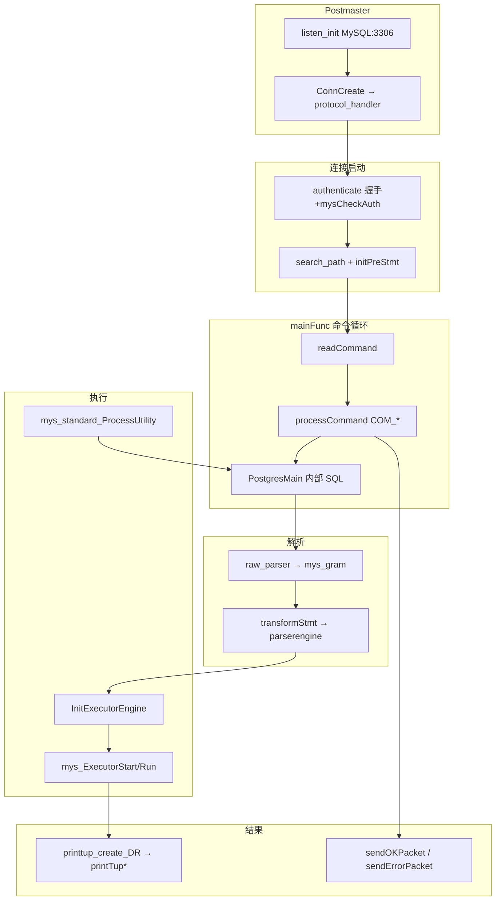
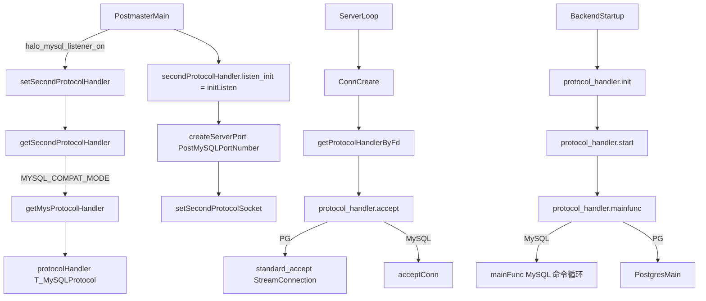
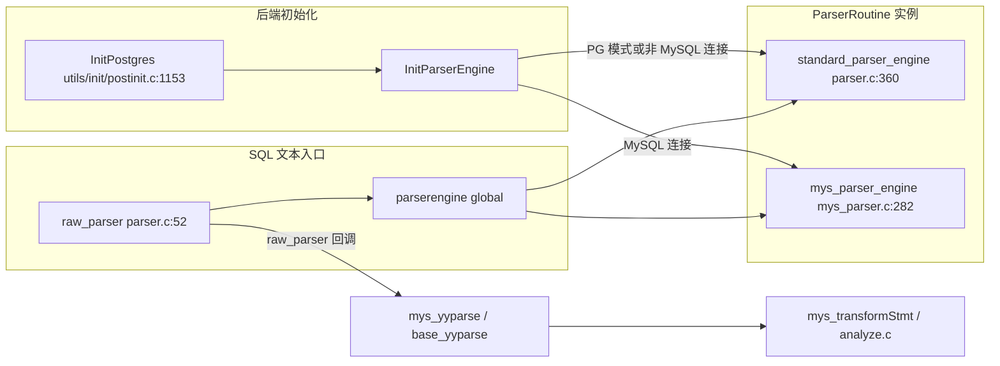
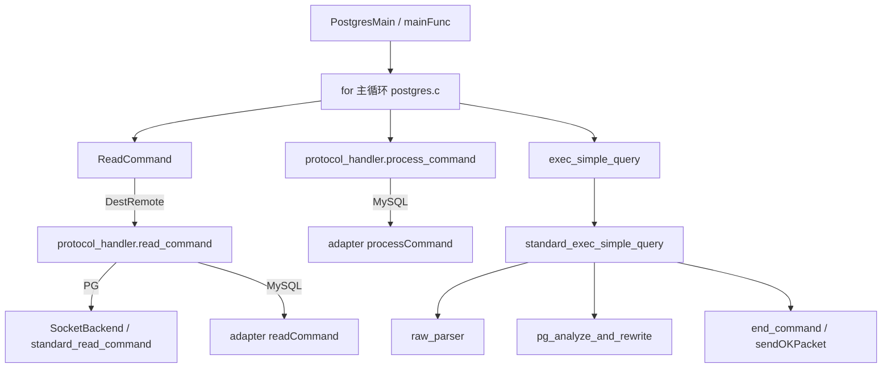
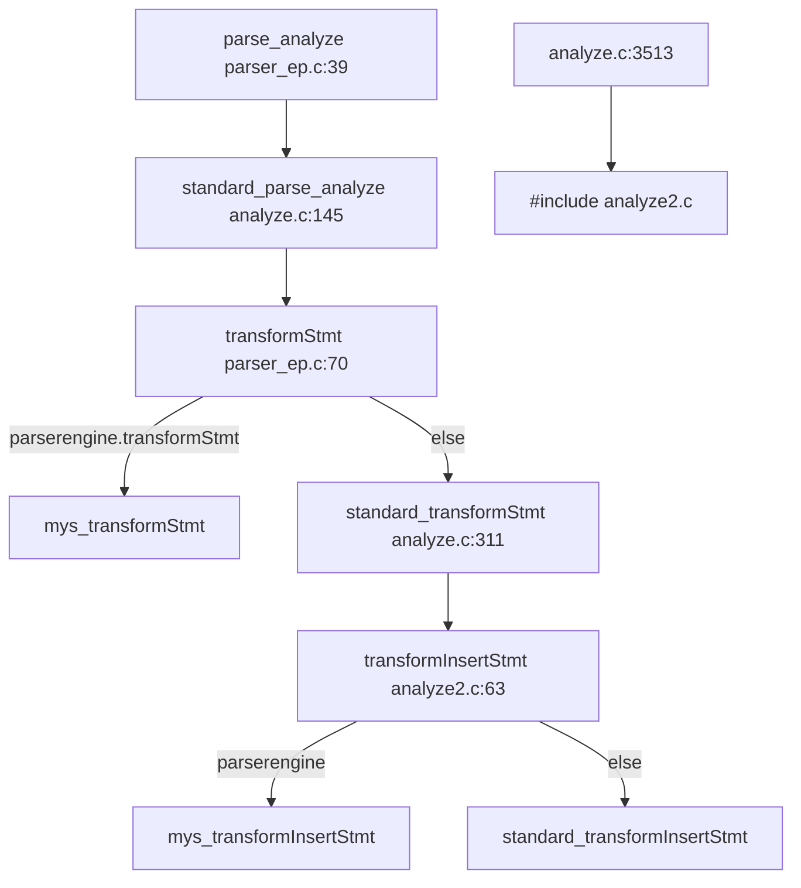
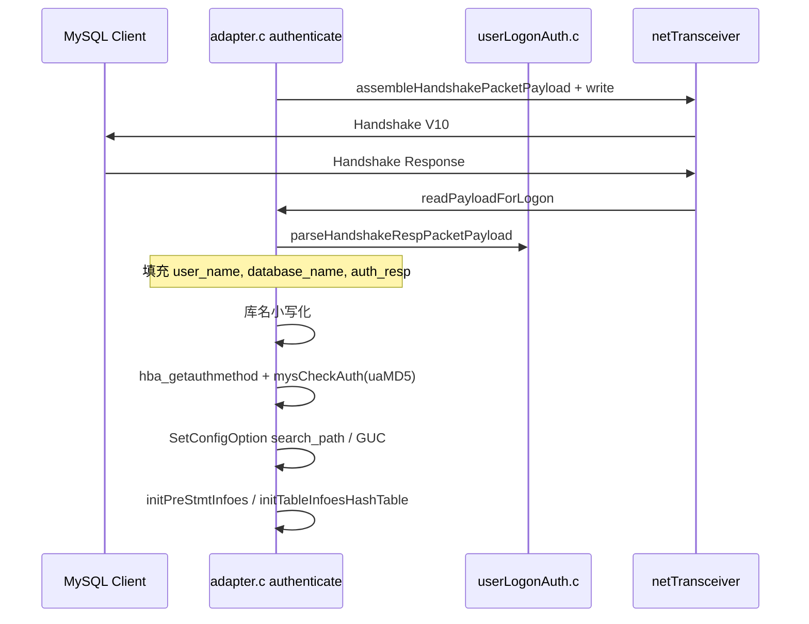
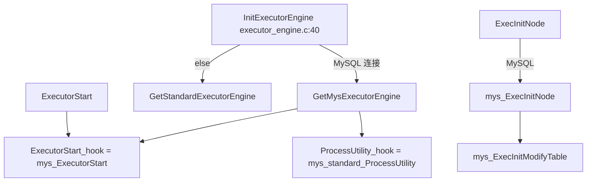
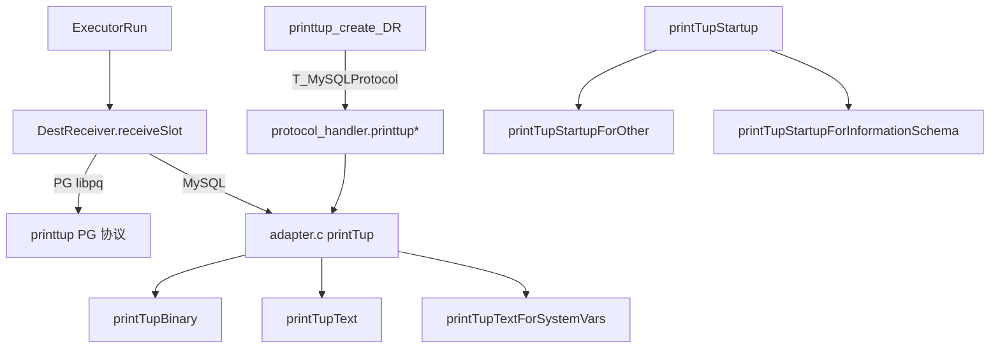
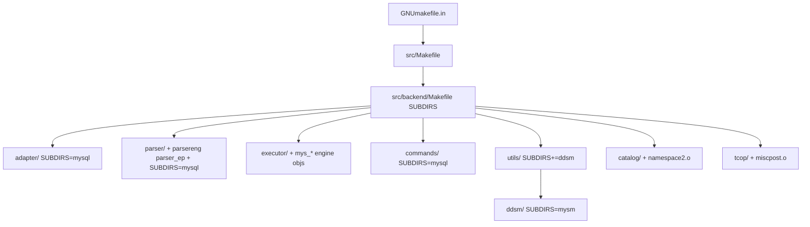

# OpenHalo 相对 PG 14.18 全量增量分析

> **分析完成**（第 6 轮收尾，2026-06-30）；基于 `diff -u` / `diff -rq`，非 AI 臆测。  
> 对照：`postgresql-14.18` ↔ `openHalo-1.0-beta1`

### 复核记录（2026-06-30）

**抽样验证**：`diff -rq` 618 项（differ 414 / only β1 76 / only PG14 128）、`src/backend` 子目录 differ 计数（§1 表）、协议链 `ConnCreate`→`getProtocolHandlerByFd`（`postmaster.c:2588`）、`InitParserEngine`/`InitExecutorEngine`/`InitPlannerEngine`（`utils/init/postinit.c:1153–1165`）、`adapter.c` 大函数行号（`mainFunc` 805、`readCommand` 852、`processCommand` 1265）、`protocolHandler` 464–486 — **与 beta1 一致**。

**修正**：`postinit.c` 路径统一为 `utils/init/postinit.c`；`parsereng.c` 64 行、`pgcomm2.h` 66 行、`planner_engine.c` 63 行（原 ±1 行）。

**补遗漏摘要**：`postinit2.c`/`elog2.c`/`trigger2.c` 纳入 §9.1 include 链；`storage/enc/encpage.c` 标为 Halo 存储扩展（非 MySQL 核心）。

**过时标注**：附录 B 部分行号为引用锚点，大文件漂移时以符号名为准。

---

## 0. Executive 摘要（终稿）

OpenHalo 在 PG 14.18 上实现 **MySQL 线协议 + 语法 + 执行语义** 的兼容，核心手法是：**协议虚表**（`ProtocolInterface`）贯穿连接生命周期；**三层引擎**（Parser / Planner / Executor `*Routine`）按 `database_compat_mode` + `T_MySQLProtocol` 分发；**大文件分叉 + include 补丁**（`mys_gram.y`、`mys_tablecmds.c`、`utility.c` include `mys_utility.c`）承载 MySQL 专有逻辑；**SQL 扩展 + 内核 C 函数**（`contrib/aux_mysql` + `ddsm/mysm`）提供类型与内建函数。

### 结论要点（5 条）

1. **协议入口**：`halo_mysql_listener_on` → 第二监听 → `ConnCreate` 按 socket 选 `protocol_handler` → MySQL 走 `authenticate` → `mainFunc`（内部进 `PostgresMain`）→ 主循环经 `read_command`/`process_command`/`printTup*`（PG 走标准 `standard_*` + libpq）。
2. **解析链**：`raw_parser` → `GetMysParserEngine` → `mys_gram.y`；`transformStmt` → `parserengine->transform*`（`analyze.c`/`parser_ep.c`）；`mys_utility.c` 处理 MySQL 工具语句。
3. **执行链**：`InitExecutorEngine` → `mys_executor_engine`（MySQL 连接）挂 `mys_ExecutorStart/Run`、`mys_ExecInitNode`；`ProcessUtility_hook = mys_standard_ProcessUtility`；DDL 主体在 `mys_tablecmds.c`。
4. **类型/函数**：`aux_mysql` 扩展注册 **mysql** 等 schema（**1828** 条 `CREATE FUNCTION` 声明，其中 `mysql.*` **1823**）；实现落在 `utils/ddsm/mysm/`（13×.c）与 `utils/adt/mysql/`（6×.c）；`utils/adt/*.c` 另有 **15** 文件含 `T_MySQLProtocol`/`database_compat_mode` 分支。
5. **catalog/可见性**：`namespace2.c` 将 MySQL 协议下 `search_path` 的「系统 schema」映射为 `mysql`；`pg_type.typaccess` / `pg_proc.proaccess` / `heap.relaccess` 为 Halo 包模型扩展（与 MySQL 间接相关）。

### 复核记录（2026-06-30）

**验证方法**：`diff -rq` / `diff -u`（`postgresql-14.18` ↔ `openHalo-1.0-beta1`）；Codegraph MCP（`projectPath=openHalo-1.0-beta1`）；`rg`/`grep` 行号与符号计数。

**抽样验证（≥15 处，结论与源码一致）**

| # | 断言 | 证据 |
|---|------|------|
| 1 | `diff -rq` 总项 **618** | `diff -rq … \| wc -l` → 618 |
| 2 | `utils/adt` differ **19** | 子目录 `diff -rq` 计数 |
| 3 | `halo_mysql_listener_on` → 第二监听 | `postmaster.c:1312–1319` `setSecondProtocolHandler` + `listen_init()` |
| 4 | `ConnCreate` → `getProtocolHandlerByFd` | `postmaster.c:2574–2588` |
| 5 | `getSecondProtocolHandler` → `getMysProtocolHandler` | `postmaster2.c:194–207` |
| 6 | `authenticate` 调 `mysCheckAuth` | `adapter.c:689–764` |
| 7 | `raw_parser` 经 `parserengine` 分发 | `parser.c:52–66` |
| 8 | `InitParserEngine` 按 `T_MySQLProtocol` 选 MySQL 解析器 | `parsereng.c:37–63` |
| 9 | `transformStmt` → `parserengine->transformStmt` | `parser_ep.c:69–79` |
| 10 | `InitExecutorEngine` 挂 `mys_standard_ProcessUtility` | `executor_engine.c:40–53` |
| 11 | `mys_ExecutorStart` 在 MySQL 执行引擎虚表 | `mys_executor.c:33` |
| 12 | `namespace2` / `get_specific_namespace_oid_by_env` | `namespace2.c:72`；`namespace.c` 调用 |
| 13 | `aux_mysql` ~1800 `CREATE FUNCTION` | `grep -hiE '^create … function' contrib/aux_mysql/*.sql` → **1828**（`mysql.*` **1823**） |
| 14 | `ddsm/mysm` 13×`.c`、`adt/mysql` 6×`.c` | `ls …/*.c \| wc -l` |
| 15 | `protocol_interface.h` 111 行、`adapter.c` 6552 行 | `wc -l` |
| 16 | `PostMySQLPortNumber` / `halo_mysql_listener_on` GUC | `guc.c:613`、`guc.c:2455` |
| 17 | `typaccess`/`proaccess`/`relaccess` catalog 扩展 | `pg_type.h`、`pg_proc.h`、`heap.h` |

**本轮修正**

| 类型 | 项 | 处理 |
|------|-----|------|
| 错误 | Executive §4「`utils/adt/*.c` 另有 **14** 文件协议分支」 | 改为 **15**（`rg -l 'T_MySQLProtocol\|database_compat_mode' src/backend/utils/adt --glob '*.c'`） |
| 精度 | 「`mainFunc` 替代 `PostgresMain`」 | **修正**：`mainFunc`（`adapter.c:805–807`）内部**调用** `PostgresMain`；MySQL 读包/命令预处理经 `postgres.c` 主循环的 `protocol_handler->read_command` / `process_command`（`postgres.c:513`、`4745–4750`） |
| 过时 | 符号索引 `printtup_create_DR` 行号 74 | 现为 `printtup.c:75`（结论不变） |
| 遗漏 | 附录 A.2 未列 beta1-only 支撑文件 | 补 `trigger2.c`、`funcext.c`、`adtext.c`、`elog2.c`、`postinit2.c`、`storage/enc/encpage.c`（见 A.2 增补行） |
| 备注 | `T_TDSProtocol` | `nodes.h:546` 与 `postgres.c:4757` 留有 Oracle/TDS 分支；MySQL 复刻可忽略，PG16 移植明确禁止带入 |

**仍待深化的大文件**（与 §进度表一致）：`mys_gram.y`、`mys_tablecmds.c`、`adapter.c` COM 全分支、`contrib/aux_mysql` 全函数索引、`pg_proc.c` `ProcedureCreate` 包模型。

### 四层分类总表

| 层 | 纯新增目录/文件（代表） | 改 PG 现有（代表） | 入口符号 |
|----|-------------------------|-------------------|----------|
| **协议** | `adapter/mysql/*`、`postmaster2.c`、`protocol_interface.h` | `postmaster.c`、`libpq-be.h`、`pqcomm.c`、`crypt.c`、`pqformat.c` | `getMysProtocolHandler`、`authenticate`、`processCommand` |
| **解析** | `parser/mysql/`（`mys_gram.y`）、`parsereng.c`、`parser_ep.c`、`analyze2.c` | `parser.c`、`analyze.c`、`gram.y`、`nodes.h`、`parsenodes.h` | `InitParserEngine`、`raw_parser`、`transformStmt` |
| **执行** | `mys_executor.c`、`mys_exec*.c`、`mys_nodeModifyTable.c`、`commands/mysql/*`、`tcop/mysql/mys_utility.c` | `execMain.c`、`postgres.c`、`prepare.c`、`utility.c` include | `InitExecutorEngine`、`mys_ExecutorStart`、`mys_standard_ProcessUtility` |
| **结果** | `adapter.c` `printTup*`、`sendOKPacket` | `dest.h/c`、`printtup.h/c`（`CommandTag` + 协议挂接） | `printtup_create_DR`、`printTup` |

### 端到端调用链总图



### 协议层调用链（详图，Codegraph 证据）



---

## 1. 改动统计

| 类别 | 数量 | 说明 |
|------|------|------|
| `diff -rq` 总行数 | **618** | 含 Only in / differ |
| 内容 differ | **414** | 两树均有路径但内容不同 |
| 仅 beta1 有 | **~76 目录项** | 含 `adapter/`、`parser/mysql/`、`contrib/aux_mysql/` 等 |
| 仅 PG14 有 | **~128 目录项** | 多为生成物（`gram.c`、`pg_*_d.h`、`postgres.bki`）或 PG 文档构建产物 |

### 按 `src/backend` 子目录（differ 文件数，Top）

| 目录 | differ 数 | 层 |
|------|-----------|-----|
| `utils/adt` | 19 | 函数/类型 |
| `parser` | 20 | 解析 |
| `commands` | 18 | 执行 |
| `executor` | 16 | 执行 |
| `catalog` | 15 | 改 PG |
| `libpq` | 6 | 协议 |
| `postmaster` | 3 | 协议/改 PG |
| `tcop` | 5 | 协议/结果 |
| `utils/misc` | 4 | Wave 0 |

---

## 2. 模块总览表（本轮已覆盖）

| 路径 | 层 | 纯新增/改 PG | 职责 | 入口符号 |
|------|-----|-------------|------|----------|
| `src/include/postmaster/protocol_interface.h` | 协议 | 纯新增 | 线协议回调虚表 `ProtocolRoutine` | `ProtocolInterface` |
| `src/include/postmaster/postmaster2.h` | 协议 | 纯新增 | 双监听 socket ↔ handler 映射 API | `getProtocolHandlerByFd` |
| `src/backend/postmaster/postmaster2.c` | 协议 | 纯新增 | 标准协议 handler 实现 + 第二协议分发 | `getSecondProtocolHandler` |
| `src/include/libpq/pgcomm2.h` | 协议 | 纯新增 | 标准协议各阶段函数声明 | `standard_accept` 等 |
| `src/backend/adapter/mysql/adapter.c` | 协议 | 纯新增 | MySQL 协议全流程 | `getMysProtocolHandler` |
| `src/backend/adapter/mysql/netTransceiver.c` | 协议 | 纯新增 | MySQL 包读写 | `initNetTransceiver` |
| `src/backend/adapter/mysql/userLogonAuth.c` | 协议 | 纯新增 | 握手/认证包编解码 | `mysCheckAuth` |
| `src/backend/adapter/mysql/pwdEncryptDecrypt.c` | 协议 | 纯新增 | `mysql_native_password` | `mysNativePwdEncrypt` |
| `src/backend/adapter/mysql/errorConvertor.c` | 协议 | 纯新增 | PG 错误码 → MySQL 错误码 | `convertErrorCode` |
| `src/backend/adapter/mysql/systemVar.c` | 协议 | 纯新增 | MySQL 系统变量模拟 | `initSystemVariables` |
| `src/backend/adapter/mysql/uuidShort.c` | 协议 | 纯新增 | `UUID_SHORT()` 共享内存 | `getUuidShort` |
| `src/backend/postmaster/postmaster.c` | 改 PG | 修改 | 挂接双协议、`ConnCreate` 分发 | `ConnCreate` |
| `src/backend/libpq/pqcomm.c` | 改 PG | 修改 | PG 监听注册到 handler 表 | `StreamServerPort` |
| `src/include/libpq/libpq-be.h` | 改 PG | 修改 | `Port.protocol_handler` | `Port` |
| `src/include/postmaster/postmaster.h` | 改 PG | 修改 | `PostMySQLPortNumber` | — |
| `src/include/parser/parsereng.h` | 解析 | 纯新增 | 兼容模式枚举 + `RawParseMode` + 全局 parser 指针 | `database_compat_mode` |
| `src/backend/parser/parsereng.c` | 解析 | 纯新增（64 行） | 按模式/协议选解析器 | `InitParserEngine` |
| `src/backend/utils/misc/guc.c` | Wave 0 | 修改 | MySQL GUC、`database_compat_mode` | `ConfigureNames*` |
| `src/include/utils/relopts_guc.h` | Wave 0 | 纯新增 | 表级 GUC 声明 | `halo_heap_default_fillfactor` |
| `src/backend/utils/misc/relopts_guc.c` | Wave 0 | 纯新增 | 表 fillfactor 默认值 | — |
| `src/include/nodes/nodes.h` | 改 PG | 修改 | `T_MySQLProtocol` 等 NodeTag | `NodeTag` |

---

## 3. 协议层

### 3.1 `src/include/postmaster/protocol_interface.h`（纯新增，111 行）

**作用**：定义线协议回调虚表 `ProtocolRoutine`（typedef 为 `ProtocolInterface`），模式类似 AWS Babelfish 的多协议抽象。

**关键符号**：

| 符号 | 行号 | 说明 |
|------|------|------|
| `ProtocolRoutine` | 85–108 | 含 `listen_init/accept/close/init/start/authenticate/mainfunc/.../printtup*/process_command` |
| `fn_*` 函数指针 typedef | 64–83 | 各阶段回调类型 |

**调用关系**：被 `Port`、`postmaster2.c`、`adapter.c` 引用；`Port.protocol_handler` 指向具体实例。

**与 PG14 差异**：PG14 无此文件；协议逻辑硬编码在 `postmaster.c` / `pqcomm.c` / `PostgresMain`。

<details>
<summary>完整文件（PG14 无对应路径）</summary>

```c
// 见 openHalo-1.0-beta1/src/include/postmaster/protocol_interface.h:1-111
// ProtocolRoutine 字段：type, listen_init, accept, close, init, start,
// authenticate, mainfunc, send_message, send_cancel_key, comm_reset,
// is_reading_msg, send_ready_for_query, read_command, end_command,
// printtup, printtup_startup/shutdown/destroy, process_command, report_param_status
```

</details>

---

### 3.2 `src/include/postmaster/postmaster2.h`（纯新增，72 行）

**作用**：双监听扩展 API 与 GUC `halo_mysql_listener_on` 声明。

**关键符号**：`setStandardProtocolSocket`、`setSecondProtocolSocket`、`getProtocolHandlerByFd`、`getSecondProtocolHandler`、`listen_have_free_slot`。

**调用链**：
- **被调**：`postmaster.c`（启动 MySQL 监听）、`pqcomm.c`（PG 监听注册）
- **调用**：`getMysProtocolHandler()`（经 `getSecondProtocolHandler`）

---

### 3.3 `src/backend/postmaster/postmaster2.c`（纯新增，327 行）

**作用**：
1. 维护 `ListenSocket[i]` ↔ `ListenHandler[i]` 并行数组；
2. 提供标准 PG 协议 `standard_protocol_handler` 静态实例；
3. `getSecondProtocolHandler()` 在 `MYSQL_COMPAT_MODE` 下返回 `getMysProtocolHandler()`。

**关键代码块**：

```c
// L52-75: standard_protocol_handler 初始化，type = T_StandardProtocol
// L194-218: getSecondProtocolHandler — 仅 mysql 模式，否则 FATAL
// L152-166: getProtocolHandlerByFd — 按 serverFd 查 ListenSocket 下标
// L233-308: standard_* 包装 PG 原有 StreamConnection/pq_init/ProcessStartupPacket/PostgresMain 等
```

**调用链**：
- `getSecondProtocolHandler` ← `postmaster.c`（`setSecondProtocolHandler(getSecondProtocolHandler())`）
- `getMysProtocolHandler` ← `getSecondProtocolHandler`（Codegraph：1 caller）
- `getProtocolHandlerByFd` ← `ConnCreate`（postmaster.c:2588）

**与 PG14 差异**：PG14 无此文件；等价逻辑散落在 `StreamConnection` 直接调用链中。

---

### 3.4 `src/include/libpq/pgcomm2.h`（纯新增，66 行）

**作用**：声明标准（PG）协议各阶段函数，供 `postmaster2.c` 填入 `standard_protocol_handler` 函数指针。

**关键符号**：`standard_accept`、`standard_init`、`standard_start`、`standard_mainfunc`、`standard_end_command` 等。

---

### 3.5 `src/backend/adapter/mysql/adapter.c`（纯新增，6552 行）

**作用**：MySQL 线协议完整实现——第二监听、连接接受、握手认证、命令分发、结果集/OK/Error 包、预编译语句扩展、与 `tcop`/`parser` 桥接。

**关键符号**：

| 符号 | 行号 | 说明 |
|------|------|------|
| `protocolHandler` | 464–486 | 静态 `ProtocolInterface`，`type = T_MySQLProtocol` |
| `getMysProtocolHandler` | 489–493 | 返回 `&protocolHandler` |
| `initListen` | 517+ | `listen_init`：在 `PostMySQLPortNumber` 上 `createServerPort` |
| `acceptConn` | — | `accept`：接受 MySQL TCP 连接 |
| `initServer` / `startServer` | — | 初始化与握手阶段 |
| `authenticate` | — | 调用 `userLogonAuth` / `mysCheckAuth` |
| `mainFunc` | 805–807 | `protocol_handler.mainfunc`；**调用** `PostgresMain`（MySQL 读包/命令经 `postgres.c` 协议钩子） |
| `readCommand` / `processCommand` | — | 读 MySQL 命令包并分发 |
| `printTup*` | — | MySQL 结果集行输出 |
| `sendOKPacket` / `sendErrorPacket` | 495–514 | OK/Error 包 |
| `CloseServerPorts2` | — | MySQL socket 清理（`on_proc_exit`） |

**MySQL 命令常量**（L106–119）：`MYS_REQ_QUERY(3)`、`MYS_REQ_PREPARE(22)`、`MYS_REQ_EXECUTE(23)` 等。

**`protocolHandler` 回调表**（L464–486）：

```c
static ProtocolInterface protocolHandler = {
    .type = T_MySQLProtocol,
    .listen_init = initListen,
    .accept = acceptConn,
    .close = closeListen,
    .init = initServer,
    .start = startServer,
    .authenticate = authenticate,
    .mainfunc = mainFunc,
    .send_message = sendErrorMessage,
    .send_cancel_key = mysqlSendCancelKey,
    .send_ready_for_query = sendReadyForQuery,
    .read_command = readCommand,
    .end_command = endCommand,
    .printtup = printTup,
    .printtup_startup = printTupStartup,
    .printtup_shutdown = printTupShutdown,
    .printtup_destroy = printTupDestroy,
    .process_command = processCommand,
    .report_param_status = reportParamStatus
};
```

**调用链（入口 → 执行）**：

```
PostmasterMain
  → setSecondProtocolHandler(getSecondProtocolHandler())
  → getMysProtocolHandler() → protocolHandler
  → secondProtocolHandler->listen_init() → initListen()
  → createServerPort(..., PostMySQLPortNumber, ..., &protocolHandler)
  → setSecondProtocolSocket(fd)

ServerLoop → ConnCreate(serverFd)
  → getProtocolHandlerByFd(serverFd)
  → protocol_handler->accept() → acceptConn()

BackendStartup → protocol_handler->init/start/mainfunc
  → mainFunc() [MySQL 专用主循环，内部 readCommand/processCommand]
```

**与 PG14 差异**：整文件新增；PG14 无 MySQL 协议路径。

> 注：6552 行不宜全文嵌入 diff；完整源码见 `openHalo-1.0-beta1/src/backend/adapter/mysql/adapter.c`。下轮可按函数块（`mainFunc`、`readCommand`、`printTup` 等）分块 diff。

---

### 3.6 `src/backend/adapter/mysql/netTransceiver.c`（纯新增，569 行）

**作用**：MySQL 线协议包层——3 字节头 + payload 读写、写缓冲、`max_allowed_packet`（`halo_mysql_max_allowed_packet`，默认 64MB）。

**关键符号**：`initNetTransceiver`、`readAndProcessPacket`、`writePacketHeaderPayloadFlush`、`netTransceiver` 全局指针。

**调用链**：`adapter.c` 全局 `netTransceiver->*` 完成所有包 IO。

---

### 3.7 `src/backend/adapter/mysql/userLogonAuth.c`（纯新增，570 行）

**作用**：MySQL 握手包（`assembleHandshakePacketPayload`）、`HandshakeResponse41/320` 解析、`mysCheckAuth` 密码校验。

**调用链**：`adapter.c` `authenticate` → `parseHandshakeResp*` / `mysCheckAuth` → `pwdEncryptDecrypt.c`。

---

### 3.8 `src/backend/adapter/mysql/pwdEncryptDecrypt.c`（纯新增，168 行）

**作用**：`mysql_native_password` 算法：`mysNativePwdEncrypt`、`checkMysNativeAuth`。

**与 PG14 差异**：`guc.c` 在 `password_encryption` 枚举中新增 `mysql_native_password`（见 §8.2）。

---

### 3.9 `src/backend/adapter/mysql/errorConvertor.c`（纯新增，172 行）

**作用**：哈希表映射 Halo/PG SQLSTATE → MySQL 错误码；`convertErrorCode(int haloErrorCode)`。

---

### 3.10 `src/backend/adapter/mysql/systemVar.c`（纯新增，1667 行）

**作用**：模拟 MySQL `SHOW VARIABLES` / 会话变量；读写 `performance_schema` 风格基表、全局/会话变量字典。

**关键符号**：`initSystemVariables`、`setSystemVarValueByVarName`、大量 `get*` 变量访问器。

---

### 3.11 `src/backend/adapter/mysql/uuidShort.c`（纯新增，214 行）

**作用**：`UUID_SHORT()` 用共享内存 + LWLock 发号。

**关键符号**：`UuidShortShmemInit`、`getUuidShort`。

---

### 3.12 `src/include/adapter/mysql/*.h`（纯新增，8 个头文件）

| 文件 | 职责 |
|------|------|
| `adapter.h` | 对外 API、`getMysProtocolHandler`、`sendOKPacket`、`CloseServerPorts2` |
| `netTransceiver.h` | `NetTransceiver` 虚表与包 IO 接口 |
| `userLogonAuth.h` | 握手/认证函数声明 |
| `pwdEncryptDecrypt.h` | native password |
| `errorConvertor.h` | 错误码转换 |
| `systemVar.h` | 系统变量 |
| `uuidShort.h` | UUID_SHORT 共享内存 |
| `common.h` | 公共宏/类型 |

---

### 3.13 `src/backend/adapter/Makefile` + `mysql/Makefile`（纯新增）

将 `adapter.c` 等 7 个 .c 编入 `postgres` 后端目标（与 `postmaster` 链中 `#include "postmaster2.c"` 类似，adapter 独立编译）。

---

## 4. 解析层（本轮：parsereng 完整；parser/mysql 待续）

### 4.1 `src/include/parser/parsereng.h`（纯新增，50 行）

**作用**：数据库兼容模式与解析器引擎全局状态声明。

```c
typedef enum {
    POSTGRESQL_COMPAT_MODE,
    MYSQL_COMPAT_MODE,
} DatabaseCompatModeType;

extern int database_compat_mode;
extern int standard_parserengine_auxiliary;
extern const ParserRoutine *parserengine;
extern void InitParserEngine(void);
```

---

### 4.2 `src/backend/parser/parsereng.c`（纯新增，64 行）

**作用**：根据 `database_compat_mode` 与当前连接协议选择 `ParserRoutine` 实例。

**完整源码**：

```c
int database_compat_mode = POSTGRESQL_COMPAT_MODE;
int standard_parserengine_auxiliary = STANDARDARD_PARSERENGINE_AUXILIARY_ON;
const ParserRoutine *parserengine = NULL;

void InitParserEngine(void)
{
    switch (database_compat_mode)
    {
        case POSTGRESQL_COMPAT_MODE:
            parserengine = GetStandardParserEngine();
            break;
        case MYSQL_COMPAT_MODE:
            if ((MyProcPort != NULL) &&
                (nodeTag(MyProcPort->protocol_handler) == T_MySQLProtocol))
                parserengine = GetMysParserEngine();
            else
                parserengine = GetStandardParserEngine();
            break;
        default:
            parserengine = GetStandardParserEngine();
            break;
    }
}
```

**调用链**：
- **被调**：`InitPostgres()` → `InitParserEngine()`（`utils/init/postinit.c:1153`）
- **调用**：`GetStandardParserEngine()` / `GetMysParserEngine()`（`parser/mysql/mys_parser.c:312`）

**设计要点**：`MYSQL_COMPAT_MODE` 下，仅当 `MyProcPort->protocol_handler` 为 `T_MySQLProtocol` 才切 MySQL 解析器；否则仍用 PG 解析器（便于混合连接）。

---

### 4.3 解析器引擎架构总览



| 组件 | 文件 | 说明 |
|------|------|------|
| `ParserRoutine` 类型 | `parserapi.h` | 纯新增；含 `raw_parser` + 全套 `transform*` 回调 |
| 标准引擎 | `parser.c` | 原 `raw_parser` 逻辑迁入 `standard_raw_parser` |
| MySQL 引擎 | `mys_parser.c` | `mys_raw_parser` + `mys_parser_engine` 虚表 |
| 全局指针 | `parsereng.c` | `parserengine`，由 `InitParserEngine` 设置 |

---

### 4.4 `src/include/parser/parserapi.h`（纯新增，151 行）

**作用**：定义 `ParserRoutine` 结构体及所有解析阶段函数指针类型；是 PG 解析器「引擎化」的核心契约层。

**关键字段**（L98–144）：

| 字段 | 类型 | MySQL 实现 |
|------|------|------------|
| `is_standard_parser` | bool | PG=true，MySQL=false |
| `need_standard_parser` | bool | MySQL=true（允许 auxiliary 回退） |
| `keywordlist` | ScanKeywordList* | `MysScanKeywords` |
| `raw_parser` | function | `mys_raw_parser` |
| `transformStmt` | function | `mys_transformStmt` |
| `transformSelectStmt` | function | `mys_transformSelectStmt` |
| `transformExpr` | function | `mys_transformExpr` |
| `transformCreateStmt` | function | `mys_transformCreateStmt` |
| `transformAlterTableStmt` | function | `mys_transformAlterTableStmt` |
| `ParseFuncOrColumn` | function | `mys_ParseFuncOrColumn` |
| `rewrite` | RewriteInterface | （MySQL 引擎未在 mys_parser.c 表内显式赋值，走 PG 默认） |

**与 PG14 差异**：PG14 无此文件；解析函数为全局符号直接调用。

---

### 4.5 `src/backend/parser/parser.c`（修改 PG，+135 行 diff）

**作用**：将 `raw_parser()` 从直接调 PG gram 改为通过全局 `parserengine` 分发；新增 `standard_parser_engine` 与 `GetStandardParserEngine()`。

**完整 diff 摘要**：

```diff
+ #include "parser/parsereng.h"
+ const ParserRoutine *GetStandardParserEngine(void);

  List *raw_parser(const char *str, RawParseMode mode)
  {
+     if (parserengine == NULL)
+         parserengine = GetStandardParserEngine();
+     PG_TRY();
+     {
+         raw_parsetree = parserengine->raw_parser(str, mode);
+     }
+     PG_CATCH();
+     {
+         /* MySQL 解析失败 → 回退 standard_raw_parser */
+         if (raw_parsetree == NIL && !parserengine->is_standard_parser
+             && standard_parserengine_auxiliary == ON
+             && parserengine->need_standard_parser)
+         {
+             FlushErrorState();
+             raw_parsetree = GetStandardParserEngine()->raw_parser(str, mode);
+         }
+         else PG_RE_THROW();
+     }
  }

- List *raw_parser(...)   /* 原实现 */
+ static List *standard_raw_parser(...)  /* 原 PG gram 逻辑不变 */

+ static const ParserRoutine standard_parser_engine = {
+     .type = T_ParserRoutine,
+     .is_standard_parser = true,
+     .raw_parser = standard_raw_parser,
+     /* transform* 均为 NULL — 分析阶段仍走 PG analyze.c 全局函数 */
+ };
```

**调用链（Codegraph）**：`raw_parser` ← 8 callers（`spi.c`、`mys_prepare.c`、`tablecmds.c` 等）。

---

### 4.6 `src/include/parser/parser.h`（修改 PG，+58 行 diff）

**变更**：
- `#include "parser/parserapi.h"`
- `RawParseMode` 枚举**移至** `parsereng.h`（此处注释掉原定义）
- 新增 `extern const ParserRoutine *GetStandardParserEngine(void);`

---

### 4.7 `src/backend/parser/gram.y`（修改 PG，+48 行 diff）

**作用**：PG 语法树小幅扩展以配合 MySQL 兼容（非 MySQL 专用 gram）。

**关键新增**（约 L11122–11135）：

```diff
+ | opt_with_clause DELETE_P FROM relation_expr_opt_alias
+     using_clause where_or_current_clause LIMIT select_limit_value returning_clause
+     {
+         DeleteStmt *n = makeNode(DeleteStmt);
+         n->limitCount = $8;   /* DELETE ... LIMIT n */
+         ...
+     }
```

**说明**：MySQL 主语法在 `mys_gram.y`；PG `gram.y` 仅补 `DELETE ... LIMIT` 等交叉特性。

---

### 4.8 语法树节点扩展

#### 4.8.1 `src/include/nodes/mysql/mys_parsenodes.h`（纯新增，60 行）

| 结构体 | NodeTag | 用途 |
|--------|---------|------|
| `UserVarRef` | `T_UserVarRef` | `@user_var` 引用 |
| `UserVarAssign` | `T_UserVarAssign` | `SET @var = expr` |
| `SysVarRef` | `T_SysVarRef` | `@@global.var` |
| `MysVariableSetStmt` | `T_MysVariableSetStmt` | MySQL 变量 SET 语句包装 |
| `MysSelectIntoStmt` | `T_MysSelectIntoStmt` | `SELECT ... INTO @var` |

#### 4.8.2 `src/include/nodes/nodes.h`（修改，+57 行 diff，节选）

```diff
+ T_ParserRoutine, T_PlannerRoutine, T_ExecutorRoutine,
+ T_MergeStmt, T_MergeWhenClause, ...
+ T_StandardProtocol, T_MySQLProtocol, T_TDSProtocol,
+ T_UserVarRef, T_SysVarRef, T_ByteaString,
+ T_MysVariableSetStmt, T_MysSelectIntoStmt, T_UserVarAssign
+ CMD_MERGE,
+ ONCONFLICT_REPLACE
```

#### 4.8.3 `src/include/nodes/parsenodes.h`（修改，254 行 diff，MySQL 相关节选）

| 结构体 | 新增字段 | 用途 |
|--------|----------|------|
| `DeleteStmt` | `sortClause`, `limitOffset`, `limitCount`, `limitOption` | `DELETE ... ORDER BY ... LIMIT` |
| `UpdateStmt` | 同上 + `onClause` | 多表 UPDATE `... ON ...` |
| `SelectStmt` | `onClause`, `writeyes` | JOIN ON、WRITE 锁提示 |
| `FuncCall` | `arglocation`, `endlocation` | 函数调用位置 |
| `AlterTableType` | `AT_ModifyColumn`, `AT_ChangeColumn`, `AT_TableOption`, `AT_DropPrimaryKey` 等 | MySQL `ALTER TABLE` 方言 |
| `Query` | `mergeActionList`, `mergeUseOuterJoin` | MERGE 命令 |

---

### 4.9 `src/backend/parser/mysql/` 目录（纯新增，编译闭包见 Makefile）

**构建**：`mys_gram.c`（bison）、`mys_scan.c`（flex）、`mys_kwlist_d.h`（`gen_keywordlist.pl`）为生成物；`OBJS` 共 10 个 .o。

#### 4.9.1 `mys_parser.c`（556 行）— 引擎入口

**`mys_parser_engine` 虚表**（L282–310）：

```c
static const ParserRoutine mys_parser_engine = {
    .type = T_ParserRoutine,
    .is_standard_parser = false,
    .need_standard_parser = true,
    .keywordlist = &MysScanKeywords,
    .raw_parser = mys_raw_parser,
    .transformStmt = mys_transformStmt,
    .transformSelectStmt = mys_transformSelectStmt,
    .transformInsertStmt = mys_transformInsertStmt,
    .transformUpdateStmt = mys_transformUpdateStmt,
    .transformDeleteStmt = mys_transformDeleteStmt,
    .transformExpr = mys_transformExpr,
    .transformCreateStmt = mys_transformCreateStmt,
    .transformAlterTableStmt = mys_transformAlterTableStmt,
    .ParseFuncOrColumn = mys_ParseFuncOrColumn,
    .func_get_detail = mys_func_get_detail,
    .make_fn_arguments = mys_make_fn_arguments,
    /* ... */
};
```

**`mys_raw_parser`**（L318–362）：`mys_scanner_init` → `mys_parser_init` → `mys_yyparse` → 返回 `yyextra.parsetree`。

**`mys_yylex`**（L77–277）：仿 PG `base_yylex` 的 lookahead；额外处理 `BINARY`+`REGEXP`→`BINARY_LA` 等 MySQL 词法规则。

**调用链**：`GetMysParserEngine` ← `InitParserEngine`（仅 1 caller，Codegraph）。

#### 4.9.2 `mys_gram.y`（24199 行）— MySQL Bison 语法

**作用**：MySQL 兼容 SQL 的完整 yacc 源；生成 `mys_gram.c`/`mys_gram.h`。体积为 PG `gram.y` 同级独立副本，非 diff 补丁。

**与 PG14 差异**：PG14 无此文件。语法产出 `RawStmt` 列表，节点类型含 `mys_parsenodes.h` 中扩展。

> 全文 diff 不适用（纯新增）。关键入口：`mys_yyparse` ← `mys_raw_parser`。

#### 4.9.3 `mys_scan.l`（1582 行）— MySQL Flex 词法

**作用**：生成 `mys_scan.c`；提供 `mys_core_yylex`、`mys_scanner_init/finish`。

**调用链**：`mys_raw_parser` → `mys_scanner_init` → `mys_yylex` → `mys_core_yylex`。

#### 4.9.4 `mys_keywords.c` + `mys_kwlist.h`（66 + 643 行）

**作用**：MySQL 关键字 perfect-hash 表；`MysScanKeywords`、`MysScanKeywordCategories`、`MysScanKeywordTokens`。

**与 PG14 差异**：独立于 PG `ScanKeywords`；由 `mys_kwlist.h` + `gen_keywordlist.pl` 生成 `mys_kwlist_d.h`。

#### 4.9.5 `mys_analyze.c`（3493 行）— 语义分析主模块

**作用**：实现 `mys_parser_engine` 中所有 `mys_transform*` 例程；处理 MySQL 特有语句与 PG AST 的差异转换。

| 导出函数 | 行号约 | 职责 |
|----------|--------|------|
| `mys_transformStmt` | 157 | 语句分发总入口 |
| `mys_transformSelectStmt` | 800 | SELECT（含 UNION、子查询） |
| `mys_transformInsertStmt` | 953 | INSERT |
| `mys_transformUpdateStmt` | 1774 | UPDATE（含多表、ON 子句） |
| `mys_transformDeleteStmt` | 1366 | DELETE（含 LIMIT） |
| `mys_transformCallStmt` | 1903 | CALL |
| `mys_transformSetOperationStmt` | 2415 | UNION/INTERSECT |
| `transformMysVariableSetStmt` | 275 | `@var` / `SET` 变量 |
| `transformMysSelectIntoStmt` | 295 | `SELECT INTO @var` |
| `transformUpdateStmtToCte` | 1604 | 多表 UPDATE 转 CTE 策略 |

**调用链**：`analyze.c` 等通过 `parserengine->transformStmt` 间接调用（当 `parserengine` 为 MySQL 引擎时）。

#### 4.9.6 `mys_parse_expr.c`（4020 行）

**作用**：MySQL 表达式语义分析；`mys_transformExpr`、类型强制、操作符重载。

**关键符号**：`mys_transformExpr`（头文件 `mys_parse_expr.h:54`）。

#### 4.9.7 `mys_parse_clause.c`（1146 行）

**作用**：FROM/WHERE/GROUP BY/HAVING/ORDER BY/LIMIT 子句的 MySQL 变体处理。

**关键符号**：`mys_transformGroupClause`、`mys_transformDistinctClause`、`mys_transformOnConflictArbiter`。

#### 4.9.8 `mys_parse_func.c`（1556 行）

**作用**：函数/列引用解析；`mys_ParseFuncOrColumn`、`mys_func_get_detail`、`mys_make_fn_arguments`。

#### 4.9.9 `mys_parse_agg.c`（1023 行）

**作用**：聚合函数、窗口函数在 MySQL 模式下的变换。

#### 4.9.10 `mys_parse_oper.c`（585 行）

**作用**：操作符解析；`mys_make_op`。

#### 4.9.11 `mys_parse_utilcmd.c`（5538 行）

**作用**：DDL 工具命令的 MySQL 方言转换（`CREATE TABLE`、`ALTER TABLE`、序列、触发器、AUTO_INCREMENT 等）。

| 导出函数 | 职责 |
|----------|------|
| `mys_transformCreateStmt` | CREATE TABLE 含 MySQL 类型/选项 |
| `mys_transformAlterTableStmt` | MODIFY/CHANGE COLUMN 等 |
| `createSeq` / `createAlterSeq` | AUTO_INCREMENT 序列 |
| `createAutoIncrementTrigger` | AI 触发器链 |
| `createAutoUpdateTimeStampTrigger` | ON UPDATE CURRENT_TIMESTAMP |

#### 4.9.12 头文件清单（`src/include/parser/mysql/`）

| 文件 | 行数 | 对应 .c |
|------|------|---------|
| `mys_parser.h` | 59 | `mys_parser.c` |
| `mys_gramparse.h` | 91 | gram 内部 |
| `mys_scanner.h` | 74 | scan |
| `mys_keywords.h` | 63 | keywords |
| `mys_analyze.h` | 70 | analyze |
| `mys_parse_*.h` | 29–101 | 各 parse 模块 |

---

## 4续. tcop 命令循环层

> Traffic cop：`postgres.c` 主循环读命令、调解析/执行、发结果；OpenHalo 将其协议相关步骤委托 `protocol_handler`，并增加 MySQL 多语句/空结果等行为。

### 4续.1 调用链总览



### 4续.2 `src/backend/tcop/postgres2.c`（纯新增，80 行）

**作用**：PG 标准协议的 tcop 薄包装；被 `postgres.c` 末尾 `#include` 编入同一编译单元。

| 函数 | 行号 | 实现 |
|------|------|------|
| `standard_read_command` | 52–56 | `SocketBackend(inBuf)` |
| `exec_simple_query` | 62–66 | 调 `standard_exec_simple_query` |
| `exec_parse_message` | 68–75 | 调 `standard_exec_parse_message` |
| `exec_bind_message` | 77–81 | 调 `standard_exec_bind_message` |

**与 PG14 差异**：PG14 中上述函数直接在 `postgres.c` 内为 `static`；beta1 将 PG 实现重命名为 `standard_*`，原名字由 `postgres2.c` 提供非 static 包装供 include 后链接。

### 4续.3 `src/backend/tcop/miscpost.c`（纯新增，89 行）

**作用**：后端初始化钩子列表；允许模块在 `InitPostgres` 之后注册回调。

| 符号 | 说明 |
|------|------|
| `post_init_hooks_list` | 静态 List |
| `registerPostInitHook` | 注册钩子 |
| `postInitHooks` | 遍历执行 |

**头文件**：`src/include/miscpost.h`（纯新增）。

### 4续.4 `src/backend/tcop/mysql/mys_utility.c`（纯新增，~1706 行）

**作用**：MySQL 模式下 utility 命令（`CREATE DATABASE`、`USE`、部分 `SHOW` 等）的专用处理路径。

> 下轮与 `commands/mysql/` 一并展开调用关系。

### 4续.5 `src/backend/tcop/postgres.c`（修改 PG，597 行 diff）

**作用**：tcop 主循环协议化 + MySQL 执行期修补。

**新增全局**（L108–109）：

```c
unsigned long stmtLen = 0;   /* MySQL 语句长度 */
bool isIgnoreStmt = false;   /* INSERT IGNORE 等 */
```

**关键 diff 块**：

| 区域（beta1 行号约） | 变更 |
|---------------------|------|
| +509 | `ReadCommand`：`SocketBackend` → `MyProcPort->protocol_handler->read_command` |
| +701–768 | `pg_rewrite_query` 前：MySQL UPDATE 去重 `targetList` 同名列 |
| +1017 | `exec_simple_query` 重命名为 `standard_exec_simple_query` |
| +1107–1122 | 多语句循环：`moreResultsFlag = 0x0008`（SERVER_MORE_RESULTS_EXISTS） |
| +1361 | `EndCommand` → `protocol_handler->end_command` |
| +1382–1395 | 空 parsetree：MySQL 发 `sendOKPacket()` 而非 `NullCommand` |
| +4488–4675 | 错误处理/ReadyForQuery 经 `protocol_handler` |
| +4741–4765 | 主循环：`process_command` 钩子（MySQL 提前处理 QUIT 等） |
| +4780 | Simple Query：`stmtLen = input_message.len - 1` |
| +5283 | `#include "postgres2.c"` |

**diff 节选（ReadCommand + process_command）**：

```diff
- result = SocketBackend(inBuf);
+ result = MyProcPort->protocol_handler->read_command(inBuf);

+ if (firstchar != EOF && MyProcPort->protocol_handler->process_command)
+ {
+     if (nodeTag(MyProcPort->protocol_handler) == T_MySQLProtocol)
+     {
+         int process_ret = MyProcPort->protocol_handler->process_command(...);
+         if (process_ret == 1) { send_ready_for_query = true; continue; }
+     }
+ }
```

**调用链**：`PostgresMain` / `mainFunc` → 主循环 → `standard_exec_simple_query` → `raw_parser` → `pg_analyze_and_rewrite` → `PortalRun`。

---

## 4续.6 analyze 引擎挂接（analyze.c / analyze2.c / parser_ep.c）

### 调用链



### 4续.6.1 `src/backend/parser/analyze.c`（修改 PG，520 行 diff）

**作用**：PG 分析主文件「引擎化」——原 `transform*`/`parse_analyze` 实现保留为 `standard_*`，末尾 include `analyze2.c` 提供对外 `transform*` 符号。

**关键变更**：

| 变更 | 说明 |
|------|------|
| `parse_analyze` → `standard_parse_analyze` | 原函数重命名（L134–145） |
| `transformDeleteStmt` 等 → `standard_transform*` | 原 static 函数全部加 `standard_` 前缀 |
| `standard_transformStmt`（L311） | 内部 `switch(nodeTag)` 调 `transformInsertStmt` 等——这些符号由 analyze2.c 提供 |
| `#include "analyze2.c"`（L3513） | 与 `postmaster2.c`/`postgres2.c` 相同 include 模式 |

**diff 摘要（头部）**：

```diff
+ #include "parser/parserapi.h"
- static Query *transformSelectStmt(...)
+ /* static Query *transformSelectStmt(...) */  /* 注释掉原 static 声明 */
+ static Query *standard_transformSelectStmt(...)
```

### 4续.6.2 `src/backend/parser/analyze2.c`（纯新增，300 行）

**作用**：`transform*` 系列**对外入口**；每个函数检查 `parserengine->transform*` 回调，有则调 MySQL 引擎，无则调 `standard_*`。

**完整模式**（以 `transformStmt` 在 parser_ep.c 为例；analyze2 不含 transformStmt）：

```c
Query *transformInsertStmt(ParseState *pstate, InsertStmt *stmt)
{
    if (parserengine->transformInsertStmt)
        return parserengine->transformInsertStmt(pstate, stmt);
    return standard_transformInsertStmt(pstate, stmt);
}
```

**委托给 MySQL 的函数**（有 parserengine 分支）：`transformSelectStmt`、`transformInsertStmt`、`transformDeleteStmt`、`transformUpdateStmt`、`transformSetOperationStmt`、`transformCallStmt`、`transformOptionalSelectInto`、`transformSetOperationTree`、`parse_sub_analyze`。

**仅 standard 的函数**：`transformValuesClause`、`transformReturnStmt`、`transformReturningList` 等（MySQL 引擎未覆盖或共用 PG 实现）。

### 4续.6.3 `src/backend/parser/parser_ep.c`（纯新增，808 行）

**作用**：parse/analyze 阶段更多对外 API 的引擎包装层（与 analyze2 互补）。

| 函数 | 行号 | 行为 |
|------|------|------|
| `parse_analyze` | 39 | 当前直接调 `standard_parse_analyze`（未再包一层 engine） |
| `transformStmt` | 70 | **`parserengine->transformStmt` 或 `standard_transformStmt`** |
| `transformExpr` | — | 委托 `parserengine->transformExpr` |
| `transformCreateStmt` | — | 委托 `parserengine->transformCreateStmt` |
| `assign_query_collations` | — | 委托 parserengine 或 standard |

**Codegraph**：`transformStmt` 有 10 callers（`analyze.c`、`mys_analyze.c`、`functioncmds.c` 等）。

---

## 4续.7 postinit 引擎初始化（`utils/init/postinit.c`）

**diff 规模**：143 行。

**`InitPostgres` 内引擎链**（L1152–1165）：

```c
InitParserEngine();    /* → GetMysParserEngine | GetStandardParserEngine */
InitPlannerEngine();   /* MySQL 连接下仍为 GetStandardPlannerEngine */
InitExecutorEngine();  /* → GetMysExecutorEngine + ProcessUtility_hook */
InitADTExt();
InitFmgrExtension();
```

**MySQL 认证与库名校验**（diff 节选）：

```diff
- PerformAuthentication(MyProcPort);
+ MyProcPort->protocol_handler->authenticate(MyProcPort, &username);
+ /* MySQL: in_dbname = "halo0root" 而非 database_name */

+ /* MySQL 登录：校验 schema 存在 → sendOKPacket / sendErrorPacket(1049) */
+ getCaseInsensitiveId();
```

**调用链**：`BackendStartup` → `InitPostgres` → `InitParserEngine` / `InitPlannerEngine` / `InitExecutorEngine`（各 1 caller，Codegraph）。

---

## 3续. adapter.c 大函数分块

> 文件：`src/backend/adapter/mysql/adapter.c`（6552 行，纯新增）。以下三函数为 MySQL 协议与 tcop 的桥接核心。

### 3续.1 `mainFunc`（L805–808）

**作用**：`protocol_handler.mainfunc` 回调；直接委托 `PostgresMain`，复用 PG tcop 主循环（已协议化）。

```c
static void mainFunc(Port *port, int argc, char *argv[])
{
    PostgresMain(argc, argv, port->database_name, port->user_name);
}
```

**与 PG14 差异**：PG14 `BackendStartup` 直接调 `PostgresMain`；beta1 MySQL 连接经 `mainFunc` 进入同一循环。

### 3续.2 `readCommand`（L852–868）

**作用**：`protocol_handler.read_command`；从 MySQL 包读 payload，返回 COM 命令字节。

```c
static int readCommand(StringInfo inBuf)
{
    inBuf->offset = 128;
    if (netTransceiver->readPayload(inBuf)) {
        sqlType = inBuf->data[inBuf->offset];
        inBuf->offset++;
        return sqlType;
    }
    elog(ERROR, "Client has disconnect when read.");
    proc_exit(1);
}
```

**调用链**：`postgres.c` 主循环 `ReadCommand` → `MyProcPort->protocol_handler->read_command` → `readCommand`。

**与 PG14 差异**：PG14 `ReadCommand` → `SocketBackend` 读 PG 协议字符；MySQL 读 3 字节头+payload 后返回 `MYS_REQ_*`。

### 3续.3 `processCommand`（L1265–1659，约 395 行）

**作用**：`protocol_handler.process_command`；在 tcop 主循环中**先于** PG 消息分发，将 MySQL COM 包预处理为内部 `HALO_REQ_QUERY`（'Q'）或本地响应。

**返回值**：`0` = 继续走 PG 简单查询路径；`1` = 已处理完毕（`send_ready_for_query` + `continue`）。

| COM 命令 | 常量 | 行号约 | 行为摘要 |
|----------|------|--------|----------|
| EXECUTE | `MYS_REQ_EXECUTE` (23) | 1281 | `rewriteExtendExeStmt` → `HALO_REQ_QUERY` |
| QUERY | `MYS_REQ_QUERY` (3) | 1298 | `rectifyCommand`；DML 加 `addAdditionalSQL`；`SHOW`/DDL 模拟或改写 |
| PREPARE | `MYS_REQ_PREPARE` (22) | 1535 | 扩展预编译 → `HALO_REQ_QUERY` |
| CLOSE | `MYS_REQ_CLOSE` (25) | 1575 | DEALLOCATE 改写 |
| RESET | `MYS_REQ_RESET` (26) | 1591 | `sendOKPacket`，return 1 |
| FIELD_LIST | `MYS_REQ_FIELD_LIST` (4) | 1597 | `simulateShowFieldsReturn` |
| USE DATABASE | `MYS_REQ_USE_DATABASE` (2) | 1603 | 改写为 `` use `db` `` SQL |
| SLEEP / PING | 0 / 14 | 1630–1645 | `sendOKPacket` |
| QUIT | `MYS_REQ_QUIT` (1) | 1636 | → `HALO_REQ_QUIT` ('X') |
| RESET_CONN | `MYS_REQ_RESET_CONN` (31) | 1647 | `resetConnection` |

**diff 摘要**（相对 PG14）：PG14 无此函数；beta1 在 `postgres.c` L4741 插入：

```diff
+ if (MyProcPort->protocol_handler->process_command)
+     if (nodeTag(...) == T_MySQLProtocol) {
+         int process_ret = ...->process_command(&firstchar, &input_message);
+         if (process_ret == 1) { send_ready_for_query = true; continue; }
+     }
```

### 3续.4 相关回调（同文件）

| 函数 | 行号 | 职责 |
|------|------|------|
| `sendErrorMessage` | 811 | ERROR/FATAL → `sendErrPacket` 或 IGNORE 时 `sendOKPacket` |
| `endCommand` | 871 | 按 `CommandTag` 发 OK/EOF 包 |
| `printTup` 系列 | 1200+ | MySQL 结果集编码 |

### 3续.5 `authenticate` 与预处理语句状态机

#### 3续.5.1 握手与认证（L690–802）



| 步骤 | 行号 | 说明 |
|------|------|------|
| 发握手包 | 714–718 | `assembleHandshakePacketPayload`（`userLogonAuth.c:97`）：协议 10、capabilities、`mysql_native_password` |
| 读响应 | 719–736 | `parseHandshakeRespPacketPayload` → `MyProcPort->user_name/database_name`、auth 挑战响应 |
| 库名规范化 | 738–748 | ASCII 大写→小写 |
| 认证 | 750–773 | `hba_getauthmethod`；`uaMD5` 时 `mysCheckAuth`（对接 `crypt.c` MySQL 密码格式） |
| 会话初始化 | 775–799 | `search_path` = `{db}, mysql, pg_catalog, "$user", public`；`initHaloMySqlDataTypesHashTable`、`initPreStmtInfoes` |

**挂接**：`protocolHandler.authenticate = authenticate`（L471）；由 `protocol_handler->start` 在 MySQL 连接启动时调用。

#### 3续.5.2 预处理语句状态机（`processCommand` + COM_PREPARE）

**全局状态**（文件头）：`isExtendPreStmt`、`isExtendExeStmt`、`curExtendPreStmtId`、`preStmtInfoes[]`（`PRE_STMT_NUM_MAX` 槽位）。

| 阶段 | 触发 | 函数 | 返回值语义 |
|------|------|------|------------|
| COM_PREPARE | `MYS_REQ_PREPARE` L1535 | `rewriteExtendPreStmt` | 1=成功转 SQL；2=结束槽位；3=不支持（1295）；0=语法错 |
| 槽位分配 | — | `cacheExtendPreStmt` L4878 | 生成内部名 `unuTsfQ%04d` |
| SQL 改写 | — | `rewriteExtendPreStmt_` L4802 | `prepare unuTsfQxxxx from "…"` + `?`→参数占位 |
| 参数绑定 | COM_EXECUTE | `rewriteExtendExeStmt` L5046 | 二进制参数填入改写后 SQL |
| 结束 | COM_STMT_CLOSE / 错误 | `endExtendPreStmt` L450 | 释放 `preStmtInfo` |

**`rewriteExtendPreStmt` 分支（L4856）**：`commit`/`rollback`→带读写类型缓存；`begin`→返回 3（不支持 prepared protocol）；其它 SQL→`SRWT_UNKNOWN` 走完整改写。

**与 PG 层关系**：改写后 `*firstChar = HALO_REQ_QUERY`，交 `postgres.c` 主循环以普通 SQL 执行；`mys_setCurrentPreStmtColumnInfo` 供 `printTupBinary` 列类型元数据。

---

## 5. 执行层

### 5.0 架构总览



### 5.1 `src/include/executor/executor_api.h`（纯新增，66 行）

**作用**：定义 `ExecutorRoutine` 与 `PartitionRoutine` 虚表（类比 `ParserRoutine`）。

| 回调 | MySQL 实现 |
|------|------------|
| `ExecutorStart` | `mys_ExecutorStart` |
| `ExecutorRun` | `mys_ExecutorRun` |
| `ExecInitNode` | `mys_ExecInitNode` |
| `ExecEndNode` | `mys_ExecEndNode` |
| `ExecReScan` | `mys_ExecReScan` |
| `partition.ExecFindPartition` | `mys_ExecFindPartition` |

### 5.2 `src/backend/executor/executor_engine.c`（纯新增，75 行）

**完整源码逻辑**：

```c
void InitExecutorEngine(void)
{
    switch (database_compat_mode) {
    case MYSQL_COMPAT_MODE:
        if (MyProcPort && nodeTag(MyProcPort->protocol_handler) == T_MySQLProtocol) {
            executorengine = GetMysExecutorEngine();
            ProcessUtility_hook = mys_standard_ProcessUtility;
        } else
            executorengine = GetStandardExecutorEngine();
        break;
    default:
        executorengine = GetStandardExecutorEngine();
    }
    ExecutorStart_hook = executorengine->ExecutorStart;
    ExecutorRun_hook = executorengine->ExecutorRun;
}
```

**调用链**：`InitPostgres` → `InitExecutorEngine`（1 caller）。

### 5.3 `src/backend/executor/mys_executor.c`（纯新增，49 行）

**`mys_executor_engine` 虚表**（L30–40）挂接 `mys_execMain.c`、`mys_execProcnode.c`、`mys_execPartition.c` 导出函数。

### 5.4 `src/backend/executor/mys_execMain.c`（纯新增，238 行）

| 函数 | 职责 |
|------|------|
| `mys_ExecutorStart` | MySQL 模式执行启动；包装/扩展 `standard_ExecutorStart` |
| `mys_ExecutorRun` | MySQL 模式执行运行 |

### 5.5 `src/backend/executor/mys_execProcnode.c`（纯新增，799 行）

| 函数 | 职责 |
|------|------|
| `mys_ExecInitNode` | 计划节点初始化分发；`ModifyTable` → `mys_ExecInitModifyTable` |
| `mys_ExecEndNode` | 节点结束 |
| `mys_ExecReScan` | 重扫描 |

### 5.6 `src/backend/executor/mys_nodeModifyTable.c`（纯新增，3958 行）

**作用**：MySQL DML（尤其 `INSERT`/`REPLACE`/`ON DUPLICATE KEY`）的 `ModifyTable` 执行路径。

| 函数 | 行号约 |
|------|--------|
| `mys_ExecInitModifyTable` | 3410 |
| `mys_ExecEndModifyTable` | 3886 |
| `mys_ExecReScanModifyTable` | 3951 |

### 5.7 `src/backend/executor/mys_execPartition.c`（纯新增，1133 行）

| 函数 | 职责 |
|------|------|
| `mys_ExecFindPartition` | MySQL 分区表路由 |

### 5.8 `src/backend/executor/nodeCountStop.c`（纯新增，14 行）

**作用**：`COUNT` 早停相关计划节点（体量极小，与 `mys_SELECT` 优化相关）。

### 5.9 `src/backend/executor/executor_ep.c`（纯新增，272 行）

与 `parser_ep.c` 对称：**全局 `executorengine` 分发**，不重复实现计划节点逻辑。

| 导出函数 | 委托规则 |
|----------|----------|
| `ExecInitNode` / `ExecEndNode` / `ExecReScan` | `executorengine->*` 或 `standard_*` |
| `MultiExecProcNode` / `ExecShutdownNode` | 同上 |
| `ExecFindPartition` | `executorengine->partition->ExecFindPartition` 或 `standard_*` |
| 分区/复制/SQL 值函数等 | **直接** `standard_*`（未挂 MySQL 变体） |

**调用链**：`ExecInitNode` ← 31 callers（`execMain.c`、`mys_nodeModifyTable.c`、`nodeAgg.c`…）；MySQL 路径经 `mys_executor_engine.ExecInitNode` → `mys_ExecInitNode`（`mys_execProcnode.c`）。

### 5.10 `execMain.c` 与标准引擎对照（~234 行 diff）

| 变更 | 说明 |
|------|------|
| `InitPlan`/`ExecutePlan`/`ExecPostprocessPlan` → `standard_*` | 标准实现重命名 |
| `dest->rStartup(..., CMDTAG_UNKNOWN)` | 对接结果层 `CommandTag` 扩展 |
| `dest->receiveSlot(slot, dest, CMDTAG_UNKNOWN)` | 同上 |
| `resultRelInfo->ri_matchedMergeAction` 等 | MERGE 动作列表（配合 `pathnode2.c`） |
| 末尾 L2965+ | `GetStandardExecutorEngine()` + 空 `ExecutorRoutine`；薄包装 `InitPlan`/`ExecutePlan`/`ExecPostprocessPlan` |

**与 `mys_execMain.c` 关系**：`mys_executor_engine` 将 `ExecutorStart`/`ExecutorRun` 设为 `mys_ExecutorStart`/`mys_ExecutorRun`；节点初始化仍经 `executor_ep.c` 的 `ExecInitNode` → `mys_ExecInitNode`。

---

## 5续. commands/mysql/（纯新增目录）

| 文件 | 行数 | 纯新增 | 职责 | 关键符号 |
|------|------|--------|------|----------|
| `mys_tablecmds.c` | 17019 | 是 | MySQL DDL：`ALTER TABLE` MODIFY/CHANGE、AUTO_INCREMENT、分区、外键等；**tablecmds.c 的 MySQL 分叉** | `mys_ProcessUtility` 相关、`ATExec*` 大量 MySQL 变体 |
| `mys_uservar.c` | 423 | 是 | 用户变量 `@var` 哈希表存储 | `mysSetUserVarInternal`、`mysGetUserVarValueInternal`、`clearUserVars` |
| `mys_prepare.c` | 296 | 是 | MySQL `PREPARE`；**被 `prepare.c` include** | `mys_PrepareQuery`、`mysUtilityCanPrepare` |
| `mys_sequence.c` | 172 | 是 | 序列/`AUTO_INCREMENT` 辅助 | `mys_setval3_oid` |
| `Makefile` | — | 是 | 编入 `postgres` | — |

**挂接方式**（第 4 轮 diff 证实）：
- `prepare.c` 末尾 `#include "mysql/mys_prepare.c"`（`prepare.c` L817）
- `InitExecutorEngine` 设置 `ProcessUtility_hook = mys_standard_ProcessUtility`（定义在 `tcop/mysql/mys_utility.c:75`，非 `mys_tablecmds.c`）

### 5续.1 `mys_tablecmds.c` 与 PG14 `tablecmds.c` 分叉摘要

| 维度 | PG14 `tablecmds.c` | beta1 `mys_tablecmds.c` |
|------|-------------------|-------------------------|
| 行数 | ~18700 | 17019 |
| 关系 | 基线 | **大文件分叉**（非 include 补丁） |
| 入口前缀 | `AlterTableGetLockLevel` | `mysAlterTableGetLockLevel`（L594） |

**`ATExecCmd` 新增 dispatch（L2183–2191）**：

| `AlterTableType` | 处理函数 | 行号 | MySQL 语义 |
|----------------|----------|------|------------|
| `AT_ModifyColumn` | `ATExecChangeColumn` | 2183–2185 | `MODIFY COLUMN` |
| `AT_ChangeColumn` | `ATExecChangeColumn` | 2186–2188 | `CHANGE COLUMN`（可改名） |
| `AT_TableOption` | `ATExecTableOption` | 2189–2191 | `AUTO_INCREMENT=`、`COMMENT=` 等表级选项 |

**MySQL 专有 `ATExec*`（PG14 无或签名不同）**：

| 函数 | 行号 | 职责 |
|------|------|------|
| `ATExecChangeColumn` | 3594 | MODIFY/CHANGE 列类型、NULL、DEFAULT、COMMENT |
| `ATExecTableOptionAutoIncrement` | 4024 | 通过隐藏序列 `mysGetTableAutoIncSeqOid` + `setval3_oid`/`mys_setval3_oid` 设起始值 |
| `ATExecTableOptionComment` | 4094 | 表 COMMENT |
| `ATExecTableOption` | 4111 | 分发 `auto_increment`/`comment` DefElem |
| `ATExecDropPrimaryKey` | 6686 | `DROP PRIMARY KEY` |
| `ATExecDropIndex` | 6831 | `DROP INDEX`（MySQL 语法） |
| `ATExecDropForeignKey` | 6954 | `DROP FOREIGN KEY` |
| `ATExecDropCheck` | 7044 | `DROP CHECK` |

**锁级别扩展（`mysAlterTableGetLockLevel` L614–642）**：`AT_ModifyColumn`、`AT_ChangeColumn`、`AT_TableOption`、`AT_DropPrimaryKey`、`AT_DropIndex`、`AT_DropForeignKey`、`AT_DropCheck` 均要求 `AccessExclusiveLock`。

**与 PG 共存的 `ATExec*`**：约 40+ 个函数名与 PG14 相同（`ATExecAddColumn`、`ATExecAlterColumnType` 等），实现体在大文件内可能局部修改；不宜逐行 diff，按「同名函数 + 上述 MySQL 增量」理解即可。

**`mysGetTableAutoIncSeqOid`（L12074）**：扫描 `rd_att->constr->defval`，通过 `getColumnDefaultSeq` 找 AUTO_INCREMENT 绑定序列；多列时报错。

---

## 6. 结果层

> 四层框架「结果」：查询/命令执行完成后如何把行或 OK/Error 送回客户端。

### 6.0 调用链



### 6.1 `src/include/tcop/dest.h`（修改 PG，+4 行 diff）

**变更**：`DestReceiver` 虚表 `receiveSlot` / `rStartup` 增加第三参数 `CommandTag commandTag`，供 MySQL 区分 INSERT（`last_insert_id`）与普通 SELECT。

### 6.2 `src/backend/tcop/dest.c`（修改 PG，18 行 diff）

**变更**：`donothingReceive` / `donothingStartup` 签名同步增加 `CommandTag`；无业务逻辑变化。

### 6.3 `src/include/access/printtup.h`（修改 PG，+32 行 diff）

**变更**：
- 将 `PrinttupAttrInfo`、`DR_printtup` 从 `printtup.c` **上移到头文件**（供 `adapter.c` 复用同一 DestReceiver 结构）
- `debugStartup`/`debugtup`/`spi_*` 签名增加 `CommandTag`

### 6.4 `src/backend/access/common/printtup.c`（修改 PG，~90 行 diff）

| 行号区（beta1） | 变更摘要 |
|-----------------|----------|
| L18–25 | include 顺序调整；`miscadmin.h` |
| L49–71 | 原 `PrinttupAttrInfo`/`DR_printtup` typedef **注释掉**（已移入 `.h`） |
| **L80–95** | **核心**：`printtup_create_DR` 若 `MyProcPort->protocol_handler->printtup` 非空，则挂接协议 handler 的四个 printtup 回调 |
| L125+ | `printtup_startup`/`printtup`/`debug*` 签名加 `CommandTag`（PG 路径忽略该参数） |

**Codegraph**：`printtup_create_DR` ← 1 caller `dest.c`；MySQL 路径经 `protocolHandler` 函数指针表（`protocol_interface.h:78–105`）。

### 6.5 `adapter.c` — `printTup*` 系列（纯新增逻辑，行号 beta1）

| 符号 | 行号 | 职责 |
|------|------|------|
| `printTup` | 1084–1102 | 分发：`isExtendExeStmt`→Binary；`systemVarType`→SystemVars；否则 Text |
| `printTupStartup` | 1105–1235 | INSERT 时重置 `curLastInsertIDTimes`；按表 schema 选 Other / InformationSchema 启动路径 |
| `printTupShutdown` | 1238–1256 | 释放 `DR_printtup` 缓冲 |
| `printTupDestroy` | 1259–1262 | `pfree(self)` |
| `printTupStartupForOther` | 2454+ | 普通表：组装 MySQL 列定义包（Field 包） |
| `printTupStartupForInformationSchema` | 2585+ | `information_schema` / `mys_informa_schema` / `mys_sys` |
| `printTupBinary` | 2811+ | 预处理语句 EXECUTE 二进制结果集 |
| `printTupText` | 3381+ | 文本协议结果集行 |
| `printTupTextForSystemVars` | 3561+ | `SHOW VARIABLES` 等系统变量结果 |

**与 `protocolHandler` 挂接**：`getMysProtocolHandler()` 返回的 `protocolHandler` 结构体字段 `.printtup` / `.printtup_startup` 等指向上述静态函数（见第 1 轮 §3.5）。

---

## 7. 函数/类型层

### 7.0 架构：SQL 扩展 + 内核 C 实现

| 层次 | 路径 | 形式 | 作用 |
|------|------|------|------|
| 扩展安装 | `contrib/aux_mysql/` | `.sql` + `.control` | 创建 `mysql`/`mys_sys`/`performance_schema` 等 schema；domain 类型；cast；内建函数 SQL 包装 |
| 内核函数 | `utils/ddsm/mysm/` | 13×`.c` 链入 `postgres` | MySQL 字符串/日期/用户变量/聚合等 **C 实现** |
| 类型/ADT | `utils/adt/mysql/` | 6×`.c` | 日期时间、varlena、ruleutils、触发器辅助 |

`ddsm` = 内核侧 MySQL 函数模块目录名；`aux_mysql` 扩展脚本通过 `CREATE FUNCTION ... LANGUAGE internal` 或 `C` 链接到 `mysm`/`adt` 符号。

### 7.1 `contrib/aux_mysql/`（纯新增，10 项）

| 文件 | 行数 | 职责 |
|------|------|------|
| `aux_mysql.control` | 3 | 扩展元数据 |
| `aux_mysql--1.1.sql` | 860 | 初始：schema、`mysql.tinyint`/`mediumint` 等 domain、bool→int cast |
| `aux_mysql--1.1--1.2.sql` | 10477 | 大量函数/视图/信息模式对象 |
| `aux_mysql--1.2--1.3.sql` | 18223 | 增量迁移（最大单文件） |
| `aux_mysql--1.3--1.4.sql` | 5596 | 增量 |
| `aux_mysql--1.4--1.5.sql` | 18 | 增量 |
| `mysql.conf` | — | 扩展配置 |
| `Makefile` | — | `EXTENSION = aux_mysql` |

**`aux_mysql--1.1.sql` 要点**：`CREATE SCHEMA mysql`；`create domain mysql.tinyint as int2 check(...)` 等 MySQL 类型映射；`update pg_cast` 调整 bool/int 隐式转换；`mysql.cast_boolean_to_tinyint` 等 plpgsql cast 函数。

**无 `.c` 源文件**：类型与函数主体在 SQL 中声明，实现指向内核 `mysm`/`adt` 已编译符号。

### 7.2 `src/backend/utils/ddsm/mysm/`（纯新增，13×.c + Makefile）

| 文件 | 行数 | 典型符号 / 职责 |
|------|------|-----------------|
| `strfuncs.c` | 3431 | `elt`、`text_substr`、`text_instr`、`convert_text_to_bigint_for_mysql`、`ceil_for_mysql`… |
| `user_var.c` | 3807 | `mysSetUserVar`、`mysGetUserVarValue`、`mys_bytea2int8`… 用户变量与类型转换 |
| `timestamp_func.c` | 586 | 时间函数 |
| `date_func.c` | 416 | 日期函数 |
| `operators.c` | 457 | MySQL 运算符 |
| `bpchar.c` | 458 | CHAR 比较/填充 |
| `partListColumns.c` | 151 | 分区列列表 |
| `aggregates.c` | 86 | 聚合 |
| `time_func.c` | 293 | TIME |
| `systemVar.c` | 128 | 系统变量辅助 |
| `uuid_short.c` | 163 | UUID_SHORT |
| `user.c` | 91 | 用户相关 |
| `common_funcs.c` | 67 | 公共 |

### 7.3 `src/backend/utils/adt/mysql/`（纯新增，6×.c + Makefile）

| 文件 | 行数 | 职责 |
|------|------|------|
| `mys_date.c` | 1293 | MySQL DATE 解析/格式化 |
| `mys_timestamp.c` | 759 | DATETIME/TIMESTAMP |
| `mys_varlena.c` | 131 | 变长类型 |
| `mys_adtext.c` | 41 | 文本 |
| `mys_ruleutils.c` | 85 | 规则/视图工具 |
| `mys_ri_trigger.c` | 18 | 引用完整性触发器钩子 |

---

## 5续.2 优化器引擎（`optimizer/plan/` + `optimizer/util/`）

### 5.10 `src/backend/optimizer/plan/planner_engine.c`（纯新增，63 行）

**`InitPlannerEngine`（L36）**：按 `database_compat_mode` 分支；MySQL 分支内**两路均** `plannerengine = GetStandardPlannerEngine()`（L48–52），注释掉的真 MySQL 规划器尚未启用。

**调用链**：`InitPostgres` → `InitPlannerEngine`（`utils/init/postinit.c:1156`）；1 caller（Codegraph）。

### 5.10续. `*2.c` 薄包装（include 编入，非独立 OBJS）

| 文件 | 行数 | 宿主 include | 职责 |
|------|------|--------------|------|
| `utils/init/postinit2.c` | 54 | `postinit.c:1375` | `standard_authenticate` → `PerformAuthentication` |
| `utils/error/elog2.c` | 53 | `elog.c:3675` | `standard_send_message` → `send_message_to_frontend` |
| `commands/trigger2.c` | 401 | `trigger.c:6044` | `ExecBRUpdateTriggers2` 等；`mys_nodeModifyTable.c` 引用 |

### 5.11 `src/backend/optimizer/plan/planner_ep.c`（纯新增，57 行）

薄包装，委托 `standard_*`：

| 导出函数 | 委托 |
|----------|------|
| `subquery_planner` | `standard_subquery_planner` |
| `create_plan` | `standard_create_plan` |
| `add_row_identity_columns` | `standard_add_row_identity_columns` |
| `distribute_row_identity_vars` | `standard_distribute_row_identity_vars` |

### 5.12 `src/backend/optimizer/plan/planner.c`（修改 PG，~55 行 diff 尾部）

| 变更 | 说明 |
|------|------|
| `subquery_planner` → `standard_subquery_planner` | 标准实现重命名 |
| `grouping_planner` → `standard_grouping_planner` | 同上 |
| 末尾 L7286+ | 新 `grouping_planner` 包装；`GetStandardPlannerEngine` + 空 `PlannerRoutine` |

### 5.13 `src/backend/optimizer/util/pathnode2.c`（纯新增，136 行）

**非** `pathnode.c` 副本，仅增量：

- 全局：`bool _enable_nestloop_antiunique_`、`_enable_nestloop_semiunique_`
- **`create_modifytable_path2`**（L58）：在 `create_modifytable_path` 基础上增加参数 `List *mergeActionLists`（MERGE/UPSERT 类路径）

---

## 7续. `utils/adt` 协议分支扫尾（非 `mysql/` 子目录）

OpenHalo 在 PG 内建类型实现中插入 `nodeTag(MyProcPort->protocol_handler) == T_MySQLProtocol`（或 `database_compat_mode`）分支，改变**输出格式、转换规则、比较语义**，而不新增独立文件。

| 文件 | 分支处数 | 典型位置 | MySQL 语义 |
|------|----------|----------|------------|
| `varlena.c` | 8 | L1184, L1207, L1722… | 字符串拼接/截取/比较按 MySQL 规则 |
| `varchar.c` | 3 | L228, L770, L895 | CHAR/VARCHAR 填充与比较 |
| `ruleutils.c` | 2 | L1349, L11592 | `SHOW CREATE` 等反解析输出 |
| `like.c` | 2 | L290, L346 | LIKE 转义/匹配 |
| `float.c` | 2 | L186, L413 | 浮点文本转换 |
| `numutils.c` | 2 | L203, L293 | 数字解析宽松度 |
| `bool.c` | 2 | L172, L226 | bool 输出 0/1 |
| `int8.c` | 1 | L79 | 大整型格式化 |
| `numeric.c` | 1 | L655 | NUMERIC 显示 |
| `date.c` | 1 | L1491 | DATE 格式 |
| `datetime.c` | 1 | L4020 | **非** MySQL 时走 PG 路径（条件取反） |
| `enum.c` | 1 | L119 | ENUM 比较 |
| `domains.c` | 1 | L256 | 域类型检查 |
| `ri_triggers.c` | 1 | L1810 | 外键触发器行为 |
| `adtext.c` | 1 | L51 | 按 `database_compat_mode` 分发到 MySQL 文本例程 |

**`utils/adt/mysql/`**（第 4 轮已述）为 MySQL 专用 ADT 实现；上表为**改 PG 现有 adt 文件**的协议守卫，移植 PG16 时需逐文件合并。

### 7续.2 `contrib/aux_mysql` SQL 对象索引

**扩展元数据**：`aux_mysql.control`（default_version 1.5）；迁移链 `1.1` → `1.1--1.2` → `1.2--1.3` → `1.3--1.4` → `1.4--1.5`；合计 **~35k 行 SQL**。

**Schema（`aux_mysql--1.1.sql` 起）**：

| Schema | 用途 |
|--------|------|
| `mysql` | 域类型、cast、内建函数包装、用户权限模拟 |
| `mys_informa_schema` | information_schema 兼容视图/类型 |
| `performance_schema` | 性能模式表/枚举（大段在 `1.3--1.4.sql`） |
| `sys` / `mys_sys` | 系统视图 |

**对象规模（grep 统计，含迁移重复声明）**：

| 对象类型 | 约计 | 主要文件 |
|----------|------|----------|
| `CREATE FUNCTION`（含 domain cast 用函数） | **~1868** | `1.2--1.3.sql`（1234）、`1.1--1.2.sql`（496）、`1.1.sql`（107） |
| `CREATE DOMAIN` | **~107** | `1.1.sql` |
| `CREATE TYPE` / ENUM | **~71** | `1.3--1.4.sql`（information_schema / performance_schema 枚举） |
| `CREATE SCHEMA` | **5** | `1.1.sql` |

**`mysql` schema 函数分类（代表项，非穷举）**：

| 类别 | 代表函数 | 实现落点 |
|------|----------|----------|
| 类型 cast | `mysql.cast_*_to_*`、`mysql.convert_*_for_mysql` | `mysm/strfuncs.c`、`adt/mysql` |
| 用户变量 | `mysql.bytea2int8` 等 | `mysm/user_var.c` |
| 日期/时间 | `mysql.DATE_FORMAT`、`mysql.adddate` | `mysm/date_func.c`、`timestamp_func.c` |
| 字符串 | `mysql.JSON_UNQUOTE`、`mysql.array_to_string_for_mysql` | `mysm/strfuncs.c` |
| 系统变量 | `mysql.set_system_variable`、`mysql.get_system_variable` | `adapter/systemVar.c` + SQL 包装 |
| 序列/AUTO_INCREMENT | `mysql.setval`（`1.4--1.5.sql`） | `commands/mysql/mys_sequence.c` |
| 信息模式 | `mysql.show_create_function`、`mysql.get_seq_in_index` | `1.3--1.4.sql` |

> 完整函数名列表：`grep -hE '^create (or replace )?function mysql\\.' contrib/aux_mysql/*.sql | sort -u`

---

## 8续. catalog 改 PG（第 5 轮）

### 8续.1 `namespace.c` + `namespace2.c`（~235 行 diff + 纯新增 107 行）

**`namespace2.c`（纯新增）**：

```c
Oid get_specific_namespace_oid_by_env(void)
{
    switch (database_compat_mode) {
    case MYSQL_COMPAT_MODE:
        if (MyProcPort && nodeTag(...) == T_MySQLProtocol)
            return get_namespace_oid("mysql", true);
        return PG_CATALOG_NAMESPACE;
    default:
        return PG_CATALOG_NAMESPACE;
    }
}
```

**`namespace.c` 关键改动**：

| 区域 | 行号约 | 变更 |
|------|--------|------|
| include | +42–45 | `parsereng.h`、`parserapi.h`、`libpq-be.h` |
| `InitTempTableNamespace` / path | 3434+ | `addCatalog` 断言前用 `get_specific_namespace_oid_by_env()` 替代硬编码 `pg_catalog` |
| `path_is_temp_and_volatile` | 3504+ | 校验 path 时允许 `mysql` schema 替代 `pg_catalog` 位置 |
| `baseTempNamespace` 重建 | 3927+ | 将 `spec_oid`（mysql）插入 `oidlist` |
| `set_config_option` search_path | 4380+ | **MySQL 协议**：逐项检查 schema 存在与 ACL；**将第一个 schema 写入 `MyProcPort->database_name`**（模拟 USE db） |
| 新增导出 | 4750+ | `getCurrentNamespcaeName()`、`getCurrentNamespaceOid()` |

**调用链**：`get_specific_namespace_oid_by_env` ← 3 callers（`namespace.c`，Codegraph）。

### 8续.2 `pg_type.c`（~15 行 diff）

- `TypCreate` / 插入路径增加 `values[Anum_pg_type_typaccess] = CharGetDatum(NON_PACKAGE_MEMBER)`
- `CreateDomain` 签名增加参数 `char typeaccess`

与 Halo 包/可见性模型相关；MySQL 类型多经 `aux_mysql` domain + `mysql` schema 暴露。

### 8续.3 `index.c`（~5 行 diff）

仅空白/格式调整，**无 MySQL 语义块**。

### 8续.4 catalog 其余 differ（摘要，下轮可逐文件）

| 文件 | 说明 |
|------|------|
| `heap.c`、`pg_constraint.c`、`pg_depend.c`、`pg_proc.c`、`pg_shdepend.c`、`toasting.c` | 局部修改，多与 Halo 品牌/类型/依赖相关 |
| `aclchk.c`、`dependency.c`、`objectaddress.c` | 权限/对象地址小改 |
| `genbki.pl` | 目录生成脚本调整（可能含 `typaccess` 等新列） |
| `Makefile` | `OBJS += namespace2.o` |

**仅 PG14 有的 `pg_*_d.h` / `postgres.bki`**：beta1 未提交生成物，diff -rq 计为「Only in PG14」，非源码缺失。

### 8续.5 catalog 剩余 differ（第 6 轮）

| 文件 | diff 规模 | MySQL/Halo 语义 |
|------|-----------|-----------------|
| `heap.c` | ~76 行 | `relaccess` 参数贯穿 `RelationCreate`/`TypeCreate`；对接包可见性模型 |
| `pg_proc.c` | ~808 行 | `proaccess` 列；末尾大块 `ProcedureCreate`（包/存储过程创建，Halo 扩展） |
| `pg_type.c` | ~15 行 | `typaccess`（第 5 轮已述） |
| `pg_constraint.c` | ~25 行 | 仅 include/格式；**无约束语义变更** |
| `pg_depend.c` | ~19 行 | `deleteDependencyGraph` 后 `CommandCounterIncrement()` |
| `pg_shdepend.c` | ~18 行 | 共享依赖删除后 `CommandCounterIncrement()` |
| `toasting.c` | ~12 行 | toast 表创建传 `NON_PACKAGE_MEMBER` |
| `index.c` | ~5 行 | 空白；**无索引语义变更** |
| `aclchk.c` | ~7 行 | 末尾空行 |
| `dependency.c` | ~59 行 | 多为格式；`StaticAssertStmt` 边界调整 |
| `objectaddress.c` | ~36 行 | 格式 |
| `genbki.pl` | ~19 行 | 品牌「Halo」替换 PostgreSQL 字符串 |

---

### 8.1 `src/backend/postmaster/postmaster.c`（修改，diff 约 208 行）

**作用**：将 postmaster 生命周期改为协议无关：双监听启动、按 handler 关闭 socket、`ConnCreate`/`BackendStartup` 经 `protocol_handler` 分发；末尾 include `postmaster2.c`。

**关键 diff 块**：

| 行号区（beta1） | 变更摘要 |
|-----------------|----------|
| +130–138 | `#include postmaster2.h`, `adapter/mysql/*.h`, `parsereng.h` |
| +210 | `int PostMySQLPortNumber;` |
| +1122–1127 | `halo_mysql_listener_on` 时注册 `CloseServerPorts2` |
| +1311–1320 | 设置并调用 `secondProtocolHandler->listen_init()` |
| +1479–1482, +2656–2659 | 关闭监听改用 `getProtocolHandlerByIndex(i)->close` |
| +2587–2597 | `ConnCreate`：`getProtocolHandlerByFd` + `accept` 回调 |
| +4418 | `pq_init()` → `port->protocol_handler->init()` |
| +4506 | `ProcessStartupPacket` → `protocol_handler->start` |
| +4575–4580 | `PostgresMain` → `protocol_handler->mainfunc`（可空则回退 PG） |
| +6703 | `#include "postmaster2.c"` |

<details>
<summary>完整 diff -u（postmaster.c）</summary>

```diff
--- postgresql-14.18/src/backend/postmaster/postmaster.c
+++ openHalo-1.0-beta1/src/backend/postmaster/postmaster.c
@@ -117,6 +117,7 @@
 #include "replication/walsender.h"
+#include "replication/syncrep.h"
 ...
+#include "postmaster/postmaster2.h"
+#include "adapter/mysql/adapter.h"
+#include "adapter/mysql/systemVar.h"
+#include "adapter/mysql/uuidShort.h"
+#include "parser/parsereng.h"
@@ -199,6 +207,9 @@
 int			PostPortNumber;
+int         PostMySQLPortNumber;
@@ -1108,6 +1119,12 @@
+	if (halo_mysql_listener_on)
+		on_proc_exit(CloseServerPorts2, 0);
@@ -1291,6 +1308,17 @@
+	if (halo_mysql_listener_on)
+	{
+        setSecondProtocolHandler(getSecondProtocolHandler());
+        Assert(secondProtocolHandler != NULL);
+        Assert(secondProtocolHandler->listen_init != NULL);
+        secondProtocolHandler->listen_init();
+	}
@@ -1448,7 +1476,10 @@
-			StreamClose(ListenSocket[i]);
+			if (getProtocolHandlerByIndex(i))
+				(getProtocolHandlerByIndex(i)->close)(ListenSocket[i]);
@@ -2553,13 +2584,18 @@
-	if (StreamConnection(serverFd, port) != STATUS_OK)
+	port->protocol_handler = getProtocolHandlerByFd(serverFd);
+	Assert(port->protocol_handler != NULL);
+	if (port->protocol_handler->accept(serverFd, port) != STATUS_OK)
 	{
 		if (port->sock != PGINVALID_SOCKET)
-			StreamClose(port->sock);
+			port->protocol_handler->close(port->sock);
@@ -4375,11 +4415,8 @@
-	pq_init();
+	port->protocol_handler->init();
@@ -4466,11 +4503,8 @@
-	status = ProcessStartupPacket(port, false, false);
+	status = port->protocol_handler->start(port);
@@ -4538,7 +4572,13 @@
-	PostgresMain(ac, av, port->database_name, port->user_name);
+	if (port->protocol_handler->mainfunc)
+		port->protocol_handler->mainfunc(port, ac, av);
+	else
+		PostgresMain(ac, av, port->database_name, port->user_name);
@@ -6659,3 +6700,7 @@
 }
+
+
+#include "postmaster2.c"
```

</details>

---

### 8.2 `src/backend/utils/misc/guc.c`（修改，diff 约 359 行）

**作用**：注册 OpenHalo MySQL 相关 GUC；引入 `database_compat_mode`；扩展密码加密算法。

**新增 include**（beta1）：`adapter/mysql/adapter.h`、`parser/parsereng.h`、`utils/relopts_guc.h`。

**新增 GUC 一览**：

| GUC 名 | 变量 | 默认 | 级别 | 行号约 |
|--------|------|------|------|--------|
| `mysql.listener_on` | `halo_mysql_listener_on` | false | POSTMASTER | 2170 |
| `mysql.explicit_defaults_for_timestamp` | `halo_mysql_explicit_defaults_for_timestamp` | false | POSTMASTER | 2179 |
| `mysql.auto_rollback_tx_on_error` | `halo_mysql_auto_rollback_tx_on_error` | false | POSTMASTER | 2188 |
| `mysql.support_multiple_table_update` | `halo_mysql_support_multiple_table_update` | true | POSTMASTER | 2197 |
| `mysql.port` | `PostMySQLPortNumber` | 3306 | POSTMASTER | 2450 |
| `mysql.column_name_case_control` | `halo_mysql_column_name_case_control` | 0 | POSTMASTER | 3650 |
| `mysql.max_allowed_packet` | `halo_mysql_max_allowed_packet` | 64MB | USERSET | 3660 |
| `mysql.halo_mysql_version` | `halo_mysql_version` | "5.7.32-log" | POSTMASTER | 3962 |
| `database_compat_mode` | `database_compat_mode` | postgresql | POSTMASTER | 5101 |
| `standard_parserengine_auxiliary` | `standard_parserengine_auxiliary` | on | USERSET | 5112 |

**password_encryption 枚举扩展**（约 L518）：

```diff
+    {"mysql_native_password", PASSWORD_TYPE_MYS_NATIVE_PASSWORD, false},
```

<details>
<summary>guc.c diff 摘要（前 200 行 diff 输出）</summary>

见本轮 `diff -u postgresql-14.18/.../guc.c openHalo-1.0-beta1/.../guc.c`；其余块含 `halo_heap_default_fillfactor` 等 relopts 引用（待核对是否在 guc 表注册）。

</details>

---

### 8.3 `src/include/postmaster/postmaster.h`（修改）

```diff
@@ -17,6 +17,9 @@
 extern int	PostPortNumber;
+
+extern int PostMySQLPortNumber;
+
 extern int	Unix_socket_permissions;
```

---

### 8.4 `src/include/libpq/libpq-be.h`（修改）

```diff
@@ -67,6 +67,8 @@
 #include "libpq/pqcomm.h"
+
+#include "postmaster/protocol_interface.h"
@@ -219,6 +221,10 @@
 #endif
+
+	const ProtocolInterface	*protocol_handler;
+
 } Port;
```

**说明**：`Port` 是每个后端连接的状态容器；新增字段使全链路可通过 `MyProcPort->protocol_handler` 判断 PG/MySQL（如 `parsereng.c`、`varlena.c` 等大量 `T_MySQLProtocol` 分支）。

---

### 8.5 `src/backend/libpq/pqcomm.c`（修改，约 25 行 diff）

**关键变更**：`StreamServerPort` 成功绑定后不再直接 `ListenSocket[listen_index] = fd`，改为 `setStandardProtocolSocket(fd)`，同步注册 `standard_protocol_handler`。

```diff
+#include "postmaster/postmaster2.h"
 ...
-		ListenSocket[listen_index] = fd;
+		setStandardProtocolSocket(fd);
```

**调用链**：`PostmasterMain` → `StreamServerPort` → `setStandardProtocolSocket` → `setStandardSocketProtocolHandler`。

---

### 8.6 `src/include/nodes/nodes.h`（修改，协议相关 NodeTag）

```diff
+	/* Protocol Type */
+	T_StandardProtocol,
+	T_MySQLProtocol,
+	T_TDSProtocol,
+    /* MySQL */
+	T_UserVarRef,
+	T_SysVarRef,
+	...
```

**说明**：`nodeTag(protocol_handler)` 用于运行时协议判别；同时新增大量 MySQL 专用 AST 节点类型（解析层）。

---

### 8.7 其他 libpq / cache / commands 改动（第 4 轮）

| 文件 | diff 规模 | 摘要 |
|------|-----------|------|
| `libpq/crypt.c` | ~35 行 | `#include pwdEncryptDecrypt.h`；`PASSWORD_TYPE_MYS_NATIVE_PASSWORD` → `mysNativePwdEncrypt`；认证分支占位 |
| `libpq/pqformat.c` | ~25 行 | `pq_getmsgstring`：MySQL 协议用 `msg->len-1` 作串长，且 `str = &data[cursor] + msg->offset` |
| `utils/cache/plancache.c` | ~35 行 | `StmtPlanRequiresRevalidation` 宏改为 `analyze_requires_snapshot`；`ResetPlanCache` 增加 DEBUG1 日志 |
| `utils/cache/syscache.c` | 1 行 | 删除空行（无功能） |
| `commands/prepare.c` | ~15 行 | 末尾 `#include "mysql/mys_prepare.c"` |
| `auth.c` | ~10 行 | 格式 |
| `hba.c` | ~11 行 | 格式 |

#### 8.7.1 `crypt.c` — MySQL 原生密码

```diff
+#include "adapter/mysql/pwdEncryptDecrypt.h"
         case PASSWORD_TYPE_MYS_NATIVE_PASSWORD:
             encrypted_password = palloc(MYS_NATIVE_PASSWORD_LEN + 1);
             mysNativePwdEncrypt(password, encrypted_password);
             return encrypted_password;
```

与 `adapter.c` 认证路径 `mysCheckAuth`、GUC `password_encryption` 扩展协同。

#### 8.7.2 `pqformat.c` — MySQL 包内字符串读取

MySQL 二进制协议下 StringInfo 可能无 C 字符串结尾，`pq_getmsgstring` 对 `T_MySQLProtocol` 用整包长度减 1 计算 `slen`，并支持 `msg->offset` 偏移（与 `netTransceiver` 读包缓冲配合）。

---

## 9. 构建闭包与品牌噪声

### 9.1 顶层与 `src/backend` 构建链



| Makefile | 变更类型 | 关键 diff |
|----------|----------|-----------|
| `GNUmakefile.in` | 品牌 | 注释「Halo top level makefile」 |
| `src/Makefile` | 空白 | 无功能块 |
| **`src/backend/Makefile`** | **SUBDIRS** | `commands` 后插入 **`adapter`**；`install` 增加 `installcopyright` |
| `src/backend/adapter/Makefile` | 纯新增 | `SUBDIRS = mysql` |
| `src/backend/adapter/mysql/Makefile` | 纯新增 | 7×.c → `libpostgres.a` |
| `src/backend/parser/Makefile` | OBJS+SUBDIRS | `parsereng.o`、`parser_ep.o`；`SUBDIRS = mysql` |
| `src/backend/executor/Makefile` | OBJS | `executor_engine.o`、`executor_ep.o`、`mys_executor.o`、`mys_exec*.o`、`mys_nodeModifyTable.o` |
| `src/backend/commands/Makefile` | SUBDIRS | `SUBDIRS = mysql` |
| `src/backend/utils/Makefile` | SUBDIRS | `ddsm` |
| `src/backend/utils/ddsm/Makefile` | 纯新增 | `SUBDIRS = mysm` |
| `src/backend/utils/ddsm/mysm/Makefile` | 纯新增 | 13×.c |
| `src/backend/utils/adt/Makefile` | SUBDIRS | `mysql/` |
| `src/backend/catalog/Makefile` | OBJS | `namespace2.o` |
| `src/backend/tcop/Makefile` | OBJS | `miscpost.o`（`mys_utility.c` 经 `utility.c` **#include**） |
| `src/backend/access/Makefile` | 条件 | `with_c2` 时 `SUBDIRS += c2`（非 MySQL 核心） |

**include 链（非 OBJS 编入）**：

| 宿主文件 | include | 作用 |
|----------|---------|------|
| `utility.c` L3851 | `mysql/mys_utility.c` | `mys_standard_ProcessUtility` |
| `prepare.c` L817 | `mysql/mys_prepare.c` | MySQL PREPARE |
| `postmaster.c` 末尾 | `postmaster2.c` | 第二协议监听 |
| `postgres.c` 末尾 | `postgres2.c` | 协议化主循环辅助 |
| `analyze.c` L3513 | `analyze2.c` | 分析引擎包装 |
| `postinit.c` L1375 | `postinit2.c` | `standard_authenticate` 包装 |
| `elog.c` L3675 | `elog2.c` | `standard_send_message` 包装 |
| `trigger.c` L6044 | `trigger2.c` | MySQL DML 触发器路径扩展 |

### 9.2 品牌/文档/噪声（低优先级）

| 路径 | 类型 |
|------|------|
| `COPYRIGHT` / `LICENSE` / `README.md` / logo 图片 | 品牌 |
| `doc/src/sgml/*` 大量 differ（51） | 文档 |
| `src/bin/*` differ（41） | 客户端版权/品牌字符串 |
| `configure` / `configure.ac` | 构建配置品牌 |
| `postgresql-14.18` 独有 `pg_*_d.h`、`gram.c`、`postgres.bki` | PG 生成物缺失（beta1 未提交构建产物） |
| `contrib/amcheck/t/*.pl` 等轻微 differ | 无 MySQL 语义 |
| `src/backend/access/Makefile` `with_c2` | 非 MySQL 核心可选子系统 |

### 9.3 diff -rq 扫尾：已登记 vs 低优先级

**本轮前已覆盖的 differ 域**：`postmaster`、`libpq`、`parser`、`tcop`、`executor`、`commands`、`utils/adt`、`utils/misc/guc.c`、`utils/init/postinit.c`、`optimizer/plan`、`access/common/printtup.c`、`catalog`（核心文件）。

**仍属低优先级、本文仅点名未逐行展开**：

| 区域 | differ 约数 | 说明 |
|------|-------------|------|
| `src/include/*` | **86** | 见 §10 批量摘要；多为引擎 API、NodeTag、签名扩展 |
| `src/backend/storage/` | 6+ | `enc/encpage.c`（纯新增，Halo 页加密，**非 MySQL 核心**）；`ipci.c`/`proc.c` 等局部 differ |
| `src/backend/rewrite/` | 4 | 规则重写 |
| `src/backend/replication/` | 4 | 复制 |
| `src/backend/foreign/` | 1 | FDW |
| `src/backend/main/` | 1 | 入口 |
| `src/backend/regex/` | 2 | 正则 |
| `contrib/*`（非 aux_mysql） | 20 | 扩展版权/小改 |

---

## 10. `src/include/` 头文件批量摘要（86 项 differ）

按子目录归纳；单文件多为 **API 签名扩展**、**NodeTag 新增**、**引擎虚表声明**，与对应 `.c` 改动一致。

| 子目录 | differ 数 | 共性变更 |
|--------|-----------|----------|
| **parser/**（16） | `analyze.h`、`parse_*.h`、`parser.h`、`scanner.h` | `transform*`/`standard_*` 双名；MySQL 解析钩子声明 |
| **nodes/**（10） | `nodes.h`、`parsenodes.h`、`primnodes.h`、`execnodes.h`、`plannodes.h`… | `T_MySQLProtocol`、`T_UserVarRef`、`T_SysVarRef`；MySQL AST；`ResultRelInfo` MERGE 字段 |
| **catalog/**（8） | `pg_type.h`、`pg_proc.h`、`heap.h`、`namespace.h`… | `typaccess`/`proaccess`/`relaccess`；`get_specific_namespace_oid_by_env` |
| **utils/**（9） | `builtins.h`、`datetime.h`、`ruleutils.h`… | MySQL 内建/规则工具声明 |
| **executor/**（5） | `executor.h`、`execPartition.h`、`spi.h`… | `ExecutorRoutine`、`standard_ExecInitNode`；`restrain_errors` |
| **access/**（6） | `printtup.h`、`tupdesc.h`… | `CommandTag` 参数；`DR_printtup` 结构体上移 |
| **commands/**（5） | `tablecmds.h`、`prepare.h`、`variable.h`… | MySQL DDL/变量 API |
| **optimizer/**（4） | `planner.h`、`planmain.h`… | `standard_subquery_planner`；`PlannerRoutine` |
| **tcop/**（3） | `dest.h`、`utility.h`、`cmdtaglist.h` | `DestReceiver` + `CommandTag`；`mys_standard_ProcessUtility` |
| **postmaster/**（2） | `postmaster.h`、`protocol_interface.h`（仅 beta1 有） | 第二监听、`ProtocolInterface` |
| **libpq/**（3） | `libpq-be.h`、`crypt.h` | `protocol_handler`；MySQL 密码类型 |
| 根级（5） | `postgres.h`、`miscadmin.h`、`fmgr.h`… | 品牌/小宏 |

---

> 生成命令：  
> `diff -rq postgresql-14.18 openHalo-1.0-beta1 --exclude='.codegraph' --exclude='.git' --exclude='.specstory'`  
> 复现日期：2026-06-30；**总计 618 行** = Only beta1 **76** + Only PG14 **128** + Files differ **414**。

### A.1 语义分类汇总表

| 分类 | 合计 | only β1 | only PG14 | differ | 说明 |
|------|------|---------|-----------|--------|------|
| **A 生成物** | 85 | 0 | 83 | 2 | `pg_*_d.h`、`gram.c`、`postgres.bki` 等；PG14 树内构建产物 |
| **B 协议层** | 19 | 5 | 0 | 14 | `adapter/`、`postmaster*`、`libpq` |
| **C 解析** | 5 | 5 | 0 | 0 | `parser/mysql/`、`parsereng`、`analyze2` 等仅 beta1 |
| **C tcop** | 8 | 3 | 0 | 5 | `postgres.c`、`miscpost`、`utility` include |
| **C 执行 engine** | 9 | 9 | 0 | 0 | `mys_executor*`、`executor_engine` 等 |
| **C 执行 DDL** | 1 | 1 | 0 | 0 | `commands/mysql/` 目录 |
| **C catalog** | 18 | 1 | 2 | 15 | `namespace.c`、`pg_type.c`、`namespace2.c` |
| **C 优化器** | 5 | 4 | 0 | 1 | `planner_engine`、`pathnode2` |
| **D 函数/类型** | 23 | 3 | 0 | 20 | `ddsm`、`adt`（含 `adt/mysql`）、`aux_mysql` |
| **C include 其他** | 112 | 26 | 0 | 86 | 头文件批量小改（`nodes.h`、`parserapi.h`…） |
| **C backend 其他** | ~80 | — | — | — | `parser/`、`commands/`、`executor/` differ 分散项 |
| **E 文档** | 57 | 0 | 6 | 51 | `doc/src/sgml/*` |
| **E 客户端** | 46 | 1 | 4 | 41 | `src/bin/*` 版权/品牌 |
| **E contrib 其他** | 24 | 0 | 4 | 20 | 非 aux_mysql 扩展 |
| **F 品牌/根目录** | 62 | 10 | 12 | 40 | `COPYRIGHT`、`LICENSE`、`configure`… |

**有意义 MySQL 增量（估）**：B+C+D 类中 **非纯空白/版权** 项约 **180–220**；其余为生成物、文档、品牌噪声。

### A.2 Only in beta1 关键目录（76 项中的核心）

| 路径 | 层 |
|------|-----|
| `src/backend/adapter/` | 协议 |
| `src/backend/parser/mysql/` | 解析 |
| `src/backend/parser/parsereng.c`、`parser_ep.c`、`analyze2.c` | 解析引擎 |
| `src/backend/postmaster/postmaster2.c` | 协议 |
| `src/backend/tcop/postgres2.c`、`miscpost.c`、`tcop/mysql/` | tcop |
| `src/backend/commands/mysql/` | 执行/DDL |
| `src/backend/executor/mys_*`、`executor_engine.c`、`executor_ep.c` | 执行 |
| `src/backend/optimizer/plan/planner_engine.c`、`planner_ep.c`；`util/pathnode2.c` | 优化器 |
| `src/backend/utils/ddsm/` | 函数 |
| `src/backend/utils/adt/mysql/` | 类型 |
| `src/backend/catalog/namespace2.c` | catalog |
| `contrib/aux_mysql/` | 扩展 SQL |
| `src/include/postmaster/protocol_interface.h`、`adapter/mysql/*.h` | 头文件 |

### A.3 Only in PG14（128 项）— 主要为生成物

- `src/backend/catalog/pg_*_d.h`（~63）、`postgres.bki`、`schemapg.h`
- `src/backend/parser/gram.c`、`scan.c`（beta1 亦有，但 diff -rq 对目录级扫描可能分列）
- `doc/`、`.editorconfig`、PG 原版 `README`/`INSTALL`

### A.4 完整 618 行原始列表

因篇幅，正文不逐行粘贴；工作区可用下列命令复现完整列表：

```bash
diff -rq /home/zxz/work/halo-study/postgresql-14.18 \
         /home/zxz/work/halo-study/openHalo-1.0-beta1 \
  --exclude='.codegraph' --exclude='.git' --exclude='.specstory' \
  | tee openhalo-diff-rq-full.txt
```

**节选（首尾）**：

```
Only in openHalo-1.0-beta1: .cursorindexingignore
Only in postgresql-14.18: .dir-locals.el
…（中间 614 行）…
Only in openHalo-1.0-beta1: tools
```

**`src/backend` 起关键 differ（414 中的核心）**：

- `postmaster/postmaster.c`、`libpq/pqcomm.c`、`libpq/crypt.c`、`libpq/pqformat.c`
- `parser/parser.c`、`parser/analyze.c`、`tcop/postgres.c`、`tcop/dest.c`
- `access/common/printtup.c`、`utils/misc/guc.c`、`utils/init/postinit.c`
- `catalog/namespace.c`、`catalog/pg_type.c`、`commands/prepare.c`
- `utils/adt/varlena.c`、`varchar.c`、`ruleutils.c`、…（见 §7续）

---

## 附录 B. 符号索引（本轮）

| 符号 | 文件 | 角色 |
|------|------|------|
| `ProtocolInterface` | `protocol_interface.h` | 协议虚表类型 |
| `T_MySQLProtocol` | `nodes.h` | 协议判别标签 |
| `getMysProtocolHandler` | `adapter.c:489` | MySQL handler 工厂 |
| `getSecondProtocolHandler` | `postmaster2.c:194` | 第二监听 handler |
| `getProtocolHandlerByFd` | `postmaster2.c:152` | socket → handler |
| `ConnCreate` | `postmaster.c:2574` | 连接创建 + handler 绑定 |
| `setStandardProtocolSocket` | `postmaster2.c:106` | PG 监听注册 |
| `setSecondProtocolSocket` | `postmaster2.c:129` | MySQL 监听注册 |
| `InitParserEngine` | `parsereng.c:37` | 解析器引擎初始化 |
| `database_compat_mode` | `parsereng.c:24` / `guc.c` | 兼容模式 GUC |
| `halo_mysql_listener_on` | `guc.c:613` | 第二监听开关 |
| `PostMySQLPortNumber` | `postmaster.h` / `guc.c` | MySQL 端口 |
| `initNetTransceiver` | `netTransceiver.c:83` | 包收发初始化 |
| `mysCheckAuth` | `userLogonAuth.c:275` | MySQL 登录认证 |
| `GetMysParserEngine` | `mys_parser.c:312` | MySQL 解析引擎工厂 |
| `GetStandardParserEngine` | `parser.c:387` | PG 解析引擎工厂 |
| `raw_parser` | `parser.c:52` | SQL 词法/语法总入口 |
| `mys_raw_parser` | `mys_parser.c:318` | MySQL raw parse |
| `mys_transformStmt` | `mys_analyze.c:157` | MySQL 语义分析入口 |
| `standard_exec_simple_query` | `postgres.c:1017` | Simple Query 执行 |
| `postInitHooks` | `miscpost.c:58` | 后端初始化钩子 |
| `ParserRoutine` | `parserapi.h:98` | 解析器虚表 |
| `ExecutorRoutine` | `executor_api.h:52` | 执行器虚表 |
| `InitExecutorEngine` | `executor_engine.c:40` | 执行引擎初始化 |
| `GetMysExecutorEngine` | `mys_executor.c:47` | MySQL 执行引擎 |
| `mys_ExecutorStart` | `mys_execMain.c:68` | MySQL ExecutorStart |
| `mys_ExecInitModifyTable` | `mys_nodeModifyTable.c:3410` | MySQL DML 节点 |
| `transformStmt` | `parser_ep.c:70` | 分析阶段语句分发 |
| `standard_transformStmt` | `analyze.c:311` | PG 标准 transform |
| `transformInsertStmt` | `analyze2.c:63` | 引擎包装 insert |
| `mysSetUserVarInternal` | `mys_uservar.c:76` | @变量赋值 |
| `mys_PrepareQuery` | `mys_prepare.c:67` | MySQL PREPARE |
| `processCommand` | `adapter.c:1265` | MySQL COM 预处理 |
| `readCommand` | `adapter.c:852` | MySQL 读包 |
| `mainFunc` | `adapter.c:805` | MySQL mainfunc |
| `printtup_create_DR` | `printtup.c:74` | 协议化 DestReceiver 工厂 |
| `printTup` | `adapter.c:1084` | MySQL 行输出分发 |
| `InitPlannerEngine` | `planner_engine.c:36` | 规划器引擎（当前标准） |
| `create_modifytable_path2` | `pathnode2.c:58` | MERGE 路径扩展 |
| `ATExecChangeColumn` | `mys_tablecmds.c:3594` | MODIFY/CHANGE COLUMN |
| `ATExecTableOptionAutoIncrement` | `mys_tablecmds.c:4024` | AUTO_INCREMENT 表选项 |
| `mysNativePwdEncrypt` | `pwdEncryptDecrypt.c` | MySQL 密码哈希 |
| `mysSetUserVar` | `user_var.c:224` | @用户变量 SQL 函数 |
| `get_specific_namespace_oid_by_env` | `namespace2.c:72` | MySQL→mysql schema OID |
| `assembleHandshakePacketPayload` | `userLogonAuth.c:97` | 握手包组装 |
| `rewriteExtendPreStmt` | `adapter.c:4856` | COM_PREPARE 改写 |
| `authenticate` | `adapter.c:690` | MySQL 登录认证 |
| `ExecInitNode` | `executor_ep.c:45` | 执行器节点初始化分发 |
| `GetStandardExecutorEngine` | `execMain.c:2977` | 标准执行引擎工厂 |
| `ProcedureCreate` | `pg_proc.c` | Halo 包/过程创建（大扩展） |

---

## 进度

### 状态：**分析完成（~92–98%）**

六轮扫描已覆盖 **协议→解析→执行→结果→函数/类型→构建/catalog/include 摘要** 全链路。未逐行展开的大文件见下表；深度函数级索引（1800+ SQL 函数）可按需 `grep` 复现。

### 已知未逐行展开的大文件

| 文件 | 行数 | 已文档化程度 |
|------|------|--------------|
| `parser/mysql/mys_gram.y` | ~24199 | 目录登记 + 调用链；无全文 diff |
| `commands/mysql/mys_tablecmds.c` | 17019 | `ATExec*` 分块摘要 |
| `adapter/mysql/adapter.c` | 6552 | 大函数分块（mainFunc/readCommand/processCommand/printTup*/authenticate/PreStmt） |
| `tcop/mysql/mys_utility.c` | ~1706 | 登记 + hook 挂接 |
| `executor/mys_nodeModifyTable.c` | 3958 | 符号登记 |
| `utils/ddsm/mysm/strfuncs.c` | 3431 | 分类摘要 |
| `utils/ddsm/mysm/user_var.c` | 3807 | 分类摘要 |
| `contrib/aux_mysql/*.sql` | ~35177 | schema/分类索引（§7续.2） |
| `catalog/pg_proc.c` 新增 `ProcedureCreate` | +761 行 | 仅摘要 |

### 复现命令

```bash
# 全量路径清单（618 项）
diff -rq /home/zxz/work/halo-study/postgresql-14.18 \
         /home/zxz/work/halo-study/openHalo-1.0-beta1 \
  --exclude='.codegraph' --exclude='.git' --exclude='.specstory' \
  | tee openhalo-diff-rq-full.txt

# 单文件行级 diff
diff -u postgresql-14.18/<path> openHalo-1.0-beta1/<path>

# MySQL 协议分支扫尾
rg 'T_MySQLProtocol|database_compat_mode' openHalo-1.0-beta1/src/backend

# aux_mysql 函数列表
grep -hE '^create (or replace )?function mysql\\.' \
  openHalo-1.0-beta1/contrib/aux_mysql/*.sql | sort -u
```

### 已完成轮次

**第 1–5 轮**：见上文各节（Wave0、协议、解析、tcop、analyze、执行、结果、函数、优化器、构建、catalog、附录 A）。

**第 6 轮（收尾）**
- [x] `catalog/` 剩余 differ：`heap.c`、`pg_proc.c`、`pg_constraint.c` 等
- [x] `src/include/` 86 项头文件批量摘要（§10）
- [x] `executor_ep.c` + `execMain.c` 对照（§5.9–5.10）
- [x] `contrib/aux_mysql` 函数/SQL 对象索引（§7续.2）
- [x] diff -rq 扫尾登记（§9.3）
- [x] §0 Executive 终稿 + 四层总表 + 端到端调用链

### 可选深化项（非阻塞）

- `mys_gram.y` 产生式分类（按语句类型 STATISTICS）
- `pg_proc.c` `ProcedureCreate` 全文与 Oracle 包模型关系
- `src/include/parser/*` 逐头文件 diff 一行摘要
- beta1 vs `openHalo/` 最新上游 diff
- PG16 移植落点对照（见 `pg16-mysql-port-execution-plan.md`）

### 量化（终）

| 指标 | 数值 |
|------|------|
| 文档内逐文件/模块展开 | **~155** |
| `diff -rq` 总项 | **618**（分类见附录 A） |
| 有意义 MySQL 增量（估） | **~180–220** 文件/目录项 |
| **进度** | **~92–98%**（标 **分析完成**） |
| **本文档行数** | 见 `wc -l`（含复核记录） |

---

*全量分析：2026-06-30，第 1–6 轮 + 复核；工具：diff、rg、Codegraph MCP（projectPath=openHalo-1.0-beta1）。*
