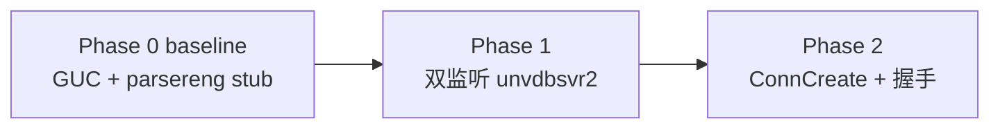

# PG16 MySQL Baseline 移植计划书（UDB-TX / feature/mysql-baseline）

> **分支**：`feature/mysql-baseline`（UDB-TX-ZXZ repo）  
> **阶段**：Phase 0 契约层（M0）  
> **目标**：`unvdb` 编过、可启动；**全量注册** 10 项 MySQL 相关 GUC；**无** MySQL 监听、**无** `unvdbsvr2` 实现、**无** adapter 行为  
> **占位策略**：Phase 2 才启用的代码可从 beta1 **拷贝到目标文件并整块注释**（§2.5.4 结构化 `MYSQL-BASELINE-PLACEHOLDER`），MR 可见完整 diff 意图，Phase 2 按 ORDER 表 **uncomment** 即可推进
> **证据树**：`postgresql-14.18` / `openHalo-1.0-beta1`（意图）/ `postgresql-16.11`（PG 上游落点）/ `UDB-TX-ZXZ`（实际改代码）  
> **方法论**：`.cursor/rules/openhalo-pg16-porting.mdc`（双 diff、PG16 底稿、禁止整文件 cherry-pick）

---

## 0. 文档关系

| 文档 | 用途 |
|------|------|
| [pg16-guc-three-way-comparison.md](pg16-guc-three-way-comparison.md) | GUC 三树对比、10 项清单、变量分布、PG16 六字段模板 |
| [pg16-mysql-port-execution-plan.md](pg16-mysql-port-execution-plan.md) | **唯一执行文档**（§1 按步执行；Phase 0–8 能力索引见附录 E） |
| [pg16-nodes-three-way-comparison.md](pg16-nodes-three-way-comparison.md) | NodeTag 方案 A/B、`protocol_interface.h` 策略 |
| [pg16-phase0-nodetag-guc-porting.md](pg16-phase0-nodetag-guc-porting.md) | Phase 0 NodeTag + GUC 细项（规划中；本计划书已合并其要点） |
| [UDB-TX-ZXZ/CLAUDE.md](UDB-TX-ZXZ/CLAUDE.md) | UDB-TX 系统级命名映射完整表 |

---

## 1. UDB-TX 命名映射

UDB-TX 在 PG 16.11 基础上做了**系统级重命名**。baseline Phase 0 涉及的路径/符号必须按下列映射转换，**不可**沿用 beta1 的 `postmaster` / `postgres` 路径。

### 1.1 核心映射（全项目）

| PG 16 / beta1 原名 | UDB-TX 名 | 类别 | 说明 |
|-------------------|-----------|------|------|
| `postgres.h` | `unvdb.h` | 主引擎头文件 | `guc_tables.c` 等内核文件 `#include "unvdb.h"` |
| `src/backend/postmaster/` | `src/backend/unvdbsvr/` | 服务进程目录 | 含 `unvdbsvr.c`、bgwriter 等 |
| `postmaster.c` | `unvdbsvr.c` | 服务主文件 | beta1 `PostmasterMain` → UDB `UnvdbsvrMain`（符号名以源码为准） |
| `postmaster.h` | **`unvdbsvr/unvdbsvr.h`** | 服务头文件 | **非** `postmaster.h`；`PostPortNumber` 等 extern 在此 |
| `postmaster2.c` / `postmaster2.h` | **`unvdbsvr2.c` / `unvdbsvr2.h`** | 第二协议扩展 | **新文件名**，路径 `src/backend/unvdbsvr/` + `src/include/unvdbsvr/`；**baseline 不实现** |
| `src/backend/tcop/postgres.c` | `src/backend/tcop/unvdb.c` | 查询主入口 | Phase 3+ 才改读命令分发 |
| `postgres`（二进制） | `unvdb` | 主程序 | 编译验收：`make -C src/backend unvdb` |
| `pg_ctl` | `ud_ctl` | 服务控制 | 启动验收用 `ud_ctl` |
| `psql` | `ud_sql` | 交互终端 | `SHOW` 验收用 `ud_sql` |
| `libpq-fe.h` | `unvdb_fe.h` | 客户端库头 | baseline 不涉及 |
| `PGC_POSTMASTER` | **`PGC_UNVDBSVR`** | GUC 上下文枚举 | `guc.h:70`；所有 beta1 `PGC_POSTMASTER` 的 MySQL GUC 须改写 |

> **说明**：`PGC_UNVDBSVR` 语义等同 PG 的 `PGC_POSTMASTER`（仅 unvdbsvr 进程可改、需重启），是 UDB-TX 品牌重命名，**不是**新语义。

### 1.2 Phase 0 文件路径对照表（beta1 → UDB-TX）

| 功能 | beta1 / PG16 路径 | UDB-TX baseline 落点 | Phase 0 操作 |
|------|-------------------|----------------------|--------------|
| 解析契约头 | `include/parser/parsereng.h` | `src/include/parser/parsereng.h` | **新增** |
| 解析契约 stub | `backend/parser/parsereng.c` | `src/backend/parser/parsereng.c` | **新增**（仅两 GUC 变量） |
| parser 构建 | `backend/parser/Makefile` | `src/backend/parser/Makefile` | `OBJS += parsereng.o` |
| 服务端口变量 | `postmaster/postmaster.c:210` | `src/backend/unvdbsvr/unvdbsvr.c` | `int PostMySQLPortNumber;` |
| 端口 extern | `postmaster/postmaster.h:21` | `src/include/unvdbsvr/unvdbsvr.h` | `extern int PostMySQLPortNumber;` |
| GUC 注册表 | `guc.c`（PG14）/ `guc_tables.c`（PG16） | `src/backend/utils/misc/guc_tables.c` | 10 项注册 + enum 表 + mysql.* 变量 stub |
| GUC 引擎 | `guc.c` | `src/backend/utils/misc/guc.c` | **仅** `ReportGUCOption` 注释占位（§2.5.5-4）；不改 `guc_var_compare`（§2.3） |
| 协议契约头 | `include/postmaster/protocol_interface.h` | `src/include/unvdbsvr/protocol_interface.h` | **可选新增**（方案 A NodeTag） |
| 第二监听 | `postmaster2.c/h` | `unvdbsvr2.c/h` | **baseline 禁止**；Phase 1 启用时 `getSecondProtocolHandler`（`postmaster2.c:194`）在 `MYSQL_COMPAT_MODE` 下 **硬调用** `getMysProtocolHandler`（`adapter.c:489`），故须 adapter 编链 |
| adapter | `backend/adapter/mysql/` | `src/backend/adapter/mysql/` | **baseline 禁止**编链 |

### 1.3 include 路径转换规则

移植 beta1 代码时，按下列替换 include：

```c
/* beta1 */                          /* UDB-TX */
#include "postgres.h"            →    #include "unvdb.h"
#include "postmaster/postmaster.h" → #include "unvdbsvr/unvdbsvr.h"
#include "postmaster/postmaster2.h"→ /* Phase 1+；baseline 禁止 */
#include "postmaster/protocol_interface.h" → #include "unvdbsvr/protocol_interface.h"
```

`guc_tables.c` 已对 PG16 路径完成 UDB 化（证据：`guc_tables.c:58–61` 使用 `unvdbsvr/unvdbsvr.h`），新增 MySQL 项须保持同一风格。

---

## 2. Baseline MR 范围（feature/mysql-baseline）

### 2.0 范围摘要

| 包含 | 不包含 |
|------|--------|
| `parsereng.h/c` stub | `unvdbsvr2.c/h` 任何实现 |
| `guc_tables.c` 全量 10 项 GUC 注册 | `unvdbsvr.c` 监听 / `#include unvdbsvr2.c` |
| `unvdbsvr.c/h` 仅 `PostMySQLPortNumber` | `backend/adapter/` 编链 |
| `protocol_interface.h`（可选，方案 A） | `InitParserEngine()` 调用 |
| `parser/Makefile` 增 `parsereng.o` | `unvdbsvr2` / adapter **真实现** |
| Phase 2 延后项 **注释占位拷贝**（§2.5） | Phase 2 延后项 **启用**（uncomment） |
| | `T_TDSProtocol` |
| | `backend/adapter/**` 整文件编链（`mysCheckAuth` 等） |

**意图来源**：`diff -u postgresql-14.18/src/backend/utils/misc/guc.c openHalo-1.0-beta1/src/backend/utils/misc/guc.c`（约 359 行增量）。

---

### 2.1 guc.c → guc_tables.c 迁移清单

PG 16 / UDB-TX 将 GUC 注册表从 `guc.c` 拆到 `guc_tables.c`。beta1 在 `guc.c` 内的 MySQL 增量，baseline 须**逐项**落到 `guc_tables.c`，并遵守 PG16 **六字段**内层格式（`name, context, group, short_desc, long_desc, flags`）。

#### 2.1.1 两张 enum options 表（static const）

插入位置：`guc_tables.c` 中 `password_encryption_options[]`（`:402–409`）之后、`data_checksum_version_options[]` 之前。

| # | 表名 | beta1 源（guc.c） | UDB-TX 落点 | 依赖 |
|---|------|-------------------|-------------|------|
| 1 | `database_compat_mode_options[]` | `:537–541` | `guc_tables.c` ~`:410` 后 | `#include "parser/parsereng.h"`（枚举值） |
| 2 | `standard_parserengine_auxiliary_options[]` | `:543–551` | 紧挨上表 | 同上 |

```c
static const struct config_enum_entry database_compat_mode_options[] = {
    {"postgresql", POSTGRESQL_COMPAT_MODE, false},
    {"mysql", MYSQL_COMPAT_MODE, false},
    {NULL, 0, false}
};

static const struct config_enum_entry standard_parserengine_auxiliary_options[] = {
    {"off", STANDARDARD_PARSERENGINE_AUXILIARY_OFF, false},
    {"on", STANDARDARD_PARSERENGINE_AUXILIARY_ON, false},
    {"no", STANDARDARD_PARSERENGINE_AUXILIARY_OFF, false},
    {"yes", STANDARDARD_PARSERENGINE_AUXILIARY_ON, false},
    {"false", STANDARDARD_PARSERENGINE_AUXILIARY_OFF, false},
    {"true", STANDARDARD_PARSERENGINE_AUXILIARY_ON, false},
    {NULL, 1, false}
};
```

#### 2.1.2 十项 ConfigureNames* 注册

**上下文转换**：beta1 `PGC_POSTMASTER` → UDB-TX `PGC_UNVDBSVR`；`PGC_USERSET` 不变。

| # | GUC 名 | 类型数组 | C 变量 | 默认值 | 邻项锚点（UDB-TX `guc_tables.c` 行号） | beta1 注册行 |
|---|--------|----------|--------|--------|----------------------------------------|--------------|
| 1 | `mysql.listener_on` | `ConfigureNamesBool[]` | `halo_mysql_listener_on` | `false` | **`wal_receiver_create_temp_slot` 之后、Bool 数组 End 标记之前**（`:2038–2044` 后） | `:2170–2175` |
| 2 | `mysql.explicit_defaults_for_timestamp` | `ConfigureNamesBool[]` | `halo_mysql_explicit_defaults_for_timestamp` | `false` | 紧挨 #1 | `:2179–2185` |
| 3 | `mysql.auto_rollback_tx_on_error` | `ConfigureNamesBool[]` | `halo_mysql_auto_rollback_tx_on_error` | `false` | 紧挨 #2 | `:2188–2194` |
| 4 | `mysql.support_multiple_table_update` | `ConfigureNamesBool[]` | `halo_mysql_support_multiple_table_update` | `true` | 紧挨 #3 | `:2197–2203` |
| 5 | `mysql.port` | `ConfigureNamesInt[]` | `PostMySQLPortNumber` | `3306`（min 1, max 65535） | **`port` 条目之后**（`:2324–2331` 后） | `:2451–2457` |
| 6 | `mysql.column_name_case_control` | `ConfigureNamesInt[]` | `halo_mysql_column_name_case_control` | `0`（min 0, max 3） | **Int 数组 End 标记之前**（`scram_sm3_iterations` `:3553–3562` 后，`:3565` 前） | `:3651–3657` |
| 7 | `mysql.max_allowed_packet` | `ConfigureNamesInt[]` | `halo_mysql_max_allowed_packet` | `67108864`（min 1024, max 1073741824） | 紧挨 #6；**flags 须含 `GUC_UNIT_BYTE`** | `:3660–3668` |
| 8 | `mysql.halo_mysql_version` | `ConfigureNamesString[]` | `halo_mysql_version` | `"5.7.32-log"` | **`archive_command` 之后**（`:3856–3862` 后） | `:3962–3968` |
| 9 | `database_compat_mode` | `ConfigureNamesEnum[]` | `database_compat_mode` | `POSTGRESQL_COMPAT_MODE` | **Enum 数组 End 标记之前**（`data_checksums_version_name` `:5071–5078` 后，`:5081` 前）；**flags: `GUC_SUPERUSER_ONLY`** | `:5101–5108` |
| 10 | `standard_parserengine_auxiliary` | `ConfigureNamesEnum[]` | `standard_parserengine_auxiliary` | `STANDARDARD_PARSERENGINE_AUXILIARY_ON` | 紧挨 #9；**flags: `GUC_SUPERUSER_ONLY`** | `:5112–5119` |

**分组（group）对照**：

| GUC | beta1 group | UDB-TX 沿用 |
|-----|-------------|-------------|
| `mysql.port` | `CONN_AUTH_SETTINGS` | `CONN_AUTH_SETTINGS` |
| 其余 `mysql.*` | `CUSTOM_OPTIONS` | `CUSTOM_OPTIONS` |
| `database_compat_mode` / `standard_parserengine_auxiliary` | `CUSTOM_OPTIONS` | `CUSTOM_OPTIONS` |

**六字段注册示例**（`mysql.port`，对照 UDB-TX 现有 `port` 条目 `:2324–2331`）：

```c
{
    {"mysql.port", PGC_UNVDBSVR, CONN_AUTH_SETTINGS,
        gettext_noop("Sets the MySQL TCP port the server listens on."),
        NULL
    },
    &PostMySQLPortNumber,
    3306, 1, 65535,
    NULL, NULL, NULL
},
```

**Bool 四条目块示例**（插入 `:2044` 后）：

```c
{
    {"mysql.listener_on", PGC_UNVDBSVR, CUSTOM_OPTIONS,
        gettext_noop("Enable second listener."),
        NULL
    },
    &halo_mysql_listener_on,
    false,
    NULL, NULL, NULL
},
/* ... explicit_defaults_for_timestamp, auto_rollback_tx_on_error,
      support_multiple_table_update 同理，注意 support 默认 true ... */
```

#### 2.1.3 变量定义分布（用户策略）

| 变量 | 定义文件 | extern 声明 | 说明 |
|------|----------|-------------|------|
| `halo_mysql_listener_on` | **`guc_tables.c` 变量区顶部**（~`:506` 段） | 无需（或 Phase 1 在 `unvdbsvr2.h` 加 extern） | beta1 在 `guc.c:613`；UDB 统一到 guc_tables |
| `halo_mysql_explicit_defaults_for_timestamp` | `guc_tables.c` 顶部 | — | beta1 在 `adapter.c:144`；Phase 0 stub |
| `halo_mysql_auto_rollback_tx_on_error` | `guc_tables.c` 顶部 | — | beta1 在 `adapter.c:145` |
| `halo_mysql_support_multiple_table_update` | `guc_tables.c` 顶部 | — | beta1 在 `adapter.c:146`；初值 `true` |
| `halo_mysql_column_name_case_control` | `guc_tables.c` 顶部 | — | beta1 在 `adapter.c:143` |
| `halo_mysql_max_allowed_packet` | `guc_tables.c` 顶部 | — | beta1 在 `netTransceiver.c:59` |
| `halo_mysql_version` | `guc_tables.c` 顶部 | — | beta1 在 `adapter.c:142`；初值 `NULL`，由 GUC 默认串注入 |
| `PostMySQLPortNumber` | **`unvdbsvr.c`**（`PostPortNumber` 邻区，~`:203`） | **`unvdbsvr/unvdbsvr.h`** | beta1 在 `postmaster.c:210` |
| `database_compat_mode` | **`parsereng.c`** | **`parsereng.h`** | beta1 一致 |
| `standard_parserengine_auxiliary` | **`parsereng.c`** | **`parsereng.h`** | beta1 一致 |

> **策略理由**：Phase 0 禁止 `guc_tables.c` → `adapter.h` 编译依赖；所有 adapter 侧变量在 baseline 以 stub 形式置于 `guc_tables.c` 变量区。Phase 1+ 可将变量迁回 `adapter.c` / `netTransceiver.c`（注册表仍留 `guc_tables.c`）。

#### 2.1.4 Phase 2 延后项（概要）

下列项 **baseline 不启用**，但按 §2.5 策略 **注释占位拷贝** 到 UDB-TX 对应文件；逐项模板见 §2.5.5。

| 项 | beta1 锚点 | UDB 落点（占位注释 UDB 字段） | baseline 做法 |
|----|-----------|-------------------------------|---------------|
| `password_encryption_options` + `mysql_native_password` | `guc.c:515–522` | `UDB/src/backend/utils/misc/guc_tables.c` ~`:408` 后 | P2-HOLD-002，`#if 0` 占位 |
| `PASSWORD_TYPE_MYS_NATIVE_PASSWORD` | `crypt.h:33` | `UDB/src/include/libpq/crypt.h` ~`:34` 后 | P2-HOLD-001，`#if 0` 包裹 |
| `encrypt_password` case | `crypt.c:148–152` | `UDB/src/backend/libpq/crypt.c` switch 内 | P2-HOLD-003 |
| `plain_crypt_verify` case | `crypt.c:296–301` | `UDB/src/backend/libpq/crypt.c` switch 内 | P2-HOLD-003 |
| `ReportGUCOption` `protocol_handler` 分支 | `guc.c:6752–6765` | `UDB/src/backend/utils/misc/guc.c` ~`:2594` | P2-HOLD-004 |
| `mysCheckAuth` 等 adapter 认证 | `userLogonAuth.c:275+` | `UDB/src/backend/adapter/mysql/` | **不拷贝**（整目录 Phase 2；见 §2.5.5-5） |

UDB-TX 当前 `password_encryption_options`（`guc_tables.c:402–409`）含 UDB 扩展项（`scram-sm3`、`sm3`、`sm4`），注释占位须插入在 `{NULL, 0, false}` **之前**，Phase 2 uncomment 时保留这些既有项。

#### 2.1.5 ConfigureNames 十项填充要点

> 逐项锚点见 §2.1.2；三树格式差异与 beta1 摘录见 [pg16-guc-three-way-comparison.md](pg16-guc-three-way-comparison.md) §1–§2。

| 要点 | baseline 做法 |
|------|---------------|
| **六字段内层** | PG16/UDB 固定 `name, context, group, short_desc, long_desc, flags`；beta1 常仅 4–5 字段，**不可照搬** |
| **上下文** | beta1 `PGC_POSTMASTER` → UDB `PGC_UNVDBSVR`；`PGC_USERSET` 不变（`mysql.max_allowed_packet`、`standard_parserengine_auxiliary`） |
| **long_desc / flags** | beta1 多 `NULL`；UDB 须补全第六字段 `flags`（无则 `NULL`）。`mysql.max_allowed_packet` 须 `GUC_UNIT_BYTE`；两 enum GUC 须 `GUC_SUPERUSER_ONLY` |
| **enum options 挂法** | 两张 `static const config_enum_entry` 表（§2.1.1）置于 `password_encryption_options[]` 邻区；`ConfigureNamesEnum` 条目末参指向 `database_compat_mode_options` / `standard_parserengine_auxiliary_options`；`#include "parser/parsereng.h"` 取枚举常量 |
| **变量指针** | `ConfigureNames*` 第二段 `&变量` 须指向 **已定义** 符号；Phase 0 adapter 变量 stub 在 `guc_tables.c` 顶部（§2.1.3），禁止 `#include adapter.h` |
| **group** | `mysql.port` → `CONN_AUTH_SETTINGS`；其余 `mysql.*` 与两 enum → `CUSTOM_OPTIONS`（§2.1.2 分组表） |

**Enum 注册片段**（对照 beta1 `guc.c:5101–5119`，UDB 六字段）：

```c
{
    {"database_compat_mode", PGC_UNVDBSVR, CUSTOM_OPTIONS,
        gettext_noop("Sets the database compat mode."),
        NULL,
        GUC_SUPERUSER_ONLY
    },
    &database_compat_mode,
    POSTGRESQL_COMPAT_MODE, database_compat_mode_options,
    NULL, NULL, NULL
},
```

---

### 2.5 注释占位（Commented Placeholder）总策略

#### 2.5.1 目的

- MR diff 中可见 **完整移植意图**，review 时明确 Phase 2 改哪里
- Phase 2 推进时 **取消注释 / `#if 0` 改为 `#if 1`** 即可，无需重新 diff beta1
- 与 `parsereng.h`（`:282–286`）、`guc_tables.c` adapter include TODO（`:226–229`）保持 **同一 TODO 风格**

#### 2.5.2 四条原则

| # | 原则 | baseline 做法 |
|---|------|---------------|
| 1 | **可独立编译运行的**正常落地 | 10 项 GUC、options 表、变量 stub、`parsereng`、`PostMySQLPortNumber` 等 |
| 2 | **Phase 2 才启用但可先就位** | 从 beta1 拷贝到 UDB-TX 对应文件，**`#if 0` + §2.5.4 结构化占位头**（ID/BETA1/UDB/UNLOCK/ORDER/RELATED/WHY_IF0） |
| 3 | **本阶段不移植的模块** | `#include` 用 TODO 注释说明，**不真 include**（与 §2.2.1 一致） |
| 4 | **头文件** | baseline 已包含模块 → 真 include；未移植模块 → TODO 注释 |

#### 2.5.3 编译安全（硬性）

**禁止**：注释块内残留对 **未定义符号** 的引用导致 baseline 编不过。

| 手段 | 适用 |
|------|------|
| C 块注释 `/* … */` 或 `//` 逐行注释 | 纯文本、enum 条目、不含宏展开 |
| `#if 0` … `#endif` | 含 `PASSWORD_TYPE_*`、`mysNativePwdEncrypt`、`protocol_handler` 等符号的代码块 |
| 块外单行 `//` TODO | 说明依赖，不引入符号 |

启用前自检：`make -C src/backend unvdb` 在 **注释状态** 与 **uncomment 后** 各编过一次。

#### 2.5.4 结构化注释占位字段规范

Phase 2 延后项在目标文件内使用 **统一多行结构化注释**（与 `parsereng.h`、`guc_tables.c` adapter TODO 风格对齐）。占位编号 `P2-HOLD-NNN` 与 §3.5 清单序号一一对应。

**字段定义**（块内或文件顶横幅均适用）：

| 字段 | 含义 |
|------|------|
| **ID** | 占位编号 `P2-HOLD-NNN`（与 §3.5 清单序号对应） |
| **BETA1** | `openHalo-1.0-beta1/<path>:<line>` 意图锚点 |
| **UDB** | UDB 目标路径含大致行锚点，**一律** `UDB/src/...` 前缀（不写 `UDB-TX-ZXZ`） |
| **UNLOCK** | uncomment 前置条件（依赖文件/符号/编链） |
| **ORDER** | 同 Phase 内 uncomment 顺序（数字越小越先） |
| **RELATED** | 关联占位 ID 或文件 |
| **WHY_IF0** | 为何用 `#if 0` 而非纯块注释（含未定义符号/宏展开风险时必填） |

**文件顶横幅**（含 Phase 2 占位的源文件首行或 include 区后追加）：

```c
/*
 * MYSQL-BASELINE-PLACEHOLDER-BANNER
 * 本文件含 Phase 2 注释占位；baseline 须保持 #if 0 / 块注释状态可编过。
 * 解锁顺序见 pg16-mysql-baseline-plan.md §2.5.4 ORDER 表。
 */
```

**ORDER 表**（Phase 2 MR 按此顺序 uncomment；`(5)` 为整目录新增，非 baseline 占位拷贝）：

| ORDER | ID | UDB 落点 | UNLOCK 摘要 |
|------:|-----|----------|-------------|
| 1 | P2-HOLD-001 | `UDB/src/include/libpq/crypt.h` | 无（enum 常量，须最先生效） |
| 2 | P2-HOLD-002 | `UDB/src/backend/utils/misc/guc_tables.c` | P2-HOLD-001 已 uncomment |
| 3 | P2-HOLD-003 | `UDB/src/backend/libpq/crypt.c` | P2-HOLD-001 + `#include pwdEncryptDecrypt.h` + adapter 编链 |
| 4 | P2-HOLD-004 | `UDB/src/backend/utils/misc/guc.c` | `unvdbsvr2` + `Port.protocol_handler` + ConnCreate 分发 |
| — | *(5) adapter/* | `UDB/src/backend/adapter/mysql/` | C1–C4 全部通过 + `SUBDIRS += adapter` |

块外可保留单行 `// TODO(Phase 2): …` 作速览；**块内首行**须含完整 `MYSQL-BASELINE-PLACEHOLDER` 结构化头。

#### 2.5.5 延后项逐项：锚点 + 注释块示例

##### (1) `password_encryption_options` + `mysql_native_password`

- **beta1 锚点**：`openHalo-1.0-beta1/src/backend/utils/misc/guc.c:518–519`
- **UDB 落点**：`UDB/src/backend/utils/misc/guc_tables.c` 的 `password_encryption_options[]`（`:402–409`），在 `sm4` 条目与 `{NULL, …}` 之间

```c
static const struct config_enum_entry password_encryption_options[] = {
    {"md5", PASSWORD_TYPE_MD5, false},
    {"scram-sha-256", PASSWORD_TYPE_SCRAM_SHA_256, false},
    {"scram-sm3", PASSWORD_TYPE_SCRAM_SM3, false},
    {"sm3", PASSWORD_TYPE_SM3, false},
    {"sm4", PASSWORD_TYPE_SM4, false},
#if 0
/*
 * MYSQL-BASELINE-PLACEHOLDER
 * ID: P2-HOLD-002
 * BETA1: openHalo-1.0-beta1/src/backend/utils/misc/guc.c:518-519
 * UDB: UDB/src/backend/utils/misc/guc_tables.c:~408
 * UNLOCK: P2-HOLD-001 crypt.h enum 已 uncomment
 * ORDER: 2 — enum 常量须先于选项表条目生效
 * RELATED: P2-HOLD-001 | adapter/mysql/userLogonAuth.c mysCheckAuth
 * WHY_IF0: 引用 PASSWORD_TYPE_MYS_NATIVE_PASSWORD，块注释仍会宏展开
 */
    {"mysql_native_password", PASSWORD_TYPE_MYS_NATIVE_PASSWORD, false},
#endif
    {NULL, 0, false}
};
```

##### (2) `PASSWORD_TYPE_MYS_NATIVE_PASSWORD`

- **beta1 锚点**：`openHalo-1.0-beta1/src/include/libpq/crypt.h:33`
- **UDB 落点**：`UDB/src/include/libpq/crypt.h` 的 `PasswordType` enum（`:27–35`），在 `PASSWORD_TYPE_SM4` 之后

```c
typedef enum PasswordType
{
    PASSWORD_TYPE_PLAINTEXT = 0,
    PASSWORD_TYPE_MD5,
    PASSWORD_TYPE_SCRAM_SHA_256,
    PASSWORD_TYPE_SCRAM_SM3,
    PASSWORD_TYPE_SM3,
    PASSWORD_TYPE_SM4,
#if 0
/*
 * MYSQL-BASELINE-PLACEHOLDER
 * ID: P2-HOLD-001
 * BETA1: openHalo-1.0-beta1/src/include/libpq/crypt.h:33
 * UDB: UDB/src/include/libpq/crypt.h:~34
 * UNLOCK: Phase 2 MR 启动；与 guc_tables / crypt.c 同步 uncomment
 * ORDER: 1 — 密码类型枚举为全链最先项
 * RELATED: P2-HOLD-002 | P2-HOLD-003
 * WHY_IF0: 纯 enum 成员；#if 0 与块注释均可，统一用 #if 0 便于与 case 块风格一致
 */
    PASSWORD_TYPE_MYS_NATIVE_PASSWORD,
#endif
} PasswordType;
```

##### (3) `encrypt_password` / `plain_crypt_verify` case

- **beta1 锚点**：
  - `encrypt_password`：`crypt.c:148–152`
  - `plain_crypt_verify`：`crypt.c:296–301`
- **UDB 落点**：`UDB/src/backend/libpq/crypt.c` 对应 `switch (target_type)` / `switch (get_password_type(shadow_pass))` 内
- **块顶结构化头**（文件顶部 include 区，不真 include）：

```c
/*
 * MYSQL-BASELINE-PLACEHOLDER
 * ID: P2-HOLD-003 (include)
 * BETA1: openHalo-1.0-beta1/src/backend/adapter/mysql/pwdEncryptDecrypt.h
 * UDB: UDB/src/backend/adapter/mysql/pwdEncryptDecrypt.h
 * UNLOCK: adapter SUBDIRS + P2-HOLD-001
 * ORDER: 3 — 与 crypt.c case 同序 uncomment
 * RELATED: P2-HOLD-001 | P2-HOLD-002
 * WHY_IF0: N/A（include 行用块注释，不引入未编链头文件）
 */
/* #include "adapter/mysql/pwdEncryptDecrypt.h" */
```

`encrypt_password` 内示例：

```c
        case PASSWORD_TYPE_SCRAM_SHA_256:
            return pg_be_scram_build_secret(password);

#if 0
/*
 * MYSQL-BASELINE-PLACEHOLDER
 * ID: P2-HOLD-003
 * BETA1: openHalo-1.0-beta1/src/backend/libpq/crypt.c:148-152
 * UDB: UDB/src/backend/libpq/crypt.c:~encrypt_password switch
 * UNLOCK: P2-HOLD-001 + pwdEncryptDecrypt.h include + adapter 编链
 * ORDER: 3
 * RELATED: P2-HOLD-001 | adapter/mysql/pwdEncryptDecrypt.c
 * WHY_IF0: case 引用 mysNativePwdEncrypt / MYS_NATIVE_PASSWORD_LEN 未定义符号
 */
        case PASSWORD_TYPE_MYS_NATIVE_PASSWORD:
            encrypted_password = palloc(MYS_NATIVE_PASSWORD_LEN + 1);
            mysNativePwdEncrypt(password, encrypted_password);
            return encrypted_password;
#endif

        case PASSWORD_TYPE_PLAINTEXT:
```

`plain_crypt_verify` 内示例：

```c
        case PASSWORD_TYPE_PLAINTEXT:
            /* ... 现有 PG 逻辑 ... */
            break;

#if 0
/*
 * MYSQL-BASELINE-PLACEHOLDER
 * ID: P2-HOLD-003
 * BETA1: openHalo-1.0-beta1/src/backend/libpq/crypt.c:296-301
 * UDB: UDB/src/backend/libpq/crypt.c:~plain_crypt_verify switch
 * UNLOCK: 同 encrypt_password case + mysCheckAuth 路径
 * ORDER: 3
 * RELATED: P2-HOLD-001 | adapter/mysql/userLogonAuth.c
 * WHY_IF0: case 体将引用 adapter 符号
 */
        case PASSWORD_TYPE_MYS_NATIVE_PASSWORD:
            break;
#endif
    }
```

##### (4) `ReportGUCOption` `protocol_handler` 分支

- **beta1 锚点**：`openHalo-1.0-beta1/src/backend/utils/misc/guc.c:6752–6765`
- **UDB 落点**：`UDB/src/backend/utils/misc/guc.c` 的 `ReportGUCOption`（`:2588–2612`），替换现有纯 `pq_beginmessage` 路径为 **注释包裹的 if/else**
- **对比**：UDB/PG16 当前仅 `StringInfoData msgbuf` + `pq_beginmessage('S')`；beta1 在 `MyProcPort->protocol_handler->report_param_status` 存在时走协议回调

```c
    if (record->last_reported == NULL ||
        strcmp(val, record->last_reported) != 0)
    {
#if 0
/*
 * MYSQL-BASELINE-PLACEHOLDER
 * ID: P2-HOLD-004
 * BETA1: openHalo-1.0-beta1/src/backend/utils/misc/guc.c:6752-6765
 * UDB: UDB/src/backend/utils/misc/guc.c:~2594
 * UNLOCK: unvdbsvr2 + Port.protocol_handler + ConnCreate 协议分发
 * ORDER: 4 — 依赖运行时 Port 扩展，晚于密码链
 * RELATED: unvdbsvr2.c getSecondProtocolHandler | protocol_interface.h
 * WHY_IF0: 引用 MyProcPort->protocol_handler 及 report_param_status 回调
 */
        if (MyProcPort && MyProcPort->protocol_handler->report_param_status)
        {
            MyProcPort->protocol_handler->report_param_status(record->name, val);
        }
        else
#endif
        {
            StringInfoData msgbuf;

            pq_beginmessage(&msgbuf, 'S');
            pq_sendstring(&msgbuf, record->name);
            pq_sendstring(&msgbuf, val);
            pq_endmessage(&msgbuf);
        }
        /* ... last_reported 逻辑不变 ... */
    }
```

##### (5) `mysCheckAuth` 等 — **不拷贝**

- **beta1 锚点**：`userLogonAuth.c:275`（`mysCheckAuth`）、`adapter.c:764`（握手后调用）
- **原因**：
  1. 属 **整文件 / 整目录** Phase 2 范畴（`adapter/mysql/*`），非单函数可孤立注释
  2. 依赖 `pwdEncryptDecrypt`、`netTransceiver`、`Port` 扩展字段，baseline 无对应符号
  3. 若在 `guc.c` / `crypt.c` 外再拷 adapter 片段，易引入 **adapter 编译闭包**，违反 §2.2.1
- **计划书约定**：仅在 `guc_tables.c` / `crypt.c` 的 TODO 中 **交叉引用** `mysCheckAuth`；Phase 2 MR 新增 `adapter/` 并 `SUBDIRS += adapter`

---

### 2.2 头文件策略

#### 2.2.1 规则

| 类别 | 做法 | 示例 |
|------|------|------|
| **Phase 0 已移植模块** | 直接 `#include` | `parser/parsereng.h` |
| **本阶段未移植模块** | **TODO 注释 + 不 include** | `adapter/mysql/adapter.h`、`netTransceiver.h` |
| **服务契约** | 直接 include / extern | `unvdbsvr/unvdbsvr.h`（`PostMySQLPortNumber`） |

#### 2.2.2 `guc_tables.c` 顶部模板

在现有 include 块（`:21–86`）中追加 `parsereng.h`；**禁止** include adapter 头。变量区（`:506` 前）追加 MySQL stub 变量。

```c
/* 在 #include "parser/parser.h" 附近追加 */
#include "parser/parsereng.h"

/* Phase 0: 不引入 adapter 编译闭包
 * TODO(Phase 1/2): halo_mysql_version 等变量可迁回 adapter.c
 * TODO(Phase 2): #include "adapter/mysql/adapter.h" — 服务于握手/认证读取 GUC
 * TODO(Phase 2+): #include "adapter/mysql/netTransceiver.h" — 服务于 max_allowed_packet 运行时校验
 */

/*
 * MySQL compatibility GUC variables (Phase 0 stubs).
 * Registered in ConfigureNames*[] below; consumers arrive in Phase 1+.
 */
bool        halo_mysql_listener_on = false;
bool        halo_mysql_explicit_defaults_for_timestamp = false;
bool        halo_mysql_auto_rollback_tx_on_error = false;
bool        halo_mysql_support_multiple_table_update = true;
int         halo_mysql_column_name_case_control = 0;
int         halo_mysql_max_allowed_packet = 67108864;
char       *halo_mysql_version = NULL;

/* PostMySQLPortNumber 定义在 unvdbsvr.c，此处仅通过 ConfigureNamesInt 引用 */
```

`unvdbsvr.c` 追加（`PostPortNumber` 定义旁，~`:203`）：

```c
int         PostMySQLPortNumber;
```

`unvdbsvr/unvdbsvr.h` 追加：

```c
extern int PostMySQLPortNumber;
```

#### 2.2.3 `parsereng.h` Phase 0 契约（与 beta1 差异）

beta1 `parsereng.h` 内含 `RawParseMode` typedef（`:22–30`），**PG16/UDB baseline 禁止重复**。须改为：

```c
#ifndef PARSERENG_H
#define PARSERENG_H

#include "parser/parser.h"   /* RawParseMode 来自 PG16 parser.h */

typedef enum {
    POSTGRESQL_COMPAT_MODE,
    MYSQL_COMPAT_MODE,
} DatabaseCompatModeType;

typedef enum {
    STANDARDARD_PARSERENGINE_AUXILIARY_OFF,
    STANDARDARD_PARSERENGINE_AUXILIARY_ON,
} StandardParserengineAuxiliary;

extern int database_compat_mode;
extern int standard_parserengine_auxiliary;

/* Phase 4+ 才引入：
 * typedef struct ParserRoutine ParserRoutine;
 * extern const ParserRoutine *parserengine;
 * extern void InitParserEngine(void);
 */

#endif
```

#### 2.2.4 `parsereng.c` Phase 0 stub

```c
#include "unvdb.h"
#include "parser/parsereng.h"

int database_compat_mode = POSTGRESQL_COMPAT_MODE;
int standard_parserengine_auxiliary = STANDARDARD_PARSERENGINE_AUXILIARY_ON;
```

**禁止**：`#include "parser/mysql/mys_parser.h"`、`InitParserEngine`、`parserengine` 指针（属 Phase 4）。

---

### 2.3 guc_var_compare 研究结论

#### 2.3.1 三树证据

| 树 | 文件:行 | 实现 |
|----|---------|------|
| PG 14.18 | `guc.c:5565–5570` | `**(const char **const *)` hack（因 `name` 是 `config_generic` 首字段） |
| beta1 | `guc.c:5706–5711` | 改为 `confa->name` / `confb->name`（语义等价、更清晰） |
| PG 16.11 | `guc.c:1253–1258` | 与 PG14 **相同** hack |
| UDB-TX | `guc.c:1253–1258` | 与 PG16 **相同** hack |

PG14/beta1 注释写明用于 **qsort/bsearch `guc_variables` 数组**；PG16/UDB 改为 hash 表（`guc_hashtab`），但 `get_guc_variables()` 仍对结果做 qsort（`guc.c:883–884`），故 `guc_var_compare` **仍在使用**。

#### 2.3.2 baseline 结论

**UDB-TX baseline 不要移植 beta1 的 `guc_var_compare` 改动。**

理由：
1. PG16/UDB-TX 已有正确且与上游一致的实现；
2. beta1 改动仅为可读性，非功能修复；
3. 移植该改动会增加与 PG16 上游 merge 的噪声，无 Phase 0 收益。

---

### 2.4 关联文件完整清单

#### 2.4.1 Phase 0 必做

| 文件 | 操作 | 关键内容 |
|------|------|----------|
| `src/include/parser/parsereng.h` | 新增 | 枚举 + 两变量 extern；`#include parser.h`；Phase 4+ TODO 块 |
| `src/backend/parser/parsereng.c` | 新增 | 两变量定义 |
| `src/backend/parser/Makefile` | 修改 | `OBJS` 追加 `parsereng.o` |
| `src/include/unvdbsvr/unvdbsvr.h` | 修改 | `extern int PostMySQLPortNumber;` |
| `src/backend/unvdbsvr/unvdbsvr.c` | 修改 | `int PostMySQLPortNumber;`（**仅变量，不改监听逻辑**） |
| `src/backend/utils/misc/guc_tables.c` | 修改 | 2 enum 表 + 10 项注册 + mysql.* 变量 stub + include + **password_encryption 注释占位**（§2.5.5-1） |
| `src/include/libpq/crypt.h` | 修改 | `PASSWORD_TYPE_MYS_NATIVE_PASSWORD` **#if 0 占位**（§2.5.5-2） |
| `src/backend/libpq/crypt.c` | 修改 | `encrypt_password` / `plain_crypt_verify` case **#if 0 占位** + pwdEncryptDecrypt TODO（§2.5.5-3） |
| `src/backend/utils/misc/guc.c` | 修改 | `ReportGUCOption` **#if 0 占位** if/else（§2.5.5-4）；**不**改 `guc_var_compare` |

#### 2.4.2 Phase 0 可选（建议）

| 文件 | 操作 | 说明 |
|------|------|------|
| `src/include/unvdbsvr/protocol_interface.h` | 新增 | `ProtocolRoutine` 20 回调；**方案 A** NodeTag |

**方案 A NodeTag**（execution-plan §2.6、nodes 对比 §3）：

```c
#include "nodes/nodes.h"

/* Phase 0–2 临时方案；Phase 4 迁移至 nodetags.h 正式 tag 后删除 */
#ifndef T_StandardProtocol
#define T_StandardProtocol ((NodeTag) 8000)
#endif
#ifndef T_MySQLProtocol
#define T_MySQLProtocol    ((NodeTag) 8001)
#endif

typedef struct ProtocolRoutine {
    NodeTag type;
    /* ... 20 个 fn_* 回调，照 beta1 protocol_interface.h:64–108 ... */
} ProtocolRoutine;
```

**禁止**：`T_TDSProtocol`；`pg_node_attr(nodetag_only)` 标注。

#### 2.4.3 Phase 0 明确不做

| 文件 | 原因 |
|------|------|
| `unvdbsvr2.c` / `unvdbsvr2.h` | Phase 1（见 §3.4.1 最小闭包） |
| `unvdbsvr.c` 末尾 `#include "unvdbsvr2.c"` | Phase 1 |
| `backend/adapter/**` | Phase 1+ |
| `backend/Makefile` `SUBDIRS += adapter` | Phase 1 |
| `utils/misc/postgresql.conf.sample` 注释 | 可选文档，非阻塞 |
| `relopts_guc.c` `halo_heap_default_fillfactor` | 可选，非 M0 阻塞 |

---

## 3. 验收、禁止项、Commit 分组、Phase 1 边界

### 3.1 验收标准（M0）

| 级别 | 标准 |
|------|------|
| **编过** | `make -C src/backend unvdb -j$(nproc)` 无 error / undefined symbol |
| **跑过** | `ud_ctl start`；`ud_sql -c 'SELECT 1'` 成功 |
| **契约** | 下列 `SHOW` 返回值正确；**无** 3306 监听 |

```bash
# 编译
make -C src/backend unvdb -j$(nproc)

# 启动（路径按实际 $PGDATA）
initdb -D /tmp/udbtx-p0
ud_ctl -D /tmp/udbtx-p0 -l /tmp/udbtx-p0.log start

# 功能
ud_sql -c 'SELECT 1'
ud_sql -c 'SHOW database_compat_mode'              # → postgresql
ud_sql -c 'SHOW standard_parserengine_auxiliary'   # → on
ud_sql -c 'SHOW mysql.listener_on'                 # → off
ud_sql -c 'SHOW mysql.port'                        # → 3306
ud_sql -c 'SHOW mysql.support_multiple_table_update' # → on
ud_sql -c 'SHOW mysql.max_allowed_packet'          # → 64MB（或字节数显示）

# 无监听
ss -lntp | grep 3306    # 应无输出
ss -lntp | grep "$PORT" # 仅 PG 端口（默认非 3306）
```

**检查清单**：

- [ ] `parsereng.h` 无重复 `RawParseMode` typedef
- [ ] `guc_tables.c` 未 `#include "adapter/mysql/adapter.h"`
- [ ] 10 项 GUC 均可 `SHOW` / `pg_settings` 可见
- [ ] `guc.c` 未改 `guc_var_compare`；`ReportGUCOption` 仅含 **注释占位**（`#if 0` 分支未启用）
- [ ] `password_encryption` 仅 md5 / scram-sha-256 / scram-sm3 / sm3 / sm4（**无** 生效的 `mysql_native_password`）
- [ ] `crypt.h` / `crypt.c` Phase 2 块均为 `#if 0` 或块注释，baseline 编过
- [ ] `unvdbsvr.c` 无 `listen_init` / `setSecondProtocolHandler` 调用
- [ ] `unvdbsvr.c` 无 `#include "unvdbsvr2.c"`
- [ ] 未调用 `InitParserEngine` / `GetStandardParserEngine`
- [ ] `adapter/` 无新增编链；`mysCheckAuth` **未** 拷贝进 baseline

### 3.2 禁止项（baseline 硬性）

| 禁止 | 原因 |
|------|------|
| `guc_tables.c` `#include "adapter/mysql/adapter.h"` | 引入 adapter 编译闭包 |
| 照搬 beta1 `guc.c` 四字段注册格式 | PG16/UDB 要求六字段 |
| 改 `unvdbsvr.c` 监听 / `#include unvdbsvr2.c` | 属 Phase 1 |
| `backend/Makefile` 加 `adapter` SUBDIRS | 属 Phase 1 |
| `InitParserEngine()` in `postinit.c` | 属 Phase 4 |
| 移植 beta1 `guc_var_compare` | PG16 已有正确实现 |
| **启用**（uncomment）`password_encryption` → `mysql_native_password` | 属 Phase 2；**允许** §2.5 注释占位拷贝 |
| **启用** `ReportGUCOption` `protocol_handler` 分支 | 属 Phase 2；**允许** §2.5 注释占位拷贝 |
| **启用** `crypt.h` / `crypt.c` MySQL 密码 case | 属 Phase 2；**允许** §2.5 `#if 0` 占位 |
| 拷贝 `mysCheckAuth` / `adapter/` 片段进 baseline | 整目录 Phase 2；见 §2.5.5-5 |
| 注释块内残留未定义符号引用 | 导致 baseline 编不过；须 `#if 0` 或完整块注释 |
| `T_TDSProtocol` | beta1 遗留，明确不移植 |
| 整文件 cherry-pick beta1 `guc.c` / `guc_tables.c` | 违反 PG16 底稿原则 |

### 3.3 建议 Commit 分组（feature/mysql-baseline）

按依赖顺序分批提交，便于 review 与 bisect：

| Commit | 标题建议 | 文件 |
|--------|----------|------|
| **C1** | `parsereng: add Phase 0 compatibility mode stub` | `parsereng.h`, `parsereng.c`, `parser/Makefile` |
| **C2** | `unvdbsvr: add PostMySQLPortNumber for mysql.port GUC` | `unvdbsvr.h`, `unvdbsvr.c` |
| **C3** | `guc: register MySQL compatibility GUCs in guc_tables` | `guc_tables.c`（enum 表 + 变量 stub + 10 项注册 + password_encryption **#if 0**） |
| **C4** | `crypt: add Phase 2 commented password type placeholders` | `crypt.h`, `crypt.c`（enum + case **#if 0** + pwdEncryptDecrypt TODO） |
| **C5** | `guc: add commented ReportGUCOption protocol_handler branch` | `guc.c`（`ReportGUCOption` **#if 0** 占位） |
| **C6**（可选） | `protocol: add ProtocolRoutine header with scheme A NodeTag` | `protocol_interface.h` |

> C3–C5 可合并为单 commit `guc+crypt: MySQL GUC contract and Phase 2 commented placeholders`，若 MR 希望减小 commit 数。  
> 若单 MR 多 commit，MR 标题：**`feat(mysql): Phase 0 baseline — GUC contract, parsereng stub, Phase 2 placeholders`**。

### 3.4 与 Phase 1 边界

| 主题 | Phase 0（本 baseline） | Phase 1（下一 MR） |
|------|------------------------|-------------------|
| GUC 注册 | 全量 10 项 | 不变（仅读取） |
| `halo_mysql_listener_on` | 注册，默认 off | `unvdbsvr.c` `listen_init` 消费 |
| `PostMySQLPortNumber` | 注册 + 变量定义 | `adapter` `createServerPort` 消费 |
| `database_compat_mode` | 注册 + stub | `unvdbsvr2` `getSecondProtocolHandler` 消费 |
| `unvdbsvr2.c/h` | 不存在 | 新增 + `unvdbsvr.c` `#include` |
| `adapter/` | 目录可存在但不编链 | `SUBDIRS += adapter`，listen stub |
| `pqcomm.c` | 不改 | `setStandardProtocolSocket` |
| 双端口监听 | **无** | `ss` 见 5432 + 3306 |
| `ConnCreate` 分发 | 不改 | Phase 2 |
| Phase 2 注释占位 | **拷贝+注释**（§2.5） | **uncomment** + adapter 编链 |

#### 3.4.1 `unvdbsvr2` 最小闭包表（Phase 1）

`unvdbsvr2`（beta1 `postmaster2`）本体约 **328 行**，并非 Phase 1 阻塞于「文件太大」，而是 **`getSecondProtocolHandler` 硬依赖 adapter**（`MYSQL_COMPAT_MODE` 分支直接调用 `getMysProtocolHandler`，返回 `adapter.c` 内 `protocolHandler` 及其 `listen_init = initListen` 等回调）。

| 组件 | beta1 路径:行 | UDB Phase 1 落点 | 说明 |
|------|---------------|------------------|------|
| 第二协议实现体 | `postmaster/postmaster2.c`（全文 ~328 行） | `unvdbsvr/unvdbsvr2.c` | 含 `standard_*` 委托与 `ListenHandler[]` 分发 |
| 第二协议头 | `include/postmaster/postmaster2.h` | `include/unvdbsvr/unvdbsvr2.h` | 依赖 `pgcomm2.h`、`protocol_interface.h` |
| 编链方式 | `postmaster.c:6705` `#include "postmaster2.c"` | `unvdbsvr.c` 末尾 `#include "unvdbsvr2.c"` | 单 TU 编链，无独立 `.o` |
| 协议契约 | `include/postmaster/protocol_interface.h` | `include/unvdbsvr/protocol_interface.h` | Phase 0 可选预置（§2.4.2） |
| 双监听入口 | `postmaster.c:1312–1319` | `unvdbsvr.c` 同构块 | `halo_mysql_listener_on` → `setSecondProtocolHandler(getSecondProtocolHandler())` → `listen_init()` |
| 模式分发 | `postmaster2.c:194–218` `getSecondProtocolHandler` | `unvdbsvr2.c` 同构 | `switch (database_compat_mode)` |
| **adapter 硬依赖** | `adapter/mysql/adapter.c:489–493` `getMysProtocolHandler` | 同路径 | 返回 `&protocolHandler`（`:464+`，含 `initListen`） |
| GUC 消费 | `postmaster2.c:199` 读 `database_compat_mode` | `unvdbsvr2.c` | 变量定义在 `parsereng.c`（Phase 0 已 stub） |
| `halo_mysql_listener_on` extern | `postmaster2.h:57` | `unvdbsvr2.h` | 变量 Phase 0 在 `guc_tables.c` stub |

**Phase 1 最小可编链闭包**：`unvdbsvr2.c/h` + `protocol_interface.h` + `pgcomm2.h`（若 PG16 尚无则自 beta1 移植）+ `adapter/` 最小子集（至少 `adapter.c` 中 `getMysProtocolHandler` / `initListen` / `createServerPort`）+ `backend/Makefile` `SUBDIRS += adapter`。

### 3.5 Phase 2 验收（注释占位解锁后）

在 Phase 0 baseline 合并后，Phase 2 MR 按 §2.5.4 **ORDER 表** **逐项 uncomment** 并接通依赖：

| 级别 | 标准 |
|------|------|
| **编过** | 取消 §2.5.5 P2-HOLD-001–004 全部 `#if 0` + `#include pwdEncryptDecrypt.h` + `backend/Makefile` `SUBDIRS += adapter` |
| **链过** | `mysCheckAuth`、`mysNativePwdEncrypt` 无 undefined symbol |
| **跑过** | MySQL 客户端握手；`SET password_encryption = 'mysql_native_password'` 可 `SHOW`；`ReportGUCOption` 经 `protocol_handler` 上报 |

**Phase 2 uncomment 清单**（与 §2.5.4 ORDER 对齐；**无**独立 PHASE 列）：

| ORDER | ID | UDB 落点 | UNLOCK 检查项 |
|------:|-----|----------|---------------|
| 1 | P2-HOLD-001 | `UDB/src/include/libpq/crypt.h` | `PASSWORD_TYPE_MYS_NATIVE_PASSWORD` 已出 `#if 0` |
| 2 | P2-HOLD-002 | `UDB/src/backend/utils/misc/guc_tables.c` | `password_encryption_options` 中 `mysql_native_password` 条目已生效 |
| 3 | P2-HOLD-003 | `UDB/src/backend/libpq/crypt.c` | `encrypt_password` / `plain_crypt_verify` case + `pwdEncryptDecrypt.h` |
| 4 | P2-HOLD-004 | `UDB/src/backend/utils/misc/guc.c` | `ReportGUCOption` `protocol_handler` 分支 |
| — | *(5) adapter/* | `UDB/src/backend/adapter/mysql/` | 整目录新增（含 `userLogonAuth.c` `mysCheckAuth`），**非** baseline 片段拷贝 |

**勾选清单**（与上表一一对应）：

- [ ] ORDER 1 — P2-HOLD-001 `crypt.h` enum
- [ ] ORDER 2 — P2-HOLD-002 `guc_tables.c` `password_encryption_options`
- [ ] ORDER 3 — P2-HOLD-003 `crypt.c` case + `pwdEncryptDecrypt.h`
- [ ] ORDER 4 — P2-HOLD-004 `guc.c` `ReportGUCOption`
- [ ] (5) `adapter/mysql/` 整目录 + `mysCheckAuth`（`userLogonAuth.c:275`）



---

## 4. 双 diff 工作流（每个改动文件）

移植每个文件前执行：

```bash
# 1. 提意图（OpenHalo 增量）
diff -u postgresql-14.18/<path> openHalo-1.0-beta1/<path>

# 2. 看 PG 上游演进
diff -u postgresql-14.18/<path> postgresql-16.11/<path>

# 3. 看 UDB-TX 是否已有二次开发
diff -u postgresql-16.11/<path> UDB-TX-ZXZ/<path>
```

**路径替换**：diff 时 `postmaster/` → `unvdbsvr/`，`postgres.c` → `unvdb.c`，`postgres.h` → `unvdb.h`。

**GUC 专项证据命令**：

```bash
# beta1 MySQL GUC 定位
grep -n 'mysql\.\|database_compat\|halo_mysql\|standard_parserengine' \
  openHalo-1.0-beta1/src/backend/utils/misc/guc.c

# UDB 落点预检
grep -n 'ConfigureNames\|password_encryption_options\|End-of-list' \
  UDB-TX-ZXZ/src/backend/utils/misc/guc_tables.c

# guc_var_compare 三树对比
sed -n '5565,5571p' postgresql-14.18/src/backend/utils/misc/guc.c
sed -n '5706,5712p' openHalo-1.0-beta1/src/backend/utils/misc/guc.c
sed -n '1253,1259p' UDB-TX-ZXZ/src/backend/utils/misc/guc.c
```

---

## 5. 附录：10 项 GUC 消费者（供 Phase 1+ 规划）

| GUC | 主要消费者（beta1） | 启用 Phase |
|-----|---------------------|------------|
| `mysql.listener_on` | `postmaster.c:1312` → `listen_init` | 1 |
| `PostMySQLPortNumber` | `adapter.c` `createServerPort` | 1 |
| `database_compat_mode` | `postmaster2.c:199` → `getMysProtocolHandler` | 1 |
| `mysql.halo_mysql_version` | 握手 `assembleHandshakePacketPayload` | 2 |
| `mysql.max_allowed_packet` | `netTransceiver.c` | 2+ |
| `mysql.auto_rollback_tx_on_error` | `adapter.c:825` | 2 |
| `standard_parserengine_auxiliary` | `parser.c:71` 解析回退 | 4 |
| 其余 `mysql.*` | adapter / analyze | 2–5 |

---

*Baseline 计划书 v3 — 2026-07-02；v3：去 PHASE 字段、占位 UDB 路径命名、§2.5.4 结构化注释规范、§3.4.1 unvdbsvr2 最小闭包表、§2.1.5 ConfigureNames 填充要点；落点 repo：UDB-TX-ZXZ；分支：feature/mysql-baseline*
