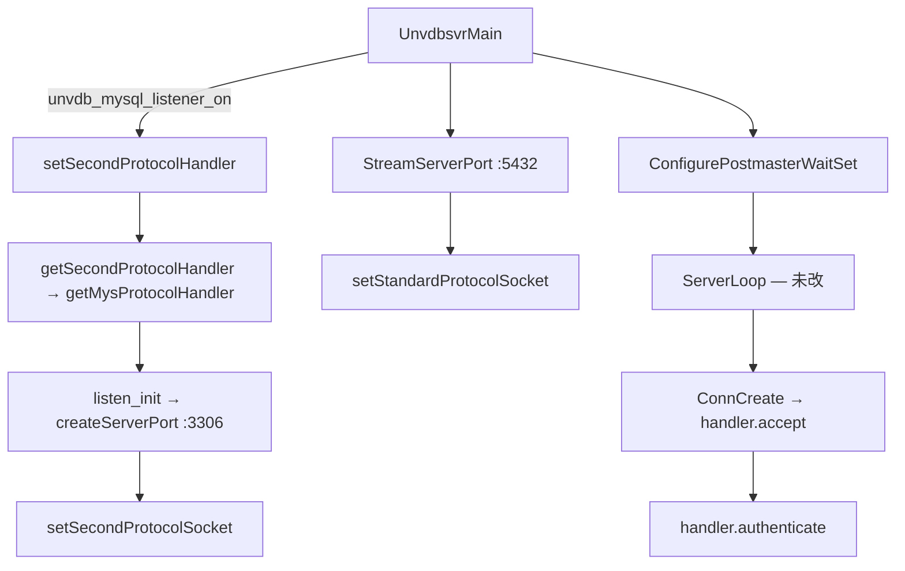
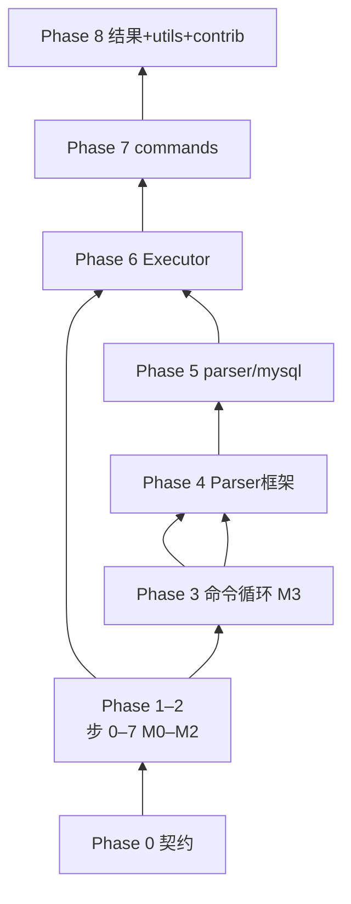

# OpenHalo → PG 16.11 MySQL 兼容移植执行计划

> **本文是移植工作的唯一执行文档**——按 commit 节奏逐步落地；研究背景见链接文档，实施以 **§1** 为准。  
> **落点 repo**：`UDB-TX-ZXZ`（PG 16.11 二次开发）；`halo-study/` 内源码树只读对照。  
> **方法论**：`.cursor/rules/openhalo-pg16-porting.mdc`（双 diff、PG16 底稿、禁止整文件 cherry-pick）

| 文档 | 关系 |
|------|------|
| [openhalo-pg14-increment-analysis.md](openhalo-pg14-increment-analysis.md) | 618 项 diff、四层分类、符号与调用链（意图源） |
| [openhalo-mysql-compatibility.md](openhalo-mysql-compatibility.md) | 八步链路、双监听机制（架构导读） |
| [pg16-mysql-baseline-plan.md](pg16-mysql-baseline-plan.md) | **已完成**的 Phase 0 契约 MR（归档参考）；占位解锁 ORDER 表仍见 baseline **§2.5.4** |
| baseline [§2.5](pg16-mysql-baseline-plan.md) | 全量拷贝意图 + `#if 0` 占位策略 |

`pg16-mysql-phase1-dual-listen-plan.md` 已合并入本文 **§1** 与附录，原文件已删档。

---

## §1 按步执行（实战）— 主阅读路径

按**实际 commit 节奏**编排（非原 M1-S1 技术依赖顺序）。每步可独立提交；编链失败时按 linker 报错补 stub，**禁止**为当前步启用后续 MR 范围（parser/tcop 命令循环等）。

### 已完成

#### 步 0 — baseline 契约层（已 merge）

| 项 | 说明 |
|----|------|
| 范围 | `parsereng.h/c` stub、10 项 MySQL GUC、`protocol_interface.h`、P2-HOLD-001–004 占位、`PostMySQLPortNumber` |
| 验收 | `make -C src/backend unvdb` 编过；`ud_ctl start` + `ud_sql -c 'SELECT 1'`；**无** 3306 监听 |
| 归档 | 详见 [pg16-mysql-baseline-plan.md](pg16-mysql-baseline-plan.md) |

#### 步 1 — adapter 整目录

| 文件 | 操作 | 为什么 |
|------|------|--------|
| `backend/adapter/mysql/*.c`（7） | 新增 | `getMysProtocolHandler`、`listen_init`、`createServerPort`、握手/认证链全量编链 |
| `include/adapter/mysql/*.h`（8） | 新增 | adapter API |
| `adapter/Makefile` ×2 | 新增 | 子目录构建 |
| `backend/Makefile` | 改 | `SUBDIRS += adapter` |

**验收**：`make -C src/backend/adapter/mysql` 编过；整目录 17 项一次性落地，禁止片段拷贝。

#### 步 1b — GUC 改名

| 文件 | 操作 | 为什么 |
|------|------|--------|
| `guc_tables.c` 等 | 改 | `halo_mysql_listener_on` → `unvdb_mysql_listener_on`（UDB 品牌一致） |

**验收**：`SHOW unvdb_mysql_listener_on` 可查；编译无退化。

#### 步 2 — unvdbsvr 四文件 + 协议虚表单参

| 文件 | 操作 | 为什么 |
|------|------|--------|
| `include/unvdbsvr/unvdbsvr2.h` | 新增 | `setSecondProtocolSocket` 等 API；adapter `#include` 依赖 |
| `backend/unvdbsvr/unvdbsvr2.c` | 新增 | `ListenHandler[]`、`getProtocolHandlerByFd`、`standard_*` 转发 |
| `backend/unvdbsvr/unvdbsvr.c` | 改 | 双监听 GUC 门控；`#include "unvdbsvr2.c"`；ConnCreate 分发（若本步已含） |
| `include/unvdbsvr/protocol_interface.h` | 改 | `fn_mainfunc` 单参签名（对齐 PG16 / UDB-TX） |
| `adapter/mysql/adapter.c` | 改 | `mainFunc` 适配单参 `fn_mainfunc` |

**验收**：`make -C src/backend unvdb` 链过；`unvdb_mysql_listener_on=on` 时 `ss` 见 3306；`ud_sql SELECT 1` 无退化。

---

### 待做

> **步 3–7 做完 = M2（mysql 客户端握手成功）**；baseline 四条 P2-HOLD（001–004）全部解开。  
> **步 8** 为可选补强。**M3+**（命令循环、`COM_QUERY`）另开 MR，见 §2 与附录 E。

#### 步 3 — libpq 声明层 + PG fd 登记

| 文件 | 操作 | 为什么 | 解锁 P2-HOLD | 验收 |
|------|------|--------|--------------|------|
| `include/libpq/pgcomm2.h` | 新增 | `standard_authenticate` / `standard_read_command` / `standard_send_message` 前向声明 | — | 编译无 error |
| `include/libpq/crypt.h` | 改 | `userLogonAuth.c` 引用 `PASSWORD_TYPE_MYS_NATIVE_PASSWORD` | **P2-HOLD-001** | enum 已出 `#if 0` |
| `backend/libpq/pqcomm.c` | 改 | PG `StreamServerPort` 成功后调 `setStandardProtocolSocket(fd)`，与 MySQL fd 共用 `ListenHandler[]` | — | PG 监听 fd 登记路径接通 |

**编链**：`make -C src/backend unvdb -j$(nproc)`

**卡点**：只解锁 P2-HOLD-001，**不**动 P2-HOLD-003；`setStandardProtocolSocket` 只写 `ListenHandler[]`，保留 PG16 已有 `ListenSocket[]` 赋值。

---

#### 步 4 — 链接辅助 stub / 导出

| 文件 | 操作 | 为什么 | 解锁 P2-HOLD | 验收 |
|------|------|--------|--------------|------|
| `include/access/printtup.h` | 改 | 导出 `DR_printtup`、`PrinttupAttrInfo` | — | 符号可链接 |
| `backend/access/common/printtup.c` | 改 | 去掉 `static` / 导出实现 | — | 同上 |
| `include/commands/mysql/mys_uservar.h` | 新增 | adapter `resetConnection` 引用 | — | 子目录编过 |
| `backend/commands/mysql/mys_uservar.c` | 新增 | `clearUserVars` 空 stub | — | 同上 |
| `backend/commands/Makefile` | 改 | `SUBDIRS += mysql` | — | `commands/mysql` 纳入构建 |

**编链**：`make -C src/backend unvdb -j$(nproc)` — `DR_printtup`、`clearUserVars` 无 undefined。

---

#### 步 5 — `Port.protocol_handler` + ConnCreate 分发

| 文件 | 操作 | 为什么 | 解锁 P2-HOLD | 验收 |
|------|------|--------|--------------|------|
| `include/libpq/libpq-be.h` | 改 | fork 后 backend 经 `Port.protocol_handler` 回调链通信 | —（baseline 无 P2-HOLD-006 占位，直接改活跃路径） | `Port` 含 `protocol_handler` 字段 |
| `backend/unvdbsvr/unvdbsvr.c` | 改 | `ConnCreate` → `getProtocolHandlerByFd` + `handler->accept`；`BackendInitialize` / `BackendRun` / `Close*` 虚表分发 | —（baseline 无 P2-HOLD-005/007/008，按 beta1 双 diff 改活跃路径） | `unvdb` 链接成功；ConnCreate 已分发 |

**ConnCreate 要点**（beta1 `postmaster.c:2588`）：

```c
port->protocol_handler = getProtocolHandlerByFd(serverFd);
if (port->protocol_handler->accept(serverFd, port) != STATUS_OK)
    ...
```

**卡点**：保留 PG16 `authn_id` / `ClientConnectionInfo` 路径；**不改** `ServerLoop` / `WaitEventSet`。

---

#### 步 6 — postinit authenticate 分发

| 文件 | 操作 | 为什么 | 解锁 P2-HOLD | 验收 |
|------|------|--------|--------------|------|
| `backend/utils/init/postinit.c` | 改 | normal 分支改 `MyProcPort->protocol_handler->authenticate`（beta1 `postinit.c:799`） | — | mysql 客户端可进入认证阶段 |

**卡点**：**不新增** `postinit2.c`；保留 PG16 `PerformAuthentication` 其余路径。

---

#### 步 7 — MySQL 密码链 + GUC 解锁（P2-HOLD-002/003/004）

按 ORDER 顺序解锁：

| 文件 | 操作 | 为什么 | 解锁 P2-HOLD | 验收 |
|------|------|--------|--------------|------|
| `backend/utils/misc/guc_tables.c` | 改 | `password_encryption` 增 `mysql_native_password` 选项 | **P2-HOLD-002** | GUC 可设 `mysql_native_password` |
| `backend/libpq/crypt.c` | 改 | `mysCheckAuth` 密码验证链 | **P2-HOLD-003** | crypt 可解析 native 密码格式 |
| `backend/utils/misc/guc.c` | 改 | `ReportGUCOption` 等与 `protocol_handler` 协同 | **P2-HOLD-004** | 编译无 error；GUC report 正常 |

**步 7 完成 = baseline 四条 P2-HOLD 全部解开。**

**M2 完整回归**：

```bash
make -C src/backend unvdb -j$(nproc)
ud_ctl -D $PGDATA restart
ud_sql -c 'SELECT 1'
mysql -h 127.0.0.1 -P 3306 -u <user> -p --protocol=TCP   # 握手 + 认证通过
ss -lntp | grep -E ':5432|:3306'
```

- [ ] mysql 客户端握手 + 认证通过
- [ ] `ud_sql SELECT 1` 无退化
- [ ] P2-HOLD-001–004 均已解锁
- [ ] `InitParserEngine` 仍 `#if 0`；`unvdb.c` ReadCommand 未改活跃路径

---

#### 步 8 — 可选补强

| 文件 | 操作 | 为什么 | 解锁 P2-HOLD | 验收 |
|------|------|--------|--------------|------|
| `backend/unvdbsvr/unvdbsvr2.c` | 改（若步 2 未含） | 文件末尾 `standard_authenticate` / `standard_read_command` / `standard_send_message` 转发 PG 函数 | — | `standard_*` 符号由 unvdbsvr2 提供 |
| `backend/libpq/pqformat.c` | 改 | MySQL 字符串分支（若 crypt 链编链需要） | — | 按 linker 需求 |
| 其他 | 按报错补 | 步 1–7 未覆盖的链接符号 | — | `make unvdb` 无 undefined |

**说明**：`standard_*` 若在步 2 已实现，本步可跳过。`pqformat.c` 仅在双 diff 显示 beta1 有增量且编链需要时修改。

---

### §1.1 编译闭包（协议入口 MR）

```
unvdbsvr.c (#include unvdbsvr2.c)
  → getMysProtocolHandler ← adapter/mysql/*.o
  → setSecondProtocolSocket ← unvdbsvr2.c
adapter.c → createServerPort → setSecondProtocolSocket
adapter.c → DR_printtup ← printtup 导出（步 4）
adapter.c → clearUserVars ← mys_uservar stub（步 4）
pqcomm.c → setStandardProtocolSocket ← unvdbsvr2.c（步 3）
```

环依赖：`unvdbsvr2.c` 前向声明 `getMysProtocolHandler`；`adapter.c` `#include unvdbsvr2.h`；**同链接单元**闭合，**无** `pgcomm2_stub.c`。

### §1.2 M1 调用链（listen 路径）



---

## §2 里程碑（M0–M3 简化表）

| 里程碑 | 对应步 / Phase | 能力 | 验收要点 |
|--------|----------------|------|----------|
| **M0** | 步 0 / Phase 0 | 编过 + `ud_ctl start` + `ud_sql SELECT 1`；默认 PG；**无** MySQL 端口 | baseline 已 merge |
| **M1** | 步 1–2 / Phase 1 | 链过 + **双端口 LISTEN**；`ud_sql` 正常 | `ss` 见 5432 与 3306 |
| **M2** | 步 3–7 / Phase 2 | mysql 客户端握手 + 认证成功 | 步 7 完成；P2-HOLD 全解 |
| **M3** | 另开 MR / Phase 3 | `COM_QUERY` + `SELECT 1`（PG parser） | 见附录 E Phase 3 |

| 级别 | 含义 |
|------|------|
| **编过** | `make -C src/backend unvdb` 无未定义符号；允许 stub |
| **链过** | `unvdb` 链接成功；postmaster ↔ adapter 循环依赖已处理 |
| **跑过** | `ud_ctl start`；该步声明能力可实测 |
| **用过** | `ud_sql` / mysql 客户端完成声明操作 |

**M4+**（MySQL 语法 / DDL / 类型 / 结果集）见附录 E Phase 4–8。

---

## §3 个人 scope 与 M2 交接

当前维护者的**个人 scope** 与团队交接约定如下（便于分工与 MR 归属，非全员硬约束）。

### 承担范围

| 范围 | 说明 |
|------|------|
| **baseline（契约层）** | 步 0 MR；**已完成 / 已 merge** |
| **unvdbsvr（postmaster）** | `unvdbsvr2`、双监听、`ConnCreate` / `Backend*` / `Close*` 虚表分发 |
| **adapter** | `adapter/mysql/*` 整目录（7 `.c` + 8 `.h`） |
| **libpq（辅）** | `pqcomm` fd 登记、`libpq-be.h`、`crypt`、`postinit` authenticate |

### 不必承担

- **M3 及以后**：tcop 命令循环真启用、`parser/mysql`、`executor`、`commands/mysql`、`contrib/aux_mysql` 等解析 / 执行 / 类型层

### 自然交接点：M2

MySQL 客户端握手成功（步 3–7：postmaster + adapter 主实现，libpq 辅）即个人 scope 的**验收边界**。M2 达成后由其他维护者接续 M3+（`COM_QUERY`、MySQL parser、`mys_executor*`、`SHOW DATABASES` 等）。

### 模块映射（UDB-TX 落点）

| 模块 | 路径 / 符号 | 个人 scope 内工作 |
|------|-------------|-------------------|
| **unvdbsvr** **主** | `unvdbsvr2`、`ConnCreate` / `Backend*` / `Close*` 分发 | 双监听 + 协议虚表挂接 |
| **adapter** **主** | `adapter/mysql/*` 整目录 | 监听、握手、认证链 |
| **libpq** **辅** | `pqcomm.c` fd 登记、`libpq-be.h`、`crypt`；`postinit` authenticate | P2-HOLD-001–004 解锁；`standard_*` 由 `unvdbsvr2.c` 提供 |

### 占位与注释

移植占位遵循 [baseline §2.5](pg16-mysql-baseline-plan.md) 与 `CLAUDE.md`：占位块、BANNER、`TODO` 用「后续修改」「待后续启用」「后续 MR」；`UNLOCK` / `ORDER` 只写符号依赖；禁止在占位 prose 中写 `Phase 0/1/2…` 等阶段编号。

### M2 之后

| 接续方 | 主要模块 | 目标里程碑 |
|--------|----------|------------|
| 其他维护者 | tcop 命令循环、`parser/mysql`、executor、utility、`aux_mysql` | **M3**（`COM_QUERY` + `SELECT 1`）→ **M4+** |

---

## 附录 A — 文件清单全表

共 **36 项**（`protocol_interface.h` baseline 沿用另计）。步号对应 **§1** commit 节奏。

### A.1 Adapter — 整目录（17 项）— 步 1 ✓

| # | UDB-TX 路径 | 步 | beta1 来源 |
|---|-------------|-----|-----------|
| 1–7 | `adapter/mysql/*.c`（7） | **1** ✓ | 同名 |
| 8–15 | `include/adapter/mysql/*.h`（8） | **1** ✓ | 同名 |
| 16–17 | `adapter/Makefile` ×2 | **1** ✓ | 同名 |

### A.2 Unvdbsvr + Libpq + GUC（12 项）

| # | UDB-TX 路径 | 步 | 关键符号 / HOLD |
|---|-------------|-----|-----------------|
| 18 | `protocol_interface.h` | 0 ✓ | `ProtocolInterface`；步 2 改 `fn_mainfunc` |
| 19 | `unvdbsvr2.h` | **2** ✓ | API |
| 20 | `unvdbsvr2.c` | **2** ✓ | `ListenHandler[]`、`standard_*` |
| 21 | `unvdbsvr.c` | **2** ✓ / **5** | 双监听；ConnCreate 分发 |
| 22 | `libpq-be.h` | **5** | `Port.protocol_handler` |
| 23 | `pgcomm2.h` | **3** | `standard_*` 声明 |
| 24 | `pqcomm.c` | **3** | `setStandardProtocolSocket` |
| 25 | `crypt.h` | **3** | P2-HOLD-001 |
| 26 | `crypt.c` | **7** | P2-HOLD-003 |
| 27 | `pqformat.c` | **8**（可选） | MySQL 字符串分支 |
| 28 | `guc_tables.c` | **7** | P2-HOLD-002 |
| 29 | `guc.c` | **7** | P2-HOLD-004 |

### A.3 Postinit + 链接辅助 + 构建（7 项）

| # | UDB-TX 路径 | 步 | 说明 |
|---|-------------|-----|------|
| 30 | `postinit.c` | **6** | authenticate 分发 |
| 31–32 | `printtup.*` | **4** | 导出 |
| 33–34 | `mys_uservar.*` | **4** | stub |
| 35 | `commands/Makefile` | **4** | |
| 36 | `backend/Makefile` | **1** ✓ | `SUBDIRS += adapter` |

---

## 附录 B — 禁止项与 PG16 陷阱

| 禁止 / 陷阱 | 原因 | 正确做法 |
|-------------|------|----------|
| adapter 片段拷贝 | 须整目录 | 17 文件一次性落地（步 1） |
| 改 `ServerLoop` / `WaitEventSet` | PG16 铁律 | 分发在 `ConnCreate`（步 5） |
| `MaxBackends` in `createServerPort` | PG16 差异 | **`MaxConnections * 2`** |
| `setStandardProtocolSocket` 双写 `ListenSocket` | 避免冲突 | PG16 赋值保留 + 只写 `ListenHandler` |
| postmaster↔adapter 环 | 循环依赖 | 前向声明 + `#include unvdbsvr2.c` + adapter SUBDIRS |
| M1 验收 mysql 客户端连接 | ConnCreate 未分发前属预期 | 步 5 前只验 `ss` LISTEN |
| `pgcomm2_stub.c` | 冗余 | `standard_*` 在 `unvdbsvr2.c` |
| uncomment `InitParserEngine` | M3+ 范围 | 保持 `#if 0` |
| `unvdb.c` ReadCommand 活跃路径 | M3 范围 | 仅链接 `standard_read_command` |
| `T_TDSProtocol`、`Port.authn_id` | beta1 遗留 / PG16 差异 | **禁止** |
| 假设 baseline 已有 P2-HOLD-005–008 | UDB-TX 实测无此占位 | 步 5 直接改活跃路径 |
| 照搬 beta1 `guc.c` 4 字段格式 | PG16 须 6 字段 | 对照 `guc_tables.c` 模板 |
| `GetStandardParserEngine` | Phase 0 不得调用 | 保持 stub |
| 改 `dest.h` 为三参 `receiveSlot` | PG16 结构 | wrapper 在 `printtup.c`（Phase 4） |
| `storage/enc/` | Halo 页加密，非 MySQL 核心 | 跳过 |

---

## 附录 C — UDB-TX 命名映射

| PG 16 / beta1 | UDB-TX |
|---------------|--------|
| `postmaster.c` / `postmaster2.c` | `unvdbsvr.c` / `unvdbsvr2.c` |
| `postmaster2.h` | `unvdbsvr2.h` |
| `postmaster/protocol_interface.h` | `unvdbsvr/protocol_interface.h` |
| `postgres.h` | `unvdb.h` |
| `PostgresMain` | `UnvdbMain` |
| `PGC_POSTMASTER` | `PGC_UNVDBSVR` |
| `POSTGRESQL_COMPAT_MODE` | `UNVDBTX_COMPAT_MODE` |
| `halo_mysql_listener_on` | `unvdb_mysql_listener_on`（步 1b） |
| `MaxBackends`（adapter backlog） | `MaxConnections` |
| `pg_ctl` / `psql` | `ud_ctl` / `ud_sql` |
| `postgres`（二进制） | `unvdb` |

完整映射表见 [UDB-TX-ZXZ/CLAUDE.md](UDB-TX-ZXZ/CLAUDE.md)。

---

## 附录 D — beta1 行号索引

| 符号 / 改动 | beta1 位置 | UDB 落点 | §1 步 |
|-------------|-----------|----------|-------|
| 双监听 GUC 门控 | `postmaster.c:1312–1319` | `unvdbsvr.c` ~`:1413` 后 | 2 ✓ |
| `#include postmaster2.c` | `postmaster.c` 末尾 | `#include "unvdbsvr2.c"` | 2 ✓ |
| `setStandardProtocolSocket` | `pqcomm.c:587` | `pqcomm.c` | 3 |
| `setSecondProtocolSocket` | `postmaster2.c:129` | `unvdbsvr2.c` | 2 ✓ |
| `getMysProtocolHandler` | `adapter.c:489` | `adapter.c` | 1 ✓ |
| `initListen` / `createServerPort` | `adapter.c:516/3697` | `adapter.c` | 1 ✓ |
| `ListenHandler[]` + `getProtocolHandlerByFd` | `postmaster2.c:152` | `unvdbsvr2.c` | 2 ✓ |
| `ConnCreate` | `postmaster.c:2588` | `unvdbsvr.c` | 5 |
| `BackendInitialize` init/start | `postmaster.c:4418/4506` | `unvdbsvr.c` | 5 |
| `BackendRun` mainfunc | `postmaster.c:4577` | `unvdbsvr.c` | 5 |
| `CloseServerPorts` 分发 | `postmaster.c:1480/2657` | `unvdbsvr.c` | 5 |
| `Port.protocol_handler` | `libpq-be.h:226` | `libpq-be.h` | 5 |
| `authenticate` / `mysCheckAuth` | `adapter.c:689` / `userLogonAuth.c:275` | 同名 | 6 |
| `postinit` authenticate | `postinit.c:799` | `postinit.c` | 6 |
| `crypt` MySQL 密码 | `crypt.h:33` / `crypt.c:148–152` | P2-HOLD-001 步 3；002/003 步 7 | 3/7 |
| `unvdbtx` + listener FATAL | `postmaster2.c:201–203` | `unvdbsvr2.c` | 2 ✓ |
| `postinit` authenticate（PG16 锚点） | — | `postinit.c:915` | 6 |
| `postgres` ReadCommand | `postgres.c:513` | `unvdb.c:497`（M3） | — |
| `elog` send_message | `elog.c:1552–1555` | `:1727`（M3） | — |
| GUC `mysql.port` | `guc.c:2451–2457` | `guc_tables.c` | 0 ✓ |
| `utility.c` include | `utility.c:3851` | 块级末尾（Phase 7） | — |
| `gen_node_support` 上限 | — | `$last_nodetag_no = 454`（Phase 4） | — |

> 行号为引用锚点；大文件漂移以符号名为准（增量分析 §0 复核说明）。

---

## 附录 E — Phase 0–8 能力索引

压缩索引；逐步细节不重复 §1。**M3+ 另开 MR。**

| Phase | 里程碑 | 一句话 | 关键路径 / 符号 |
|-------|--------|--------|-----------------|
| **0** | M0 | 契约层：GUC + `parsereng` stub + `protocol_interface.h`；无监听 | `guc_tables.c`、`parsereng.*`；baseline 已 merge |
| **1** | M1 | 双端口 LISTEN：`unvdbsvr2` + adapter `listen_init` | 步 1–2；`setSecondProtocolSocket`、`createServerPort` |
| **2** | M2 | 连接分发 + MySQL 握手认证 | 步 3–7；`ConnCreate`、`authenticate`、`crypt` 链 |
| **3** | M3 | 命令循环：`COM_QUERY` + `SELECT 1`；`COM_QUIT` 断连 | `unvdb2.c`、`postgres2` 模式；`readCommand`/`processCommand` |
| **4** | — | Parser 框架：`InitParserEngine`、`raw_parser` 分发、`printtup_create_DR` wrapper | `parsereng.c` 真实现、`protocol_nodes.h` 方案 B |
| **5** | — | MySQL Parser：`mys_gram.y`、`GetMysParserEngine` | `parser/mysql/` 全目录 |
| **6** | — | Executor + Planner：`mys_ExecutorStart`、`InitExecutorEngine` | `mys_executor*`、`planner_engine` |
| **7** | — | commands/mysql + utility：`mys_tablecmds`、`mys_utility` | `mys_uservar` 完整实现替换 stub |
| **8** | M4+ | 结果层 + ddsm + `contrib/aux_mysql` + catalog | `printTup*`、`ddsm/mysm/`、`namespace2` |

**Phase 依赖**（简图）：



**PG16 共性陷阱**（全 Phase）：NodeTag 方案 A→B；`RawParseMode` 勿重复 typedef；GUC 6 字段；不改 `ServerLoop`；`Port` 仅加 `protocol_handler`；禁止 `T_TDSProtocol`。

---

## 附录 F — 符号索引 + 证据命令

### F.1 符号索引（精简，完整见增量分析附录 B）

| 符号 | beta1 位置 | Phase / 步 |
|------|-----------|------------|
| `unvdb_mysql_listener_on` | `guc.c:613` → `guc_tables.c` | 0 / 1b |
| `PostMySQLPortNumber` | `postmaster.h` / `guc.c` | 0 |
| `database_compat_mode` | `parsereng.c:24` | 0 |
| `ProtocolInterface` | `protocol_interface.h` | 0 |
| `setStandardProtocolSocket` | `postmaster2.c:106` | 3 |
| `getSecondProtocolHandler` | `postmaster2.c:194` | 2 ✓ |
| `getProtocolHandlerByFd` | `postmaster2.c:152` | 2 ✓ → 5 |
| `getMysProtocolHandler` | `adapter.c:489` | 1 ✓ |
| `ConnCreate` | `postmaster.c:2574` | 5 |
| `authenticate` / `mysCheckAuth` | `adapter.c:690` / `userLogonAuth.c:275` | 6 |
| `mainFunc` / `readCommand` / `processCommand` | `adapter.c:805` / `:852` / `:1265` | 2 → M3 |
| `standard_read_command` | `postgres2.c` | M3 |
| `InitParserEngine` | `parsereng.c:37` | 4 |
| `GetMysParserEngine` / `GetStandardParserEngine` | `mys_parser.c:312` / `parser.c:387` | 4–5 |
| `raw_parser` | `parser.c:52` | 4 |
| `mys_transformStmt` | `mys_analyze.c:157` | 5 |
| `InitExecutorEngine` | `executor_engine.c:40` | 6 |
| `mys_ExecutorStart` | `mys_execMain.c:68` | 6 |
| `mys_standard_ProcessUtility` | `mys_utility.c:75` | 7 |
| `ATExecChangeColumn` | `mys_tablecmds.c:3594` | 7 |
| `clearUserVars` | `mys_uservar.c` | 4 stub → Phase 7 |
| `printtup_create_DR` | `printtup.c:75` | 4 |
| `printTup` | `adapter.c:1084` | 2 → 8 |
| `get_specific_namespace_oid_by_env` | `namespace2.c:72` | 8 |
| `T_MySQLProtocol` | 方案 A `#define` / 方案 B nodetags | 0–4 |

### F.2 证据命令

```bash
# 意图源：全量 diff 清单（618 项）
diff -rq postgresql-14.18 openHalo-1.0-beta1 \
  --exclude='.codegraph' --exclude='.git' --exclude='.specstory'

# 单文件意图
diff -u postgresql-14.18/<path> openHalo-1.0-beta1/<path>

# PG16 落点上下文
diff -u postgresql-14.18/<path> postgresql-16.11/<path>

# UDB-TX 落点检查
diff -u postgresql-16.11/<path> UDB-TX-ZXZ/<path>

# 双监听预检
rg 'setSecondProtocolHandler|setStandardProtocolSocket|listen_init' UDB-TX-ZXZ/src

# 握手链预检
rg -l 'getProtocolHandlerByFd|getMysProtocolHandler|protocol_handler->authenticate' UDB-TX-ZXZ/src
```

**Codegraph**（`projectPath` 必传）：

```json
{ "query": "getMysProtocolHandler createServerPort setSecondProtocolSocket", "projectPath": "/home/zxz/work/halo-study/openHalo-1.0-beta1" }
```

**双 diff 示例**：

```bash
diff -u postgresql-14.18/src/backend/adapter/mysql/adapter.c \
        openHalo-1.0-beta1/src/backend/adapter/mysql/adapter.c

diff -u postgresql-14.18/src/backend/postmaster/postmaster.c \
        openHalo-1.0-beta1/src/backend/postmaster/postmaster.c | sed -n '1310,1325p'
```

---

*唯一执行文档 — 意图源：openhalo-pg14-increment-analysis.md；架构导读：openhalo-mysql-compatibility.md；Phase 0 归档：pg16-mysql-baseline-plan.md §2.5*
