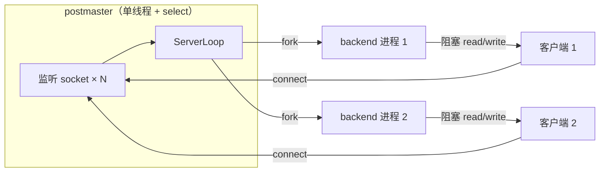
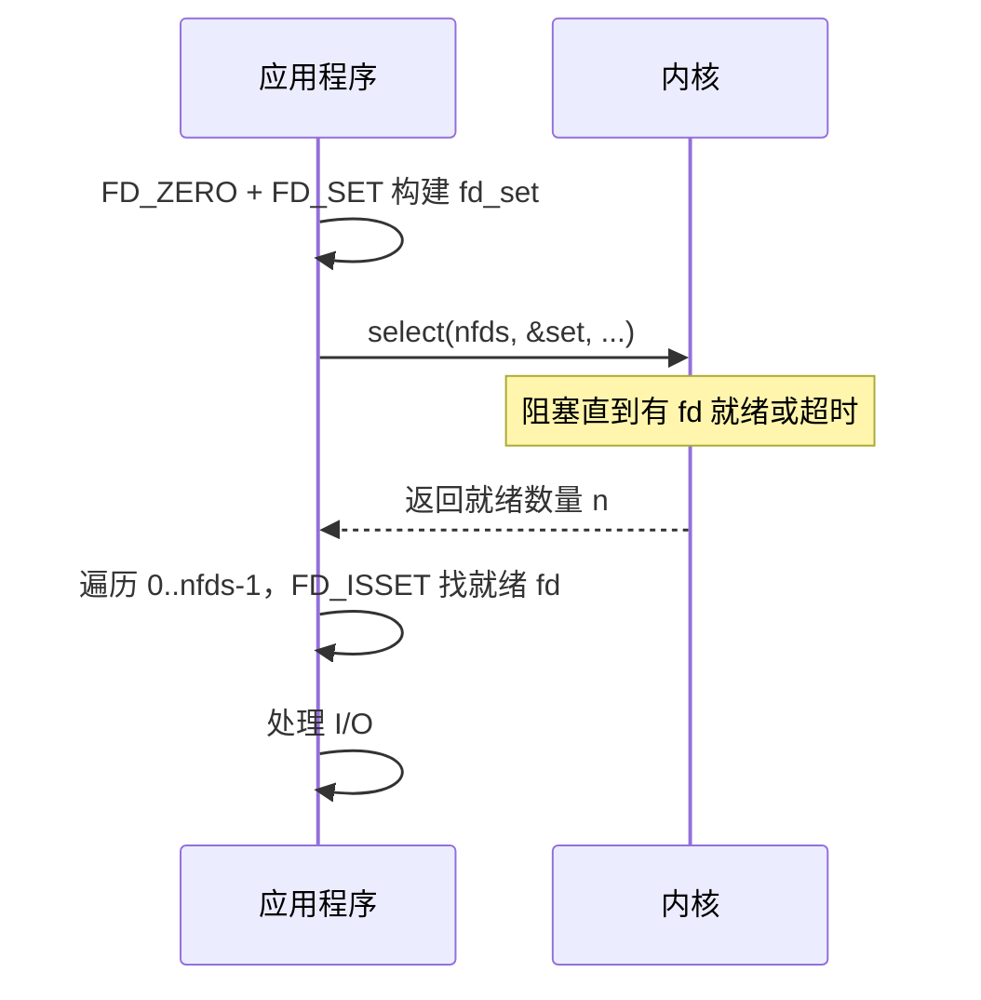
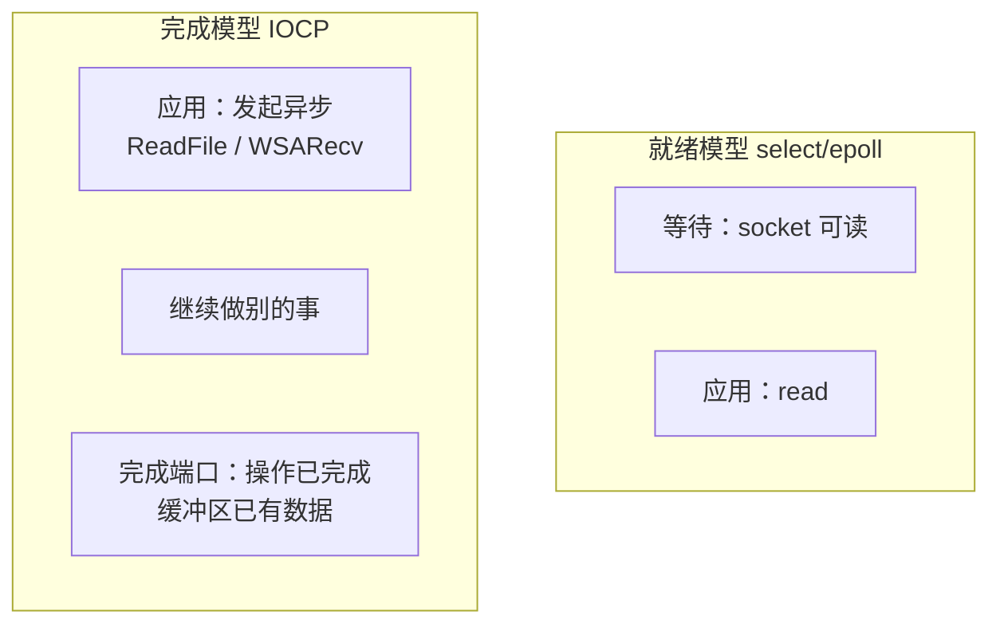

# I/O 多路复用技术指南

> **目标读者**：C 开发者，网络编程经验不多，正在学习 OpenHalo / PostgreSQL postmaster 的 `select` 监听模型。
> **阅读建议**：先通读第 1–2 节建立整体认知，再按需跳读各 API 详解，最后看第 8 节与 PG 的关系。

---

## 目录

1. [为什么需要 I/O 多路复用](#1-为什么需要-io-多路复用)
2. [演进时间线与阶段对比](#2-演进时间线与阶段对比)
3. [select](#3-select)
4. [poll](#4-poll)
5. [epoll（Linux）](#5-epolllinux)
6. [kqueue（BSD / macOS）](#6-kqueuebsd--macos)
7. [/dev/poll（Solaris）](#7devpollsolaris)
8. [Windows IOCP](#8-windows-iocp)
9. [io_uring（Linux 现代方案）](#9-io_uringlinux-现代方案)
10. [与 PostgreSQL postmaster ServerLoop 的关系](#10-与-postgresql-postmaster-serverloop-的关系)
11. [综合对比表](#11-综合对比表)
12. [记忆要点](#12-记忆要点)
13. [进一步阅读](#13-进一步阅读)

---

## 1. 为什么需要 I/O 多路复用

### 1.1 前置概念：socket 就是"网络版文件描述符"

C 开发者对文件操作不陌生：

```c
int fd = open("/tmp/data", O_RDONLY);   // 打开文件，得到 fd
read(fd, buf, 1024);                     // 从 fd 读数据
close(fd);                               // 关闭
```

网络编程也一样，套用的是同一套 Unix 机制：

```c
int fd = socket(...);    // 创建一个网络端点，返回的也是 int fd
read(fd, buf, 1024);     // 从网络读数据，和读文件一样的 API
close(fd);               // 关闭网络连接
```

**关键认知**：在 Unix/Linux 里，网络连接和普通文件没有本质区别。两者都用**文件描述符**（fd）这个整数来指代，都用 `read`/`write`/`close` 操作。差别只在于文件的数据来自磁盘，网络 socket 的数据来自另一端的主机。

### 1.2 网络连接的基础四步

一个 TCP 服务器的起步永远是四步：

```c
int listen_fd = socket(AF_INET, SOCK_STREAM, 0);   // 1. 创建 socket
bind(listen_fd, &addr, sizeof(addr));               // 2. 绑定地址和端口
listen(listen_fd, 5);                                // 3. 标记为监听状态
int client_fd = accept(listen_fd, NULL, NULL);       // 4. 接受一个客户端连接
```

#### 第一步：`socket` -- 创建一个端点

`socket()` 返回一个文件描述符。此时它只是一个**端点**，还没有绑定地址，也没有开始监听。可以想象成装了一台电话，但还没插电话线、也没拨号。

#### 第二步：`bind` -- 告诉系统"在哪个端口等"

把 socket 绑定到一个具体的地址和端口上（比如 `0.0.0.0:5432`）。这相当于把电话号码告诉电话局，现在别人可以通过这个号码找到了。

#### 第三步：`listen` -- 角色的转变

`listen(fd, 5)` 是一个**关键节点**。

调用之前，这个 socket 只是一个普通的网络端点。调用之后，内核将它的角色改变为**监听 socket**。此后它只有一个职责：接收新连接。它自己不再参与数据读写。

`listen` 的第二个参数 `5` 是 `backlog`，指定了**已完成连接队列**的最大长度。意思是：内核最多暂存 5 个已完成但尚未被 `accept` 取走的连接。超过 5 个时，后续连接要么排队、要么被拒绝。

此后内核默默维护这个队列。每当有客户端完成连接建立，就自动放入队列，等待应用程序来取。

#### 第四步：`accept` -- 从队列取一个

`accept(listen_fd)` 的职责只有一件事：**从已完成连接队列里取出一个连接**，返回一个新的文件描述符。

```
                      ┌─────────────┐
客户端1 ──连接完成──►  │ accept      │
客户端2 ──连接完成──►  │ queue       │ ◄── accept(listen_fd) 从队首取
客户端3 ──连接完成──►  │ (已完成队列) │     ──► 返回 client_fd
                      └─────────────┘
```

**为什么 accept 要返回另一个 fd**？原因在于 `listen_fd` 和 `client_fd` 有不同的职责：

| fd | 角色 | 生存期 |
|----|------|--------|
| `listen_fd`（监听 socket） | 只负责接客，永远不读写数据 | 服务器启动到关闭 |
| `client_fd`（连接 socket） | 和**这一个**客户端对话，干活用的 | 从 `accept` 返回到 `close` |

`listen_fd` 一直活着，持续接收新连接；每次 `accept` 返回的 `client_fd` 都是一个新的、独立的 fd。后续与客户端的所有数据交互，包括 `read`、`write`，都通过 `client_fd` 进行。

> **注意 `accept` 和 `read` 的返回值不同**：`accept` 返回一个**新的 fd**（整数），后续用这个 fd 代表该客户端；`read` 返回**读到的字节数**，实际数据填在传入的 `buf` 指向的内存里。两者都返回 `int`，但含义完全不同。

### 1.3 阻塞 accept 与多连接困境

#### "阻塞"到底是什么意思

调用 `accept(listen_fd)` 的时候，队列是空的怎么办？

答案是进程**睡觉**。

这是操作系统级别的挂起（而非死循环轮询/忙等）。两者有本质区别：

```
忙等（错误方式）：
  while (队列为空) {
      检查队列;          ← CPU 100%，什么都没干
  }

阻塞（实际方式）：
  检查队列 → 为空 → 向内核报告"我没活干了，把我睡了吧"
  → 内核将进程移出 CPU 运行队列
  → CPU 去跑别的进程（或者空闲省电）
  → 直到有新连接完成，内核唤醒进程，放回运行队列
  → 进程被调度到 CPU 时，accept() 返回
```

**关键认知**：

- **阻塞是默认行为**。无需设置任何 flag，`accept`/`read`/`write` 默认就阻塞。这是 Unix 的设计选择，目的就是让程序员用最简单的同步方式写代码。
- **阻塞 ≠ 忙等**。阻塞时进程不消耗任何 CPU，这是操作系统提供的高效等待机制。忙等才是真问题：CPU 空转但什么都没做。
- `read(fd, buf, len)` 的阻塞原理完全一样。内核 socket 接收缓冲区为空时进程睡眠，数据到达时唤醒。

#### 单客户端：完全合理

如果程序只服务一个客户端，整个生命周期就是一条直线：

```
accept (睡到有连接) → read (睡到有数据) → 处理 → write → 回到 accept
```

每一步阻塞都**完全合理**，反正除了这个客户端，没有别的事要做。让出 CPU 甚至是最优解。

#### 多客户端：一个 read 卡死全部

一旦要同时服务多个客户端，单线程阻塞模型就崩溃了：

```
时刻1：accept 返回了客户端 A 的 fd
时刻2：read(fd_A, ...) 阻塞，等 A 发下一个字节
时刻3：客户端 B 的连接已完成，静静躺在 accept queue 里
       客户端 C 发来了数据，静静躺在内核接收缓冲区里
       但服务器卡在 read(fd_A, ...) 上，什么都不知道
```

当服务器需要同时服务成百上千个客户端时：

```
客户端 A 正在慢慢发数据（read 阻塞）
客户端 B 已经连上但没人 accept
客户端 C 的数据已在内核缓冲区，却没人 read
```

如果只有一个线程、一个连接套在一个 `read` 上，其他连接全部饿死。一个连接的慢 I/O 堵死了全局。

### 1.4 三种经典解决思路（可并存）

| 思路 | 做法 | 解决什么 | 不解决什么 |
|------|------|----------|------------|
| **多进程/多线程 per-connection** | 每来一个连接 fork/创建一个 worker | 每个连接有独立执行流，互不阻塞 | 进程/线程数量随连接数线性增长，内存与调度开销大 |
| **I/O 多路复用** | 一个线程用 `select`/`epoll` 等同时监视多个 fd，谁就绪处理谁 | 用少量线程管理大量连接 | 处理某个就绪 fd 时，一次阻塞 `read` 就会卡死整个线程，其他就绪 fd 全部饿死（除非 fd 设为非阻塞） |
| **异步 I/O** | 提交 I/O 请求后立即返回，完成后回调（`io_uring`、IOCP） | 连"等待就绪"的轮询/阻塞都可省掉 | 编程模型复杂，生态与可移植性各异 |

#### 为什么多路复用还需要非阻塞 I/O？

上面表格提到多路复用"不解决处理某个 fd 时的阻塞问题"。这具体什么意思？用一个完整例子说明。

先搭建好 select 的监视集合，只放一个 listen_fd：

```c
fd_set read_set, rfds;
FD_ZERO(&read_set);
FD_SET(listen_fd, &read_set);
int nfds = listen_fd + 1;    // select 要求 nfds = 最大 fd + 1
```

然后进入事件循环：

```c
for (;;) {
    rfds = read_set;                                     // 每次调用前恢复
    select(nfds, &rfds, NULL, NULL, NULL);

    for (int i = 0; i < nfds; i++) {
        if (!FD_ISSET(i, &rfds)) continue;               // fd i 没就绪（位图中对应位为 0），跳过

        if (i == listen_fd) {
            /* listen_fd 就绪 → accept queue 里有新连接。
               accept 拿到 client_fd，加入监视集合，
               否则这个客户端后续发来的数据永远不会被 select 感知。 */
            int client = accept(listen_fd, NULL, NULL);
            FD_SET(client, &read_set);
            if (client + 1 > nfds) nfds = client + 1;  // 新 fd 值更大时，更新 nfds
        } else {
            /* 已连接的客户端 fd，默认是阻塞模式。
               你调用 read(i, buf, 4) 要读 4 字节。
               但客户端可能只发了 2 字节就卡住了，
               read 会一直阻塞在这里等剩余 2 字节，
               循环永远走不到下一个就绪 fd。 */
            read(i, buf, 4);   // ← 阻塞！即使 select 说"可读"也会阻塞
        }
    }
}
```

`FD_ISSET(fd, &rfds)` 只做一件事：检查 `select` 返回的位图里 fd 对应的位是否为 1。为 1 表示这个 fd **有数据可读**。

**问题出在哪？** `select` 说"可读"只承诺**至少 1 字节**，不承诺需要的 4 字节已经全部到达。而阻塞 `read(fd, buf, 4)` 的语义是"不凑齐 4 字节绝不返回"。这两者之间存在 gap。一旦某个客户端发送不完整，整个事件循环就卡死在那个 `read` 上。

**解决办法：把 client fd 设为非阻塞。** 位置在 `accept` 之后、加入监视之前：

```c
int client = accept(listen_fd, NULL, NULL);
fcntl(client, F_SETFL, O_NONBLOCK);   // 设成非阻塞
FD_SET(client, &read_set);
```

`listen_fd` 可以保持阻塞，`client_fd` 则必须设为非阻塞。两者待遇不同，根源在于 `select` 对它们的"可读"保证不一样：

| fd 类型 | select 说"可读"的含义 | 后续调用 | 如果保持阻塞会怎样 |
|---------|----------------------|----------|-------------------|
| `listen_fd` | accept queue 里**一定有**已完成连接 | `accept` | 安全，队列非空，`accept` 立即返回 |
| `client_fd` | 接收缓冲区有**至少 1 字节**数据 | `read` | 危险，需要 4 字节但可能只有 2 字节，`read` 死等 |

`listen_fd` 是安全的：只要 `select` 报告它可读，`accept` 一定不会阻塞。`client_fd` 则不同：`select` 只保证"能读"，不保证"读完所需长度"。

设为非阻塞后，`read` 的行为变了。还是 `read(fd, buf, 4)`，还是要求 4 字节，但它**不再死等**：

```c
n = read(fd, buf, 4);
if (n < 0) {
    if (errno == EAGAIN) {
        /* 内核缓冲区暂时空了，没数据可读。回到事件循环等下一轮。 */
        continue;
    }
} else if (n > 0) {
    /* n 可能是 1、2、3、4——有多少拿多少，绝不阻塞。
       如果 n=2，说明客户端只发了 2 字节，后面可能还有。
       你需要把已读的 2 字节存到应用层缓冲区（比如 conn->rbuf），
       下次 select 说这个 fd 又可读时，接着读剩下的。 */
}
```

非阻塞 `read` 从不等人。有数据就给，少一点也行；没数据立刻返回 `EAGAIN`，把控制权还给事件循环。代价是需要在应用层自己维护**读到哪里了**的状态，每次能读多少读多少，攒够了再处理完整消息。

**总结**：

| | 只用多路复用（阻塞 socket） | 多路复用 + 非阻塞 socket |
|----|----|----|
| `select` 说 fd 可读 | 知道有数据 | 知道有数据 |
| 调用 `read` | 可能阻塞（数据不够就死等） | 拿多少算多少，没数据就 `EAGAIN`，绝不阻塞 |
| 其他 fd | 被拖累，饿死 | 不受影响 |

多路复用负责"该处理谁"，非阻塞 I/O 负责"处理时不卡住"，两者各管一半，缺一不可。

---

**关键认知**：多进程模型与 I/O 多路复用**不是互斥的**，它们解决**不同层面**的问题。

- **I/O 多路复用**：回答"如何用一个线程知道**哪些 fd 现在可以读/写**？"
- **多进程 per-connection**（PG 的 fork 模型）：回答"连接进来之后，**谁去跑完整的会话逻辑**？"

PostgreSQL postmaster 正是两者结合。postmaster 用 `select` 监视少量监听 socket；一旦有新连接，**fork 一个 backend 子进程**专门服务该客户端，后续读写由子进程以阻塞方式处理，不再经过 postmaster 的多路复用。



### 1.5 非阻塞 I/O + 多路复用：通用模式

1.4 节用 `select` 展示了模式，这里提炼成通用的结论。它适用于后面要讲的所有多路复用 API（select、poll、epoll、kqueue）：

1. 所有被监视的 fd（`listen_fd` 除外）都设成 `O_NONBLOCK`
2. 多路复用返回"fd 可读了"
3. `read`，能拿多少拿多少，不够就存到应用层缓冲区，回到事件循环
4. 下次同一 fd 再次就绪时，接着读

**另一种选择：多路复用 + 多进程。** 上面的模式适用于"单线程内管理所有客户端数据读写"的场景（Nginx 就是典型）。但也可以像 PG postmaster 那样，回到 1.4 节的表格，选另一种组合。postmaster 用 `select` 只做 `accept` + `fork`，不碰客户端数据读写。读写交给 backend 子进程，每个子进程只服务一个连接，阻塞也互不影响。这就是 1.4 节说的：多路复用和多进程**不是互斥的**，各管一层。

---

## 2. 演进时间线与阶段对比

| 阶段 | 年代/背景 | 没有新技术前怎么做 | 新技术解决什么 | 遗留问题 |
|------|-----------|-------------------|----------------|----------|
| **阻塞 + 多进程** | 早期 Unix | 主进程 `accept`，每连接 `fork` 子进程 | 简单可靠，隔离性好 | 进程重、C10K 困难 |
| **select** | 1983 BSD | 无法单线程监视多 fd；或只能轮询（busy-wait） | 内核一次返回多个就绪 fd | `FD_SETSIZE` 上限；fd_set 拷贝；O(n) 扫描 |
| **poll** | SVR4（System V Release 4）/ POSIX | select 的 fd 上限与位图不便 | 用数组代替位图，无硬编码 1024 上限 | 仍 O(n) 扫描全部 pollfd |
| **/dev/poll** | Solaris | 同 poll 的扩展性瓶颈 | Solaris 特有高性能接口 | 仅 Solaris；已较少使用 |
| **kqueue** | FreeBSD 4.1 (2000) | poll 的 O(n) | 内核事件队列 + kevent，高效增删 | 主要 BSD/macOS |
| **epoll** | Linux 2.5.45 (2002) | poll/select 在万级连接下 CPU 飙高 | O(1) 增删关注、仅返回就绪事件 | Linux 专用；ET 模式易踩坑 |
| **IOCP** | Windows NT | select 在 WinSock 上语义与性能都差 | 完成端口模型，与 Windows 线程池深度集成 | Windows 专用；完成事件而非就绪事件 |
| **io_uring** | Linux 5.1 (2019) | epoll 仍有一次次系统调用开销 | 共享环形队列批量提交/收割 I/O | 较新；API 与心智模型仍在演进 |

### 演进逻辑（ASCII）

```
单连接阻塞
    │
    ▼
多进程/fork（C 少时可行，PG 仍用此处理已接受连接）
    │
    ▼
select ──► poll ──► epoll / kqueue / IOCP  （解决"如何高效等待多 fd"）
    │                    │
    │                    ▼
    │              io_uring（进一步减少 syscall 次数）
    │
    └──► 与 fork/线程池并存，各管一层
```

---

## 3. select

### 3.1 原型

```c
int select(int nfds,
           fd_set *readfds,
           fd_set *writefds,
           fd_set *exceptfds,
           struct timeval *timeout);
```

- `nfds`：所有被监视 fd 中**最大值 + 1**（不是 fd 个数）
- `readfds` / `writefds` / `exceptfds`：三个**位图**（`fd_set`），分别表示关心读、写、异常的 fd
- `timeout`：`NULL` 表示一直阻塞；`{0,0}` 表示非阻塞轮询
- 返回：就绪 fd 数量；0 表示超时；`-1` 表示错误

辅助宏：`FD_ZERO`（清空位图）、`FD_SET`（把 fd 加入位图）、`FD_CLR`（移除）、`FD_ISSET`（检查 fd 是否在就绪位图中）。

### 3.2 工作流程



### 3.3 三个著名缺陷

#### （1）`FD_SETSIZE` 上限

Linux glibc 里，`FD_SETSIZE` 默认为 **1024**。`FD_SET` 对 `fd >= FD_SETSIZE` 的 fd 是**未定义行为**。可通过重新编译 glibc 或换用 `poll`/`epoll` 绕过，但可移植代码通常遵守 1024 限制。

#### （2）fd_set 在内核与用户态之间拷贝

`select` 是系统调用，用户态和内核态各自拥有一块独立内存。调用过程分两步拷贝：

```
用户态                         内核态
──────                         ──────
readmask（主副本，不变）
    │
    ├── rmask = readmask ──►   select(nfds, &rmask, ...)
    │                          kernel 读 rmask：「我关心 fd 0,3,5」
    │                          kernel 等待...
    │                          fd 3 就绪了
    │                          kernel 修改 rmask：清空所有位，只保留 fd 3 的位
    │   ◄── 拷贝回用户态 ──     rmask 现在只包含 fd 3
    │
FD_ISSET(3, &rmask) → 1
FD_ISSET(0, &rmask) → 0（被内核清掉了！）
```

关键：内核**覆写**传入的 `fd_set`，调用前的内容被销毁。所以不能只用一个 `fd_set` 反复传，否则下一轮 select 会丢失监视的全部 fd。正确的做法是保留一份**主副本**（`readmask`），每次调用前拷贝过去：

```c
fd_set rmask, readmask;
/* 初始化 readmask 一次 */
FD_ZERO(&readmask);
FD_SET(fd_0, &readmask);
FD_SET(fd_3, &readmask);
FD_SET(fd_5, &readmask);

for (;;) {
    rmask = readmask;          /* 从主副本恢复：fd 0,3,5 */
    select(nfds, &rmask, ...);  /* 内核覆写 rmask：只剩就绪的 fd */
    /* 此时 rmask 已损坏，下一轮必须重新从 readmask 拷贝 */
}
```

PG postmaster 的 `ServerLoop` 正是这个模式（用 `memcpy` 而非结构体赋值，见第 10 节）。

> **拷贝问题的演进**：除 io_uring 外，所有多路复用每次调用都涉及内核与用户态之间的数据搬运，差别只在搬多少。select 和 poll 每次要拷贝**全量关注列表**（O(N)，N = 监视总数）。epoll/kqueue 靠"注册一次、反复等待"把关注列表留在内核，每次只拷回**就绪事件**（O(K)，K = 就绪数）。io_uring 用共享内存环形队列，彻底消除拷贝（见第 5、6、9 节）。

#### （3）O(n) 扫描

- 内核：扫描 0 到 `nfds-1` 的所有位
- 用户态：返回后用 `FD_ISSET` 再扫一遍

监视的 fd 少时（个位数到几十个），这完全可接受。fd 上万时，CPU 就浪费在"扫描未就绪的 fd"上了。

### 3.4 优点（为何至今仍常见）

- **POSIX 标准**，几乎所有平台都有（含 Windows Winsock（Windows Sockets API），语义略有差异）
- API 简单，适合 fd 数量极少的场景
- 跨平台库（如 libevent 的早期后端）普遍支持

---

## 4. poll

### 4.1 原型

```c
struct pollfd {
    int   fd;        /* 要监视的 fd；-1 表示忽略此项 */
    short events;    /* 关心的事件：POLLIN、POLLOUT 等 */
    short revents;   /* 返回时由内核填写实际发生的事件 */
};

int poll(struct pollfd *fds, nfds_t nfds, int timeout);
```

### 4.2 相对 select 的改进

| 点 | select | poll |
|----|--------|------|
| fd 上限 | `FD_SETSIZE`（通常 1024） | 仅受 `RLIMIT_NOFILE` 等系统限制 |
| 数据结构 | 位图 `fd_set` | `struct pollfd` 数组 |
| 添加 fd | 改位图 + 可能调整 nfds | 数组中加一项 |
| 返回结果 | 覆盖传入的 fd_set | 写入每项的 `revents` |

### 4.3 仍存在的问题：拷贝 + O(n) 扫描

poll 解决了 select 的 fd 上限问题，但 select 的后两个缺陷它都没能解决。

**（1）每次调用仍要拷贝整个数组。** 和 select 的 `fd_set` 拷贝一样，用户态把整个 `pollfd` 数组传给内核，内核遍历后回写 `revents`。数组多大就拷多少，调用越频繁，拷贝开销越大。

**（2）O(n) 扫描。** 内核仍要遍历整个 `fds` 数组（长度 `nfds`），连接数 N 很大时开销线性增长。

根本原因在于 poll 没有"注册一次、反复等待"的持久句柄概念。每次都要把**全部**关注列表拷贝进内核，内核每次也要从头扫描。这个双重开销正是 epoll 要解决的核心问题。

`ppoll` 是 `poll` 的增强版（可纳秒级超时、信号掩码），本质局限相同。

### 4.4 使用示例

```c
#define MAX_FDS 1024

struct pollfd fds[MAX_FDS];
fds[0].fd = listen_fd;
fds[0].events = POLLIN;           // 关心可读事件
int nfds = 1;

for (;;) {
    int n = poll(fds, nfds, -1);   // -1 = 一直阻塞直到有事件
    if (n < 0) { /* 错误处理 */ break; }

    for (int i = 0; i < nfds; i++) {
        if (!(fds[i].revents & POLLIN)) continue;  // 不是可读事件，跳过

        if (fds[i].fd == listen_fd) {
            int client = accept(listen_fd, NULL, NULL);
            fcntl(client, F_SETFL, O_NONBLOCK);
            fds[nfds].fd = client;
            fds[nfds].events = POLLIN;
            nfds++;
        } else {
            char buf[4096];
            n = read(fds[i].fd, buf, sizeof(buf));
            if (n <= 0) {
                /* 连接关闭或出错：把最后一项移到当前位置，收缩数组 */
                close(fds[i].fd);
                fds[i] = fds[nfds - 1];
                nfds--;
                i--;              // 回退，检查刚移过来的项
            } else {
                /* 处理读到的数据 */
            }
        }
    }
}
```

和 select 相比，poll 代码少了 `FD_ZERO`/`FD_SET`/`FD_ISSET` 那套位图操作，添加新 fd 直接在数组末尾追加即可。但连接关闭时删除中间项需要指针搬运（上面的 `fds[i] = fds[nfds-1]`），这是数组结构的固有代价。

---

## 5. epoll（Linux）

> **适用**：Linux 2.6+，高并发网络服务的首选之一（Nginx、Redis、Node.js libuv 等在 Linux 上默认用它）。

### 5.1 三个系统调用

```c
int epoll_create1(int flags);           /* 创建 epoll 实例 */
int epoll_ctl(int epfd, int op, int fd, struct epoll_event *event);
                                        /* EPOLL_CTL_ADD/MOD/DEL */
int epoll_wait(int epfd, struct epoll_event *events,
               int maxevents, int timeout);
```

**核心思想**：把"关心哪些 fd"通过 `epoll_ctl` **注册进内核**，之后 `epoll_wait` 只返回**就绪的** fd，无需每次传递全量列表。

### 5.2 内核数据结构（理解用，非调用必需）

Linux 内核 epoll 实现（经典 2.6 设计）大致包含：

```
epoll 实例
├── 红黑树：存所有被监视的 fd（O(log n) 增删）
├── 就绪链表：当前可读的 fd 挂在这里
└── 回调：当某 socket 收到数据，内核把对应 epitem 链到就绪链表
```

另有 **eventfd** 等可纳入 epoll 监视，用于线程间唤醒（与网络 fd 统一事件源）。

### 5.3 水平触发（LT）与边缘触发（ET）

这是 epoll 的一个关键设计选择，直接影响代码的组织方式。

#### 两种模式对比

| 模式 | 行为 | 类比 |
|------|------|------|
| **LT**（Level Trigger，默认） | 只要 fd 上仍有未读数据，每次 `epoll_wait` 都会报告 | 水龙头没关紧，一直滴水就一直提醒 |
| **ET**（Edge Trigger） | 仅在状态**从未就绪 → 就绪**的边沿通知一次 | 门铃只响一次，必须一次拿完 |

#### LT 是怎么工作的

LT 是默认模式，行为最接近 `select`/`poll`，没读完就反复通知，很宽容：

```c
/* LT 模式：数据没读完，下次 epoll_wait 还会通知 */
ev.events = EPOLLIN;                         // 默认就是 LT
epoll_ctl(epfd, EPOLL_CTL_ADD, fd, &ev);

/* epoll_wait 返回 fd 可读 */
n = read(fd, buf, sizeof(buf));              // 只读了 100 字节
/* 内核缓冲区还剩 200 字节没读。没关系——下次 epoll_wait 还会通知这个 fd。 */
```

好处是即使配了阻塞 socket，也不容易出致命 bug（1.4 节说的阻塞风险仍然存在，但在 LT 下不会丢事件）。代码写起来和 `select` 几乎一样，迁移成本低。

#### ET 是怎么工作的

ET 只在数据**从无到有**的那一刻通知一次。之后不管读没读完，都不会再通知，除非有新数据到达：

```c
/* ET 模式：必须一次清空缓冲区，否则剩余数据永远压在缓冲区内 */
struct epoll_event ev;
ev.events = EPOLLIN | EPOLLET;
ev.data.fd = fd;
epoll_ctl(epfd, EPOLL_CTL_ADD, fd, &ev);

/* epoll_wait 返回 fd 可读——只有这一次通知 */
while (1) {
    n = read(fd, buf, sizeof(buf));
    if (n < 0) {
        if (errno == EAGAIN) break;          // 缓冲区空了，读完
        /* 错误处理 */
    }
    if (n == 0) { /* EOF */ break; }
    /* 处理数据 */
}
/* 必须读到 EAGAIN 才停。如果提前退出循环，剩余数据就丢了。 */
```

两个硬性要求：

1. fd **必须是非阻塞的**。ET 要求读到 `EAGAIN` 才停，但阻塞 fd 永远不返回 `EAGAIN`。读空缓冲区后下一次 `read` 会一直睡到有新数据到达为止，在这期间整个事件循环卡死。
2. 必须循环 `read` 到 `EAGAIN`。提前退出意味着缓冲区里剩余的数据不会再触发通知（ET 只在"从无到有"时通知一次），数据就丢了。

#### 什么时候用哪个

| 场景 | 推荐 | 原因 |
|------|------|------|
| 初学者、原型、工具脚本 | LT | 行为直观，写错了不会丢事件 |
| fd 数量少（几十个以内） | LT | LT 多出来的 `epoll_wait` 返回次数开销可忽略 |
| 高并发长连接服务器（Nginx、Redis） | ET | 每个连接只通知一次，`epoll_wait` 返回次数大幅减少，省 syscall |
| 需要精确控制读写速率 | ET | 停止时机由代码控制，而非内核催促 |
| 需要兼容 select/poll 迁移 | LT | 行为最接近，改造成本最低 |

**实际案例**：
- **Nginx** -- 默认使用 ET。单个 worker 管理上万连接，LT 下 `epoll_wait` 会反复报告同一批未读完的 fd，syscall 开销不可接受
- **Redis** -- 默认使用 ET。单线程事件循环 + 非阻塞 I/O，ET 的"一次通知读到尽"正好匹配其单线程模型
- **libevent** -- 默认使用 LT。作为通用事件库，追求兼容性和易用性，LT 更不容易引发用户 bug

高并发服务器青睐 epoll 的原因：

1. **O(1)** 地返回就绪事件（与总监听数 N 解耦，与就绪数相关）
2. 无需每次拷贝整个 fd 集合
3. ET 可减少 `epoll_wait` 返回次数（但编程更挑剔）

### 5.4 使用示例（LT 模式）

```c
int epfd = epoll_create1(0);
struct epoll_event ev, events[64];

/* 把 listen_fd 加入监视 */
ev.events = EPOLLIN;                  // 默认 LT
ev.data.fd = listen_fd;
epoll_ctl(epfd, EPOLL_CTL_ADD, listen_fd, &ev);

for (;;) {
    int n = epoll_wait(epfd, events, 64, -1);
    for (int i = 0; i < n; i++) {
        int fd = events[i].data.fd;   // 从就绪事件里取出 fd

        if (fd == listen_fd) {
            int client = accept(listen_fd, NULL, NULL);
            fcntl(client, F_SETFL, O_NONBLOCK);
            ev.events = EPOLLIN;
            ev.data.fd = client;
            epoll_ctl(epfd, EPOLL_CTL_ADD, client, &ev);
        } else {
            char buf[4096];
            int nr = read(fd, buf, sizeof(buf));
            if (nr <= 0) {
                epoll_ctl(epfd, EPOLL_CTL_DEL, fd, NULL);
                close(fd);
            } else {
                /* 处理读到的数据 */
            }
        }
    }
}
```

关键点：
- `events[i].data.fd` 就是当初 `epoll_ctl` 注册时填入的 fd，内核原样返回。不需要像 select/poll 那样遍历全部 fd 来找"谁就绪了"。`epoll_wait` 返回的数组里**每个元素都是就绪的**。
- 连接关闭时调 `EPOLL_CTL_DEL` 从内核注销。内核的红黑树会自动清理，再也不会收到这个 fd 的事件。
- 这个例子用 LT 模式，迁移到 ET 只需把 `EPOLLIN` 改成 `EPOLLIN | EPOLLET`，然后在 `read` 外裹一层读到 `EAGAIN` 的循环。

---

## 6. kqueue（BSD / macOS）

### 6.1 原型

```c
int kqueue(void);
int kevent(int kq,
           const struct kevent *changelist, int nchanges,
           struct kevent *eventlist, int nevents,
           const struct timespec *timeout);
```

`kevent` 一次调用可同时**提交变更**（注册/删除关注）和**取出事件**。
不仅支持 socket，还支持文件、进程、信号、定时器（`EVFILT_TIMER`）等，比 epoll 覆盖面更广。

### 6.2 与 epoll 的对比直觉

| | epoll | kqueue |
|---|-------|--------|
| 平台 | Linux | FreeBSD、OpenBSD、macOS 等 |
| 注册/等待 | `epoll_ctl` + `epoll_wait` | 常合并到 `kevent` |
| 触发模式 | LT / ET | 类似 LT 的"过滤器"语义 |
| 非 socket 事件 | 主要靠 eventfd 等扩展 | 原生支持多种过滤器 |

在 macOS 上写高性能服务器，kqueue 的地位相当于 Linux 上的 epoll。

### 6.3 使用示例

```c
int kq = kqueue();

/* 注册 listen_fd */
struct kevent changes[1];
EV_SET(&changes[0], listen_fd, EVFILT_READ, EV_ADD, 0, 0, NULL);
kevent(kq, changes, 1, NULL, 0, NULL);

struct kevent events[64];
for (;;) {
    int n = kevent(kq, NULL, 0, events, 64, NULL);
    for (int i = 0; i < n; i++) {
        int fd = (int)events[i].ident;     // kevent 用 ident 标识 fd
        if (fd == listen_fd) {
            int client = accept(listen_fd, NULL, NULL);
            fcntl(client, F_SETFL, O_NONBLOCK);
            EV_SET(&changes[0], client, EVFILT_READ, EV_ADD, 0, 0, NULL);
            kevent(kq, changes, 1, NULL, 0, NULL);
        } else {
            char buf[4096];
            int nr = read(fd, buf, sizeof(buf));
            if (nr <= 0) {
                EV_SET(&changes[0], fd, EVFILT_READ, EV_DELETE, 0, 0, NULL);
                kevent(kq, changes, 1, NULL, 0, NULL);
                close(fd);
            } else {
                /* 处理读到的数据 */
            }
        }
    }
}
```

和 epoll 的结构几乎一样，区别在于：
- `kevent` 一次调用同时处理**注册变更**（`changelist`）和**等待事件**（`eventlist`）。上面把 `EV_ADD` 和 `EV_DELETE` 作为变更立即提交（`nevents=0`），事件等待则在循环头部的 `kevent(..., events, 64, ...)` 中完成
- 就绪事件用 `events[i].ident` 获取 fd，而非 epoll 的 `events[i].data.fd`
- kqueue 原生支持 `EVFILT_TIMER`（定时器）、`EVFILT_PROC`（进程监控）等过滤器，无需像 Linux 那样用 eventfd 组合

---

## 7. /dev/poll（Solaris）

Solaris 提供的 `/dev/poll` 字符设备接口：用户态写入监视的 poll 结构，通过 `ioctl` 等待事件。
设计目标与 epoll 类似：避免每次传递完整 poll 数组。
随着 Solaris 市场份额下降以及 `event ports` 等更新 API 出现，`/dev/poll` 在业界讨论度已很低。
可以说它是"又一个想干掉 poll O(n) 的 Solaris 方案"。

---

## 8. Windows IOCP

**I/O Completion Port**（完成端口）是 Windows 高性能 I/O 的核心机制。与 Linux 的"就绪模型"（readable/writable）不同，IOCP 是**完成模型**：

- 发起异步读/写（Overlapped I/O）
- 操作**完成后**，内核把结果放入完成端口队列
- 线程池从端口取完成包继续处理



### 使用示例

```c
/* 每个连接的状态：重叠结构 + 缓冲区 */
typedef struct {
    OVERLAPPED ov;
    SOCKET sock;
    char buf[4096];
    WSABUF wsa_buf;
} conn_t;

HANDLE iocp = CreateIoCompletionPort(INVALID_HANDLE_VALUE, NULL, 0, 0);

/* 将 listen socket 关联到完成端口（key=0 标记为监听事件） */
CreateIoCompletionPort((HANDLE)listen_fd, iocp, 0, 0);

/* 进循环之前，先投递第一个异步 accept，否则循环里无事可等 */
conn_t *pending_accept = calloc(1, sizeof(conn_t));
AcceptEx(listen_fd, pending_accept->sock, /* ... 参数省略 ... */,
         &pending_accept->ov);

for (;;) {
    DWORD bytes;
    ULONG_PTR key;
    OVERLAPPED *ov;

    /* 等待任意 I/O 操作完成（阻塞直到有结果） */
    GetQueuedCompletionStatus(iocp, &bytes, &key, &ov, INFINITE);

    if (key == 0) {
        /* key=0 → listen socket 上的 AcceptEx 完成 */
        conn_t *conn = pending_accept;
        CreateIoCompletionPort((HANDLE)conn->sock, iocp, (ULONG_PTR)conn, 0);
        /* 立即投递这个新连接的异步 WSARecv */
        conn->wsa_buf.buf = conn->buf;
        conn->wsa_buf.len = sizeof(conn->buf);
        WSARecv(conn->sock, &conn->wsa_buf, 1, NULL, 0, &conn->ov, NULL);

        /* 重新投递下一个 AcceptEx，为下一个客户端做准备 */
        pending_accept = calloc(1, sizeof(conn_t));
        AcceptEx(listen_fd, pending_accept->sock, /* ... */,
                 &pending_accept->ov);
    } else {
        /* key=conn → 某个客户端连接的 I/O 完成了 */
        conn_t *conn = (conn_t *)key;
        if (bytes == 0) { closesocket(conn->sock); free(conn); }
        else {
            /* conn->buf 里已有 bytes 字节数据，直接处理 */
            /* 处理完后再次投递 WSARecv 等下一次数据到达 */
            WSARecv(conn->sock, &conn->wsa_buf, 1, NULL, 0, &conn->ov, NULL);
        }
    }
}
```

和 epoll 的最大区别：epoll 返回"可以读了"，还需自己调 `read`；IOCP 返回"已经读完了，数据在 `conn->buf` 里"。**内核代为执行了 read**。

API 对应关系：

| IOCP API | Unix 对应 | 说明 |
|----------|----------|------|
| `AcceptEx` | `accept` | 功能一样。但 AcceptEx 是**异步**的，调用后立即返回，结果通过完成端口通知 |
| `WSARecv` / `ReadFile` | `read` | 功能一样。同样是异步的，数据由内核直接写入指定的缓冲区 |
| `CreateIoCompletionPort(fd, iocp, key)` | `epoll_ctl(ADD)` | 把 fd 关联到完成端口，这个 fd 上的异步操作完成后，结果会放到 iocp |
| `GetQueuedCompletionStatus` | `epoll_wait` / `select` | **真正的等待**，阻塞直到有 I/O 操作完成，而非等到 fd "可操作" |

PostgreSQL 在 Windows 上仍用 Winsock 的 `select` 做 postmaster 监听（与 Unix 代码路径类似），但 Windows 生态里大规模服务更常选 IOCP（IIS、C# `SocketAsyncEventArgs` 等）。

---

## 9. io_uring（Linux 现代方案）

### 9.1 解决什么问题

即使 epoll 已经很高效，高 IOPS（每秒 I/O 操作数）场景下**系统调用次数**本身仍是瓶颈：

```
read/write/connect/accept  each ──► syscall
epoll_wait                 ──► syscall
```

**io_uring**（Linux 5.1+，持续演进）通过**共享内存环形队列**让用户态与内核批量交换 I/O 请求与完成事件，大幅减少 syscall，并统一文件 I/O、网络、超时等操作。

### 9.2 核心结构

io_uring 在用户态和内核态之间建立**两块共享内存环形缓冲区**：

```
用户态                              内核态
──────                              ──────

SQ（Submission Queue，提交队列）
┌───┬───┬───┬───┐
│ S │ S │ S │   │  ──►  内核消费 SQE，执行 I/O 操作
│ Q │ Q │ Q │   │         （accept / read / write / ...）
│ E │ E │ E │   │
└───┴───┴───┴───┘

CQ（Completion Queue，完成队列）
┌───┬───┬───┬───┐
│ C │ C │ C │   │  ◄──  内核填入 CQE，报告执行结果
│ Q │ Q │ Q │   │         （返回值、错误码、user_data）
│ E │ E │ E │   │
└───┴───┴───┴───┘
```

流程：用户态往 SQ 里写 SQE（Submission Queue Entry，提交队列项）→ `io_uring_submit` 通知内核（**一次 syscall**）→ 内核消费 SQ，执行 I/O → 往 CQ 写 CQE（Completion Queue Entry，完成队列项）→ 用户态从 CQ 取 CQE，处理结果。

和 epoll 的本质区别：epoll 用户态和内核态各自持有独立的数据结构（红黑树、就绪链表），每次交互需要 syscall 拷贝。io_uring 的 SQ/CQ 是**同一块物理内存，映射到两个地址空间**。用户态写了 SQE，内核直接就能看到，反之亦然。没数据拷贝，只有必要时的通知。

常用库：`liburing`（官方辅助库），封装了 ring 初始化和 SQE/CQE 操作。

### 9.3 使用示例

```c
char buf[4096];
struct io_uring ring;
io_uring_queue_init(256, &ring, 0);     // 256 = SQ/CQ 槽位数

/* ===== 第一步：投递第一个异步 accept ===== */
struct io_uring_sqe *sqe = io_uring_get_sqe(&ring);    // 从 SQ 取一个空 SQE
io_uring_prep_accept(sqe, listen_fd, NULL, NULL, 0);    // 填写：我要做异步 accept
io_uring_sqe_set_data(sqe, NULL);       // 附加数据 NULL → 回调时知道"这是 accept"
io_uring_submit(&ring);                 // 通知内核：有活了，开始干

for (;;) {
    /* ===== 第二步：等一个 I/O 操作完成 ===== */
    struct io_uring_cqe *cqe;
    io_uring_wait_cqe(&ring, &cqe);     // 阻塞直到有 CQE 可用
    /* CQE 里有什么？
       cqe->res      — 操作结果（accept 返回新 fd，read 返回字节数）
       cqe->user_data — 当初塞进去的附加数据，用来区分"谁完成了" */

    void *tag = io_uring_cqe_get_data(cqe);
    int res = cqe->res;
    io_uring_cqe_seen(&ring, &cqe);      // 标记 CQE 已消费，释放槽位

    if (tag == NULL) {
        /* ===== accept 完成 ===== */
        int client = res;                // res 就是新 client_fd
        fcntl(client, F_SETFL, O_NONBLOCK);

        /* 投递异步 read：读这个客户端的数据 */
        sqe = io_uring_get_sqe(&ring);
        io_uring_prep_read(sqe, client, buf, sizeof(buf), 0);
        io_uring_sqe_set_data(sqe, (void *)(intptr_t)client);
        io_uring_submit(&ring);

        /* 同时投递下一个异步 accept（为下一个客户端准备） */
        sqe = io_uring_get_sqe(&ring);
        io_uring_prep_accept(sqe, listen_fd, NULL, NULL, 0);
        io_uring_sqe_set_data(sqe, NULL);
        io_uring_submit(&ring);
    } else {
        /* ===== read 完成 ===== */
        int client = (int)(intptr_t)tag;  // tag 就是当初的 client fd
        if (res <= 0) {
            close(client);
            /* 不需要像 epoll 那样 EPOLL_CTL_DEL——没投递就不会有完成事件 */
        } else {
            /* 数据已在 buf，res 是字节数，直接处理 */
            /* 处理完后投递下一个 read */
            sqe = io_uring_get_sqe(&ring);
            io_uring_prep_read(sqe, client, buf, sizeof(buf), 0);
            io_uring_sqe_set_data(sqe, (void *)(intptr_t)client);
            io_uring_submit(&ring);
        }
    }
}
```

### 9.4 与其他 API 的对比

| API | 心智模型 | I/O 谁执行 | 关键等待函数 | 每次等待返回什么 |
|-----|---------|----------|-------------|----------------|
| select / poll | 哪些 fd 就绪了 | 自己调 read/write | `select` / `poll` | 就绪 fd 列表，需自己扫 |
| epoll / kqueue | 哪些 fd 就绪了 | 自己调 read/write | `epoll_wait` / `kevent` | 就绪 fd 列表，已筛选好 |
| IOCP | I/O 操作完成了吗 | **内核**代为执行 | `GetQueuedCompletionStatus` | 完成包：操作结果 + 数据已在缓冲区 |
| io_uring | I/O 操作完成了吗 | **内核**代为执行 | `io_uring_wait_cqe` | CQE：操作结果 + 数据已在缓冲区 |

**批量提交**是 io_uring 另一个独特优势。上面的示例每投一个 SQE 就调一次 `io_uring_submit`，但实际可以攒一批 SQE 后**一次 submit 全部提交**：

```c
/* 一次提交多个 I/O 请求，只触发一次 syscall */
sqe = io_uring_get_sqe(&ring);
io_uring_prep_read(sqe, fd1, buf1, 4096, 0);
io_uring_sqe_set_data(sqe, (void *)1);

sqe = io_uring_get_sqe(&ring);
io_uring_prep_read(sqe, fd2, buf2, 4096, 0);
io_uring_sqe_set_data(sqe, (void *)2);

sqe = io_uring_get_sqe(&ring);
io_uring_prep_accept(sqe, listen_fd, NULL, NULL, 0);
io_uring_sqe_set_data(sqe, NULL);

io_uring_submit(&ring);  // 一次 syscall，三个 I/O 全提交了
```

对 PG postmaster 这类"监视个位数 listen socket"的场景，io_uring **没有明显收益**；对追求极限 IOPS 的存储引擎更有吸引力。

---

## 10. 与 PostgreSQL postmaster ServerLoop 的关系

### 10.1 postmaster 在做什么

postmaster 是 PG 的**守护父进程**，职责包括：

- 监听 TCP/Unix socket，接受新连接
- fork / 管理 backend、background writer、checkpointer 等子进程
- 自身**不执行 SQL**

主循环是 `ServerLoop()`（`src/backend/postmaster/postmaster.c`），注释写明这是 postmaster 的 **idle loop**。

### 10.2 代码路径（PG 14.18）

**初始化监视集合** -- `initMasks`：

```c
static int initMasks(fd_set *rmask)
{
    int maxsock = -1;
    FD_ZERO(rmask);
    for (i = 0; i < MAXLISTEN; i++) {
        int fd = ListenSocket[i];
        if (fd == PGINVALID_SOCKET) break;
        FD_SET(fd, rmask);
        if (fd > maxsock) maxsock = fd;
    }
    return maxsock + 1;   /* 即 select 的 nfds 参数 */
}
```

**主循环** -- 核心片段：

```c
nSockets = initMasks(&readmask);
for (;;) {
    memcpy(&rmask, &readmask, sizeof(fd_set));
    DetermineSleepTime(&timeout);
    selres = select(nSockets, &rmask, NULL, NULL, &timeout);

    if (selres > 0) {
        for (i = 0; i < MAXLISTEN; i++) {
            if (FD_ISSET(ListenSocket[i], &rmask)) {
                port = ConnCreate(ListenSocket[i]);  /* 内部 accept */
                if (port) {
                    BackendStartup(port);            /* fork backend */
                    StreamClose(port->sock);
                    ConnFree(port);
                }
            }
        }
    }
    /* 另：检查并启动 bgwriter、checkpointer、syslogger 等 */
}
```

### 10.3 为何 PG 仍用 select 且完全合理

| 因素 | PG 实际情况 | 对 API 选择的影响 |
|------|-------------|-------------------|
| 监视的 fd 数量 | 仅 `ListenSocket[]`，通常几个（IPv4/IPv6/Unix） | O(n) 扫描 n≈3，开销可忽略 |
| 连接处理模型 | `accept` 后立即 `fork`，**不在 postmaster 里 multiplex 客户端 socket** | 不需要 epoll 管理万级连接 |
| 可移植性 | 需支持 Linux、BSD、macOS、Windows 等 | `select` 几乎到处可用 |
| 代码年龄与风险 | 核心路径稳定数十年 | 换成 epoll 收益极小、回归风险大 |
| 循环内还有别的工作 | 启动子进程、检查锁文件、touch socket 等 | `select` 带超时正好驱动周期性任务 |

**对比**：Nginx worker 在**单进程内**维持成千上万**已建立**的连接，必须用 epoll/kqueue；PG 把已建立连接扔给独立 backend 进程，postmaster 只当"门卫"。

### 10.4 两层架构再强调

```
层次 1 — postmaster：select 监听少量 listen fd → 新连接到来 → fork
层次 2 — backend 进程：单客户端会话，传统阻塞 read/write，直到断开
```

OpenHalo 继承同一 postmaster 架构；读取MySQL协议适配时，backend 里会有 `T_MySQLProtocol` 分支，但 **postmaster 监听层仍走 PG 的 select 模型**。

### 10.5 ServerLoop 在系统中的位置（ASCII）

```
                    ┌─────────────────────────────┐
                    │         postmaster          │
                    │  ┌───────────────────────┐  │
  listen fd(s) ────►│  │ ServerLoop + select() │  │
                    │  └──────────┬────────────┘  │
                    │             │ accept+fork   │
                    └─────────────┼───────────────┘
                                  │
              ┌───────────────────┼───────────────────┐
              ▼                   ▼                   ▼
        backend 进程          bgwriter           checkpointer
        (每连接一个)          (后台写缓冲)        (检查点)
              │
              ▼
        客户端 TCP 会话（阻塞 I/O，可跑 PG 或 MySQL 协议）
```

---

## 11. 综合对比表

| 机制 | fd 数量上限 | 内核扫描方式 | 每次调用传递关注集 | 跨平台 | 触发模式 | 典型场景 |
|------|-------------|--------------|-------------------|--------|----------|----------|
| **select** | `FD_SETSIZE`（常 1024） | O(nfds) | 是（整个 fd_set） | 极好 | 水平 | fd 极少、要可移植（PG postmaster） |
| **poll** | 系统 ulimit | O(nfds) | 是（整个数组） | POSIX | 水平 | 中等连接、需可移植 |
| **epoll** | 很大 | 仅就绪项 | 否（epoll_ctl 注册） | Linux | LT / ET | Linux 高并发服务器 |
| **kqueue** | 很大 | 仅就绪项 | 变更与等待可合并 | BSD/macOS | 过滤器语义 | macOS/BSD 服务器 |
| **/dev/poll** | 很大 | 优于 poll | 注册式 | Solaris | 水平 | 遗留 Solaris |
| **IOCP** | 很大 | 完成队列 | 异步提交 | Windows | 完成事件 | Windows 高并发 |
| **io_uring** | 很大 | 批量 CQ | 环形队列 | Linux 5.1+ | 完成事件 | 极限 IOPS、新项目 |

### 何时选什么（实用决策）

```
需要跨平台 + fd < 10        → select（PG 做法）
需要跨平台 + fd 数百        → poll / 封装库（libevent/libuv）
Linux + 高并发长连接        → epoll（ET + 非阻塞）
macOS/BSD                   → kqueue
Windows 原生高性能            → IOCP
Linux + 批量磁盘/网络 I/O   → 评估 io_uring
```

---

## 12. 记忆要点

1. **多路复用回答的是"等谁"**；**fork/线程回答的是"谁来做"**。PG 两个都要，各管一层。
2. **阻塞 read/accept** 让单线程无法服务多连接；多路复用让单线程**同时等待多个 fd**。
3. **select 三大痛**：1024 上限、fd_set 拷贝、O(n) 扫描。在 PG 里 n≈3，全不构成问题。
4. **poll 干掉上限，没干掉 O(n)**；**epoll/kqueue 干掉"每次全量传递 + 全量扫描"**。
5. **LT vs ET**：LT 省心；ET 省事件次数但必须非阻塞 + 读到尽。
6. **就绪**（epoll）vs **完成**（IOCP/io_uring）：前者返回"可以读了"，后者返回"已经读完了"。
7. **高并发 Web 服务器**在**单进程内**持有海量连接，必须用 epoll/kqueue；**PG postmaster**只持有监听 socket，select 足够。
8. **多路复用 + 非阻塞 I/O 是黄金组合**：前者管"等谁"，后者管"处理时不卡住"；只用多路复用但保留阻塞 socket 等于一个慢连接拖死全局。

---

## 13. 进一步阅读

### man 页（Linux）

```bash
man 2 select
man 2 poll
man 7 epoll
man 2 epoll_create
man 2 epoll_ctl
man 2 epoll_wait
man 2 io_uring_setup    # 需较新 man-pages
```

BSD/macOS：`man 2 kqueue`、`man 2 kevent`
Windows：MSDN -- *I/O Completion Ports*

### 内核与权威文档

- Linux **Epoll** 原理（LWN）：[Epoll is broken](https://lwn.net/Articles/703882/) 及后续讨论
- **io_uring** 官方 wiki：https://kernel.dk/io_uring.pdf（Jens Axboe）
- 《UNIX Network Programming, Volume 1》（Stevens）第 6 章 -- I/O 多路复用经典教材

### PostgreSQL 源码

| 文件 | 内容 |
|------|------|
| `src/backend/postmaster/postmaster.c` | `ServerLoop`、`initMasks`、`BackendStartup` |
| `src/backend/libpq/pqcomm.c` | 监听 socket 创建 |
| `src/bin/pg_dump/parallel.c` | 工具侧也用 `select` 等多路复用（worker 管道） |

### 练习建议

1. 用 `strace -e trace=select,accept -p <postmaster_pid>` 观察 postmaster 阻塞在 `select` 上，连接到来时 `accept` + `fork`。
2. 写一个最小 echo server：先单线程阻塞版，再 `select` 版，对比代码结构。
3. （Linux）将 echo server 改为 `epoll` ET + 非阻塞，体会 `EAGAIN` 处理。

---

*文档版本：2025-06，基于 PostgreSQL 14.18 postmaster 实现整理。*
