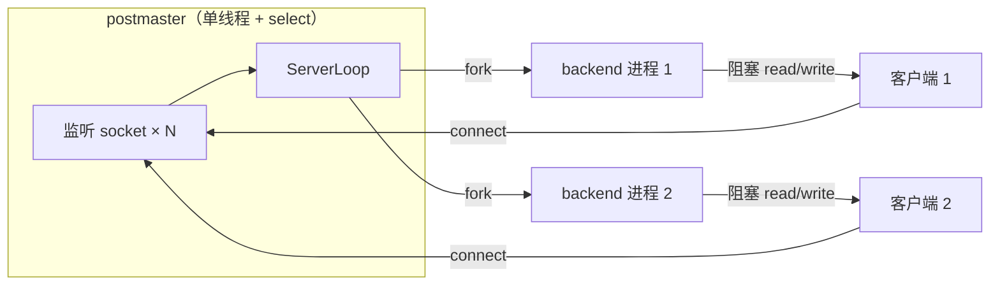
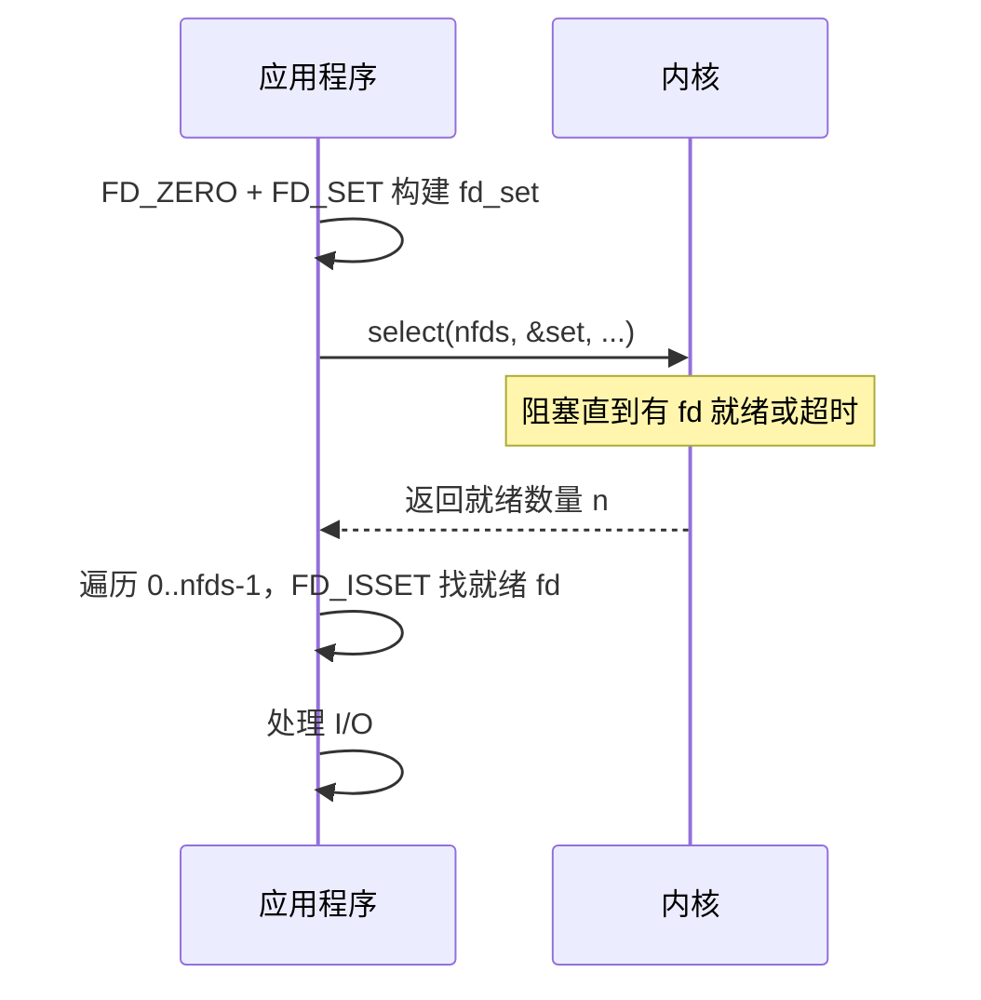
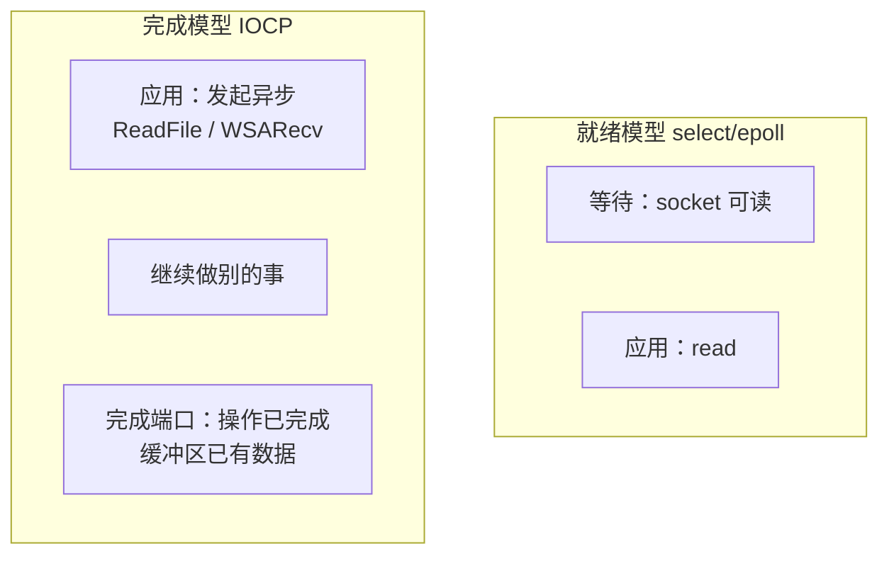

# I/O 多路复用技术指南

> 目标读者：有 C 基础、网络经验不多，正在看 OpenHalo / PostgreSQL postmaster 的 `select` 监听模型。
> 建议：先读第 1–2 节，再按需查各 API，最后看第 10 节与 PG 的对照（含为何不用 epoll、为何无 accept 惊群）。

---

## 目录

1. [为什么需要 I/O 多路复用](#1-为什么需要-io-多路复用)
2. [演进时间线与阶段对比](#2-演进时间线与阶段对比)
3. [select](#3-select)
4. [poll](#4-poll)
5. [epoll（Linux）](#5-epolllinux)
6. [kqueue（BSD / macOS）](#6-kqueuebsd--macos)
7. [/dev/poll（Solaris）](#7devpollsolaris)
8. [Windows IOCP](#8-windows-iocp)
9. [io_uring（Linux 现代方案）](#9-io_uringlinux-现代方案)
10. [与 PostgreSQL postmaster ServerLoop 的关系](#10-与-postgresql-postmaster-serverloop-的关系)
11. [综合对比表](#11-综合对比表)
12. [记忆要点](#12-记忆要点)
13. [进一步阅读](#13-进一步阅读)

---

## 1. 为什么需要 I/O 多路复用

### 1.1 前置概念：socket 就是"网络版文件描述符"

C 开发者对文件操作不陌生：

```c
int fd = open("/tmp/data", O_RDONLY);   // 打开文件，得到 fd
read(fd, buf, 1024);                     // 从 fd 读数据
close(fd);                               // 关闭
```

网络编程也一样，套用的是同一套 Unix 机制：

```c
int fd = socket(...);    // 创建一个网络端点，返回的也是 int fd
read(fd, buf, 1024);     // 从网络读数据，和读文件一样的 API
close(fd);               // 关闭网络连接
```

在 Unix/Linux 里，socket 与普通文件一样，都用**文件描述符**（fd）指代，并共用 `read`/`write`/`close` 等接口。语义并不完全相同：普通文件在 `select`/`epoll` 上通常始终“可读/可写”；socket 的就绪与否取决于内核缓冲与连接状态。差别主要在数据从哪里来、何时算就绪，而不是“完全是另一种对象”。

### 1.2 网络连接的基础四步

一个 TCP 服务器的起步永远是四步：

```c
int listen_fd = socket(AF_INET, SOCK_STREAM, 0);   // 1. 创建 socket
bind(listen_fd, &addr, sizeof(addr));               // 2. 绑定地址和端口
listen(listen_fd, 5);                                // 3. 标记为监听状态
int client_fd = accept(listen_fd, NULL, NULL);       // 4. 接受一个客户端连接
```

#### 第一步：`socket` — 创建端点

`socket()` 返回一个文件描述符。此时尚未绑定地址，也未进入监听状态。

#### 第二步：`bind` — 绑定本地地址

把 socket 绑到具体地址和端口（例如 `0.0.0.0:5432`），之后客户端才能连到该端点。

#### 第三步：`listen` — 变为监听 socket

`listen(fd, 5)` 把 socket 标成**被动（监听）socket**：只负责接收新连接，自身不再做普通数据读写。

第二个参数 `5` 是 `backlog`。按 Linux `listen(2)`（查询日期 2026-07-17）：自 2.2 起，TCP 上它限制的是**已完成三次握手、等待 `accept` 取走**的队列长度（accept queue），并受 `/proc/sys/net/core/somaxconn` 封顶；未完成握手另有 SYN 相关限制（如 `tcp_max_syn_backlog`）。队列满时，客户端可能收到 `ECONNREFUSED`，或在支持重传的协议下请求被忽略以便稍后重试。不宜笼统写成「再排队或一律拒绝」。

#### 第四步：`accept` — 取出一个已完成连接

`accept(listen_fd)` **从已完成连接队列取出一个连接**，返回新的连接 fd。

```
                      ┌─────────────┐
客户端1 ──连接完成──►  │ accept      │
客户端2 ──连接完成──►  │ queue       │ ◄── accept(listen_fd) 从队首取
客户端3 ──连接完成──►  │ (已完成队列) │     ──► 返回 client_fd
                      └─────────────┘
```

**为什么 accept 要返回另一个 fd**？原因在于 `listen_fd` 和 `client_fd` 有不同的职责：

| fd | 角色 | 生存期 |
|----|------|--------|
| `listen_fd`（监听 socket） | 只接受新连接，不读写业务数据 | 服务器启动到关闭 |
| `client_fd`（连接 socket） | 与该客户端收发数据 | 从 `accept` 返回到 `close` |

`listen_fd` 一直活着，持续接收新连接；每次 `accept` 返回的 `client_fd` 都是一个新的、独立的 fd。后续与客户端的所有数据交互，包括 `read`、`write`，都通过 `client_fd` 进行。

> **注意 `accept` 和 `read` 的返回值不同**：`accept` 返回一个**新的 fd**（整数），后续用这个 fd 代表该客户端；`read` 返回**读到的字节数**，实际数据填在传入的 `buf` 指向的内存里。两者都返回 `int`，但含义完全不同。

### 1.3 阻塞 accept 与多连接困境

#### "阻塞"的含义

调用 `accept(listen_fd)` 时，若 accept 队列为空，进程在内核中挂起，直到有新连接完成或信号中断。这与在用户态空转（busy-wait）不同：阻塞等待期间进程不占 CPU。

`read(fd, buf, len)` 同理：接收缓冲区无数据时阻塞；有数据时返回**实际读到的字节数**（可能小于 `len`，即**短读**）。

#### 单客户端：阻塞可接受

只服务一个客户端时，生命周期是一条直线：

```
accept（等到连接）→ read（等到数据）→ 处理 → write → 回到 accept
```

此时每步阻塞只占用这一个会话的进度，让出 CPU 往往合理。

#### 多客户端：一个 read 卡住全部

要同时服务多个客户端时，单线程阻塞模型就不行了：

```
时刻1：accept 返回客户端 A 的 fd
时刻2：read(fd_A, ...) 阻塞，等待 A 的数据
时刻3：客户端 B 已完成握手，停在 accept queue；
       客户端 C 的数据已在内核接收缓冲；
       进程仍卡在 read(fd_A, ...)，无法处理 B/C
```

单线程里若长期阻塞在某一个 `read` 上，其他已就绪的连接同样得不到调度：慢连接拖死整条事件路径。

### 1.4 三种经典解决思路（可并存）

| 思路 | 做法 | 解决什么 | 不解决什么 |
|------|------|----------|------------|
| **多进程/多线程 per-connection** | 每来一个连接 fork/创建一个 worker | 每个连接有独立执行流，互不阻塞 | 进程/线程数量随连接数线性增长，内存与调度开销大 |
| **I/O 多路复用** | 一个线程用 `select`/`epoll` 等同时监视多个 fd，谁就绪处理谁 | 用少量线程管理大量连接 | 处理某个就绪 fd 时，一次阻塞 `read` 就会卡死整个线程，其他就绪 fd 全部饿死（除非 fd 设为非阻塞） |
| **异步 I/O** | 提交 I/O 请求后立即返回，完成后回调（`io_uring`、IOCP） | 连"等待就绪"的轮询/阻塞都可省掉 | 编程模型复杂，生态与可移植性各异 |

#### 为什么多路复用还需要非阻塞 I/O？

上面表格提到多路复用"不解决处理某个 fd 时的阻塞问题"。这具体什么意思？用一个完整例子说明。

先搭建好 select 的监视集合，只放一个 listen_fd：

```c
fd_set read_set, rfds;
FD_ZERO(&read_set);
FD_SET(listen_fd, &read_set);
int nfds = listen_fd + 1;    // select 要求 nfds = 最大 fd + 1
```

然后进入事件循环（**伪代码**：省略错误处理；生产代码须检查返回值）：

```c
for (;;) {
    rfds = read_set;                                     // 每次调用前恢复
    select(nfds, &rfds, NULL, NULL, NULL);

    for (int i = 0; i < nfds; i++) {
        if (!FD_ISSET(i, &rfds)) continue;

        if (i == listen_fd) {
            int client = accept(listen_fd, NULL, NULL);
            FD_SET(client, &read_set);
            if (client + 1 > nfds) nfds = client + 1;
        } else {
            /* 已连接 client_fd 若为阻塞模式：
               select 只保证「至少 1 字节可读」，不保证 read(..., 4) 能读满 4 字节。
               缓冲区不足时 read 会一直阻塞，循环无法处理其他就绪 fd。 */
            read(i, buf, 4);
        }
    }
}
```

`FD_ISSET(fd, &rfds)` 检查 `select` 返回位图中 fd 对应位是否为 1。

**问题**：`select` 报告 client fd「可读」仅表示接收缓冲区**至少有 1 字节**；阻塞 `read(fd, buf, 4)` 在数据不足 4 字节时会**一直等待**，事件循环卡死在该 fd 上。

**解决办法：把 client fd 设为非阻塞。** 位置在 `accept` 之后、加入监视之前：

```c
int client = accept(listen_fd, NULL, NULL);
fcntl(client, F_SETFL, O_NONBLOCK);   // 设成非阻塞
FD_SET(client, &read_set);
```

`listen_fd` 与 `client_fd` 待遇不同，因为“可读”含义不同：

| fd 类型 | select 说“可读”的含义 | 后续调用 | 若保持阻塞 |
|---------|----------------------|----------|------------|
| `listen_fd` | accept queue 非空（通常至少有一个已完成连接） | `accept` | 单进程独占该 listen fd 时，一般立即返回；见下方例外 |
| `client_fd` | 接收缓冲至少有 1 字节（POSIX `read` 允许短读，见 [read(2)](https://man7.org/linux/man-pages/man2/read.2.html)、[POSIX read](https://pubs.opengroup.org/onlinepubs/9799919799.2024edition/functions/read.html)） | `read` | 请求长度大于当前可读字节时可能一直阻塞 |

例外（accept 竞争）：多个进程/线程共享同一 listen socket，并都在 `select`/`poll`/`epoll_wait` 上等待时，一个连接可能唤醒多个等待者，但只有一个 `accept` 能取到该连接，其余可能阻塞（阻塞 `accept`）或得到 `EAGAIN`（非阻塞）。这与“惊群”（thundering herd）相关；现代 Linux 对阻塞在 `accept` 上的等待者已有排他唤醒改进，但“多路复用监视同一 listen fd”仍可能惊群，可用 `EPOLLEXCLUSIVE`、`SO_REUSEPORT` 等缓解（见 [epoll(7)](https://man7.org/linux/man-pages/man7/epoll.7.html)、Cloudflare 等讨论）。PostgreSQL postmaster 是**单进程** `accept`，不落入此类竞争。

设为非阻塞后，`read` 不再为凑满请求长度而睡眠：

```c
n = read(fd, buf, 4);
if (n < 0) {
    if (errno == EAGAIN) {
        /* 内核缓冲区暂时空了，没数据可读。回到事件循环等下一轮。 */
        continue;
    }
} else if (n > 0) {
    /* n 可能是 1、2、3、4；有多少拿多少，绝不阻塞。
       如果 n=2，说明客户端只发了 2 字节，后面可能还有。
       已读的 2 字节应存到应用层缓冲区（如 `conn->rbuf`），
       下次 select 说这个 fd 又可读时，接着读剩下的。 */
}
```

非阻塞 `read`：有数据就返回（可短于请求长度）；无数据则返回 `-1` 且 `errno == EAGAIN`（或 `EWOULDBLOCK`），把控制权交回事件循环。应用层需自己维护已读进度，攒齐消息再处理。

多路复用决定“处理哪个 fd”，非阻塞 I/O 保证“处理时不把整条循环卡住”。二者配合才稳；仅多路复用而保留阻塞 client socket，慢连接仍会拖死循环。

---

多进程模型与 I/O 多路复用解决不同层面的问题，可以组合：

- **I/O 多路复用**：一个线程如何知道哪些 fd 当前可读/可写
- **多进程 per-connection**（PG 的 fork 模型）：连接建立后由谁跑完整会话逻辑

PostgreSQL postmaster 正是两者结合：用 `select` 监视少量监听 socket；有新连接则 **fork backend**，后续读写由子进程以阻塞方式处理，不再经过 postmaster 的多路复用。



### 1.5 非阻塞 I/O + 多路复用：通用模式

1.4 节用 `select` 展示了模式，这里提炼成通用的结论。它适用于后面要讲的所有多路复用 API（select、poll、epoll、kqueue）：

1. 所有被监视的 fd（`listen_fd` 除外）都设成 `O_NONBLOCK`
2. 多路复用返回"fd 可读了"
3. `read`，能拿多少拿多少，不够就存到应用层缓冲区，回到事件循环
4. 下次同一 fd 再次就绪时，接着读

**另一种选择：多路复用 + 多进程。** 上面的模式适用于"单线程内管理所有客户端数据读写"的场景（Nginx 就是典型）。但也可以像 PG postmaster 那样，回到 1.4 节的表格，选另一种组合。postmaster 用 `select` 只做 `accept` + `fork`，不碰客户端数据读写。读写交给 backend 子进程，每个子进程只服务一个连接，阻塞也互不影响。这就是 1.4 节说的：多路复用和多进程**不是互斥的**，各管一层。

---

## 2. 演进时间线与阶段对比

| 阶段 | 年代/背景 | 没有新技术前怎么做 | 新技术解决什么 | 遗留问题 |
|------|-----------|-------------------|----------------|----------|
| **阻塞 + 多进程** | 早期 Unix | 主进程 `accept`，每连接 `fork` 子进程 | 简单可靠，隔离性好 | 进程重；连接上万（常称 C10K）时难撑 |
| **select** | 1983 BSD | 无法单线程监视多 fd；或只能轮询（busy-wait） | 内核一次返回多个就绪 fd | `FD_SETSIZE` 上限；fd_set 拷贝；O(n) 扫描 |
| **poll** | SVR4（System V Release 4）/ POSIX | select 的 fd 上限与位图不便 | 用数组代替位图，无硬编码 1024 上限 | 仍 O(n) 扫描全部 pollfd |
| **/dev/poll** | Solaris | 同 poll 的扩展性瓶颈 | Solaris 特有高性能接口 | 仅 Solaris；已较少使用 |
| **kqueue** | FreeBSD 4.1 (2000) | poll 的 O(n) | 内核事件队列 + kevent，高效增删 | 主要 BSD/macOS |
| **epoll** | Linux 2.5.45 (2002) | poll/select 在万级连接下扫描成本高 | 关注集留在内核；`epoll_wait` 按就绪数收割；`epoll_ctl` 约 O(log n) | Linux 专用；ET 易踩坑 |
| **IOCP** | Windows NT | select 在 WinSock 上语义与性能都差 | 完成端口模型，与 Windows 线程池深度集成 | Windows 专用；完成事件而非就绪事件 |
| **io_uring** | Linux 5.1 (2019) | epoll 仍有一次次系统调用开销 | 共享环形队列批量提交/收割 I/O | 较新；API 与心智模型仍在演进 |

### 演进逻辑（ASCII）

```
单连接阻塞
    │
    ▼
多进程/fork（C 少时可行，PG 仍用此处理已接受连接）
    │
    ▼
select ──► poll ──► epoll / kqueue / IOCP  （解决"如何高效等待多 fd"）
    │                    │
    │                    ▼
    │              io_uring（进一步减少 syscall 次数）
    │
    └──► 与 fork/线程池并存，各管一层
```

---

## 3. select

### 3.1 原型

```c
int select(int nfds,
           fd_set *readfds,
           fd_set *writefds,
           fd_set *exceptfds,
           struct timeval *timeout);
```

- `nfds`：所有被监视 fd 中**最大值 + 1**（不是 fd 个数）
- `readfds` / `writefds` / `exceptfds`：三个**位图**（`fd_set`），分别表示关心读、写、异常的 fd
- `timeout`：`NULL` 表示一直阻塞；`{0,0}` 表示非阻塞轮询
- 返回：就绪 fd 数量；0 表示超时；`-1` 表示错误

辅助宏：`FD_ZERO`（清空位图）、`FD_SET`（把 fd 加入位图）、`FD_CLR`（移除）、`FD_ISSET`（检查 fd 是否在就绪位图中）。

### 3.2 工作流程



### 3.3 三个著名缺陷

#### （1）`FD_SETSIZE` 上限

Linux glibc 里，`FD_SETSIZE` 默认为 **1024**。`FD_SET` 对 `fd >= FD_SETSIZE` 的 fd 是**未定义行为**。可通过重新编译 glibc 或换用 `poll`/`epoll` 绕过，但可移植代码通常遵守 1024 限制。

#### （2）fd_set 在内核与用户态之间拷贝

`select` 是系统调用，用户态和内核态各自拥有一块独立内存。调用过程分两步拷贝：

```
用户态                         内核态
──────                         ──────
readmask（主副本，不变）
    │
    ├── rmask = readmask ──►   select(nfds, &rmask, ...)
    │                          kernel 读 rmask：「我关心 fd 0,3,5」
    │                          kernel 等待...
    │                          fd 3 就绪了
    │                          kernel 修改 rmask：清空所有位，只保留 fd 3 的位
    │   ◄── 拷贝回用户态 ──     rmask 现在只包含 fd 3
    │
FD_ISSET(3, &rmask) → 1
FD_ISSET(0, &rmask) → 0（被内核清掉了！）
```

关键：内核**覆写**传入的 `fd_set`，调用前的内容被销毁。所以不能只用一个 `fd_set` 反复传，否则下一轮 select 会丢失监视的全部 fd。正确的做法是保留一份**主副本**（`readmask`），每次调用前拷贝过去：

```c
fd_set rmask, readmask;
/* 初始化 readmask 一次 */
FD_ZERO(&readmask);
FD_SET(fd_0, &readmask);
FD_SET(fd_3, &readmask);
FD_SET(fd_5, &readmask);

for (;;) {
    rmask = readmask;          /* 从主副本恢复：fd 0,3,5 */
    select(nfds, &rmask, ...);  /* 内核覆写 rmask：只剩就绪的 fd */
    /* 此时 rmask 已损坏，下一轮必须重新从 readmask 拷贝 */
}
```

PG postmaster 的 `ServerLoop` 正是这个模式（用 `memcpy` 而非结构体赋值，见第 10 节）。

> **拷贝问题的演进**：除 io_uring 外，多路复用每次调用都涉及内核与用户态之间的数据搬运，差别在搬多少。select/poll 每次拷贝**全量关注列表**（O(N)）。epoll/kqueue 注册一次后，每次只拷回**就绪事件**（O(K)）。io_uring 用共享环减少**控制面**拷贝；普通 `read`/`write` 的**数据面**仍常需拷贝，registered buffer / `SEND_ZC` 等才改变数据路径成本（见第 9 节）。

#### （3）O(n) 扫描

- 内核：扫描 0 到 `nfds-1` 的所有位
- 用户态：返回后用 `FD_ISSET` 再扫一遍

监视的 fd 少时（个位数到几十个），这完全可接受。fd 上万时，CPU 就浪费在"扫描未就绪的 fd"上了。

### 3.4 优点（为何至今仍常见）

- **POSIX 标准**，几乎所有平台都有（含 Windows Winsock（Windows Sockets API），语义略有差异）
- API 简单，适合 fd 数量极少的场景
- 跨平台库（如 libevent 的早期后端）普遍支持

---

## 4. poll

### 4.1 原型

```c
struct pollfd {
    int   fd;        /* 要监视的 fd；-1 表示忽略此项 */
    short events;    /* 关心的事件：POLLIN、POLLOUT 等 */
    short revents;   /* 返回时由内核填写实际发生的事件 */
};

int poll(struct pollfd *fds, nfds_t nfds, int timeout);
```

### 4.2 相对 select 的改进

| 点 | select | poll |
|----|--------|------|
| fd 上限 | `FD_SETSIZE`（通常 1024） | 仅受 `RLIMIT_NOFILE` 等系统限制 |
| 数据结构 | 位图 `fd_set` | `struct pollfd` 数组 |
| 添加 fd | 改位图 + 可能调整 nfds | 数组中加一项 |
| 返回结果 | 覆盖传入的 fd_set | 写入每项的 `revents` |

### 4.3 仍存在的问题：拷贝 + O(n) 扫描

poll 解决了 select 的 fd 上限问题，但 select 的后两个缺陷它都没能解决。

**（1）每次调用仍要拷贝整个数组。** 和 select 的 `fd_set` 拷贝一样，用户态把整个 `pollfd` 数组传给内核，内核遍历后回写 `revents`。数组多大就拷多少，调用越频繁，拷贝开销越大。

**（2）O(n) 扫描。** 内核仍要遍历整个 `fds` 数组（长度 `nfds`），连接数 N 很大时开销线性增长。

根本原因在于 poll 没有"注册一次、反复等待"的持久句柄概念。每次都要把**全部**关注列表拷贝进内核，内核每次也要从头扫描。这个双重开销正是 epoll 要解决的核心问题。

`ppoll` 是 `poll` 的增强版（可纳秒级超时、信号掩码），本质局限相同。

### 4.4 使用示例

```c
#define MAX_FDS 1024

struct pollfd fds[MAX_FDS];
fds[0].fd = listen_fd;
fds[0].events = POLLIN;           // 关心可读事件
int nfds = 1;

for (;;) {
    int n = poll(fds, nfds, -1);   // -1 = 一直阻塞直到有事件
    if (n < 0) { /* 错误处理 */ break; }

    for (int i = 0; i < nfds; i++) {
        if (!(fds[i].revents & POLLIN)) continue;  // 不是可读事件，跳过

        if (fds[i].fd == listen_fd) {
            int client = accept(listen_fd, NULL, NULL);
            fcntl(client, F_SETFL, O_NONBLOCK);
            fds[nfds].fd = client;
            fds[nfds].events = POLLIN;
            nfds++;
        } else {
            char buf[4096];
            int nr = read(fds[i].fd, buf, sizeof(buf));
            if (nr <= 0) {
                /* 连接关闭或出错：把最后一项移到当前位置，收缩数组 */
                close(fds[i].fd);
                fds[i] = fds[nfds - 1];
                nfds--;
                i--;              // 回退，检查刚移过来的项
            } else {
                /* 处理读到的数据（nr 可能短于 sizeof(buf)） */
            }
        }
    }
}
```

和 select 相比，poll 代码少了 `FD_ZERO`/`FD_SET`/`FD_ISSET` 那套位图操作，添加新 fd 直接在数组末尾追加即可。但连接关闭时删除中间项需要指针搬运（上面的 `fds[i] = fds[nfds-1]`），这是数组结构的固有代价。

---

## 5. epoll（Linux）

> **适用**：Linux 2.6+ 高并发网络服务常用。Nginx 在支持多种方法的平台上会自动选较高效者，Linux 上一般为 epoll（[官方 events 文档](https://nginx.org/en/docs/events.html)，查询日期 2026-07-17）。Redis 的 ae 事件库在 Linux 上走 `ae_epoll.c`（[源码](https://github.com/redis/redis/blob/unstable/src/ae_epoll.c)）。二者是否用 ET，见 5.3，勿混为一谈。

### 5.1 三个系统调用

```c
int epoll_create1(int flags);           /* 创建 epoll 实例 */
int epoll_ctl(int epfd, int op, int fd, struct epoll_event *event);
                                        /* EPOLL_CTL_ADD/MOD/DEL */
int epoll_wait(int epfd, struct epoll_event *events,
               int maxevents, int timeout);
```

**核心思想**：把"关心哪些 fd"通过 `epoll_ctl` **注册进内核**，之后 `epoll_wait` 只返回**就绪的** fd，无需每次传递全量列表。

### 5.2 内核数据结构（理解用，非调用必需）

Linux 内核 epoll 实现（经典设计，见 `fs/eventpoll.c`）大致包含：

```
epoll 实例
├── 红黑树（interest list）：已注册 fd；epoll_ctl 增删改约 O(log n)
├── 就绪链表（ready list）：当前有事件的 fd；回调挂链约 O(1)
└── 等待队列：epoll_wait 阻塞时挂接的进程/线程
```

`epoll_wait` 从就绪链表收割事件，开销与**本次就绪数 k**相关（常见写法 O(k)），不随总监视数 n 线性扫描。`epoll_ctl` 走红黑树，为 O(log n)。热路径通常是 `epoll_wait`，不是反复 `epoll_ctl`。

另有 **eventfd** 等可纳入 epoll，用于线程间唤醒（与网络 fd 统一事件源）。

### 5.3 水平触发（LT）与边缘触发（ET）

这是 epoll 的一个关键设计选择，直接影响代码的组织方式。

#### 两种模式对比

| 模式 | 行为 | 直观理解 |
|------|------|----------|
| **LT**（Level Triggered，默认） | 条件仍成立就会在后续 `epoll_wait` 中再次报告 | 缓冲里还有未读数据 → 还会通知 |
| **ET**（Edge Triggered，`EPOLLET`） | 主要在状态从未就绪变为就绪时通知 | 边沿通知一次；未读尽则可能不再通知，直到再次出现边沿 |

依据：[epoll(7)](https://man7.org/linux/man-pages/man7/epoll.7.html)（查询日期 2026-07-17）。LT 是默认；未指定 `EPOLLET` 时语义接近更快的 `poll`。

#### LT

```c
/* LT：数据未读完，下次 epoll_wait 通常仍会报告该 fd */
ev.events = EPOLLIN;                         // 默认 LT
epoll_ctl(epfd, EPOLL_CTL_ADD, fd, &ev);

/* epoll_wait 返回 fd 可读 */
n = read(fd, buf, sizeof(buf));              // 例如只读了部分
/* 内核缓冲若仍有数据，下次 epoll_wait 还会再报告 */
```

即使配了阻塞 socket，也不容易因“漏事件”而永久饿死某 fd（1.4 节的阻塞 `read` 风险仍在：一次读请求过长仍可能卡住整条循环）。迁移自 `select`/`poll` 时改造成本较低。

#### ET

ET 在边沿通知；若一次没读尽，剩余字节仍留在内核缓冲（并未从连接上消失），但在没有新边沿前，`epoll_wait` 可能不再报告该 fd。应用若停在等待上，就会表现为「有数据却等不到事件」。man 页用 pipe 读写例子说明了这一点。

```c
/* ET：应用应读到 EAGAIN；未读尽时不会“丢字节”，但可能丢后续通知 */
struct epoll_event ev;
ev.events = EPOLLIN | EPOLLET;
ev.data.fd = fd;
epoll_ctl(epfd, EPOLL_CTL_ADD, fd, &ev);

/* epoll_wait 返回可读后： */
while (1) {
    n = read(fd, buf, sizeof(buf));
    if (n < 0) {
        if (errno == EAGAIN) break;          // 当前已无更多可读
        /* 错误处理 */
    }
    if (n == 0) { /* EOF */ break; }
    /* 处理数据 */
}
/* 提前退出循环：缓冲里可能还有数据，且在新边沿到来前不再通知 */
```

硬性要求：

1. fd **必须非阻塞**。ET 依赖读到 `EAGAIN` 才停；阻塞 fd 在缓冲空时会睡死在 `read` 上，拖死事件循环。
2. 应循环读到 `EAGAIN`（或错误/EOF）。提前退出不等于内核删数据，但等于自愿放弃下一次通知，直到对端再写入等新边沿。

#### 何时用哪个

| 场景 | 常用选择 | 原因 |
|------|----------|------|
| 原型、工具、从 select/poll 迁移 | LT | 语义接近 poll，不易因漏读而饿死 |
| fd 很少 | LT | 多几次 `epoll_wait` 返回通常可忽略 |
| 高并发长连接、愿维护非阻塞状态机 | ET | 可减少重复就绪通知（须读到 `EAGAIN`） |

**有源码依据的默认触发方式（勿外推为“业界惯例”）**（查询日期 2026-07-17）：

- Redis `ae_epoll.c`：`epoll_ctl` 只或上 `EPOLLIN`/`EPOLLOUT`，**无 `EPOLLET`** → **LT**。
- Nginx `ngx_epoll_module.c`：连接注册使用 `EPOLLIN|EPOLLOUT|EPOLLET|...` → **ET**。

通用事件库可能为降低误用风险默认 LT；部署前以所用版本文档/源码为准。

### 5.4 使用示例（LT 模式）

```c
int epfd = epoll_create1(0);
struct epoll_event ev, events[64];

/* 把 listen_fd 加入监视 */
ev.events = EPOLLIN;                  // 默认 LT
ev.data.fd = listen_fd;
epoll_ctl(epfd, EPOLL_CTL_ADD, listen_fd, &ev);

for (;;) {
    int n = epoll_wait(epfd, events, 64, -1);
    for (int i = 0; i < n; i++) {
        int fd = events[i].data.fd;   // 从就绪事件里取出 fd

        if (fd == listen_fd) {
            int client = accept(listen_fd, NULL, NULL);
            fcntl(client, F_SETFL, O_NONBLOCK);
            ev.events = EPOLLIN;
            ev.data.fd = client;
            epoll_ctl(epfd, EPOLL_CTL_ADD, client, &ev);
        } else {
            char buf[4096];
            int nr = read(fd, buf, sizeof(buf));
            if (nr <= 0) {
                epoll_ctl(epfd, EPOLL_CTL_DEL, fd, NULL);
                close(fd);
            } else {
                /* 处理读到的数据 */
            }
        }
    }
}
```

说明：
- `events[i].data.fd` 是注册时写入的值，内核原样带回；返回数组中每一项都是就绪事件，无需再扫全部 fd。
- 关闭连接时用 `EPOLL_CTL_DEL` 注销。
- 本例为 LT；改 ET 时加上 `EPOLLET`，并在 `read` 外循环至 `EAGAIN`。

---

## 6. kqueue（BSD / macOS）

### 6.1 原型

```c
int kqueue(void);
int kevent(int kq,
           const struct kevent *changelist, int nchanges,
           struct kevent *eventlist, int nevents,
           const struct timespec *timeout);
```

`kevent` 一次调用可同时**提交变更**（注册/删除关注）和**取出事件**。
不仅支持 socket，还支持文件、进程、信号、定时器（`EVFILT_TIMER`）等，比 epoll 覆盖面更广。

### 6.2 与 epoll 的对比直觉

| | epoll | kqueue |
|---|-------|--------|
| 平台 | Linux | FreeBSD、OpenBSD、macOS 等 |
| 注册/等待 | `epoll_ctl` + `epoll_wait` | 常合并到 `kevent` |
| 触发模式 | LT / ET | 类似 LT 的"过滤器"语义 |
| 非 socket 事件 | 主要靠 eventfd 等扩展 | 原生支持多种过滤器 |

在 macOS 上写高性能服务器，kqueue 的地位相当于 Linux 上的 epoll。

### 6.3 使用示例

```c
int kq = kqueue();

/* 注册 listen_fd */
struct kevent changes[1];
EV_SET(&changes[0], listen_fd, EVFILT_READ, EV_ADD, 0, 0, NULL);
kevent(kq, changes, 1, NULL, 0, NULL);

struct kevent events[64];
for (;;) {
    int n = kevent(kq, NULL, 0, events, 64, NULL);
    for (int i = 0; i < n; i++) {
        int fd = (int)events[i].ident;     // kevent 用 ident 标识 fd
        if (fd == listen_fd) {
            int client = accept(listen_fd, NULL, NULL);
            fcntl(client, F_SETFL, O_NONBLOCK);
            EV_SET(&changes[0], client, EVFILT_READ, EV_ADD, 0, 0, NULL);
            kevent(kq, changes, 1, NULL, 0, NULL);
        } else {
            char buf[4096];
            int nr = read(fd, buf, sizeof(buf));
            if (nr <= 0) {
                EV_SET(&changes[0], fd, EVFILT_READ, EV_DELETE, 0, 0, NULL);
                kevent(kq, changes, 1, NULL, 0, NULL);
                close(fd);
            } else {
                /* 处理读到的数据 */
            }
        }
    }
}
```

和 epoll 的结构几乎一样，区别在于：
- `kevent` 一次调用同时处理**注册变更**（`changelist`）和**等待事件**（`eventlist`）。上面把 `EV_ADD` 和 `EV_DELETE` 作为变更立即提交（`nevents=0`），事件等待则在循环头部的 `kevent(..., events, 64, ...)` 中完成
- 就绪事件用 `events[i].ident` 获取 fd，而非 epoll 的 `events[i].data.fd`
- kqueue 原生支持 `EVFILT_TIMER`（定时器）、`EVFILT_PROC`（进程监控）等过滤器，无需像 Linux 那样用 eventfd 组合

---

## 7. /dev/poll（Solaris）

Solaris 提供的 `/dev/poll` 字符设备接口：用户态写入监视的 poll 结构，通过 `ioctl` 等待事件。设计目标与 epoll 类似：避免每次传递完整 poll 数组。随着 Solaris 市场份额下降以及 `event ports` 等更新 API 出现，讨论度已很低；可视为 Solaris 上针对 poll O(n) 的注册式接口。
---

## 8. Windows IOCP

**I/O Completion Port**（完成端口）是 Windows 高性能 I/O 的核心机制。与 Linux 的"就绪模型"（readable/writable）不同，IOCP 是**完成模型**：

- 发起异步读/写（Overlapped I/O）
- 操作**完成后**，内核把结果放入完成端口队列
- 线程池从端口取完成包继续处理



### 使用示例（伪代码）

```c
/* 每个连接的状态：重叠结构 + 缓冲区 */
typedef struct {
    OVERLAPPED ov;
    SOCKET sock;
    char buf[4096];
    WSABUF wsa_buf;
} conn_t;

HANDLE iocp = CreateIoCompletionPort(INVALID_HANDLE_VALUE, NULL, 0, 0);

/* 将 listen socket 关联到完成端口（key=0 标记为监听事件） */
CreateIoCompletionPort((HANDLE)listen_fd, iocp, 0, 0);

/* 进循环之前，先投递第一个异步 accept，否则循环里无事可等 */
conn_t *pending_accept = calloc(1, sizeof(conn_t));
AcceptEx(listen_fd, pending_accept->sock, /* ... 参数省略 ... */,
         &pending_accept->ov);

for (;;) {
    DWORD bytes;
    ULONG_PTR key;
    OVERLAPPED *ov;

    /* 等待任意 I/O 操作完成（阻塞直到有结果） */
    GetQueuedCompletionStatus(iocp, &bytes, &key, &ov, INFINITE);

    if (key == 0) {
        /* key=0 → listen socket 上的 AcceptEx 完成 */
        conn_t *conn = pending_accept;
        CreateIoCompletionPort((HANDLE)conn->sock, iocp, (ULONG_PTR)conn, 0);
        /* 立即投递这个新连接的异步 WSARecv */
        conn->wsa_buf.buf = conn->buf;
        conn->wsa_buf.len = sizeof(conn->buf);
        WSARecv(conn->sock, &conn->wsa_buf, 1, NULL, 0, &conn->ov, NULL);

        /* 重新投递下一个 AcceptEx，为下一个客户端做准备 */
        pending_accept = calloc(1, sizeof(conn_t));
        AcceptEx(listen_fd, pending_accept->sock, /* ... */,
                 &pending_accept->ov);
    } else {
        /* key=conn → 某个客户端连接的 I/O 完成了 */
        conn_t *conn = (conn_t *)key;
        if (bytes == 0) { closesocket(conn->sock); free(conn); }
        else {
            /* conn->buf 里已有 bytes 字节数据，直接处理 */
            /* 处理完后再次投递 WSARecv 等下一次数据到达 */
            WSARecv(conn->sock, &conn->wsa_buf, 1, NULL, 0, &conn->ov, NULL);
        }
    }
}
```

和 epoll 的最大区别：epoll 返回"可以读了"，还需自己调 `read`；IOCP 返回"已经读完了，数据在 `conn->buf` 里"。**内核代为执行了 read**。

API 对应关系：

| IOCP API | Unix 对应 | 说明 |
|----------|----------|------|
| `AcceptEx` | `accept` | 功能一样。但 AcceptEx 是**异步**的，调用后立即返回，结果通过完成端口通知 |
| `WSARecv` / `ReadFile` | `read` | 功能一样。同样是异步的，数据由内核直接写入指定的缓冲区 |
| `CreateIoCompletionPort(fd, iocp, key)` | `epoll_ctl(ADD)` | 把 fd 关联到完成端口，这个 fd 上的异步操作完成后，结果会放到 iocp |
| `GetQueuedCompletionStatus` | `epoll_wait` / `select` | **真正的等待**，阻塞直到有 I/O 操作完成，而非等到 fd "可操作" |

PostgreSQL 在 Windows 上仍用 Winsock 的 `select` 做 postmaster 监听（与 Unix 代码路径类似），但 Windows 生态里大规模服务更常选 IOCP（IIS、C# `SocketAsyncEventArgs` 等）。

---

## 9. io_uring（Linux 现代方案）

### 9.1 解决什么问题

即使 epoll 已经很高效，高 IOPS（每秒 I/O 操作数）场景下**系统调用次数**本身仍是瓶颈：

```
read/write/connect/accept  each ──► syscall
epoll_wait                 ──► syscall
```

**io_uring**（Linux 5.1+，持续演进）通过**共享内存环形队列**让用户态与内核批量交换 I/O 请求与完成事件，大幅减少 syscall，并统一文件 I/O、网络、超时等操作。

### 9.2 核心结构

io_uring 在用户态和内核态之间建立**两块共享内存环形缓冲区**：

```
用户态                              内核态
──────                              ──────

SQ（Submission Queue，提交队列）
┌───┬───┬───┬───┐
│ S │ S │ S │   │  ──►  内核消费 SQE，执行 I/O 操作
│ Q │ Q │ Q │   │         （accept / read / write / ...）
│ E │ E │ E │   │
└───┴───┴───┴───┘

CQ（Completion Queue，完成队列）
┌───┬───┬───┬───┐
│ C │ C │ C │   │  ◄──  内核填入 CQE，报告执行结果
│ Q │ Q │ Q │   │         （返回值、错误码、user_data）
│ E │ E │ E │   │
└───┴───┴───┴───┘
```

流程：用户态往 SQ 里写 SQE（Submission Queue Entry，提交队列项）→ `io_uring_submit` 通知内核（**一次 syscall**）→ 内核消费 SQ，执行 I/O → 往 CQ 写 CQE（Completion Queue Entry，完成队列项）→ 用户态从 CQ 取 CQE，处理结果。

和 epoll 的本质区别：epoll 的 interest/ready 结构在内核私有内存中，交互靠 syscall；io_uring 的 SQ/CQ 是**同一块物理内存映射到两边**，控制面元数据不必每次全量拷贝。

**数据缓冲区拷贝**（查询日期 2026-07-17）：普通 `io_uring_prep_read`/`write` 仍会在内核与用户缓冲之间搬数据；`io_uring_register_buffers`（registered/fixed buffer）主要减少反复 pin/map 的开销，**不等于**自动零拷贝（liburing 维护者说明见 [axboe/liburing#1393](https://github.com/axboe/liburing/issues/1393)）。网络侧真正少拷贝需配合 `IORING_OP_SEND_ZC` 等专用操作；文件侧常与 `O_DIRECT` + fixed buffer 相关。见 [io_uring_registered_buffers(7)](https://www.man7.org/linux/man-pages/man7/io_uring_registered_buffers.7.html)。

常用库：`liburing`，封装 ring 初始化与 SQE/CQE 操作。

### 9.3 使用示例（伪代码）

```c
char buf[4096];   /* 教学示例：单连接串行 read；多连接并发时须每连接独立缓冲区 */
struct io_uring ring;
io_uring_queue_init(256, &ring, 0);     // 256 = SQ/CQ 槽位数

/* 投递异步 accept */
struct io_uring_sqe *sqe = io_uring_get_sqe(&ring);
io_uring_prep_accept(sqe, listen_fd, NULL, NULL, 0);
io_uring_sqe_set_data(sqe, NULL);       // user_data=NULL 标记为 accept 完成
io_uring_submit(&ring);

for (;;) {
    struct io_uring_cqe *cqe;
    io_uring_wait_cqe(&ring, &cqe);
    /* cqe->res：accept 为新 fd，read 为字节数；失败时为负 errno */
    /* cqe->user_data：提交时 set_data 写入的标签 */

    void *tag = io_uring_cqe_get_data(cqe);
    int res = cqe->res;
    io_uring_cqe_seen(&ring, cqe);       // 标记 CQE 已消费（注意：传 cqe，不是 &cqe）

    if (tag == NULL) {
        /* accept 完成 */
        int client = res;
        fcntl(client, F_SETFL, O_NONBLOCK);

        sqe = io_uring_get_sqe(&ring);
        io_uring_prep_read(sqe, client, buf, sizeof(buf), 0);
        io_uring_sqe_set_data(sqe, (void *)(intptr_t)client);
        io_uring_submit(&ring);

        /* 再投递下一个 accept */
        sqe = io_uring_get_sqe(&ring);
        io_uring_prep_accept(sqe, listen_fd, NULL, NULL, 0);
        io_uring_sqe_set_data(sqe, NULL);
        io_uring_submit(&ring);
    } else {
        /* read 完成 */
        int client = (int)(intptr_t)tag;
        if (res <= 0) {
            close(client);
            /* 未再投递则不会有后续完成事件，无需 epoll 式 DEL */
        } else {
            /* buf 中已有 res 字节；多连接并发时须每连接独立缓冲 */
            sqe = io_uring_get_sqe(&ring);
            io_uring_prep_read(sqe, client, buf, sizeof(buf), 0);
            io_uring_sqe_set_data(sqe, (void *)(intptr_t)client);
            io_uring_submit(&ring);
        }
    }
}
```

### 9.4 与其他 API 的对比

| API | 心智模型 | I/O 谁执行 | 关键等待函数 | 每次等待返回什么 |
|-----|---------|----------|-------------|----------------|
| select / poll | 哪些 fd 就绪了 | 自己调 read/write | `select` / `poll` | 就绪 fd 列表，需自己扫 |
| epoll / kqueue | 哪些 fd 就绪了 | 自己调 read/write | `epoll_wait` / `kevent` | 就绪 fd 列表，已筛选好 |
| IOCP | I/O 操作完成了吗 | **内核**代为执行 | `GetQueuedCompletionStatus` | 完成包：操作结果 + 数据已在缓冲区 |
| io_uring | I/O 操作完成了吗 | **内核**代为执行 | `io_uring_wait_cqe` | CQE：操作结果 + 数据已在缓冲区 |

批量提交：上面示例每投一个 SQE 就 `submit` 一次；也可以攒多个 SQE 后一次提交：

```c
/* 一次 submit 提交多个请求 */
sqe = io_uring_get_sqe(&ring);
io_uring_prep_read(sqe, fd1, buf1, 4096, 0);
io_uring_sqe_set_data(sqe, (void *)1);

sqe = io_uring_get_sqe(&ring);
io_uring_prep_read(sqe, fd2, buf2, 4096, 0);
io_uring_sqe_set_data(sqe, (void *)2);

sqe = io_uring_get_sqe(&ring);
io_uring_prep_accept(sqe, listen_fd, NULL, NULL, 0);
io_uring_sqe_set_data(sqe, NULL);

io_uring_submit(&ring);
```

对 postmaster 这种只监视少量 listen socket 的路径，io_uring 收益很小；高 IOPS 存储/网络路径更值得评估。

---

## 10. 与 PostgreSQL postmaster ServerLoop 的关系

### 10.1 postmaster 在做什么

postmaster 是 PG 的**守护父进程**，职责包括：

- 监听 TCP/Unix socket，接受新连接
- fork / 管理 backend、background writer、checkpointer 等子进程
- 自身**不执行 SQL**

主循环是 `ServerLoop()`（`src/backend/postmaster/postmaster.c`），注释写明这是 postmaster 的 **idle loop**。

### 10.2 代码路径（PG 14.18）

**初始化监视集合** -- `initMasks`：

```c
static int initMasks(fd_set *rmask)
{
    int maxsock = -1;
    FD_ZERO(rmask);
    for (i = 0; i < MAXLISTEN; i++) {
        int fd = ListenSocket[i];
        if (fd == PGINVALID_SOCKET) break;
        FD_SET(fd, rmask);
        if (fd > maxsock) maxsock = fd;
    }
    return maxsock + 1;   /* 即 select 的 nfds 参数 */
}
```

**主循环** -- 核心片段：

```c
nSockets = initMasks(&readmask);
for (;;) {
    memcpy(&rmask, &readmask, sizeof(fd_set));
    DetermineSleepTime(&timeout);
    selres = select(nSockets, &rmask, NULL, NULL, &timeout);

    if (selres > 0) {
        for (i = 0; i < MAXLISTEN; i++) {
            if (FD_ISSET(ListenSocket[i], &rmask)) {
                port = ConnCreate(ListenSocket[i]);  /* 内部 accept */
                if (port) {
                    BackendStartup(port);            /* fork backend */
                    StreamClose(port->sock);
                    ConnFree(port);
                }
            }
        }
    }
    /* 另：检查并启动 bgwriter、checkpointer、syslogger 等 */
}
```

### 10.3 为何 PG 仍用 select 且合理

| 因素 | PG 实际情况 | 对 API 选择的影响 |
|------|-------------|-------------------|
| 监视的 fd 数量 | 仅 `ListenSocket[]`，通常几个（IPv4/IPv6/Unix） | O(n) 扫描 n≈3，开销可忽略 |
| 连接处理模型 | `accept` 后立即 `fork`，**不在 postmaster 里 multiplex 客户端 socket** | 不需要 epoll 管理万级连接 |
| 可移植性 | 需支持 Linux、BSD、macOS、Windows 等 | `select` 几乎到处可用 |
| 代码年龄与风险 | 核心路径稳定数十年 | 换成 epoll 收益极小、回归风险大 |
| 循环内还有别的工作 | 启动子进程、检查锁文件、touch socket 等 | `select` 带超时正好驱动周期性任务 |

**对比**：Nginx worker 在**单进程内**维持成千上万**已建立**的连接，必须用 epoll/kqueue；PG 把已建立连接交给独立 backend，postmaster 只接受连接并 fork。

### 10.4 accept 竞争：为何 postmaster 几乎碰不到

高并发多 worker 常共享 listen fd，并在各自的 `epoll_wait`/`accept` 上等待。问题分两层：

1. **惊群**：同一连接就绪可能唤醒多个等待者，只有一个能 `accept` 成功，其余空转或再睡（历史上阻塞 `accept` 也曾唤醒全部等待者；多路复用监视同一 listen fd 时仍可能出现类似浪费）。缓解手段包括 `EPOLLEXCLUSIVE`（Linux 4.5+，见 epoll(7)）、`SO_REUSEPORT`（每 worker 独立 listen socket）、或应用层 accept 串行化（如旧版 Nginx `accept_mutex`）。
2. **负载不均**：共享队列 + 某些唤醒策略可能导致部分 worker 吃到更多连接（见 [Cloudflare: The Sad State of Linux Socket Balancing](https://blog.cloudflare.com/the-sad-state-of-linux-socket-balancing/)）。

postmaster **只有一个进程**对 `ListenSocket[]` 做 `select` → `accept` → `fork`，没有多 acceptor 抢同一连接，因此不必为惊群引入 `EPOLLEXCLUSIVE`/`SO_REUSEPORT`。代价是接受连接的吞吐受单进程限制；PG 的瓶颈通常在 backend 执行与共享资源，不在 postmaster 的 accept 路径。

### 10.5 两层架构

```
层次 1 — postmaster：select 监听少量 listen fd → 新连接 → fork
层次 2 — backend：单客户端会话，阻塞 read/write，直到断开
```

OpenHalo 继承同一 postmaster 架构；MySQL 协议适配落在 backend（如 `T_MySQLProtocol`），**监听层仍走 PG 的 select 模型**。

### 10.6 ServerLoop 位置（ASCII）

```
                    ┌─────────────────────────────┐
                    │         postmaster          │
                    │  ┌───────────────────────┐  │
  listen fd(s) ────►│  │ ServerLoop + select() │  │
                    │  └──────────┬────────────┘  │
                    │             │ accept+fork   │
                    └─────────────┼───────────────┘
                                  │
              ┌───────────────────┼───────────────────┐
              ▼                   ▼                   ▼
        backend 进程          bgwriter           checkpointer
        (每连接一个)          (后台写缓冲)        (检查点)
              │
              ▼
        客户端 TCP 会话（阻塞 I/O，可跑 PG 或 MySQL 协议）
```

---

## 11. 综合对比表

| 机制 | fd 数量上限 | 内核扫描方式 | 每次调用传递关注集 | 跨平台 | 触发模式 | 典型场景 |
|------|-------------|--------------|-------------------|--------|----------|----------|
| **select** | `FD_SETSIZE`（常 1024） | O(nfds) | 是（整个 fd_set） | 极好 | 水平 | fd 极少、要可移植（PG postmaster） |
| **poll** | 系统 ulimit | O(nfds) | 是（整个数组） | POSIX | 水平 | 中等连接、需可移植 |
| **epoll** | 很大 | 仅就绪项 | 否（epoll_ctl 注册） | Linux | LT / ET | Linux 高并发服务器 |
| **kqueue** | 很大 | 仅就绪项 | 变更与等待可合并 | BSD/macOS | 过滤器语义 | macOS/BSD 服务器 |
| **/dev/poll** | 很大 | 优于 poll | 注册式 | Solaris | 水平 | 遗留 Solaris |
| **IOCP** | 很大 | 完成队列 | 异步提交 | Windows | 完成事件 | Windows 高并发 |
| **io_uring** | 很大 | 批量 CQ | 环形队列 | Linux 5.1+ | 完成事件 | 极限 IOPS、新项目 |

### 何时选什么（实用决策）

```
需要跨平台 + fd < 10        → select（PG 做法）
需要跨平台 + fd 数百        → poll / 封装库（libevent/libuv）
Linux + 高并发长连接        → epoll（ET + 非阻塞）
macOS/BSD                   → kqueue
Windows 原生高性能            → IOCP
Linux + 批量磁盘/网络 I/O   → 评估 io_uring
```

---

## 12. 记忆要点

1. 多路复用回答“等哪些 fd”；fork/线程回答“谁执行会话”。PG 两层都要。
2. 阻塞 `read`/`accept` 会占住单线程；多路复用可同时等待多个 fd。处理就绪 fd 时若再用阻塞 `read` 读固定长度，仍可能卡死循环，故常配非阻塞 + 应用层缓冲。
3. select 三大成本：`FD_SETSIZE`、fd_set 往返拷贝、O(n) 扫描。postmaster 的 n 很小，这些都不构成问题。
4. poll 去掉硬编码 fd 上限，仍 O(n)；epoll/kqueue 把关注集留在内核，`wait` 按就绪数收割；`epoll_ctl` 约 O(log n)。
5. LT：条件仍在就反复通知。ET：边沿通知，须非阻塞并读到 `EAGAIN`；未读尽不会“删掉”内核数据，但可能暂时不再通知。
6. 就绪模型（epoll）返回“可以做 I/O”；完成模型（IOCP/io_uring）返回“操作已结束”。io_uring 共享环减少控制面拷贝，普通 read/write 数据路径仍常有拷贝。
7. 单进程内海量已建立连接 → 需要 epoll/kqueue；postmaster 只持有 listen socket 且单进程 accept → select 足够，也无多 worker accept 惊群。

---

## 13. 进一步阅读

### man 页（Linux）

```bash
man 2 select
man 2 poll
man 7 epoll
man 2 epoll_create
man 2 epoll_ctl
man 2 epoll_wait
man 2 io_uring_setup    # 需较新 man-pages
```

BSD/macOS：`man 2 kqueue`、`man 2 kevent`
Windows：MSDN -- *I/O Completion Ports*

### 内核与权威文档

- Linux **Epoll** 原理（LWN）：[Epoll is broken](https://lwn.net/Articles/703882/) 及后续讨论
- **io_uring** 官方 wiki：https://kernel.dk/io_uring.pdf（Jens Axboe）
- 《UNIX Network Programming, Volume 1》（Stevens）第 6 章 -- I/O 多路复用经典教材

### PostgreSQL 源码

| 文件 | 内容 |
|------|------|
| `src/backend/postmaster/postmaster.c` | `ServerLoop`、`initMasks`、`BackendStartup` |
| `src/backend/libpq/pqcomm.c` | 监听 socket 创建 |
| `src/bin/pg_dump/parallel.c` | 工具侧也用 `select` 等多路复用（worker 管道） |

### 练习建议

1. 用 `strace -e trace=select,accept -p <postmaster_pid>` 观察 postmaster 阻塞在 `select` 上，连接到来时 `accept` + `fork`。
2. 写一个最小 echo server：先单线程阻塞版，再 `select` 版，对比代码结构。
3. （Linux）将 echo server 改为 `epoll` ET + 非阻塞，体会 `EAGAIN` 处理。

---

*文档整理基于 PostgreSQL 14.18 postmaster；事实核对日期 2026-07-17（POSIX/Linux man、Nginx/Redis 源码与官方文档）。*
